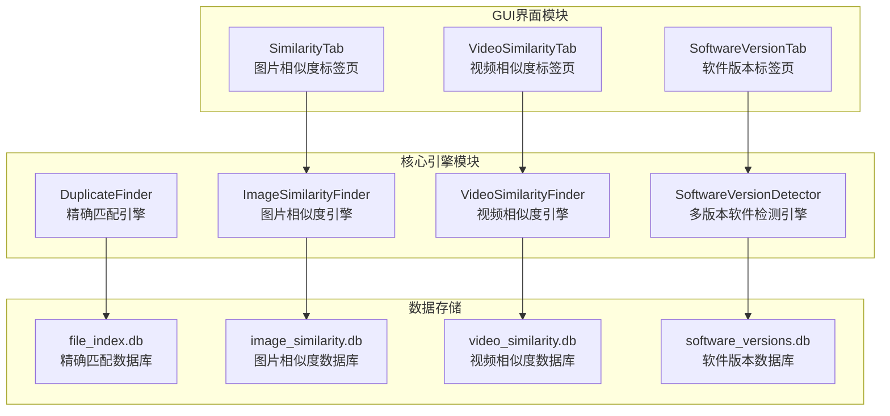
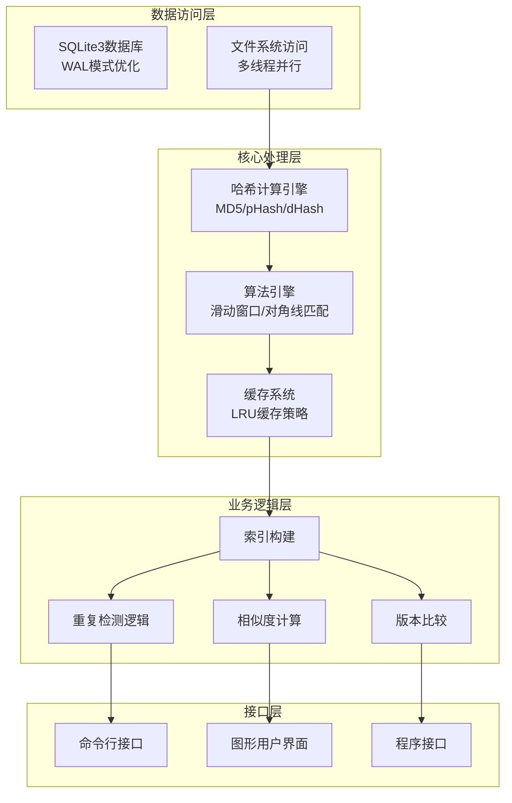
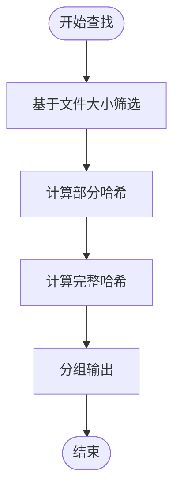
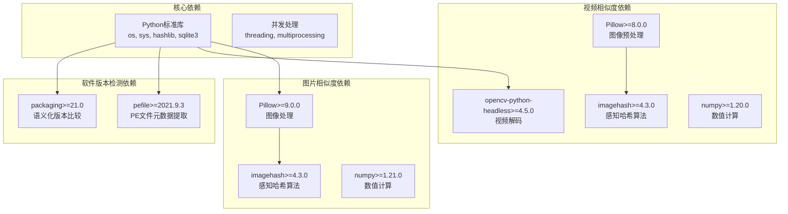
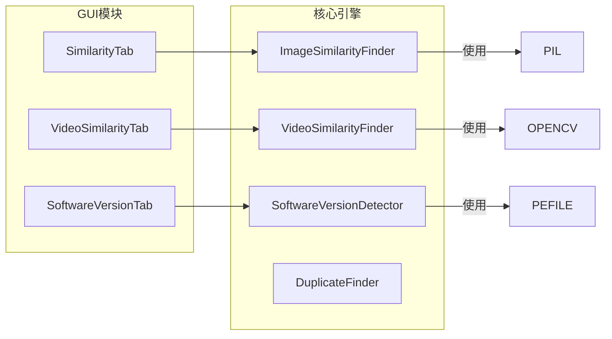
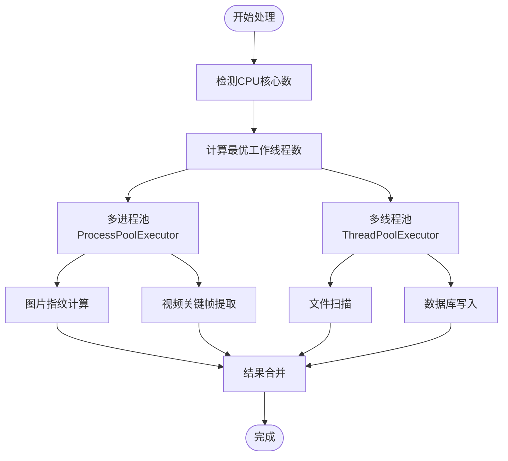

# API参考文档

<cite>
**本文档引用的文件**
- [duplicate_finder.py](file://core/duplicate_finder.py)
- [visual_similarity.py](file://core/visual_similarity.py)
- [video_similarity.py](file://core/video_similarity.py)
- [software_version_detector.py](file://core/software_version_detector.py)
- [similarity_tab.py](file://gui_modules/similarity_tab.py)
- [video_similarity_tab.py](file://gui_modules/video_similarity_tab.py)
- [software_version_tab.py](file://gui_modules/software_version_tab.py)
- [README.md](file://README.md)
- [requirements.txt](file://requirements.txt)
</cite>

## 目录
1. [简介](#简介)
2. [项目结构](#项目结构)
3. [核心组件](#核心组件)
4. [架构概览](#架构概览)
5. [详细组件分析](#详细组件分析)
6. [依赖分析](#依赖分析)
7. [性能考虑](#性能考虑)
8. [故障排除指南](#故障排除指南)
9. [结论](#结论)

## 简介

本文档提供了文件重复校验工具四个核心引擎类的完整API参考文档。该工具是一个功能强大的文件重复校验系统，支持精确匹配、图片相似度检测、视频相似度检测和多版本软件检测四大核心功能。

系统采用多级过滤策略和多进程并行计算，能够高效处理TB级大规模数据。所有核心功能都基于Python标准库实现，无需额外依赖即可运行精确匹配功能。

## 项目结构

项目采用模块化设计，核心引擎位于`core/`目录，GUI界面位于`gui_modules/`目录：



**图表来源**
- [duplicate_finder.py:22-588](file://core/duplicate_finder.py#L22-L588)
- [visual_similarity.py:94-622](file://core/visual_similarity.py#L94-L622)
- [video_similarity.py:174-772](file://core/video_similarity.py#L174-L772)
- [software_version_detector.py:30-738](file://core/software_version_detector.py#L30-L738)

**章节来源**
- [README.md:338-401](file://README.md#L338-L401)

## 核心组件

### DuplicateFinder（精确匹配引擎）

DuplicateFinder类实现了基于MD5哈希的精确文件重复检测系统，采用三级过滤策略：

- **第一级过滤**：基于文件大小筛选
- **第二级过滤**：基于部分哈希（前1MB）快速筛选  
- **第三级过滤**：基于完整哈希（MD5）精确匹配

### ImageSimilarityFinder（图片相似度引擎）

ImageSimilarityFinder类实现了基于感知哈希的图片相似度检测系统，采用三级过滤策略：

- **pHash快速筛选**：感知哈希（DCT变换提取低频特征）
- **dHash二次验证**：差异哈希（相邻像素梯度比较）
- **颜色直方图精确比对**：RGB三通道分布相似度

### VideoSimilarityFinder（视频相似度引擎）

VideoSimilarityFinder类实现了基于关键帧序列匹配的视频相似度检测系统：

- **动态关键帧提取**：根据视频时长动态确定采样策略
- **帧哈希计算**：每帧计算pHash和dHash
- **滑动窗口匹配**：寻找最长公共子序列
- **对角线序列分析**：识别连续相似的帧序列

### SoftwareVersionDetector（多版本软件检测引擎）

SoftwareVersionDetector类实现了基于PE元数据提取的多版本软件检测系统：

- **PE信息提取**：ProductName + CompanyName + FileVersion
- **智能软件识别**：三级优先级算法
- **语义化版本比较**：使用packaging库进行版本比较
- **路径版本号提取**：从安装路径中提取版本信息

**章节来源**
- [duplicate_finder.py:22-588](file://core/duplicate_finder.py#L22-L588)
- [visual_similarity.py:94-622](file://core/visual_similarity.py#L94-L622)
- [video_similarity.py:174-772](file://core/video_similarity.py#L174-L772)
- [software_version_detector.py:30-738](file://core/software_version_detector.py#L30-L738)

## 架构概览

系统采用分层架构设计，从底层到上层依次为：



**图表来源**
- [duplicate_finder.py:56-113](file://core/duplicate_finder.py#L56-L113)
- [visual_similarity.py:123-188](file://core/visual_similarity.py#L123-L188)
- [video_similarity.py:205-258](file://core/video_similarity.py#L205-L258)
- [software_version_detector.py:109-161](file://core/software_version_detector.py#L109-L161)

## 详细组件分析

### DuplicateFinder 类 API规范

#### 构造函数
```python
def __init__(self, db_path: str = "file_index.db", chunk_size: int = 65536,
             max_workers: int = None, progress_callback=None, stop_flag=None, 
             log_callback=None, clear_db: bool = True, allowed_extensions: set = None):
```

**参数说明：**
- `db_path`: SQLite数据库文件路径，默认"file_index.db"
- `chunk_size`: 文件读取块大小，默认65536字节
- `max_workers`: 并行工作线程数，默认自动检测CPU核心数
- `progress_callback`: 进度回调函数，接收(progress: float, message: str)
- `stop_flag`: 停止标志，用于中断扫描操作
- `log_callback`: 日志回调函数，接收(message: str, level: str)
- `clear_db`: 是否清空数据库，默认True
- `allowed_extensions`: 允许的文件后缀集合，默认None（不过滤）

**返回值：** 无（构造函数）

#### 核心方法

##### scan_directories(directories: List[str])
**功能：** 扫描多个目录，收集文件信息

**参数：**
- `directories`: 目录路径列表

**返回值：** 无

**异常：** 目录不存在时抛出异常

##### find_duplicates() -> List[List[Dict]]
**功能：** 查找重复文件，使用多级哈希策略

**返回值：** 重复文件组列表，每个组包含多个文件信息字典

**算法流程：**


**图表来源**
- [duplicate_finder.py:229-285](file://core/duplicate_finder.py#L229-L285)

##### export_results(duplicate_groups: List[List[Dict]], output_file: str = "duplicates.json")
**功能：** 导出重复文件结果为JSON格式

**参数：**
- `duplicate_groups`: 重复文件组列表
- `output_file`: 输出文件路径，默认"duplicates.json"

**返回值：** 无

##### print_summary()
**功能：** 打印扫描摘要信息

**返回值：** 无

**章节来源**
- [duplicate_finder.py:22-588](file://core/duplicate_finder.py#L22-L588)

### ImageSimilarityFinder 类 API规范

#### 构造函数
```python
def __init__(self, db_path: str = "image_similarity.db", batch_size: int = 1000,
             progress_callback=None, log_callback=None):
```

**参数说明：**
- `db_path`: SQLite数据库路径，默认"image_similarity.db"
- `batch_size`: 批处理大小，默认1000张图片/批
- `progress_callback`: 进度回调函数
- `log_callback`: 日志回调函数

**返回值：** 无

#### 核心方法

##### scan_images(directories: List[str]) -> Iterator[Dict]
**功能：** 扫描目录中的所有图片文件

**参数：**
- `directories`: 目录列表

**返回值：** 文件信息迭代器，每个元素包含{'path': str, 'size': int, 'modified_time': float}

##### build_index(directories: List[str], incremental: bool = False)
**功能：** 构建图片索引

**参数：**
- `directories`: 要扫描的目录列表
- `incremental`: 是否增量扫描，默认False（全量扫描）

**返回值：** 无

##### find_similar_groups(threshold_phash: int = 12, mode: str = "precise") -> List[Dict]
**功能：** 查找相似图片组

**参数：**
- `threshold_phash`: pHash汉明距离阈值，默认12
- `mode`: 检测模式，"fast"或"precise"，默认"precise"

**返回值：** 相似组列表

**检测模式说明：**
- `fast`模式：仅使用pHash快速筛选
- `precise`模式：使用pHash+dHash+直方图三级过滤

##### delete_image(image_id: int) -> bool
**功能：** 删除指定的图片记录

**参数：**
- `image_id`: 图片ID

**返回值：** 删除是否成功

##### get_statistics() -> Dict
**功能：** 获取数据库统计信息

**返回值：** 统计信息字典

**章节来源**
- [visual_similarity.py:94-622](file://core/visual_similarity.py#L94-L622)

### VideoSimilarityFinder 类 API规范

#### 构造函数
```python
def __init__(self, db_path: str = "video_similarity.db", batch_size: int = 100,
             progress_callback=None, log_callback=None):
```

**参数说明：**
- `db_path`: SQLite数据库路径，默认"video_similarity.db"
- `batch_size`: 批处理大小，默认100个视频/批
- `progress_callback`: 进度回调函数
- `log_callback`: 日志回调函数

**返回值：** 无

#### 核心方法

##### scan_videos(directories: List[str]) -> Iterator[Dict]
**功能：** 扫描目录中的所有视频文件

**参数：**
- `directories`: 目录列表

**返回值：** 视频文件信息迭代器，包含{'path': str, 'size': int}

##### build_index(directories: List[str], incremental: bool = False)
**功能：** 构建视频索引

**参数：**
- `directories`: 要扫描的目录列表
- `incremental`: 是否增量扫描，默认False（全量扫描）

**返回值：** 无

##### find_similar_groups(threshold_phash: int = 12, mode: str = "precise") -> List[Dict]
**功能：** 查找相似视频组

**参数：**
- `threshold_phash`: pHash汉明距离阈值，默认12
- `mode`: 检测模式，默认"precise"

**返回值：** 相似视频组列表

##### delete_video(video_id: int) -> bool
**功能：** 删除指定的视频记录

**参数：**
- `video_id`: 视频ID

**返回值：** 删除是否成功

##### get_statistics() -> Dict
**功能：** 获取数据库统计信息

**返回值：** 统计信息字典

**章节来源**
- [video_similarity.py:174-772](file://core/video_similarity.py#L174-L772)

### SoftwareVersionDetector 类 API规范

#### 构造函数
```python
def __init__(self, db_path: str = "software_versions.db",
             progress_callback=None, log_callback=None):
```

**参数说明：**
- `db_path`: SQLite数据库路径，默认"software_versions.db"
- `progress_callback`: 进度回调函数
- `log_callback`: 日志回调函数

**返回值：** 无

#### 核心方法

##### build_index(directories: List[str], incremental: bool = True, extensions: Optional[set] = None)
**功能：** 构建软件索引

**参数：**
- `directories`: 要扫描的目录列表
- `incremental`: 是否启用增量扫描，默认True
- `extensions`: 要扫描的文件扩展名集合，默认None

**返回值：** 无

##### find_multiple_versions(min_versions: int = 2) -> List[Dict]
**功能：** 查找具有多个版本的软件

**参数：**
- `min_versions`: 最小版本数，默认2

**返回值：** 多版本软件组列表

##### export_results(groups: List[Dict], output_path: str)
**功能：** 导出结果为JSON

**参数：**
- `groups`: 软件组列表
- `output_path`: 输出文件路径

**返回值：** 无

##### delete_file(filepath: str) -> bool
**功能：** 删除文件并更新数据库

**参数：**
- `filepath`: 要删除的文件路径

**返回值：** 删除是否成功

**章节来源**
- [software_version_detector.py:30-738](file://core/software_version_detector.py#L30-L738)

## 依赖分析

### 外部依赖关系



**图表来源**
- [requirements.txt:10-32](file://requirements.txt#L10-L32)

### 内部模块依赖



**图表来源**
- [similarity_tab.py:373-400](file://gui_modules/similarity_tab.py#L373-L400)
- [video_similarity_tab.py:363-396](file://gui_modules/video_similarity_tab.py#L363-L396)
- [software_version_tab.py:304-350](file://gui_modules/software_version_tab.py#L304-L350)

**章节来源**
- [requirements.txt:1-32](file://requirements.txt#L1-L32)

## 性能考虑

### 并行处理策略

系统采用多进程和多线程相结合的并行处理策略：



**图表来源**
- [visual_similarity.py:281-310](file://core/visual_similarity.py#L281-L310)
- [video_similarity.py:337-366](file://core/video_similarity.py#L337-L366)
- [duplicate_finder.py:32-38](file://core/duplicate_finder.py#L32-L38)

### 数据库优化

系统采用多种数据库优化技术：

1. **WAL模式**：提高并发性能
2. **索引优化**：为常用查询字段创建索引
3. **批量操作**：减少数据库事务次数
4. **内存映射**：使用MADVISE_MMAP提高I/O性能

### 缓存策略

- **PE信息缓存**：LRU缓存策略，最大1000项
- **图片缩略图缓存**：按需加载和缓存
- **视频帧缓存**：多帧预览缓存

**章节来源**
- [duplicate_finder.py:56-94](file://core/duplicate_finder.py#L56-L94)
- [visual_similarity.py:123-169](file://core/visual_similarity.py#L123-L169)
- [software_version_detector.py:88-95](file://core/software_version_detector.py#L88-L95)

## 故障排除指南

### 常见问题及解决方案

#### 1. 依赖库缺失

**问题：** 运行时缺少必要的依赖库

**解决方案：**
```bash
pip install -r requirements.txt
```

**支持的依赖：**
- Pillow>=9.0.0：图片处理
- opencv-python-headless>=4.5.0：视频解码
- pefile>=2021.9.3：PE文件元数据提取
- packaging>=21.0：语义化版本比较

#### 2. 数据库文件过大

**问题：** 数据库文件占用过多空间

**解决方案：**
```sql
-- 清理历史数据
DELETE FROM file_index WHERE processed_at < datetime('now', '-1 year');
DELETE FROM image_index WHERE processed_at < datetime('now', '-1 year');
DELETE FROM video_index WHERE processed_at < datetime('now', '-1 year');

-- 压缩数据库
VACUUM;
```

#### 3. 扫描速度慢

**优化建议：**
1. **硬件升级**：从HDD升级到SSD
2. **调整线程数**：根据存储类型调整并行度
3. **使用增量扫描**：避免重复索引
4. **分批处理**：超大目录分多次扫描

#### 4. 相似度检测不准确

**调整参数：**
- **图片相似度**：阈值设置为12（平衡模式）
- **视频相似度**：阈值设置为0.7（范围0.5-0.95）
- **软件版本检测**：使用精确模式进行版本比较

**章节来源**
- [README.md:521-636](file://README.md#L521-L636)

## 结论

本文档详细介绍了文件重复校验工具四个核心引擎类的完整API规范。系统采用模块化设计，支持四种不同的检测模式，每种模式都有其特定的应用场景和优化策略。

### 主要特点

1. **多级过滤策略**：每种检测模式都采用多级过滤，提高检测准确率
2. **并行处理优化**：充分利用多核CPU资源，显著提升处理速度
3. **智能缓存机制**：减少重复计算，提升系统响应速度
4. **灵活的配置选项**：支持多种参数调优，适应不同使用场景
5. **完善的错误处理**：提供详细的错误信息和恢复机制

### 使用建议

1. **精确匹配**：适用于完全相同的文件检测
2. **图片相似度**：适用于抗缩放、抗压缩的图片去重
3. **视频相似度**：适用于抗剪辑、抗转码的视频去重
4. **软件版本检测**：适用于区分真正重复vs不同版本的软件

通过合理配置和参数调优，系统能够在保证检测准确率的同时，实现高效的TB级数据处理能力。