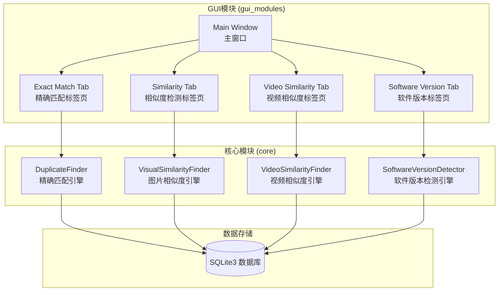
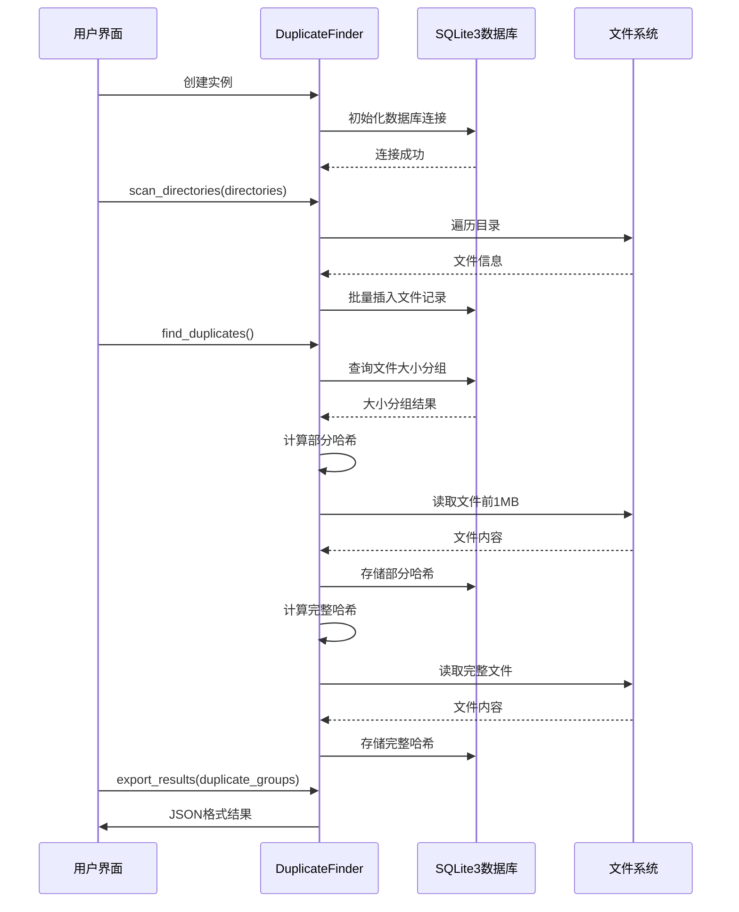
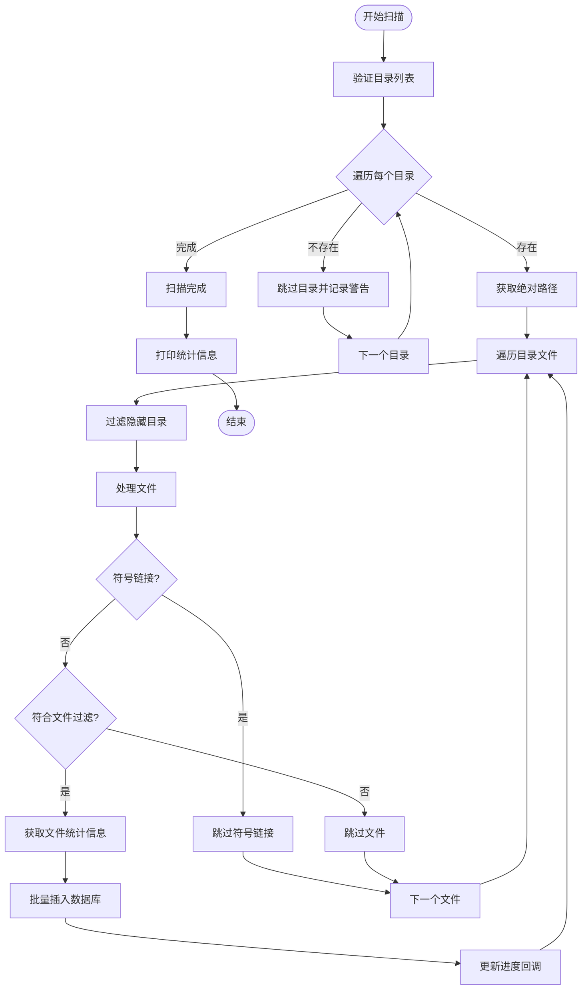
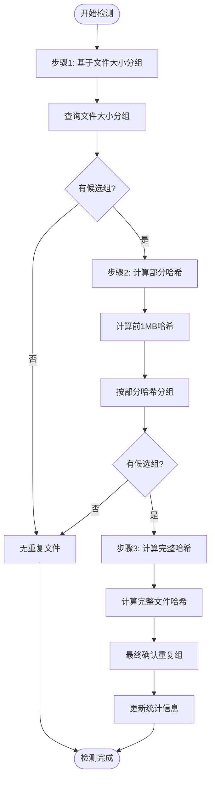
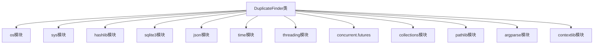
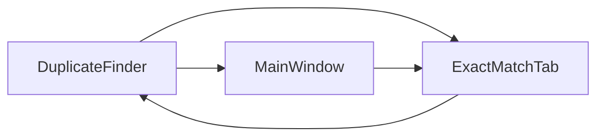

# DuplicateFinder类API

<cite>
**本文档引用的文件**
- [duplicate_finder.py](file://core/duplicate_finder.py)
- [exact_match_tab.py](file://gui_modules/exact_match_tab.py)
- [main_window.py](file://gui_modules/main_window.py)
- [__init__.py](file://core/__init__.py)
- [README.md](file://README.md)
</cite>

## 目录
1. [简介](#简介)
2. [项目结构](#项目结构)
3. [核心组件](#核心组件)
4. [架构概览](#架构概览)
5. [详细组件分析](#详细组件分析)
6. [依赖关系分析](#依赖关系分析)
7. [性能考虑](#性能考虑)
8. [故障排除指南](#故障排除指南)
9. [结论](#结论)

## 简介

DuplicateFinder类是文件重复检测系统的核心组件，采用多级哈希策略实现高性能的重复文件检测。该系统针对TB级别的大规模数据进行了专门优化，使用SQLite3数据库存储索引，支持并行处理和多级哈希校验。

系统采用三层过滤策略：
1. **文件大小分组** - 快速筛选可能重复的文件
2. **部分哈希计算** - 计算文件前1MB的MD5哈希进行快速筛选
3. **完整哈希验证** - 计算整个文件的MD5哈希进行精确匹配

## 项目结构

文件重复校验工具采用模块化架构设计，核心功能集中在core模块中：



**图表来源**
- [duplicate_finder.py:1-588](file://core/duplicate_finder.py#L1-L588)
- [exact_match_tab.py:1-941](file://gui_modules/exact_match_tab.py#L1-L941)
- [main_window.py:1-245](file://gui_modules/main_window.py#L1-L245)

**章节来源**
- [duplicate_finder.py:1-588](file://core/duplicate_finder.py#L1-L588)
- [README.md:338-708](file://README.md#L338-L708)

## 核心组件

DuplicateFinder类提供了完整的文件重复检测功能，包括目录扫描、多级哈希检测和结果导出。

### 构造函数参数

DuplicateFinder类的构造函数接受以下参数：

| 参数名 | 类型 | 默认值 | 描述 |
|--------|------|--------|------|
| `db_path` | str | `"file_index.db"` | SQLite数据库文件路径 |
| `chunk_size` | int | `65536` | 文件读取块大小（字节） |
| `max_workers` | int | `None` | 并行工作线程数（None时自动检测CPU核心数） |
| `progress_callback` | callable | `None` | 进度回调函数，接收(progress, message)参数 |
| `stop_flag` | threading.Event | `None` | 停止标志，用于中断扫描操作 |
| `log_callback` | callable | `None` | 日志回调函数，接收(message)参数 |
| `clear_db` | bool | `True` | 是否清空数据库中的旧数据 |
| `allowed_extensions` | set | `None` | 允许的文件后缀集合（None表示不过滤） |

### 初始化选项和配置参数

系统提供了多种初始化选项来优化不同场景下的性能：

- **数据库优化**：使用WAL模式、内存缓存、内存映射等SQLite3优化参数
- **并行处理**：自动检测CPU核心数，I/O密集型任务设置最优线程数
- **文件过滤**：支持按文件类型过滤，减少扫描范围
- **增量扫描**：支持增量扫描模式，避免重复索引

**章节来源**
- [duplicate_finder.py:25-54](file://core/duplicate_finder.py#L25-L54)
- [duplicate_finder.py:56-94](file://core/duplicate_finder.py#L56-L94)

## 架构概览

系统采用分层架构设计，从底层的数据存储到上层的用户界面：



**图表来源**
- [duplicate_finder.py:120-285](file://core/duplicate_finder.py#L120-L285)
- [duplicate_finder.py:453-492](file://core/duplicate_finder.py#L453-L492)

## 详细组件分析

### scan_directories方法

scan_directories方法负责扫描指定的目录列表，收集文件信息并存储到数据库中。

#### 方法签名
```python
def scan_directories(self, directories: List[str]):
```

#### 功能特性

1. **批量目录扫描**：支持同时扫描多个目录
2. **进度回调**：实时更新扫描进度和状态
3. **错误处理**：优雅处理目录不存在、权限不足等异常情况
4. **文件过滤**：支持按文件类型过滤，减少不必要的扫描

#### 目录扫描流程



**图表来源**
- [duplicate_finder.py:120-218](file://core/duplicate_finder.py#L120-L218)
- [duplicate_finder.py:158-218](file://core/duplicate_finder.py#L158-L218)

#### 批量处理机制

系统采用了高效的批量处理策略：

- **批量大小**：默认5000个文件一批，减少数据库事务开销
- **内存控制**：控制批量大小避免内存占用过高
- **进度更新**：每处理1000个文件更新一次进度，平衡性能和用户体验

**章节来源**
- [duplicate_finder.py:120-218](file://core/duplicate_finder.py#L120-L218)
- [duplicate_finder.py:220-228](file://core/duplicate_finder.py#L220-L228)

### find_duplicates方法

find_duplicates方法实现了多级哈希检测算法，通过三个阶段逐步缩小搜索范围。

#### 多级哈希检测算法



**图表来源**
- [duplicate_finder.py:229-285](file://core/duplicate_finder.py#L229-L285)
- [duplicate_finder.py:300-327](file://core/duplicate_finder.py#L300-L327)

#### 文件大小分组

第一阶段基于文件大小进行初步筛选：

- **查询策略**：使用SQL GROUP BY和HAVING子句找出重复大小的文件
- **性能优化**：数据库层面的分组操作，避免Python层面的内存排序
- **索引利用**：使用file_size索引加速查询

#### 部分哈希计算

第二阶段计算文件前1MB的MD5哈希：

- **块大小**：固定读取前1MB内容，平衡准确性和性能
- **并行处理**：使用ThreadPoolExecutor并行计算哈希
- **进度监控**：每处理500个文件更新一次进度
- **内存效率**：只读取必要字节，避免大文件的完整读取

#### 完整哈希验证

第三阶段计算完整文件的MD5哈希进行精确匹配：

- **完整读取**：逐块读取整个文件进行哈希计算
- **并行处理**：对每个候选组内的文件并行计算哈希
- **精确匹配**：只有完整哈希相同的文件才被认为是重复文件
- **统计更新**：计算重复文件数量和浪费空间

**章节来源**
- [duplicate_finder.py:229-285](file://core/duplicate_finder.py#L229-L285)
- [duplicate_finder.py:329-386](file://core/duplicate_finder.py#L329-L386)
- [duplicate_finder.py:387-451](file://core/duplicate_finder.py#L387-L451)

### export_results方法

export_results方法将检测结果导出为JSON格式文件，便于后续分析和处理。

#### JSON导出格式

导出的JSON文件包含以下结构：

```json
{
  "scan_summary": {
    "total_files_scanned": 1000,
    "total_size_scanned": 104857600,
    "total_size_formatted": "100.00 MB",
    "duplicate_groups": 50,
    "duplicate_files": 120,
    "wasted_space": 52428800,
    "wasted_space_formatted": "50.00 MB"
  },
  "duplicate_groups": [
    {
      "group_id": 1,
      "file_count": 3,
      "file_size": 1048576,
      "file_size_formatted": "1.00 MB",
      "files": [
        {
          "path": "/path/to/file1.txt",
          "size": 1048576,
          "modified_time": 1640995200.0
        },
        {
          "path": "/path/to/file2.txt", 
          "size": 1048576,
          "modified_time": 1640995300.0
        }
      ]
    }
  ]
}
```

#### 导出功能特性

- **完整统计**：包含扫描摘要和详细的重复文件组信息
- **格式化输出**：自动格式化文件大小显示
- **编码处理**：使用UTF-8编码确保中文字符正确显示
- **结构化数据**：提供易于解析的JSON格式

**章节来源**
- [duplicate_finder.py:453-492](file://core/duplicate_finder.py#L453-L492)

### print_summary方法

print_summary方法打印扫描摘要信息，提供人类可读的统计结果。

#### 统计信息输出

打印的摘要信息包括：

- **总文件数**：扫描的文件总数
- **总大小**：所有文件的总大小（自动格式化）
- **重复文件组**：发现的重复文件组数量
- **重复文件数**：重复文件的总数
- **浪费空间**：重复文件占用的总空间（自动格式化）

#### 输出格式

系统使用统一的格式化方法来显示文件大小，支持B、KB、MB、GB、TB等单位的自动转换。

**章节来源**
- [duplicate_finder.py:493-503](file://core/duplicate_finder.py#L493-L503)
- [duplicate_finder.py:505-512](file://core/duplicate_finder.py#L505-L512)

### 回调机制

DuplicateFinder类提供了三种主要的回调机制来支持GUI集成和用户交互：

#### progress_callback

进度回调函数用于实时更新扫描进度：

```python
def progress_callback(progress: float, message: str):
    """
    进度回调函数
    
    参数:
        progress: 进度百分比 (0-100)
        message: 状态描述信息
    """
```

在GUI环境中，progress_callback通常用于更新进度条和状态标签。

#### stop_flag

stop_flag是一个threading.Event对象，用于中断正在进行的扫描操作：

```python
# 在GUI中设置停止标志
stop_flag.set()

# 在扫描过程中检查停止标志
if self.stop_flag and self.stop_flag.is_set():
    raise InterruptedError("用户请求停止扫描")
```

#### log_callback

日志回调函数用于记录系统日志信息：

```python
def log_callback(message: str):
    """
    日志回调函数
    
    参数:
        message: 日志消息
    """
```

**章节来源**
- [duplicate_finder.py:41-43](file://core/duplicate_finder.py#L41-L43)
- [duplicate_finder.py:115-118](file://core/duplicate_finder.py#L115-L118)
- [duplicate_finder.py:287-298](file://core/duplicate_finder.py#L287-L298)

## 依赖关系分析

DuplicateFinder类的依赖关系相对简单，主要依赖Python标准库：



**图表来源**
- [duplicate_finder.py:7-19](file://core/duplicate_finder.py#L7-L19)

### 外部依赖

DuplicateFinder类仅依赖Python标准库，无需额外的第三方依赖：

- **Python标准库**：hashlib、threading、sqlite3、json、time、argparse等
- **无外部依赖**：完全使用内置模块实现功能

### 内部依赖

系统内部的模块依赖关系：



**图表来源**
- [exact_match_tab.py:323-349](file://gui_modules/exact_match_tab.py#L323-L349)
- [main_window.py:32-33](file://gui_modules/main_window.py#L32-L33)

**章节来源**
- [duplicate_finder.py:1-588](file://core/duplicate_finder.py#L1-L588)
- [exact_match_tab.py:1-941](file://gui_modules/exact_match_tab.py#L1-L941)
- [main_window.py:1-245](file://gui_modules/main_window.py#L1-L245)

## 性能考虑

### 数据库优化

系统使用了多种SQLite3优化技术来提升性能：

- **WAL模式**：使用Write-Ahead Logging模式提高并发性能
- **内存优化**：设置缓存大小、临时表存储位置、内存映射大小
- **索引优化**：为常用查询字段创建索引
- **事务管理**：使用上下文管理器确保事务完整性

### 并行处理优化

- **线程池管理**：使用ThreadPoolExecutor管理工作线程
- **批量处理**：减少数据库写入次数
- **进度控制**：合理控制进度更新频率，平衡性能和用户体验

### 内存管理

- **流式读取**：使用分块读取避免大文件占用过多内存
- **批量插入**：使用executemany进行批量数据库操作
- **垃圾回收**：及时释放不需要的对象引用

## 故障排除指南

### 常见问题和解决方案

#### 1. 扫描速度慢

**可能原因**：
- 硬盘性能不足（HDD vs SSD）
- 线程数设置不当
- 文件过滤设置过于宽泛

**解决方案**：
- 使用SSD硬盘
- 调整max_workers参数
- 启用文件类型过滤

#### 2. 内存使用过高

**可能原因**：
- 大文件过多
- 批量大小设置过大
- 缺少适当的内存管理

**解决方案**：
- 调整chunk_size参数
- 减少批量大小
- 确保及时释放内存

#### 3. 扫描中断

**可能原因**：
- 用户主动停止
- 系统异常
- 资源不足

**解决方案**：
- 使用stop_flag进行优雅停止
- 检查系统资源
- 适当调整并发设置

### 异常处理策略

DuplicateFinder类提供了完善的异常处理机制：

- **InterruptedError**：处理用户主动停止的异常
- **OSError/PermissionError**：处理文件访问权限问题
- **数据库异常**：使用事务管理和回滚机制
- **编码异常**：使用UTF-8编码避免字符编码问题

**章节来源**
- [duplicate_finder.py:115-118](file://core/duplicate_finder.py#L115-L118)
- [duplicate_finder.py:208-210](file://core/duplicate_finder.py#L208-L210)
- [duplicate_finder.py:287-298](file://core/duplicate_finder.py#L287-L298)

## 结论

DuplicateFinder类是一个功能完整、性能优异的文件重复检测工具。其核心优势包括：

1. **多级哈希算法**：通过三层过滤策略实现高精度和高性能
2. **并行处理**：充分利用多核CPU资源提升处理速度
3. **内存优化**：采用流式读取和批量处理避免内存占用过高
4. **数据库优化**：使用SQLite3的多种优化技术提升查询性能
5. **回调机制**：提供完整的回调接口支持GUI集成

该系统特别适合处理TB级别的大规模数据，能够有效识别完全相同的文件，为用户提供准确的重复文件检测结果。通过合理的参数配置和优化策略，可以在保证准确性的同时最大化处理性能。