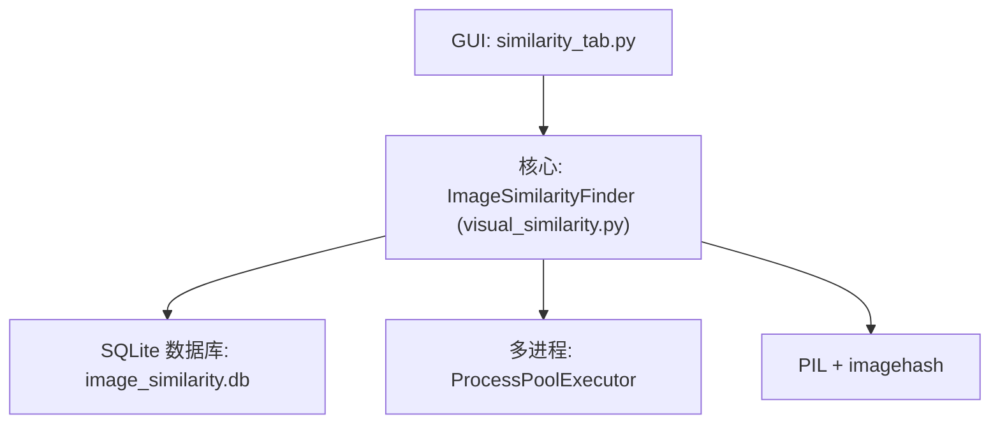
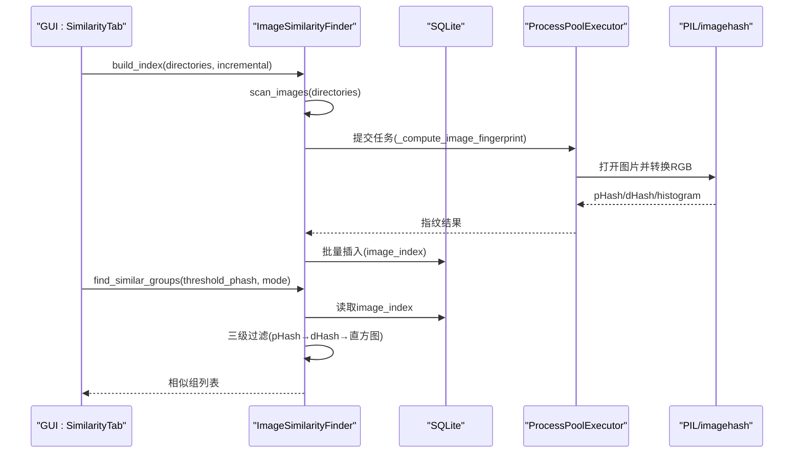
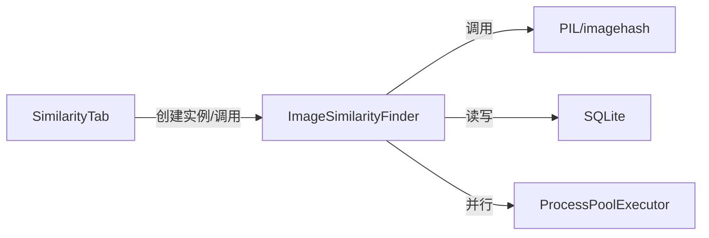

# ImageSimilarityFinder类API

<cite>
**本文引用的文件**
- [core/visual_similarity.py](file://core/visual_similarity.py)
- [docs/IMAGE_SIMILARITY_SPEC.md](file://docs/IMAGE_SIMILARITY_SPEC.md)
- [gui_modules/similarity_tab.py](file://gui_modules/similarity_tab.py)
</cite>

## 目录
1. [简介](#简介)
2. [项目结构](#项目结构)
3. [核心组件](#核心组件)
4. [架构总览](#架构总览)
5. [详细组件分析](#详细组件分析)
6. [依赖关系分析](#依赖关系分析)
7. [性能考量](#性能考量)
8. [故障排查指南](#故障排查指南)
9. [结论](#结论)
10. [附录：使用示例与最佳实践](#附录使用示例与最佳实践)

## 简介
本文件为 ImageSimilarityFinder 类的完整API文档，覆盖构造函数参数、图像处理配置、三级过滤算法（感知哈希pHash、差异哈希dHash、颜色直方图）、相似度阈值配置、多进程并行处理、进度回调机制、图像预处理流程、特征提取与相似度计算方法、以及允许的文件类型过滤。同时提供使用示例、性能优化建议与常见问题解决方案。

## 项目结构
ImageSimilarityFinder 位于 core/visual_similarity.py，GUI 通过 gui_modules/similarity_tab.py 调用该类进行图片相似度检测；规格说明在 docs/IMAGE_SIMILARITY_SPEC.md 中补充了算法背景与阈值策略。

图表来源
- [core/visual_similarity.py:94-121](file://core/visual_similarity.py#L94-L121)
- [gui_modules/similarity_tab.py:370-400](file://gui_modules/similarity_tab.py#L370-L400)

章节来源
- [core/visual_similarity.py:94-121](file://core/visual_similarity.py#L94-L121)
- [gui_modules/similarity_tab.py:370-400](file://gui_modules/similarity_tab.py#L370-L400)
- [docs/IMAGE_SIMILARITY_SPEC.md:24-78](file://docs/IMAGE_SIMILARITY_SPEC.md#L24-L78)

## 核心组件
- ImageSimilarityFinder：图片相似度检测器，负责索引构建、指纹计算、相似组查找、统计查询等。
- 全局函数 _compute_image_fingerprint：在多进程中计算单张图片的指纹（pHash、dHash、颜色直方图）。
- 数据库层：SQLite 存储图片索引与相似组信息，包含优化PRAGMA与索引。
- GUI集成：similarity_tab.py 提供用户界面，支持阈值、模式、增量扫描、格式过滤与进度展示。

章节来源
- [core/visual_similarity.py:21-91](file://core/visual_similarity.py#L21-L91)
- [core/visual_similarity.py:123-188](file://core/visual_similarity.py#L123-L188)
- [gui_modules/similarity_tab.py:370-400](file://gui_modules/similarity_tab.py#L370-L400)

## 架构总览
ImageSimilarityFinder 采用“扫描→指纹计算→批量入库→相似组查找”的流水线，结合多进程并行与批处理提升吞吐；相似度判定采用三级过滤：pHash快速筛选 → dHash二次验证（精确模式）→ 颜色直方图余弦相似度精确比对。

图表来源
- [core/visual_similarity.py:253-311](file://core/visual_similarity.py#L253-L311)
- [core/visual_similarity.py:410-513](file://core/visual_similarity.py#L410-L513)
- [gui_modules/similarity_tab.py:370-400](file://gui_modules/similarity_tab.py#L370-L400)

## 详细组件分析

### 构造函数与初始化
- 参数
  - db_path: SQLite数据库路径（默认 image_similarity.db）
  - batch_size: 批处理大小（默认1000张/批）
  - progress_callback: 进度回调函数 callback(progress: float, message: str)
  - log_callback: 日志回调函数 callback(message: str, level: str)
- 行为
  - 自动检测CPU核心数，设置最大工作进程数（最多8个）
  - 初始化数据库表与索引，启用WAL、缓存、内存映射等PRAGMA优化

章节来源
- [core/visual_similarity.py:100-121](file://core/visual_similarity.py#L100-L121)
- [core/visual_similarity.py:123-188](file://core/visual_similarity.py#L123-L188)

### 图像扫描与预处理
- 扫描目录：递归遍历，跳过隐藏目录与符号链接，仅处理支持的图片格式（.jpg/.jpeg/.png/.gif/.bmp/.webp）
- 预处理流程（多进程内）：
  - 打开图片，统一转换为RGB（处理RGBA/LA/P等模式）
  - 超大图先缩放至最大边长4096像素，避免内存溢出
  - 计算pHash（8x8=64位）、dHash（8x8），生成颜色直方图（RGB各256 bins，共768值）

章节来源
- [core/visual_similarity.py:202-239](file://core/visual_similarity.py#L202-L239)
- [core/visual_similarity.py:21-91](file://core/visual_similarity.py#L21-L91)

### 指纹计算与存储
- 指纹字段：path、width、height、phash、dhash、histogram、size、modified_time、processed_at
- 批量插入：按batch_size分批写入，减少事务开销
- 数据库优化：WAL模式、NORMAL同步、64MB缓存、MEMORY临时存储、256MB内存映射

章节来源
- [core/visual_similarity.py:253-332](file://core/visual_similarity.py#L253-L332)
- [core/visual_similarity.py:123-168](file://core/visual_similarity.py#L123-L168)

### 相似度计算与三级过滤
- 汉明距离：将十六进制哈希转为整数后异或并统计1的个数
- 直方图相似度：对768维向量计算余弦相似度
- 综合分数：加权平均（pHash权重0.5，dHash权重0.3，直方图权重0.2），输出0-100分
- 三级过滤流程：
  1) pHash快速筛选：汉明距离≤threshold_phash
  2) dHash二次验证（精确模式）：汉明距离≤threshold_phash
  3) 直方图精确比对：余弦相似度≥0.75（宽松阈值）
  - 快速模式：仅使用pHash计算分数

章节来源
- [core/visual_similarity.py:334-408](file://core/visual_similarity.py#L334-L408)
- [core/visual_similarity.py:410-513](file://core/visual_similarity.py#L410-L513)

### 相似组查找接口
- 方法：find_similar_groups(threshold_phash=12, mode="precise")
- 返回：相似组列表，每组包含group_id、file_count、avg_similarity、files（含id、path、size、width、height）
- 模式：
  - precise：执行三级过滤
  - fast：仅pHash快速模式

章节来源
- [core/visual_similarity.py:410-513](file://core/visual_similarity.py#L410-L513)

### 进度回调与日志
- 进度回调：_on_progress(progress, message)，由build_index与find_similar_groups周期性触发
- 日志回调：_log(message, level)，可注入自定义日志处理器

章节来源
- [core/visual_similarity.py:190-200](file://core/visual_similarity.py#L190-L200)
- [gui_modules/similarity_tab.py:221-232](file://gui_modules/similarity_tab.py#L221-L232)

### 文件类型过滤（allowable_extensions）
- 内置支持：.jpg/.jpeg/.png/.gif/.bmp/.webp
- GUI扩展：支持“全部”或勾选常用格式，并可输入自定义后缀（逗号/分号/空格分隔，自动补点）
- 注意：当前核心扫描逻辑基于SUPPORTED_FORMATS集合；如需动态allowable_extensions，可在GUI层传递或扩展scan_images以接受外部过滤规则

章节来源
- [core/visual_similarity.py:97-98](file://core/visual_similarity.py#L97-L98)
- [gui_modules/similarity_tab.py:308-339](file://gui_modules/similarity_tab.py#L308-L339)

## 依赖关系分析
- PIL与imagehash：用于图像加载、格式转换、pHash/dHash计算
- sqlite3：持久化索引与相似组数据
- concurrent.futures.ProcessPoolExecutor：多进程并行计算指纹
- tkinter：GUI交互（阈值、模式、进度、日志）

图表来源
- [core/visual_similarity.py:16-18](file://core/visual_similarity.py#L16-L18)
- [core/visual_similarity.py:280-311](file://core/visual_similarity.py#L280-L311)
- [gui_modules/similarity_tab.py:370-400](file://gui_modules/similarity_tab.py#L370-L400)

章节来源
- [core/visual_similarity.py:16-18](file://core/visual_similarity.py#L16-L18)
- [core/visual_similarity.py:280-311](file://core/visual_similarity.py#L280-L311)
- [gui_modules/similarity_tab.py:370-400](file://gui_modules/similarity_tab.py#L370-L400)

## 性能考量
- 多进程并行：max_workers=min(cpu_count, 8)，适合TB级大规模数据处理
- 批处理插入：batch_size=1000，降低数据库事务开销
- 数据库优化：WAL、NORMAL同步、64MB缓存、MEMORY临时存储、256MB内存映射
- 大图像缩放：最大边长4096，避免内存溢出
- 相似度计算复杂度：O(n^2)比较，可通过阈值与模式控制候选集规模

章节来源
- [core/visual_similarity.py:117-121](file://core/visual_similarity.py#L117-L121)
- [core/visual_similarity.py:123-168](file://core/visual_similarity.py#L123-L168)
- [core/visual_similarity.py:280-311](file://core/visual_similarity.py#L280-L311)
- [core/visual_similarity.py:410-513](file://core/visual_similarity.py#L410-L513)

## 故障排查指南
- 某些相似图片未检测到
  - 可能原因：汉明距离超过阈值、图片差异过大
  - 解决：提高threshold_phash或使用更宽松模式
- 不相似的图片被判定为相似
  - 可能原因：阈值过高、图片本身有相似特征
  - 解决：降低threshold_phash，人工审核确认
- 扫描速度慢
  - 可能原因：大量大图、机械硬盘I/O瓶颈
  - 解决：使用SSD、增加线程数、排除网络驱动器
- 内存溢出
  - 可能原因：同时加载过多大图、缓存过大
  - 解决：限制图片尺寸、减小缓存、增大系统内存

章节来源
- [docs/IMAGE_SIMILARITY_SPEC.md:679-726](file://docs/IMAGE_SIMILARITY_SPEC.md#L679-L726)

## 结论
ImageSimilarityFinder 提供了高效、可扩展的图片相似度检测能力，通过三级过滤与多进程并行，兼顾速度与精度；配合SQLite与GUI，便于大规模数据集的索引与可视化分析。合理配置阈值与模式，可获得稳定且可控的结果。

## 附录：使用示例与最佳实践

### 基本用法（命令行）
- 构建索引并查找相似组，支持增量扫描与阈值、模式参数

章节来源
- [core/visual_similarity.py:575-621](file://core/visual_similarity.py#L575-L621)

### GUI用法
- 在相似度标签页中设置阈值、模式、扫描方式、数据库路径与格式过滤
- 启动检测后，查看进度与日志，点击“结果”查看相似组详情

章节来源
- [gui_modules/similarity_tab.py:370-400](file://gui_modules/similarity_tab.py#L370-L400)
- [gui_modules/similarity_tab.py:308-339](file://gui_modules/similarity_tab.py#L308-L339)

### 阈值选择建议
- 严格模式：5-8（几乎完全相同）
- 平衡模式：9-15（轻微差异，默认）
- 宽松模式：16-30（明显相似）

章节来源
- [docs/IMAGE_SIMILARITY_SPEC.md:133-158](file://docs/IMAGE_SIMILARITY_SPEC.md#L133-L158)

### 性能优化建议
- 使用SSD存储
- 调整batch_size与max_workers
- 优先使用fast模式进行初筛，再对候选集使用precise模式精判
- 定期清理无效索引与备份数据库

章节来源
- [docs/IMAGE_SIMILARITY_SPEC.md:560-648](file://docs/IMAGE_SIMILARITY_SPEC.md#L560-L648)
- [core/visual_similarity.py:117-121](file://core/visual_similarity.py#L117-L121)