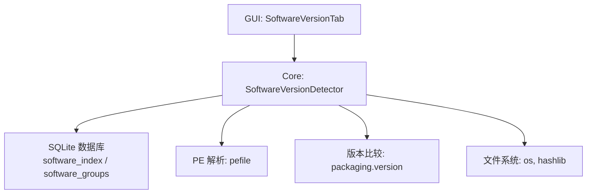
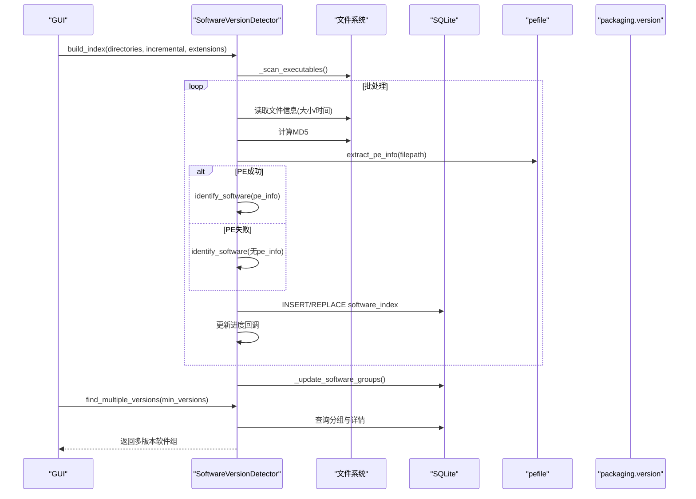
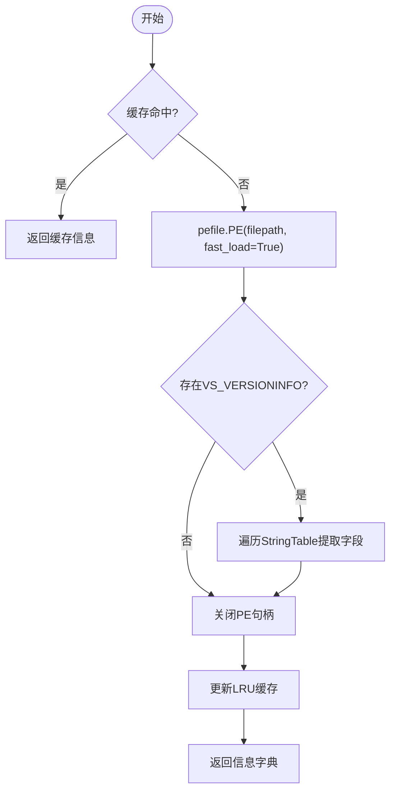
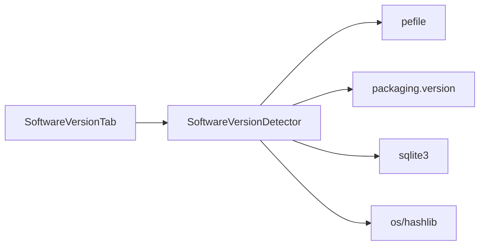

# SoftwareVersionDetector类API

<cite>
**本文引用的文件**
- [core/software_version_detector.py](file://core/software_version_detector.py)
- [gui_modules/software_version_tab.py](file://gui_modules/software_version_tab.py)
- [README.md](file://README.md)
- [requirements.txt](file://requirements.txt)
</cite>

## 目录
1. [简介](#简介)
2. [项目结构](#项目结构)
3. [核心组件](#核心组件)
4. [架构总览](#架构总览)
5. [详细组件分析](#详细组件分析)
6. [依赖关系分析](#依赖关系分析)
7. [性能与扩展性](#性能与扩展性)
8. [故障排查指南](#故障排查指南)
9. [结论](#结论)
10. [附录：使用示例与集成指南](#附录使用示例与集成指南)

## 简介
本文件为 SoftwareVersionDetector 类的完整 API 文档，聚焦于多版本软件检测能力。内容涵盖：
- 构造函数参数与 PE 文件处理配置
- detect_software_versions（实际实现为 build_index + find_multiple_versions）的 PE 元数据提取流程、文件头解析、版本信息提取与软件识别算法
- 智能软件识别：软件名称识别、版本号解析、语义化版本比较
- packaging 库的版本比较实现、兼容性检测与更新提示思路
- 文件类型过滤、批量处理与进度回调机制
- 支持的软件格式列表、版本号解析规则与错误处理策略
- 具体使用示例与集成指南

## 项目结构
SoftwareVersionDetector 位于 core 模块，GUI 层通过 software_version_tab 调用其能力，提供可视化扫描、结果展示与导出。

图表来源
- [core/software_version_detector.py:30-161](file://core/software_version_detector.py#L30-L161)
- [gui_modules/software_version_tab.py:337-350](file://gui_modules/software_version_tab.py#L337-L350)

章节来源
- [core/software_version_detector.py:30-161](file://core/software_version_detector.py#L30-L161)
- [gui_modules/software_version_tab.py:337-350](file://gui_modules/software_version_tab.py#L337-L350)

## 核心组件
- 类名：SoftwareVersionDetector
- 职责：扫描指定目录中的可执行文件，提取 PE 元数据，识别软件身份与版本，构建索引并统计多版本软件组，支持增量/全量扫描、结果导出与删除文件等。
- 关键特性：
  - 支持的文件格式：.exe, .dll, .msi, .jar, .pyd（可扩展）
  - 智能软件识别：三级优先级（PE 信息 > 文件名模式匹配 > 路径版本号提取）
  - 语义化版本比较：基于 packaging.version，兼容降级到字符串比较
  - 批量处理与进度回调：分批写入 SQLite，实时进度回调
  - 缓存：PE 信息 LRU 缓存，避免重复解析

章节来源
- [core/software_version_detector.py:30-95](file://core/software_version_detector.py#L30-L95)
- [core/software_version_detector.py:178-244](file://core/software_version_detector.py#L178-L244)
- [core/software_version_detector.py:246-316](file://core/software_version_detector.py#L246-L316)
- [core/software_version_detector.py:318-354](file://core/software_version_detector.py#L318-L354)
- [core/software_version_detector.py:356-481](file://core/software_version_detector.py#L356-L481)

## 架构总览
SoftwareVersionDetector 的工作流如下：
- 初始化：创建/连接 SQLite，优化 PRAGMA，创建表与索引
- 扫描：遍历目录，按扩展名过滤收集可执行文件
- 解析：对每个文件计算 MD5，尝试提取 PE 元数据
- 识别：根据 PE 信息或文件名/路径进行软件识别与版本解析
- 存储：将结果写入 software_index，并更新 software_groups 统计表
- 查询：按条件查询多版本软件组，导出 JSON

图表来源
- [core/software_version_detector.py:391-481](file://core/software_version_detector.py#L391-L481)
- [core/software_version_detector.py:540-604](file://core/software_version_detector.py#L540-L604)
- [gui_modules/software_version_tab.py:337-350](file://gui_modules/software_version_tab.py#L337-L350)

## 详细组件分析

### 构造函数与配置
- 参数
  - db_path: SQLite 数据库路径（默认 "software_versions.db"）
  - progress_callback: 进度回调函数 callback(progress, message)
  - log_callback: 日志回调函数 callback(message, level)
- 内部配置
  - _pe_cache: LRU 缓存，最大条目数 _max_cache_size = 1000
  - 数据库优化：WAL 模式、同步策略、缓存大小、临时存储内存
  - 表结构：software_index、software_groups；建立索引加速查询

章节来源
- [core/software_version_detector.py:72-95](file://core/software_version_detector.py#L72-L95)
- [core/software_version_detector.py:109-161](file://core/software_version_detector.py#L109-L161)

### PE 元数据提取流程（extract_pe_info）
- 依赖：pefile（可选，未安装时返回 None）
- 流程要点
  - 检查缓存命中
  - fast_load=True 打开 PE 文件
  - 遍历 VS_VERSIONINFO -> StringFileInfo -> StringTable，提取公司名、产品名、文件版本、产品版本、描述、原始文件名
  - 关闭句柄，更新缓存（LRU）
  - 异常捕获并记录警告

图表来源
- [core/software_version_detector.py:178-244](file://core/software_version_detector.py#L178-L244)

章节来源
- [core/software_version_detector.py:178-244](file://core/software_version_detector.py#L178-L244)

### 智能软件识别（identify_software）
- 三级优先级
  1) 使用 PE 信息：以 product_name + company_name 作为 software_key，版本优先取 file_version，否则 product_version，否则 unknown
  2) 文件名模式匹配：内置 30+ 常见软件正则（Python、Node.js、JDK、浏览器、Adobe、Office、IDE、Docker、Git 等），从匹配组中抽取版本号
  3) 路径版本号提取：从安装路径中匹配 v1.2.3、v1.2、v1 等模式；若仍无法识别，则以文件名作为软件名，publisher 标记 Unknown
- 输出字段：software_key、software_name、publisher、version、install_path

章节来源
- [core/software_version_detector.py:246-316](file://core/software_version_detector.py#L246-L316)

### 版本比较与排序（compare_versions、_version_sort_key）
- compare_versions(v1, v2)
  - 若 packaging 可用，则解析为 Version 对象比较，返回 -1/0/1
  - 不可用时回退为字符串比较
- _version_sort_key(version_str)
  - 能解析为 Version 的对象返回 (1, Version)，否则 (0, 字符串)
  - 用于 latest_version/oldest_version 的排序，unknown 自动排在最后

章节来源
- [core/software_version_detector.py:318-354](file://core/software_version_detector.py#L318-L354)
- [core/software_version_detector.py:527-538](file://core/software_version_detector.py#L527-L538)

### 文件类型过滤与批量处理（_scan_executables、build_index）
- 支持扩展名：.exe, .dll, .msi, .jar, .pyd（可通过 extensions 参数覆盖）
- 扫描逻辑：递归遍历目录，按扩展名过滤收集文件
- 批量处理：每批 100 个文件，计算 MD5、提取 PE、识别软件、插入数据库，提交事务
- 增量模式：若文件哈希与路径已存在且未变化，则跳过
- 进度回调：每批处理后更新进度百分比与消息

章节来源
- [core/software_version_detector.py:356-389](file://core/software_version_detector.py#L356-L389)
- [core/software_version_detector.py:391-481](file://core/software_version_detector.py#L391-L481)

### 多版本软件查询与导出（find_multiple_versions、export_results）
- find_multiple_versions(min_versions=2)
  - 查询 software_groups 中 version_count >= min_versions 的软件组
  - 获取每组详细文件列表（路径、大小、哈希、版本、安装路径、修改时间）
- export_results(groups, output_path)
  - 生成统计摘要与软件组详情，导出为 JSON（含格式化大小）

章节来源
- [core/software_version_detector.py:540-604](file://core/software_version_detector.py#L540-L604)
- [core/software_version_detector.py:606-662](file://core/software_version_detector.py#L606-L662)

### GUI 集成与进度回调（SoftwareVersionTab）
- 在 GUI 中创建 SoftwareVersionDetector，传入 progress_callback 与 log_callback
- 支持选择数据库路径、输出路径、扫描方式（全量/增量）、文件格式过滤（含自定义后缀）
- 启动扫描后调用 build_index，再调用 find_multiple_versions，最终导出 JSON

章节来源
- [gui_modules/software_version_tab.py:337-350](file://gui_modules/software_version_tab.py#L337-L350)
- [gui_modules/software_version_tab.py:237-270](file://gui_modules/software_version_tab.py#L237-L270)

## 依赖关系分析
- 外部依赖
  - pefile：PE 文件元数据提取（可选，未安装时功能降级）
  - packaging：语义化版本比较（可选，未安装时回退字符串比较）
- 标准库
  - sqlite3：数据存储与查询
  - hashlib：MD5 计算
  - os/re/json/datetime：系统交互、文本处理、序列化、时间戳
- GUI 层
  - tkinter/ttk：界面控件与样式
  - threading：后台线程执行扫描任务

图表来源
- [core/software_version_detector.py:17-27](file://core/software_version_detector.py#L17-L27)
- [requirements.txt:21-23](file://requirements.txt#L21-L23)

章节来源
- [requirements.txt:21-23](file://requirements.txt#L21-L23)
- [core/software_version_detector.py:17-27](file://core/software_version_detector.py#L17-L27)

## 性能与扩展性
- 性能优化
  - SQLite WAL 模式与索引提升并发与查询速度
  - 批处理（每批 100 条）减少事务开销
  - PE 信息 LRU 缓存降低重复解析成本
  - 增量扫描避免重复处理相同哈希文件
- 扩展点
  - SUPPORTED_EXTENSIONS：可添加新格式（如 .bin, .sys）
  - SOFTWARE_PATTERNS：新增软件识别正则与映射
  - 自定义后缀输入：GUI 支持用户追加过滤规则

章节来源
- [core/software_version_detector.py:109-161](file://core/software_version_detector.py#L109-L161)
- [core/software_version_detector.py:356-389](file://core/software_version_detector.py#L356-L389)
- [gui_modules/software_version_tab.py:237-270](file://gui_modules/software_version_tab.py#L237-L270)

## 故障排查指南
- pefile 未安装
  - 现象：extract_pe_info 返回 None
  - 处理：安装 pefile；否则仍可基于文件名/路径识别软件
- packaging 未安装
  - 现象：compare_versions 回退为字符串比较
  - 处理：安装 packaging；否则版本排序可能不准确
- 某些软件显示 unknown 版本
  - 原因：PE 无版本信息或非标准编译；路径/文件名不含版本号
  - 处理：查看软件名称是否正确识别；必要时手动筛选
- 扫描速度慢
  - 建议：SSD 存储、增量扫描、限制扩展名、分批处理大目录
- 数据库过大
  - 清理：定期 VACUUM；归档历史数据；仅保留近期结果

章节来源
- [core/software_version_detector.py:17-27](file://core/software_version_detector.py#L17-L27)
- [core/software_version_detector.py:178-244](file://core/software_version_detector.py#L178-L244)
- [core/software_version_detector.py:318-354](file://core/software_version_detector.py#L318-L354)
- [README.md:600-636](file://README.md#L600-L636)

## 结论
SoftwareVersionDetector 提供了完整的“多版本软件检测”能力，结合 PE 元数据提取、智能软件识别与语义化版本比较，能够在大规模文件集中高效识别同一软件的多个版本，并通过 SQLite 持久化与 GUI 集成提供友好的操作体验。其模块化设计便于扩展新的文件格式与软件识别规则，同时具备增量扫描与缓存优化，适合生产环境使用。

## 附录：使用示例与集成指南

### 基本用法（命令行）
- 初始化检测器，设置数据库路径与回调
- 构建索引（支持增量/全量与扩展名过滤）
- 查询多版本软件组并导出 JSON

参考路径
- [core/software_version_detector.py:717-738](file://core/software_version_detector.py#L717-L738)

### GUI 集成
- 在 GUI 中创建 SoftwareVersionDetector，绑定进度与日志回调
- 支持选择数据库与输出路径、扫描方式、文件格式过滤
- 执行扫描后查询结果并导出

参考路径
- [gui_modules/software_version_tab.py:337-350](file://gui_modules/software_version_tab.py#L337-L350)
- [gui_modules/software_version_tab.py:237-270](file://gui_modules/software_version_tab.py#L237-L270)

### 支持的软件格式列表
- 默认支持：.exe, .dll, .msi, .jar, .pyd
- 自定义：可在 GUI 中输入逗号/分号/空格分隔的后缀

参考路径
- [core/software_version_detector.py:33-34](file://core/software_version_detector.py#L33-L34)
- [gui_modules/software_version_tab.py:237-270](file://gui_modules/software_version_tab.py#L237-L270)
- [README.md:592-598](file://README.md#L592-L598)

### 版本号解析规则
- 优先级顺序：PE 元数据 > 文件名模式匹配 > 路径版本号提取
- 未知版本标记为 unknown，并在排序时置于末尾

参考路径
- [core/software_version_detector.py:246-316](file://core/software_version_detector.py#L246-L316)
- [core/software_version_detector.py:527-538](file://core/software_version_detector.py#L527-L538)

### 错误处理策略
- 依赖缺失时的降级行为（pefile/packaging）
- 文件读取/解析异常捕获与日志记录
- 数据库操作异常与事务提交保障

参考路径
- [core/software_version_detector.py:17-27](file://core/software_version_detector.py#L17-L27)
- [core/software_version_detector.py:163-176](file://core/software_version_detector.py#L163-L176)
- [core/software_version_detector.py:464-466](file://core/software_version_detector.py#L464-L466)

### 更新提示与兼容性检测（建议）
- 利用 compare_versions 判断本地版本与最新版本的关系，提示用户升级
- 结合 packaging 的预发布/后缀规则（如 alpha/beta/rc）进行更精细的比较
- 在 GUI 中展示“有新版本可用”的提示按钮

参考路径
- [core/software_version_detector.py:318-354](file://core/software_version_detector.py#L318-L354)
- [README.md:136-160](file://README.md#L136-L160)