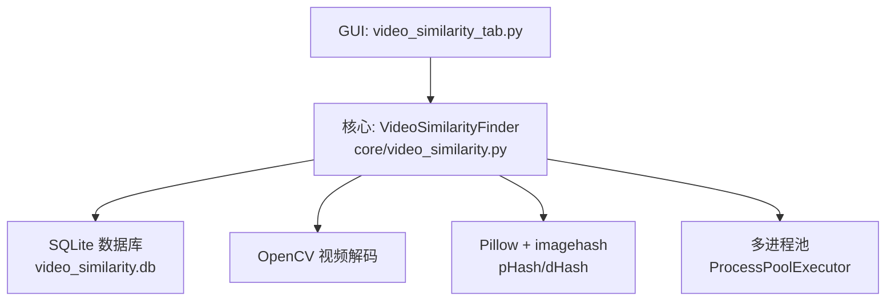
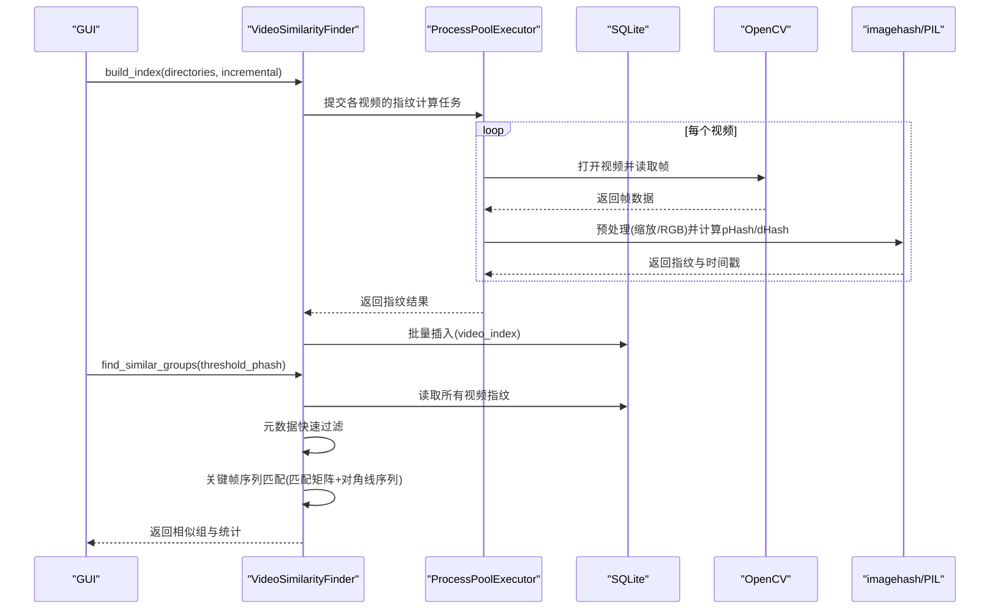
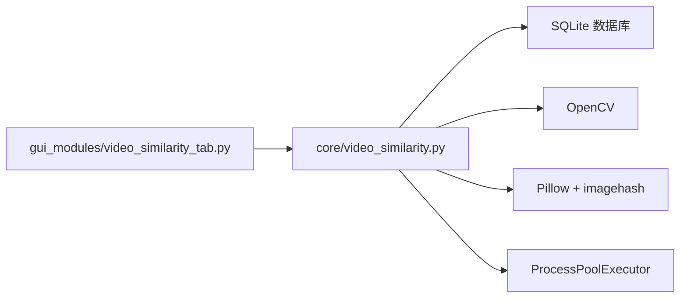

# VideoSimilarityFinder类API

<cite>
**本文引用的文件**
- [core/video_similarity.py](file://core/video_similarity.py)
- [gui_modules/video_similarity_tab.py](file://gui_modules/video_similarity_tab.py)
- [README.md](file://README.md)
- [requirements.txt](file://requirements.txt)
</cite>

## 目录
1. [简介](#简介)
2. [项目结构](#项目结构)
3. [核心组件](#核心组件)
4. [架构总览](#架构总览)
5. [详细组件分析](#详细组件分析)
6. [依赖关系分析](#依赖关系分析)
7. [性能考量](#性能考量)
8. [故障排除指南](#故障排除指南)
9. [结论](#结论)
10. [附录：使用示例与参数参考](#附录使用示例与参数参考)

## 简介
本文件为 VideoSimilarityFinder 类的完整 API 文档，覆盖构造函数参数、视频处理配置、关键帧提取策略、相似度计算流程、阈值设置、多线程/多进程并行处理、进度反馈机制、支持的视频格式、性能优化参数与内存管理策略，并提供使用示例与故障排除指南。该实现基于 OpenCV 解码、感知哈希（pHash/dHash）与滑动窗口匹配算法，结合 SQLite 索引与多进程并行计算，适用于大规模视频库的去重与相似检测。

## 项目结构
- 核心引擎位于 core/video_similarity.py，提供 VideoSimilarityFinder 类及关键帧提取、指纹计算、相似度匹配等能力。
- GUI 集成位于 gui_modules/video_similarity_tab.py，负责用户界面、参数配置、进度展示与结果呈现。
- README.md 提供功能概述、技术栈与性能基准。
- requirements.txt 列出第三方依赖（OpenCV、Pillow、imagehash、numpy 等）。

图表来源
- [core/video_similarity.py:174-240](file://core/video_similarity.py#L174-L240)
- [gui_modules/video_similarity_tab.py:379-396](file://gui_modules/video_similarity_tab.py#L379-L396)

章节来源
- [README.md:89-132](file://README.md#L89-L132)
- [requirements.txt:18-20](file://requirements.txt#L18-L20)

## 核心组件
- VideoSimilarityFinder：视频相似度检测器，封装了索引构建、相似组查找、统计查询等功能。
- 关键帧提取与指纹计算：通过 OpenCV 读取视频帧，缩放至统一尺寸，转换为 RGB，计算 pHash 与 dHash，并记录时间戳。
- 相似度计算：基于匹配矩阵与对角线序列寻找连续相似片段，综合 Jaccard 相似度与时间覆盖率得出最终分数。
- 数据库索引：SQLite 存储视频元数据与关键帧指纹，启用 WAL 模式与缓存优化。
- 并行处理：使用 ProcessPoolExecutor 对多视频进行并发指纹计算，限制最大工作进程数以避免资源争用。
- 进度与日志：通过回调函数向 UI 层推送进度与日志信息。

章节来源
- [core/video_similarity.py:174-240](file://core/video_similarity.py#L174-L240)
- [core/video_similarity.py:21-151](file://core/video_similarity.py#L21-L151)
- [core/video_similarity.py:498-545](file://core/video_similarity.py#L498-L545)
- [core/video_similarity.py:547-652](file://core/video_similarity.py#L547-L652)

## 架构总览
VideoSimilarityFinder 的工作流包括：
- 扫描目录并过滤支持的视频格式。
- 多进程并行提取关键帧并计算指纹。
- 批量写入 SQLite 数据库。
- 两阶段筛选：元数据快速过滤（时长差异、文件大小比例），然后关键帧序列匹配。
- 输出相似组与统计信息。

图表来源
- [core/video_similarity.py:310-367](file://core/video_similarity.py#L310-L367)
- [core/video_similarity.py:547-652](file://core/video_similarity.py#L547-L652)
- [gui_modules/video_similarity_tab.py:379-396](file://gui_modules/video_similarity_tab.py#L379-L396)

## 详细组件分析

### 构造函数与初始化
- 参数
  - db_path: SQLite 数据库路径，默认 video_similarity.db。
  - batch_size: 批处理大小，默认 100，控制批量插入频率。
  - progress_callback: 进度回调函数，签名 (progress: float, message: str)。
  - log_callback: 日志回调函数，签名 (message: str, level: str)。
- 内部初始化
  - 自动检测 CPU 核心数并限制最大工作进程数为 min(cpu_count, 4)。
  - 初始化数据库连接与表结构，启用 WAL 模式、同步策略、缓存大小与内存映射以提升性能。
  - 线程锁用于并发安全。

章节来源
- [core/video_similarity.py:182-203](file://core/video_similarity.py#L182-L203)
- [core/video_similarity.py:205-239](file://core/video_similarity.py#L205-L239)

### 关键帧提取策略
- 采样频率与时间间隔
  - 根据视频时长动态确定采样帧数：短视频 5 帧，中短视频 10 帧，中长视频 20 帧，长视频每分钟 1 帧（最多 50 帧）。
  - 时间点均匀分布，确保覆盖全片；若仅 1 帧则取中间时刻。
- 质量控制
  - 帧最大尺寸限制为 640 像素，按宽高比缩放以减少计算量。
  - 颜色空间转换 BGR→RGB，再转为 PIL Image 计算 pHash 与 dHash。
  - 失败或无法读取的帧会被跳过，至少需要 1 帧才能生成指纹。
- 输出数据结构
  - 每帧包含 timestamp、phash、dhash，用于后续匹配与可视化。

章节来源
- [core/video_similarity.py:21-151](file://core/video_similarity.py#L21-L151)
- [core/video_similarity.py:154-171](file://core/video_similarity.py#L154-L171)

### 滑动窗口匹配算法
- 匹配矩阵构建
  - 对两个视频的关键帧序列，计算 pHash 汉明距离，若小于等于阈值则在矩阵中标记为 1。
- 对角线序列寻找
  - 在匹配矩阵中寻找长度≥2的对角线序列，表示连续匹配的帧段。
  - 合并重叠序列以得到不重复的匹配片段。
- 相似度评分
  - Jaccard 相似度：基于匹配帧数与总帧数的比例。
  - 时间覆盖率：基于匹配片段长度与视频时长的近似比例。
  - 综合评分 = Jaccard × 0.6 + 时间覆盖率 × 0.4。
- 注意
  - 当前实现未显式暴露“窗口大小”“步长”“重叠率”等可调参数；匹配过程通过最小序列长度与阈值控制。

章节来源
- [core/video_similarity.py:389-496](file://core/video_similarity.py#L389-L496)
- [core/video_similarity.py:498-545](file://core/video_similarity.py#L498-L545)

### OpenCV 视频解码、帧预处理与相似度计算流程
- 解码与读取
  - 使用 cv2.VideoCapture 打开视频，获取时长、FPS、分辨率等信息。
  - 根据采样时间点定位到对应帧并读取。
- 预处理
  - 缩放至最大边 640 像素，BGR→RGB 转换，转 PIL Image。
- 指纹计算
  - 使用 imagehash.phash 与 dhash 计算感知哈希，记录时间戳。
- 相似度计算
  - 构建匹配矩阵，寻找对角线序列，计算综合相似度分数。

章节来源
- [core/video_similarity.py:21-151](file://core/video_similarity.py#L21-L151)
- [core/video_similarity.py:498-545](file://core/video_similarity.py#L498-L545)

### 相似度阈值设置
- 关键帧匹配阈值（threshold_phash）
  - 默认 12，表示 pHash 汉明距离≤12视为相似；值越小越严格。
  - GUI 提供滑块范围 5-30，标注严格/平衡/宽松模式。
- 组内判定阈值
  - 相似度≥50%判定为相似视频组。

章节来源
- [core/video_similarity.py:547-652](file://core/video_similarity.py#L547-L652)
- [gui_modules/video_similarity_tab.py:56-77](file://gui_modules/video_similarity_tab.py#L56-L77)

### 多线程并行处理与进度反馈
- 多进程并行
  - 使用 ProcessPoolExecutor 并发计算多个视频的指纹，max_workers 限制为 min(cpu_count, 4)。
  - 批量插入数据库减少 I/O 开销。
- 进度回调
  - 构建索引过程中定期触发进度回调，更新 UI 进度条与状态文本。
- 日志回调
  - 通过 log_callback 将运行日志输出到 GUI 日志区域。

章节来源
- [core/video_similarity.py:310-367](file://core/video_similarity.py#L310-L367)
- [gui_modules/video_similarity_tab.py:379-415](file://gui_modules/video_similarity_tab.py#L379-L415)

### 视频格式支持列表
- 内置支持格式
  - .mp4, .avi, .mkv, .mov, .wmv, .flv, .webm, .mpeg, .mpg, .3gp, .m4v, .rmvb, .rm, .ts, .mts, .f4v, .f4p, .asf, .vob。
- GUI 可自定义格式过滤
  - 支持勾选常用格式与输入自定义后缀（逗号/分号/空格分隔）。

章节来源
- [core/video_similarity.py:177-180](file://core/video_similarity.py#L177-L180)
- [gui_modules/video_similarity_tab.py:281-319](file://gui_modules/video_similarity_tab.py#L281-L319)

### 性能优化参数与内存管理策略
- 数据库优化
  - WAL 模式、NORMAL 同步、64MB 缓存、内存临时存储、256MB 内存映射。
- 批处理大小
  - batch_size=100，控制批量插入频率，降低频繁事务开销。
- 进程数限制
  - max_workers=min(cpu_count, 4)，避免过多进程导致上下文切换与资源竞争。
- 帧尺寸限制
  - 最大边 640 像素，减少内存占用与计算量。
- 增量扫描
  - 支持增量模式，保留历史数据，仅处理新增/修改视频。

章节来源
- [core/video_similarity.py:205-239](file://core/video_similarity.py#L205-L239)
- [core/video_similarity.py:310-367](file://core/video_similarity.py#L310-L367)

## 依赖关系分析
- 外部依赖
  - opencv-python-headless：视频解码与帧提取。
  - Pillow：图像预处理。
  - imagehash：感知哈希（pHash/dHash）。
  - numpy：数值计算（可选）。
- 内部模块耦合
  - GUI 模块通过回调与 VideoSimilarityFinder 交互，不直接访问数据库。
  - 核心模块使用 SQLite 持久化索引，避免重复计算。

图表来源
- [gui_modules/video_similarity_tab.py:379-396](file://gui_modules/video_similarity_tab.py#L379-L396)
- [core/video_similarity.py:310-367](file://core/video_similarity.py#L310-L367)

章节来源
- [requirements.txt:11-20](file://requirements.txt#L11-L20)
- [README.md:126-132](file://README.md#L126-L132)

## 性能考量
- 吞吐与耗时
  - 视频相似度检测吞吐量约 40 视频/分钟（1080p H.264），具体取决于硬件与视频复杂度。
- 优化建议
  - 使用 SSD 提升 I/O 性能。
  - 调整阈值与采样帧数以平衡精度与速度。
  - 使用增量扫描避免重复索引。
  - 合理设置 batch_size 与 max_workers。

章节来源
- [README.md:499-508](file://README.md#L499-L508)

## 故障排除指南
- 常见问题
  - 无法打开视频文件：检查路径与权限，确认 OpenCV 支持该编码格式。
  - 未找到任何视频文件：确认目录存在且包含支持格式。
  - 检测结果为空：尝试提高阈值或降低相似度判定阈值。
  - 程序崩溃或缺少依赖：安装 opencv-python-headless、Pillow、imagehash、numpy。
- 调试方法
  - 查看 GUI 日志区域输出的错误与警告。
  - 检查数据库是否存在与是否包含视频索引。
  - 使用命令行模式输出 JSON 结果以便进一步分析。

章节来源
- [core/video_similarity.py:21-151](file://core/video_similarity.py#L21-L151)
- [gui_modules/video_similarity_tab.py:404-415](file://gui_modules/video_similarity_tab.py#L404-L415)

## 结论
VideoSimilarityFinder 提供了完整的视频相似度检测能力，涵盖关键帧提取、感知哈希、滑动窗口匹配、数据库索引与多进程并行处理。通过合理的阈值设置与性能优化参数，可在大规模视频库中高效识别相似视频。结合 GUI 的进度反馈与日志输出，便于用户监控与调试。

## 附录：使用示例与参数参考

### 基本使用流程
- 初始化检测器并传入数据库路径与回调函数。
- 调用 build_index 构建索引（支持增量模式）。
- 调用 find_similar_groups 查找相似组，传入阈值。
- 获取统计信息与结果展示。

章节来源
- [gui_modules/video_similarity_tab.py:379-396](file://gui_modules/video_similarity_tab.py#L379-L396)
- [core/video_similarity.py:310-367](file://core/video_similarity.py#L310-L367)
- [core/video_similarity.py:547-652](file://core/video_similarity.py#L547-L652)

### 参数参考
- 构造函数参数
  - db_path: 数据库路径
  - batch_size: 批处理大小
  - progress_callback: 进度回调
  - log_callback: 日志回调
- 方法参数
  - build_index(directories, incremental): 构建索引
  - find_similar_groups(threshold_phash, mode): 查找相似组
  - get_statistics(): 获取统计信息
- 阈值建议
  - threshold_phash: 5（严格）、12（平衡）、20（宽松）
  - 组内判定：相似度≥50%

章节来源
- [core/video_similarity.py:182-203](file://core/video_similarity.py#L182-L203)
- [core/video_similarity.py:547-652](file://core/video_similarity.py#L547-L652)
- [gui_modules/video_similarity_tab.py:56-77](file://gui_modules/video_similarity_tab.py#L56-L77)