# GUI界面设计

<cite>
**本文档引用的文件**
- [main_window.py](file://gui_modules/main_window.py)
- [exact_match_tab.py](file://gui_modules/exact_match_tab.py)
- [similarity_tab.py](file://gui_modules/similarity_tab.py)
- [video_similarity_tab.py](file://gui_modules/video_similarity_tab.py)
- [software_version_tab.py](file://gui_modules/software_version_tab.py)
- [detail_window.py](file://gui_modules/detail_window.py)
- [run_gui.py](file://run_gui.py)
- [README.md](file://README.md)
- [GUI_SPECIFICATION.md](file://docs/GUI_SPECIFICATION.md)
- [requirements.txt](file://requirements.txt)
</cite>

## 目录
1. [简介](#简介)
2. [项目结构](#项目结构)
3. [核心组件](#核心组件)
4. [架构概览](#架构概览)
5. [详细组件分析](#详细组件分析)
6. [依赖分析](#依赖分析)
7. [性能考虑](#性能考虑)
8. [故障排除指南](#故障排除指南)
9. [结论](#结论)
10. [附录](#附录)

## 简介

本项目是一个功能强大的文件重复校验工具，提供现代化的GUI界面，支持四种核心检测模式：精确匹配、图片相似度检测、视频相似度检测和多版本软件检测。界面设计遵循一致性、简洁性和响应性的设计原则，采用模块化架构，便于维护和扩展。

## 项目结构

项目采用清晰的模块化架构，主要分为核心引擎层和GUI界面层：

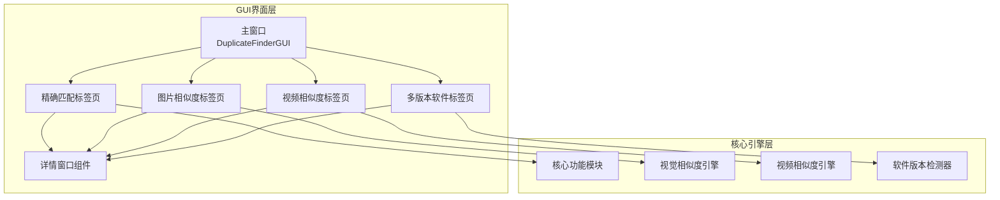

**图表来源**
- [main_window.py:1-245](file://gui_modules/main_window.py#L1-L245)
- [exact_match_tab.py:1-941](file://gui_modules/exact_match_tab.py#L1-L941)
- [similarity_tab.py:1-1279](file://gui_modules/similarity_tab.py#L1-L1279)

**章节来源**
- [main_window.py:1-245](file://gui_modules/main_window.py#L1-L245)
- [README.md:338-372](file://README.md#L338-L372)

## 核心组件

### 主窗口架构

主窗口采用标签页架构，统一管理四个检测功能：

- **窗口属性**: 1000x750像素，默认标题"重复文件检测系统 v2.0"
- **目录管理**: 支持多目录添加、删除、清空操作
- **标签页管理**: 动态创建和管理四个功能标签页
- **全局状态**: 统一管理扫描状态、停止标志和日志输出

### 标签页组件

每个标签页都遵循统一的设计规范，包含以下标准组件：

- **设置区域**: 参数配置界面
- **控制按钮**: 开始、停止、结果按钮
- **进度显示**: 进度条和状态标签
- **日志区域**: 专用日志显示
- **结果展示**: Treeview数据表格

**章节来源**
- [main_window.py:22-245](file://gui_modules/main_window.py#L22-L245)
- [exact_match_tab.py:18-42](file://gui_modules/exact_match_tab.py#L18-L42)

## 架构概览

GUI系统采用分层架构设计，确保各组件职责明确、耦合度低：

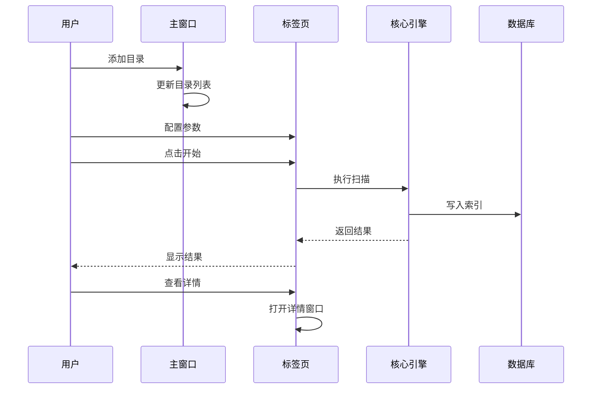

**图表来源**
- [main_window.py:165-196](file://gui_modules/main_window.py#L165-L196)
- [exact_match_tab.py:293-380](file://gui_modules/exact_match_tab.py#L293-L380)

## 详细组件分析

### 主窗口组件分析

#### 目录管理区域

目录管理区域提供直观的目录选择和管理功能：

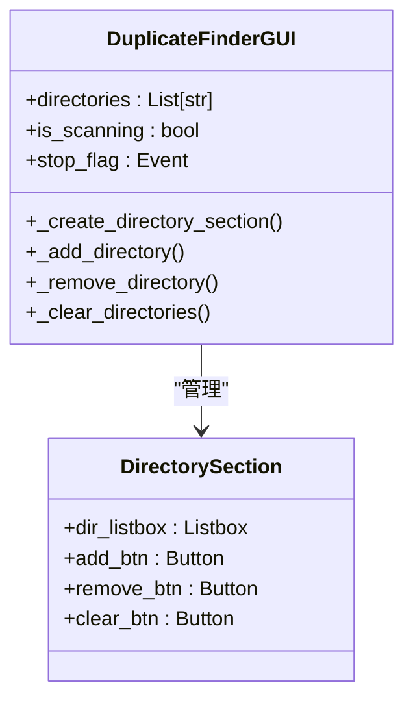

**图表来源**
- [main_window.py:107-162](file://gui_modules/main_window.py#L107-L162)

#### 标签页管理

主窗口通过Notebook组件统一管理四个标签页：

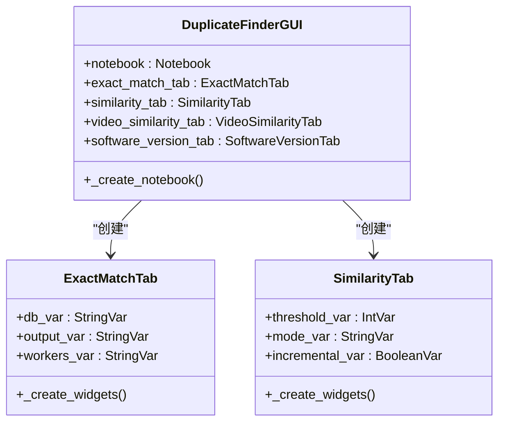

**图表来源**
- [main_window.py:62-86](file://gui_modules/main_window.py#L62-L86)

**章节来源**
- [main_window.py:51-86](file://gui_modules/main_window.py#L51-L86)

### 精确匹配标签页

精确匹配功能提供基于内容的完全重复检测：

#### 文件类型过滤系统

```mermaid
flowchart TD
Start([开始配置]) --> AllCheck{选择"全部"?}
AllCheck --> |是| SelectAll[选择所有类型]
AllCheck --> |否| IndividualSelect[选择特定类型]
IndividualSelect --> CustomExt{输入自定义后缀?}
SelectAll --> CustomExt
CustomExt --> |是| ParseCustom[解析自定义后缀]
CustomExt --> |否| BuildSet[构建文件类型集合]
ParseCustom --> BuildSet
BuildSet --> End([完成])
```

**图表来源**
- [exact_match_tab.py:248-291](file://gui_modules/exact_match_tab.py#L248-L291)

#### 结果展示系统

精确匹配的结果展示采用Treeview控件，支持多种筛选和排序功能：

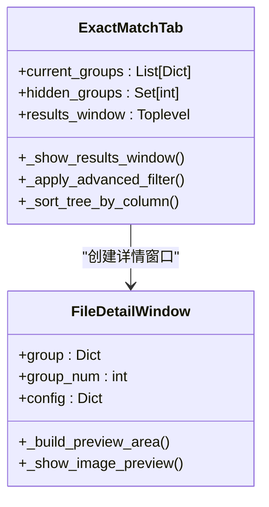

**图表来源**
- [exact_match_tab.py:401-800](file://gui_modules/exact_match_tab.py#L401-L800)

**章节来源**
- [exact_match_tab.py:18-800](file://gui_modules/exact_match_tab.py#L18-L800)

### 图片相似度标签页

图片相似度检测提供基于视觉特征的相似文件识别：

#### 相似度阈值控制系统

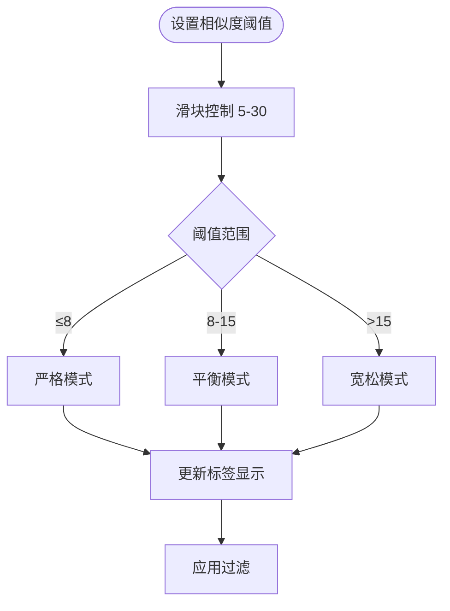

**图表来源**
- [similarity_tab.py:256-266](file://gui_modules/similarity_tab.py#L256-L266)

#### 图片格式过滤系统

图片相似度标签页支持灵活的图片格式过滤：

| 支持格式 | 默认状态 | 自定义格式 |
|---------|---------|-----------|
| JPG/JPEG | ✅ 全选 | 支持 |
| PNG | ✅ 全选 | 支持 |
| GIF | ✅ 全选 | 支持 |
| BMP | ✅ 全选 | 支持 |
| WebP | ✅ 全选 | 支持 |

**章节来源**
- [similarity_tab.py:18-800](file://gui_modules/similarity_tab.py#L18-L800)

### 视频相似度标签页

视频相似度检测提供基于关键帧序列的视频重复识别：

#### 视频格式支持

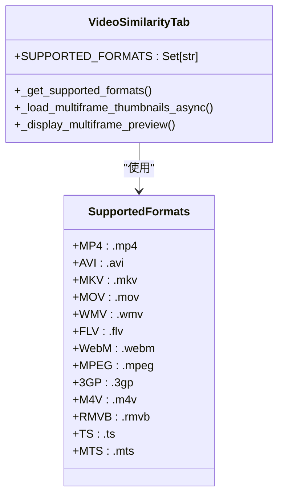

**图表来源**
- [video_similarity_tab.py:281-319](file://gui_modules/video_similarity_tab.py#L281-L319)

#### 多帧预览系统

视频详情窗口支持多帧预览功能：

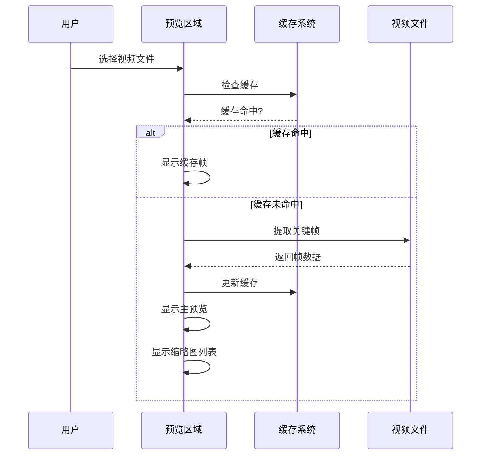

**图表来源**
- [video_similarity_tab.py:553-651](file://gui_modules/video_similarity_tab.py#L553-L651)

**章节来源**
- [video_similarity_tab.py:18-1404](file://gui_modules/video_similarity_tab.py#L18-L1404)

### 多版本软件检测标签页

多版本软件检测提供基于PE元数据的软件版本识别：

#### 软件识别算法

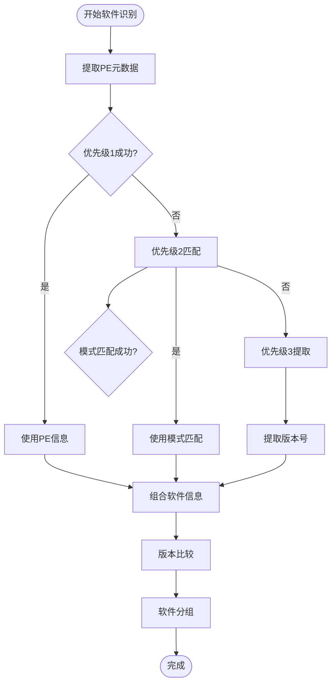

**图表来源**
- [software_version_tab.py:301-372](file://gui_modules/software_version_tab.py#L301-L372)

**章节来源**
- [software_version_tab.py:15-759](file://gui_modules/software_version_tab.py#L15-L759)

### 通用详情窗口组件

详情窗口组件提供统一的文件详情展示界面：

#### 统一配置系统

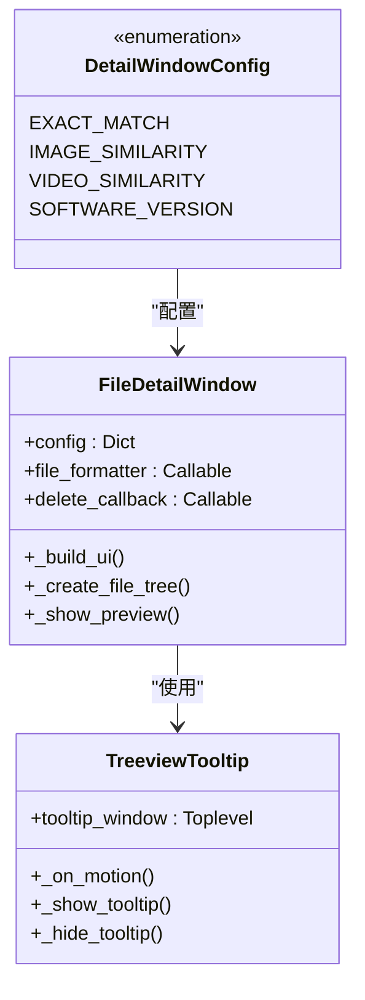

**图表来源**
- [detail_window.py:99-217](file://gui_modules/detail_window.py#L99-L217)

**章节来源**
- [detail_window.py:12-766](file://gui_modules/detail_window.py#L12-L766)

## 依赖分析

### 外部依赖关系

项目采用渐进式依赖加载策略，核心功能无需第三方依赖：

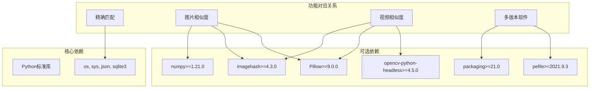

**图表来源**
- [requirements.txt:1-32](file://requirements.txt#L1-L32)

### 模块间依赖

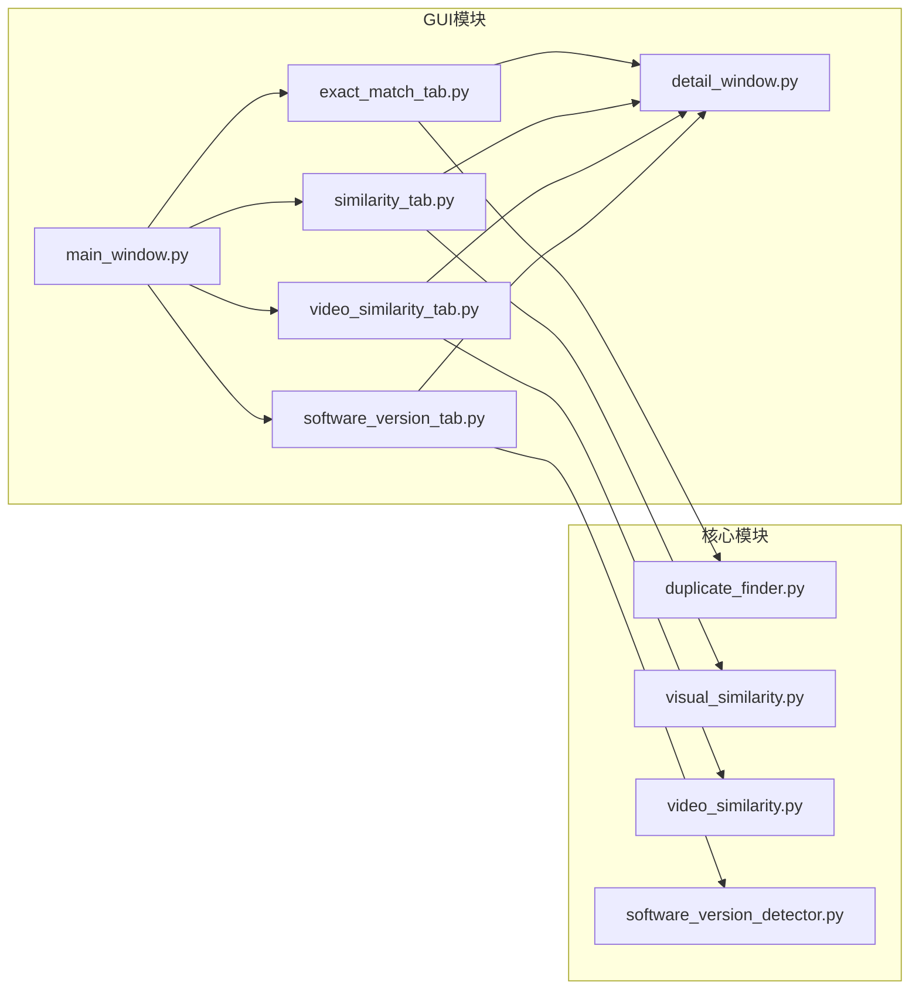

**图表来源**
- [main_window.py:18-20](file://gui_modules/main_window.py#L18-L20)

**章节来源**
- [requirements.txt:1-32](file://requirements.txt#L1-L32)

## 性能考虑

### UI响应性优化

系统采用多线程架构确保UI响应性：

- **后台线程**: 所有耗时操作在独立线程执行
- **主线程更新**: 通过`root.after()`机制安全更新UI
- **进度回调**: 实时更新进度条和状态信息
- **异步加载**: 图片和视频预览采用懒加载机制

### 内存管理

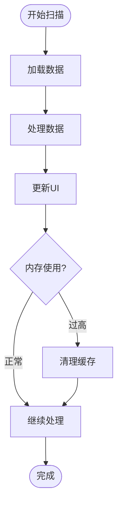

### 缓存策略

系统实现了多层次缓存机制：

- **缩略图缓存**: 图片和视频预览缓存
- **数据库连接池**: SQLite连接复用
- **结果缓存**: 扫描结果临时存储
- **LRU淘汰**: 缓存容量限制和淘汰策略

## 故障排除指南

### 常见问题诊断

#### GUI启动问题

**问题**: 启动GUI时报导入错误
**原因**: 缺少必要的第三方依赖
**解决方案**: 
1. 检查requirements.txt中的依赖声明
2. 安装缺失的依赖包
3. 验证Pillow和imagehash版本兼容性

#### 性能问题

**问题**: 扫描过程卡顿或响应缓慢
**可能原因**:
- CPU资源不足
- 磁盘I/O瓶颈
- 内存不足
- 进程数配置不当

**解决方案**:
1. 调整并行线程数
2. 使用SSD存储设备
3. 关闭不必要的应用程序
4. 分批处理超大目录

#### 显示问题

**问题**: Treeview列宽不正确或内容截断
**解决方案**:
1. 确保设置了`stretch=False`
2. 检查列宽配置是否合理
3. 验证字体设置
4. 调整窗口大小

**章节来源**
- [GUI_SPECIFICATION.md:653-724](file://docs/GUI_SPECIFICATION.md#L653-L724)

## 结论

本GUI界面设计充分体现了现代桌面应用的设计理念，通过模块化架构实现了功能的高内聚、低耦合。界面设计遵循一致性原则，四个标签页共享统一的交互模式和视觉风格，降低了用户学习成本。

系统在性能方面采用了多项优化策略，包括多线程异步处理、缓存机制和响应式设计，确保在处理TB级数据时仍能保持良好的用户体验。详细的错误处理和日志系统为用户提供了透明的操作反馈。

通过统一的详情窗口组件，系统实现了跨功能的一致性体验，用户可以在不同检测模式间无缝切换，享受相同的交互体验。

## 附录

### 设计原则总结

1. **一致性原则**: 统一的界面风格和交互模式
2. **简洁性原则**: 避免界面冗余，突出核心功能
3. **响应性原则**: 即时反馈用户操作状态
4. **容错性原则**: 提供确认对话框和错误提示
5. **可扩展性原则**: 模块化设计便于功能扩展

### 用户操作指南

#### 基本操作流程

1. **添加扫描目录**: 点击"添加目录"按钮选择目标文件夹
2. **配置检测参数**: 根据需求调整阈值、模式等参数
3. **开始检测**: 点击"开始检测"按钮启动扫描
4. **查看结果**: 点击"结果"按钮查看检测结果
5. **查看详情**: 双击结果行查看文件详情

#### 高级功能使用

- **批量操作**: 在Treeview中选择多个文件进行批量处理
- **筛选功能**: 使用过滤器快速定位目标文件
- **排序功能**: 点击表头对结果进行排序
- **预览功能**: 支持图片和视频的预览查看

### 扩展开发建议

#### 新增功能标签页

1. **继承基类**: 继承`ttk.Frame`创建新的标签页类
2. **实现接口**: 实现`start_scan()`, `view_results()`等方法
3. **集成UI**: 在主窗口中注册新的标签页
4. **测试验证**: 确保与现有系统的兼容性

#### 界面定制化

1. **主题定制**: 修改颜色方案和字体设置
2. **布局调整**: 根据需求调整组件布局
3. **功能扩展**: 添加新的交互元素和功能
4. **国际化**: 支持多语言界面