# 主界面设计

<cite>
**本文档引用的文件**
- [main_window.py](file://gui_modules/main_window.py)
- [run_gui.py](file://run_gui.py)
- [exact_match_tab.py](file://gui_modules/exact_match_tab.py)
- [similarity_tab.py](file://gui_modules/similarity_tab.py)
- [video_similarity_tab.py](file://gui_modules/video_similarity_tab.py)
- [software_version_tab.py](file://gui_modules/software_version_tab.py)
- [detail_window.py](file://gui_modules/detail_window.py)
- [README.md](file://README.md)
</cite>

## 目录
1. [简介](#简介)
2. [项目结构](#项目结构)
3. [核心组件](#核心组件)
4. [架构概览](#架构概览)
5. [详细组件分析](#详细组件分析)
6. [依赖关系分析](#依赖关系分析)
7. [性能考虑](#性能考虑)
8. [故障排除指南](#故障排除指南)
9. [结论](#结论)

## 简介

文件重复校验工具是一个功能强大的图形界面应用程序，支持四种核心检测模式：精确匹配、图片相似度检测、视频相似度检测和多版本软件检测。该工具采用模块化设计，基于Python Tkinter框架构建，提供了现代化的用户界面和高效的文件去重功能。

## 项目结构

该项目采用清晰的模块化架构，主要分为以下几个层次：

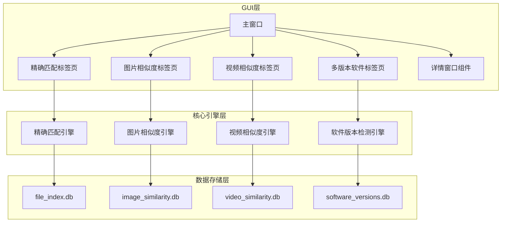

**图表来源**
- [main_window.py:1-245](file://gui_modules/main_window.py#L1-L245)
- [exact_match_tab.py:1-941](file://gui_modules/exact_match_tab.py#L1-L941)
- [similarity_tab.py:1-1279](file://gui_modules/similarity_tab.py#L1-L1279)

**章节来源**
- [README.md:338-372](file://README.md#L338-L372)

## 核心组件

### 主窗口架构

主窗口采用模块化设计，通过ttk.Notebook实现标签页容器，支持四个独立的功能模块：

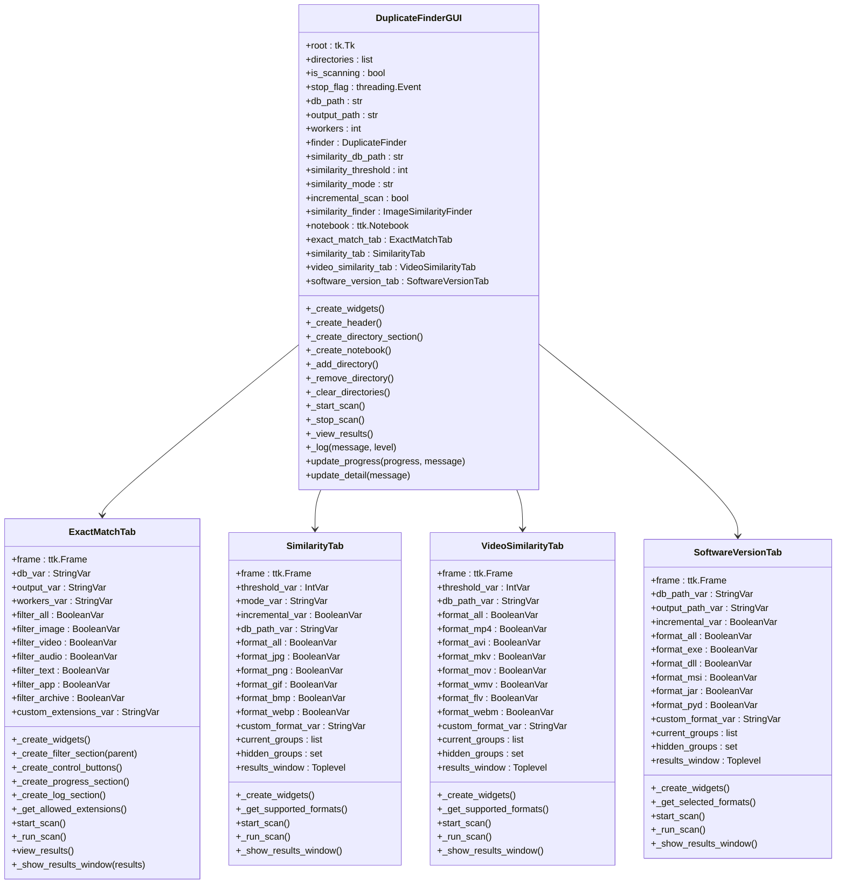

**图表来源**
- [main_window.py:22-245](file://gui_modules/main_window.py#L22-L245)
- [exact_match_tab.py:18-42](file://gui_modules/exact_match_tab.py#L18-L42)
- [similarity_tab.py:18-49](file://gui_modules/similarity_tab.py#L18-L49)
- [video_similarity_tab.py:18-49](file://gui_modules/video_similarity_tab.py#L18-L49)
- [software_version_tab.py:15-33](file://gui_modules/software_version_tab.py#L15-L33)

### 标签页容器设计

标签页容器采用ttk.Notebook实现，支持动态加载和管理四个功能标签页：

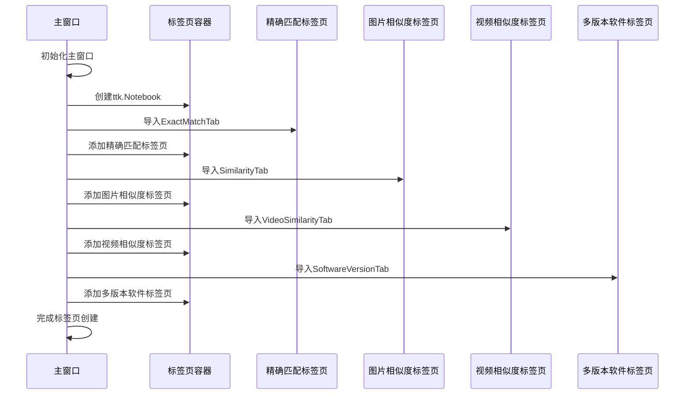

**图表来源**
- [main_window.py:62-86](file://gui_modules/main_window.py#L62-L86)

**章节来源**
- [main_window.py:22-86](file://gui_modules/main_window.py#L22-L86)

## 架构概览

### 整体架构设计

系统采用分层架构设计，从底层到顶层依次为：

1. **GUI界面层**：基于Tkinter的图形用户界面
2. **业务逻辑层**：各功能模块的业务逻辑实现
3. **核心引擎层**：文件扫描和相似度检测算法
4. **数据存储层**：SQLite数据库存储

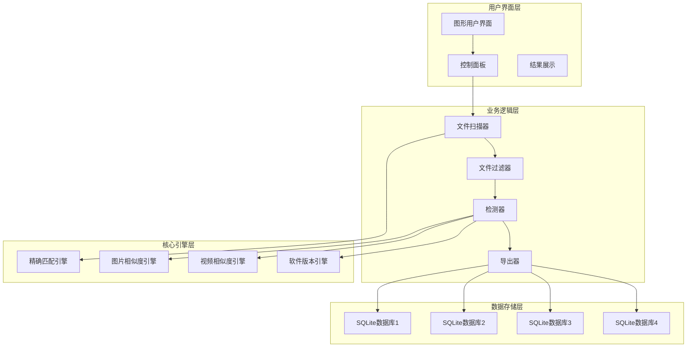

**图表来源**
- [main_window.py:18-46](file://gui_modules/main_window.py#L18-L46)
- [exact_match_tab.py:323-352](file://gui_modules/exact_match_tab.py#L323-L352)

### 初始化流程

主窗口的初始化过程遵循严格的顺序：

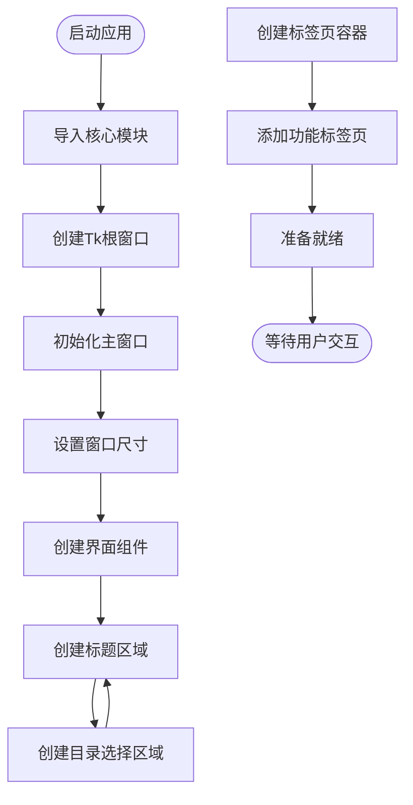

**图表来源**
- [main_window.py:25-50](file://gui_modules/main_window.py#L25-L50)
- [run_gui.py:13-26](file://run_gui.py#L13-L26)

**章节来源**
- [main_window.py:25-50](file://gui_modules/main_window.py#L25-L50)
- [run_gui.py:13-26](file://run_gui.py#L13-L26)

## 详细组件分析

### 标题区域设计

标题区域采用简洁而专业的设计风格，包含主标题和副标题信息：

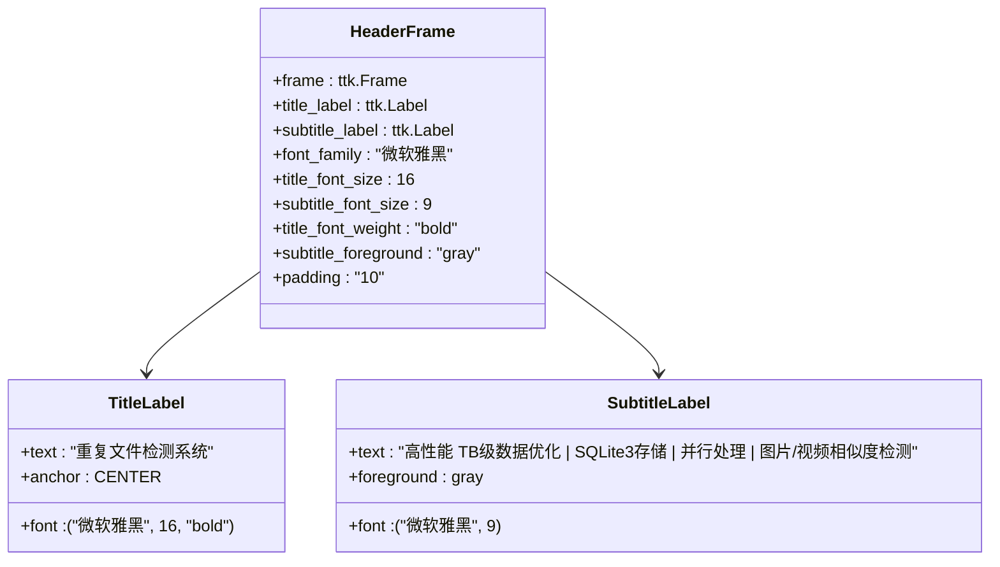

**图表来源**
- [main_window.py:87-106](file://gui_modules/main_window.py#L87-L106)

### 目录选择区域

目录选择区域提供了灵活的目录管理功能：

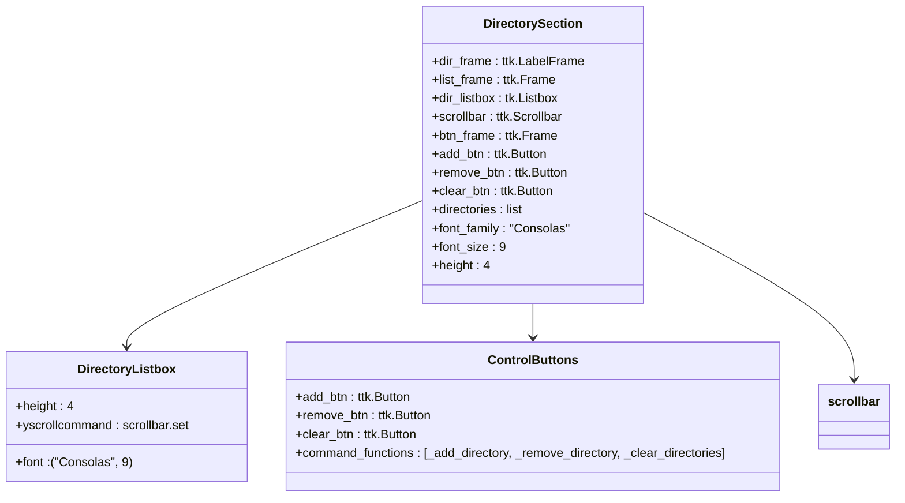

**图表来源**
- [main_window.py:107-131](file://gui_modules/main_window.py#L107-L131)

**章节来源**
- [main_window.py:107-131](file://gui_modules/main_window.py#L107-L131)

### 标签页容器设计

标签页容器采用动态加载机制，支持四个功能模块：

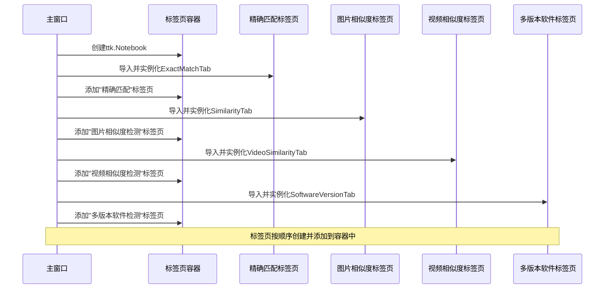

**图表来源**
- [main_window.py:62-86](file://gui_modules/main_window.py#L62-L86)

### 精确匹配标签页

精确匹配标签页提供了完整的文件去重功能：

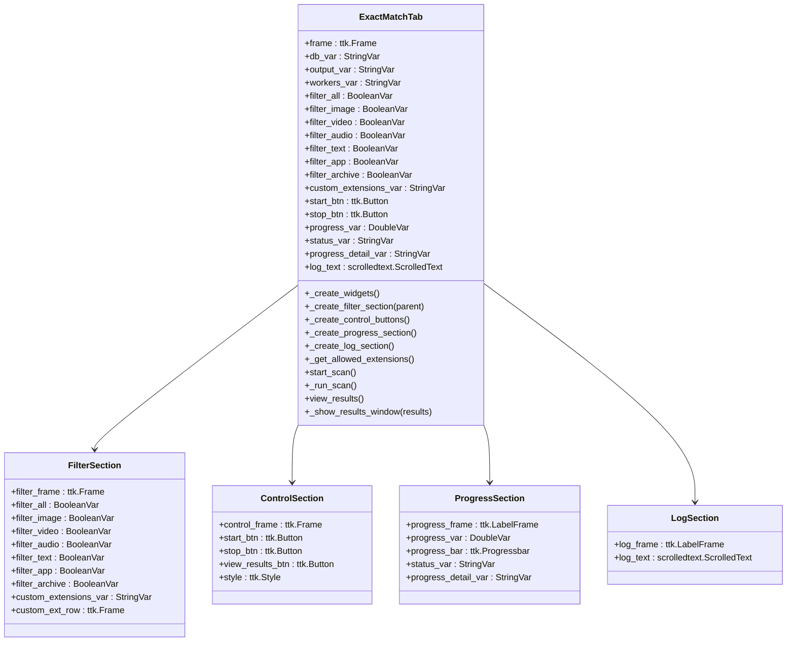

**图表来源**
- [exact_match_tab.py:18-180](file://gui_modules/exact_match_tab.py#L18-L180)

**章节来源**
- [exact_match_tab.py:18-180](file://gui_modules/exact_match_tab.py#L18-L180)

### 图片相似度标签页

图片相似度标签页提供了高级的图像去重功能：

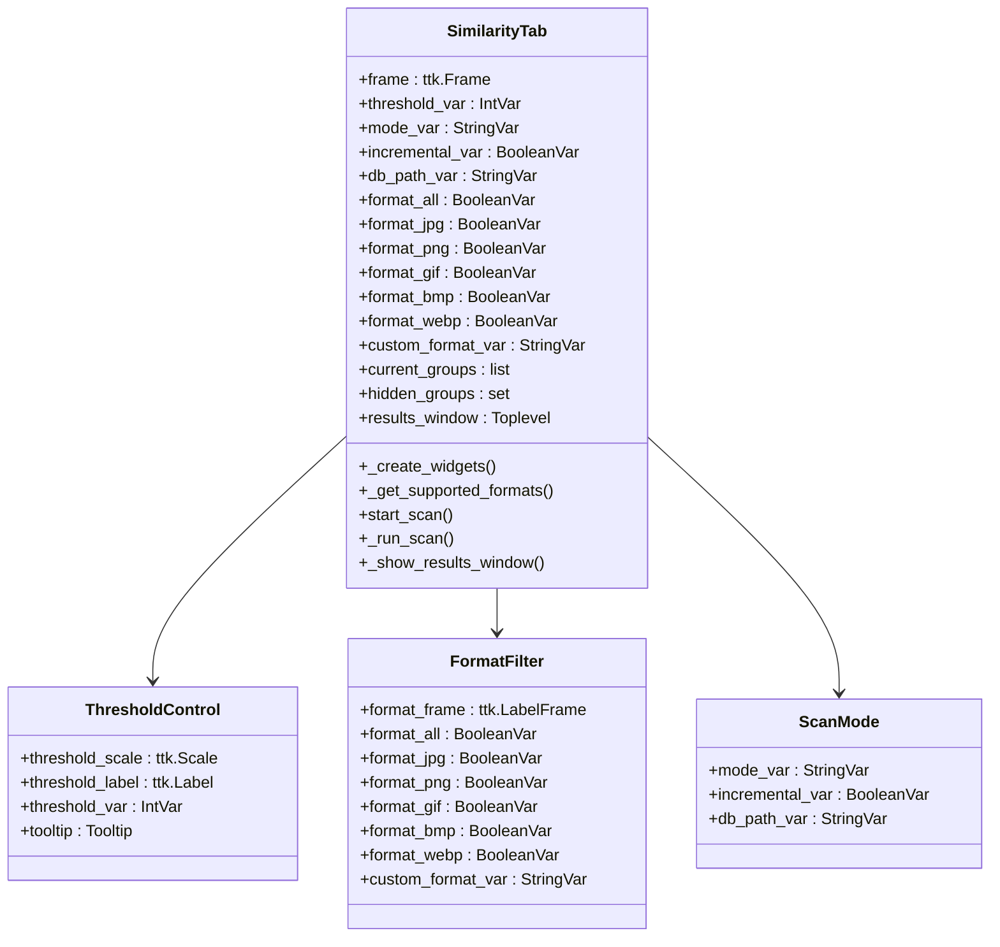

**图表来源**
- [similarity_tab.py:18-220](file://gui_modules/similarity_tab.py#L18-L220)

**章节来源**
- [similarity_tab.py:18-220](file://gui_modules/similarity_tab.py#L18-L220)

### 视频相似度标签页

视频相似度标签页实现了复杂的视频去重算法：

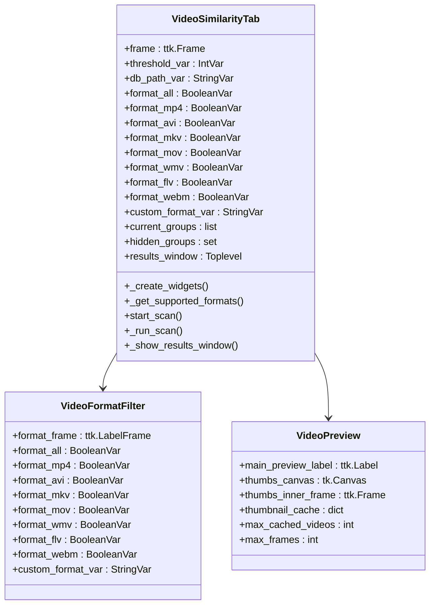

**图表来源**
- [video_similarity_tab.py:18-205](file://gui_modules/video_similarity_tab.py#L18-L205)

**章节来源**
- [video_similarity_tab.py:18-205](file://gui_modules/video_similarity_tab.py#L18-L205)

### 多版本软件标签页

多版本软件标签页专门处理软件版本管理：

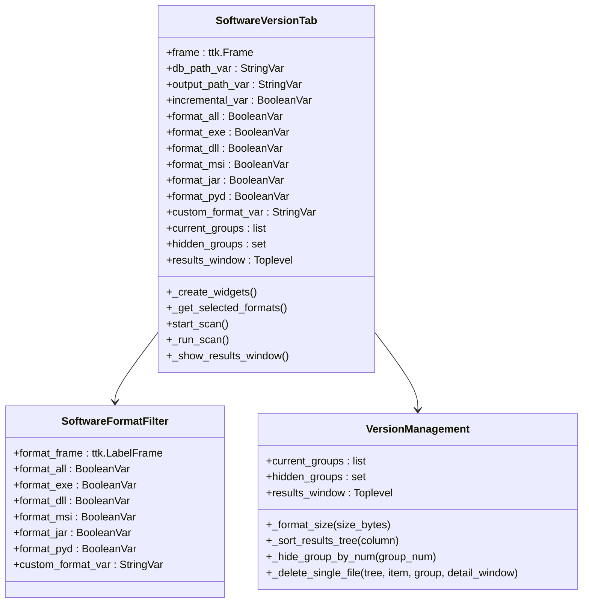

**图表来源**
- [software_version_tab.py:15-182](file://gui_modules/software_version_tab.py#L15-L182)

**章节来源**
- [software_version_tab.py:15-182](file://gui_modules/software_version_tab.py#L15-L182)

### 详情窗口组件

详情窗口组件提供了统一的文件详情展示功能：

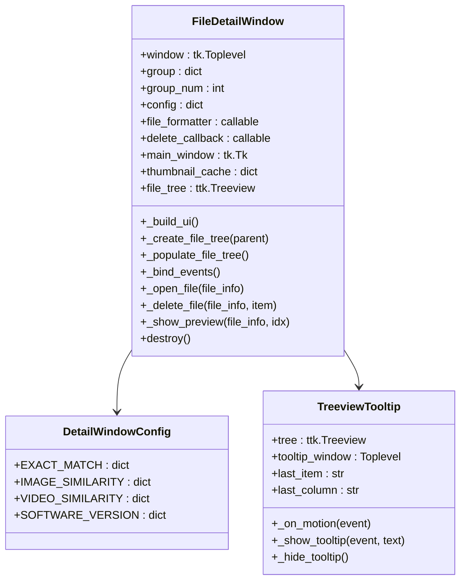

**图表来源**
- [detail_window.py:220-597](file://gui_modules/detail_window.py#L220-L597)

**章节来源**
- [detail_window.py:220-597](file://gui_modules/detail_window.py#L220-L597)

## 依赖关系分析

### 模块依赖关系

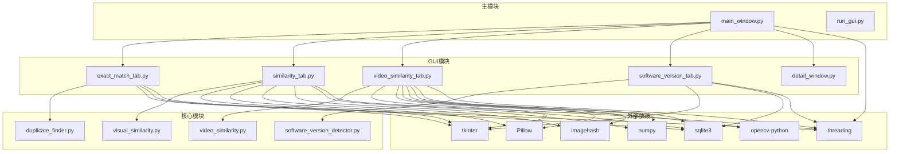

**图表来源**
- [main_window.py:18-19](file://gui_modules/main_window.py#L18-L19)
- [exact_match_tab.py:14-15](file://gui_modules/exact_match_tab.py#L14-L15)
- [similarity_tab.py:14-15](file://gui_modules/similarity_tab.py#L14-L15)
- [video_similarity_tab.py:14-15](file://gui_modules/video_similarity_tab.py#L14-L15)
- [software_version_tab.py:12](file://gui_modules/software_version_tab.py#L12-L12)

### 组件耦合度分析

系统的组件耦合度设计合理，遵循了单一职责原则：

- **主窗口与标签页**：通过接口抽象，标签页之间相互独立
- **标签页与核心引擎**：通过明确的接口调用，降低耦合度
- **GUI与数据层**：通过数据库抽象，支持多种存储方案
- **组件间通信**：通过事件和回调机制，避免直接依赖

**章节来源**
- [main_window.py:62-86](file://gui_modules/main_window.py#L62-L86)
- [exact_match_tab.py:323-352](file://gui_modules/exact_match_tab.py#L323-L352)

## 性能考虑

### 并行处理机制

系统采用了多线程和多进程相结合的并行处理机制：

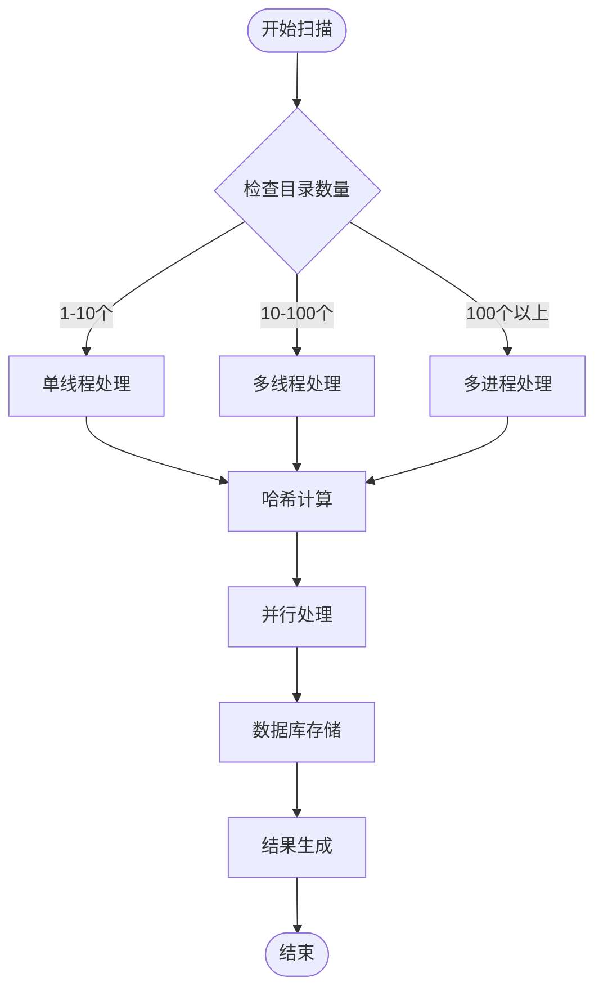

### 内存管理策略

- **懒加载机制**：图片和视频预览采用懒加载，避免内存占用过高
- **缓存管理**：实现LRU缓存策略，控制缓存大小
- **垃圾回收**：及时释放不再使用的对象引用
- **分批处理**：大数据集采用分批处理，避免内存溢出

### 数据库优化

- **索引优化**：为常用查询字段建立索引
- **事务处理**：批量操作使用事务，提高性能
- **连接池**：复用数据库连接，减少开销
- **增量更新**：支持增量扫描，避免重复计算

## 故障排除指南

### 常见问题诊断

#### 启动问题

**问题**：程序无法启动
**解决方案**：
1. 检查Python版本是否满足要求
2. 确认所有依赖包已正确安装
3. 验证运行权限
4. 检查防火墙设置

**章节来源**
- [run_gui.py:27-37](file://run_gui.py#L27-L37)

#### 目录选择问题

**问题**：无法添加或删除目录
**解决方案**：
1. 检查目录路径是否存在
2. 验证目录访问权限
3. 确认磁盘空间充足
4. 检查路径字符编码

#### 扫描性能问题

**问题**：扫描速度过慢
**解决方案**：
1. 调整并行线程数
2. 优化磁盘I/O性能
3. 减少不必要的文件过滤
4. 使用SSD存储设备

#### 内存泄漏问题

**问题**：长时间运行后内存占用增加
**解决方案**：
1. 检查定时器和回调函数
2. 确认对象引用正确释放
3. 实施定期垃圾回收
4. 监控内存使用情况

### 错误处理机制

系统实现了完善的错误处理机制：

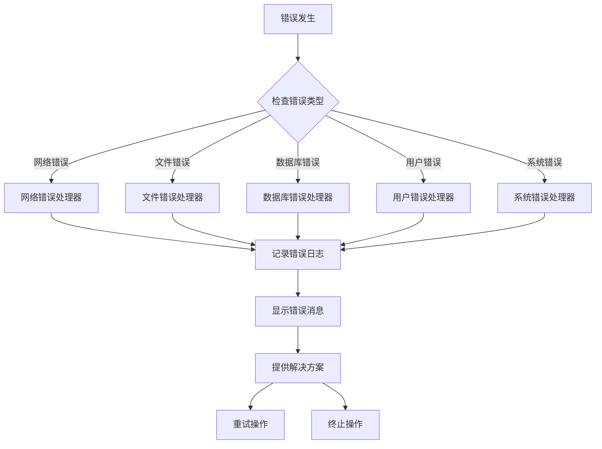

**章节来源**
- [exact_match_tab.py:368-374](file://gui_modules/exact_match_tab.py#L368-L374)
- [similarity_tab.py:408-411](file://gui_modules/similarity_tab.py#L408-L411)

## 结论

文件重复校验工具的主界面设计体现了现代GUI应用的最佳实践：

### 设计优势

1. **模块化架构**：清晰的分层设计，便于维护和扩展
2. **用户体验**：直观的界面设计，丰富的交互功能
3. **性能优化**：合理的并发处理和内存管理策略
4. **可扩展性**：插件化的标签页设计，支持功能扩展
5. **稳定性**：完善的错误处理和异常恢复机制

### 技术特点

- **多线程并发**：充分利用多核CPU资源
- **智能缓存**：减少重复计算，提高响应速度
- **数据库集成**：SQLite数据库提供可靠的数据持久化
- **跨平台兼容**：支持Windows、Linux、macOS操作系统
- **依赖管理**：清晰的依赖关系，便于部署和维护

### 发展方向

未来可以在以下方面进一步改进：

1. **界面现代化**：采用更现代的UI框架和技术
2. **功能增强**：添加更多检测算法和过滤条件
3. **性能优化**：进一步提升大数据集的处理能力
4. **用户体验**：简化操作流程，提供更好的引导功能
5. **扩展性**：支持更多文件格式和检测类型

该系统为文件去重和管理提供了完整的解决方案，具有良好的实用价值和扩展潜力。