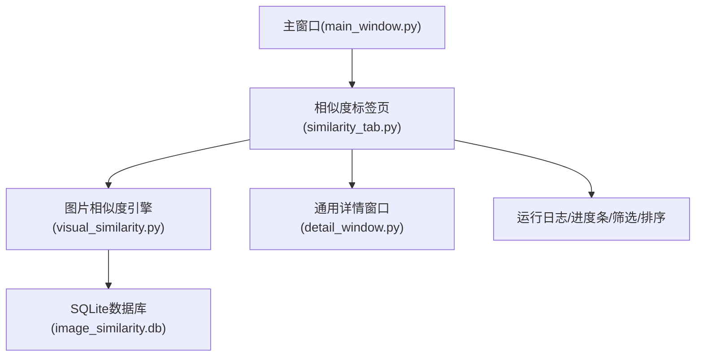
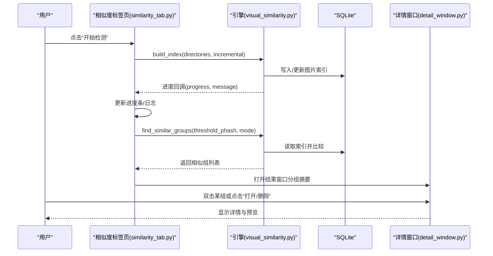
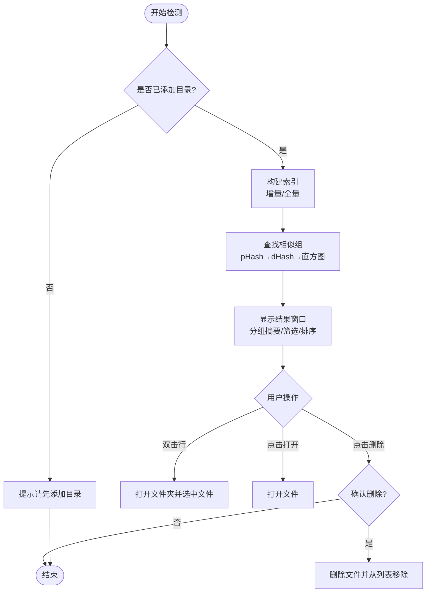
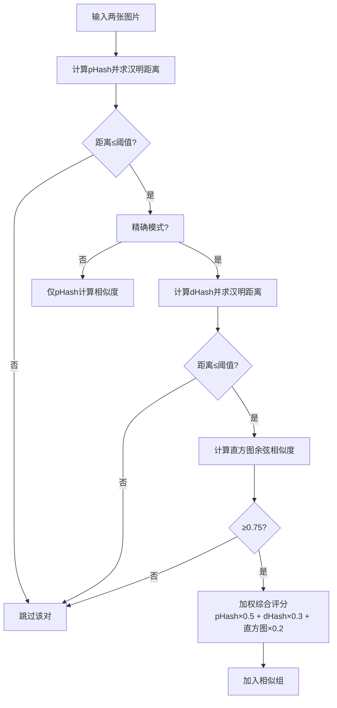
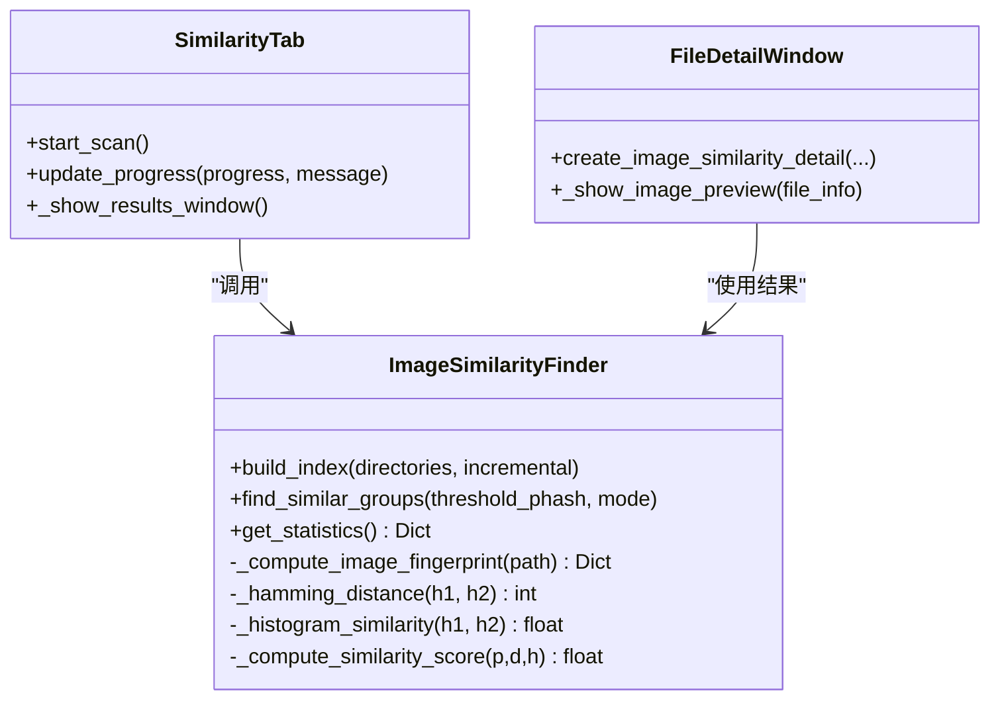
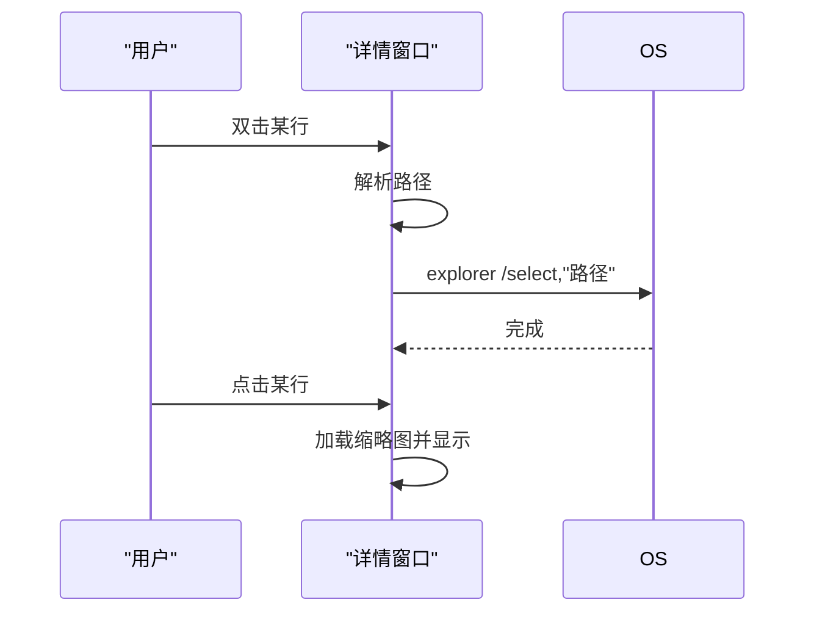
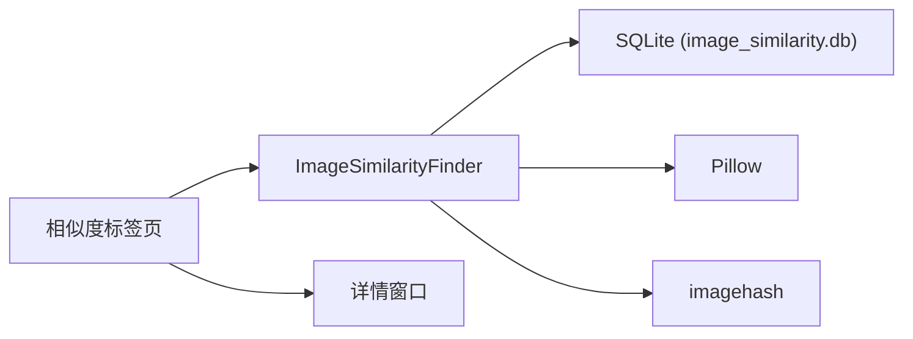

# 图片相似度检测标签页

<cite>
**本文引用的文件**
- [similarity_tab.py](file://gui_modules/similarity_tab.py)
- [visual_similarity.py](file://core/visual_similarity.py)
- [detail_window.py](file://gui_modules/detail_window.py)
- [IMAGE_SIMILARITY_SPEC.md](file://docs/IMAGE_SIMILARITY_SPEC.md)
- [main_window.py](file://gui_modules/main_window.py)
- [README.md](file://README.md)
</cite>

## 目录
1. [简介](#简介)
2. [项目结构](#项目结构)
3. [核心组件](#核心组件)
4. [架构总览](#架构总览)
5. [详细组件分析](#详细组件分析)
6. [依赖关系分析](#依赖关系分析)
7. [性能考量](#性能考量)
8. [故障排查指南](#故障排查指南)
9. [结论](#结论)
10. [附录：使用指南与扩展建议](#附录使用指南与扩展建议)

## 简介
本文件围绕“图片相似度检测”标签页，系统性说明其界面布局、三级过滤算法的可视化展示、相似度阈值配置、感知哈希选择、多进程进度显示、结果详情窗口交互、参数配置、结果表格与详细信息查看功能，并提供使用指南与界面扩展开发建议。该模块基于 pHash/dHash/颜色直方图的三级过滤策略，支持快速模式与精确模式，具备增量索引与历史数据恢复能力，并通过通用详情窗口提供统一的预览与操作体验。

## 项目结构
- GUI层
  - 主窗口管理标签页与全局状态（目录列表、扫描标志等）
  - 相似度标签页负责配置、执行、进度与结果概览
  - 通用详情窗口提供统一的结果详情与预览
- 核心引擎层
  - 图片相似度引擎实现指纹计算、索引构建、相似组查找与统计
- 文档层
  - 规格文档定义算法、阈值、数据库结构与界面规范

图表来源
- [main_window.py:62-85](file://gui_modules/main_window.py#L62-L85)
- [similarity_tab.py:18-48](file://gui_modules/similarity_tab.py#L18-L48)
- [visual_similarity.py:94-121](file://core/visual_similarity.py#L94-L121)
- [detail_window.py:99-157](file://gui_modules/detail_window.py#L99-L157)

章节来源
- [main_window.py:62-85](file://gui_modules/main_window.py#L62-L85)
- [similarity_tab.py:18-48](file://gui_modules/similarity_tab.py#L18-L48)
- [visual_similarity.py:94-121](file://core/visual_similarity.py#L94-L121)
- [detail_window.py:99-157](file://gui_modules/detail_window.py#L99-L157)

## 核心组件
- 相似度标签页（SimilarityTab）
  - 负责创建配置区（阈值滑块、检测模式、扫描方式、数据库路径）、图片格式过滤、开始/停止/结果按钮、进度条、日志区域
  - 启动后台线程调用引擎进行索引构建与相似组查找，回调更新进度与日志
  - 维护当前结果集，支持从历史数据库自动恢复并重新检测
- 图片相似度引擎（ImageSimilarityFinder）
  - 多进程并行计算指纹（pHash/dHash/直方图），批量写入 SQLite
  - 三级过滤：pHash快速筛选 → dHash二次验证（精确模式）→ 直方图精确比对（余弦相似度）
  - 综合评分加权：pHash×0.5 + dHash×0.3 + 直方图×0.2
  - 提供统计信息与删除记录接口
- 通用详情窗口（FileDetailWindow / DetailWindowConfig）
  - 为图片相似度提供统一的结果详情视图：分辨率、大小、路径、打开/删除操作、图片预览
  - 支持列排序、鼠标悬停提示、双击打开文件夹并选中文件

章节来源
- [similarity_tab.py:50-220](file://gui_modules/similarity_tab.py#L50-L220)
- [visual_similarity.py:21-91](file://core/visual_similarity.py#L21-L91)
- [visual_similarity.py:253-311](file://core/visual_similarity.py#L253-L311)
- [visual_similarity.py:334-408](file://core/visual_similarity.py#L334-L408)
- [visual_similarity.py:410-513](file://core/visual_similarity.py#L410-L513)
- [detail_window.py:99-157](file://gui_modules/detail_window.py#L99-L157)
- [detail_window.py:220-350](file://gui_modules/detail_window.py#L220-L350)

## 架构总览
相似度检测流程从GUI触发，进入后台线程，调用引擎构建索引并查找相似组，最终在结果窗口中展示并可进一步查看详情。

图表来源
- [similarity_tab.py:341-416](file://gui_modules/similarity_tab.py#L341-L416)
- [visual_similarity.py:253-311](file://core/visual_similarity.py#L253-L311)
- [visual_similarity.py:410-513](file://core/visual_similarity.py#L410-L513)
- [detail_window.py:220-350](file://gui_modules/detail_window.py#L220-L350)

## 详细组件分析

### 相似度标签页界面与交互
- 配置区
  - 相似度阈值：滑块范围5-30，实时显示“严格/平衡/宽松”模式文本
  - 检测模式：快速模式（仅pHash）与精确模式（pHash+dHash+直方图）
  - 扫描方式：全量扫描与增量扫描（保留历史索引）
  - 数据库路径：可浏览选择 .db 文件
- 图片格式过滤
  - 常用格式复选框（JPG/PNG/GIF/BMP/WebP）与“全部”联动
  - 自定义后缀输入，支持逗号/分号/空格分隔，自动补点前缀
- 控制与反馈
  - 开始/停止按钮、结果按钮
  - 进度条与状态文本实时更新
  - 运行日志滚动输出
- 结果窗口
  - 分组摘要：平均相似度、图片数量、总大小、后缀集合
  - 筛选：按后缀、最小/最大大小（带单位B/KB/MB/GB）
  - 排序：支持按相似度、数量、大小等列排序
  - 隐藏组：支持隐藏特定组
  - 双击行：打开所在文件夹并选中文件
  - 点击“打开/删除”列：打开文件或确认删除

图表来源
- [similarity_tab.py:50-220](file://gui_modules/similarity_tab.py#L50-L220)
- [similarity_tab.py:341-416](file://gui_modules/similarity_tab.py#L341-L416)
- [similarity_tab.py:538-674](file://gui_modules/similarity_tab.py#L538-L674)
- [detail_window.py:403-474](file://gui_modules/detail_window.py#L403-L474)

章节来源
- [similarity_tab.py:50-220](file://gui_modules/similarity_tab.py#L50-L220)
- [similarity_tab.py:341-416](file://gui_modules/similarity_tab.py#L341-L416)
- [similarity_tab.py:538-674](file://gui_modules/similarity_tab.py#L538-L674)
- [detail_window.py:403-474](file://gui_modules/detail_window.py#L403-L474)

### 三级过滤算法与相似度阈值配置
- 第一级：pHash快速筛选
  - 通过汉明距离阈值（默认12）快速排除不相似对
- 第二级：dHash二次验证（精确模式）
  - 进一步缩小候选集，提升准确性
- 第三级：颜色直方图精确比对
  - 计算RGB三通道直方图的余弦相似度（默认阈值≥0.75）
- 综合评分
  - 将pHash、dHash、直方图分数加权求和得到最终相似度百分比
- 阈值配置界面
  - 滑块范围5-30，对应严格/平衡/宽松三种模式
  - 快速模式仅使用pHash；精确模式启用完整三级过滤

图表来源
- [visual_similarity.py:334-408](file://core/visual_similarity.py#L334-L408)
- [visual_similarity.py:410-513](file://core/visual_similarity.py#L410-L513)

章节来源
- [visual_similarity.py:334-408](file://core/visual_similarity.py#L334-L408)
- [visual_similarity.py:410-513](file://core/visual_similarity.py#L410-L513)
- [IMAGE_SIMILARITY_SPEC.md:133-158](file://docs/IMAGE_SIMILARITY_SPEC.md#L133-L158)

### 感知哈希算法选择与多进程处理
- 感知哈希选择
  - 采用 pHash（感知哈希）作为主要特征，辅以 dHash（差异哈希）与颜色直方图
  - 支持快速模式（仅pHash）与精确模式（pHash+dHash+直方图）
- 多进程并行
  - 使用进程池并行计算每张图片的指纹（pHash/dHash/直方图）
  - 批处理插入数据库，减少事务开销
  - 自动根据CPU核心数设置最大工作进程数（上限8）
- 进度显示
  - 进度回调在UI线程更新进度条与状态文本
  - 日志区域实时输出关键步骤信息

图表来源
- [visual_similarity.py:94-121](file://core/visual_similarity.py#L94-L121)
- [visual_similarity.py:21-91](file://core/visual_similarity.py#L21-L91)
- [similarity_tab.py:341-416](file://gui_modules/similarity_tab.py#L341-L416)
- [detail_window.py:622-639](file://gui_modules/detail_window.py#L622-L639)

章节来源
- [visual_similarity.py:21-91](file://core/visual_similarity.py#L21-L91)
- [visual_similarity.py:94-121](file://core/visual_similarity.py#L94-L121)
- [similarity_tab.py:341-416](file://gui_modules/similarity_tab.py#L341-L416)
- [detail_window.py:622-639](file://gui_modules/detail_window.py#L622-L639)

### 结果详情窗口交互设计
- 列表展示
  - 列：序号、分辨率、大小、完整路径、打开、删除
  - 支持列标题排序（数值型列智能解析）
  - 鼠标悬停长路径时显示tooltip
- 预览区域
  - 点击图片行即时显示缩略图（最大280x280，保持比例）
  - 懒加载与缓存避免重复渲染
- 操作行为
  - 双击行：打开文件夹并选中文件
  - 点击“打开”列：打开文件
  - 点击“删除”列：确认后删除并刷新列表

图表来源
- [detail_window.py:403-474](file://gui_modules/detail_window.py#L403-L474)
- [detail_window.py:516-535](file://gui_modules/detail_window.py#L516-L535)

章节来源
- [detail_window.py:403-474](file://gui_modules/detail_window.py#L403-L474)
- [detail_window.py:516-535](file://gui_modules/detail_window.py#L516-L535)

### 相似度检测参数配置界面
- 阈值滑块：5-30，动态显示“严格/平衡/宽松”
- 检测模式：快速（仅pHash）/精确（pHash+dHash+直方图）
- 扫描方式：全量/增量（增量保留历史索引）
- 数据库路径：可浏览选择 .db 文件
- 图片格式过滤：常用格式复选框+自定义后缀输入
- 控制按钮：开始/停止/结果
- 进度与日志：进度条实时更新，日志滚动输出

章节来源
- [similarity_tab.py:50-220](file://gui_modules/similarity_tab.py#L50-L220)
- [similarity_tab.py:341-416](file://gui_modules/similarity_tab.py#L341-L416)

### 结果展示表格与详细信息查看
- 结果窗口
  - 分组摘要：平均相似度、图片数量、总大小、后缀集合
  - 筛选：后缀、最小/最大大小（单位B/KB/MB/GB）
  - 排序：相似度、数量、大小等列
  - 隐藏组：支持隐藏特定组
- 详细信息
  - 双击行打开文件夹并选中文件
  - 点击“打开/删除”列执行相应操作
  - 图片预览：点击行即时显示缩略图

章节来源
- [similarity_tab.py:538-674](file://gui_modules/similarity_tab.py#L538-L674)
- [detail_window.py:220-350](file://gui_modules/detail_window.py#L220-L350)
- [detail_window.py:403-474](file://gui_modules/detail_window.py#L403-L474)

## 依赖关系分析
- GUI与引擎耦合
  - 相似度标签页通过回调与引擎通信（进度、日志）
  - 引擎独立于GUI，便于命令行与自动化使用
- 数据库与索引
  - SQLite WAL模式、同步策略、缓存与内存映射优化
  - 针对phash、dhash、size、path建立索引加速查询
- 外部库
  - Pillow用于图像读取与缩放
  - imagehash用于pHash/dHash计算
  - 标准库sqlite3、threading、concurrent.futures用于并发与存储

图表来源
- [visual_similarity.py:123-168](file://core/visual_similarity.py#L123-L168)
- [visual_similarity.py:21-91](file://core/visual_similarity.py#L21-L91)
- [similarity_tab.py:341-416](file://gui_modules/similarity_tab.py#L341-L416)
- [detail_window.py:622-639](file://gui_modules/detail_window.py#L622-L639)

章节来源
- [visual_similarity.py:123-168](file://core/visual_similarity.py#L123-L168)
- [visual_similarity.py:21-91](file://core/visual_similarity.py#L21-L91)
- [similarity_tab.py:341-416](file://gui_modules/similarity_tab.py#L341-L416)
- [detail_window.py:622-639](file://gui_modules/detail_window.py#L622-L639)

## 性能考量
- 多进程并行计算指纹，充分利用CPU资源
- 批量插入数据库，减少事务开销
- SQLite优化：WAL模式、NORMAL同步、大缓存、内存映射
- 懒加载与缓存：缩略图按需加载，避免重复渲染
- 增量扫描：保留历史索引，仅处理新增/修改文件
- 阈值与模式选择：快速模式适合大数据集初筛，精确模式提高准确率

章节来源
- [visual_similarity.py:253-311](file://core/visual_similarity.py#L253-L311)
- [visual_similarity.py:123-168](file://core/visual_similarity.py#L123-L168)
- [detail_window.py:516-535](file://gui_modules/detail_window.py#L516-L535)
- [README.md:405-467](file://README.md#L405-L467)

## 故障排查指南
- 某些相似图片未检测到
  - 可能原因：汉明距离超过阈值、图片差异过大
  - 解决：调高阈值或使用更宽松模式
- 不相似的图片被判定为相似
  - 可能原因：阈值过高、图片本身有相似特征
  - 解决：降低阈值或人工审核
- 扫描速度慢
  - 可能原因：大量大图、机械硬盘I/O瓶颈
  - 解决：使用SSD、增加线程数、排除网络驱动器
- 内存溢出
  - 可能原因：同时加载过多大图、缓存过大
  - 解决：减小缓存、限制图片加载尺寸
- 程序重启后结果消失
  - 原因：结果存储在内存中
  - 解决：直接点击“结果”，系统自动从数据库恢复并重新检测

章节来源
- [IMAGE_SIMILARITY_SPEC.md:679-725](file://docs/IMAGE_SIMILARITY_SPEC.md#L679-L725)
- [README.md:521-570](file://README.md#L521-L570)

## 结论
图片相似度检测标签页提供了完整的配置、执行、进度与结果展示能力，结合三级过滤算法与多进程并行，兼顾速度与精度。通用详情窗口统一了结果交互与预览体验，支持筛选、排序、打开与删除等操作。通过合理的阈值与模式选择，可满足从完全相同到风格相似的多种场景需求。

## 附录：使用指南与扩展建议

### 使用指南
- 首次使用
  - 添加扫描目录
  - 选择检测模式（推荐精确模式）
  - 设置相似度阈值（默认12，平衡模式）
  - 选择扫描方式（首次全量，后续增量）
  - 点击“开始检测”，观察进度与日志
- 查看结果
  - 点击“结果”打开分组摘要窗口
  - 使用筛选与排序快速定位目标组
  - 双击行打开文件夹并选中文件
  - 点击“打开/删除”列执行操作
- 参数调优
  - 结果过多：降低阈值（如8-10）
  - 结果过少：提高阈值（如15-18）
  - 大数据集：先快速模式初筛，再精确模式复核

章节来源
- [similarity_tab.py:50-220](file://gui_modules/similarity_tab.py#L50-L220)
- [similarity_tab.py:341-416](file://gui_modules/similarity_tab.py#L341-L416)
- [IMAGE_SIMILARITY_SPEC.md:133-158](file://docs/IMAGE_SIMILARITY_SPEC.md#L133-L158)
- [README.md:311-335](file://README.md#L311-L335)

### 界面扩展开发建议
- 新增过滤维度
  - 在结果窗口增加按分辨率、拍摄时间、相机型号等筛选条件
  - 复用现有筛选逻辑，扩展过滤函数与UI控件
- 增强预览能力
  - 支持多图对比预览（左右滑动或网格）
  - 增加EXIF信息显示（分辨率、拍摄设备、时间）
- 算法扩展
  - 引入更多哈希算法（如wHash）并在配置中可选
  - 调整权重以适配不同场景（如艺术创作灵感）
- 性能优化
  - 自适应批次大小与线程数
  - 增加断点续扫与进度持久化
- 用户体验
  - 增加阈值解释与推荐值提示
  - 提供一键导出结果（JSON/CSV）

章节来源
- [detail_window.py:99-157](file://gui_modules/detail_window.py#L99-L157)
- [detail_window.py:403-474](file://gui_modules/detail_window.py#L403-L474)
- [visual_similarity.py:379-408](file://core/visual_similarity.py#L379-L408)
- [README.md:405-467](file://README.md#L405-L467)