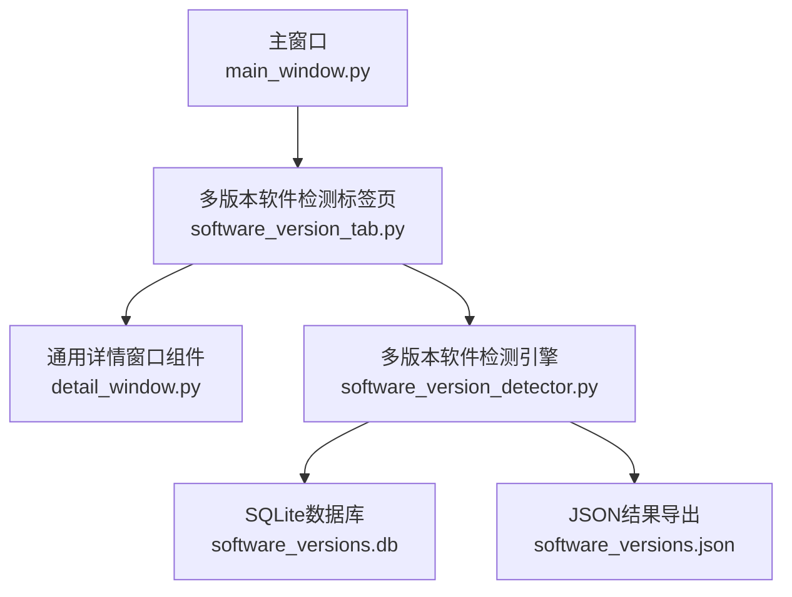
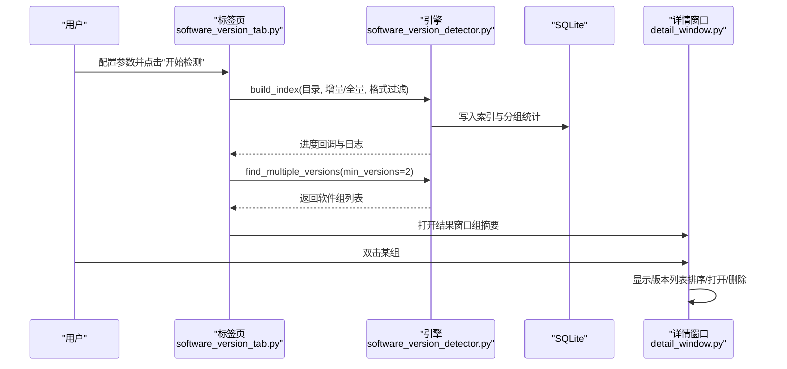
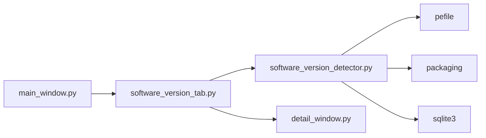

# 多版本软件检测标签页

<cite>
**本文引用的文件**
- [software_version_tab.py](file://gui_modules/software_version_tab.py)
- [software_version_detector.py](file://core/software_version_detector.py)
- [detail_window.py](file://gui_modules/detail_window.py)
- [main_window.py](file://gui_modules/main_window.py)
- [README.md](file://README.md)
- [requirements.txt](file://requirements.txt)
</cite>

## 目录
1. [简介](#简介)
2. [项目结构](#项目结构)
3. [核心组件](#核心组件)
4. [架构总览](#架构总览)
5. [详细组件分析](#详细组件分析)
6. [依赖关系分析](#依赖关系分析)
7. [性能考量](#性能考量)
8. [故障排查指南](#故障排查指南)
9. [结论](#结论)
10. [附录：使用指南与扩展建议](#附录：使用指南与扩展建议)

## 简介
本章节面向“多版本软件检测”标签页，系统性说明其界面布局、PE元数据提取的展示方式、软件识别结果的可视化、版本比较交互、语义化版本解析展示、结果详情窗口功能、参数配置、结果分类展示、版本历史对比能力，并提供使用指南与界面扩展开发建议。该功能通过GUI层与核心引擎协同工作，实现从扫描、索引、分组到可视化的完整流程。

## 项目结构
- GUI层
  - 主窗口负责标签页组织与共享状态管理
  - 多版本软件检测标签页提供配置区、控制按钮、进度条、日志区和结果查看入口
  - 通用详情窗口组件统一呈现不同场景的文件/版本列表与操作
- 核心引擎层
  - 多版本软件检测器负责PE元数据提取、软件识别、版本比较、数据库索引与统计、结果导出
- 数据层
  - SQLite数据库用于持久化索引与分组统计信息
  - JSON文件用于结果导出

图表来源
- [main_window.py:62-85](file://gui_modules/main_window.py#L62-L85)
- [software_version_tab.py:18-32](file://gui_modules/software_version_tab.py#L18-L32)
- [software_version_detector.py:109-159](file://core/software_version_detector.py#L109-L159)

章节来源
- [main_window.py:62-85](file://gui_modules/main_window.py#L62-L85)
- [software_version_tab.py:18-32](file://gui_modules/software_version_tab.py#L18-L32)
- [software_version_detector.py:109-159](file://core/software_version_detector.py#L109-L159)

## 核心组件
- 多版本软件检测标签页（GUI）
  - 负责用户配置（数据库路径、输出路径、扫描方式、文件格式过滤）、启动扫描、进度更新、日志输出、结果窗口打开与交互
- 多版本软件检测引擎（Core）
  - 负责扫描可执行文件、提取PE元数据、识别软件身份、构建索引、统计分组、查找多版本软件、导出结果
- 通用详情窗口组件（GUI）
  - 提供统一的详情窗口框架，支持列定义、排序、预览区域（图片/视频）、操作列（打开/删除）等

章节来源
- [software_version_tab.py:18-178](file://gui_modules/software_version_tab.py#L18-L178)
- [software_version_detector.py:30-103](file://core/software_version_detector.py#L30-L103)
- [detail_window.py:99-218](file://gui_modules/detail_window.py#L99-L218)

## 架构总览
多版本软件检测标签页采用“配置-扫描-展示”三段式架构：
- 配置阶段：用户在界面选择数据库与输出路径、扫描模式（全量/增量）、文件格式过滤（EXE/DLL/MSI/JAR/PYD及自定义后缀）
- 扫描阶段：标签页调用引擎进行索引构建与分组统计，期间实时更新进度与日志
- 展示阶段：结果窗口以表格形式列出软件组摘要；双击进入详情窗口，展示每个软件的各版本文件列表，支持排序、打开位置、删除等操作

图表来源
- [software_version_tab.py:272-372](file://gui_modules/software_version_tab.py#L272-L372)
- [software_version_detector.py:391-481](file://core/software_version_detector.py#L391-L481)
- [software_version_detector.py:540-604](file://core/software_version_detector.py#L540-L604)
- [detail_window.py:687-713](file://gui_modules/detail_window.py#L687-L713)

## 详细组件分析

### 界面布局与交互
- 配置区域
  - 数据库路径与输出文件路径选择
  - 扫描方式：全量扫描（自动清空旧数据）与增量扫描（仅新增/修改）
  - 文件格式过滤：内置EXE/DLL/MSI/JAR/PYD复选框，支持“全选”联动；自定义后缀输入（逗号/分号/空格分隔），自动规范化为带点前缀
- 控制与反馈
  - “开始检测”、“停止”、“结果”按钮
  - 进度条与状态文本实时刷新
  - 运行日志区域记录关键步骤与错误信息
- 结果窗口
  - 表格列：软件名称、版本数量、总大小、最新版本、操作（隐藏）
  - 支持列标题排序（版本数量按数字、大小按字节换算、其他按字符串）
  - 右键菜单：查看详情、打开文件夹、隐藏此组、显示所有隐藏的组
  - 双击组别进入详情窗口

章节来源
- [software_version_tab.py:34-178](file://gui_modules/software_version_tab.py#L34-L178)
- [software_version_tab.py:421-470](file://gui_modules/software_version_tab.py#L421-L470)
- [software_version_tab.py:514-558](file://gui_modules/software_version_tab.py#L514-L558)
- [software_version_tab.py:682-758](file://gui_modules/software_version_tab.py#L682-L758)

### PE元数据提取与展示
- 引擎侧
  - 使用pefile读取PE文件的VS_VERSIONINFO，提取公司名、产品名、文件版本、产品版本、描述、原始文件名等字段
  - 对PE信息进行LRU缓存以提升性能
- 界面侧
  - 在详情窗口的“版本号”列中展示每个文件的版本信息
  - 若无法获取版本信息，则显示“unknown”，并在排序时置于末尾（语义化版本比较）

章节来源
- [software_version_detector.py:178-244](file://core/software_version_detector.py#L178-L244)
- [detail_window.py:687-713](file://gui_modules/detail_window.py#L687-L713)

### 软件识别与结果可视化
- 识别策略（三级优先级）
  - 优先使用PE信息（ProductName + CompanyName）生成唯一标识
  - 其次基于文件名模式匹配（如Python、Node.js、JDK、浏览器、开发工具等）
  - 最后从路径中提取版本号并以文件名作为软件名
- 结果可视化
  - 结果窗口汇总每个软件的组摘要（版本数量、总大小、最新版本）
  - 详情窗口列出该软件的各版本文件，支持排序、打开位置、删除

章节来源
- [software_version_detector.py:246-316](file://core/software_version_detector.py#L246-L316)
- [software_version_tab.py:472-494](file://gui_modules/software_version_tab.py#L472-L494)
- [detail_window.py:687-713](file://gui_modules/detail_window.py#L687-L713)

### 版本比较与语义化版本解析
- 版本比较
  - 使用packaging.version进行语义化版本比较，兼容标准语义化版本
  - 当无法解析时降级为字符串比较
- 展示方式
  - 详情窗口“版本号”列展示每个文件的版本字符串
  - 结果窗口“最新版本”列展示该组内最新版本的字符串
  - 排序逻辑对“unknown”等非标准版本进行特殊处理，确保合理顺序

章节来源
- [software_version_detector.py:318-354](file://core/software_version_detector.py#L318-L354)
- [software_version_detector.py:527-538](file://core/software_version_detector.py#L527-L538)
- [software_version_tab.py:514-558](file://gui_modules/software_version_tab.py#L514-L558)

### 结果详情窗口功能
- 通用详情窗口组件提供统一框架
  - 列定义与宽度、表头、排序、滚动条、Tooltip（长路径悬停显示）
  - 操作列：打开文件所在目录、删除文件（支持异步批处理删除）
  - 预览区域：针对图片/视频场景提供预览（软件版本场景无预览）
- 软件版本详情
  - 列：版本号、大小、完整路径、打开、删除
  - 顶部信息标签：显示版本总数与总大小
  - 双击行打开文件所在位置；点击删除触发确认与异步删除任务

章节来源
- [detail_window.py:99-218](file://gui_modules/detail_window.py#L99-L218)
- [detail_window.py:220-356](file://gui_modules/detail_window.py#L220-L356)
- [detail_window.py:403-505](file://gui_modules/detail_window.py#L403-L505)
- [detail_window.py:687-713](file://gui_modules/detail_window.py#L687-L713)
- [software_version_tab.py:644-680](file://gui_modules/software_version_tab.py#L644-L680)

### 软件检测参数配置
- 数据库路径：SQLite数据库文件路径，用于存储索引与分组统计
- 输出文件路径：JSON结果导出路径
- 扫描方式：
  - 全量扫描：自动清空旧数据后重新扫描
  - 增量扫描：保留历史数据，仅处理新增或修改的文件
- 文件格式过滤：
  - 内置格式：EXE、DLL、MSI、JAR、PYD
  - 自定义后缀：支持多个后缀，自动规范化为带点前缀
- 这些参数在标签页界面中提供直观的选择与输入，并在扫描时传递给引擎

章节来源
- [software_version_tab.py:34-124](file://gui_modules/software_version_tab.py#L34-L124)
- [software_version_tab.py:237-270](file://gui_modules/software_version_tab.py#L237-L270)
- [software_version_tab.py:301-346](file://gui_modules/software_version_tab.py#L301-L346)

### 结果分类展示与版本历史对比
- 结果分类展示
  - 结果窗口按软件组聚合展示，包含版本数量、总大小、最新版本等信息
  - 支持列标题排序与隐藏/显示组别
- 版本历史对比
  - 详情窗口列出该软件的各版本文件，可通过“版本号”列进行排序，便于对比不同版本
  - 结合“大小”列与“完整路径”列，辅助判断版本差异与占用空间
  - 当前未提供跨组的历史趋势图，但可通过排序与筛选完成基本对比

章节来源
- [software_version_tab.py:472-494](file://gui_modules/software_version_tab.py#L472-L494)
- [software_version_tab.py:514-558](file://gui_modules/software_version_tab.py#L514-L558)
- [detail_window.py:687-713](file://gui_modules/detail_window.py#L687-L713)

## 依赖关系分析
- GUI层依赖
  - 主窗口组织标签页，将多版本软件检测标签页加入Notebook
  - 标签页依赖通用详情窗口组件以复用详情展示逻辑
- 核心引擎依赖
  - pefile用于PE元数据提取
  - packaging用于语义化版本比较
  - sqlite3用于数据存储与查询
- 外部依赖
  - requirements.txt声明了可选优化包与v4功能所需依赖

图表来源
- [main_window.py:62-85](file://gui_modules/main_window.py#L62-L85)
- [software_version_tab.py:301-346](file://gui_modules/software_version_tab.py#L301-L346)
- [software_version_detector.py:17-27](file://core/software_version_detector.py#L17-L27)
- [requirements.txt:21-23](file://requirements.txt#L21-L23)

章节来源
- [main_window.py:62-85](file://gui_modules/main_window.py#L62-L85)
- [software_version_tab.py:301-346](file://gui_modules/software_version_tab.py#L301-L346)
- [software_version_detector.py:17-27](file://core/software_version_detector.py#L17-L27)
- [requirements.txt:21-23](file://requirements.txt#L21-L23)

## 性能考量
- 数据库优化
  - WAL模式、同步策略、内存临时存储、缓存大小调整，提升并发与写入性能
- 批量处理
  - 索引构建采用批次提交，减少频繁IO开销
- 缓存机制
  - PE信息LRU缓存，避免重复解析大文件
- 进度与日志
  - 线程回调更新进度与日志，保证UI响应性
- 建议
  - 首次使用建议全量扫描，后续日常维护使用增量扫描
  - 合理设置文件格式过滤，缩小扫描范围提升速度
  - 对于超大目录，分批扫描或限制深度

章节来源
- [software_version_detector.py:109-159](file://core/software_version_detector.py#L109-L159)
- [software_version_detector.py:410-481](file://core/software_version_detector.py#L410-L481)
- [software_version_detector.py:88-95](file://core/software_version_detector.py#L88-L95)

## 故障排查指南
- 常见问题
  - 未安装pefile或packaging导致功能不可用：根据提示安装依赖
  - 某些软件显示“unknown”版本：检查PE信息是否嵌入、文件名或路径是否包含版本信息
  - 扫描速度慢：启用增量扫描、缩小文件格式过滤范围、关闭无关程序释放资源
- 操作步骤
  - 查看运行日志定位错误信息
  - 检查数据库是否存在且可读写
  - 确认输出路径有效并可写
  - 重启程序后直接点击“结果”可从数据库加载历史数据

章节来源
- [software_version_detector.py:17-27](file://core/software_version_detector.py#L17-L27)
- [software_version_tab.py:301-372](file://gui_modules/software_version_tab.py#L301-L372)
- [README.md:600-636](file://README.md#L600-L636)

## 结论
多版本软件检测标签页通过清晰的界面布局、强大的核心引擎与通用的详情窗口组件，实现了从配置、扫描到可视化的完整流程。借助PE元数据提取、智能软件识别与语义化版本比较，能够有效识别同一软件的多版本并展示详细信息，帮助用户进行版本管理与清理。配合增量扫描与数据库优化，兼顾了性能与易用性。

## 附录：使用指南与扩展建议

### 使用指南
- 启动程序并切换到“多版本软件检测”标签页
- 添加要扫描的目录（在主窗口“扫描目录”区域）
- 配置参数：
  - 数据库路径与输出文件路径
  - 选择扫描方式（全量/增量）
  - 勾选需要检测的文件格式或输入自定义后缀
- 点击“开始检测”，观察进度与日志
- 点击“结果”查看软件组摘要；双击某组进入详情窗口查看版本列表
- 在详情窗口中可对版本列表进行排序、打开位置或删除文件

章节来源
- [main_window.py:107-161](file://gui_modules/main_window.py#L107-L161)
- [software_version_tab.py:272-372](file://gui_modules/software_version_tab.py#L272-L372)
- [software_version_tab.py:421-470](file://gui_modules/software_version_tab.py#L421-L470)
- [detail_window.py:403-505](file://gui_modules/detail_window.py#L403-L505)

### 界面扩展开发建议
- 增加更多文件格式过滤选项
  - 在标签页中添加新的复选框与变量，并在_get_selected_formats中合并到formats集合
- 增强结果窗口展示
  - 增加“版本历史趋势”视图（折线图或柱状图），展示各组版本数量随时间的变化
  - 增加“占用空间占比”饼图，辅助决策清理优先级
- 改进详情窗口
  - 为软件版本场景增加“版本差异对比”视图，高亮显示文件大小与修改时间差异
  - 增加批量操作（批量打开、批量删除）与撤销功能
- 优化性能
  - 引入更细粒度的并行处理（如按目录分片）
  - 增加更详细的性能指标（CPU/内存/IO利用率）
- 增强可配置性
  - 允许用户自定义软件识别模式（正则表达式）
  - 支持导入/导出配置模板，便于团队协作

章节来源
- [software_version_tab.py:77-124](file://gui_modules/software_version_tab.py#L77-L124)
- [software_version_tab.py:237-270](file://gui_modules/software_version_tab.py#L237-L270)
- [detail_window.py:99-218](file://gui_modules/detail_window.py#L99-L218)