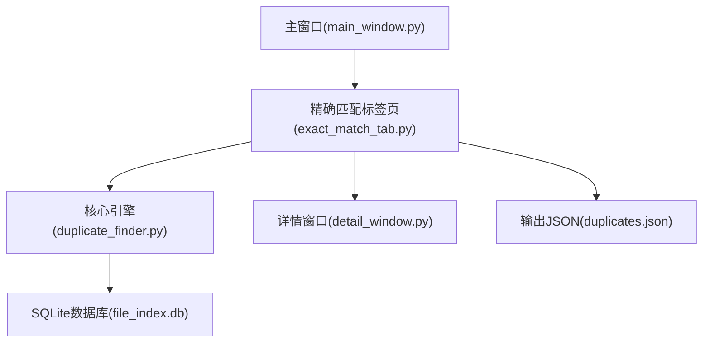
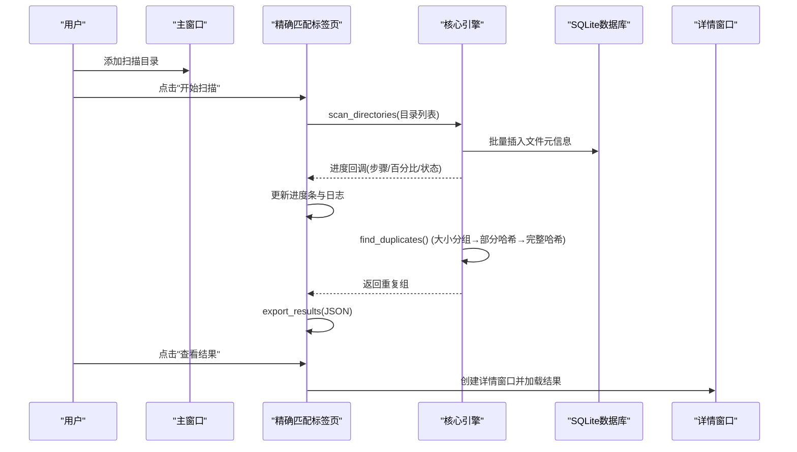
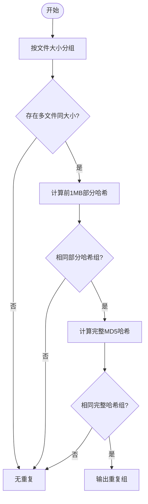
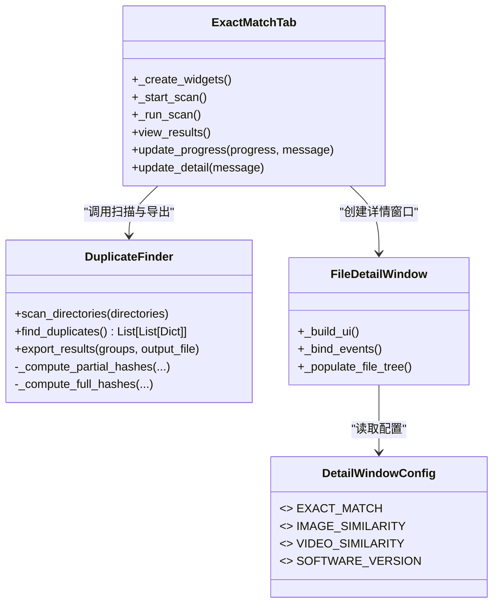

# 精确匹配标签页

<cite>
**本文引用的文件**
- [exact_match_tab.py](file://gui_modules/exact_match_tab.py)
- [main_window.py](file://gui_modules/main_window.py)
- [duplicate_finder.py](file://core/duplicate_finder.py)
- [detail_window.py](file://gui_modules/detail_window.py)
- [README.md](file://README.md)
- [GUI_SPECIFICATION.md](file://docs/GUI_SPECIFICATION.md)
</cite>

## 目录
1. [简介](#简介)
2. [项目结构](#项目结构)
3. [核心组件](#核心组件)
4. [架构总览](#架构总览)
5. [详细组件分析](#详细组件分析)
6. [依赖关系分析](#依赖关系分析)
7. [性能考量](#性能考量)
8. [故障排查指南](#故障排查指南)
9. [结论](#结论)
10. [附录：使用指南与界面定制建议](#附录使用指南与界面定制建议)

## 简介
本章节面向“精确匹配”功能，系统性说明其界面布局、参数配置选项、操作流程、多级哈希策略的展示与结果呈现方式，以及界面元素属性、事件处理机制与用户交互设计。目标是帮助使用者快速上手并高效完成TB级文件的精确重复检测与清理。

## 项目结构
精确匹配标签页由以下模块协作构成：
- GUI层：主窗口与标签页容器负责页面组织与事件分发；精确匹配标签页提供设置区、控制按钮、进度与日志区域；详情窗口统一展示组内文件。
- 引擎层：核心扫描器实现多级哈希去重算法（文件大小→部分哈希→完整哈希），并提供数据库索引、并行计算与结果导出。
- 数据层：SQLite数据库用于索引文件元信息与中间哈希结果，支持WAL模式与批量写入优化。

图表来源
- [main_window.py:62-85](file://gui_modules/main_window.py#L62-L85)
- [exact_match_tab.py:21-114](file://gui_modules/exact_match_tab.py#L21-L114)
- [duplicate_finder.py:133-175](file://core/duplicate_finder.py#L133-L175)

章节来源
- [main_window.py:62-85](file://gui_modules/main_window.py#L62-L85)
- [exact_match_tab.py:21-114](file://gui_modules/exact_match_tab.py#L21-L114)
- [duplicate_finder.py:133-175](file://core/duplicate_finder.py#L133-L175)

## 核心组件
- 精确匹配标签页（ExactMatchTab）
  - 负责界面构建、参数收集、启动/停止扫描、进度与日志更新、结果查看与筛选。
- 核心引擎（DuplicateFinder）
  - 负责目录扫描、多级哈希计算、重复组发现、统计与结果导出。
- 详情窗口（FileDetailWindow + DetailWindowConfig）
  - 统一渲染重复组内的文件列表，支持打开路径、删除操作、排序与Tooltip提示。

章节来源
- [exact_match_tab.py:18-114](file://gui_modules/exact_match_tab.py#L18-L114)
- [duplicate_finder.py:25-73](file://core/duplicate_finder.py#L25-L73)
- [detail_window.py:99-218](file://gui_modules/detail_window.py#L99-L218)

## 架构总览
精确匹配从用户界面触发，进入后台线程执行扫描，通过核心引擎的多级哈希策略识别重复文件，最终将结果导出为JSON并在详情窗口中可视化。

图表来源
- [exact_match_tab.py:293-379](file://gui_modules/exact_match_tab.py#L293-L379)
- [duplicate_finder.py:208-387](file://core/duplicate_finder.py#L208-L387)
- [duplicate_finder.py:597-658](file://core/duplicate_finder.py#L597-L658)
- [detail_window.py:599-619](file://gui_modules/detail_window.py#L599-L619)

## 详细组件分析

### 界面布局与控件
- 设置区域
  - 数据库路径：默认 file_index.db，支持浏览选择。
  - 输出文件：默认 duplicates.json，支持浏览选择。
  - 并行线程：Spinbox 1-32，附带HDD/SSD建议值提示。
  - 文件类型过滤：全部/图片/视频/音频/文本/应用/压缩，支持自定义后缀（逗号或分号分隔）。
- 控制按钮
  - 开始扫描、停止、查看结果。
- 进度区域
  - 进度条、状态文本、详细信息文本。
- 日志区域
  - 滚动文本框，带时间戳与级别标记。

章节来源
- [exact_match_tab.py:43-114](file://gui_modules/exact_match_tab.py#L43-L114)
- [exact_match_tab.py:115-186](file://gui_modules/exact_match_tab.py#L115-L186)

### 参数配置选项
- 数据库路径与输出路径：决定索引与结果落盘位置。
- 并行线程数：影响I/O并发度，HDD建议4-8，SSD建议8-16。
- 文件类型过滤：减少无关文件扫描范围，提升效率。
- 自定义后缀：灵活扩展支持的文件格式集合。

章节来源
- [exact_match_tab.py:248-291](file://gui_modules/exact_match_tab.py#L248-L291)

### 操作流程
- 添加扫描目录（在主窗口顶部面板）。
- 在“精确匹配”标签页配置参数。
- 点击“开始扫描”，后台线程执行扫描与去重。
- 实时查看进度与日志。
- 扫描完成后点击“查看结果”，打开详情窗口进行筛选与操作。

章节来源
- [main_window.py:107-161](file://gui_modules/main_window.py#L107-L161)
- [exact_match_tab.py:293-379](file://gui_modules/exact_match_tab.py#L293-L379)

### 多级哈希策略与界面展示
- 策略流程
  - 步骤1：基于文件大小分组，快速缩小候选集。
  - 步骤2：计算前1MB的部分哈希，进一步筛除差异文件。
  - 步骤3：对剩余候选计算完整MD5哈希，确认重复组。
- 界面展示
  - 进度区域会按阶段显示当前步骤与百分比。
  - 日志区域输出每步统计信息（如候选组数量、剩余组数等）。
  - 结果窗口以Treeview展示重复组摘要（文件大小、数量、主要后缀），支持排序与隐藏。

图表来源
- [duplicate_finder.py:324-387](file://core/duplicate_finder.py#L324-L387)
- [duplicate_finder.py:436-504](file://core/duplicate_finder.py#L436-L504)
- [duplicate_finder.py:506-595](file://core/duplicate_finder.py#L506-L595)

章节来源
- [duplicate_finder.py:324-387](file://core/duplicate_finder.py#L324-L387)
- [exact_match_tab.py:381-384](file://gui_modules/exact_match_tab.py#L381-L384)

### 结果展示与交互
- 结果窗口
  - 顶部摘要：总文件数、总大小、重复组数、重复文件数、浪费空间。
  - 筛选条件：后缀模糊匹配、文件大小范围（B/KB/MB/GB）。
  - 列表：重复组摘要，支持列排序、隐藏/显示某组。
  - 双击组：打开详情窗口，展示组内文件列表。
- 详情窗口
  - 列：大小、后缀、完整路径、打开、删除。
  - 行为：双击路径打开所在文件夹；点击“打开”直接打开文件；点击“删除”可删除文件。
  - Tooltip：长路径悬停显示完整内容。

章节来源
- [exact_match_tab.py:385-728](file://gui_modules/exact_match_tab.py#L385-L728)
- [detail_window.py:220-597](file://gui_modules/detail_window.py#L220-L597)

### 事件处理机制
- 扫描控制
  - 开始扫描：校验是否正在扫描，设置停止标志，启动后台线程。
  - 停止扫描：设置停止标志，恢复按钮状态。
- 进度与日志
  - 进度回调：更新进度条、状态与详细信息。
  - 日志回调：追加带时间戳的日志行。
- 结果交互
  - 筛选应用：根据后缀与大小范围过滤组。
  - 排序：支持按大小、数量、后缀排序（大小列自动解析单位）。
  - 隐藏/显示：维护隐藏集合，刷新Treeview。
  - 打开/删除：调用系统命令打开文件或执行删除。

章节来源
- [exact_match_tab.py:199-227](file://gui_modules/exact_match_tab.py#L199-L227)
- [exact_match_tab.py:293-379](file://gui_modules/exact_match_tab.py#L293-L379)
- [exact_match_tab.py:572-645](file://gui_modules/exact_match_tab.py#L572-L645)
- [detail_window.py:403-505](file://gui_modules/detail_window.py#L403-L505)

### 类与关系图

图表来源
- [exact_match_tab.py:18-114](file://gui_modules/exact_match_tab.py#L18-L114)
- [duplicate_finder.py:25-73](file://core/duplicate_finder.py#L25-L73)
- [detail_window.py:99-218](file://gui_modules/detail_window.py#L99-L218)

## 依赖关系分析
- GUI到引擎
  - 精确匹配标签页通过构造DuplicateFinder实例，传入数据库路径、线程数、允许后缀、进度与日志回调、停止标志。
- 引擎到存储
  - 使用SQLite WAL模式与批量插入优化，建立索引加速查询。
- 引擎到输出
  - 流式写入JSON，避免内存峰值，包含扫描摘要与重复组列表。
- GUI到详情
  - 详情窗口通过配置字典驱动不同页签的列、宽度、预览能力与标题。

章节来源
- [exact_match_tab.py:320-352](file://gui_modules/exact_match_tab.py#L320-L352)
- [duplicate_finder.py:133-175](file://core/duplicate_finder.py#L133-L175)
- [duplicate_finder.py:597-658](file://core/duplicate_finder.py#L597-L658)
- [detail_window.py:99-218](file://gui_modules/detail_window.py#L99-L218)

## 性能考量
- 多线程与磁盘类型自适应
  - 自动检测CPU核心数与磁盘类型（HDD/SSD），动态调整最大工作线程数，避免HDD寻道风暴。
- 数据库优化
  - WAL模式、降低同步频率、增大缓存与内存映射，批量插入减少事务次数。
- I/O与哈希计算
  - 部分哈希仅读前1MB，完整哈希按块读取，减少内存占用与I/O压力。
- UI刷新频率
  - 进度与日志更新降低频率，避免频繁UI重绘导致卡顿。

章节来源
- [duplicate_finder.py:75-131](file://core/duplicate_finder.py#L75-L131)
- [duplicate_finder.py:133-175](file://core/duplicate_finder.py#L133-L175)
- [duplicate_finder.py:436-504](file://core/duplicate_finder.py#L436-L504)
- [duplicate_finder.py:506-595](file://core/duplicate_finder.py#L506-L595)

## 故障排查指南
- 扫描失败
  - 检查目录是否存在与权限，查看日志中的错误信息。
  - 若出现数据库锁定，确认WAL与busy_timeout已启用。
- 结果文件不存在
  - 确保先执行扫描，再查看结果；检查输出路径是否有写权限。
- 筛选不生效
  - 确认后缀输入规范（支持带或不带点的前缀），大小范围单位选择正确。
- 详情窗口无法打开路径
  - 检查系统命令（explorer/xdg-open）是否可用，路径是否正确。

章节来源
- [exact_match_tab.py:368-379](file://gui_modules/exact_match_tab.py#L368-L379)
- [exact_match_tab.py:385-400](file://gui_modules/exact_match_tab.py#L385-L400)
- [duplicate_finder.py:190-201](file://core/duplicate_finder.py#L190-L201)

## 结论
精确匹配标签页提供了直观的界面与强大的后端引擎，通过多级哈希策略高效识别重复文件。结合灵活的参数配置、实时进度反馈与丰富的结果筛选与操作能力，可满足TB级数据的去重需求。建议在大规模场景下合理设置线程数与文件类型过滤，以获得最佳性能。

## 附录：使用指南与界面定制建议
- 使用指南
  - 添加扫描目录后，在“精确匹配”标签页设置数据库与输出路径、线程数与文件类型过滤。
  - 点击“开始扫描”，观察进度与日志；完成后点击“查看结果”进行筛选与操作。
  - 在详情窗口中双击路径打开文件夹，或使用“打开/删除”按钮进行操作。
- 界面定制建议
  - 遵循GUI规范：统一字体、颜色与布局；固定操作列宽度并设置stretch=False。
  - 使用配置字典驱动不同页签的差异，便于扩展与维护。
  - 为长文本列启用Tooltip，提升可读性。
  - 批量更新UI时减少刷新频率，保证流畅体验。

章节来源
- [GUI_SPECIFICATION.md:153-244](file://docs/GUI_SPECIFICATION.md#L153-L244)
- [GUI_SPECIFICATION.md:247-350](file://docs/GUI_SPECIFICATION.md#L247-L350)
- [GUI_SPECIFICATION.md:353-527](file://docs/GUI_SPECIFICATION.md#L353-L527)
- [README.md:27-49](file://README.md#L27-L49)