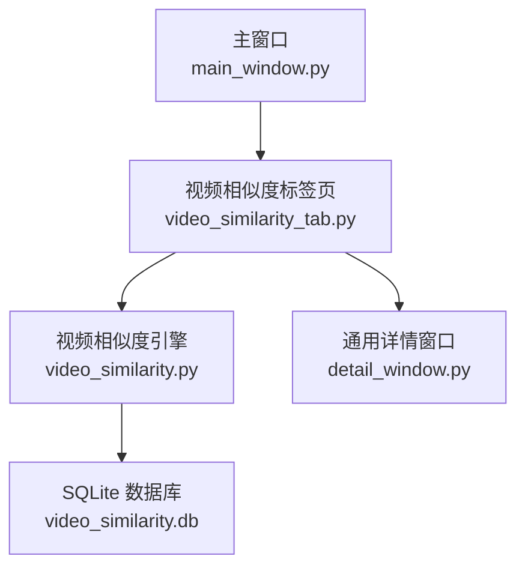
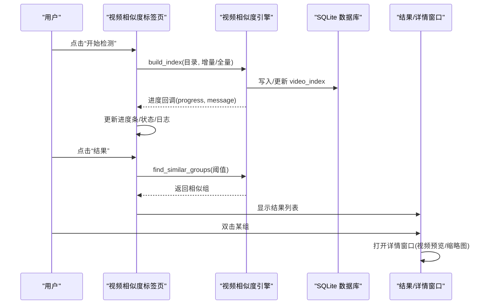
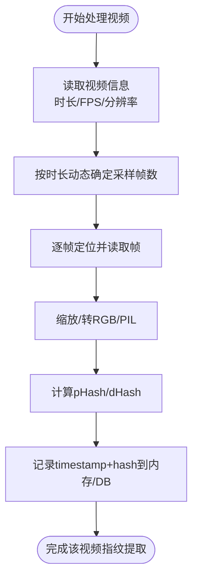
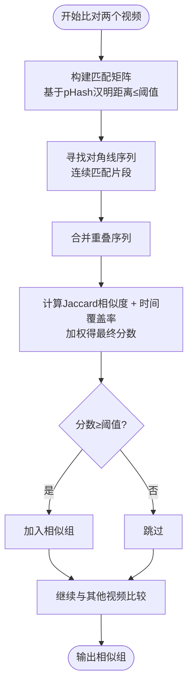
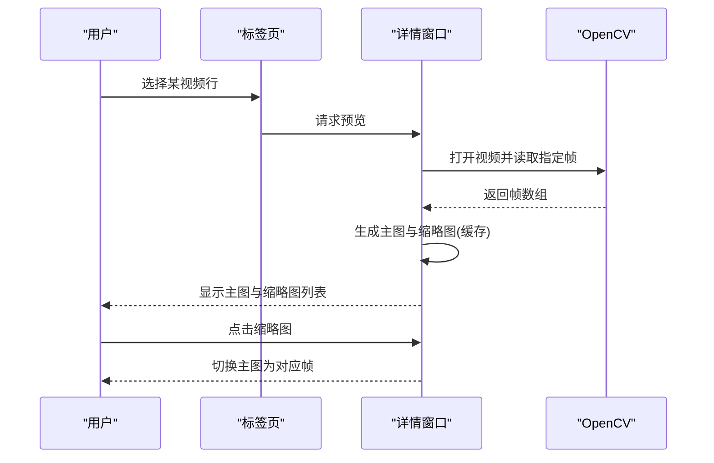
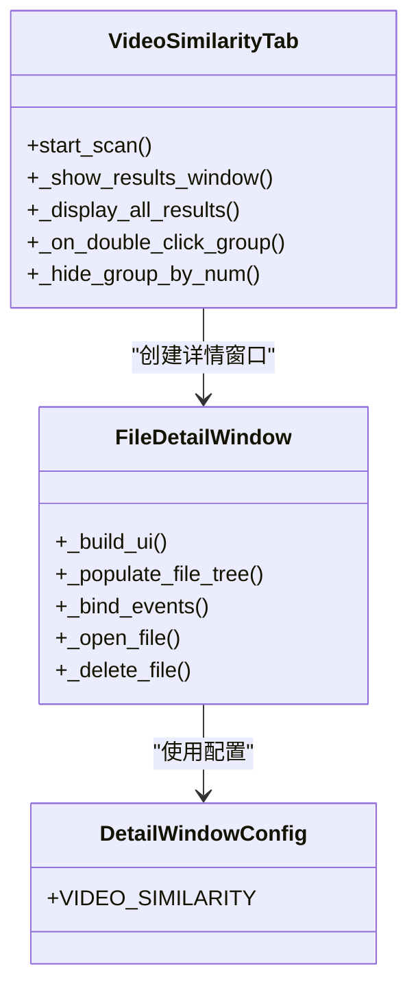
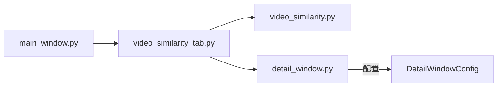

# 视频相似度检测标签页

<cite>
**本文引用的文件**
- [gui_modules/video_similarity_tab.py](file://gui_modules/video_similarity_tab.py)
- [core/video_similarity.py](file://core/video_similarity.py)
- [gui_modules/detail_window.py](file://gui_modules/detail_window.py)
- [gui_modules/main_window.py](file://gui_modules/main_window.py)
- [README.md](file://README.md)
- [docs/GUI_SPECIFICATION.md](file://docs/GUI_SPECIFICATION.md)
</cite>

## 目录
1. [简介](#简介)
2. [项目结构](#项目结构)
3. [核心组件](#核心组件)
4. [架构总览](#架构总览)
5. [详细组件分析](#详细组件分析)
6. [依赖关系分析](#依赖关系分析)
7. [性能与优化](#性能与优化)
8. [故障排查指南](#故障排查指南)
9. [使用指南](#使用指南)
10. [界面定制建议](#界面定制建议)
11. [结论](#结论)

## 简介
本章节面向“视频相似度检测”标签页，系统性说明其界面布局、关键帧提取参数配置、滑动窗口匹配展示、进度可视化、关键帧预览、结果交互、详情窗口与播放控制等能力。同时提供使用流程与界面定制建议，帮助非技术用户快速上手并满足个性化需求。

## 项目结构
- GUI层：视频相似度标签页负责配置、执行、结果展示与交互；通用详情窗口用于统一展示相似组详情与预览。
- 引擎层：视频相似度引擎负责关键帧提取、指纹计算、相似度比对与分组。
- 主窗口：管理标签页切换、目录选择、全局状态（扫描中/停止标志）。

图表来源
- [gui_modules/main_window.py:62-85](file://gui_modules/main_window.py#L62-L85)
- [gui_modules/video_similarity_tab.py:18-48](file://gui_modules/video_similarity_tab.py#L18-L48)
- [core/video_similarity.py:174-203](file://core/video_similarity.py#L174-L203)
- [gui_modules/detail_window.py:220-258](file://gui_modules/detail_window.py#L220-L258)

章节来源
- [gui_modules/main_window.py:62-85](file://gui_modules/main_window.py#L62-L85)
- [gui_modules/video_similarity_tab.py:18-48](file://gui_modules/video_similarity_tab.py#L18-L48)
- [core/video_similarity.py:174-203](file://core/video_similarity.py#L174-L203)
- [gui_modules/detail_window.py:220-258](file://gui_modules/detail_window.py#L220-L258)

## 核心组件
- 视频相似度标签页：提供阈值设置、扫描方式（全量/增量）、数据库路径、格式过滤、开始/停止/结果按钮、进度条、日志区、多帧预览与结果列表。
- 视频相似度引擎：实现关键帧采样、pHash/dHash 计算、滑动窗口对角线序列匹配、相似度评分与分组。
- 通用详情窗口：提供统一的详情展示框架，支持图片/视频预览、排序、打开/删除操作列、Tooltip 提示。

章节来源
- [gui_modules/video_similarity_tab.py:50-205](file://gui_modules/video_similarity_tab.py#L50-L205)
- [core/video_similarity.py:21-151](file://core/video_similarity.py#L21-L151)
- [gui_modules/detail_window.py:99-190](file://gui_modules/detail_window.py#L99-L190)

## 架构总览
视频相似度检测从用户点击“开始检测”触发，标签页在后台线程调用引擎构建索引（关键帧提取+指纹存储），随后进行相似度比对与分组，最终通过结果窗口与详情窗口展示。

图表来源
- [gui_modules/video_similarity_tab.py:331-418](file://gui_modules/video_similarity_tab.py#L331-L418)
- [core/video_similarity.py:310-367](file://core/video_similarity.py#L310-L367)
- [core/video_similarity.py:547-652](file://core/video_similarity.py#L547-L652)
- [gui_modules/detail_window.py:642-684](file://gui_modules/detail_window.py#L642-L684)

## 详细组件分析

### 界面布局与控件
- 检测设置区
  - 相似度阈值：滑块范围 5–30，实时显示“严格/平衡/宽松”模式提示。
  - 扫描方式：全量扫描或增量扫描（保留历史数据）。
  - 数据库路径：可浏览选择 .db 文件。
- 视频格式过滤
  - 预设格式多选（MP4/AVI/MKV/MOV/WMV/FLV/WebM）与“全部”联动。
  - 自定义后缀输入，支持逗号/分号/空格分隔。
- 控制按钮
  - 开始检测、停止、结果查看。
- 进度与日志
  - 进度条实时更新百分比与状态文本。
  - 运行日志带时间戳与级别，便于问题定位。

章节来源
- [gui_modules/video_similarity_tab.py:50-205](file://gui_modules/video_similarity_tab.py#L50-L205)
- [gui_modules/video_similarity_tab.py:248-319](file://gui_modules/video_similarity_tab.py#L248-L319)
- [gui_modules/video_similarity_tab.py:331-418](file://gui_modules/video_similarity_tab.py#L331-L418)

### 关键帧提取与参数配置
- 动态采样策略：根据视频时长自动决定采样帧数（短视频5帧、中短视频10帧、中长视频20帧、长视频每分钟1帧最多50帧）。
- 帧预处理：缩放至统一尺寸、BGR转RGB、PIL转换、计算 pHash 与 dHash。
- 指纹存储：将每帧的时间戳与哈希串存入 SQLite 的 frame_hashes 字段。

图表来源
- [core/video_similarity.py:21-151](file://core/video_similarity.py#L21-L151)
- [core/video_similarity.py:154-172](file://core/video_similarity.py#L154-L172)
- [core/video_similarity.py:310-367](file://core/video_similarity.py#L310-L367)

章节来源
- [core/video_similarity.py:21-151](file://core/video_similarity.py#L21-L151)
- [core/video_similarity.py:154-172](file://core/video_similarity.py#L154-L172)
- [core/video_similarity.py:310-367](file://core/video_similarity.py#L310-L367)

### 滑动窗口匹配与相似度展示
- 匹配矩阵：基于两视频的关键帧 pHash 汉明距离是否小于阈值构建 0/1 矩阵。
- 对角线序列：寻找连续匹配的对角线段，合并重叠段。
- 相似度评分：综合 Jaccard 相似度与时间覆盖率加权得出最终分数。
- 结果分组：将相似度≥阈值的视频归为一组，计算组内平均相似度。

图表来源
- [core/video_similarity.py:498-545](file://core/video_similarity.py#L498-L545)
- [core/video_similarity.py:547-652](file://core/video_similarity.py#L547-L652)

章节来源
- [core/video_similarity.py:498-545](file://core/video_similarity.py#L498-L545)
- [core/video_similarity.py:547-652](file://core/video_similarity.py#L547-L652)

### 进度可视化与日志
- 进度条：由引擎回调 progress 驱动，标签页更新 UI。
- 状态文本：显示当前处理数量与百分比。
- 日志：带时间戳与级别，记录关键步骤与错误。

章节来源
- [gui_modules/video_similarity_tab.py:206-218](file://gui_modules/video_similarity_tab.py#L206-L218)
- [core/video_similarity.py:260-270](file://core/video_similarity.py#L260-L270)

### 关键帧预览功能
- 多帧缩略图：根据视频时长智能选择关键时间点（开头、中间、结尾附近），生成缩略图并横向排列。
- 主预览图：点击任意缩略图即可切换到对应帧的大图预览。
- 缓存机制：对已加载的视频帧进行缓存，避免重复解码。

图表来源
- [gui_modules/video_similarity_tab.py:455-651](file://gui_modules/video_similarity_tab.py#L455-L651)
- [gui_modules/detail_window.py:364-402](file://gui_modules/detail_window.py#L364-L402)
- [gui_modules/detail_window.py:537-541](file://gui_modules/detail_window.py#L537-L541)

章节来源
- [gui_modules/video_similarity_tab.py:455-651](file://gui_modules/video_similarity_tab.py#L455-L651)
- [gui_modules/detail_window.py:364-402](file://gui_modules/detail_window.py#L364-L402)
- [gui_modules/detail_window.py:537-541](file://gui_modules/detail_window.py#L537-L541)

### 结果详情窗口与交互
- 结果列表：显示每组平均相似度、视频数量、总时长、总大小，支持排序与隐藏/显示组。
- 详情窗口：展示组内每个视频的详细信息（时长、分辨率、帧率、大小、路径），支持打开文件夹、删除文件。
- 右键菜单：查看详情、打开文件夹、隐藏/显示组。

图表来源
- [gui_modules/video_similarity_tab.py:686-789](file://gui_modules/video_similarity_tab.py#L686-L789)
- [gui_modules/detail_window.py:99-190](file://gui_modules/detail_window.py#L99-L190)
- [gui_modules/detail_window.py:220-358](file://gui_modules/detail_window.py#L220-L358)

章节来源
- [gui_modules/video_similarity_tab.py:686-789](file://gui_modules/video_similarity_tab.py#L686-L789)
- [gui_modules/detail_window.py:99-190](file://gui_modules/detail_window.py#L99-L190)
- [gui_modules/detail_window.py:220-358](file://gui_modules/detail_window.py#L220-L358)

### 视频播放控制功能
- 当前实现以“关键帧预览”为主，支持多帧缩略图与主图切换，不直接嵌入播放器控件。
- 如需完整播放控制，可在详情窗口的预览区域集成播放器控件，并通过缩略图跳转至对应时间点。

章节来源
- [gui_modules/detail_window.py:364-402](file://gui_modules/detail_window.py#L364-L402)
- [gui_modules/video_similarity_tab.py:1025-1190](file://gui_modules/video_similarity_tab.py#L1025-L1190)

## 依赖关系分析
- 标签页依赖引擎接口：build_index、find_similar_groups、进度与日志回调。
- 详情窗口为通用组件，被多个模块复用，降低耦合度。
- 主窗口统一管理标签页生命周期与共享状态。

图表来源
- [gui_modules/main_window.py:62-85](file://gui_modules/main_window.py#L62-L85)
- [gui_modules/video_similarity_tab.py:18-48](file://gui_modules/video_similarity_tab.py#L18-L48)
- [gui_modules/detail_window.py:99-190](file://gui_modules/detail_window.py#L99-L190)

章节来源
- [gui_modules/main_window.py:62-85](file://gui_modules/main_window.py#L62-L85)
- [gui_modules/video_similarity_tab.py:18-48](file://gui_modules/video_similarity_tab.py#L18-L48)
- [gui_modules/detail_window.py:99-190](file://gui_modules/detail_window.py#L99-L190)

## 性能与优化
- 多进程并行：关键帧指纹计算采用进程池，提升吞吐。
- 数据库优化：WAL 模式、同步策略、缓存与内存映射，加速读写。
- 懒加载与缓存：视频预览按需加载并缓存，减少重复解码。
- 增量扫描：保留历史索引，仅处理新增/修改视频，缩短二次扫描时间。

章节来源
- [core/video_similarity.py:199-203](file://core/video_similarity.py#L199-L203)
- [core/video_similarity.py:205-239](file://core/video_similarity.py#L205-L239)
- [gui_modules/video_similarity_tab.py:310-319](file://gui_modules/video_similarity_tab.py#L310-L319)
- [gui_modules/detail_window.py:250-258](file://gui_modules/detail_window.py#L250-L258)

## 故障排查指南
- 无法打开视频：检查 OpenCV 安装与视频编码支持；确认路径存在且可读。
- 进度卡住：检查磁盘 I/O 与 CPU 占用；尝试减小批处理大小或关闭其他程序。
- 结果为空：提高相似度阈值或降低严格度；确认目录包含有效视频文件。
- 预览失败：确保 PIL/OpenCV 可用；检查视频帧提取逻辑与缓存清理。

章节来源
- [gui_modules/video_similarity_tab.py:653-677](file://gui_modules/video_similarity_tab.py#L653-L677)
- [core/video_similarity.py:41-49](file://core/video_similarity.py#L41-L49)
- [gui_modules/detail_window.py:516-535](file://gui_modules/detail_window.py#L516-L535)

## 使用指南
- 添加扫描目录：在主窗口添加需要检测的目录。
- 配置参数：设置相似度阈值、扫描方式、数据库路径与格式过滤。
- 开始检测：点击“开始检测”，观察进度条与日志。
- 查看结果：点击“结果”查看相似组列表，双击进入详情窗口。
- 预览与操作：在详情窗口查看关键帧预览，打开文件或删除文件。

章节来源
- [gui_modules/main_window.py:107-161](file://gui_modules/main_window.py#L107-L161)
- [gui_modules/video_similarity_tab.py:331-418](file://gui_modules/video_similarity_tab.py#L331-L418)
- [gui_modules/detail_window.py:642-684](file://gui_modules/detail_window.py#L642-L684)

## 界面定制建议
- 主题与字体：遵循 GUI 规范，统一使用微软雅黑与 Consolas（日志）。
- 颜色方案：主色调、成功/警告/错误色保持一致。
- 列宽与对齐：固定宽度列需设置 stretch=False，按钮列居中对齐。
- Tooltip：为长路径列启用 Tooltip，提升可读性。
- 响应式布局：预览区域固定宽度，内容区域自适应扩展。

章节来源
- [docs/GUI_SPECIFICATION.md:17-36](file://docs/GUI_SPECIFICATION.md#L17-L36)
- [docs/GUI_SPECIFICATION.md:247-350](file://docs/GUI_SPECIFICATION.md#L247-L350)
- [docs/GUI_SPECIFICATION.md:353-456](file://docs/GUI_SPECIFICATION.md#L353-L456)
- [docs/GUI_SPECIFICATION.md:459-527](file://docs/GUI_SPECIFICATION.md#L459-L527)

## 结论
视频相似度检测标签页提供了完整的配置、执行、可视化与交互能力，结合关键帧提取、滑动窗口匹配与多帧预览，满足大规模视频库的去重与版权检测需求。通过合理的参数调优与界面定制，可进一步提升用户体验与系统性能。