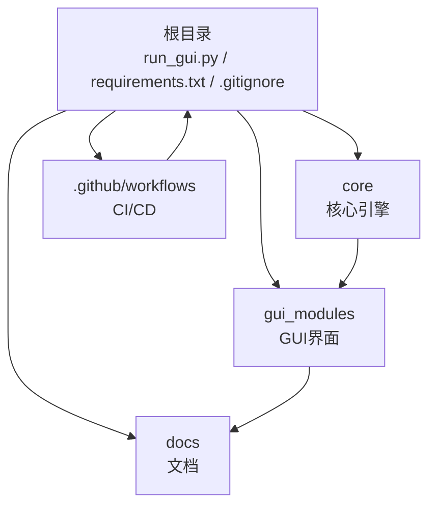
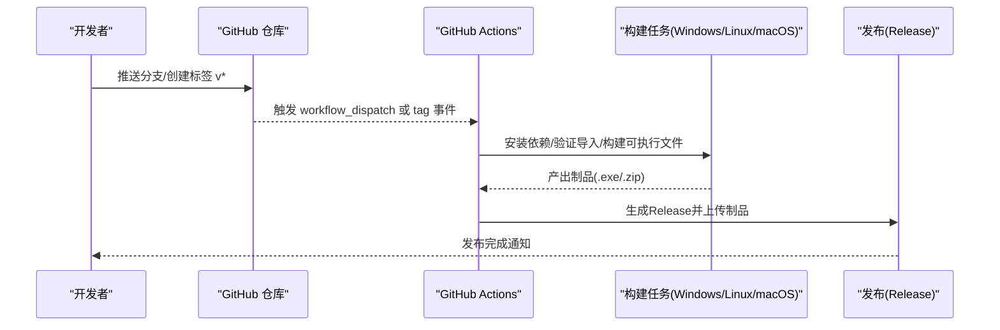
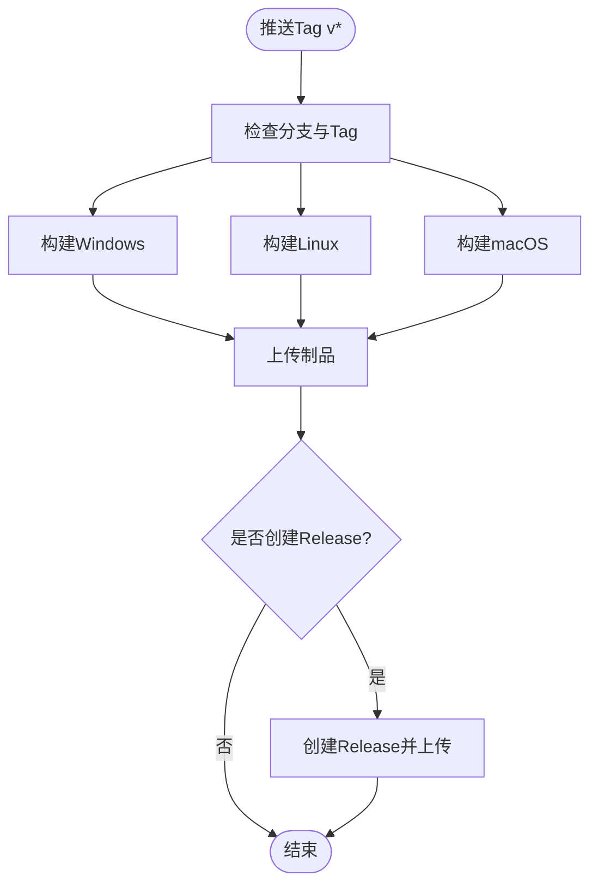
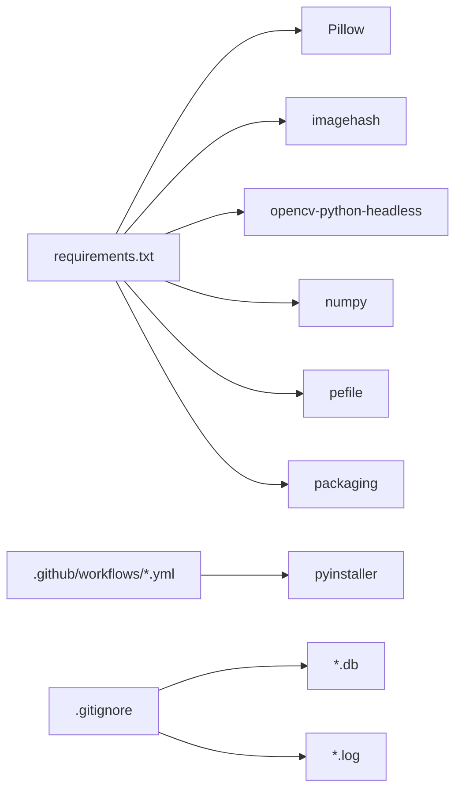

# Git工作流程

<cite>
**本文引用的文件**
- [README.md](file://README.md)
- [QUICK_START.md](file://QUICK_START.md)
- [requirements.txt](file://requirements.txt)
- [.gitignore](file://.gitignore)
- [run_gui.py](file://run_gui.py)
- [build.yml](file://.github/workflows/build.yml)
- [build-and-release.yml](file://.github/workflows/build-and-release.yml)
- [GUI_SPECIFICATION.md](file://docs/GUI_SPECIFICATION.md)
- [IMAGE_SIMILARITY_SPEC.md](file://docs/IMAGE_SIMILARITY_SPEC.md)
</cite>

## 目录
1. [简介](#简介)
2. [项目结构](#项目结构)
3. [核心组件](#核心组件)
4. [架构总览](#架构总览)
5. [详细组件分析](#详细组件分析)
6. [依赖分析](#依赖分析)
7. [性能考虑](#性能考虑)
8. [故障排查指南](#故障排查指南)
9. [结论](#结论)
10. [附录](#附录)

## 简介
本Git工作流程文档面向“文件重复校验工具”项目的团队协作与持续交付，覆盖分支管理策略、提交规范、合并流程、Feature Branch工作流、版本发布流程、冲突解决策略、代码审查流程、持续集成配置以及团队协作规范与维护指南。该文档基于仓库现有CI配置与项目说明进行制定，确保与当前工程实践一致并可落地执行。

## 项目结构
本项目采用分层模块化组织：
- core：核心检测引擎（精确匹配、图片相似度、视频相似度、多版本软件检测）
- gui_modules：图形界面模块（主窗口与各功能标签页）
- docs：用户与开发者文档
- .github/workflows：GitHub Actions构建与发布流水线
- 根目录：启动脚本、打包脚本、依赖清单与忽略规则

**图表来源**
- [run_gui.py:1-42](file://run_gui.py#L1-L42)
- [requirements.txt:1-32](file://requirements.txt#L1-L32)
- [.gitignore:1-56](file://.gitignore#L1-L56)
- [build.yml:1-186](file://.github/workflows/build.yml#L1-L186)
- [build-and-release.yml:1-116](file://.github/workflows/build-and-release.yml#L1-L116)

**章节来源**
- [README.md:338-372](file://README.md#L338-L372)
- [run_gui.py:1-42](file://run_gui.py#L1-L42)
- [requirements.txt:1-32](file://requirements.txt#L1-L32)
- [.gitignore:1-56](file://.gitignore#L1-L56)

## 核心组件
- GUI入口：通过run_gui.py初始化Tkinter主窗口并加载DuplicateFinderGUI
- 核心引擎：提供精确匹配、图片相似度、视频相似度、多版本软件检测能力
- 文档：包含GUI规范与图像相似度规范等开发参考
- CI/CD：基于GitHub Actions在Windows/Linux/macOS上构建可执行文件并发布Release

**章节来源**
- [run_gui.py:13-37](file://run_gui.py#L13-L37)
- [README.md:376-468](file://README.md#L376-L468)
- [GUI_SPECIFICATION.md:214-349](file://docs/GUI_SPECIFICATION.md#L214-L349)
- [IMAGE_SIMILARITY_SPEC.md:1-200](file://docs/IMAGE_SIMILARITY_SPEC.md#L1-L200)

## 架构总览
下图展示从触发到发布的端到端流程，包括分支策略、提交规范、CI构建与发布动作。

**图表来源**
- [build.yml:1-186](file://.github/workflows/build.yml#L1-L186)
- [build-and-release.yml:1-116](file://.github/workflows/build-and-release.yml#L1-L116)

## 详细组件分析

### 分支管理策略（Feature Branch 工作流）
- 主分支
  - main：稳定分支，仅接受经过评审的合并；用于发布基线
- 功能分支
  - feature/*：新功能开发（如 feature/image-similarity-v2）
  - fix/*：缺陷修复（如 fix/video-sampling-threshold）
  - refactor/*：重构（如 refactor/db-indexing）
  - docs/*：文档更新（如 docs/gui-spec-update）
- 临时分支
  - hotfix/*：紧急修复（如 hotfix/crash-on-large-video）
- 命名约定
  - 使用小写英文与短横线分隔，语义清晰
- 分支生命周期
  - 从main拉取最新代码开始
  - 完成后发起Pull Request至main
  - 合并后删除已合入分支

最佳实践
- 保持分支小而精，聚焦单一变更
- 频繁同步main，减少合并冲突
- 禁止直接在main上提交

**章节来源**
- [build.yml:1-186](file://.github/workflows/build.yml#L1-L186)
- [build-and-release.yml:1-116](file://.github/workflows/build-and-release.yml#L1-L116)

### 提交规范（Commit Message）
建议遵循Conventional Commits风格，便于自动生成变更日志与版本信息：
- feat: 新增功能
- fix: 修复问题
- refactor: 重构代码
- docs: 文档更新
- style: 代码格式调整
- test: 测试相关
- chore: 构建/依赖/工具链变更
- ci: CI/CD变更
- perf: 性能优化
- revert: 回滚提交

示例
- feat: 添加视频关键帧采样阈值配置
- fix: 修复大视频内存溢出问题
- refactor: 重命名数据库索引字段
- docs: 更新GUI规范文档
- chore: 升级Pillow依赖版本
- ci: 增加macOS构建矩阵

**章节来源**
- [README.md:649-676](file://README.md#L649-L676)

### 合并流程与代码审查
- Pull Request
  - 必须关联Issue或需求描述
  - 标题与描述需清晰表达变更目的与影响范围
- 代码审查
  - 至少一名维护者审查通过
  - 关注点：正确性、可读性、性能、兼容性、测试覆盖
- 自动化检查
  - CI会在push/tag时运行构建与依赖验证
  - 构建失败不得合并
- 合并策略
  - 推荐Squash and Merge以保持历史整洁
  - 或Rebase and Merge以保留线性历史

**章节来源**
- [build.yml:1-186](file://.github/workflows/build.yml#L1-L186)
- [build-and-release.yml:1-116](file://.github/workflows/build-and-release.yml#L1-L116)

### 版本发布流程
- 版本号规范
  - 语义化版本：vMAJOR.MINOR.PATCH（例如 v4.0.0）
- 触发条件
  - 推送tag v* 自动触发构建与发布
  - 支持workflow_dispatch手动触发
- 构建产物
  - Windows: 文件重复校验工具-<tag>.exe
  - Linux/macOS: 对应平台可执行文件
- 发布内容
  - 各平台可执行文件压缩包
  - 可选：SHA256SUMS校验文件
  - 自动生成Release Notes（若启用）
- 发布步骤
  - 在main分支打tag v*
  - 推送到远端触发CI
  - 审核构建结果与Release内容
  - 确认无误后发布

**章节来源**
- [build.yml:1-186](file://.github/workflows/build.yml#L1-L186)
- [build-and-release.yml:1-116](file://.github/workflows/build-and-release.yml#L1-L116)

### 冲突解决策略
- 预防
  - 频繁rebase到main，保持分支最新
  - 拆分大PR为多个小PR
- 解决
  - 优先本地rebase + resolve冲突
  - 必要时与协作者沟通变更边界
  - 冲突后重新运行CI验证
- 回退
  - 若引入严重问题，使用revert恢复稳定状态
  - 记录回退原因与后续修复计划

**章节来源**
- [build.yml:1-186](file://.github/workflows/build.yml#L1-L186)

### 持续集成配置（GitHub Actions）
- 触发器
  - push tags: v*
  - workflow_dispatch（可配置是否创建Release）
- 作业
  - build-windows：Windows环境构建与制品上传
  - build-linux：Linux环境构建与制品上传
  - build-macos：macOS环境构建与制品上传
  - create-release：生成Release并附带校验文件（部分工作流）
- 缓存
  - pip包缓存加速构建
- 验证
  - 导入验证（Pillow、imagehash、cv2、pefile、packaging）
  - 构建产物存在性检查
- 发布
  - 使用softprops/action-gh-release创建Release
  - 可附加SHA256SUMS校验文件

**图表来源**
- [build.yml:1-186](file://.github/workflows/build.yml#L1-L186)
- [build-and-release.yml:1-116](file://.github/workflows/build-and-release.yml#L1-L116)

**章节来源**
- [build.yml:1-186](file://.github/workflows/build.yml#L1-L186)
- [build-and-release.yml:1-116](file://.github/workflows/build-and-release.yml#L1-L116)

### 团队协作规范
- 沟通
  - 使用Issue跟踪需求与缺陷
  - PR描述中引用Issue编号
- 分工
  - 明确模块负责人（core、gui_modules、docs）
  - 跨模块变更需双方Review
- 质量
  - 遵循PEP 8编码规范
  - 关键算法与复杂逻辑添加注释
  - 提交信息清晰明了
- 文档
  - 变更涉及接口或行为时更新README/文档
  - 新增功能需在docs中补充说明

**章节来源**
- [README.md:649-676](file://README.md#L649-L676)
- [GUI_SPECIFICATION.md:710-724](file://docs/GUI_SPECIFICATION.md#L710-L724)

### 项目维护指南
- 依赖管理
  - 定期升级第三方库，评估兼容性与安全漏洞
  - 在requirements.txt中锁定最小版本
- 数据文件
  - 数据库文件（*.db）已加入.gitignore，避免入库
  - 输出文件（duplicates.json、file_index.db）不入库
- 构建与发布
  - 使用提供的build.bat/build.sh进行本地构建
  - 通过CI统一构建多平台产物
- 故障处理
  - 遇到导入错误，检查依赖是否安装完整
  - 构建失败时查看Actions日志定位问题

**章节来源**
- [requirements.txt:1-32](file://requirements.txt#L1-L32)
- [.gitignore:1-56](file://.gitignore#L1-L56)
- [QUICK_START.md:36-68](file://QUICK_START.md#L36-L68)

## 依赖分析
- 运行时依赖
  - Pillow、imagehash、opencv-python-headless、numpy、pefile、packaging等
- 构建依赖
  - pyinstaller用于打包可执行文件
- 忽略规则
  - 虚拟环境、IDE配置、数据库与日志等不纳入版本控制

**图表来源**
- [requirements.txt:1-32](file://requirements.txt#L1-L32)
- [build.yml:1-186](file://.github/workflows/build.yml#L1-L186)
- [.gitignore:1-56](file://.gitignore#L1-L56)

**章节来源**
- [requirements.txt:1-32](file://requirements.txt#L1-L32)
- [build.yml:1-186](file://.github/workflows/build.yml#L1-L186)
- [.gitignore:1-56](file://.gitignore#L1-L56)

## 性能考虑
- 构建阶段
  - 启用pip缓存以减少依赖安装时间
  - 并行构建不同平台以提升整体吞吐
- 运行阶段
  - 合理设置并行线程数（HDD 4-8，SSD 8-16）
  - 使用增量扫描避免重复计算
  - 数据库WAL模式提升并发性能

[本节为通用指导，不直接分析具体文件]

## 故障排查指南
- 导入错误
  - 现象：启动时报ImportError
  - 处理：确认已安装requirements.txt中的依赖
- 构建失败
  - 现象：Actions构建中断
  - 处理：检查Python版本、依赖安装、隐藏导入配置
- 发布异常
  - 现象：未生成Release或制品缺失
  - 处理：确认tag格式为v*，检查GITHUB_TOKEN权限

**章节来源**
- [run_gui.py:27-37](file://run_gui.py#L27-L37)
- [build.yml:1-186](file://.github/workflows/build.yml#L1-L186)
- [build-and-release.yml:1-116](file://.github/workflows/build-and-release.yml#L1-L116)

## 结论
本Git工作流程结合项目现有CI配置与文档，提供了清晰的分支策略、提交规范、合并流程、版本发布与冲突解决策略，并配套代码审查与团队协作规范。通过标准化流程与自动化构建发布，可有效提升团队效率与交付质量。

## 附录
- 快速开始
  - 克隆仓库、安装依赖、启动GUI
- 打包指南
  - 使用build.bat/build.sh生成本地可执行文件
- 文档参考
  - GUI规范与图像相似度规范

**章节来源**
- [QUICK_START.md:1-68](file://QUICK_START.md#L1-L68)
- [README.md:202-276](file://README.md#L202-L276)
- [GUI_SPECIFICATION.md:214-349](file://docs/GUI_SPECIFICATION.md#L214-L349)
- [IMAGE_SIMILARITY_SPEC.md:1-200](file://docs/IMAGE_SIMILARITY_SPEC.md#L1-L200)