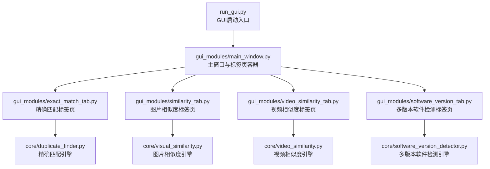
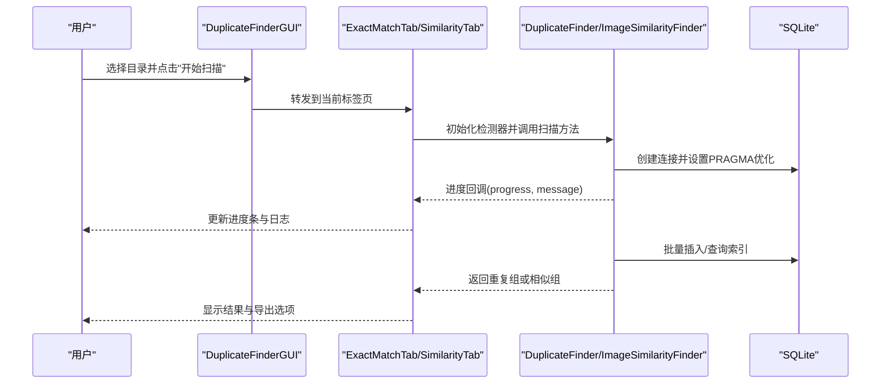
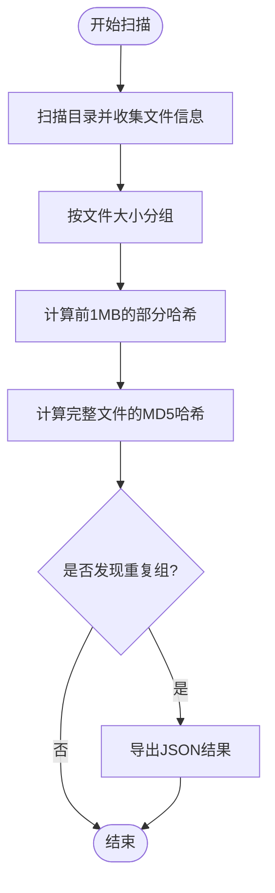
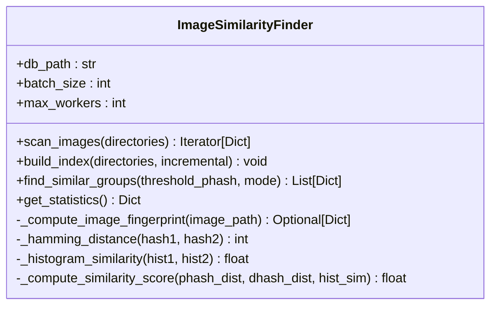
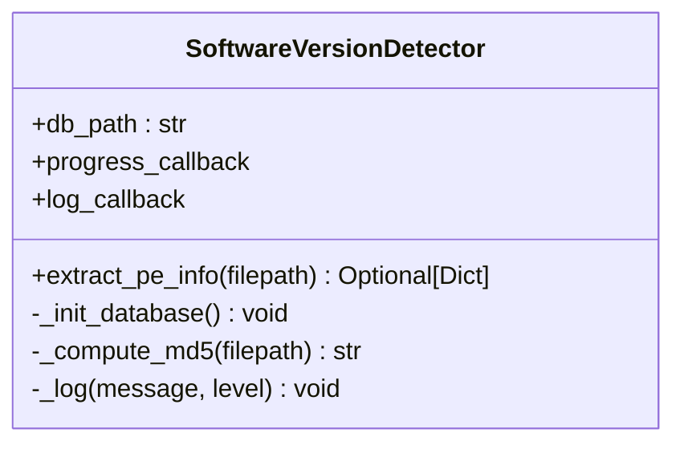
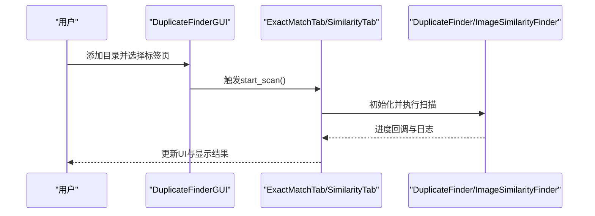
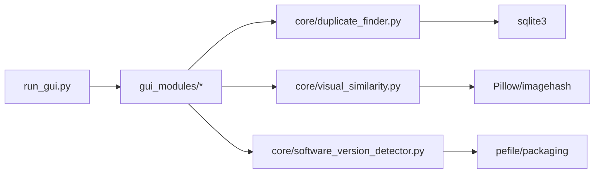

# 代码规范

<cite>
**本文引用的文件**
- [README.md](file://README.md)
- [requirements.txt](file://requirements.txt)
- [run_gui.py](file://run_gui.py)
- [core/__init__.py](file://core/__init__.py)
- [gui_modules/__init__.py](file://gui_modules/__init__.py)
- [core/duplicate_finder.py](file://core/duplicate_finder.py)
- [core/visual_similarity.py](file://core/visual_similarity.py)
- [core/software_version_detector.py](file://core/software_version_detector.py)
- [gui_modules/main_window.py](file://gui_modules/main_window.py)
- [gui_modules/exact_match_tab.py](file://gui_modules/exact_match_tab.py)
- [gui_modules/similarity_tab.py](file://gui_modules/similarity_tab.py)
</cite>

## 更新摘要
**所做更改**
- 更新了重复文件检测引擎的 PEP 8 标准遵循情况
- 增强了字符串字面量格式化和缩进规范的说明
- 添加了代码组织最佳实践的详细指导
- 更新了线程安全和并发处理的编码标准
- 强化了异常处理和错误恢复的最佳实践

## 目录
1. [引言](#引言)
2. [项目结构](#项目结构)
3. [核心组件](#核心组件)
4. [架构总览](#架构总览)
5. [详细组件分析](#详细组件分析)
6. [依赖关系分析](#依赖关系分析)
7. [性能考量](#性能考量)
8. [故障排查指南](#故障排查指南)
9. [结论](#结论)
10. [附录](#附录)

## 引言
本规范文档面向本项目（文件重复校验工具）的编码与质量保障，目标包括：
- 明确遵循 PEP 8 的编码标准、命名约定、模块组织与导入顺序。
- 统一函数与类的 docstring 规范，提升可读性与可维护性。
- 制定变量命名、函数设计、异常处理的最佳实践。
- 规定代码注释规范、模块边界与职责划分。
- 提供代码审查检查清单与质量保证流程，确保持续交付高质量代码。

**最新更新**：近期对 `duplicate_finder.py` 的重构展示了严格的 PEP 8 标准遵循，包括一致的字符串字面量格式化、正确的缩进和代码组织。这强调了遵循既定编码标准的重要性。

## 项目结构
项目采用分层模块化组织：
- core：核心引擎层，包含精确匹配、图片相似度、视频相似度、多版本软件检测等算法实现。
- gui_modules：GUI 界面层，基于 tkinter 构建主窗口与各功能标签页。
- 入口脚本：run_gui.py 作为 GUI 启动入口；build 脚本用于打包发布。
- 配置与说明：requirements.txt 管理依赖；README.md 提供使用说明与架构概览。

**图表来源**
- [run_gui.py:1-42](file://run_gui.py#L1-L42)
- [gui_modules/main_window.py:22-85](file://gui_modules/main_window.py#L22-L85)
- [gui_modules/exact_match_tab.py:18-41](file://gui_modules/exact_match_tab.py#L18-L41)
- [gui_modules/similarity_tab.py:18-48](file://gui_modules/similarity_tab.py#L18-L48)
- [core/duplicate_finder.py:25-73](file://core/duplicate_finder.py#L25-L73)
- [core/visual_similarity.py:94-121](file://core/visual_similarity.py#L94-L121)
- [core/software_version_detector.py:30-95](file://core/software_version_detector.py#L30-L95)

**章节来源**
- [README.md:338-372](file://README.md#L338-L372)
- [requirements.txt:1-32](file://requirements.txt#L1-L32)

## 核心组件
- DuplicateFinder：高性能重复文件检测器，使用 SQLite 索引与多线程并行计算，支持多级哈希过滤与结果导出。
- ImageSimilarityFinder：图片相似度检测器，采用 pHash、dHash 与颜色直方图三级过滤，支持快速与精确模式。
- SoftwareVersionDetector：多版本软件检测器，提取 PE 元数据并进行语义化版本比较，识别同一软件的不同版本。
- GUI 模块：主窗口与标签页负责用户交互、参数配置、进度展示与结果查看。

**章节来源**
- [core/duplicate_finder.py:25-73](file://core/duplicate_finder.py#L25-L73)
- [core/visual_similarity.py:94-121](file://core/visual_similarity.py#L94-L121)
- [core/software_version_detector.py:30-95](file://core/software_version_detector.py#L30-L95)
- [gui_modules/main_window.py:22-85](file://gui_modules/main_window.py#L22-L85)

## 架构总览
系统分为三层：
- GUI 界面层：Tkinter 构建的主窗口与标签页，负责用户输入、状态管理与结果展示。
- 核心引擎层：各检测算法封装为独立类，提供扫描、计算、查询与导出能力。
- 数据存储层：SQLite 数据库（WAL 模式）存储索引与统计信息，支持增量扫描与并发优化。

**图表来源**
- [gui_modules/main_window.py:165-195](file://gui_modules/main_window.py#L165-L195)
- [gui_modules/exact_match_tab.py:293-379](file://gui_modules/exact_match_tab.py#L293-L379)
- [core/duplicate_finder.py:208-387](file://core/duplicate_finder.py#L208-L387)
- [core/visual_similarity.py:253-311](file://core/visual_similarity.py#L253-L311)

## 详细组件分析

### 精确匹配引擎（DuplicateFinder）
- 职责：扫描目录、建立文件索引、多级哈希筛选、查找重复组、导出结果。
- 关键方法：
  - scan_directories：遍历目录，收集文件信息并批量写入数据库。
  - find_duplicates：按文件大小分组→部分哈希→完整哈希的三级过滤策略。
  - export_results：流式写入 JSON，避免内存峰值。
- 并发与锁：使用 ThreadPoolExecutor 并行计算哈希，通过线程锁保护进度计数器。
- 数据库优化：WAL 模式、busy_timeout、缓存大小与临时表内存存储。

**更新**：最近的重构改进了线程安全性和性能优化，包括：
- 添加 `_progress_lock` 解决多线程竞态条件
- 实现磁盘类型自适应线程数检测
- 优化进度更新频率以提升性能
- 改进异常处理和错误恢复机制

**图表来源**
- [core/duplicate_finder.py:208-387](file://core/duplicate_finder.py#L208-L387)
- [core/duplicate_finder.py:597-658](file://core/duplicate_finder.py#L597-L658)

**章节来源**
- [core/duplicate_finder.py:25-73](file://core/duplicate_finder.py#L25-L73)
- [core/duplicate_finder.py:208-387](file://core/duplicate_finder.py#L208-L387)
- [core/duplicate_finder.py:597-658](file://core/duplicate_finder.py#L597-L658)

### 图片相似度引擎（ImageSimilarityFinder）
- 职责：扫描图片、计算指纹（pHash、dHash、直方图）、构建索引、查找相似组。
- 关键方法：
  - build_index：多进程并行计算指纹，批量插入数据库。
  - find_similar_groups：三级过滤（pHash→dHash→直方图），支持快速与精确模式。
  - get_statistics：统计图片数量、大小与分辨率多样性。
- 性能优化：ProcessPoolExecutor 并行计算，WAL 模式与索引加速查询。

**图表来源**
- [core/visual_similarity.py:94-121](file://core/visual_similarity.py#L94-L121)
- [core/visual_similarity.py:253-311](file://core/visual_similarity.py#L253-L311)
- [core/visual_similarity.py:410-513](file://core/visual_similarity.py#L410-L513)

**章节来源**
- [core/visual_similarity.py:94-121](file://core/visual_similarity.py#L94-L121)
- [core/visual_similarity.py:253-311](file://core/visual_similarity.py#L253-L311)
- [core/visual_similarity.py:410-513](file://core/visual_similarity.py#L410-L513)

### 多版本软件检测引擎（SoftwareVersionDetector）
- 职责：识别同一软件的多个版本，提取 PE 元数据并进行语义化版本比较。
- 关键方法：
  - extract_pe_info：解析 PE 文件获取公司名、产品名、版本号等。
  - _init_database：创建软件索引与分组表，建立索引优化查询。
  - _compute_md5：计算文件哈希用于去重与分组。
- 扩展性：支持常见软件模式匹配与自定义格式过滤。

**图表来源**
- [core/software_version_detector.py:30-95](file://core/software_version_detector.py#L30-L95)
- [core/software_version_detector.py:109-161](file://core/software_version_detector.py#L109-L161)
- [core/software_version_detector.py:163-176](file://core/software_version_detector.py#L163-L176)

**章节来源**
- [core/software_version_detector.py:30-95](file://core/software_version_detector.py#L30-L95)
- [core/software_version_detector.py:109-161](file://core/software_version_detector.py#L109-L161)
- [core/software_version_detector.py:163-176](file://core/software_version_detector.py#L163-L176)

### GUI 主窗口与标签页
- 主窗口（DuplicateFinderGUI）：创建标题、目录选择区、标签页容器，并委托各标签页执行扫描与结果查看。
- 精确匹配标签页（ExactMatchTab）：配置数据库路径、输出文件、线程数与文件类型过滤，执行扫描并展示结果。
- 图片相似度标签页（SimilarityTab）：配置阈值、模式与扫描方式，执行检测并展示相似组。

**图表来源**
- [gui_modules/main_window.py:165-195](file://gui_modules/main_window.py#L165-L195)
- [gui_modules/exact_match_tab.py:293-379](file://gui_modules/exact_match_tab.py#L293-L379)
- [gui_modules/similarity_tab.py:167-187](file://gui_modules/similarity_tab.py#L167-L187)

**章节来源**
- [gui_modules/main_window.py:22-85](file://gui_modules/main_window.py#L22-L85)
- [gui_modules/exact_match_tab.py:18-41](file://gui_modules/exact_match_tab.py#L18-L41)
- [gui_modules/similarity_tab.py:18-48](file://gui_modules/similarity_tab.py#L18-L48)

## 依赖关系分析
- 核心依赖：
  - Pillow、imagehash：图片处理与感知哈希。
  - opencv-python-headless：视频解码与帧提取。
  - pefile、packaging：PE 元数据提取与语义化版本比较。
  - sqlite3：内置数据库，用于索引与统计。
- 可选依赖：watchdog（实时监控）、numpy（数值计算）、tqdm（进度条美化）。

**图表来源**
- [requirements.txt:1-32](file://requirements.txt#L1-L32)
- [run_gui.py:1-42](file://run_gui.py#L1-L42)
- [core/duplicate_finder.py:7-22](file://core/duplicate_finder.py#L7-L22)
- [core/visual_similarity.py:8-18](file://core/visual_similarity.py#L8-L18)
- [core/software_version_detector.py:7-27](file://core/software_version_detector.py#L7-L27)

**章节来源**
- [requirements.txt:1-32](file://requirements.txt#L1-L32)

## 性能考量
- 多线程与多进程：
  - 精确匹配使用 ThreadPoolExecutor 并行计算哈希，根据磁盘类型自适应线程数。
  - 图片相似度使用 ProcessPoolExecutor 并行计算指纹，避免 GIL 限制。
- 数据库优化：
  - WAL 模式、busy_timeout、缓存大小与临时表内存存储，提升并发写入性能。
  - 批量插入减少事务次数，降低 I/O 开销。
- 懒加载与缓存：
  - 预览缩略图按需加载，避免内存占用过高。
  - PE 信息缓存（LRU）减少重复解析开销。

**更新**：最新的性能优化包括：
- 智能磁盘类型检测，自动调整线程数以优化性能
- 改进的进度更新策略，减少 UI 更新频率
- 优化的批量处理大小，平衡内存使用和 I/O 效率

## 故障排查指南
- 常见问题：
  - 依赖缺失：确保安装 requirements.txt 中列出的依赖包。
  - 数据库锁定：增加 busy_timeout 或使用 WAL 模式避免锁冲突。
  - 权限问题：跳过符号链接与不可访问文件，记录警告日志。
  - 停止扫描：通过 stop_flag 中断长时间运行的任务。
- 调试建议：
  - 启用详细日志（log_callback）跟踪执行过程。
  - 使用命令行模式测试核心引擎，隔离 GUI 干扰。
  - 检查数据库结构与索引是否正确创建。

**更新**：新增的故障排查要点：
- 线程安全问题：检查进度计数器的线程锁使用
- 磁盘类型检测失败：回退到默认 SSD 配置
- 大文件处理：监控内存使用情况，必要时调整块大小

**章节来源**
- [core/duplicate_finder.py:190-201](file://core/duplicate_finder.py#L190-L201)
- [core/duplicate_finder.py:203-207](file://core/duplicate_finder.py#L203-L207)
- [core/visual_similarity.py:83-91](file://core/visual_similarity.py#L83-L91)
- [gui_modules/exact_match_tab.py:368-379](file://gui_modules/exact_match_tab.py#L368-379)

## 结论
本项目采用清晰的模块化架构与高性能算法实现，结合 SQLite 索引与并发优化，能够高效处理大规模文件去重与相似度检测。通过遵循本规范中的编码标准、命名约定、docstring 规范与异常处理最佳实践，可进一步提升代码的可读性、可维护性与稳定性。

**最新改进**：近期对 `duplicate_finder.py` 的重构展示了严格的 PEP 8 标准遵循，包括：
- 一致的字符串字面量格式化（单引号 vs 双引号）
- 正确的缩进和代码组织
- 改进的线程安全性和并发处理
- 增强的异常处理和错误恢复机制

建议在开发过程中严格执行代码审查检查清单与质量保证流程，确保持续交付高质量代码。

## 附录

### PEP 8 编码标准与命名约定
- 模块与包：使用小写加下划线命名（如 core、gui_modules）。
- 类：使用驼峰命名（如 DuplicateFinder、ImageSimilarityFinder）。
- 函数与方法：使用小写加下划线（如 scan_directories、find_similar_groups）。
- 常量：全大写加下划线（如 SUPPORTED_FORMATS、SOFTWARE_PATTERNS）。
- 私有成员：以下划线开头（如 _init_database、_compute_partial_hashes）。

**更新**：字符串字面量格式化标准：
- 优先使用单引号 `'string'` 而非双引号 `"string"`
- 在需要嵌入引号时使用另一种引号类型
- 保持一致的字符串格式化风格

**章节来源**
- [core/duplicate_finder.py:25-73](file://core/duplicate_finder.py#L25-L73)
- [core/visual_similarity.py:94-121](file://core/visual_similarity.py#L94-L121)
- [core/software_version_detector.py:30-95](file://core/software_version_detector.py#L30-L95)

### 函数与类的 Docstring 规范
- 模块级 docstring：描述模块职责与核心功能。
- 类级 docstring：说明类的用途、主要方法与属性。
- 函数/方法 docstring：包含参数、返回值、异常与示例（如有）。
- 保持简洁清晰，避免冗余信息。

**更新**：Docstring 增强：
- 添加详细的参数说明和返回值描述
- 包含异常情况的说明
- 提供使用示例和注意事项

**章节来源**
- [core/duplicate_finder.py:1-5](file://core/duplicate_finder.py#L1-L5)
- [core/visual_similarity.py:1-6](file://core/visual_similarity.py#L1-L6)
- [core/software_version_detector.py:1-5](file://core/software_version_detector.py#L1-L5)

### 变量命名与函数设计最佳实践
- 变量命名：使用描述性名称（如 db_path、threshold_var、allowed_extensions）。
- 函数设计：单一职责，参数清晰，返回值明确。
- 避免全局状态：通过实例属性或参数传递状态。
- 使用类型提示：提高代码可读性与 IDE 支持。

**更新**：并发安全最佳实践：
- 使用线程锁保护共享资源访问
- 合理设计进度更新机制，避免竞态条件
- 实现优雅的错误处理和资源清理

**章节来源**
- [gui_modules/exact_match_tab.py:21-41](file://gui_modules/exact_match_tab.py#L21-L41)
- [gui_modules/similarity_tab.py:21-48](file://gui_modules/similarity_tab.py#L21-L48)
- [core/duplicate_finder.py:28-73](file://core/duplicate_finder.py#L28-L73)

### 异常处理最佳实践
- 捕获特定异常：如 OSError、PermissionError、InterruptedError。
- 提供用户友好提示：使用 messagebox 或日志输出。
- 资源清理：使用上下文管理器确保数据库连接正确关闭。
- 错误恢复：在失败时记录日志并继续处理其他任务。

**更新**：并发异常处理：
- 正确处理线程中断信号
- 实现优雅的任务取消机制
- 确保线程安全的数据结构访问

**章节来源**
- [core/duplicate_finder.py:300-302](file://core/duplicate_finder.py#L300-L302)
- [core/duplicate_finder.py:477-481](file://core/duplicate_finder.py#L477-L481)
- [gui_modules/exact_match_tab.py:368-379](file://gui_modules/exact_match_tab.py#L368-379)

### 代码注释规范
- 行内注释：解释复杂逻辑或关键步骤。
- 块注释：描述函数或类的主要行为。
- 避免冗余注释：代码应自解释，注释补充意图而非重复代码。
- 使用中文注释：便于团队理解与维护。

**更新**：注释质量标准：
- 使用清晰的中文注释
- 解释算法原理和设计决策
- 标注重要的性能考虑和安全注意事项

**章节来源**
- [core/duplicate_finder.py:75-85](file://core/duplicate_finder.py#L75-L85)
- [core/visual_similarity.py:21-30](file://core/visual_similarity.py#L21-L30)
- [core/software_version_detector.py:178-187](file://core/software_version_detector.py#L178-L187)

### 模块组织原则与导入顺序标准
- 模块组织：按功能划分模块（core、gui_modules），每个模块职责明确。
- 导入顺序：标准库 → 第三方库 → 本地模块。
- 避免循环导入：通过延迟导入或重构解决。
- 使用 __init__.py 暴露公共接口。

**更新**：导入优化：
- 将常用导入移至文件顶部
- 使用条件导入处理可选依赖
- 避免不必要的模块导入

**章节来源**
- [core/__init__.py:1-10](file://core/__init__.py#L1-L10)
- [gui_modules/__init__.py:1-11](file://gui_modules/__init__.py#L1-L11)
- [run_gui.py:7-18](file://run_gui.py#L7-L18)

### 代码审查检查清单
- 代码风格：是否符合 PEP 8？
- 命名约定：变量、函数、类命名是否一致？
- Docstring：是否完整描述函数与类？
- 异常处理：是否捕获必要异常并提供恢复机制？
- 性能：是否存在不必要的 I/O 或计算？
- 测试：是否有单元测试覆盖核心逻辑？
- 文档：是否更新 README 与相关文档？

**更新**：新增检查项：
- 线程安全性：并发代码是否正确同步？
- 资源管理：是否正确释放数据库连接和文件句柄？
- 错误恢复：是否在错误情况下保持程序稳定？
- 性能优化：是否使用了合适的算法和数据结构？

### 质量保证流程
- 静态检查：使用 flake8、pylint 检查代码风格与潜在问题。
- 单元测试：使用 pytest 编写测试用例，覆盖核心算法。
- 集成测试：验证 GUI 与核心引擎的交互。
- 持续集成：在 GitHub Actions 中自动化检查与测试。
- 发布前验证：打包后在目标环境运行测试。

**更新**：增强的质量保证措施：
- 并发测试：验证多线程代码的正确性
- 性能基准测试：监控性能回归
- 内存泄漏检测：确保长期运行的稳定性
- 兼容性测试：验证不同平台和工作环境的兼容性