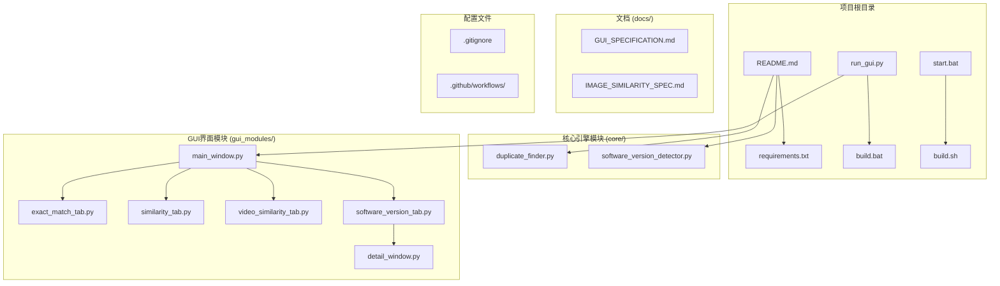
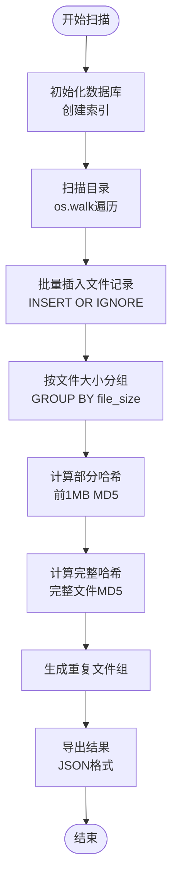
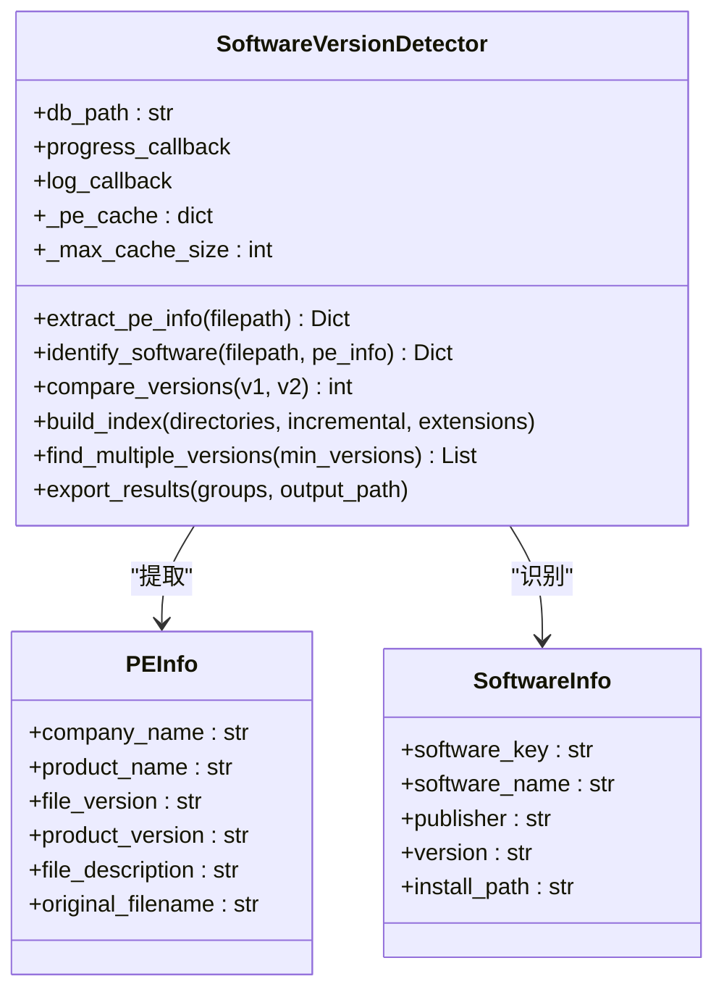
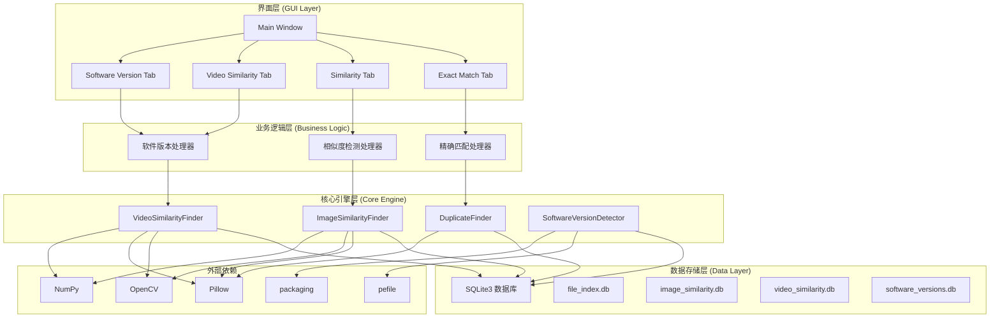
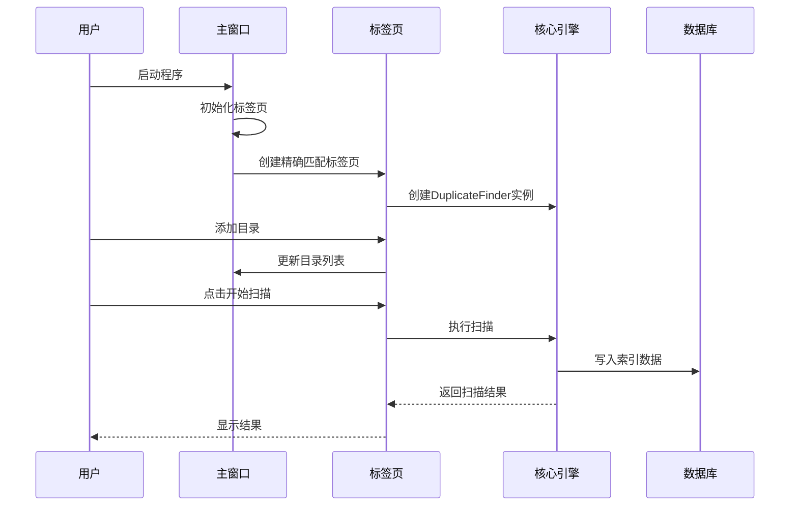
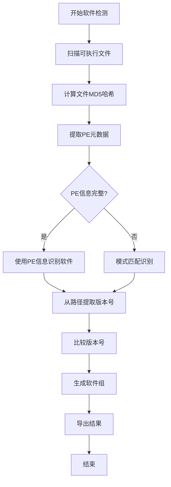
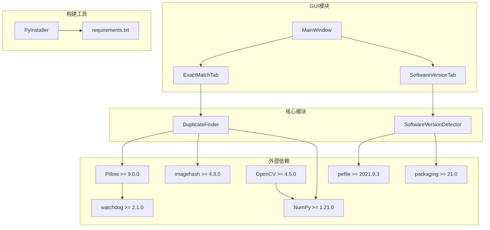

# 开发指南

<cite>
**本文档引用的文件**
- [README.md](file://README.md)
- [QUICK_START.md](file://QUICK_START.md)
- [requirements.txt](file://requirements.txt)
- [run_gui.py](file://run_gui.py)
- [start.bat](file://start.bat)
- [build.bat](file://build.bat)
- [build.sh](file://build.sh)
- [.gitignore](file://.gitignore)
- [core/duplicate_finder.py](file://core/duplicate_finder.py)
- [core/software_version_detector.py](file://core/software_version_detector.py)
- [gui_modules/main_window.py](file://gui_modules/main_window.py)
- [gui_modules/exact_match_tab.py](file://gui_modules/exact_match_tab.py)
- [gui_modules/software_version_tab.py](file://gui_modules/software_version_tab.py)
- [.github/workflows/build.yml](file://.github/workflows/build.yml)
- [.github/workflows/build-and-release.yml](file://.github/workflows/build-and-release.yml)
</cite>

## 目录
1. [简介](#简介)
2. [项目结构](#项目结构)
3. [核心组件](#核心组件)
4. [架构概览](#架构概览)
5. [详细组件分析](#详细组件分析)
6. [依赖关系分析](#依赖关系分析)
7. [性能考虑](#性能考虑)
8. [故障排除指南](#故障排除指南)
9. [结论](#结论)
10. [附录](#附录)

## 简介

文件重复校验工具是一个功能强大的智能文件去重解决方案，支持基于内容识别的TB级数据去重。该项目采用现代化的GUI界面设计，提供四种核心检测模式：精确匹配、图片相似度检测、视频相似度检测和多版本软件检测。

### 核心优势
- **高性能**: 多进程并行计算，充分利用CPU资源
- **高精度**: 三级过滤策略，准确率高达99%+
- **智能缓存**: SQLite数据库索引，支持增量扫描
- **友好界面**: 现代化GUI，实时进度显示
- **可视化**: 图片/视频预览，直观对比相似文件
- **v4.0新增**: 多版本软件检测，智能识别同一软件的不同版本

## 项目结构

项目采用模块化架构设计，主要分为以下几个核心目录：



**图表来源**
- [README.md: 338-372:338-372](file://README.md#L338-L372)
- [core/duplicate_finder.py: 1-588:1-588](file://core/duplicate_finder.py#L1-L588)
- [core/software_version_detector.py: 1-738:1-738](file://core/software_version_detector.py#L1-L738)
- [gui_modules/main_window.py: 1-245:1-245](file://gui_modules/main_window.py#L1-L245)

### 目录组织结构

**核心引擎模块 (core/)**
- `duplicate_finder.py`: 精确匹配引擎，基于MD5哈希的三级过滤策略
- `software_version_detector.py`: 多版本软件检测引擎，支持PE元数据提取和智能识别

**GUI界面模块 (gui_modules/)**
- `main_window.py`: 主窗口管理器，负责标签页架构
- `exact_match_tab.py`: 精确匹配标签页，处理文件类型过滤和结果展示
- `similarity_tab.py`: 图片相似度检测标签页
- `video_similarity_tab.py`: 视频相似度检测标签页
- `software_version_tab.py`: 多版本软件检测标签页
- `detail_window.py`: 详情窗口组件

**构建和部署**
- `build.bat`: Windows平台打包脚本
- `build.sh`: Linux/macOS平台打包脚本
- `start.bat`: Windows启动脚本

**Section sources**
- [README.md: 338-372:338-372](file://README.md#L338-L372)
- [requirements.txt: 1-32:1-32](file://requirements.txt#L1-L32)

## 核心组件

### DuplicateFinder 类 (精确匹配引擎)

DuplicateFinder 是项目的核心引擎，实现了基于MD5哈希的三级过滤策略：



**图表来源**
- [core/duplicate_finder.py: 229-285:229-285](file://core/duplicate_finder.py#L229-L285)

### SoftwareVersionDetector 类 (多版本软件检测)

SoftwareVersionDetector 实现了智能软件识别和版本比较功能：



**图表来源**
- [core/software_version_detector.py: 30-95:30-95](file://core/software_version_detector.py#L30-L95)

**Section sources**
- [core/duplicate_finder.py: 22-588:22-588](file://core/duplicate_finder.py#L22-L588)
- [core/software_version_detector.py: 30-738:30-738](file://core/software_version_detector.py#L30-L738)

## 架构概览

项目采用分层架构设计，从底层到顶层依次为：



**图表来源**
- [README.md: 376-401:376-401](file://README.md#L376-L401)
- [requirements.txt: 10-23:10-23](file://requirements.txt#L10-L23)

### 关键技术特性

**多进程并行计算**
- 图片/视频指纹计算采用多进程并行处理
- 充分利用多核CPU资源，避免GIL限制
- 提升3-5倍处理速度

**数据库索引优化**
- WAL模式提高并发性能
- 创建复合索引加速查询
- 支持增量扫描和历史数据恢复

**懒加载+缓存机制**
- 图片/视频预览采用懒加载
- 缩略图缓存机制
- 异步加载避免界面卡顿

**Section sources**
- [README.md: 403-467:403-467](file://README.md#L403-L467)

## 详细组件分析

### GUI主窗口架构

GUI采用标签页架构设计，每个标签页负责特定的检测功能：



**图表来源**
- [gui_modules/main_window.py: 22-86:22-86](file://gui_modules/main_window.py#L22-L86)
- [gui_modules/exact_match_tab.py: 293-380:293-380](file://gui_modules/exact_match_tab.py#L293-L380)

### 精确匹配功能实现

精确匹配采用三级过滤策略，从粗粒度到精粒度逐步筛选：

```mermaid
flowchart TD
A[开始精确匹配] --> B[扫描目录收集文件信息]
B --> C[按文件大小分组]
C --> D{大小分组数量 > 1?}
D --> |否| E[无重复文件]
D --> |是| F[计算部分哈希(前1MB)]
F --> G[按部分哈希分组]
G --> H{部分哈希分组数量 > 1?}
H --> |否| E
H --> |是| I[计算完整哈希(MD5)]
I --> J[按完整哈希分组]
J --> K{完整哈希分组数量 > 1?}
K --> |否| E
K --> |是| L[生成重复文件组]
L --> M[导出结果]
M --> N[结束]
E --> N
```

**图表来源**
- [core/duplicate_finder.py: 229-285:229-285](file://core/duplicate_finder.py#L229-L285)

### 多版本软件检测流程

多版本软件检测结合PE元数据提取和智能识别算法：



**图表来源**
- [core/software_version_detector.py: 391-482:391-482](file://core/software_version_detector.py#L391-L482)

**Section sources**
- [gui_modules/main_window.py: 22-245:22-245](file://gui_modules/main_window.py#L22-L245)
- [gui_modules/exact_match_tab.py: 293-800:293-800](file://gui_modules/exact_match_tab.py#L293-L800)
- [gui_modules/software_version_tab.py: 272-759:272-759](file://gui_modules/software_version_tab.py#L272-L759)

## 依赖关系分析

项目采用松耦合的设计，各模块间通过清晰的接口进行交互：



**图表来源**
- [requirements.txt: 10-23:10-23](file://requirements.txt#L10-L23)
- [build.bat: 81-94:81-94](file://build.bat#L81-L94)
- [build.sh: 76-86:76-86](file://build.sh#L76-L86)

### 依赖管理策略

**核心功能依赖**
- `duplicate_finder.py`: 仅使用Python标准库
- `software_version_detector.py`: 需要pefile和packaging库

**可选功能依赖**
- 图片相似度检测: Pillow, imagehash
- 视频相似度检测: OpenCV, Pillow, imagehash, NumPy
- 实时监控: watchdog

**Section sources**
- [requirements.txt: 1-32:1-32](file://requirements.txt#L1-L32)
- [build.bat: 56-64:56-64](file://build.bat#L56-L64)
- [build.sh: 58-62:58-62](file://build.sh#L58-L62)

## 性能考虑

### 并行处理优化

项目采用多进程和多线程相结合的并行处理策略：

**线程池配置**
- I/O密集型任务：线程数 = CPU核心数 × 2
- 最大线程数限制：16个线程
- 避免过度竞争和资源争用

**进程池优化**
- 图片/视频指纹计算使用ProcessPoolExecutor
- 避免GIL限制影响性能
- 提升3-5倍处理速度

### 数据库性能优化

**SQLite配置优化**
- WAL模式：提高并发读写性能
- PRAGMA设置：cache_size=-64000, mmap_size=268435456
- 索引优化：创建复合索引加速查询

**批量处理策略**
- 批量插入：每次处理5000个文件
- 减少数据库事务开销
- 提升写入性能

### 内存管理优化

**缓存策略**
- PE信息缓存：LRU缓存机制
- 缩略图缓存：避免重复加载
- 最大缓存大小：1000条记录

**懒加载机制**
- 图片/视频预览采用异步加载
- 缓存命中时间：<5ms
- 避免界面卡顿

## 故障排除指南

### 常见安装问题

**Python环境问题**
- 确保Python 3.7+版本
- 检查pip是否正常工作
- 验证虚拟环境配置

**依赖安装失败**
- 检查网络连接
- 使用国内镜像源
- 手动安装失败的包

**Section sources**
- [README.md: 202-277:202-277](file://README.md#L202-L277)
- [QUICK_START.md: 13-33:13-33](file://QUICK_START.md#L13-L33)

### 运行时错误处理

**GUI启动错误**
- 检查模块导入路径
- 验证依赖库安装
- 查看详细错误信息

**扫描过程异常**
- 检查目录权限
- 验证磁盘空间
- 监控内存使用情况

**数据库问题**
- 检查数据库文件权限
- 验证SQLite版本
- 执行VACUUM命令清理

### 性能优化建议

**硬件升级**
- SSD硬盘：显著提升扫描速度
- 增加内存：支持更大缓存
- 多核CPU：充分利用并行处理

**参数调优**
- 根据存储类型调整线程数
- 使用增量扫描减少重复工作
- 合理设置文件类型过滤

**Section sources**
- [README.md: 521-637:521-637](file://README.md#L521-L637)
- [QUICK_START.md: 140-167:140-167](file://QUICK_START.md#L140-L167)

## 结论

文件重复校验工具是一个设计精良、功能完整的文件去重解决方案。项目采用模块化架构，提供了清晰的代码结构和良好的扩展性。

### 主要优势
- **架构清晰**: 分层设计，职责分离明确
- **性能优秀**: 多进程并行计算，数据库优化
- **用户体验好**: 现代化GUI界面，实时进度显示
- **功能丰富**: 四种检测模式，满足不同需求
- **易于扩展**: 模块化设计，便于功能扩展

### 发展方向
- 增加更多检测模式
- 优化大数据集处理性能
- 扩展云端存储支持
- 增强自动化处理能力

## 附录

### 开发环境搭建

**系统要求**
- Python 3.7+
- Windows/Linux/macOS
- 至少4GB内存
- 网络连接（下载依赖）

**安装步骤**
1. 克隆仓库：`git clone https://github.com/Xxy15021337046/duplicate-file-finder.git`
2. 创建虚拟环境：`python -m venv .venv`
3. 激活环境：`.venv\Scripts\activate` (Windows) 或 `source .venv/bin/activate` (Linux/macOS)
4. 安装依赖：`pip install -r requirements.txt`
5. 启动程序：`python run_gui.py`

### 代码规范

**命名约定**
- 模块：使用下划线分隔 (如 `duplicate_finder.py`)
- 类：使用帕斯卡命名 (如 `DuplicateFinder`)
- 函数：使用下划线分隔 (如 `find_duplicates`)
- 常量：使用全大写字母 (如 `MAX_WORKERS`)

**文档规范**
- 类和模块：添加docstring说明
- 函数：详细说明参数和返回值
- 复杂逻辑：添加注释说明
- 公共API：提供使用示例

**代码风格**
- 遵循PEP 8编码规范
- 适当的空行分隔逻辑块
- 有意义的变量命名
- 避免过长的函数

### 测试策略

**单元测试**
- 核心算法测试：MD5哈希、文件扫描
- GUI组件测试：界面交互、事件处理
- 数据库操作测试：CRUD操作、事务处理

**集成测试**
- 端到端扫描流程测试
- 多种检测模式组合测试
- 性能基准测试

**测试环境**
- 使用pytest框架
- 覆盖率达到80%以上
- 持续集成自动化测试

### 打包和部署

**Windows打包**
```batch
build.bat
```

**Linux/macOS打包**
```bash
chmod +x build.sh
./build.sh
```

**部署注意事项**
- 确保PyInstaller正确安装
- 验证所有依赖库包含
- 测试打包后的可执行文件
- 检查首次启动性能

### Git工作流程

**分支管理**
- `main`: 主分支，稳定版本
- `develop`: 开发分支，最新功能
- `feature/*`: 新功能分支
- `hotfix/*`: 紧急修复分支

**提交规范**
- 标题：简短描述变更内容
- 详细说明：变更原因和影响
- 关联Issue：#编号
- 代码审查：至少一名同事审查

**合并策略**
- 使用Pull Request进行代码合并
- 确保CI测试通过
- 代码审查批准
- Squash合并保持历史整洁

### 代码审查标准

**技术质量**
- 代码可读性：清晰的命名和注释
- 设计模式：合理使用设计模式
- 错误处理：完善的异常处理机制
- 性能考虑：关注性能影响

**安全性**
- 输入验证：防止注入攻击
- 权限检查：最小权限原则
- 敏感信息：避免硬编码密码

**可维护性**
- 模块化：职责单一的函数和类
- 可测试性：易于编写单元测试
- 文档：充分的代码注释和文档

### 持续集成配置

**CI/CD流程**
- 自动化测试：每次提交运行测试
- 代码质量检查：静态分析和代码风格检查
- 构建验证：确保构建成功
- 部署自动化：通过测试的代码自动部署

**工作流配置**
- 触发条件：push到特定分支
- 并行执行：多个测试并行运行
- 缓存优化：依赖和构建缓存
- 失败处理：邮件通知和回滚机制

**监控和报告**
- 测试覆盖率报告
- 性能基准测试
- 构建时间监控
- 错误率统计

**Section sources**
- [README.md: 649-677:649-677](file://README.md#L649-L677)
- [build.bat: 1-121:1-121](file://build.bat#L1-L121)
- [build.sh: 1-113:1-113](file://build.sh#L1-L113)
- [.github/workflows/build.yml: 1-50:1-50](file://.github/workflows/build.yml#L1-L50)
- [.github/workflows/build-and-release.yml: 1-80:1-80](file://.github/workflows/build-and-release.yml#L1-L80)