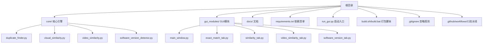
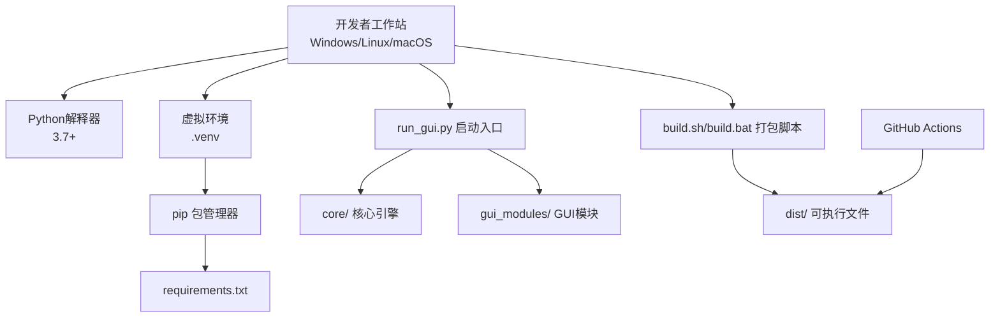
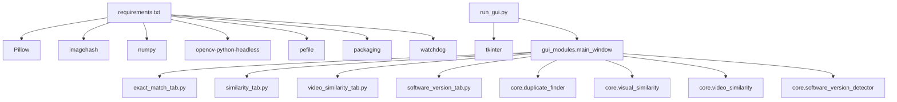

# 开发环境搭建

<cite>
**本文引用的文件**
- [README.md](file://README.md)
- [QUICK_START.md](file://QUICK_START.md)
- [requirements.txt](file://requirements.txt)
- [run_gui.py](file://run_gui.py)
- [build.sh](file://build.sh)
- [build.bat](file://build.bat)
- [start.bat](file://start.bat)
- [.gitignore](file://.gitignore)
- [.github/workflows/build.yml](file://.github/workflows/build.yml)
</cite>

## 目录
1. [简介](#简介)
2. [项目结构](#项目结构)
3. [核心组件](#核心组件)
4. [架构总览](#架构总览)
5. [详细组件分析](#详细组件分析)
6. [依赖关系分析](#依赖关系分析)
7. [性能考虑](#性能考虑)
8. [故障排除指南](#故障排除指南)
9. [结论](#结论)
10. [附录](#附录)

## 简介
本指南面向开发者与贡献者，提供从零搭建本项目开发环境的完整步骤，涵盖：
- Python 环境要求与版本建议
- 虚拟环境创建与激活
- 依赖安装与可选优化
- 项目初始化与验证
- 平台差异（Windows/Linux/macOS）的命令与注意事项
- IDE 配置建议与调试环境设置
- 常见环境问题与解决方案
- Git 工作流程、分支管理与提交规范

## 项目结构
项目采用“核心引擎 + GUI 模块”的分层组织，便于功能扩展与模块化开发。

图表来源
- [README.md: 338-372:338-372](file://README.md#L338-L372)

章节来源
- [README.md: 338-372:338-372](file://README.md#L338-L372)

## 核心组件
- 启动入口：通过统一入口脚本启动 GUI，便于跨平台一致性。
- 依赖管理：集中于 requirements.txt，区分基础依赖与可选优化。
- 打包脚本：提供 Windows 与类 Unix 的一键打包，便于发布可执行文件。
- CI 流水线：GitHub Actions 自动构建 Windows/Linux/macOS 可执行文件并产出发布包。

章节来源
- [run_gui.py: 1-42:1-42](file://run_gui.py#L1-L42)
- [requirements.txt: 1-32:1-32](file://requirements.txt#L1-L32)
- [build.sh: 1-113:1-113](file://build.sh#L1-L113)
- [build.bat: 1-121:1-121](file://build.bat#L1-L121)
- [.github/workflows/build.yml: 1-186:1-186](file://.github/workflows/build.yml#L1-L186)

## 架构总览
开发环境与运行时架构如下：

图表来源
- [README.md: 211-277:211-277](file://README.md#L211-L277)
- [run_gui.py: 10-25:10-25](file://run_gui.py#L10-L25)
- [build.sh: 76-86:76-86](file://build.sh#L76-L86)
- [build.bat: 81-94:81-94](file://build.bat#L81-L94)
- [.github/workflows/build.yml: 23-40:23-40](file://.github/workflows/build.yml#L23-L40)

## 详细组件分析

### Python 环境配置
- 版本要求：项目说明与 CI 均使用 Python 3.7+；建议使用 3.10 以获得最佳兼容性。
- 安装方式（按平台）：
  - Windows：访问官方下载站点，安装时勾选“Add Python to PATH”。
  - Linux：使用发行版包管理器安装 python3 与 python3-pip。
  - macOS：使用 Homebrew 安装 python3。
- 验证安装：在终端/命令提示符中执行 python --version 或 python3 --version，确认输出包含 Python 版本号。

章节来源
- [README.md: 5](file://README.md#L5)
- [build.sh: 30-36:30-36](file://build.sh#L30-L36)
- [.github/workflows/build.yml: 18-21:18-21](file://.github/workflows/build.yml#L18-L21)

### 虚拟环境创建与激活
- 创建虚拟环境：
  - Windows：python -m venv .venv
  - Linux/macOS：python3 -m venv .venv
- 激活虚拟环境：
  - Windows：.venv\Scripts\activate
  - Linux/macOS：source .venv/bin/activate
- 验证：激活后命令行前缀出现 .venv，pip 与 python 指向虚拟环境。

章节来源
- [README.md: 211-221:211-221](file://README.md#L211-L221)
- [start.bat: 9-16:9-16](file://start.bat#L9-L16)

### 依赖安装与可选优化
- 安装依赖：pip install -r requirements.txt
- 依赖说明（摘自清单）：
  - 基础依赖：Python 标准库（无需额外安装）
  - 图片相似度：Pillow、imagehash
  - 可选优化：numpy、tqdm
  - 视频相似度：opencv-python-headless
  - 多版本软件检测：pefile、packaging
  - 实时监控：watchdog（可选）
- 可选优化建议：
  - numpy：加速数值计算
  - tqdm：美化进度条
  - watchdog：文件实时监控功能

章节来源
- [README.md: 223-248:223-248](file://README.md#L223-L248)
- [requirements.txt: 7-31:7-31](file://requirements.txt#L7-L31)

### 项目初始化与验证
- 初始化步骤：
  1) 克隆仓库并进入目录
  2) 创建并激活虚拟环境
  3) 安装依赖
  4) 启动 GUI：python run_gui.py
- 验证：若 GUI 成功启动，表示环境配置完成。

章节来源
- [README.md: 204-256:204-256](file://README.md#L204-L256)
- [run_gui.py: 13-37:13-37](file://run_gui.py#L13-L37)

### 平台差异与注意事项
- Windows
  - 使用 .bat 脚本进行依赖安装、打包与启动
  - 注意路径分隔符使用分号（;）传递给 PyInstaller 的 --add-data
- Linux/macOS
  - 使用 .sh 脚本进行依赖安装、打包与启动
  - 注意路径分隔符使用冒号（:）传递给 PyInstaller 的 --add-data
- 跨平台一致性
  - 启动 GUI 使用 run_gui.py，避免直接调用 gui_modules 子模块路径
  - CI 流水线在 Windows/Linux/macOS 上分别构建可执行文件

章节来源
- [build.bat: 86-94:86-94](file://build.bat#L86-L94)
- [build.sh: 80-86:80-86](file://build.sh#L80-L86)
- [.github/workflows/build.yml: 34-40:34-40](file://.github/workflows/build.yml#L34-L40)
- [.github/workflows/build.yml: 90-99:90-99](file://.github/workflows/build.yml#L90-L99)
- [.github/workflows/build.yml: 149-158:149-158](file://.github/workflows/build.yml#L149-L158)

### IDE 配置建议与调试环境设置
- 推荐 IDE
  - VS Code：插件丰富，调试体验佳
  - PyCharm：专业 Python IDE，调试与性能分析工具完善
- 调试建议
  - 使用 IDE 的“Python 解释器”指向虚拟环境中的 python
  - 设置工作目录为项目根目录
  - 为 run_gui.py 创建运行配置，传入参数（如需要）
- 日志与断点
  - 通过 GUI 界面日志栏查看运行状态
  - 在关键模块（如核心引擎与 GUI 主窗口）设置断点进行单步调试

（本节为通用实践建议，不直接分析具体文件）

### 常见环境问题与解决方案
- 无法找到 Python 或 pip
  - 现象：命令不可用或报错
  - 解决：确认已安装 Python，并在安装时勾选“Add to PATH”；重新打开终端/命令提示符
- 依赖安装失败
  - 现象：pip 安装时报错
  - 解决：升级 pip 后重试；检查网络代理；更换国内镜像源
- GUI 启动报模块导入错误
  - 现象：ImportError 或模块缺失提示
  - 解决：根据 run_gui.py 的提示安装 Pillow、imagehash 等依赖
- 打包失败
  - 现象：PyInstaller 报错
  - 解决：确认 requirements.txt 中依赖已安装；检查隐藏导入项（如 PIL、cv2、numpy、pefile、packaging）；使用对应平台脚本重新打包

章节来源
- [run_gui.py: 27-37:27-37](file://run_gui.py#L27-L37)
- [build.sh: 58-91:58-91](file://build.sh#L58-L91)
- [build.bat: 56-101:56-101](file://build.bat#L56-L101)

### Git 工作流程、分支管理与提交规范
- 工作流程
  - fork 仓库 → 新建功能分支 → 编写代码与单元测试 → 提交并推送 → 发起 Pull Request
- 分支管理
  - 主分支：稳定版本，仅合并经测试的功能
  - 功能分支：按功能命名（如 feature/new-detection）
  - 修复分支：hotfix/xxx
- 提交规范
  - 标题简洁明确，描述做了什么变更
  - 说明动机与影响范围
  - 遵循 PEP 8 编码规范，添加 docstring 与注释
- CI/CD
  - 推送标签触发构建 Windows/Linux/macOS 可执行文件
  - 自动产出发布包并上传 Artifacts

章节来源
- [README.md: 649-676:649-676](file://README.md#L649-L676)
- [.github/workflows/build.yml: 3-6:3-6](file://.github/workflows/build.yml#L3-L6)
- [.github/workflows/build.yml: 58-67:58-67](file://.github/workflows/build.yml#L58-L67)
- [.github/workflows/build.yml: 117-125:117-125](file://.github/workflows/build.yml#L117-L125)
- [.github/workflows/build.yml: 177-185:177-185](file://.github/workflows/build.yml#L177-L185)

## 依赖关系分析
依赖层次与模块导入关系如下：

图表来源
- [requirements.txt: 10-23:10-23](file://requirements.txt#L10-L23)
- [run_gui.py: 17-22:17-22](file://run_gui.py#L17-L22)
- [README.md: 342-356:342-356](file://README.md#L342-L356)

章节来源
- [requirements.txt: 10-23:10-23](file://requirements.txt#L10-L23)
- [run_gui.py: 17-22:17-22](file://run_gui.py#L17-L22)

## 性能考虑
- 并行计算：核心模块广泛使用多进程并行计算，充分利用 CPU 资源，显著提升处理速度。
- 数据库索引：SQLite 使用 WAL 模式与索引优化，支持增量扫描，避免重复计算。
- 懒加载与缓存：GUI 预览采用懒加载与缓存机制，提升响应速度并降低内存占用。
- I/O 优化：针对 HDD/SSD 的线程数建议不同，建议根据存储介质调整并行度。

章节来源
- [README.md: 405-467:405-467](file://README.md#L405-L467)

## 故障排除指南
- 依赖安装失败
  - 升级 pip：python -m pip install --upgrade pip
  - 更换镜像源：使用国内镜像源加速下载
- GUI 启动异常
  - 确认 Pillow 与 imagehash 已安装
  - 检查 tkinter 是否随 Python 一起安装
- 打包失败
  - 确保隐藏导入项齐全（PIL、cv2、numpy、pefile、packaging）
  - 清理旧构建产物后重试
- CI 构建失败
  - 检查 requirements.txt 与 PyInstaller 隐藏导入项
  - 确认平台特定的 add-data 分隔符（Windows 分号，类 Unix 冒号）

章节来源
- [build.sh: 47-50:47-50](file://build.sh#L47-L50)
- [build.bat: 46-53:46-53](file://build.bat#L46-L53)
- [build.sh: 86-91:86-91](file://build.sh#L86-L91)
- [build.bat: 94-101:94-101](file://build.bat#L94-L101)
- [.github/workflows/build.yml: 23-27:23-27](file://.github/workflows/build.yml#L23-L27)

## 结论
按照本指南完成 Python 环境配置、虚拟环境创建、依赖安装与项目初始化后，即可在本地顺利运行与开发本项目。建议结合 IDE 调试与 CI 流水线，形成从本地开发到自动化发布的完整闭环。

## 附录

### 快速命令清单（按平台）
- Windows
  - 创建虚拟环境：python -m venv .venv
  - 激活虚拟环境：.venv\Scripts\activate
  - 安装依赖：pip install -r requirements.txt
  - 启动 GUI：python run_gui.py
  - 打包：双击 build.bat 或在命令行执行
- Linux/macOS
  - 创建虚拟环境：python3 -m venv .venv
  - 激活虚拟环境：source .venv/bin/activate
  - 安装依赖：pip install -r requirements.txt
  - 启动 GUI：python run_gui.py
  - 打包：chmod +x build.sh && ./build.sh

章节来源
- [README.md: 211-277:211-277](file://README.md#L211-L277)
- [build.sh: 1-113:1-113](file://build.sh#L1-L113)
- [build.bat: 1-121:1-121](file://build.bat#L1-L121)