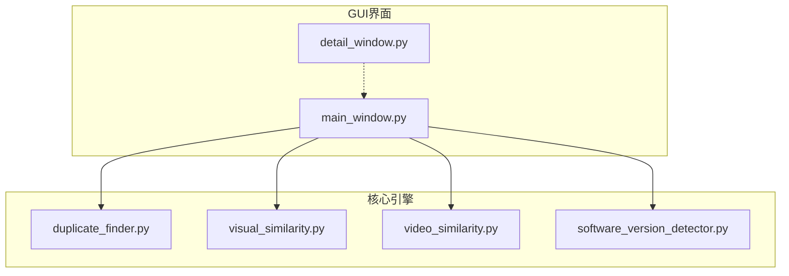
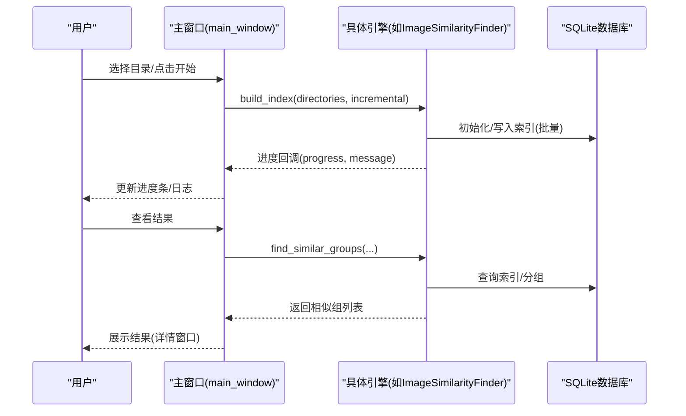
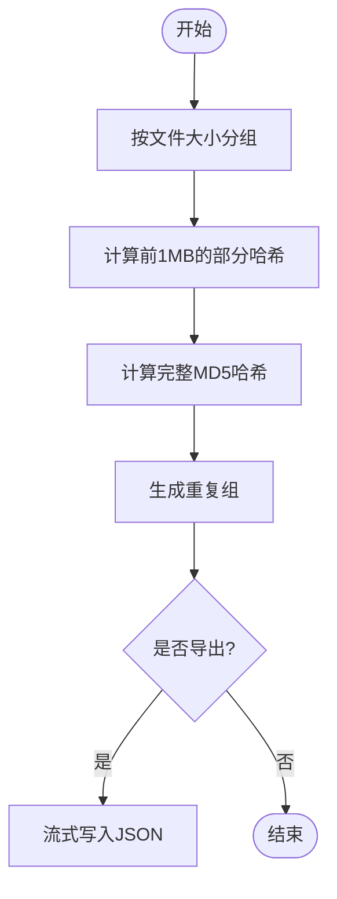
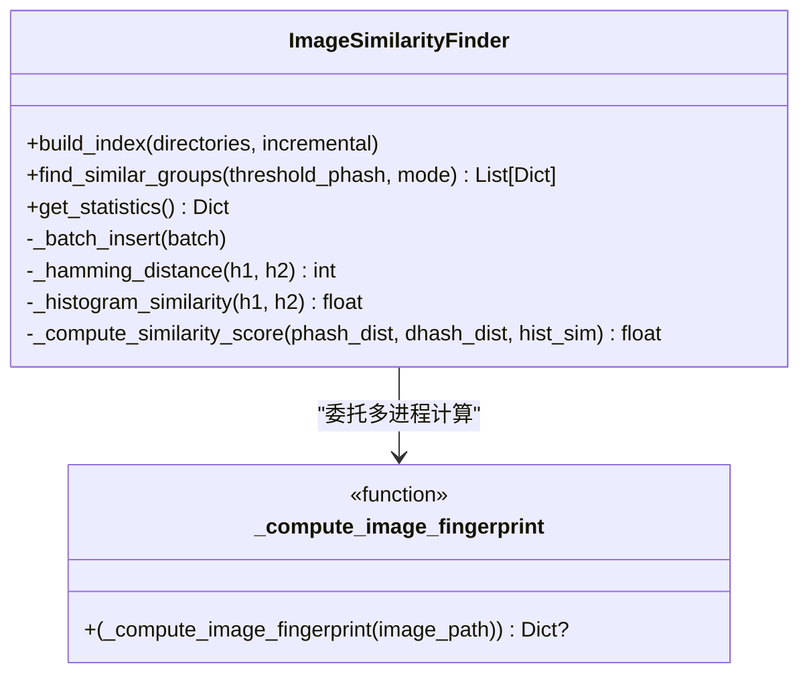
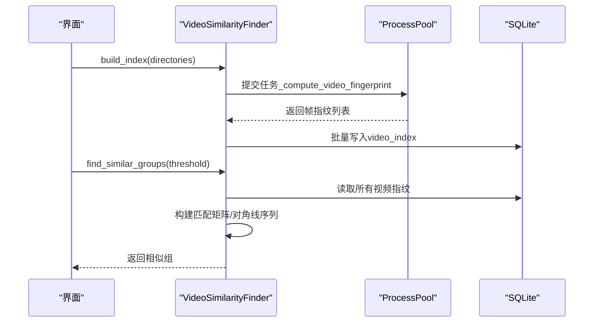
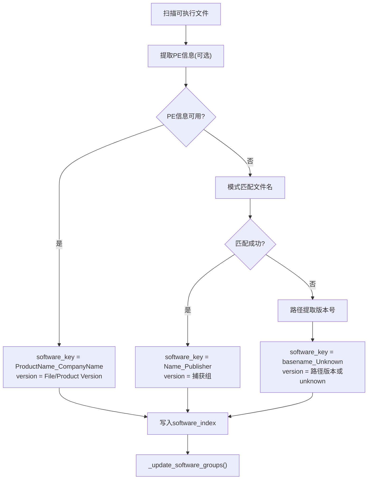
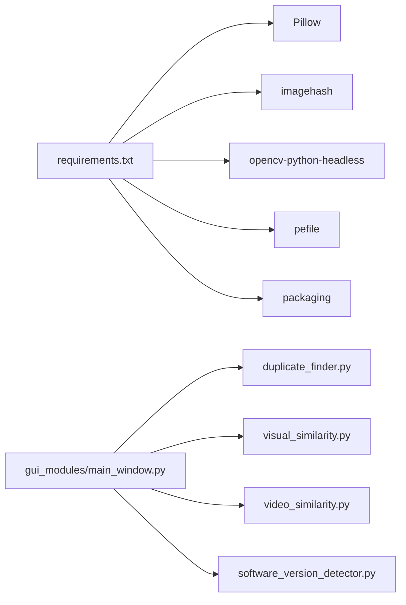

# 扩展开发

<cite>
**本文引用的文件**
- [README.md](file://README.md)
- [requirements.txt](file://requirements.txt)
- [run_gui.py](file://run_gui.py)
- [core/__init__.py](file://core/__init__.py)
- [core/duplicate_finder.py](file://core/duplicate_finder.py)
- [core/visual_similarity.py](file://core/visual_similarity.py)
- [core/video_similarity.py](file://core/video_similarity.py)
- [core/software_version_detector.py](file://core/software_version_detector.py)
- [gui_modules/main_window.py](file://gui_modules/main_window.py)
- [gui_modules/detail_window.py](file://gui_modules/detail_window.py)
- [docs/GUI_SPECIFICATION.md](file://docs/GUI_SPECIFICATION.md)
- [docs/IMAGE_SIMILARITY_SPEC.md](file://docs/IMAGE_SIMILARITY_SPEC.md)
</cite>

## 目录
1. [简介](#简介)
2. [项目结构](#项目结构)
3. [核心组件](#核心组件)
4. [架构总览](#架构总览)
5. [详细组件分析](#详细组件分析)
6. [依赖关系分析](#依赖关系分析)
7. [性能考虑](#性能考虑)
8. [故障排查指南](#故障排查指南)
9. [结论](#结论)
10. [附录](#附录)

## 简介
本指南面向希望扩展“文件重复校验工具”的开发者，目标是提供一套可操作的扩展方法论：如何添加新的检测算法、扩展现有功能、以及如何以插件化方式集成第三方库与自定义检测器。文档基于仓库现有代码与规范，给出接口约定、模块集成步骤、性能优化技巧与兼容性保障建议，帮助你在不破坏既有能力的前提下安全演进系统。

## 项目结构
项目采用“核心引擎 + GUI界面”的分层组织方式：
- core：各检测算法与数据处理引擎（精确匹配、图片相似度、视频相似度、多版本软件检测）
- gui_modules：Tkinter界面与各功能标签页
- docs：GUI与算法相关规范文档
- 根目录：启动脚本、依赖清单与说明文档

图表来源
- [gui_modules/main_window.py:18-85](file://gui_modules/main_window.py#L18-L85)
- [core/__init__.py:6-9](file://core/__init__.py#L6-L9)

章节来源
- [README.md:338-372](file://README.md#L338-L372)
- [gui_modules/main_window.py:18-85](file://gui_modules/main_window.py#L18-L85)
- [core/__init__.py:6-9](file://core/__init__.py#L6-L9)

## 核心组件
- 精确匹配引擎：基于文件大小分组、部分哈希（前1MB）、完整MD5三级过滤，支持多线程并行与SQLite索引优化。
- 图片相似度引擎：pHash + dHash + 颜色直方图三级过滤，支持快速/精确模式，多进程指纹计算与批量入库。
- 视频相似度引擎：关键帧序列匹配（pHash/dHash），滑动窗口与对角线序列分析，动态采样策略，多进程处理。
- 多版本软件检测：PE元数据提取、模式匹配、路径版本号提取，语义化版本比较与分组统计。

章节来源
- [core/duplicate_finder.py:25-75](file://core/duplicate_finder.py#L25-L75)
- [core/visual_similarity.py:94-121](file://core/visual_similarity.py#L94-L121)
- [core/video_similarity.py:174-203](file://core/video_similarity.py#L174-L203)
- [core/software_version_detector.py:30-96](file://core/software_version_detector.py#L30-L96)

## 架构总览
系统遵循“界面-引擎-存储”三层架构：
- 界面层：主窗口负责创建标签页并路由用户操作到对应引擎；详情窗口统一展示结果。
- 引擎层：每个检测算法封装为独立类，提供扫描、索引构建、相似组查找、导出等标准方法。
- 存储层：SQLite数据库（WAL模式、索引优化）持久化索引与结果，支持增量扫描。

图表来源
- [gui_modules/main_window.py:165-195](file://gui_modules/main_window.py#L165-L195)
- [core/visual_similarity.py:253-311](file://core/visual_similarity.py#L253-L311)
- [core/visual_similarity.py:410-513](file://core/visual_similarity.py#L410-L513)
- [core/video_similarity.py:310-367](file://core/video_similarity.py#L310-L367)
- [core/video_similarity.py:547-652](file://core/video_similarity.py#L547-L652)

## 详细组件分析

### 精确匹配引擎（DuplicateFinder）
- 设计要点
  - 多级过滤：大小分组 → 部分哈希 → 完整哈希，显著减少I/O与CPU开销。
  - 线程池与锁：使用ThreadPoolExecutor并行计算哈希，通过线程锁保护进度计数避免竞态。
  - 数据库优化：WAL模式、缓存与内存映射、批量插入与索引加速。
  - 自适应线程数：根据磁盘类型（HDD/SSD）自动调整并发度。
- 扩展点
  - 新增过滤阶段：可在大小分组后插入自定义轻量特征（如文件头签名）。
  - 替换哈希算法：保持接口不变即可替换为其他摘要函数。
  - 输出格式：export_results支持流式JSON写入，便于扩展字段。

图表来源
- [core/duplicate_finder.py:324-387](file://core/duplicate_finder.py#L324-L387)
- [core/duplicate_finder.py:436-504](file://core/duplicate_finder.py#L436-L504)
- [core/duplicate_finder.py:506-595](file://core/duplicate_finder.py#L506-L595)
- [core/duplicate_finder.py:597-658](file://core/duplicate_finder.py#L597-L658)

章节来源
- [core/duplicate_finder.py:25-75](file://core/duplicate_finder.py#L25-L75)
- [core/duplicate_finder.py:133-175](file://core/duplicate_finder.py#L133-L175)
- [core/duplicate_finder.py:208-310](file://core/duplicate_finder.py#L208-L310)
- [core/duplicate_finder.py:324-387](file://core/duplicate_finder.py#L324-L387)
- [core/duplicate_finder.py:436-504](file://core/duplicate_finder.py#L436-L504)
- [core/duplicate_finder.py:506-595](file://core/duplicate_finder.py#L506-L595)
- [core/duplicate_finder.py:597-658](file://core/duplicate_finder.py#L597-L658)

### 图片相似度引擎（ImageSimilarityFinder）
- 设计要点
  - 三级过滤：pHash快速筛选 → dHash二次验证 → 直方图余弦相似度精确比对。
  - 多进程指纹计算：全局函数_compute_image_fingerprint用于跨进程安全执行。
  - 数据库表：image_index与similarity_groups，索引覆盖phash/dhash/size/path。
  - 模式切换：fast仅pHash，precise启用dHash+直方图。
- 扩展点
  - 新增特征：在指纹中追加新特征字段（如sift/surf描述符），并在find_similar_groups中增加相应过滤逻辑。
  - 相似度融合：调整权重或引入机器学习评分模型。
  - 增量扫描：基于modified_time与hash判断是否需要重算。

图表来源
- [core/visual_similarity.py:21-91](file://core/visual_similarity.py#L21-L91)
- [core/visual_similarity.py:94-121](file://core/visual_similarity.py#L94-L121)
- [core/visual_similarity.py:253-311](file://core/visual_similarity.py#L253-L311)
- [core/visual_similarity.py:334-408](file://core/visual_similarity.py#L334-L408)
- [core/visual_similarity.py:410-513](file://core/visual_similarity.py#L410-L513)

章节来源
- [core/visual_similarity.py:94-121](file://core/visual_similarity.py#L94-L121)
- [core/visual_similarity.py:253-311](file://core/visual_similarity.py#L253-L311)
- [core/visual_similarity.py:410-513](file://core/visual_similarity.py#L410-L513)

### 视频相似度引擎（VideoSimilarityFinder）
- 设计要点
  - 关键帧序列匹配：根据时长动态采样帧，计算每帧pHash/dHash，构建匹配矩阵寻找对角线连续片段。
  - 多进程处理：_compute_video_fingerprint作为全局函数，避免跨进程对象传递问题。
  - 数据库表：video_index存储帧指纹信息，支持批量写入与索引优化。
- 扩展点
  - 新增帧级特征：在frame_hashes中追加新特征（如颜色直方图），并在相似度计算中融合。
  - 改进匹配策略：引入时间加权或上下文感知匹配。
  - 阈值调优：threshold_phash控制敏感度，可按场景配置。

图表来源
- [core/video_similarity.py:21-151](file://core/video_similarity.py#L21-L151)
- [core/video_similarity.py:310-367](file://core/video_similarity.py#L310-L367)
- [core/video_similarity.py:389-496](file://core/video_similarity.py#L389-L496)
- [core/video_similarity.py:547-652](file://core/video_similarity.py#L547-L652)

章节来源
- [core/video_similarity.py:174-203](file://core/video_similarity.py#L174-L203)
- [core/video_similarity.py:310-367](file://core/video_similarity.py#L310-L367)
- [core/video_similarity.py:547-652](file://core/video_similarity.py#L547-L652)

### 多版本软件检测（SoftwareVersionDetector）
- 设计要点
  - 识别优先级：PE元数据 > 文件名模式匹配 > 路径版本号提取。
  - 版本比较：packaging.version语义化比较，未知版本降级为字符串比较。
  - 数据库表：software_index与software_groups，维护软件分组统计与最新/最旧版本。
- 扩展点
  - 新增软件模式：在SOFTWARE_PATTERNS中添加正则与名称/发布者映射。
  - 增强版本解析：支持更多版本格式（如SemVer、MAJOR.MINOR.PATCH）。
  - 自定义过滤器：扩展SUPPORTED_EXTENSIONS以支持更多可执行格式。

图表来源
- [core/software_version_detector.py:178-244](file://core/software_version_detector.py#L178-L244)
- [core/software_version_detector.py:246-316](file://core/software_version_detector.py#L246-L316)
- [core/software_version_detector.py:391-481](file://core/software_version_detector.py#L391-L481)
- [core/software_version_detector.py:483-538](file://core/software_version_detector.py#L483-L538)

章节来源
- [core/software_version_detector.py:30-96](file://core/software_version_detector.py#L30-L96)
- [core/software_version_detector.py:178-244](file://core/software_version_detector.py#L178-L244)
- [core/software_version_detector.py:246-316](file://core/software_version_detector.py#L246-L316)
- [core/software_version_detector.py:391-481](file://core/software_version_detector.py#L391-L481)
- [core/software_version_detector.py:483-538](file://core/software_version_detector.py#L483-L538)

## 依赖关系分析
- 运行时依赖
  - 基础：Python标准库（hashlib、sqlite3、concurrent.futures等）
  - 图片相似度：Pillow、imagehash、numpy（可选）
  - 视频相似度：opencv-python-headless、Pillow、imagehash、numpy
  - 多版本软件检测：pefile、packaging
- 模块耦合
  - GUI通过main_window导入具体引擎类，解耦良好，易于替换或扩展。
  - 各引擎独立维护数据库，避免交叉依赖。

图表来源
- [requirements.txt:10-23](file://requirements.txt#L10-L23)
- [gui_modules/main_window.py:18-85](file://gui_modules/main_window.py#L18-L85)

章节来源
- [requirements.txt:1-32](file://requirements.txt#L1-L32)
- [gui_modules/main_window.py:18-85](file://gui_modules/main_window.py#L18-L85)

## 性能考虑
- 数据库优化
  - WAL模式、同步级别降低、缓存与内存映射提升并发与吞吐。
  - 批量插入减少事务次数，索引覆盖常用查询字段。
- 并行计算
  - 图片/视频指纹计算使用多进程，避免GIL限制；线程池用于CPU密集型哈希计算。
  - 自适应线程数：根据磁盘类型调整并发，避免HDD寻道风暴。
- 懒加载与缓存
  - 预览缩略图按需加载，LRU缓存减少重复解码。
- 增量扫描
  - 基于文件修改时间与哈希判断是否需要重算，减少重复工作。

章节来源
- [core/duplicate_finder.py:133-175](file://core/duplicate_finder.py#L133-L175)
- [core/duplicate_finder.py:75-131](file://core/duplicate_finder.py#L75-L131)
- [core/visual_similarity.py:123-169](file://core/visual_similarity.py#L123-L169)
- [core/video_similarity.py:205-239](file://core/video_similarity.py#L205-L239)
- [core/software_version_detector.py:109-159](file://core/software_version_detector.py#L109-L159)

## 故障排查指南
- 依赖缺失
  - 现象：导入错误提示缺少Pillow、imagehash、opencv、pefile等。
  - 解决：安装requirements.txt所列依赖。
- 数据库锁定
  - 现象：大规模写入时出现“database is locked”。
  - 解决：确保使用WAL模式与busy_timeout，避免多进程同时写同一库。
- 视频无法打开
  - 现象：OpenCV无法解码某些格式。
  - 解决：确认已安装headless版OpenCV，检查编码支持。
- 版本比较异常
  - 现象：packaging未安装导致降级为字符串比较。
  - 解决：安装packaging以获得语义化版本比较。

章节来源
- [run_gui.py:27-37](file://run_gui.py#L27-L37)
- [core/duplicate_finder.py:190-201](file://core/duplicate_finder.py#L190-L201)
- [core/video_similarity.py:40-49](file://core/video_similarity.py#L40-L49)
- [core/software_version_detector.py:17-27](file://core/software_version_detector.py#L17-L27)

## 结论
本项目提供了清晰的模块化架构与可扩展的检测引擎接口。通过遵循统一的数据库与回调约定，开发者可以安全地添加新算法、扩展现有功能，并以插件化方式集成第三方库。建议在扩展时优先复用现有模式（多进程指纹计算、批量入库、增量扫描），并结合性能基准进行参数调优，确保在TB级数据规模下的稳定与高效。

## 附录

### 扩展开发步骤（通用模板）
- 定义新引擎类
  - 实现初始化、数据库初始化、扫描/索引构建、相似组查找、导出与统计方法。
  - 使用进度回调与日志回调与GUI交互。
- 注册到GUI
  - 在主窗口中新增标签页，绑定按钮事件调用新引擎。
  - 复用detail_window展示结果。
- 依赖管理
  - 在requirements.txt添加必要依赖，并在导入处做可选依赖处理（try/except）。
- 测试与基准
  - 使用小数据集验证正确性，逐步扩大规模评估性能。
  - 记录阈值与耗时，形成调优手册。

章节来源
- [gui_modules/main_window.py:62-85](file://gui_modules/main_window.py#L62-L85)
- [gui_modules/detail_window.py:1-44](file://gui_modules/detail_window.py#L1-L44)
- [requirements.txt:10-23](file://requirements.txt#L10-L23)

### 接口设计规范
- 进度与日志
  - progress_callback(progress: float, message: str)
  - log_callback(message: str, level: str)
- 数据库
  - 统一使用WAL模式与索引优化，批量插入，避免频繁单条写入。
- 返回值
  - 相似组列表包含group_id、file_count、avg_similarity、files等字段，便于前端渲染。

章节来源
- [core/visual_similarity.py:100-121](file://core/visual_similarity.py#L100-L121)
- [core/video_similarity.py:182-203](file://core/video_similarity.py#L182-L203)
- [core/software_version_detector.py:72-96](file://core/software_version_detector.py#L72-L96)

### 第三方库集成指南
- Pillow/imagehash
  - 用于图片指纹计算与预处理，注意超大图片缩放避免内存溢出。
- OpenCV
  - 视频解码与帧提取，建议使用headless版本以减少体积。
- pefile/packaging
  - 用于PE元数据提取与语义化版本比较，需处理缺失时的降级逻辑。

章节来源
- [core/visual_similarity.py:21-91](file://core/visual_similarity.py#L21-L91)
- [core/video_similarity.py:40-49](file://core/video_similarity.py#L40-L49)
- [core/software_version_detector.py:17-27](file://core/software_version_detector.py#L17-L27)

### 自定义检测器开发
- 设计原则
  - 单一职责：每个检测器专注一类文件或一种相似度度量。
  - 可插拔：通过统一接口接入GUI与数据库。
  - 可观测：提供进度与日志回调，便于调试与监控。
- 实现要点
  - 指纹计算尽量无状态且可并行。
  - 相似度计算分阶段（快速筛选→精细比对）。
  - 数据库表设计考虑查询与索引优化。

章节来源
- [core/duplicate_finder.py:324-387](file://core/duplicate_finder.py#L324-L387)
- [core/visual_similarity.py:410-513](file://core/visual_similarity.py#L410-L513)
- [core/video_similarity.py:547-652](file://core/video_similarity.py#L547-L652)

### 兼容性保证
- 向后兼容
  - 新增字段不影响已有查询，默认值填充。
  - 可选依赖缺失时提供降级路径。
- 平台兼容
  - 磁盘类型检测适配Windows与Linux，线程数自适应。
- 数据迁移
  - 数据库变更时保留旧表结构，逐步迁移。

章节来源
- [core/duplicate_finder.py:75-131](file://core/duplicate_finder.py#L75-L131)
- [core/software_version_detector.py:318-354](file://core/software_version_detector.py#L318-L354)