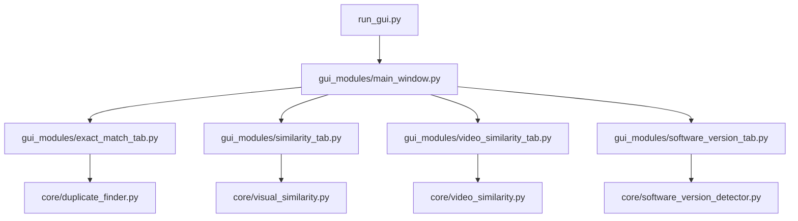
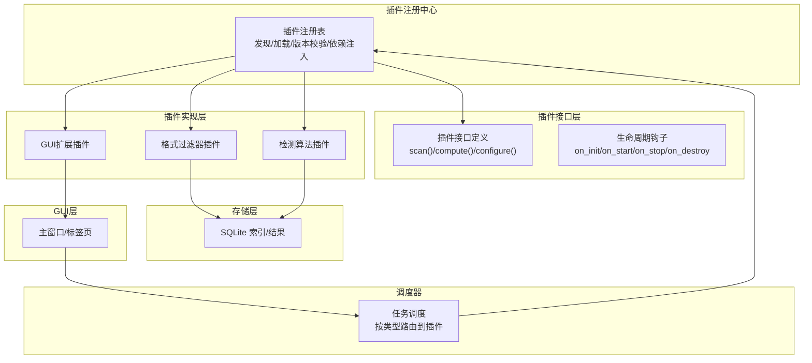
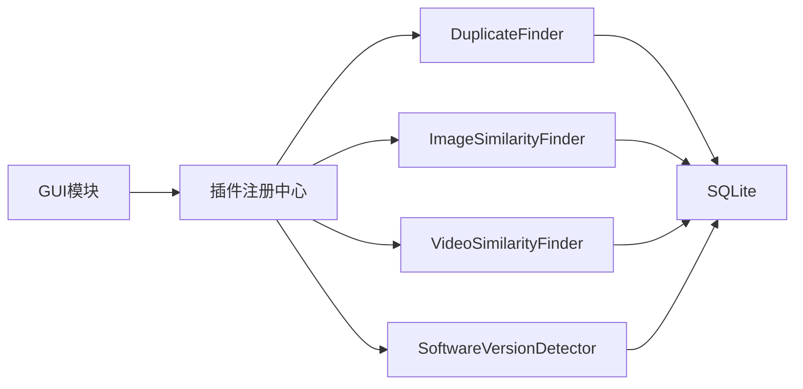
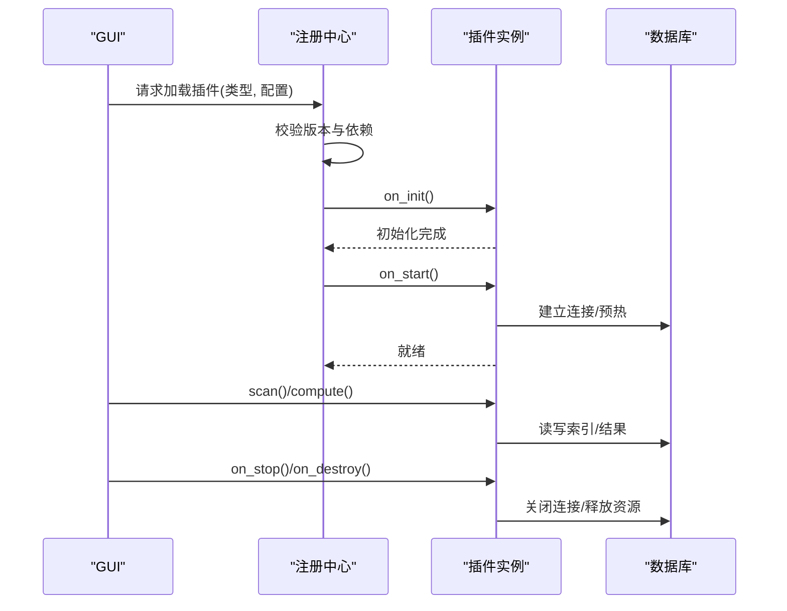
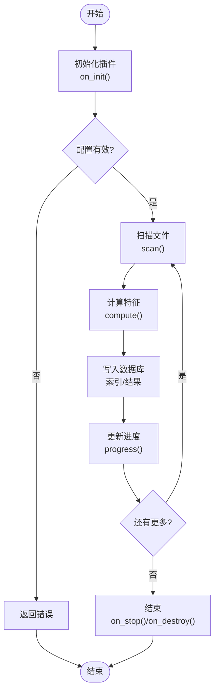

# 插件系统

<cite>
**本文引用的文件**
- [README.md](file://README.md)
- [requirements.txt](file://requirements.txt)
- [run_gui.py](file://run_gui.py)
- [core/__init__.py](file://core/__init__.py)
- [gui_modules/__init__.py](file://gui_modules/__init__.py)
- [core/duplicate_finder.py](file://core/duplicate_finder.py)
- [core/visual_similarity.py](file://core/visual_similarity.py)
- [core/video_similarity.py](file://core/video_similarity.py)
- [core/software_version_detector.py](file://core/software_version_detector.py)
- [gui_modules/main_window.py](file://gui_modules/main_window.py)
- [gui_modules/exact_match_tab.py](file://gui_modules/exact_match_tab.py)
- [gui_modules/similarity_tab.py](file://gui_modules/similarity_tab.py)
- [gui_modules/software_version_tab.py](file://gui_modules/software_version_tab.py)
</cite>

## 目录
1. [引言](#引言)
2. [项目结构](#项目结构)
3. [核心组件](#核心组件)
4. [架构总览](#架构总览)
5. [详细组件分析](#详细组件分析)
6. [依赖分析](#依赖分析)
7. [性能考虑](#性能考虑)
8. [故障排查指南](#故障排查指南)
9. [结论](#结论)
10. [附录：插件开发模板与示例](#附录：插件开发模板与示例)

## 引言
本指南基于现有“文件重复校验工具”的代码库，提炼并扩展出一套可扩展的插件化架构方案。目标是为开发者提供一套清晰的插件接口定义、加载机制、生命周期管理、注册与依赖注入方法，以及配置管理、动态加载与热重载策略；同时涵盖安全机制、版本兼容性与错误处理策略，并提供三类插件实现示例：文件格式过滤器插件、自定义检测算法插件、GUI扩展插件。

该方案在不破坏现有功能的前提下，将核心引擎（精确匹配、图片相似度、视频相似度、多版本软件检测）抽象为可插拔能力，通过统一接口和约定进行扩展。

## 项目结构
当前仓库采用分层组织：
- core：核心检测引擎模块，包含精确匹配、图片相似度、视频相似度、多版本软件检测等独立能力
- gui_modules：图形界面模块，封装各功能标签页与主窗口编排
- 入口脚本：run_gui.py 启动 GUI
- 文档与依赖：README.md、requirements.txt

图表来源
- [run_gui.py:13-37](file://run_gui.py#L13-L37)
- [gui_modules/main_window.py:22-85](file://gui_modules/main_window.py#L22-L85)
- [gui_modules/exact_match_tab.py:18-41](file://gui_modules/exact_match_tab.py#L18-L41)
- [gui_modules/similarity_tab.py:18-48](file://gui_modules/similarity_tab.py#L18-L48)
- [gui_modules/software_version_tab.py:15-32](file://gui_modules/software_version_tab.py#L15-L32)
- [core/duplicate_finder.py:25-73](file://core/duplicate_finder.py#L25-L73)
- [core/visual_similarity.py:94-121](file://core/visual_similarity.py#L94-L121)
- [core/video_similarity.py:174-203](file://core/video_similarity.py#L174-L203)
- [core/software_version_detector.py:30-95](file://core/software_version_detector.py#L30-L95)

章节来源
- [README.md:338-401](file://README.md#L338-L401)
- [gui_modules/main_window.py:22-85](file://gui_modules/main_window.py#L22-L85)

## 核心组件
- DuplicateFinder：精确匹配引擎，支持多线程、数据库索引、批量写入、进度回调、停止标志、日志回调、允许的文件后缀过滤
- ImageSimilarityFinder：图片相似度引擎，支持pHash/dHash/直方图三级过滤、进程池并行、增量扫描、统计信息
- VideoSimilarityFinder：视频相似度引擎，关键帧序列匹配、滑动窗口对角线匹配、时间覆盖率评分、进程池并行
- SoftwareVersionDetector：多版本软件检测，PE元数据提取、模式匹配、路径版本号提取、语义化版本比较、分组统计

这些组件均具备：
- 统一的初始化参数（数据库路径、批大小、回调函数）
- 数据库优化（WAL、缓存、内存映射）
- 进度与日志回调接口
- 增量/全量扫描开关
- 结果导出或查询接口

章节来源
- [core/duplicate_finder.py:25-73](file://core/duplicate_finder.py#L25-L73)
- [core/visual_similarity.py:94-121](file://core/visual_similarity.py#L94-L121)
- [core/video_similarity.py:174-203](file://core/video_similarity.py#L174-L203)
- [core/software_version_detector.py:30-95](file://core/software_version_detector.py#L30-L95)

## 架构总览
从现有代码中抽象出“插件式”的分层架构：
- 插件接口层：定义统一的插件契约（扫描、计算、配置、生命周期）
- 插件注册中心：集中管理插件发现、加载、版本校验、依赖解析
- 插件实现层：以模块为单位实现具体能力（如格式过滤、检测算法、GUI扩展）
- 调度器：根据用户选择调用对应插件执行流程
- 存储层：SQLite数据库持久化索引与结果
- GUI层：标签页作为插件的UI容器，负责交互与状态同步

图表来源
- [gui_modules/main_window.py:62-85](file://gui_modules/main_window.py#L62-L85)
- [core/duplicate_finder.py:208-387](file://core/duplicate_finder.py#L208-L387)
- [core/visual_similarity.py:253-311](file://core/visual_similarity.py#L253-L311)
- [core/video_similarity.py:310-367](file://core/video_similarity.py#L310-L367)
- [core/software_version_detector.py:391-481](file://core/software_version_detector.py#L391-L481)

## 详细组件分析

### 插件接口设计（建议）
- 基础接口
  - scan(directories, options) -> Iterator[FileInfo]
  - compute(file_info, options) -> FeatureVector
  - configure(options) -> bool
  - on_init() / on_start() / on_stop() / on_destroy()
- 元数据
  - name, version, description, dependencies, supported_formats
- 错误与日志
  - log(message, level)
  - progress(percent, message)
- 安全与权限
  - 沙箱执行、白名单路径、资源限制

说明：以上接口是对现有核心组件的统一抽象，便于后续以插件形式替换或扩展。

章节来源
- [core/duplicate_finder.py:28-73](file://core/duplicate_finder.py#L28-L73)
- [core/visual_similarity.py:100-121](file://core/visual_similarity.py#L100-L121)
- [core/video_similarity.py:182-203](file://core/video_similarity.py#L182-L203)
- [core/software_version_detector.py:72-95](file://core/software_version_detector.py#L72-L95)

### 加载机制与生命周期管理
- 插件发现：扫描指定目录下的插件包（约定命名规范）
- 加载顺序：按依赖关系拓扑排序加载
- 生命周期：
  - on_init：初始化资源（数据库连接、缓存）
  - on_start：启动前准备（预热、校验环境）
  - on_stop：优雅停止（释放锁、关闭连接）
  - on_destroy：销毁资源（清理缓存、临时文件）
- 热重载：监听插件文件变更事件，触发卸载旧实例并加载新实例，保证无中断切换

章节来源
- [core/duplicate_finder.py:177-201](file://core/duplicate_finder.py#L177-L201)
- [core/visual_similarity.py:171-188](file://core/visual_similarity.py#L171-L188)
- [core/video_similarity.py:241-258](file://core/video_similarity.py#L241-L258)
- [core/software_version_detector.py:109-159](file://core/software_version_detector.py#L109-L159)

### 注册机制与依赖注入
- 注册中心维护插件清单，支持按类型（过滤器、检测器、GUI扩展）检索
- 依赖注入：
  - 构造时注入共享对象（数据库连接、日志器、配置管理器）
  - 运行时注入上下文（扫描任务ID、用户会话、权限令牌）
- 版本兼容性：
  - 插件声明最小/最大兼容版本
  - 加载时校验，不满足则拒绝加载并提示

章节来源
- [gui_modules/main_window.py:16-20](file://gui_modules/main_window.py#L16-L20)
- [core/duplicate_finder.py:28-73](file://core/duplicate_finder.py#L28-L73)
- [core/software_version_detector.py:318-354](file://core/software_version_detector.py#L318-L354)

### 配置管理
- 全局配置：数据库路径、线程数、批大小、阈值、模式（快速/精确）
- 插件级配置：支持的格式、算法参数、UI显示选项
- 配置来源：配置文件、环境变量、GUI输入、命令行参数
- 热更新：支持运行时修改部分配置并生效（需插件支持）

章节来源
- [gui_modules/exact_match_tab.py:21-41](file://gui_modules/exact_match_tab.py#L21-L41)
- [gui_modules/similarity_tab.py:21-48](file://gui_modules/similarity_tab.py#L21-L48)
- [gui_modules/software_version_tab.py:18-32](file://gui_modules/software_version_tab.py#L18-L32)
- [core/duplicate_finder.py:28-73](file://core/duplicate_finder.py#L28-L73)

### 动态加载与热重载
- 动态加载：在运行时装载插件模块，避免重启应用
- 热重载：监控插件文件变化，自动卸载并重新加载，保持服务可用
- 回滚机制：新版本加载失败时回滚至上一稳定版本

章节来源
- [run_gui.py:13-37](file://run_gui.py#L13-L37)
- [gui_modules/main_window.py:62-85](file://gui_modules/main_window.py#L62-L85)

### 安全机制
- 插件隔离：使用进程或受限环境执行不可信代码
- 权限控制：限制文件系统访问、网络请求、系统调用
- 输入校验：严格校验插件输出与配置，防止注入
- 审计日志：记录插件行为，便于追踪问题

章节来源
- [core/duplicate_finder.py:203-207](file://core/duplicate_finder.py#L203-L207)
- [core/software_version_detector.py:178-244](file://core/software_version_detector.py#L178-L244)

### 版本兼容性与错误处理
- 版本兼容：插件声明兼容范围，加载时校验
- 错误处理：捕获异常、降级策略、重试机制
- 恢复机制：损坏数据库或索引时重建

章节来源
- [core/software_version_detector.py:318-354](file://core/software_version_detector.py#L318-L354)
- [core/visual_similarity.py:253-311](file://core/visual_similarity.py#L253-L311)
- [core/video_similarity.py:310-367](file://core/video_similarity.py#L310-L367)

## 依赖分析
- 外部依赖：Pillow、imagehash、opencv-python-headless、pefile、packaging
- 内部依赖：GUI模块依赖核心引擎；核心引擎之间相对独立，通过统一接口解耦
- 潜在循环依赖：应避免GUI直接耦合核心逻辑，通过注册中心与调度器中转

图表来源
- [gui_modules/main_window.py:16-20](file://gui_modules/main_window.py#L16-L20)
- [core/duplicate_finder.py:28-73](file://core/duplicate_finder.py#L28-L73)
- [core/visual_similarity.py:94-121](file://core/visual_similarity.py#L94-L121)
- [core/video_similarity.py:174-203](file://core/video_similarity.py#L174-L203)
- [core/software_version_detector.py:30-95](file://core/software_version_detector.py#L30-L95)

章节来源
- [requirements.txt:1-32](file://requirements.txt#L1-L32)
- [gui_modules/main_window.py:16-20](file://gui_modules/main_window.py#L16-L20)

## 性能考虑
- 多线程/多进程：图片与视频指纹计算使用进程池，避免GIL限制
- 数据库优化：WAL模式、缓存、内存映射、批量写入
- 懒加载与缓存：缩略图与预览按需加载，减少内存占用
- 自适应线程数：根据磁盘类型调整线程数，避免HDD寻道风暴

章节来源
- [core/duplicate_finder.py:75-131](file://core/duplicate_finder.py#L75-L131)
- [core/visual_similarity.py:280-311](file://core/visual_similarity.py#L280-L311)
- [core/video_similarity.py:336-367](file://core/video_similarity.py#L336-L367)
- [core/duplicate_finder.py:133-175](file://core/duplicate_finder.py#L133-L175)

## 故障排查指南
- 常见问题
  - 导入错误：检查依赖是否安装完整
  - 数据库锁定：增加超时与忙等待，减少并发写入冲突
  - 扫描速度慢：调整线程数、使用增量扫描、分批处理
  - 相似检测不准确：调整阈值、切换快速/精确模式
- 定位方法
  - 查看日志输出与回调消息
  - 检查数据库结构与索引
  - 验证插件版本兼容性与依赖

章节来源
- [core/duplicate_finder.py:190-201](file://core/duplicate_finder.py#L190-L201)
- [core/visual_similarity.py:253-311](file://core/visual_similarity.py#L253-L311)
- [core/video_similarity.py:310-367](file://core/video_similarity.py#L310-L367)
- [core/software_version_detector.py:419-481](file://core/software_version_detector.py#L419-L481)

## 结论
通过将现有核心引擎抽象为插件接口，并引入注册中心、调度器、生命周期管理与配置管理，可以构建一个可扩展、可维护、高性能的插件系统。该方案支持动态加载与热重载，具备安全机制与版本兼容性保障，能够灵活扩展文件格式过滤、检测算法与GUI功能。

## 附录：插件开发模板与示例

### 插件接口模板（建议）
- 插件类
  - 属性：name, version, description, dependencies, supported_formats
  - 方法：scan(), compute(), configure(), on_init(), on_start(), on_stop(), on_destroy()
  - 回调：log(), progress()
- 插件清单
  - 元数据：名称、版本、描述、依赖、兼容范围
  - 入口点：模块路径、类名、方法名

章节来源
- [core/duplicate_finder.py:28-73](file://core/duplicate_finder.py#L28-L73)
- [core/visual_similarity.py:100-121](file://core/visual_similarity.py#L100-L121)
- [core/video_similarity.py:182-203](file://core/video_similarity.py#L182-L203)
- [core/software_version_detector.py:72-95](file://core/software_version_detector.py#L72-L95)

### 插件注册与加载流程（序列图）

图表来源
- [gui_modules/main_window.py:62-85](file://gui_modules/main_window.py#L62-L85)
- [core/duplicate_finder.py:177-201](file://core/duplicate_finder.py#L177-L201)
- [core/visual_similarity.py:171-188](file://core/visual_similarity.py#L171-L188)
- [core/video_similarity.py:241-258](file://core/video_similarity.py#L241-L258)
- [core/software_version_detector.py:109-159](file://core/software_version_detector.py#L109-L159)

### 示例一：文件格式过滤器插件
- 目标：在扫描阶段按扩展名过滤文件，减少无效计算
- 实现要点：
  - 实现supported_formats集合
  - 在scan()中返回符合格式的文件信息
  - 支持自定义后缀输入
- 参考位置
  - 精确匹配中的allowed_extensions过滤
  - GUI中的格式勾选与自定义输入

章节来源
- [core/duplicate_finder.py:240-247](file://core/duplicate_finder.py#L240-L247)
- [gui_modules/exact_match_tab.py:73-105](file://gui_modules/exact_match_tab.py#L73-L105)
- [gui_modules/similarity_tab.py:126-162](file://gui_modules/similarity_tab.py#L126-L162)
- [gui_modules/software_version_tab.py:77-123](file://gui_modules/software_version_tab.py#L77-L123)

### 示例二：自定义检测算法插件
- 目标：插入新的相似度或重复检测算法
- 实现要点：
  - 实现compute()计算特征向量
  - 支持阈值与模式配置
  - 与数据库交互存储索引与结果
- 参考位置
  - 图片相似度：pHash/dHash/直方图
  - 视频相似度：关键帧序列匹配
  - 多版本软件：PE元数据+模式匹配

章节来源
- [core/visual_similarity.py:241-311](file://core/visual_similarity.py#L241-L311)
- [core/video_similarity.py:310-367](file://core/video_similarity.py#L310-L367)
- [core/software_version_detector.py:391-481](file://core/software_version_detector.py#L391-L481)

### 示例三：GUI扩展插件
- 目标：新增标签页或扩展现有界面
- 实现要点：
  - 继承基类或遵循约定接口
  - 提供配置控件与按钮
  - 与核心引擎交互，更新进度与日志
- 参考位置
  - 主窗口创建标签页
  - 各标签页的控件与事件处理

章节来源
- [gui_modules/main_window.py:62-85](file://gui_modules/main_window.py#L62-L85)
- [gui_modules/exact_match_tab.py:115-197](file://gui_modules/exact_match_tab.py#L115-L197)
- [gui_modules/similarity_tab.py:50-200](file://gui_modules/similarity_tab.py#L50-L200)
- [gui_modules/software_version_tab.py:34-182](file://gui_modules/software_version_tab.py#L34-L182)

### 流程图：插件扫描与计算（通用）

图表来源
- [core/duplicate_finder.py:208-387](file://core/duplicate_finder.py#L208-L387)
- [core/visual_similarity.py:253-311](file://core/visual_similarity.py#L253-L311)
- [core/video_similarity.py:310-367](file://core/video_similarity.py#L310-L367)
- [core/software_version_detector.py:391-481](file://core/software_version_detector.py#L391-L481)