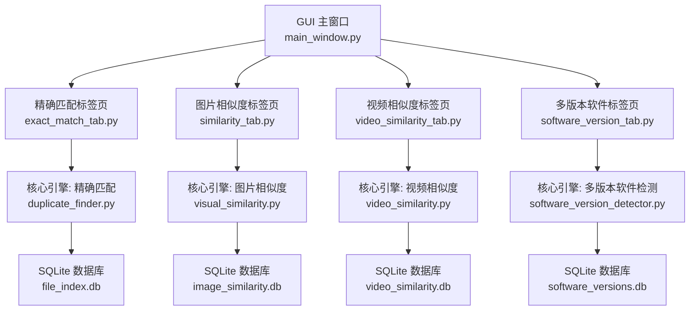
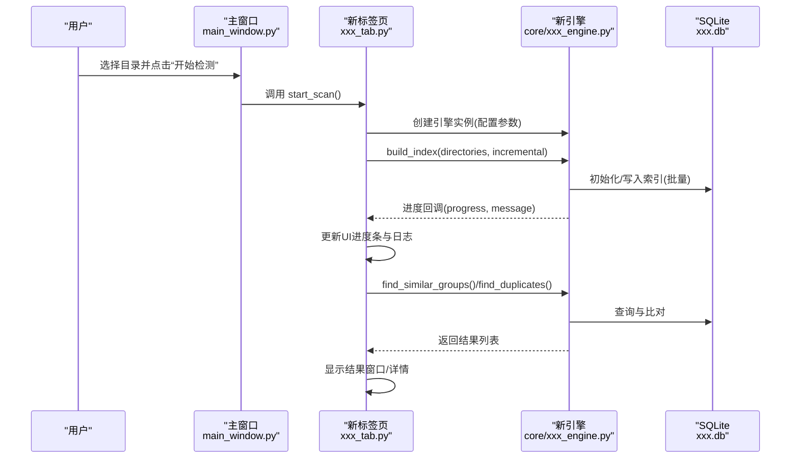
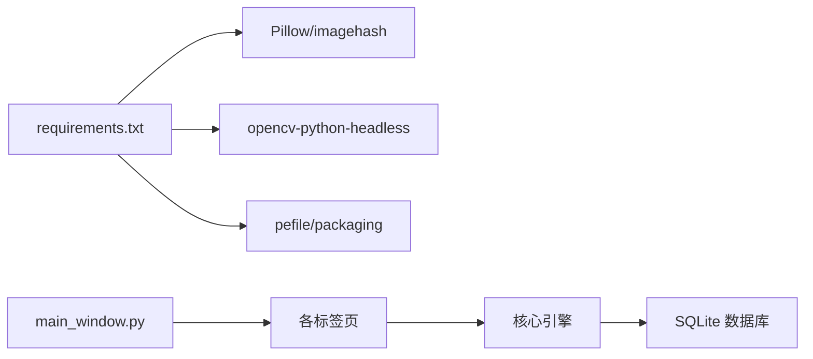

# 新功能开发

<cite>
**本文引用的文件**
- [README.md](file://README.md)
- [QUICK_START.md](file://QUICK_START.md)
- [requirements.txt](file://requirements.txt)
- [run_gui.py](file://run_gui.py)
- [core/__init__.py](file://core/__init__.py)
- [gui_modules/__init__.py](file://gui_modules/__init__.py)
- [core/duplicate_finder.py](file://core/duplicate_finder.py)
- [core/visual_similarity.py](file://core/visual_similarity.py)
- [core/video_similarity.py](file://core/video_similarity.py)
- [core/software_version_detector.py](file://core/software_version_detector.py)
- [gui_modules/main_window.py](file://gui_modules/main_window.py)
- [gui_modules/exact_match_tab.py](file://gui_modules/exact_match_tab.py)
- [gui_modules/similarity_tab.py](file://gui_modules/similarity_tab.py)
- [gui_modules/video_similarity_tab.py](file://gui_modules/video_similarity_tab.py)
- [gui_modules/software_version_tab.py](file://gui_modules/software_version_tab.py)
</cite>

## 目录
1. [引言](#引言)
2. [项目结构](#项目结构)
3. [核心组件](#核心组件)
4. [架构总览](#架构总览)
5. [详细组件分析](#详细组件分析)
6. [依赖关系分析](#依赖关系分析)
7. [性能考量](#性能考量)
8. [故障排查指南](#故障排查指南)
9. [结论](#结论)
10. [附录](#附录)

## 引言
本指南面向希望为“文件重复校验工具”新增检测功能模块的开发者。内容覆盖从需求分析、架构设计原则、接口规范到模块集成、数据库设计、算法实现、性能优化与用户体验设计的完整流程，确保新功能与现有系统保持一致性与兼容性。

## 项目结构
本项目采用分层模块化架构：
- GUI 层：基于 Tkinter 的主窗口与多个标签页（精确匹配、图片相似度、视频相似度、多版本软件检测）
- 核心引擎层：各检测功能的独立算法与数据处理模块
- 数据存储层：SQLite 数据库索引与结果持久化
- 启动入口：统一启动 GUI 并加载主窗口

图表来源
- [gui_modules/main_window.py:62-85](file://gui_modules/main_window.py#L62-L85)
- [gui_modules/exact_match_tab.py:293-379](file://gui_modules/exact_match_tab.py#L293-L379)
- [gui_modules/similarity_tab.py:341-416](file://gui_modules/similarity_tab.py#L341-L416)
- [gui_modules/video_similarity_tab.py:331-414](file://gui_modules/video_similarity_tab.py#L331-L414)
- [gui_modules/software_version_tab.py:272-372](file://gui_modules/software_version_tab.py#L272-L372)
- [core/duplicate_finder.py:133-175](file://core/duplicate_finder.py#L133-L175)
- [core/visual_similarity.py:123-169](file://core/visual_similarity.py#L123-L169)
- [core/video_similarity.py:205-239](file://core/video_similarity.py#L205-L239)
- [core/software_version_detector.py:109-159](file://core/software_version_detector.py#L109-L159)

章节来源
- [gui_modules/main_window.py:62-85](file://gui_modules/main_window.py#L62-L85)
- [core/__init__.py:1-10](file://core/__init__.py#L1-L10)
- [gui_modules/__init__.py:1-11](file://gui_modules/__init__.py#L1-L11)
- [run_gui.py:13-25](file://run_gui.py#L13-L25)

## 核心组件
- 精确匹配引擎：三级过滤（文件大小→部分哈希→完整哈希），多线程并行，WAL 模式 SQLite，批量写入与流式导出
- 图片相似度引擎：pHash + dHash + 颜色直方图三级过滤，多进程指纹计算，增量索引与相似组聚合
- 视频相似度引擎：关键帧序列匹配，滑动窗口与对角线序列分析，动态采样帧数，Jaccard+时间覆盖率综合评分
- 多版本软件检测：PE 元数据提取、智能软件识别（优先级策略）、语义化版本比较、分组统计与导出

章节来源
- [core/duplicate_finder.py:25-73](file://core/duplicate_finder.py#L25-L73)
- [core/visual_similarity.py:94-121](file://core/visual_similarity.py#L94-L121)
- [core/video_similarity.py:174-203](file://core/video_similarity.py#L174-L203)
- [core/software_version_detector.py:30-95](file://core/software_version_detector.py#L30-L95)

## 架构总览
新增功能应遵循以下架构原则：
- 分层解耦：GUI 仅负责交互与参数传递；核心引擎封装算法与数据访问；数据库按功能隔离
- 可扩展性：每个检测功能以独立类暴露统一接口（构建索引、查找相似/重复、导出结果）
- 并发与性能：I/O 密集型使用线程池，CPU 密集型使用进程池；批量写入与缓存降低开销
- 可观测性：进度回调与日志回调贯穿 UI 与引擎，便于调试与监控
- 向后兼容：保持现有标签页与主窗口路由不变，新增标签页通过 Notebook 注册

图表来源
- [gui_modules/main_window.py:165-195](file://gui_modules/main_window.py#L165-L195)
- [gui_modules/exact_match_tab.py:293-379](file://gui_modules/exact_match_tab.py#L293-L379)
- [gui_modules/similarity_tab.py:341-416](file://gui_modules/similarity_tab.py#L341-L416)
- [gui_modules/video_similarity_tab.py:331-414](file://gui_modules/video_similarity_tab.py#L331-L414)
- [gui_modules/software_version_tab.py:272-372](file://gui_modules/software_version_tab.py#L272-L372)
- [core/duplicate_finder.py:324-387](file://core/duplicate_finder.py#L324-L387)
- [core/visual_similarity.py:253-311](file://core/visual_similarity.py#L253-L311)
- [core/video_similarity.py:310-367](file://core/video_similarity.py#L310-L367)
- [core/software_version_detector.py:391-481](file://core/software_version_detector.py#L391-L481)

## 详细组件分析

### 新增功能开发流程（从需求到上线）
- 需求分析
  - 明确目标：解决哪类重复或相似问题（如音频、文档、压缩包等）
  - 输入输出：扫描目录、格式过滤、阈值、增量/全量、结果展示与导出
  - 性能预期：TB级规模下的吞吐、内存与磁盘占用上限
- 架构设计
  - 在 core/ 下新增引擎模块，定义统一的接口：build_index、find_*_groups、export_results
  - 在 gui_modules/ 下新增标签页，复用主窗口的目录管理与进度/日志机制
  - 数据库设计：新建独立 .db 文件，合理建表与索引，支持增量扫描
- 接口设计规范
  - 进度回调：callback(progress: float, message: str)
  - 日志回调：callback(message: str, level: str = "INFO")
  - 错误处理：抛出异常或返回 None，并在 UI 中友好提示
- 模块集成方法
  - 在主窗口 Notebook 中注册新标签页
  - 标签页中导入新引擎，传入目录、阈值、增量标志等参数
  - 将结果渲染至 Treeview，支持筛选、排序、隐藏与详情查看
- 单元测试与验证
  - 针对核心算法编写单测（哈希、相似度计算、版本比较等）
  - 对数据库操作进行事务与回滚测试
  - 对 UI 交互进行冒烟测试（添加目录、开始检测、查看结果）
- 上线与发布
  - 更新 requirements.txt 与 README
  - 打包脚本与 CI 流水线适配新功能
  - 提供用户帮助文档与常见问题解答

章节来源
- [gui_modules/main_window.py:62-85](file://gui_modules/main_window.py#L62-L85)
- [gui_modules/exact_match_tab.py:293-379](file://gui_modules/exact_match_tab.py#L293-L379)
- [gui_modules/similarity_tab.py:341-416](file://gui_modules/similarity_tab.py#L341-L416)
- [gui_modules/video_similarity_tab.py:331-414](file://gui_modules/video_similarity_tab.py#L331-L414)
- [gui_modules/software_version_tab.py:272-372](file://gui_modules/software_version_tab.py#L272-L372)
- [requirements.txt:1-32](file://requirements.txt#L1-L32)
- [README.md:338-401](file://README.md#L338-L401)

### 数据库设计要点
- 分库隔离：每种检测类型独立 .db，避免耦合与锁竞争
- WAL 模式与 PRAGMA 优化：提升并发写入与读取性能
- 索引策略：按常用查询字段建立索引（大小、哈希、路径、版本等）
- 增量扫描：基于 modified_time 或 file_hash 判断是否重算
- 分组统计：维护汇总表以减少重复计算

章节来源
- [core/duplicate_finder.py:133-175](file://core/duplicate_finder.py#L133-L175)
- [core/visual_similarity.py:123-169](file://core/visual_similarity.py#L123-L169)
- [core/video_similarity.py:205-239](file://core/video_similarity.py#L205-L239)
- [core/software_version_detector.py:109-159](file://core/software_version_detector.py#L109-L159)

### 算法实现与复杂度
- 精确匹配
  - 三级过滤：O(N log N) 分组 + O(K) 哈希计算（K为候选组大小）
  - 多线程并行：利用 CPU 核数，HDD/SSD 自适应工作线程数
- 图片相似度
  - pHash/dHash 汉明距离 O(L)，直方图余弦相似度 O(D)
  - 多进程指纹计算，批处理写入数据库
- 视频相似度
  - 关键帧序列匹配：构建匹配矩阵 O(R*C)，对角线序列合并近似线性
  - 动态采样帧数，减少长视频计算成本
- 多版本软件检测
  - PE 元数据解析与模式匹配，语义化版本比较 O(V log V)

章节来源
- [core/duplicate_finder.py:436-595](file://core/duplicate_finder.py#L436-L595)
- [core/visual_similarity.py:334-408](file://core/visual_similarity.py#L334-L408)
- [core/video_similarity.py:389-545](file://core/video_similarity.py#L389-L545)
- [core/software_version_detector.py:318-355](file://core/software_version_detector.py#L318-L355)

### 性能优化建议
- 并发模型：I/O 密集用线程池，CPU 密集用进程池
- 批量写入：增大 batch_size，减少事务次数
- 懒加载与缓存：缩略图/预览按需加载，LRU 限制内存
- 数据库优化：WAL、PRAGMA 调优、索引覆盖常见查询
- 自适应线程：根据磁盘类型自动调整工作线程数

章节来源
- [core/duplicate_finder.py:75-131](file://core/duplicate_finder.py#L75-L131)
- [core/visual_similarity.py:280-311](file://core/visual_similarity.py#L280-L311)
- [core/video_similarity.py:336-367](file://core/video_similarity.py#L336-L367)
- [core/software_version_detector.py:410-481](file://core/software_version_detector.py#L410-L481)

### 用户体验设计
- 一致的界面布局：设置区、控制按钮、进度条、日志区
- 实时反馈：进度百分比与阶段信息
- 结果可视化：Treeview 展示、筛选与排序、隐藏/显示组
- 详情窗口：双击查看组内文件，支持打开位置与删除操作
- 容错提示：错误弹窗与日志记录，便于定位问题

章节来源
- [gui_modules/exact_match_tab.py:115-197](file://gui_modules/exact_match_tab.py#L115-L197)
- [gui_modules/similarity_tab.py:163-236](file://gui_modules/similarity_tab.py#L163-L236)
- [gui_modules/video_similarity_tab.py:148-217](file://gui_modules/video_similarity_tab.py#L148-L217)
- [gui_modules/software_version_tab.py:125-194](file://gui_modules/software_version_tab.py#L125-L194)

## 依赖关系分析
- 运行时依赖
  - Pillow、imagehash：图片处理与感知哈希
  - opencv-python-headless：视频解码与帧提取
  - pefile、packaging：PE 元数据与语义化版本比较
- 模块耦合
  - GUI 标签页依赖对应核心引擎
  - 主窗口统一管理标签页生命周期
  - 数据库按功能隔离，无跨库强耦合

图表来源
- [requirements.txt:1-32](file://requirements.txt#L1-L32)
- [gui_modules/main_window.py:62-85](file://gui_modules/main_window.py#L62-L85)
- [core/duplicate_finder.py:133-175](file://core/duplicate_finder.py#L133-L175)
- [core/visual_similarity.py:123-169](file://core/visual_similarity.py#L123-L169)
- [core/video_similarity.py:205-239](file://core/video_similarity.py#L205-L239)
- [core/software_version_detector.py:109-159](file://core/software_version_detector.py#L109-L159)

章节来源
- [requirements.txt:1-32](file://requirements.txt#L1-L32)
- [gui_modules/main_window.py:62-85](file://gui_modules/main_window.py#L62-L85)

## 性能考量
- 大规模数据：TB 级扫描需结合 SSD/HDD 特性调整线程数与批大小
- 内存管理：大对象（图像/视频帧）及时释放，使用缓存限制最大数量
- 数据库锁：WAL 模式与 busy_timeout 避免锁冲突
- 进度更新频率：降低 UI 刷新频率，减少卡顿

章节来源
- [core/duplicate_finder.py:75-131](file://core/duplicate_finder.py#L75-L131)
- [core/duplicate_finder.py:177-201](file://core/duplicate_finder.py#L177-L201)
- [core/visual_similarity.py:280-311](file://core/visual_similarity.py#L280-L311)
- [core/video_similarity.py:336-367](file://core/video_similarity.py#L336-L367)

## 故障排查指南
- 常见问题
  - 扫描速度慢：检查存储介质、线程数、增量扫描是否启用
  - 结果不准确：调整相似度阈值或检测模式
  - 数据库过大：定期清理历史数据并执行 VACUUM
  - 程序重启后结果消失：从数据库重新加载并检测
- 定位方法
  - 查看日志区域与控制台输出
  - 检查数据库表结构与索引
  - 复现实验环境，逐步缩小范围

章节来源
- [README.md:521-637](file://README.md#L521-L637)
- [gui_modules/exact_match_tab.py:181-197](file://gui_modules/exact_match_tab.py#L181-L197)
- [gui_modules/similarity_tab.py:221-236](file://gui_modules/similarity_tab.py#L221-L236)
- [gui_modules/video_similarity_tab.py:206-217](file://gui_modules/video_similarity_tab.py#L206-L217)
- [gui_modules/software_version_tab.py:183-194](file://gui_modules/software_version_tab.py#L183-L194)

## 结论
通过分层解耦、统一接口与标准化集成方式，新增检测功能可快速融入现有系统。遵循数据库设计、算法实现与性能优化的最佳实践，能够保证新功能在高负载场景下的稳定性与可用性。配合完善的 UI 体验与故障排查手段，可显著提升用户满意度与开发效率。

## 附录
- 快速上手与打包说明参考
- 依赖安装与环境配置
- 命令行入口与参数说明

章节来源
- [QUICK_START.md:1-191](file://QUICK_START.md#L1-L191)
- [README.md:202-277](file://README.md#L202-L277)
- [run_gui.py:13-25](file://run_gui.py#L13-L25)