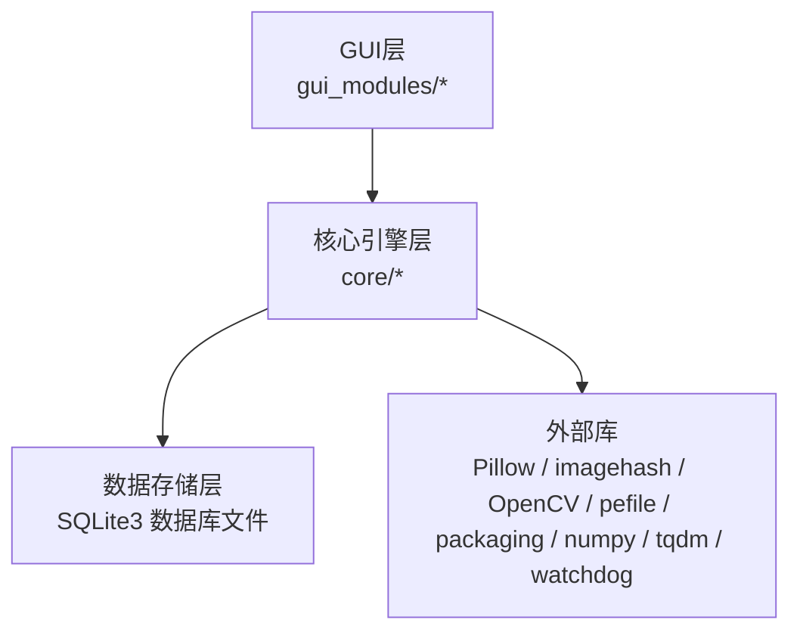
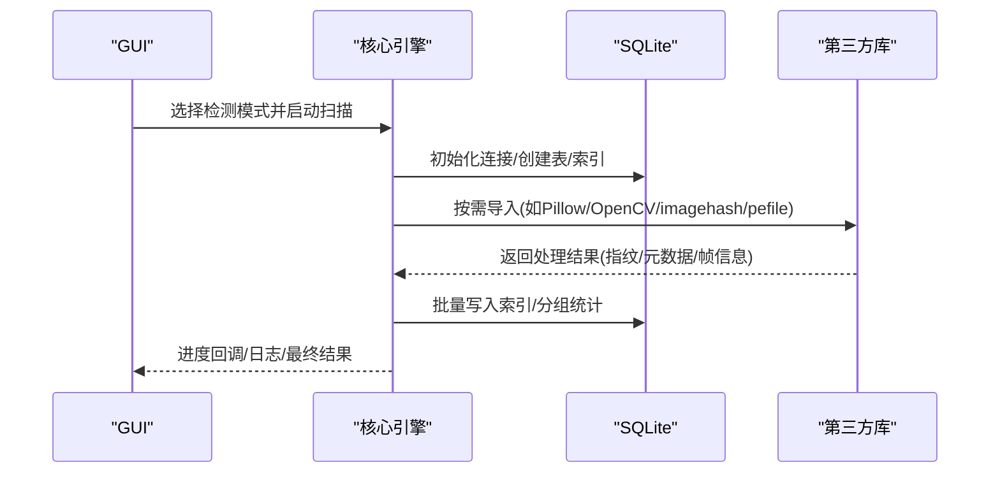
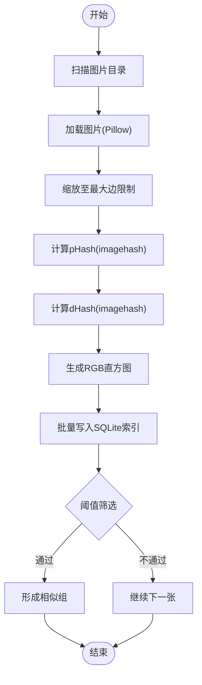
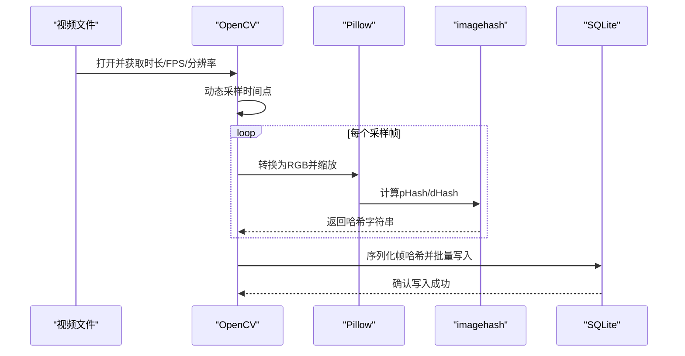
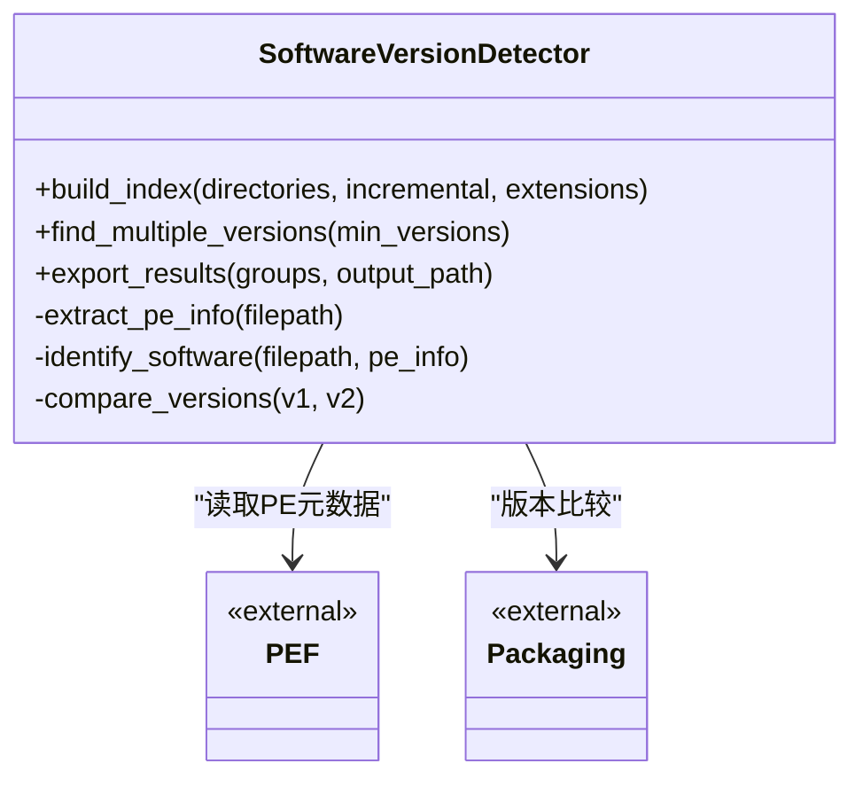
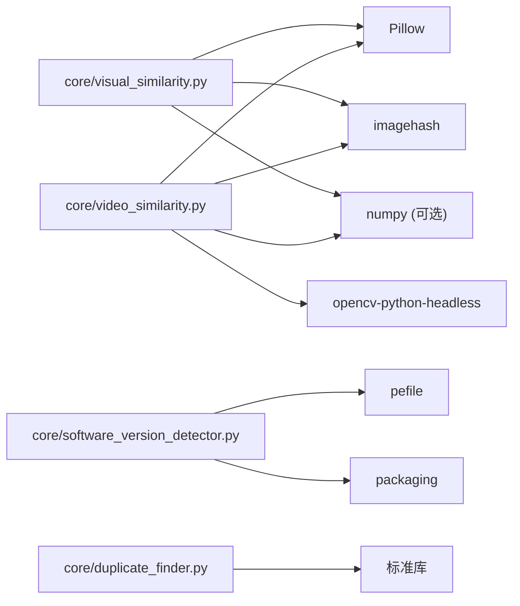

# 第三方库集成

<cite>
**本文引用的文件**
- [requirements.txt](file://requirements.txt)
- [README.md](file://README.md)
- [QUICK_START.md](file://QUICK_START.md)
- [core/duplicate_finder.py](file://core/duplicate_finder.py)
- [core/visual_similarity.py](file://core/visual_similarity.py)
- [core/video_similarity.py](file://core/video_similarity.py)
- [core/software_version_detector.py](file://core/software_version_detector.py)
</cite>

## 目录
1. [简介](#简介)
2. [项目结构](#项目结构)
3. [核心组件](#核心组件)
4. [架构总览](#架构总览)
5. [详细组件分析](#详细组件分析)
6. [依赖关系分析](#依赖关系分析)
7. [性能考量](#性能考量)
8. [故障排查指南](#故障排查指南)
9. [结论](#结论)
10. [附录](#附录)

## 简介
本指南面向需要在“文件重复校验”项目中集成和使用第三方库的开发者与运维人员，覆盖依赖管理、版本兼容与冲突解决、新库集成流程（需求评估→实现→测试→部署）、以及OpenCV、Pillow、imagehash、pefile等库的最佳实践。同时包含安全性评估、性能影响分析与替代方案建议，并提供常见问题与调试技巧。

## 项目结构
本项目采用分层模块化设计：
- core：核心引擎模块，分别实现精确匹配、图片相似度、视频相似度、多版本软件检测
- gui_modules：图形界面模块，调用core中的引擎完成扫描与展示
- docs：文档与规范
- 根目录：入口脚本、构建脚本、依赖清单与说明文档

**图表来源**
- [README.md:338-401](file://README.md#L338-L401)

**章节来源**
- [README.md:338-401](file://README.md#L338-L401)

## 核心组件
- 精确匹配引擎：基于MD5三级过滤（文件大小→部分哈希→完整哈希），使用多线程与SQLite索引优化大规模数据扫描
- 图片相似度引擎：基于pHash、dHash与颜色直方图的三级过滤策略，支持快速模式与精确模式
- 视频相似度引擎：关键帧序列匹配+滑动窗口对角线分析，动态采样帧数，抗剪辑/转码/调色
- 多版本软件检测：PE元数据提取+智能识别+语义化版本比较，支持EXE/DLL/MSI/JAR/PYD等格式

**章节来源**
- [core/duplicate_finder.py:25-73](file://core/duplicate_finder.py#L25-L73)
- [core/visual_similarity.py:94-121](file://core/visual_similarity.py#L94-L121)
- [core/video_similarity.py:174-203](file://core/video_similarity.py#L174-L203)
- [core/software_version_detector.py:30-95](file://core/software_version_detector.py#L30-L95)

## 架构总览
系统由三层构成：GUI层负责交互与结果展示；核心引擎层封装算法与数据处理；数据存储层通过SQLite进行索引与查询。外部库在核心引擎中按需加载，避免未安装时崩溃。

**图表来源**
- [core/visual_similarity.py:253-311](file://core/visual_similarity.py#L253-L311)
- [core/video_similarity.py:310-367](file://core/video_similarity.py#L310-L367)
- [core/software_version_detector.py:391-481](file://core/software_version_detector.py#L391-L481)

## 详细组件分析

### 依赖管理与版本兼容性
- 统一依赖声明位于requirements.txt，按功能域划分基础依赖、可选依赖与特定功能依赖
- 版本下限约束确保API稳定，例如Pillow>=9.0.0、opencv-python-headless>=4.5.0、imagehash>=4.3.0、pefile>=2021.9.3、packaging>=21.0
- 可选依赖（numpy、tqdm）用于加速与体验增强，不影响核心功能运行
- 监控依赖watchdog用于文件实时监控，仅在启用该功能时安装

最佳实践
- 使用虚拟环境隔离依赖，避免全局污染
- 固定主版本号或最小版本，必要时锁定到具体版本以规避破坏性更新
- 对可选依赖采用延迟导入与异常捕获，保证主程序在无依赖环境下仍可运行

**章节来源**
- [requirements.txt:1-32](file://requirements.txt#L1-L32)
- [README.md:202-248](file://README.md#L202-L248)

### 图片相似度集成（Pillow + imagehash + numpy）
- Pillow用于图像读取、格式转换与缩放；imagehash提供pHash/dHash计算；numpy用于数值计算（可选）
- 多进程并行计算指纹，批量化写入数据库，减少IO开销
- 支持快速模式（仅pHash）与精确模式（pHash+dHash+直方图）

**图表来源**
- [core/visual_similarity.py:21-91](file://core/visual_similarity.py#L21-L91)
- [core/visual_similarity.py:253-311](file://core/visual_similarity.py#L253-L311)
- [core/visual_similarity.py:410-513](file://core/visual_similarity.py#L410-L513)

**章节来源**
- [core/visual_similarity.py:21-91](file://core/visual_similarity.py#L21-L91)
- [core/visual_similarity.py:253-311](file://core/visual_similarity.py#L253-L311)
- [core/visual_similarity.py:410-513](file://core/visual_similarity.py#L410-L513)

### 视频相似度集成（OpenCV + Pillow + imagehash + numpy）
- OpenCV用于视频解码与帧提取；Pillow用于帧格式转换；imagehash用于每帧pHash/dHash；numpy用于数值计算（可选）
- 动态采样帧数：根据时长自适应选择5/10/20/最多50帧
- 关键帧序列匹配：构建匹配矩阵，寻找对角线连续片段，结合时间覆盖率计算相似度

**图表来源**
- [core/video_similarity.py:21-151](file://core/video_similarity.py#L21-L151)
- [core/video_similarity.py:310-367](file://core/video_similarity.py#L310-L367)
- [core/video_similarity.py:498-545](file://core/video_similarity.py#L498-L545)

**章节来源**
- [core/video_similarity.py:21-151](file://core/video_similarity.py#L21-L151)
- [core/video_similarity.py:310-367](file://core/video_similarity.py#L310-L367)
- [core/video_similarity.py:498-545](file://core/video_similarity.py#L498-L545)

### 多版本软件检测集成（pefile + packaging）
- pefile用于提取PE文件的元数据（公司名称、产品名称、版本信息等）
- packaging用于语义化版本比较，支持标准版本排序与unknown降级处理
- 三级识别策略：PE信息优先，其次文件名模式匹配，最后路径版本提取

**图表来源**
- [core/software_version_detector.py:178-244](file://core/software_version_detector.py#L178-L244)
- [core/software_version_detector.py:246-316](file://core/software_version_detector.py#L246-L316)
- [core/software_version_detector.py:318-354](file://core/software_version_detector.py#L318-L354)
- [core/software_version_detector.py:391-481](file://core/software_version_detector.py#L391-L481)

**章节来源**
- [core/software_version_detector.py:178-244](file://core/software_version_detector.py#L178-L244)
- [core/software_version_detector.py:246-316](file://core/software_version_detector.py#L246-L316)
- [core/software_version_detector.py:318-354](file://core/software_version_detector.py#L318-L354)
- [core/software_version_detector.py:391-481](file://core/software_version_detector.py#L391-L481)

### 精确匹配引擎（无第三方库依赖）
- 纯Python标准库实现，无需额外依赖
- 多级过滤：文件大小→前1MB部分哈希→完整MD5哈希
- 多线程并发与SQLite WAL模式提升吞吐与并发能力

**章节来源**
- [core/duplicate_finder.py:25-73](file://core/duplicate_finder.py#L25-L73)
- [core/duplicate_finder.py:324-387](file://core/duplicate_finder.py#L324-L387)
- [core/duplicate_finder.py:436-504](file://core/duplicate_finder.py#L436-L504)
- [core/duplicate_finder.py:506-595](file://core/duplicate_finder.py#L506-L595)

## 依赖关系分析
- 图片相似度：Pillow、imagehash、numpy（可选）
- 视频相似度：opencv-python-headless、Pillow、imagehash、numpy（可选）
- 多版本软件检测：pefile、packaging
- 实时监控（可选）：watchdog
- 进度条美化（可选）：tqdm

**图表来源**
- [requirements.txt:10-31](file://requirements.txt#L10-L31)
- [core/visual_similarity.py:21-91](file://core/visual_similarity.py#L21-L91)
- [core/video_similarity.py:21-151](file://core/video_similarity.py#L21-L151)
- [core/software_version_detector.py:17-27](file://core/software_version_detector.py#L17-L27)

**章节来源**
- [requirements.txt:10-31](file://requirements.txt#L10-L31)

## 性能考量
- 数据库优化：WAL模式、同步频率降低、缓存与内存映射配置，显著提升并发写入与查询性能
- 并行计算：图片/视频指纹计算使用ProcessPoolExecutor，充分利用多核CPU；线程池大小根据CPU核心数自动调整
- 批处理写入：批量插入减少事务次数，降低IO压力
- 懒加载与缓存：预览缩略图异步加载与缓存，避免界面卡顿
- 磁盘类型自适应：HDD限制线程数避免寻道风暴，SSD/NVMe可更高并发

**章节来源**
- [core/duplicate_finder.py:133-175](file://core/duplicate_finder.py#L133-L175)
- [core/duplicate_finder.py:75-131](file://core/duplicate_finder.py#L75-L131)
- [core/visual_similarity.py:123-169](file://core/visual_similarity.py#L123-L169)
- [core/video_similarity.py:205-239](file://core/video_similarity.py#L205-L239)

## 故障排查指南
常见集成问题与解决方案
- 缺少依赖导致导入失败
  - 现象：ImportError提示缺少Pillow/OpenCV/imagehash/pefile/packaging
  - 解决：执行pip install -r requirements.txt；对于可选依赖，代码已做延迟导入与异常捕获
- 视频无法打开或解码失败
  - 现象：OpenCV无法打开视频文件或返回空帧
  - 解决：检查视频编码是否受支持；确保安装opencv-python-headless及必要编解码器；查看错误日志定位具体原因
- PE元数据为空或解析失败
  - 现象：pefile解析抛出异常或元数据为空
  - 解决：确认文件为有效PE格式；检查权限；查看日志中的异常堆栈
- 数据库锁或写入失败
  - 现象：database is locked或超时
  - 解决：增大busy_timeout；减少并发写入；确保正确关闭连接；使用WAL模式
- 图片/视频处理内存溢出
  - 现象：超大图片/视频导致内存不足
  - 解决：限制最大边长缩放；减少并行进程数；分批处理

调试技巧
- 启用详细日志：通过log_callback输出每一步处理状态与异常堆栈
- 逐步验证：先单独测试第三方库导入与基本功能，再集成到引擎
- 最小复现：构造小样本数据集验证算法与阈值效果
- 性能剖析：记录各阶段耗时，定位瓶颈（IO/CPU/内存）

**章节来源**
- [core/video_similarity.py:40-60](file://core/video_similarity.py#L40-L60)
- [core/software_version_detector.py:17-27](file://core/software_version_detector.py#L17-L27)
- [core/duplicate_finder.py:190-201](file://core/duplicate_finder.py#L190-L201)

## 结论
本项目通过分层架构与模块化设计，将第三方库按需集成到对应引擎中，既保证了功能的完整性，又避免了不必要的依赖耦合。遵循本指南的依赖管理、版本控制、安全评估与性能优化实践，可高效、稳定地扩展与升级第三方库，满足TB级数据的处理需求。

## 附录

### 新库集成流程（从需求到生产）
- 需求评估
  - 明确功能目标与输入输出
  - 评估现有库是否满足需求，考虑性能、体积、许可证与社区活跃度
- 选型与验证
  - 对比替代方案（如OpenCV vs FFmpeg绑定；Pillow vs OpenCV图像处理）
  - 在小数据集上验证准确性与稳定性
- 依赖管理
  - 在requirements.txt中添加依赖与最低版本
  - 对可选依赖采用延迟导入与异常捕获
- 代码实现
  - 在对应引擎中引入新库，封装为独立函数/类
  - 增加日志与错误处理，便于追踪问题
- 测试验证
  - 单元测试：覆盖边界条件与异常路径
  - 集成测试：端到端流程验证，包括数据库写入与结果导出
  - 性能测试：基准测试与资源占用评估
- 生产部署
  - 构建打包：确保所有依赖被正确包含
  - 环境检查：启动时校验依赖可用性，给出友好提示
  - 监控与回滚：上线后监控错误率与性能指标，准备回滚方案

### 安全性评估
- 依赖来源可信：仅从官方源安装，定期扫描漏洞
- 最小权限原则：运行时避免不必要的高权限操作
- 输入校验：对用户提供的路径与参数进行合法性检查
- 资源限制：限制内存与CPU使用，防止恶意输入导致资源耗尽
- 许可证合规：确认第三方库许可证与项目兼容

### 性能影响分析与替代方案
- Pillow vs OpenCV图像处理
  - Pillow轻量易用，适合常规图像处理；OpenCV功能强大但体积较大
  - 若仅需基础读写与缩放，优先Pillow；需要复杂视觉算法则选OpenCV
- imagehash替代方案
  - 当前使用imagehash提供pHash/dHash；如需更精细控制，可考虑自定义特征提取
- pefile替代方案
  - 当前使用pefile解析PE元数据；若需跨平台或更高性能，可考虑其他PE解析库或系统API
- numpy替代方案
  - 当前numpy为可选依赖；若需避免额外依赖，可使用纯Python实现数值计算（性能较低）

### 常见集成问题的解决方案与调试技巧
- 依赖冲突
  - 使用虚拟环境隔离；锁定主版本；必要时使用conda管理复杂依赖
- 平台差异
  - Windows/Linux/macOS下二进制库行为可能不同，需分别测试
- 日志与诊断
  - 集中日志输出，记录关键步骤与异常堆栈
  - 使用性能分析工具（如cProfile）定位热点
- 回滚策略
  - 保持向后兼容；灰度发布；快速回滚到上一稳定版本

[无章节来源，因为本节提供通用指导]