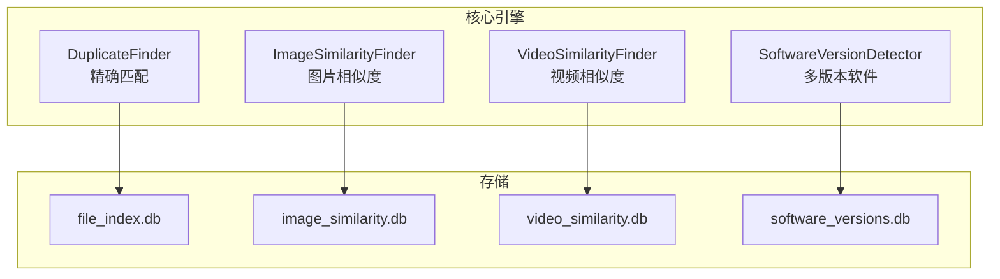
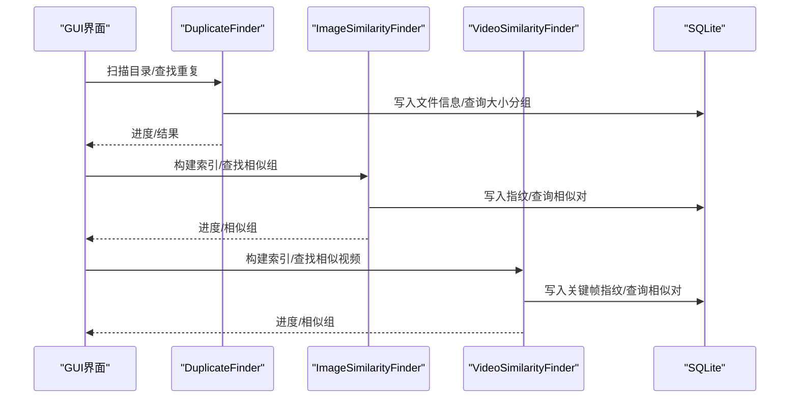
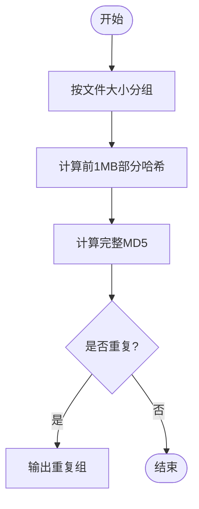
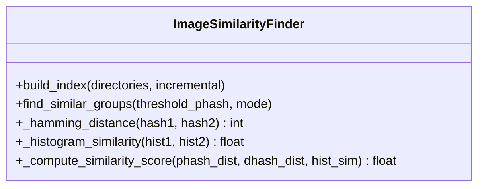
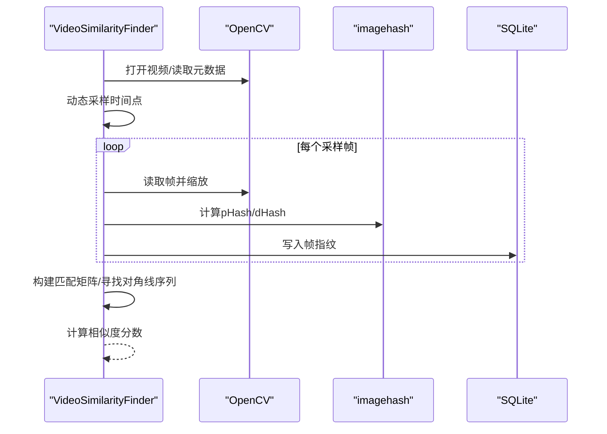
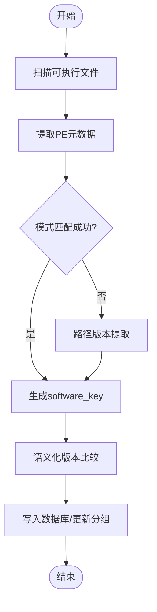
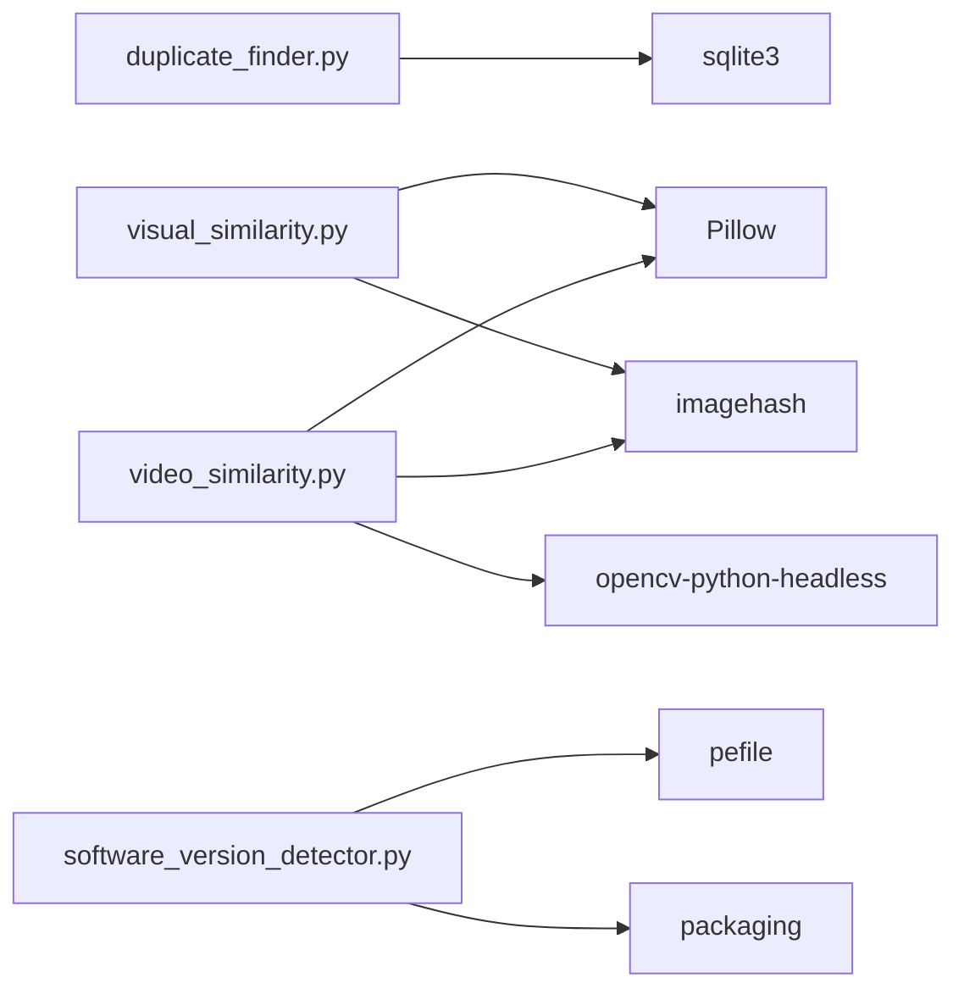

# 算法扩展

<cite>
**本文引用的文件**
- [core/duplicate_finder.py](file://core/duplicate_finder.py)
- [core/visual_similarity.py](file://core/visual_similarity.py)
- [core/video_similarity.py](file://core/video_similarity.py)
- [core/software_version_detector.py](file://core/software_version_detector.py)
- [README.md](file://README.md)
- [docs/IMAGE_SIMILARITY_SPEC.md](file://docs/IMAGE_SIMILARITY_SPEC.md)
- [requirements.txt](file://requirements.txt)
</cite>

## 目录
1. [简介](#简介)
2. [项目结构](#项目结构)
3. [核心组件](#核心组件)
4. [架构总览](#架构总览)
5. [详细组件分析](#详细组件分析)
6. [依赖关系分析](#依赖关系分析)
7. [性能与复杂度](#性能与复杂度)
8. [测试与基准](#测试与基准)
9. [故障排查](#故障排查)
10. [结论](#结论)
11. [附录：扩展模板与最佳实践](#附录扩展模板与最佳实践)

## 简介
本指南面向希望扩展和优化现有检测算法的开发者，覆盖哈希算法改进、相似度计算优化、性能调优方法；提供新算法实现模板、测试框架与性能基准方法；并给出算法复杂度分析、内存使用优化和并行处理策略。同时涵盖图像处理、视频分析与软件版本比较三类场景的具体扩展方法与调试技巧。

## 项目结构
仓库采用“核心引擎 + GUI界面”的分层组织方式：
- core：包含精确匹配、图片相似度、视频相似度、多版本软件检测四大引擎
- gui_modules：对应功能的GUI标签页与交互逻辑
- docs：功能规格与说明文档
- 根目录：入口脚本、打包脚本、依赖清单等

图表来源
- [core/duplicate_finder.py:133-175](file://core/duplicate_finder.py#L133-L175)
- [core/visual_similarity.py:123-169](file://core/visual_similarity.py#L123-L169)
- [core/video_similarity.py:205-239](file://core/video_similarity.py#L205-L239)
- [core/software_version_detector.py:109-159](file://core/software_version_detector.py#L109-L159)

章节来源
- [README.md:338-401](file://README.md#L338-L401)

## 核心组件
- 精确匹配（MD5三级过滤）：基于文件大小→部分哈希（前1MB）→完整哈希的多级筛选，支持多线程与SQLite索引优化
- 图片相似度（pHash+dHash+直方图）：三级过滤与综合评分，支持快速/精确模式与增量扫描
- 视频相似度（关键帧序列匹配）：动态采样关键帧、逐帧哈希、对角线序列匹配与时间覆盖率评估
- 多版本软件检测（PE元数据+模式匹配+路径版本提取）：识别同一软件的多个版本并进行语义化版本比较

章节来源
- [core/duplicate_finder.py:25-75](file://core/duplicate_finder.py#L25-L75)
- [core/visual_similarity.py:94-121](file://core/visual_similarity.py#L94-L121)
- [core/video_similarity.py:174-203](file://core/video_similarity.py#L174-L203)
- [core/software_version_detector.py:30-96](file://core/software_version_detector.py#L30-L96)

## 架构总览
系统采用三层架构：GUI界面层 → 核心引擎层 → 数据存储层（SQLite）。各引擎通过独立数据库隔离索引，便于增量更新与性能优化。

图表来源
- [core/duplicate_finder.py:208-387](file://core/duplicate_finder.py#L208-L387)
- [core/visual_similarity.py:253-311](file://core/visual_similarity.py#L253-L311)
- [core/video_similarity.py:310-367](file://core/video_similarity.py#L310-L367)

## 详细组件分析

### 精确匹配（DuplicateFinder）
- 多级哈希策略：先按文件大小分组，再计算前1MB的部分哈希，最后计算完整MD5确认重复
- 并行与I/O优化：自动线程数选择（HDD/SSD自适应）、批量插入、WAL模式、忙等待超时
- 可扩展点：
  - 替换或增强哈希函数（如SHA-256、BLAKE2），权衡安全性与速度
  - 调整部分哈希长度（当前为1MB），以平衡误判率与IO开销
  - 引入分桶策略（如按目录/后缀）减少跨组比对
  - 增加断点续扫与增量校验（基于modified_time与partial_hash）

图表来源
- [core/duplicate_finder.py:324-387](file://core/duplicate_finder.py#L324-L387)

章节来源
- [core/duplicate_finder.py:75-131](file://core/duplicate_finder.py#L75-L131)
- [core/duplicate_finder.py:436-504](file://core/duplicate_finder.py#L436-L504)
- [core/duplicate_finder.py:506-595](file://core/duplicate_finder.py#L506-L595)

### 图片相似度（ImageSimilarityFinder）
- 三级过滤：pHash快速筛选 → dHash二次验证 → 颜色直方图余弦相似度精确比对
- 综合评分：加权平均（pHash权重最高），支持快速/精确模式
- 可扩展点：
  - 更换或组合更多感知哈希（如wHash、aHash）提升抗压缩能力
  - 引入局部特征（SIFT/ORB）进行细粒度匹配，提高复杂编辑场景准确率
  - 优化直方图维度（如分通道或量化bin数量）平衡精度与速度
  - 引入聚类（并查集/层次聚类）替代两两比对，降低O(n^2)成本

图表来源
- [core/visual_similarity.py:241-251](file://core/visual_similarity.py#L241-L251)
- [core/visual_similarity.py:334-409](file://core/visual_similarity.py#L334-L409)
- [core/visual_similarity.py:410-513](file://core/visual_similarity.py#L410-L513)

章节来源
- [core/visual_similarity.py:21-91](file://core/visual_similarity.py#L21-L91)
- [core/visual_similarity.py:253-311](file://core/visual_similarity.py#L253-L311)
- [docs/IMAGE_SIMILARITY_SPEC.md:24-138](file://docs/IMAGE_SIMILARITY_SPEC.md#L24-L138)

### 视频相似度（VideoSimilarityFinder）
- 关键帧序列匹配：根据时长动态采样关键帧，计算每帧pHash/dHash，构建匹配矩阵并寻找对角线序列
- 相似度评估：Jaccard相似度与时间覆盖率加权，阈值判定相似组
- 可扩展点：
  - 引入时序对齐（DTW）提升剪辑/变速鲁棒性
  - 加入音频指纹（如Chromaprint）进行多模态融合
  - 优化匹配矩阵稀疏化与剪枝策略，降低复杂度
  - 支持GPU加速（OpenCV/CUDA）提升解码与特征提取速度

图表来源
- [core/video_similarity.py:21-151](file://core/video_similarity.py#L21-L151)
- [core/video_similarity.py:498-545](file://core/video_similarity.py#L498-L545)
- [core/video_similarity.py:547-652](file://core/video_similarity.py#L547-L652)

章节来源
- [core/video_similarity.py:154-172](file://core/video_similarity.py#L154-L172)
- [core/video_similarity.py:310-367](file://core/video_similarity.py#L310-L367)

### 多版本软件检测（SoftwareVersionDetector）
- 识别流程：PE元数据提取 → 文件名模式匹配 → 路径版本提取 → 语义化版本比较
- 数据库设计：软件索引表与分组统计表，支持增量扫描与统计聚合
- 可扩展点：
  - 扩展软件模式库（新增更多应用正则）
  - 引入包管理器解析（pip/npm/maven）获取更准确版本信息
  - 结合数字签名与证书信息增强可信度
  - 支持非PE格式（如ELF/Mach-O）跨平台检测

图表来源
- [core/software_version_detector.py:178-316](file://core/software_version_detector.py#L178-L316)
- [core/software_version_detector.py:391-481](file://core/software_version_detector.py#L391-L481)
- [core/software_version_detector.py:483-538](file://core/software_version_detector.py#L483-L538)

章节来源
- [core/software_version_detector.py:30-96](file://core/software_version_detector.py#L30-L96)
- [core/software_version_detector.py:540-604](file://core/software_version_detector.py#L540-L604)

## 依赖关系分析
- 核心引擎相互独立，通过各自SQLite数据库解耦
- 外部依赖：
  - Pillow、imagehash：图片指纹与预处理
  - opencv-python-headless：视频解码与帧提取
  - pefile、packaging：PE元数据与版本比较
- 可选优化：numpy、tqdm用于数值加速与进度美化

图表来源
- [requirements.txt:10-23](file://requirements.txt#L10-L23)

章节来源
- [requirements.txt:1-31](file://requirements.txt#L1-L31)

## 性能与复杂度
- 精确匹配
  - 时间复杂度：O(N log N)（文件大小分组）+ O(K·M)（K为候选组大小，M为块读取次数）
  - 空间复杂度：O(N)（数据库记录）+ O(B)（批处理缓冲）
  - 优化建议：增大chunk_size、合理设置max_workers、使用WAL与索引
- 图片相似度
  - 时间复杂度：指纹计算O(N)，相似度比对O(N^2)（可通过聚类/分桶优化）
  - 空间复杂度：O(N)（指纹与直方图）
  - 优化建议：快速模式仅pHash、增量扫描、缓存缩略图
- 视频相似度
  - 时间复杂度：关键帧提取O(F)，匹配矩阵O(F1·F2)，对角线搜索O(F1+F2)
  - 空间复杂度：O(F1+F2)（帧指纹）+ O(F1·F2)（匹配矩阵，可稀疏化）
  - 优化建议：稀疏矩阵、GPU解码、减少帧数或自适应采样
- 多版本软件检测
  - 时间复杂度：扫描O(N)，PE解析O(1~F)（取决于文件大小），版本比较O(V log V)
  - 空间复杂度：O(N)（索引）+ O(V)（分组统计）
  - 优化建议：LRU缓存PE信息、增量扫描、并行解析

章节来源
- [core/duplicate_finder.py:75-131](file://core/duplicate_finder.py#L75-L131)
- [core/visual_similarity.py:410-513](file://core/visual_similarity.py#L410-L513)
- [core/video_similarity.py:498-545](file://core/video_similarity.py#L498-L545)
- [core/software_version_detector.py:391-481](file://core/software_version_detector.py#L391-L481)

## 测试与基准
- 单元测试建议
  - 哈希函数正确性：相同输入产生相同哈希，不同输入高概率不同
  - 相似度阈值敏感性：在不同阈值下评估召回率与精确率
  - 边界条件：空目录、损坏文件、超大文件、权限不足
- 集成测试建议
  - 端到端流程：扫描→索引→比对→导出结果
  - 并发压力：多线程/多进程下的锁与竞态条件验证
- 性能基准方法
  - 指标：吞吐量（文件/秒）、延迟（单次任务耗时）、内存峰值、CPU利用率
  - 数据集：构造不同规模与分布的数据集（小/中/大文件、不同格式）
  - 工具：timeit、cProfile、memory_profiler、psutil
  - 报告：对比基线与优化后的指标变化，定位瓶颈

章节来源
- [README.md:470-518](file://README.md#L470-L518)
- [docs/IMAGE_SIMILARITY_SPEC.md:652-676](file://docs/IMAGE_SIMILARITY_SPEC.md#L652-L676)

## 故障排查
- 常见问题
  - 数据库锁定：检查busy_timeout与事务提交频率
  - 内存溢出：限制图片加载尺寸、减小缓存、分批处理
  - 扫描速度慢：硬件升级（SSD）、调整线程数、增量扫描
  - 相似误报/漏报：调整阈值、切换模式（快速/精确）
- 调试技巧
  - 日志分级：INFO/DEBUG/ERROR，记录关键步骤与异常堆栈
  - 断点与单步：在关键函数（哈希计算、相似度评分）处断点
  - 可视化：输出匹配矩阵、相似度分布直方图

章节来源
- [core/duplicate_finder.py:190-201](file://core/duplicate_finder.py#L190-L201)
- [core/visual_similarity.py:83-91](file://core/visual_similarity.py#L83-L91)
- [core/video_similarity.py:146-151](file://core/video_similarity.py#L146-L151)
- [docs/IMAGE_SIMILARITY_SPEC.md:679-725](file://docs/IMAGE_SIMILARITY_SPEC.md#L679-L725)

## 结论
本项目提供了完善的多类型文件检测引擎，具备高性能、高精度与可扩展性。通过合理的算法选择、并行策略与数据库优化，能够高效处理TB级数据。建议在扩展时遵循模块化设计、保持接口稳定，并通过测试与基准持续验证效果。

## 附录：扩展模板与最佳实践

### 新算法实现模板（以图片相似度为例）
- 目标：实现新的感知哈希或相似度度量，并集成到现有流程
- 步骤：
  1. 定义新哈希函数（如wHash），返回固定长度二进制串
  2. 在指纹计算流程中调用新哈希，并存储到数据库
  3. 在相似度计算中引入新度量，调整权重与阈值
  4. 添加单元测试与基准测试，验证准确性与性能
  5. 提供GUI参数（阈值、模式）以便用户调节
- 参考位置
  - 指纹计算：[core/visual_similarity.py:21-91](file://core/visual_similarity.py#L21-L91)
  - 相似度评分：[core/visual_similarity.py:379-409](file://core/visual_similarity.py#L379-L409)
  - 数据库结构：[core/visual_similarity.py:123-169](file://core/visual_similarity.py#L123-L169)

### 测试框架与基准
- 单元测试：针对哈希函数、相似度计算、数据库操作编写用例
- 集成测试：模拟真实扫描流程，验证端到端正确性
- 基准测试：使用标准数据集，记录吞吐、延迟、内存与CPU指标
- 参考位置
  - 性能基准示例：[README.md:470-518](file://README.md#L470-L518)
  - 图片相似度基准：[docs/IMAGE_SIMILARITY_SPEC.md:652-676](file://docs/IMAGE_SIMILARITY_SPEC.md#L652-L676)

### 并行处理策略
- 线程池：适用于I/O密集型任务（文件读取、哈希计算）
- 进程池：适用于CPU密集型任务（图像/视频特征提取）
- 自适应工作线程数：根据CPU核心与磁盘类型动态调整
- 参考位置
  - 线程池使用：[core/duplicate_finder.py:483-504](file://core/duplicate_finder.py#L483-L504)
  - 进程池使用：[core/visual_similarity.py:280-311](file://core/visual_similarity.py#L280-L311)
  - 自适应线程数：[core/duplicate_finder.py:75-131](file://core/duplicate_finder.py#L75-L131)

### 内存使用优化
- 流式写入：避免一次性构建大型数据结构
- 分批处理：控制批大小，减少内存峰值
- 缓存策略：LRU缓存缩略图与PE信息，限制最大缓存大小
- 参考位置
  - 流式写入JSON：[core/duplicate_finder.py:597-658](file://core/duplicate_finder.py#L597-L658)
  - LRU缓存PE信息：[core/software_version_detector.py:88-96](file://core/software_version_detector.py#L88-L96)
  - 缩略图缓存：[docs/IMAGE_SIMILARITY_SPEC.md:589-613](file://docs/IMAGE_SIMILARITY_SPEC.md#L589-L613)

### 调试技巧
- 日志与错误追踪：记录关键步骤与异常堆栈
- 可视化匹配矩阵：辅助诊断视频相似度问题
- 阈值敏感性分析：绘制召回率-精确率曲线，选择合适阈值
- 参考位置
  - 错误日志：[core/visual_similarity.py:83-91](file://core/visual_similarity.py#L83-L91)
  - 匹配矩阵与序列：[core/video_similarity.py:406-471](file://core/video_similarity.py#L406-L471)
  - 阈值配置：[docs/IMAGE_SIMILARITY_SPEC.md:133-158](file://docs/IMAGE_SIMILARITY_SPEC.md#L133-L158)