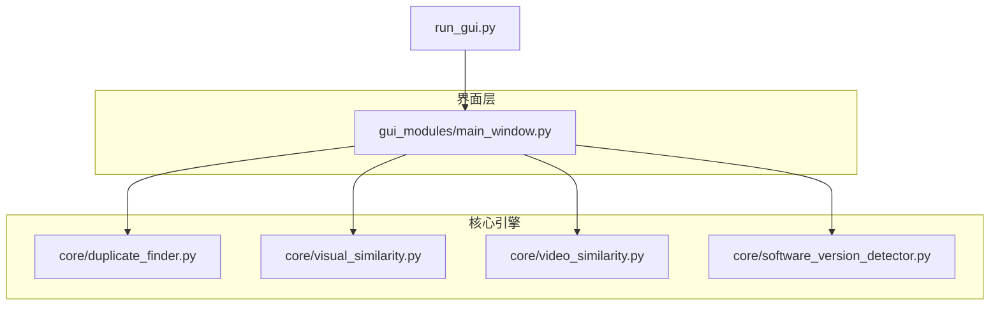
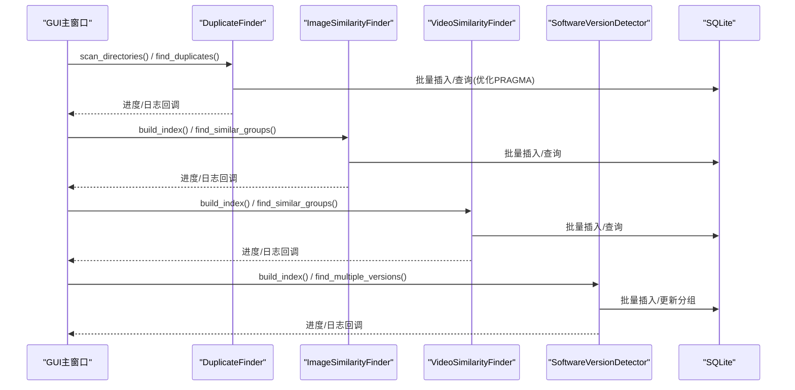
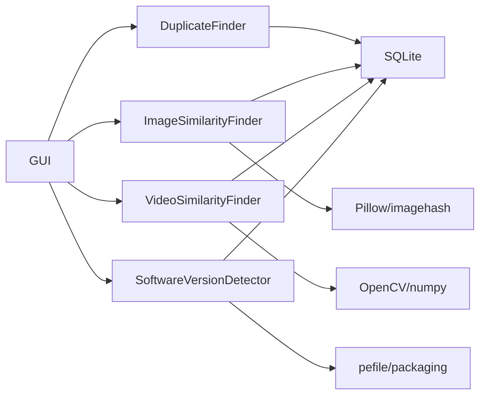
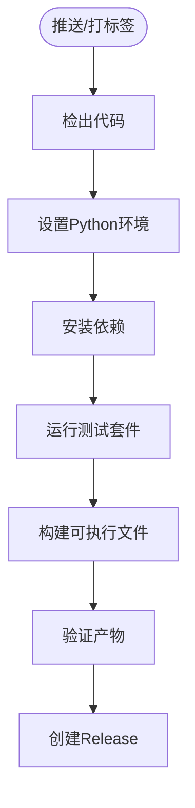

# 测试策略

<cite>
**本文引用的文件**
- [README.md](file://README.md)
- [requirements.txt](file://requirements.txt)
- [run_gui.py](file://run_gui.py)
- [core/duplicate_finder.py](file://core/duplicate_finder.py)
- [core/visual_similarity.py](file://core/visual_similarity.py)
- [core/video_similarity.py](file://core/video_similarity.py)
- [core/software_version_detector.py](file://core/software_version_detector.py)
- [gui_modules/main_window.py](file://gui_modules/main_window.py)
- [.github/workflows/build.yml](file:.github/workflows/build.yml)
- [.github/workflows/build-and-release.yml](file:.github/workflows/build-and-release.yml)
</cite>

## 目录
1. [简介](#简介)
2. [项目结构](#项目结构)
3. [核心组件](#核心组件)
4. [架构总览](#架构总览)
5. [详细组件分析](#详细组件分析)
6. [依赖分析](#依赖分析)
7. [性能考虑](#性能考虑)
8. [故障排查指南](#故障排查指南)
9. [结论](#结论)
10. [附录](#附录)

## 简介
本测试策略面向“文件重复校验工具”的单元测试、集成测试与端到端测试，覆盖精确匹配、图片相似度、视频相似度与多版本软件检测四大功能。目标包括：
- 明确各层测试的设计原则与边界条件
- 提供可执行的测试用例编写指南、模拟对象使用、测试数据准备与环境配置
- 制定性能测试、并发测试与边界条件测试方法
- 结合现有CI流水线，完善自动化测试流程

## 项目结构
本项目采用分层模块化设计：
- core：核心算法与引擎（重复文件、图片相似度、视频相似度、软件版本检测）
- gui_modules：图形界面模块（主窗口与各标签页）
- 根入口：run_gui.py 启动GUI
- CI：GitHub Actions 构建与发布

图表来源
- [run_gui.py:13-37](file://run_gui.py#L13-L37)
- [gui_modules/main_window.py:18-85](file://gui_modules/main_window.py#L18-L85)
- [core/duplicate_finder.py:25-73](file://core/duplicate_finder.py#L25-L73)
- [core/visual_similarity.py:94-121](file://core/visual_similarity.py#L94-L121)
- [core/video_similarity.py:174-203](file://core/video_similarity.py#L174-L203)
- [core/software_version_detector.py:30-95](file://core/software_version_detector.py#L30-L95)

章节来源
- [README.md:338-372](file://README.md#L338-L372)
- [run_gui.py:13-37](file://run_gui.py#L13-L37)
- [gui_modules/main_window.py:18-85](file://gui_modules/main_window.py#L18-L85)

## 核心组件
- DuplicateFinder：基于文件大小分组、部分哈希（前1MB）、完整MD5的三级过滤，多线程并行计算，SQLite索引与批量写入，支持进度回调与停止标志。
- ImageSimilarityFinder：pHash + dHash + 颜色直方图三级过滤，多进程指纹计算，数据库索引与相似组查找。
- VideoSimilarityFinder：关键帧序列匹配，滑动窗口与对角线序列分析，多进程提取关键帧，相似度评分与相似组聚合。
- SoftwareVersionDetector：PE元数据提取、模式匹配与路径版本号识别，语义化版本比较，增量扫描与分组统计。

章节来源
- [core/duplicate_finder.py:25-73](file://core/duplicate_finder.py#L25-L73)
- [core/visual_similarity.py:94-121](file://core/visual_similarity.py#L94-L121)
- [core/video_similarity.py:174-203](file://core/video_similarity.py#L174-L203)
- [core/software_version_detector.py:30-95](file://core/software_version_detector.py#L30-L95)

## 架构总览
系统由GUI驱动调用核心引擎，核心引擎通过多线程/多进程与SQLite交互，输出结果并支持导出。

图表来源
- [gui_modules/main_window.py:165-195](file://gui_modules/main_window.py#L165-L195)
- [core/duplicate_finder.py:208-387](file://core/duplicate_finder.py#L208-L387)
- [core/visual_similarity.py:253-311](file://core/visual_similarity.py#L253-L311)
- [core/video_similarity.py:310-367](file://core/video_similarity.py#L310-L367)
- [core/software_version_detector.py:391-481](file://core/software_version_detector.py#L391-L481)

## 详细组件分析

### 单元测试策略（按组件）
- 通用原则
  - 隔离外部依赖：文件系统、网络、GUI、数据库连接均通过mock或临时资源替代
  - 输入验证：覆盖空输入、非法路径、异常文件类型、权限不足等边界
  - 确定性：固定随机种子或使用确定性输入；对时间相关逻辑使用固定时间源
  - 小步快跑：每个函数/方法一个测试类，断言清晰且独立

- DuplicateFinder
  - 关注点：大小分组、部分哈希、完整哈希、线程安全、进度回调、停止标志、批量写入
  - 建议用例
    - 空目录/无文件：应返回空结果且不抛异常
    - 单文件/少量文件：正确统计与分组
    - 大文件读取：分块读取不丢数据；IO错误跳过并记录
    - 多线程竞态：并发下进度计数一致；停止标志能中断
    - 数据库：WAL/PRAGMA生效；批量插入幂等
  - 模拟对象
    - 使用unittest.mock替换open/file操作，构造不同大小/内容片段
    - 使用临时SQLite内存库或临时文件，避免污染真实数据库
    - 使用threading.Event模拟stop_flag

- ImageSimilarityFinder
  - 关注点：指纹计算、汉明距离、直方图相似度、阈值与模式、多进程
  - 建议用例
    - 支持格式集合：仅处理允许扩展名
    - 超大图片缩放：尺寸限制与内存保护
    - pHash/dHash/直方图：边界值与极端图像（纯色、黑白）
    - 快速/精确模式：阈值行为差异
  - 模拟对象
    - 使用Pillow创建虚拟图像，控制分辨率/通道/噪声
    - 使用临时目录存放测试图片
    - 使用ProcessPoolExecutor时确保全局函数可序列化

- VideoSimilarityFinder
  - 关注点：关键帧采样、帧哈希、对角线序列、相似度评分
  - 建议用例
    - 不同时长视频：采样帧数策略
    - 损坏/不可读视频：异常处理与跳过
    - 相似度阈值：临界值附近的行为
  - 模拟对象
    - 使用OpenCV生成合成视频帧或最小可用视频文件
    - 使用临时目录存放测试视频

- SoftwareVersionDetector
  - 关注点：PE信息提取、模式匹配、路径版本提取、语义化版本比较、增量扫描
  - 建议用例
    - 缺失PE信息：回退到文件名/路径解析
    - 未知版本：排序与显示
    - 增量扫描：相同hash跳过
  - 模拟对象
    - 使用pefile mock或构造最小PE样本
    - 使用packaging.version进行版本比较验证

章节来源
- [core/duplicate_finder.py:25-73](file://core/duplicate_finder.py#L25-L73)
- [core/visual_similarity.py:21-91](file://core/visual_similarity.py#L21-L91)
- [core/video_similarity.py:21-151](file://core/video_similarity.py#L21-L151)
- [core/software_version_detector.py:178-316](file://core/software_version_detector.py#L178-L316)

### 集成测试策略
- 目标：验证组件间协作与数据流，如GUI→引擎→数据库→导出
- 场景
  - 端到端扫描流程：添加目录→选择模式→开始扫描→查看结果→导出JSON
  - 数据库一致性：索引表结构与查询结果一致；增量扫描后数据正确
  - 跨平台兼容：Windows/Linux/macOS下的路径与编码处理
- 环境
  - 使用pytest + pytest-cov覆盖率
  - 使用临时目录与临时数据库（sqlite3内存或tempfile）
  - 使用fixture管理测试数据生命周期

### 端到端测试策略
- 目标：在接近真实环境中验证用户工作流
- 场景
  - GUI启动与基本交互：主窗口加载、标签页切换、目录添加/移除
  - 四种检测模式：精确匹配、图片相似度、视频相似度、多版本软件检测
  - 结果展示与导出：JSON导出内容与预期一致
- 注意
  - GUI测试需考虑tkinter事件循环；可使用pytest-tkinter或headless模式
  - 长耗时任务应设置超时与最小数据集

### 测试数据准备
- 文件与目录
  - 构造不同大小、不同内容的文件以触发大小分组与哈希冲突
  - 构造相似图片集（缩放、压缩、调色变化）与相似视频片段
  - 构造含PE信息的可执行文件（或使用mock）用于软件版本检测
- 数据库
  - 预置初始索引数据，验证查询与分组逻辑
  - 使用事务与回滚保证测试隔离

### 测试环境配置
- Python版本：3.7+（参考README）
- 依赖安装：pip install -r requirements.txt
- 可选依赖：numpy、tqdm用于加速与进度美化
- 环境变量：必要时设置PYTHONPATH指向项目根目录

章节来源
- [README.md:202-256](file://README.md#L202-L256)
- [requirements.txt:1-32](file://requirements.txt#L1-L32)

## 依赖分析
- 核心依赖
  - Pillow、imagehash：图片指纹与处理
  - opencv-python-headless：视频解码与帧提取
  - numpy：数值计算
  - pefile、packaging：PE元数据与版本比较
- 运行时依赖
  - tkinter：GUI
  - sqlite3：内置数据库
- 外部服务
  - 无网络依赖；本地文件系统与SQLite

图表来源
- [gui_modules/main_window.py:18-85](file://gui_modules/main_window.py#L18-L85)
- [core/duplicate_finder.py:25-73](file://core/duplicate_finder.py#L25-L73)
- [core/visual_similarity.py:94-121](file://core/visual_similarity.py#L94-L121)
- [core/video_similarity.py:174-203](file://core/video_similarity.py#L174-L203)
- [core/software_version_detector.py:30-95](file://core/software_version_detector.py#L30-L95)
- [requirements.txt:1-32](file://requirements.txt#L1-L32)

章节来源
- [requirements.txt:1-32](file://requirements.txt#L1-L32)

## 性能考虑
- 多线程/多进程
  - DuplicateFinder使用ThreadPoolExecutor，自动根据磁盘类型调整线程数
  - ImageSimilarityFinder与VideoSimilarityFinder使用ProcessPoolExecutor进行指纹/关键帧计算
- 数据库优化
  - WAL模式、缓存、内存映射、批量写入减少I/O开销
- 进度与回调
  - 降低UI更新频率，批量更新提升性能
- 测试建议
  - 使用基准测试测量扫描时间与吞吐
  - 监控CPU/内存/磁盘I/O，评估线程/进程数影响
  - 针对HDD与SSD分别调优

章节来源
- [core/duplicate_finder.py:75-131](file://core/duplicate_finder.py#L75-L131)
- [core/duplicate_finder.py:133-175](file://core/duplicate_finder.py#L133-L175)
- [core/visual_similarity.py:117-133](file://core/visual_similarity.py#L117-L133)
- [core/video_similarity.py:199-215](file://core/video_similarity.py#L199-L215)

## 故障排查指南
- 常见问题定位
  - IO错误：捕获OSError/PermissionError并记录警告
  - 数据库锁：busy_timeout与WAL模式缓解锁冲突
  - 依赖缺失：导入失败时提示安装命令
  - 视频不可读：OpenCV打开失败时跳过并记录
- 调试手段
  - 启用详细日志与回调
  - 使用临时数据库与最小数据集复现问题
  - 逐步禁用功能模块定位瓶颈

章节来源
- [core/duplicate_finder.py:300-310](file://core/duplicate_finder.py#L300-L310)
- [core/duplicate_finder.py:190-201](file://core/duplicate_finder.py#L190-L201)
- [core/video_similarity.py:40-60](file://core/video_similarity.py#L40-L60)
- [run_gui.py:27-37](file://run_gui.py#L27-L37)

## 结论
本测试策略围绕四大核心引擎与GUI交互展开，覆盖单元、集成与端到端测试，强调边界条件、并发与性能验证。结合现有CI流水线，建议增加自动化测试步骤以提升质量保障能力。

## 附录

### 持续集成与自动化测试流程
- 现有CI
  - GitHub Actions构建多平台可执行文件，包含依赖安装、PyInstaller打包与产物上传
- 建议增强
  - 在构建前增加单元测试与集成测试阶段
  - 使用pytest收集与运行测试，生成覆盖率报告
  - 缓存pip包加速构建
  - 在发布前执行冒烟测试（最小数据集扫描）

图表来源
- [.github/workflows/build.yml:1-186](file:.github/workflows/build.yml#L1-L186)
- [.github/workflows/build-and-release.yml:1-116](file:.github/workflows/build-and-release.yml#L1-L116)

章节来源
- [.github/workflows/build.yml:1-186](file:.github/workflows/build.yml#L1-L186)
- [.github/workflows/build-and-release.yml:1-116](file:.github/workflows/build-and-release.yml#L1-L116)

### 测试用例编写指南（示例要点）
- 命名规范：test_<模块>_<方法>_<场景>
- 断言：使用assert与自定义比较器，避免硬编码时间戳
- 数据：使用fixtures生成测试数据，清理临时文件
- 并发：使用线程/进程安全的mock与同步原语
- 性能：使用pytest-benchmark或timeit测量关键路径

### 模拟对象使用
- unittest.mock.patch替换open、os、sqlite3、cv2、Pillow等
- 使用临时目录与文件模拟真实文件系统
- 使用内存数据库或临时SQLite文件隔离测试状态

### 性能测试、并发测试与边界条件测试
- 性能测试
  - 大数据量扫描：10万级文件/图片/视频，测量时间与吞吐
  - 数据库压力：高并发写入与查询
- 并发测试
  - 多线程进度回调与停止标志
  - 多进程指纹计算的稳定性
- 边界条件
  - 空目录、无权限、符号链接、损坏文件
  - 极大/极小图片与视频
  - 未知版本与缺失PE信息