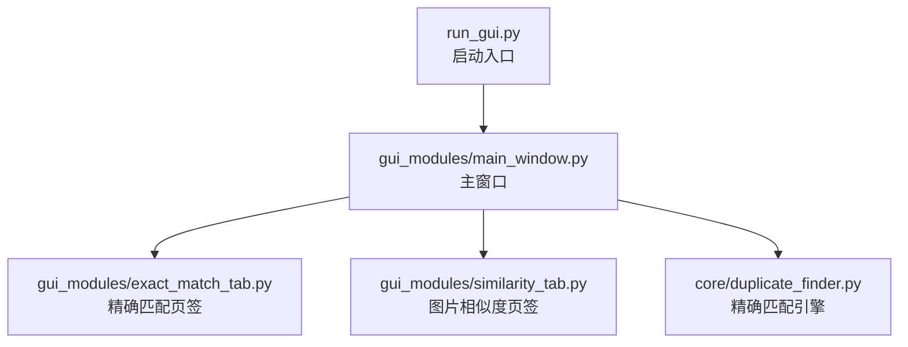
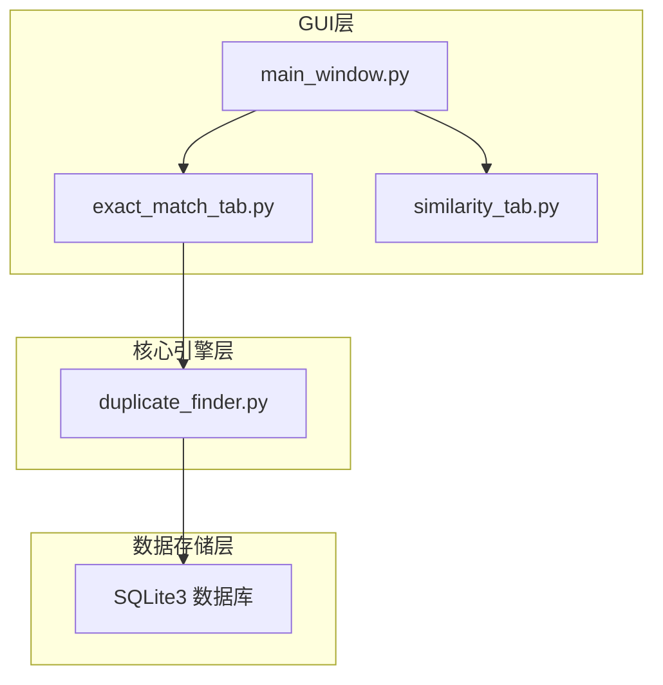
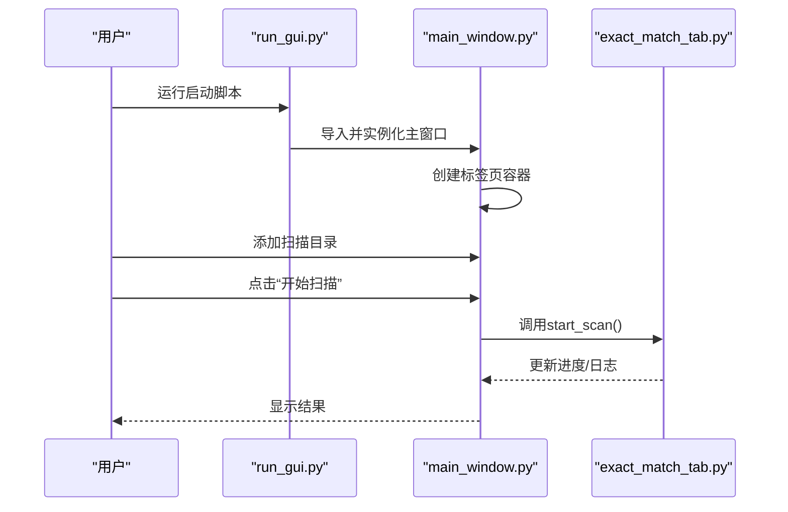
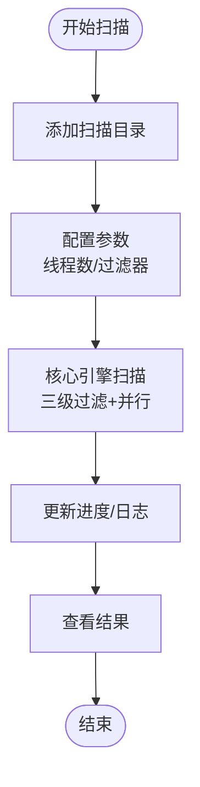
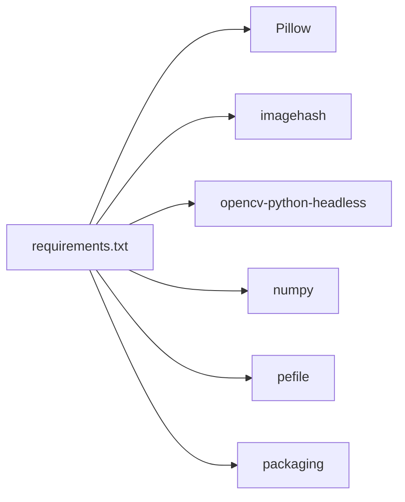
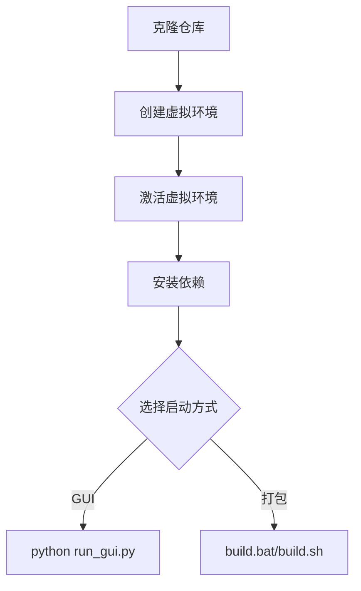

# 快速开始

<cite>
**本文引用的文件**
- [QUICK_START.md](file://QUICK_START.md)
- [README.md](file://README.md)
- [requirements.txt](file://requirements.txt)
- [run_gui.py](file://run_gui.py)
- [start.bat](file://start.bat)
- [build.bat](file://build.bat)
- [build.sh](file://build.sh)
- [core/duplicate_finder.py](file://core/duplicate_finder.py)
- [gui_modules/main_window.py](file://gui_modules/main_window.py)
- [gui_modules/exact_match_tab.py](file://gui_modules/exact_match_tab.py)
- [gui_modules/similarity_tab.py](file://gui_modules/similarity_tab.py)
- [docs/README.md](file://docs/README.md)
- [docs/PROJECT_OVERVIEW.md](file://docs/PROJECT_OVERVIEW.md)
</cite>

## 目录
1. [简介](#简介)
2. [项目结构](#项目结构)
3. [核心组件](#核心组件)
4. [架构总览](#架构总览)
5. [详细组件分析](#详细组件分析)
6. [依赖关系分析](#依赖关系分析)
7. [性能与参数调优](#性能与参数调优)
8. [故障排查指南](#故障排查指南)
9. [结论](#结论)
10. [附录](#附录)

## 简介
本指南面向首次使用者，帮助你在30分钟内完成安装、环境配置与第一次检测任务。你将学会：
- 在Windows/Linux/macOS上安装Python与依赖
- 启动GUI界面并完成一次“精确匹配”扫描
- 了解三种检测模式与常用参数调优
- 快速定位常见问题并获得解决方案

## 项目结构
项目采用“GUI层 + 核心引擎层 + 数据存储层”的分层架构，主要目录与文件如下：
- 核心引擎：core/（精确匹配、图片/视频相似度、软件版本检测）
- GUI界面：gui_modules/（主窗口与各功能页签）
- 启动入口：run_gui.py
- 依赖清单：requirements.txt
- 打包脚本：build.bat（Windows）、build.sh（Linux/macOS）

**图表来源**
- [run_gui.py:1-42](file://run_gui.py#L1-L42)
- [gui_modules/main_window.py:1-200](file://gui_modules/main_window.py#L1-L200)
- [gui_modules/exact_match_tab.py:1-200](file://gui_modules/exact_match_tab.py#L1-L200)
- [gui_modules/similarity_tab.py:1-200](file://gui_modules/similarity_tab.py#L1-L200)
- [core/duplicate_finder.py:1-200](file://core/duplicate_finder.py#L1-L200)

**章节来源**
- [README.md:338-372](file://README.md#L338-L372)
- [docs/PROJECT_OVERVIEW.md:32-89](file://docs/PROJECT_OVERVIEW.md#L32-L89)

## 核心组件
- GUI启动入口：run_gui.py负责导入GUI模块并启动主窗口
- 主窗口：gui_modules/main_window.py管理标签页、目录列表与全局状态
- 精确匹配页签：gui_modules/exact_match_tab.py提供扫描设置、进度与日志
- 核心引擎：core/duplicate_finder.py实现三级过滤与并行扫描

**章节来源**
- [run_gui.py:13-42](file://run_gui.py#L13-L42)
- [gui_modules/main_window.py:22-86](file://gui_modules/main_window.py#L22-L86)
- [gui_modules/exact_match_tab.py:18-42](file://gui_modules/exact_match_tab.py#L18-L42)
- [core/duplicate_finder.py:22-54](file://core/duplicate_finder.py#L22-L54)

## 架构总览
GUI层通过标签页调用核心引擎，核心引擎使用SQLite存储索引，支持多进程/线程并行处理，实现高性能扫描。

**图表来源**
- [gui_modules/main_window.py:62-86](file://gui_modules/main_window.py#L62-L86)
- [gui_modules/exact_match_tab.py:115-145](file://gui_modules/exact_match_tab.py#L115-L145)
- [core/duplicate_finder.py:56-94](file://core/duplicate_finder.py#L56-L94)

## 详细组件分析

### GUI启动与主窗口
- 启动入口：run_gui.py导入GUI模块并创建主窗口
- 主窗口：负责目录列表、标签页容器、日志输出与扫描控制
- 标签页：精确匹配、图片相似度、视频相似度、软件版本检测

**图表来源**
- [run_gui.py:13-42](file://run_gui.py#L13-L42)
- [gui_modules/main_window.py:165-180](file://gui_modules/main_window.py#L165-L180)
- [gui_modules/exact_match_tab.py:115-145](file://gui_modules/exact_match_tab.py#L115-L145)

**章节来源**
- [run_gui.py:13-42](file://run_gui.py#L13-L42)
- [gui_modules/main_window.py:22-86](file://gui_modules/main_window.py#L22-L86)
- [gui_modules/exact_match_tab.py:18-42](file://gui_modules/exact_match_tab.py#L18-L42)

### 精确匹配页签（核心引擎）
- 扫描设置：数据库路径、输出路径、并行线程数、文件类型过滤
- 进度与日志：进度条、状态文本、滚动日志
- 结果查看：打开文件、删除文件、隐藏组等操作

**图表来源**
- [gui_modules/exact_match_tab.py:115-145](file://gui_modules/exact_match_tab.py#L115-L145)
- [core/duplicate_finder.py:120-149](file://core/duplicate_finder.py#L120-L149)

**章节来源**
- [gui_modules/exact_match_tab.py:43-114](file://gui_modules/exact_match_tab.py#L43-L114)
- [core/duplicate_finder.py:120-200](file://core/duplicate_finder.py#L120-L200)

### 图片相似度页签
- 相似度阈值：滑动条5-30，默认12（平衡模式）
- 检测模式：快速模式（仅pHash）、精确模式（pHash+dHash+直方图）
- 扫描方式：全量/增量
- 图片格式过滤：JPG/PNG/GIF/BMP/WebP等

**章节来源**
- [gui_modules/similarity_tab.py:50-120](file://gui_modules/similarity_tab.py#L50-L120)
- [README.md:298-310](file://README.md#L298-L310)

## 依赖关系分析
- Python标准库：无需安装，满足基础功能
- 可选依赖：Pillow、imagehash、opencv-python-headless、numpy、pefile、packaging
- requirements.txt明确列出各功能所需的依赖与说明

**图表来源**
- [requirements.txt:10-32](file://requirements.txt#L10-L32)

**章节来源**
- [requirements.txt:1-32](file://requirements.txt#L1-L32)
- [README.md:229-248](file://README.md#L229-L248)

## 性能与参数调优
- 精确匹配
  - 并行线程数：HDD建议4-8，SSD建议8-16
  - 文件类型过滤：缩小扫描范围
- 图片相似度
  - 阈值：默认12（平衡），严格=5，宽松=20
  - 检测模式：首次全量，后续增量
- 视频相似度
  - 阈值：默认0.7，最小时长≥10秒
  - 采样帧数：随时长动态调整

**章节来源**
- [README.md:311-335](file://README.md#L311-L335)
- [QUICK_START.md:140-152](file://QUICK_START.md#L140-L152)

## 故障排查指南
- 无法启动GUI
  - 确认已安装Pillow与imagehash
  - 运行启动脚本时出现ImportError，按提示安装缺失依赖
- 扫描速度慢
  - 使用SSD；减少线程数；使用增量扫描
- 结果不准确
  - 精确匹配：检查文件是否真的相同
  - 图片相似度：阈值调整至12-15
  - 视频相似度：阈值降至0.6-0.65
- 导出结果
  - 当前版本暂不支持直接导出，可截图保存

**章节来源**
- [run_gui.py:27-37](file://run_gui.py#L27-L37)
- [QUICK_START.md:138-167](file://QUICK_START.md#L138-L167)

## 结论
通过本指南，你可以在30分钟内完成安装、配置与首次扫描。建议优先使用“精确匹配”模式熟悉流程，再根据场景选择“图片相似度”或“视频相似度”。遇到问题时，优先查看日志与常见问题速查，必要时参考完整文档。

## 附录

### 快速开始步骤（Windows/Linux/macOS）
- 克隆仓库并进入目录
- 创建虚拟环境并激活
- 安装依赖
- 启动GUI或打包成可执行文件

**图表来源**
- [README.md:204-277](file://README.md#L204-L277)
- [build.bat:10-53](file://build.bat#L10-L53)
- [build.sh:30-68](file://build.sh#L30-L68)

**章节来源**
- [README.md:202-277](file://README.md#L202-L277)
- [QUICK_START.md:7-68](file://QUICK_START.md#L7-L68)

### 基本操作流程（精确匹配）
- 添加扫描目录
- 配置参数（线程数、过滤器）
- 开始扫描
- 查看结果

**章节来源**
- [QUICK_START.md:72-99](file://QUICK_START.md#L72-L99)
- [gui_modules/exact_match_tab.py:115-145](file://gui_modules/exact_match_tab.py#L115-L145)

### 打包成可执行文件（Windows/Linux/macOS）
- Windows：双击build.bat
- Linux/macOS：赋予执行权限后运行build.sh

**章节来源**
- [build.bat:1-121](file://build.bat#L1-L121)
- [build.sh:1-113](file://build.sh#L1-L113)