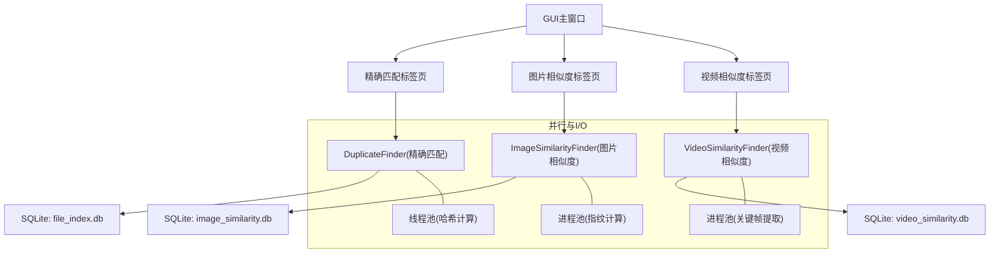
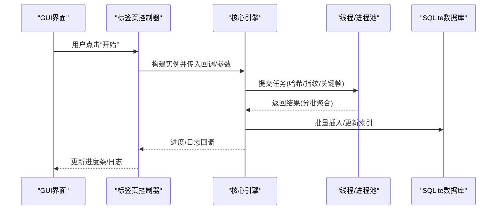
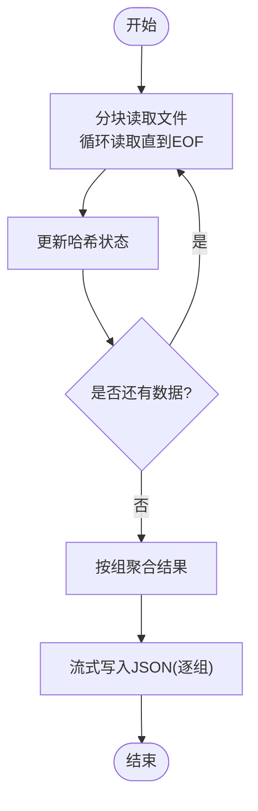
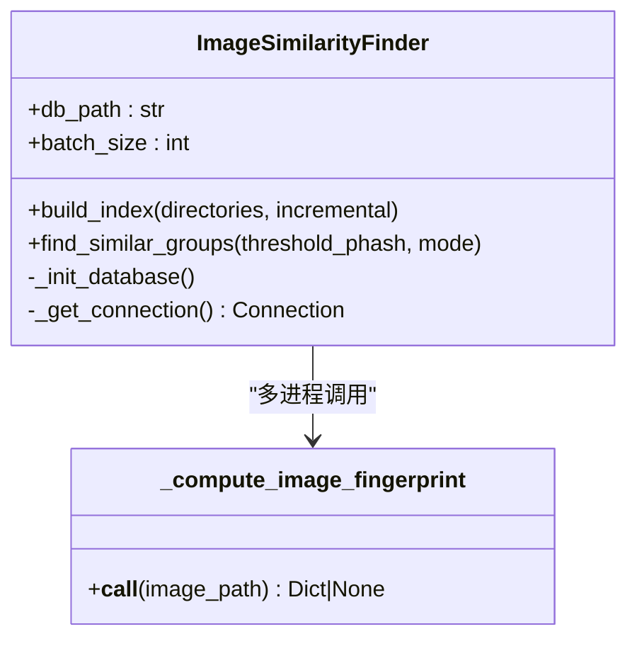
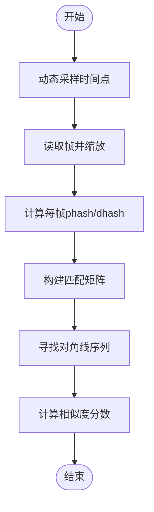
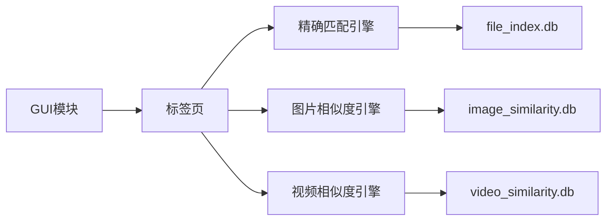

# 内存管理优化

<cite>
**本文引用的文件**
- [duplicate_finder.py](file://core/duplicate_finder.py)
- [visual_similarity.py](file://core/visual_similarity.py)
- [video_similarity.py](file://core/video_similarity.py)
- [main_window.py](file://gui_modules/main_window.py)
- [exact_match_tab.py](file://gui_modules/exact_match_tab.py)
- [similarity_tab.py](file://gui_modules/similarity_tab.py)
- [video_similarity_tab.py](file://gui_modules/video_similarity_tab.py)
- [README.md](file://README.md)
</cite>

## 目录
1. [简介](#简介)
2. [项目结构](#项目结构)
3. [核心组件](#核心组件)
4. [架构总览](#架构总览)
5. [详细组件分析](#详细组件分析)
6. [依赖关系分析](#依赖关系分析)
7. [性能考量](#性能考量)
8. [故障排查指南](#故障排查指南)
9. [结论](#结论)
10. [附录](#附录)

## 简介
本指南聚焦于大文件处理与大规模数据场景下的内存管理优化，结合仓库中的重复文件检测、图片相似度与视频相似度模块，系统阐述以下主题：
- 分块读取、流式处理与内存映射策略
- 垃圾回收与对象生命周期管理
- 内存泄漏预防方法
- 内存使用监控、峰值控制与大对象处理
- 不同内存配置下的性能表现与调优建议

目标是帮助读者在TB级数据规模下，稳定、高效地运行扫描与相似度计算任务，避免内存抖动与OOM。

## 项目结构
本项目采用分层组织：GUI层负责交互与进度展示；核心引擎层实现三类检测（精确匹配、图片相似度、视频相似度）；数据存储通过SQLite3索引与批量写入；并行计算使用线程池/进程池降低GIL限制并提升吞吐。

图表来源
- [main_window.py:62-85](file://gui_modules/main_window.py#L62-L85)
- [duplicate_finder.py:25-73](file://core/duplicate_finder.py#L25-L73)
- [visual_similarity.py:94-121](file://core/visual_similarity.py#L94-L121)
- [video_similarity.py:174-203](file://core/video_similarity.py#L174-L203)

章节来源
- [main_window.py:1-245](file://gui_modules/main_window.py#L1-L245)
- [README.md:338-401](file://README.md#L338-L401)

## 核心组件
- 精确匹配引擎：基于文件大小→部分哈希→完整哈希的三级过滤，支持多线程并行与WAL模式数据库，流式导出JSON以降低内存峰值。
- 图片相似度引擎：pHash+dHash+颜色直方图三级过滤，多进程并行指纹计算，批处理入库，阈值可调。
- 视频相似度引擎：动态采样关键帧、序列匹配与对角线分析，进程池并行，批处理入库。

章节来源
- [duplicate_finder.py:25-73](file://core/duplicate_finder.py#L25-L73)
- [visual_similarity.py:94-121](file://core/visual_similarity.py#L94-L121)
- [video_similarity.py:174-203](file://core/video_similarity.py#L174-L203)

## 架构总览
下图展示了从GUI到核心引擎再到存储与并行计算的调用链，以及各阶段的内存关键点。

图表来源
- [main_window.py:165-180](file://gui_modules/main_window.py#L165-L180)
- [duplicate_finder.py:324-387](file://core/duplicate_finder.py#L324-L387)
- [visual_similarity.py:253-311](file://core/visual_similarity.py#L253-L311)
- [video_similarity.py:310-367](file://core/video_similarity.py#L310-L367)

## 详细组件分析

### 精确匹配引擎（DuplicateFinder）
- 分块读取与流式处理
  - 完整哈希阶段按固定块大小循环读取，避免一次性加载大文件到内存。
  - JSON导出采用流式写入，逐组序列化并写入磁盘，避免构建完整JSON树导致内存翻倍。
- 数据库与内存映射
  - 启用WAL模式、临时表存内存、设置缓存大小与内存映射大小，减少磁盘IO与锁争用。
- 并发与内存
  - 根据磁盘类型自适应线程数，HDD限制线程避免寻道风暴；SSD/NVMe可更高并发。
  - 使用线程锁保护进度计数，避免竞态条件导致的额外开销。

图表来源
- [duplicate_finder.py:506-557](file://core/duplicate_finder.py#L506-L557)
- [duplicate_finder.py:597-658](file://core/duplicate_finder.py#L597-L658)

章节来源
- [duplicate_finder.py:25-73](file://core/duplicate_finder.py#L25-L73)
- [duplicate_finder.py:133-175](file://core/duplicate_finder.py#L133-L175)
- [duplicate_finder.py:324-387](file://core/duplicate_finder.py#L324-L387)
- [duplicate_finder.py:506-557](file://core/duplicate_finder.py#L506-L557)
- [duplicate_finder.py:597-658](file://core/duplicate_finder.py#L597-L658)

### 图片相似度引擎（ImageSimilarityFinder）
- 大对象处理
  - 超大图片先缩放至最大边长限制，再计算感知哈希与直方图，避免内存溢出。
- 并行与批处理
  - 多进程并行计算指纹，批处理入库，降低频繁IO与连接开销。
- 阈值与模式
  - 快速模式仅pHash，精确模式叠加dHash与直方图余弦相似度，平衡精度与内存/CPU消耗。

图表来源
- [visual_similarity.py:21-91](file://core/visual_similarity.py#L21-L91)
- [visual_similarity.py:94-121](file://core/visual_similarity.py#L94-L121)
- [visual_similarity.py:253-311](file://core/visual_similarity.py#L253-L311)

章节来源
- [visual_similarity.py:21-91](file://core/visual_similarity.py#L21-L91)
- [visual_similarity.py:253-311](file://core/visual_similarity.py#L253-L311)
- [visual_similarity.py:410-513](file://core/visual_similarity.py#L410-L513)

### 视频相似度引擎（VideoSimilarityFinder）
- 关键帧采样与尺寸限制
  - 根据时长动态确定采样帧数，帧统一缩放到最大边长，降低内存占用。
- 序列匹配与内存友好
  - 构建匹配矩阵后寻找对角线序列，合并重叠序列，计算时间覆盖率与综合评分。
- 并行与批处理
  - 多进程并行提取关键帧，批处理入库，减少数据库压力。

图表来源
- [video_similarity.py:21-151](file://core/video_similarity.py#L21-L151)
- [video_similarity.py:406-496](file://core/video_similarity.py#L406-L496)
- [video_similarity.py:498-545](file://core/video_similarity.py#L498-L545)

章节来源
- [video_similarity.py:174-203](file://core/video_similarity.py#L174-L203)
- [video_similarity.py:310-367](file://core/video_similarity.py#L310-L367)
- [video_similarity.py:498-545](file://core/video_similarity.py#L498-L545)

### GUI与标签页（内存相关要点）
- 懒加载与缓存
  - 视频预览采用异步加载与LRU缓存，限制缓存数量，避免无限增长。
- 进度与日志
  - 通过回调将进度与日志推送到UI，避免在主线程阻塞。
- 结果展示
  - 结果窗口按需显示，必要时从数据库重建结果，减少重复计算与内存占用。

章节来源
- [video_similarity_tab.py:455-651](file://gui_modules/video_similarity_tab.py#L455-L651)
- [similarity_tab.py:341-416](file://gui_modules/similarity_tab.py#L341-L416)
- [exact_match_tab.py:293-379](file://gui_modules/exact_match_tab.py#L293-L379)

## 依赖关系分析
- 模块耦合
  - GUI通过标签页调用核心引擎；核心引擎各自维护独立SQLite数据库。
  - 并行执行通过线程池/进程池解耦计算与I/O。
- 外部依赖
  - 图片/视频处理依赖Pillow、OpenCV、imagehash等，按需延迟导入以避免启动失败。
- 潜在循环依赖
  - 当前结构清晰，未见循环导入；跨模块通过函数或类实例通信。

图表来源
- [main_window.py:62-85](file://gui_modules/main_window.py#L62-L85)
- [duplicate_finder.py:133-175](file://core/duplicate_finder.py#L133-L175)
- [visual_similarity.py:123-169](file://core/visual_similarity.py#L123-L169)
- [video_similarity.py:205-239](file://core/video_similarity.py#L205-L239)

章节来源
- [main_window.py:1-245](file://gui_modules/main_window.py#L1-L245)
- [README.md:376-467](file://README.md#L376-L467)

## 性能考量
- 分块读取与流式处理
  - 大文件哈希按块读取，避免一次性载入；JSON导出逐组写入，显著降低峰值内存。
- 数据库优化
  - WAL模式、临时表内存存储、合理缓存与内存映射，提高并发与查询性能。
- 并行策略
  - HDD限制线程数避免寻道风暴；SSD/NVMe提高并发；图片/视频指纹计算使用进程池规避GIL。
- 大对象处理
  - 图片缩放、视频帧缩放，控制中间对象大小；预览缓存LRU限制数量。
- 内存峰值控制
  - 批处理入库，减少频繁事务；增量扫描复用已有索引，避免重复计算。
- 不同内存配置建议
  - 低内存环境：减小批大小、降低并发、关闭不必要的预览缓存；优先使用快速模式。
  - 高内存环境：增大批大小、适度提高并发；开启更严格的相似度验证以提升准确率。

章节来源
- [duplicate_finder.py:75-131](file://core/duplicate_finder.py#L75-L131)
- [duplicate_finder.py:133-175](file://core/duplicate_finder.py#L133-L175)
- [visual_similarity.py:21-91](file://core/visual_similarity.py#L21-L91)
- [video_similarity.py:21-151](file://core/video_similarity.py#L21-L151)
- [video_similarity_tab.py:629-651](file://gui_modules/video_similarity_tab.py#L629-L651)

## 故障排查指南
- 常见问题定位
  - 数据库锁定：检查WAL与busy_timeout设置；确保连接上下文正确提交/回滚。
  - 内存不足：降低并发、缩小批大小、禁用预览缓存或限制缓存上限。
  - 进度异常：确认线程锁保护进度计数，避免竞态条件。
- 调试手段
  - 查看日志回调输出；在GUI中观察进度与错误信息。
  - 对大对象路径添加打印，确认是否出现异常的大图/视频未缩放。
- 恢复策略
  - 清理历史数据库后重新全量扫描；或使用增量扫描保留有效数据。

章节来源
- [duplicate_finder.py:177-201](file://core/duplicate_finder.py#L177-L201)
- [visual_similarity.py:171-188](file://core/visual_similarity.py#L171-L188)
- [video_similarity.py:241-258](file://core/video_similarity.py#L241-L258)
- [exact_match_tab.py:368-379](file://gui_modules/exact_match_tab.py#L368-L379)

## 结论
该仓库在大文件与大规模数据处理方面采用了多项成熟的内存优化实践：分块读取、流式导出、数据库WAL与内存映射、并行计算与批处理、大对象缩放与缓存控制。遵循这些策略可在不同内存配置下获得稳定的性能与较低的内存峰值。建议在资源受限环境中进一步降低并发与批大小，并结合增量扫描与快速模式以平衡速度与准确性。

## 附录
- 参考文档
  - README中对架构、性能基准与参数的说明，可作为调优依据。
- 实用建议
  - 首次全量扫描后，后续使用增量扫描；定期压缩数据库以减少体积。
  - 针对图片/视频预览，限制缓存大小并启用LRU淘汰策略。

章节来源
- [README.md:470-518](file://README.md#L470-L518)
- [README.md:521-562](file://README.md#L521-L562)