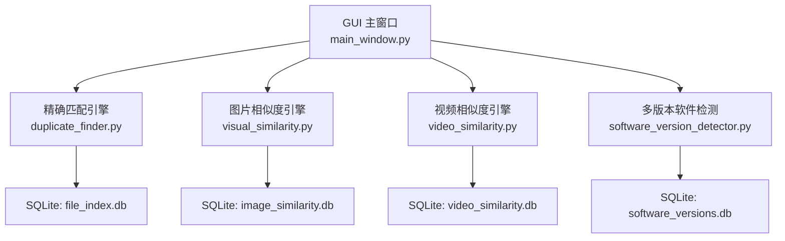
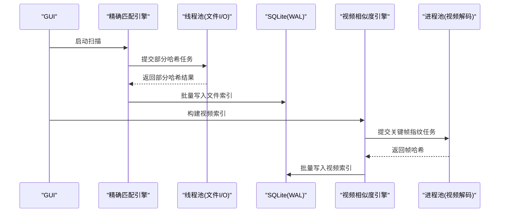
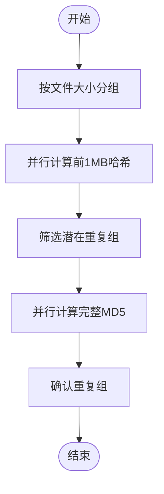
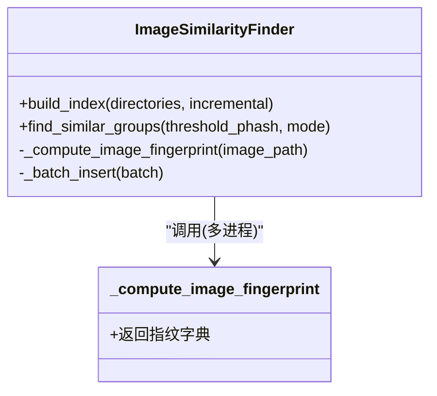
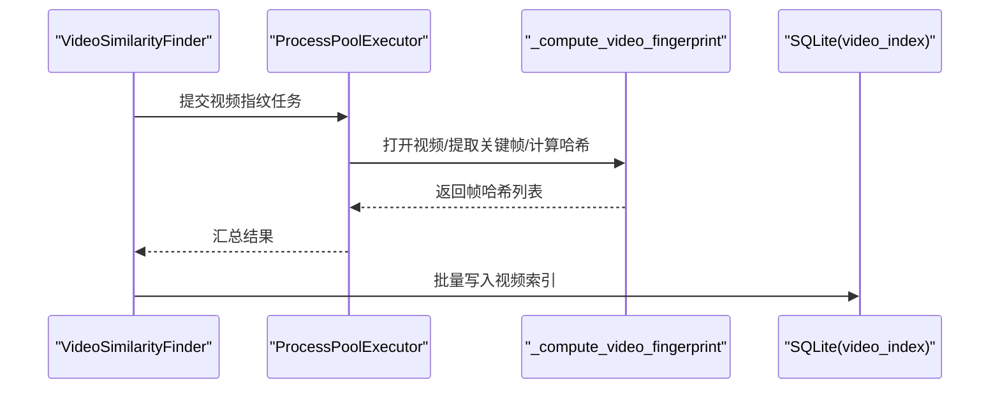
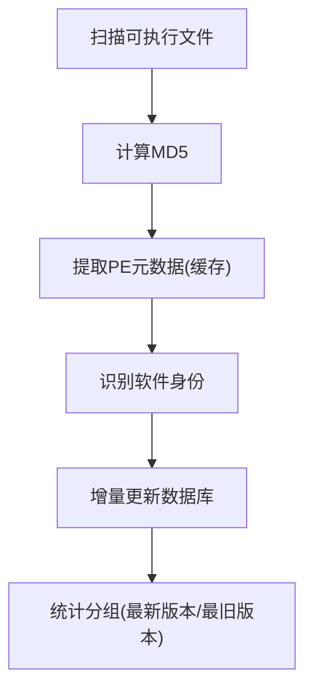
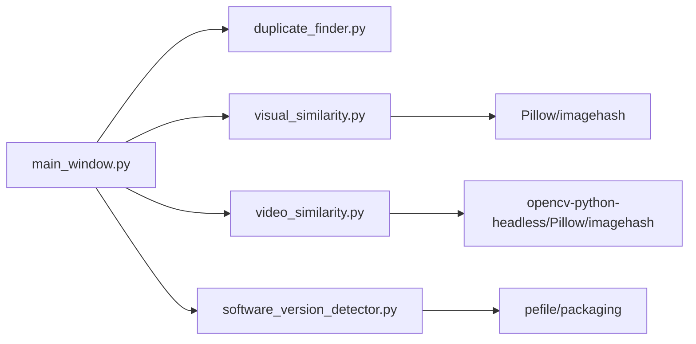

# 并行处理优化

<cite>
**本文引用的文件**
- [README.md](file://README.md)
- [duplicate_finder.py](file://core/duplicate_finder.py)
- [visual_similarity.py](file://core/visual_similarity.py)
- [video_similarity.py](file://core/video_similarity.py)
- [software_version_detector.py](file://core/software_version_detector.py)
- [main_window.py](file://gui_modules/main_window.py)
- [requirements.txt](file://requirements.txt)
</cite>

## 目录
1. [简介](#简介)
2. [项目结构](#项目结构)
3. [核心组件](#核心组件)
4. [架构总览](#架构总览)
5. [详细组件分析](#详细组件分析)
6. [依赖关系分析](#依赖关系分析)
7. [性能考量](#性能考量)
8. [故障排查指南](#故障排查指南)
9. [结论](#结论)
10. [附录](#附录)

## 简介
本指南聚焦于该“文件重复校验工具”中的并行处理优化实践，系统梳理多线程与多进程在哈希计算、图像/视频指纹提取、软件元数据解析等场景中的应用。重点包括：
- ThreadPoolExecutor 的使用策略与线程池大小调优
- ProcessPoolExecutor 在多核CPU上的任务分配与负载均衡
- Python GIL 对多线程的影响及规避策略
- I/O 密集型与 CPU 密集型的差异化并行方案
- 数据库并发写入优化（SQLite WAL、批量写入、超时）
- 内存使用控制（流式导出、懒加载、缓存上限）
- 不同硬件配置下的并行性能调优建议与测试方法

## 项目结构
本项目采用分层模块化设计：
- GUI 层：Tkinter 主窗口与各功能标签页
- 核心引擎层：精确匹配、图片相似度、视频相似度、多版本软件检测
- 数据存储层：SQLite 索引与统计信息
- 依赖管理：requirements.txt 声明可选依赖

图表来源
- [main_window.py:18-85](file://gui_modules/main_window.py#L18-L85)
- [duplicate_finder.py:133-175](file://core/duplicate_finder.py#L133-L175)
- [visual_similarity.py:123-169](file://core/visual_similarity.py#L123-L169)
- [video_similarity.py:205-239](file://core/video_similarity.py#L205-L239)
- [software_version_detector.py:109-159](file://core/software_version_detector.py#L109-L159)

章节来源
- [README.md:338-401](file://README.md#L338-L401)
- [main_window.py:18-85](file://gui_modules/main_window.py#L18-L85)

## 核心组件
- 精确匹配引擎：基于文件大小分组 + 部分哈希（前1MB）+ 完整MD5的三级过滤；I/O 密集型，采用 ThreadPoolExecutor 并行读取与哈希计算；自动根据磁盘类型调整线程数，避免 HDD 寻道风暴。
- 图片相似度引擎：pHash + dHash + 颜色直方图三级过滤；CPU 密集型指纹计算，采用 ProcessPoolExecutor 并行计算，限制进程数以避免资源争用。
- 视频相似度引擎：关键帧序列匹配；视频解码与帧哈希为 I/O/CPU 混合负载，采用 ProcessPoolExecutor 限制进程数（最多4），降低解码器竞争。
- 多版本软件检测：PE 元数据提取与语义化版本比较；I/O 与轻量 CPU 计算，采用线程池或顺序批处理，结合 LRU 缓存减少重复解析。

章节来源
- [duplicate_finder.py:25-73](file://core/duplicate_finder.py#L25-L73)
- [visual_similarity.py:94-121](file://core/visual_similarity.py#L94-L121)
- [video_similarity.py:174-203](file://core/video_similarity.py#L174-L203)
- [software_version_detector.py:30-95](file://core/software_version_detector.py#L30-L95)

## 架构总览
整体并行架构遵循“按负载类型选择执行模型”的原则：
- I/O 密集型（文件扫描、哈希读取）：优先使用线程池（ThreadPoolExecutor），利用并发 I/O 提升吞吐。
- CPU 密集型（图像/视频指纹计算、PE 解析）：优先使用进程池（ProcessPoolExecutor），绕过 GIL 限制，充分利用多核。
- 数据库写入：统一通过 SQLite WAL 模式、批量插入、超时与忙等待，降低锁冲突。

图表来源
- [duplicate_finder.py:483-504](file://core/duplicate_finder.py#L483-L504)
- [duplicate_finder.py:570-595](file://core/duplicate_finder.py#L570-L595)
- [video_similarity.py:336-367](file://core/video_similarity.py#L336-L367)
- [duplicate_finder.py:133-175](file://core/duplicate_finder.py#L133-L175)
- [video_similarity.py:205-239](file://core/video_similarity.py#L205-L239)

## 详细组件分析

### 精确匹配引擎（多线程并行）
- 并行点
  - 部分哈希：按文件大小分组后，使用 ThreadPoolExecutor 并行读取前1MB并计算 MD5。
  - 完整哈希：对候选组再次并行计算完整 MD5，确认重复。
- 线程池大小优化
  - 自动检测 CPU 核心数并结合磁盘类型自适应：HDD 限制 2-4 线程，SSD/NVMe 可放宽至 CPU*2（上限16）。
  - 提供命令行参数 --workers 手动覆盖。
- 资源竞争与锁
  - 进度计数器使用 threading.Lock 保护，避免竞态条件导致计数丢失。
  - 数据库连接设置 busy_timeout 与 WAL 模式，降低锁冲突。
- 数据流与复杂度
  - 时间复杂度近似 O(N log N)（分组与哈希聚合），空间复杂度受限于批次大小与内存映射。
  - 批量写入减少事务次数，提高吞吐。

图表来源
- [duplicate_finder.py:324-387](file://core/duplicate_finder.py#L324-L387)
- [duplicate_finder.py:436-504](file://core/duplicate_finder.py#L436-L504)
- [duplicate_finder.py:506-595](file://core/duplicate_finder.py#L506-L595)

章节来源
- [duplicate_finder.py:75-131](file://core/duplicate_finder.py#L75-L131)
- [duplicate_finder.py:177-201](file://core/duplicate_finder.py#L177-L201)
- [duplicate_finder.py:483-504](file://core/duplicate_finder.py#L483-L504)
- [duplicate_finder.py:570-595](file://core/duplicate_finder.py#L570-L595)

### 图片相似度引擎（多进程并行）
- 并行点
  - 指纹计算：pHash、dHash、颜色直方图，CPU 密集型，使用 ProcessPoolExecutor 并行。
- 进程池大小优化
  - 默认限制为 CPU 核心数与 8 的最小值，避免过多进程导致上下文切换开销。
- 数据流与复杂度
  - 指纹计算 O(F)（F 为图片数量），相似度比对阶段为 O(N^2) 但通过 pHash 快速筛选降低常数。
- 内存控制
  - 超大图片先缩放，避免内存溢出；直方图以紧凑二进制存储。

图表来源
- [visual_similarity.py:21-91](file://core/visual_similarity.py#L21-L91)
- [visual_similarity.py:253-311](file://core/visual_similarity.py#L253-L311)
- [visual_similarity.py:410-513](file://core/visual_similarity.py#L410-L513)

章节来源
- [visual_similarity.py:94-121](file://core/visual_similarity.py#L94-L121)
- [visual_similarity.py:280-311](file://core/visual_similarity.py#L280-L311)
- [visual_similarity.py:410-513](file://core/visual_similarity.py#L410-L513)

### 视频相似度引擎（多进程并行）
- 并行点
  - 关键帧提取与帧哈希：使用 OpenCV 解码与 imagehash 计算，CPU/I/O 混合负载，采用 ProcessPoolExecutor。
- 进程池大小优化
  - 最多 4 个进程，降低解码器竞争与内存占用。
- 算法流程
  - 动态采样帧数 → 计算每帧 pHash/dHash → 构建匹配矩阵 → 寻找对角线序列 → 综合评分。
- 数据库优化
  - WAL 模式、批量写入、索引加速查询。

图表来源
- [video_similarity.py:21-151](file://core/video_similarity.py#L21-L151)
- [video_similarity.py:336-367](file://core/video_similarity.py#L336-L367)
- [video_similarity.py:205-239](file://core/video_similarity.py#L205-L239)

章节来源
- [video_similarity.py:174-203](file://core/video_similarity.py#L174-L203)
- [video_similarity.py:336-367](file://core/video_similarity.py#L336-L367)
- [video_similarity.py:498-545](file://core/video_similarity.py#L498-L545)

### 多版本软件检测（线程/批处理）
- 并行点
  - PE 元数据提取与识别：轻量 CPU 与 I/O，采用线程池或顺序批处理，配合 LRU 缓存减少重复解析。
- 数据流
  - 扫描可执行文件 → 计算 MD5 → 提取 PE 信息 → 识别软件身份 → 增量更新数据库 → 统计分组。
- 版本比较
  - 使用 packaging.version 进行语义化版本比较，未知版本排到最后。

图表来源
- [software_version_detector.py:356-481](file://core/software_version_detector.py#L356-L481)
- [software_version_detector.py:178-244](file://core/software_version_detector.py#L178-L244)
- [software_version_detector.py:483-538](file://core/software_version_detector.py#L483-L538)

章节来源
- [software_version_detector.py:30-95](file://core/software_version_detector.py#L30-L95)
- [software_version_detector.py:391-481](file://core/software_version_detector.py#L391-L481)
- [software_version_detector.py:540-604](file://core/software_version_detector.py#L540-L604)

## 依赖关系分析
- 核心模块依赖
  - GUI 依赖各引擎模块，通过 main_window 路由到具体标签页。
  - 引擎模块依赖 concurrent.futures（线程/进程池）、sqlite3、第三方库（Pillow、imagehash、opencv-python-headless、pefile、packaging）。
- 外部依赖
  - requirements.txt 明确可选依赖，按需安装以降低包体积。

图表来源
- [main_window.py:18-85](file://gui_modules/main_window.py#L18-L85)
- [requirements.txt:10-23](file://requirements.txt#L10-L23)

章节来源
- [requirements.txt:1-32](file://requirements.txt#L1-32)
- [main_window.py:18-85](file://gui_modules/main_window.py#L18-L85)

## 性能考量
- 并行模型选择
  - I/O 密集型（文件扫描、哈希读取）：使用 ThreadPoolExecutor，合理设置 max_workers 与 chunk_size。
  - CPU 密集型（图像/视频指纹、PE 解析）：使用 ProcessPoolExecutor，限制进程数避免上下文切换与资源争用。
- 线程池大小优化
  - 精确匹配：根据磁盘类型自适应（HDD 2-4，SSD/NVMe 可达 CPU*2，上限16），支持命令行 --workers 覆盖。
  - 图片相似度：max_workers = min(cpu_count, 8)。
  - 视频相似度：max_workers = min(cpu_count, 4)，降低解码器竞争。
- GIL 限制处理
  - 多线程无法并行执行 Python 字节码，因此 CPU 密集型任务使用多进程绕过 GIL。
  - 多线程用于 I/O 等待与轻量计算，如文件读取、哈希更新。
- 负载均衡策略
  - 任务粒度：将大任务拆分为小任务（单文件指纹/哈希），使用 as_completed 及时回收结果。
  - 批次写入：批量插入数据库，减少事务开销。
- 资源竞争避免
  - 数据库：WAL 模式、busy_timeout、索引优化。
  - 进度更新：使用锁保护共享计数器，降低 UI 更新频率。
- 内存使用控制
  - 流式 JSON 导出，避免一次性构建大对象。
  - 懒加载缩略图与 LRU 缓存，限制缓存大小。
  - 超大图片缩放与紧凑直方图存储。
- 吞吐量优化技巧
  - 调整 chunk_size 与 batch_size，平衡 I/O 与内存。
  - 增量扫描避免重复索引。
  - 数据库 PRAGMA 优化（WAL、synchronous、cache_size、mmap_size）。
- 不同硬件配置调优建议
  - HDD：限制线程数，避免寻道风暴；增大 chunk_size 减少随机读。
  - SSD/NVMe：可适当增加线程数，提升并发 I/O。
  - 多核 CPU：对 CPU 密集型任务使用多进程，限制进程数避免过载。
  - 内存受限：降低 batch_size，启用流式导出与缓存上限。

章节来源
- [duplicate_finder.py:75-131](file://core/duplicate_finder.py#L75-L131)
- [duplicate_finder.py:483-504](file://core/duplicate_finder.py#L483-L504)
- [visual_similarity.py:117-121](file://core/visual_similarity.py#L117-L121)
- [video_similarity.py:199-203](file://core/video_similarity.py#L199-L203)
- [README.md:403-467](file://README.md#L403-L467)

## 故障排查指南
- 常见问题定位
  - 数据库锁定：检查 WAL 模式与 busy_timeout 设置，确保批量写入与事务正确提交。
  - 进度计数异常：确认使用锁保护共享变量，避免竞态条件。
  - 视频解码失败：检查 opencv-python-headless 安装与视频格式支持。
  - PE 解析失败：检查 pefile 安装与文件权限。
- 调试建议
  - 启用日志回调，记录错误堆栈与关键步骤。
  - 逐步缩小问题范围（单文件/单目录测试）。
  - 监控资源使用（CPU、内存、磁盘 I/O）。

章节来源
- [duplicate_finder.py:177-201](file://core/duplicate_finder.py#L177-L201)
- [video_similarity.py:40-49](file://core/video_similarity.py#L40-L49)
- [software_version_detector.py:17-27](file://core/software_version_detector.py#L17-L27)

## 结论
该项目在不同功能模块中采用了差异化的并行策略：I/O 密集型任务使用线程池，CPU 密集型任务使用进程池，并通过数据库优化、内存控制与负载均衡实现高吞吐与稳定性。针对不同的硬件环境，提供了自适应线程/进程数与可调参数，便于在实际部署中取得最佳性能。

## 附录
- 性能基准参考
  - 精确匹配：约 12,000 文件/分钟（SSD）。
  - 图片相似度：约 600 图片/分钟（精确模式）。
  - 视频相似度：约 40 视频/分钟（1080p H.264）。
  - 多版本软件检测：约 600 文件/分钟（PE 元数据提取）。
- 相关文档
  - README 中的技术架构与性能基准章节。
  - 各引擎模块的类与方法说明。

章节来源
- [README.md:470-518](file://README.md#L470-L518)