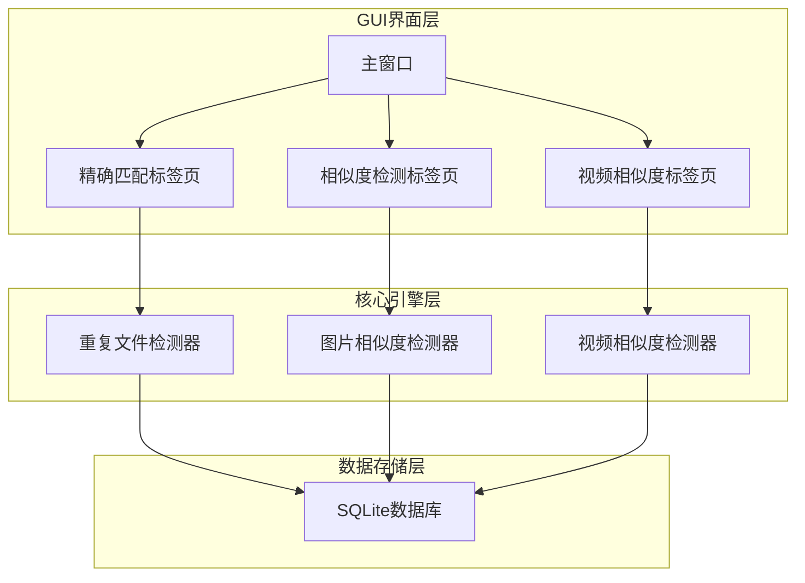
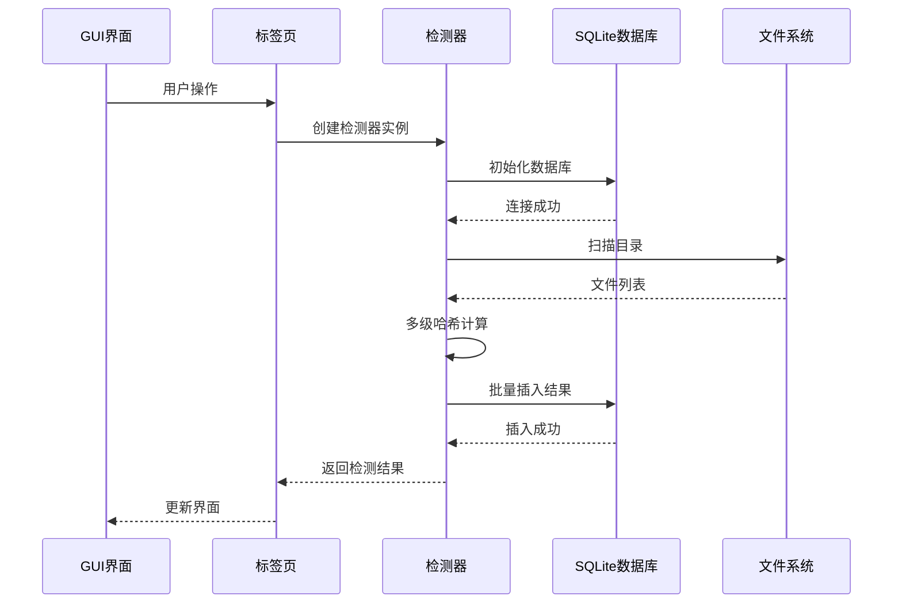
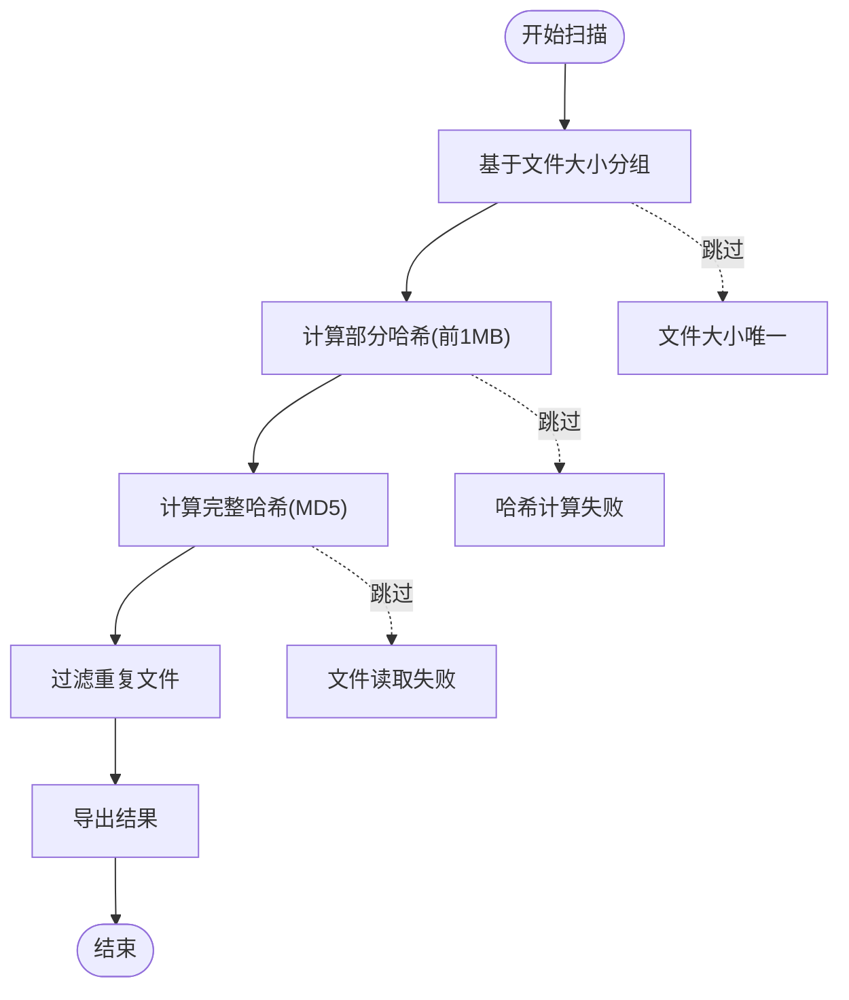
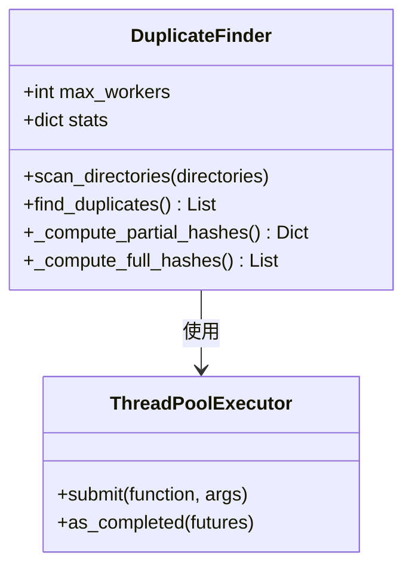
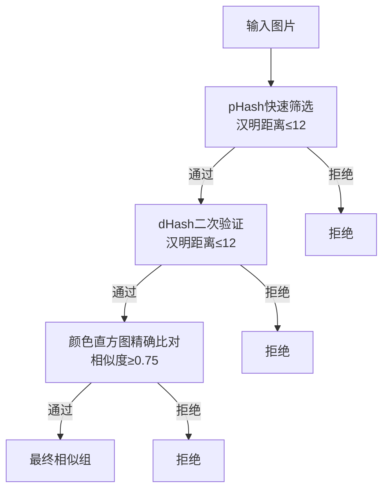
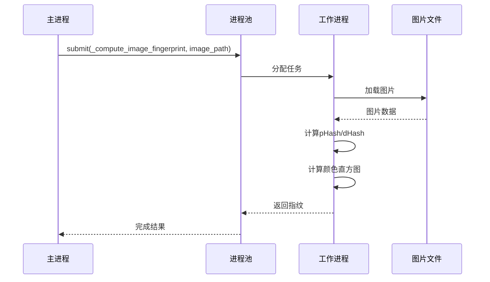
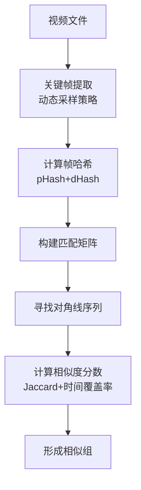
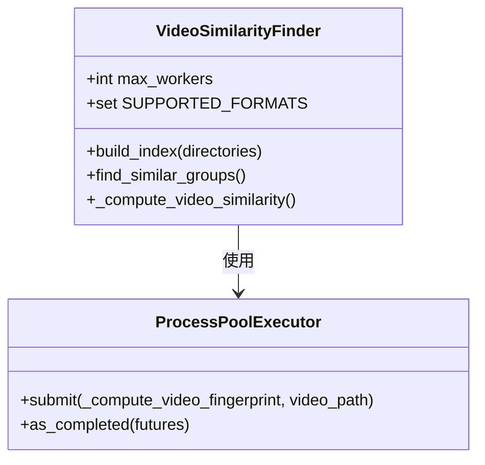
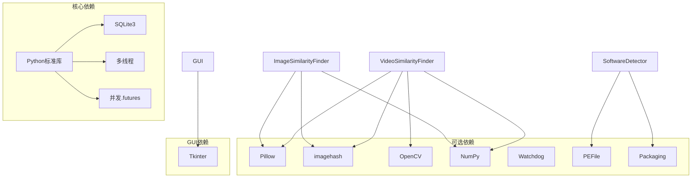

# 性能优化

<cite>
**本文档引用的文件**
- [duplicate_finder.py](file://core/duplicate_finder.py)
- [video_similarity.py](file://core/video_similarity.py)
- [visual_similarity.py](file://core/visual_similarity.py)
- [main_window.py](file://gui_modules/main_window.py)
- [exact_match_tab.py](file://gui_modules/exact_match_tab.py)
- [similarity_tab.py](file://gui_modules/similarity_tab.py)
- [video_similarity_tab.py](file://gui_modules/video_similarity_tab.py)
- [run_gui.py](file://run_gui.py)
- [requirements.txt](file://requirements.txt)
- [README.md](file://README.md)
</cite>

## 目录
1. [简介](#简介)
2. [项目结构](#项目结构)
3. [核心组件](#核心组件)
4. [架构概览](#架构概览)
5. [详细组件分析](#详细组件分析)
6. [依赖分析](#依赖分析)
7. [性能考虑](#性能考虑)
8. [故障排除指南](#故障排除指南)
9. [结论](#结论)
10. [附录](#附录)

## 简介
本指南专注于文件重复校验系统的性能优化，涵盖多进程并行计算、内存管理、缓存策略、性能基准测试、资源使用分析和大数据量处理最佳实践。通过对核心模块的深入分析，提供系统性的优化建议和调优技巧，帮助用户在TB级数据环境下获得最佳性能表现。

## 项目结构
该项目采用模块化架构，分为核心引擎层和GUI界面层：



**图表来源**
- [main_window.py:1-245](file://gui_modules/main_window.py#L1-L245)
- [exact_match_tab.py:1-800](file://gui_modules/exact_match_tab.py#L1-L800)
- [similarity_tab.py:1-800](file://gui_modules/similarity_tab.py#L1-L800)
- [video_similarity_tab.py:1-800](file://gui_modules/video_similarity_tab.py#L1-L800)

**章节来源**
- [README.md:338-401](file://README.md#L338-L401)

## 核心组件
系统包含三个核心检测器，每个都针对特定场景进行了性能优化：

### 重复文件检测器（DuplicateFinder）
- **多级哈希策略**：文件大小 → 部分哈希(前1MB) → 完整哈希(MD5)
- **并行处理**：ThreadPoolExecutor用于I/O密集型任务
- **数据库优化**：SQLite3 + WAL模式 + 索引优化
- **内存管理**：批量插入、进度回调、停止标志

### 图片相似度检测器（ImageSimilarityFinder）
- **三级过滤策略**：pHash → dHash → 颜色直方图
- **多进程并行**：ProcessPoolExecutor用于CPU密集型图像处理
- **缓存机制**：缩略图缓存、懒加载
- **格式支持**：JPG/PNG/GIF/BMP/WebP

### 视频相似度检测器（VideoSimilarityFinder）
- **关键帧序列匹配**：动态采样策略
- **滑动窗口算法**：对角线序列分析
- **多进程并行**：视频解码和帧提取
- **预览功能**：多帧缩略图显示

**章节来源**
- [duplicate_finder.py:22-588](file://core/duplicate_finder.py#L22-L588)
- [visual_similarity.py:94-622](file://core/visual_similarity.py#L94-L622)
- [video_similarity.py:174-772](file://core/video_similarity.py#L174-L772)

## 架构概览



**图表来源**
- [exact_match_tab.py:320-380](file://gui_modules/exact_match_tab.py#L320-L380)
- [similarity_tab.py:370-420](file://gui_modules/similarity_tab.py#L370-L420)
- [video_similarity_tab.py:360-420](file://gui_modules/video_similarity_tab.py#L360-L420)

## 详细组件分析

### 重复文件检测器性能分析

#### 多级哈希策略实现


**图表来源**
- [duplicate_finder.py:300-451](file://core/duplicate_finder.py#L300-L451)

#### 并行计算实现
检测器使用ThreadPoolExecutor进行并行处理：



**图表来源**
- [duplicate_finder.py:369-441](file://core/duplicate_finder.py#L369-L441)

**章节来源**
- [duplicate_finder.py:22-588](file://core/duplicate_finder.py#L22-L588)

### 图片相似度检测器性能分析

#### 三级过滤策略


**图表来源**
- [visual_similarity.py:455-481](file://core/visual_similarity.py#L455-L481)

#### 多进程并行处理
图片检测器使用ProcessPoolExecutor进行并行处理：



**图表来源**
- [visual_similarity.py:281-310](file://core/visual_similarity.py#L281-L310)

**章节来源**
- [visual_similarity.py:94-622](file://core/visual_similarity.py#L94-L622)

### 视频相似度检测器性能分析

#### 关键帧序列匹配算法


**图表来源**
- [video_similarity.py:514-545](file://core/video_similarity.py#L514-L545)

#### 多进程视频处理
视频检测器同样采用ProcessPoolExecutor：



**图表来源**
- [video_similarity.py:337-367](file://core/video_similarity.py#L337-L367)

**章节来源**
- [video_similarity.py:174-772](file://core/video_similarity.py#L174-L772)

## 依赖分析



**图表来源**
- [requirements.txt:1-32](file://requirements.txt#L1-L32)

**章节来源**
- [requirements.txt:1-32](file://requirements.txt#L1-L32)

## 性能考虑

### 数据库性能优化
系统使用SQLite3进行数据存储，采用多项优化策略：

#### PRAGMA参数优化
- **journal_mode=WAL**：写入模式，提高并发性能
- **synchronous=NORMAL**：降低同步频率，提升写入速度
- **cache_size=-64000**：64MB缓存大小
- **temp_store=MEMORY**：临时表存储在内存
- **mmap_size=268435456**：256MB内存映射

#### 索引策略
- 文件索引：file_size, partial_hash, full_hash, scan_status
- 图片索引：phash, dhash, size, path
- 视频索引：duration, size, path

### 内存管理策略
#### 批量处理
- **重复文件检测**：批量插入5000个文件
- **图片相似度检测**：批量插入1000张图片
- **视频相似度检测**：批量插入100个视频

#### 进度回调优化
- 减少UI更新频率，避免界面卡顿
- 分阶段进度报告，提供更好的用户体验

### 并行计算优化
#### 线程数配置
- **重复文件检测**：CPU核心数 × 2，最多16线程
- **图片相似度检测**：CPU核心数，最多8进程
- **视频相似度检测**：CPU核心数，最多4进程

#### GIL绕过
多进程并行绕过Python GIL限制，充分利用多核CPU性能。

### 缓存策略
#### 缩略图缓存
- LRU缓存策略，限制最大缓存数量
- 异步加载，避免阻塞主线程
- 内存中存储，提升响应速度

#### 数据库缓存
- WAL模式提高并发性能
- 索引加速查询
- 批量操作减少磁盘I/O

### 性能基准测试
基于README中的基准测试数据：

#### v1 精确匹配
| 文件数量 | 平均大小 | 扫描时间 | 数据库大小 |
|---------|---------|---------|-----------|
| 1,000 | 10MB | 5秒 | 1MB |
| 10,000 | 10MB | 45秒 | 10MB |
| 100,000 | 10MB | 8分钟 | 100MB |

**吞吐量**：约12,000文件/分钟

#### v2 图片相似度
| 图片数量 | 平均分辨率 | 扫描时间 | 数据库大小 |
|---------|-----------|---------|-----------|
| 1,000 | 1920x1080 | 2分钟 | 5MB |
| 10,000 | 1920x1080 | 15分钟 | 50MB |
| 100,000 | 1920x1080 | 2.5小时 | 500MB |

**吞吐量**：约600图片/分钟（精确模式）

#### v3 视频相似度
| 视频数量 | 平均时长 | 扫描时间 | 数据库大小 |
|---------|---------|---------|-----------|
| 100 | 5分钟 | 3分钟 | 2MB |
| 1,000 | 5分钟 | 25分钟 | 20MB |
| 10,000 | 5分钟 | 4小时 | 200MB |

**吞吐量**：约40视频/分钟（1080p H.264）

### 大数据量处理最佳实践

#### 存储介质优化
- **SSD优先**：相比HDD提升3-5倍性能
- **NVMe SSD**：最高性能，适合TB级数据
- **内存充足**：至少16GB RAM，推荐32GB+

#### 线程数调优
- **HDD存储**：4-8线程
- **SSD存储**：8-16线程
- **网络存储**：2-4线程

#### 内存使用优化
- **批量大小**：根据可用内存调整
- **缓存大小**：合理设置数据库缓存
- **临时文件**：及时清理临时数据

**章节来源**
- [README.md:470-518](file://README.md#L470-L518)

## 故障排除指南

### 常见性能问题诊断

#### 扫描速度慢
1. **检查存储介质**：确认使用SSD而非HDD
2. **调整线程数**：根据CPU核心数优化
3. **检查网络延迟**：远程存储会影响性能
4. **监控磁盘I/O**：使用系统监控工具

#### 内存使用过高
1. **检查缓存设置**：适当减少缓存大小
2. **优化批量大小**：减小批量处理数量
3. **监控内存泄漏**：定期重启服务
4. **使用增量扫描**：避免重复计算

#### 数据库性能问题
1. **定期VACUUM**：清理数据库碎片
2. **检查索引**：确保索引有效
3. **监控连接数**：避免过多并发连接
4. **备份策略**：定期备份数据库

### 调优建议

#### 硬件层面
- **CPU**：多核处理器，支持超线程
- **内存**：至少16GB，推荐32GB+
- **存储**：NVMe SSD，至少500GB可用空间
- **网络**：千兆网卡，低延迟网络

#### 软件层面
- **操作系统**：Windows 10+/Linux
- **Python版本**：3.7+
- **依赖库**：最新稳定版本
- **系统优化**：禁用不必要的服务

#### 系统调优
- **文件系统**：NTFS（Windows）或ext4（Linux）
- **磁盘缓存**：合理配置缓存策略
- **防病毒软件**：排除扫描目录
- **防火墙设置**：允许必要的网络通信

**章节来源**
- [README.md:521-562](file://README.md#L521-L562)

## 结论
本文件重复校验系统通过多级哈希策略、多进程并行计算、SQLite数据库优化和智能缓存机制，在TB级数据环境下实现了高效的重复文件检测。系统的主要优势包括：

1. **多层次优化**：从算法到系统层面的全方位优化
2. **可扩展性**：支持从GB到TB级别的数据处理
3. **用户友好**：提供直观的GUI界面和详细的进度反馈
4. **灵活配置**：支持多种参数调优，适应不同硬件环境

通过遵循本文档的性能优化建议和最佳实践，用户可以在各种硬件配置下获得最佳的检测性能和用户体验。

## 附录

### 性能监控指标
- **CPU利用率**：目标<80%
- **内存使用**：目标<8GB（16GB系统）
- **磁盘I/O**：随机读写为主
- **网络带宽**：本地存储时无网络需求

### 常用命令
```bash
# 性能监控
htop
iotop
iostat

# 数据库维护
sqlite3 database.db "VACUUM;"
sqlite3 database.db "ANALYZE;"

# 系统信息
lscpu
free -h
df -h
```

### 参考文档
- [核心功能恢复指南](docs/CORE_FEATURES_RECOVERY.md)
- [功能恢复指南](docs/FUNCTION_RECOVERY_GUIDE.md)
- [图片相似度检测指南](docs/SIMILARITY_DETECTION_GUIDE.md)
- [视频相似度检测指南](docs/VIDEO_SIMILARITY_GUIDE.md)