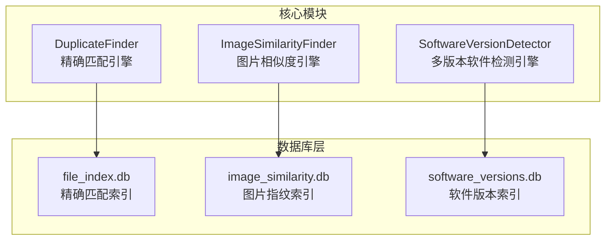
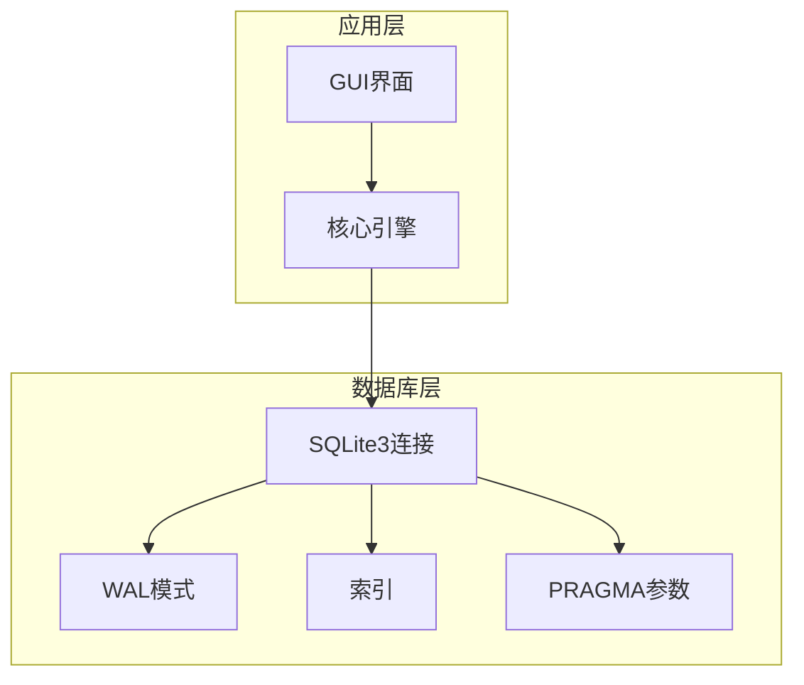
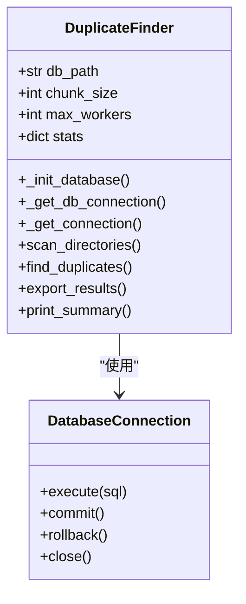
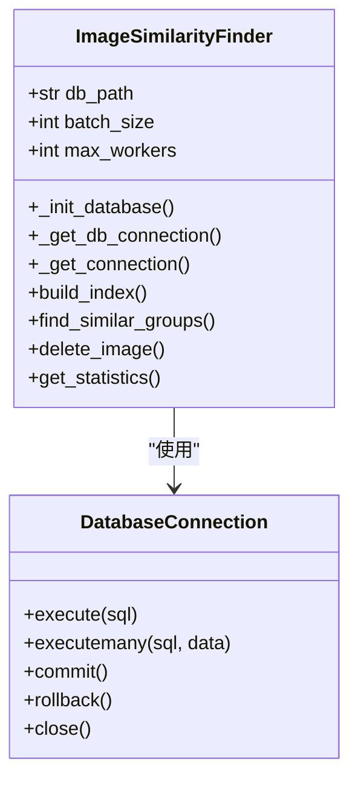
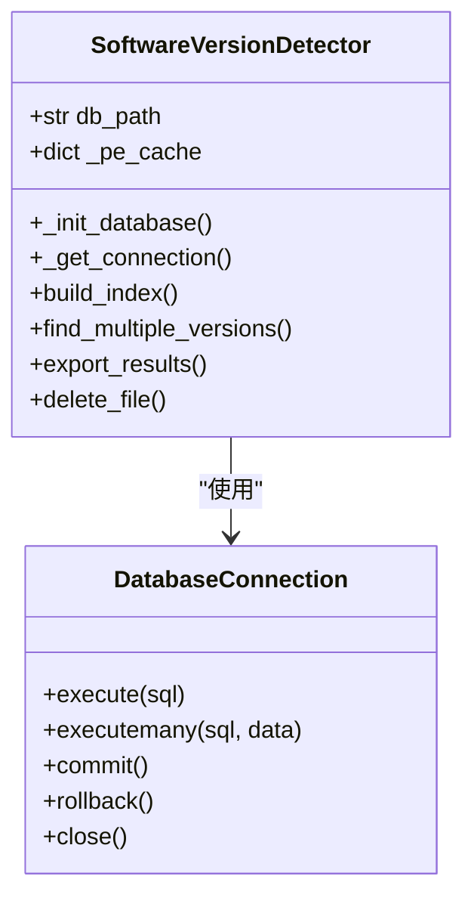
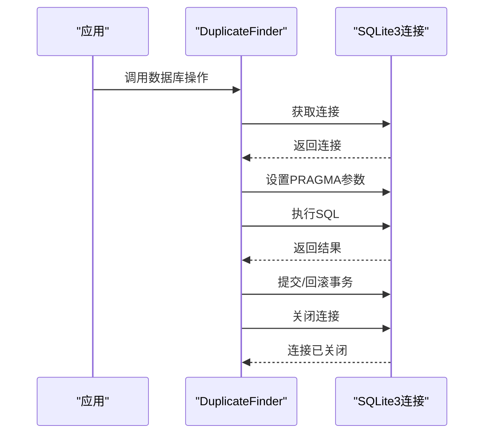
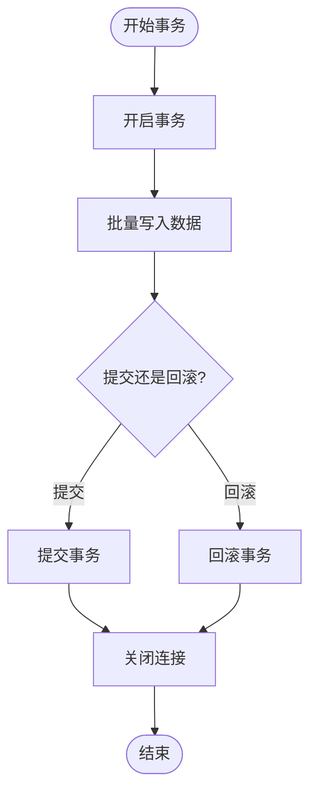
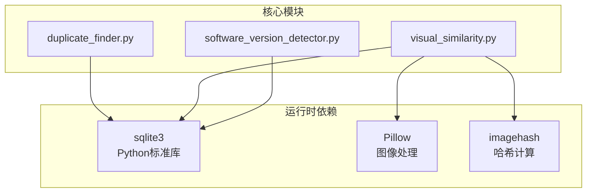

# 数据库性能优化

<cite>
**本文引用的文件**
- [duplicate_finder.py](file://core/duplicate_finder.py)
- [visual_similarity.py](file://core/visual_similarity.py)
- [software_version_detector.py](file://core/software_version_detector.py)
- [README.md](file://README.md)
- [requirements.txt](file://requirements.txt)
- [run_gui.py](file://run_gui.py)
</cite>

## 目录
1. [简介](#简介)
2. [项目结构](#项目结构)
3. [核心组件](#核心组件)
4. [架构概览](#架构概览)
5. [详细组件分析](#详细组件分析)
6. [依赖分析](#依赖分析)
7. [性能考量](#性能考量)
8. [故障排查指南](#故障排查指南)
9. [结论](#结论)
10. [附录](#附录)

## 简介
本指南聚焦于SQLite3数据库在本项目中的性能优化策略，涵盖WAL模式配置、PRAGMA参数优化、索引设计、批量操作优化、连接池与事务管理、内存映射技术应用、性能监控与瓶颈识别，以及大数据量场景下的基准测试与调优案例。通过对核心模块的深入分析，帮助读者在TB级数据规模下实现稳定高效的数据库性能表现。

## 项目结构
项目采用模块化架构，核心功能由多个独立模块组成，其中数据库相关逻辑集中在三个核心模块中：
- 精确匹配（重复文件检测）：使用SQLite3存储文件索引，支持WAL模式与批量写入优化
- 图片相似度检测：使用SQLite3存储图片指纹与直方图，支持WAL模式与索引优化
- 多版本软件检测：使用SQLite3存储软件元数据与版本分组，支持WAL模式与索引优化

**图表来源**
- [duplicate_finder.py:22-54](file://core/duplicate_finder.py#L22-L54)
- [visual_similarity.py:94-121](file://core/visual_similarity.py#L94-L121)
- [software_version_detector.py:30-95](file://core/software_version_detector.py#L30-L95)

**章节来源**
- [README.md:338-401](file://README.md#L338-L401)
- [requirements.txt:1-32](file://requirements.txt#L1-L32)

## 核心组件
本项目涉及的数据库性能优化核心组件包括：
- SQLite3连接管理：统一的连接获取与上下文管理，确保事务安全与资源回收
- PRAGMA参数优化：WAL模式、同步级别、缓存大小、临时存储、内存映射等
- 索引设计：针对查询热点字段建立索引，提升查询性能
- 批量操作优化：批量插入、批量更新，减少事务开销
- 事务处理：显式事务控制，保证数据一致性
- 内存映射技术：通过PRAGMA mmap_size启用内存映射，提升大文件读取性能

**章节来源**
- [duplicate_finder.py:56-94](file://core/duplicate_finder.py#L56-L94)
- [visual_similarity.py:123-169](file://core/visual_similarity.py#L123-L169)
- [software_version_detector.py:109-159](file://core/software_version_detector.py#L109-L159)

## 架构概览
数据库性能优化在系统中的作用与交互如下：
- 初始化阶段：在数据库连接建立后立即设置PRAGMA参数，确保后续操作具备最优性能配置
- 运行阶段：通过上下文管理器管理事务，批量写入减少事务提交次数，索引加速查询
- 维护阶段：提供数据库维护建议，包括定期VACUUM以回收空间

**图表来源**
- [duplicate_finder.py:96-113](file://core/duplicate_finder.py#L96-L113)
- [visual_similarity.py:171-188](file://core/visual_similarity.py#L171-L188)
- [software_version_detector.py:171-188](file://core/software_version_detector.py#L171-L188)

## 详细组件分析

### 精确匹配引擎（DuplicateFinder）
该引擎专注于TB级数据的重复文件检测，数据库层面的关键优化点包括：
- WAL模式：提升并发读写性能，减少锁争用
- 同步级别：NORMAL降低同步频率，提升写入吞吐
- 缓存大小：设置较大的缓存以提升查询与写入性能
- 临时存储：将临时表存储在内存，减少磁盘I/O
- 内存映射：启用内存映射以提升大文件读取性能
- 索引设计：针对文件大小、部分哈希、完整哈希、扫描状态建立索引
- 批量写入：批量插入文件记录，减少事务提交次数
- 事务管理：使用上下文管理器确保事务完整性

**图表来源**
- [duplicate_finder.py:22-54](file://core/duplicate_finder.py#L22-L54)
- [duplicate_finder.py:96-113](file://core/duplicate_finder.py#L96-L113)

**章节来源**
- [duplicate_finder.py:56-94](file://core/duplicate_finder.py#L56-L94)
- [duplicate_finder.py:109-113](file://core/duplicate_finder.py#L109-L113)
- [duplicate_finder.py:220-228](file://core/duplicate_finder.py#L220-L228)

### 图片相似度引擎（ImageSimilarityFinder）
该引擎基于感知哈希、差异哈希与颜色直方图进行相似度检测，数据库层面的优化策略：
- WAL模式与同步级别：提升并发性能与写入吞吐
- 缓存与临时存储：优化内存使用与I/O性能
- 内存映射：提升大图片处理时的读取性能
- 索引设计：针对pHash、dHash、尺寸、路径建立索引
- 批量写入：批量插入图片指纹，减少事务开销
- 事务管理：上下文管理器确保事务一致性

**图表来源**
- [visual_similarity.py:94-121](file://core/visual_similarity.py#L94-L121)
- [visual_similarity.py:171-188](file://core/visual_similarity.py#L171-L188)

**章节来源**
- [visual_similarity.py:123-169](file://core/visual_similarity.py#L123-L169)
- [visual_similarity.py:184-188](file://core/visual_similarity.py#L184-L188)
- [visual_similarity.py:313-333](file://core/visual_similarity.py#L313-L333)

### 多版本软件检测引擎（SoftwareVersionDetector）
该引擎用于识别同一软件的多个版本，数据库层面的优化要点：
- WAL模式与同步级别：提升并发与写入性能
- 缓存与临时存储：优化内存使用
- 索引设计：针对软件键、文件哈希、安装路径建立索引
- 批量写入：批量插入软件元数据，减少事务开销
- 事务管理：上下文管理器确保事务一致性

**图表来源**
- [software_version_detector.py:30-95](file://core/software_version_detector.py#L30-L95)
- [software_version_detector.py:171-188](file://core/software_version_detector.py#L171-L188)

**章节来源**
- [software_version_detector.py:109-159](file://core/software_version_detector.py#L109-L159)
- [software_version_detector.py:411-478](file://core/software_version_detector.py#L411-L478)

### 数据库连接池管理
本项目未实现专用的连接池，而是采用轻量级的连接管理策略：
- 连接获取：每次操作时创建新的连接，确保线程安全
- 上下文管理：使用上下文管理器自动提交或回滚事务，并关闭连接
- 超时设置：为连接设置超时时间，避免长时间阻塞
- WAL模式：在连接建立后立即设置WAL模式，提升并发性能

**图表来源**
- [duplicate_finder.py:96-113](file://core/duplicate_finder.py#L96-L113)

**章节来源**
- [duplicate_finder.py:96-113](file://core/duplicate_finder.py#L96-L113)
- [visual_similarity.py:171-188](file://core/visual_similarity.py#L171-L188)
- [software_version_detector.py:171-188](file://core/software_version_detector.py#L171-L188)

### 事务处理优化
事务处理是数据库性能优化的关键环节：
- 显式事务：使用上下文管理器确保事务完整性
- 批量提交：减少事务提交次数，提升写入吞吐
- 错误处理：异常时自动回滚，保证数据一致性
- 连接复用：在同一事务中复用连接，减少连接开销

**图表来源**
- [duplicate_finder.py:96-107](file://core/duplicate_finder.py#L96-L107)
- [visual_similarity.py:171-182](file://core/visual_similarity.py#L171-L182)
- [software_version_detector.py:171-188](file://core/software_version_detector.py#L171-L188)

**章节来源**
- [duplicate_finder.py:96-107](file://core/duplicate_finder.py#L96-L107)
- [visual_similarity.py:171-182](file://core/visual_similarity.py#L171-L182)
- [software_version_detector.py:171-188](file://core/software_version_detector.py#L171-L188)

### 内存映射技术应用
内存映射技术通过PRAGMA mmap_size启用，适用于大文件读取场景：
- 256MB内存映射：显著提升大文件读取性能
- WAL模式配合：在并发环境下进一步提升性能
- 适用场景：大图片、大文件索引等场景

**章节来源**
- [duplicate_finder.py:66-66](file://core/duplicate_finder.py#L66-L66)
- [visual_similarity.py:132-132](file://core/visual_similarity.py#L132-L132)
- [software_version_detector.py:117-117](file://core/software_version_detector.py#L117-L117)

### 索引设计与批量操作优化
索引设计与批量操作是提升查询与写入性能的核心策略：
- 索引设计：针对查询热点字段建立索引，如文件大小、部分哈希、完整哈希、扫描状态、pHash、dHash、尺寸、路径等
- 批量写入：批量插入文件记录、图片指纹、软件元数据，减少事务提交次数
- 批处理大小：根据数据规模调整批处理大小，平衡内存占用与性能

**章节来源**
- [duplicate_finder.py:87-91](file://core/duplicate_finder.py#L87-L91)
- [visual_similarity.py:151-155](file://core/visual_similarity.py#L151-L155)
- [software_version_detector.py:152-156](file://core/software_version_detector.py#L152-L156)
- [duplicate_finder.py:160-161](file://core/duplicate_finder.py#L160-L161)
- [visual_similarity.py:297-309](file://core/visual_similarity.py#L297-L309)
- [software_version_detector.py:411-473](file://core/software_version_detector.py#L411-L473)

## 依赖分析
数据库性能优化相关的依赖关系：
- Python标准库：sqlite3提供SQLite3支持，无需额外依赖
- 可选依赖：Pillow、imagehash用于图片处理与哈希计算
- 运行时依赖：GUI界面通过run_gui.py启动，核心功能在core模块中实现

**图表来源**
- [requirements.txt:1-32](file://requirements.txt#L1-L32)
- [run_gui.py:13-25](file://run_gui.py#L13-L25)

**章节来源**
- [requirements.txt:1-32](file://requirements.txt#L1-L32)
- [run_gui.py:13-25](file://run_gui.py#L13-L25)

## 性能考量
基于项目实现的性能优化策略总结：
- WAL模式：提升并发读写性能，减少锁争用
- 同步级别：NORMAL降低同步频率，提升写入吞吐
- 缓存大小：设置较大的缓存以提升查询与写入性能
- 临时存储：将临时表存储在内存，减少磁盘I/O
- 内存映射：启用内存映射以提升大文件读取性能
- 索引设计：针对查询热点字段建立索引
- 批量操作：批量插入与批量更新，减少事务开销
- 事务管理：上下文管理器确保事务完整性
- 数据库维护：定期VACUUM回收空间，保持数据库健康

**章节来源**
- [README.md:548-556](file://README.md#L548-L556)
- [duplicate_finder.py:61-66](file://core/duplicate_finder.py#L61-L66)
- [visual_similarity.py:128-133](file://core/visual_similarity.py#L128-L133)
- [software_version_detector.py:114-118](file://core/software_version_detector.py#L114-L118)

## 故障排查指南
常见数据库性能问题与排查方法：
- 数据库文件过大：定期执行VACUUM命令回收空间
- 查询性能下降：检查索引是否合理，必要时重建索引
- 写入性能不佳：检查WAL模式是否启用，同步级别是否合适
- 内存不足：调整缓存大小与批处理大小，避免内存溢出
- 事务冲突：检查事务边界，避免长时间持有锁

**章节来源**
- [README.md:548-556](file://README.md#L548-L556)

## 结论
本项目在SQLite3数据库性能优化方面采用了系统性的策略，包括WAL模式配置、PRAGMA参数优化、索引设计、批量操作优化、事务处理优化与内存映射技术应用。通过这些优化，项目能够在TB级数据规模下实现稳定的性能表现。建议在实际部署中结合硬件条件与业务需求，持续监控数据库性能指标，适时调整优化策略。

## 附录
- 大数据量场景下的性能基准测试与调优案例可参考项目README中的基准测试数据与参数调优建议
- 数据库维护建议包括定期VACUUM、索引重建、监控数据库文件大小等

**章节来源**
- [README.md:470-517](file://README.md#L470-L517)