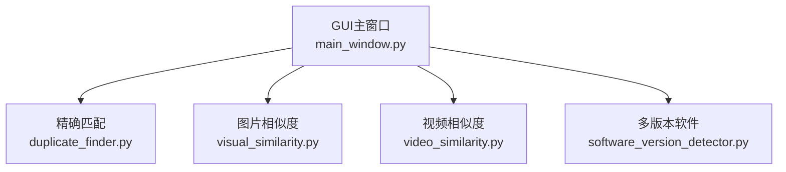
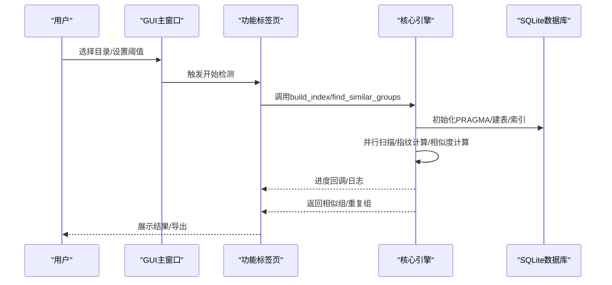
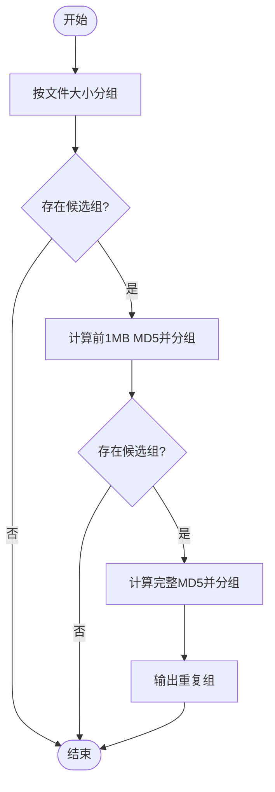
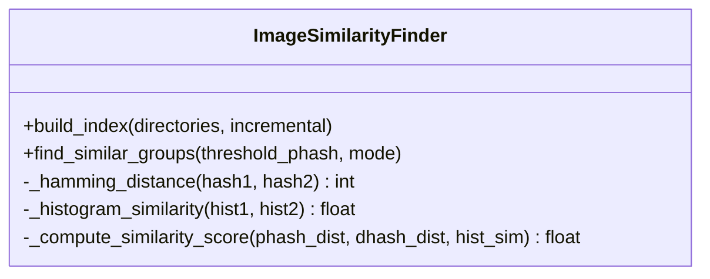
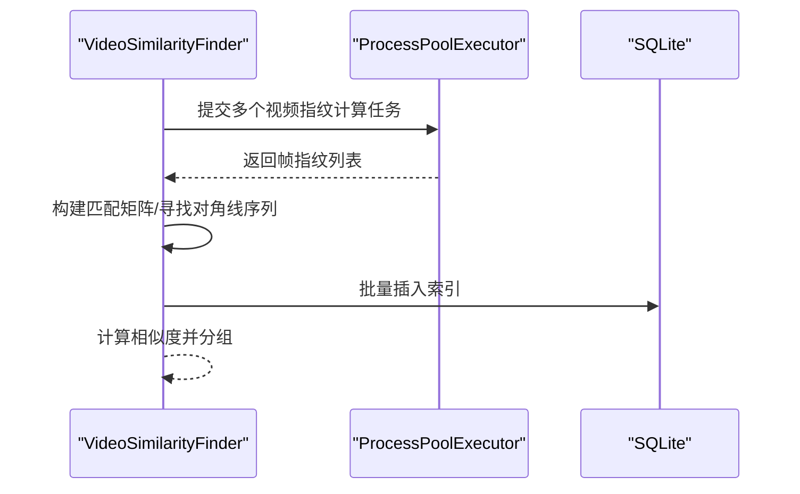
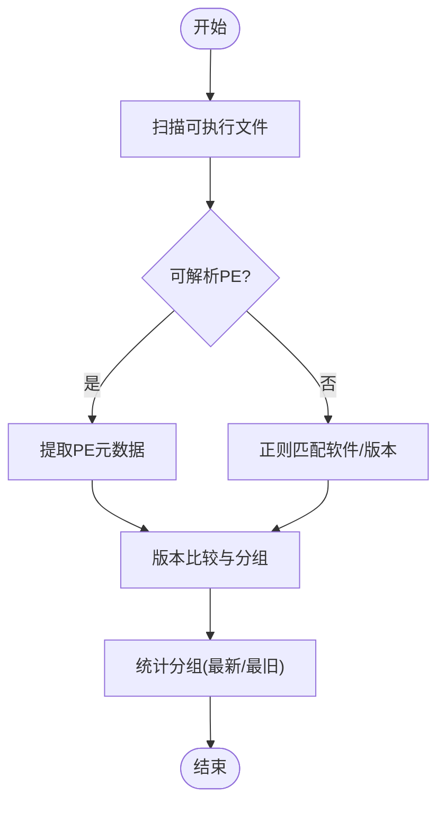
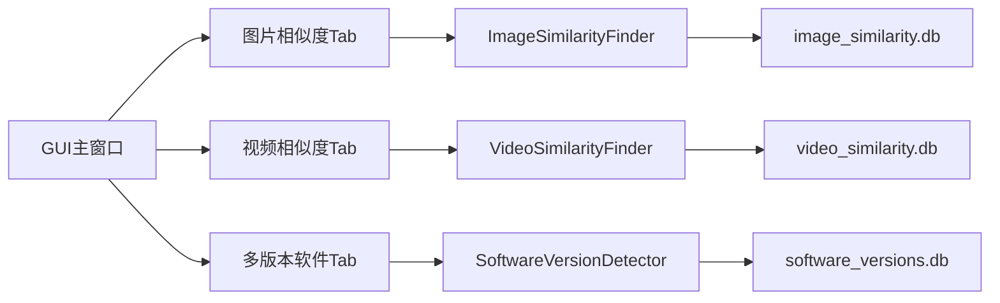

# 算法性能优化

<cite>
**本文引用的文件**
- [duplicate_finder.py](file://core/duplicate_finder.py)
- [visual_similarity.py](file://core/visual_similarity.py)
- [video_similarity.py](file://core/video_similarity.py)
- [software_version_detector.py](file://core/software_version_detector.py)
- [main_window.py](file://gui_modules/main_window.py)
- [similarity_tab.py](file://gui_modules/similarity_tab.py)
- [video_similarity_tab.py](file://gui_modules/video_similarity_tab.py)
- [software_version_tab.py](file://gui_modules/software_version_tab.py)
</cite>

## 目录
1. [简介](#简介)
2. [项目结构](#项目结构)
3. [核心组件](#核心组件)
4. [架构总览](#架构总览)
5. [详细组件分析](#详细组件分析)
6. [依赖关系分析](#依赖关系分析)
7. [性能考量与优化建议](#性能考量与优化建议)
8. [故障排查指南](#故障排查指南)
9. [结论](#结论)
10. [附录：不同数据规模下的性能对比与最佳实践](#附录不同数据规模下的性能对比与最佳实践)

## 简介
本指南聚焦于该仓库中四大核心算法模块的性能优化：多级哈希策略（重复文件检测）、感知哈希与直方图相似度（图片相似）、视频关键帧序列匹配（视频相似）、以及软件版本识别与比较（多版本软件）。文档从系统架构、数据流、处理逻辑出发，深入剖析各模块的算法复杂度、时间/空间优化点、缓存与预计算策略，并给出在不同数据规模下的性能对比与最佳实践。

## 项目结构
- core：核心算法与引擎
  - duplicate_finder.py：基于文件大小分组 + 部分哈希 + 完整哈希的多级去重
  - visual_similarity.py：图片相似度（pHash/dHash/颜色直方图）
  - video_similarity.py：视频相似度（关键帧提取 + pHash序列比对）
  - software_version_detector.py：可执行文件元数据解析与版本识别、比较
- gui_modules：图形界面与交互控制
  - main_window.py：主窗口与标签页编排
  - similarity_tab.py / video_similarity_tab.py / software_version_tab.py：对应功能的配置、进度、结果展示

图表来源
- [main_window.py:62-85](file://gui_modules/main_window.py#L62-L85)
- [duplicate_finder.py:25-73](file://core/duplicate_finder.py#L25-L73)
- [visual_similarity.py:94-121](file://core/visual_similarity.py#L94-L121)
- [video_similarity.py:174-203](file://core/video_similarity.py#L174-L203)
- [software_version_detector.py:30-95](file://core/software_version_detector.py#L30-L95)

章节来源
- [main_window.py:62-85](file://gui_modules/main_window.py#L62-L85)

## 核心组件
- 重复文件检测器：采用“大小分组 → 前1MB部分哈希 → 完整MD5”三级过滤，结合SQLite索引与并行I/O，适合TB级数据。
- 图片相似度检测器：三级过滤（pHash快速筛选 → dHash二次验证 → 直方图余弦相似度），支持快速/精确模式，批量写入数据库。
- 视频相似度检测器：按时长自适应采样关键帧，计算每帧pHash/dhash，构建匹配矩阵寻找对角线连续片段，综合评分判定相似组。
- 多版本软件检测器：PE元数据提取 + 文件名/路径正则识别 + 版本号比较，增量索引与分组统计。

章节来源
- [duplicate_finder.py:324-387](file://core/duplicate_finder.py#L324-L387)
- [visual_similarity.py:410-513](file://core/visual_similarity.py#L410-L513)
- [video_similarity.py:498-545](file://core/video_similarity.py#L498-L545)
- [software_version_detector.py:246-316](file://core/software_version_detector.py#L246-L316)

## 架构总览
整体流程：GUI负责用户输入与状态管理；各Tab将参数传递给对应的Core引擎；引擎通过SQLite持久化索引，使用多线程/多进程并发处理I/O密集型任务；最终输出结果供UI展示或导出。

图表来源
- [main_window.py:165-179](file://gui_modules/main_window.py#L165-L179)
- [duplicate_finder.py:133-175](file://core/duplicate_finder.py#L133-L175)
- [visual_similarity.py:253-311](file://core/visual_similarity.py#L253-L311)
- [video_similarity.py:310-367](file://core/video_similarity.py#L310-L367)
- [software_version_detector.py:391-481](file://core/software_version_detector.py#L391-L481)

## 详细组件分析

### 重复文件检测（多级哈希策略）
- 算法流程
  - 第1级：按文件大小分组，仅保留size出现次数>1的候选组
  - 第2级：对候选文件读取前1MB计算MD5，组合size+partial_hash作为键再次分组
  - 第3级：对剩余候选计算完整MD5，确认重复组
- 复杂度分析
  - 文件大小分组：O(N)
  - 部分哈希：O(K·M)，K为候选文件数，M=1MB
  - 完整哈希：O(R·S)，R为进入第三级的文件数，S为文件大小
  - 总体近似O(N + K·M + R·S)，在大规模数据下显著减少全量哈希开销
- 性能优化
  - SQLite PRAGMA优化（WAL、同步频率、缓存、内存映射）
  - 批量插入（batch_size=5000）降低事务次数
  - 线程池并行计算哈希，自动根据磁盘类型调整工作线程数（HDD限制至≤4，SSD可达CPU核数×2上限16）
  - 进度更新节流（每500/100次更新一次）
  - 流式JSON导出避免内存峰值
- 关键实现位置
  - 多级哈希流程：[duplicate_finder.py:324-387](file://core/duplicate_finder.py#L324-L387)
  - 部分哈希并行：[duplicate_finder.py:436-504](file://core/duplicate_finder.py#L436-L504)
  - 完整哈希并行：[duplicate_finder.py:506-595](file://core/duplicate_finder.py#L506-L595)
  - 数据库优化与索引：[duplicate_finder.py:133-175](file://core/duplicate_finder.py#L133-L175)

图表来源
- [duplicate_finder.py:324-387](file://core/duplicate_finder.py#L324-L387)
- [duplicate_finder.py:436-504](file://core/duplicate_finder.py#L436-L504)
- [duplicate_finder.py:506-595](file://core/duplicate_finder.py#L506-L595)

章节来源
- [duplicate_finder.py:324-387](file://core/duplicate_finder.py#L324-L387)
- [duplicate_finder.py:436-504](file://core/duplicate_finder.py#L436-L504)
- [duplicate_finder.py:506-595](file://core/duplicate_finder.py#L506-L595)
- [duplicate_finder.py:133-175](file://core/duplicate_finder.py#L133-L175)

### 图片相似度（感知哈希与直方图）
- 算法流程
  - 预处理：统一RGB、超大图缩放、计算pHash(8x8)、dHash(8x8)、颜色直方图（768bin）
  - 三级过滤：pHash汉明距离≤阈值 → dHash汉明距离验证 → 直方图余弦相似度≥0.75
  - 综合评分：加权平均得到最终相似度分数
- 复杂度分析
  - 指纹计算：O(W·H)（图像像素级操作），但受限于最大尺寸裁剪
  - 两两比对：O(N^2)（N为图片数），通过阈值提前剪枝降低常数因子
- 性能优化
  - 多进程并行计算指纹（ProcessPoolExecutor，最多8进程）
  - 批量写入数据库（batch_size=1000）
  - 快速模式仅用pHash，精确模式启用dHash+直方图
  - 数据库PRAGMA优化与索引（phash/dhash/size/path）
- 关键实现位置
  - 指纹计算：[visual_similarity.py:21-91](file://core/visual_similarity.py#L21-L91)
  - 相似度计算与分组：[visual_similarity.py:410-513](file://core/visual_similarity.py#L410-L513)
  - 直方图相似度：[visual_similarity.py:351-377](file://core/visual_similarity.py#L351-L377)

图表来源
- [visual_similarity.py:94-121](file://core/visual_similarity.py#L94-L121)
- [visual_similarity.py:410-513](file://core/visual_similarity.py#L410-L513)

章节来源
- [visual_similarity.py:21-91](file://core/visual_similarity.py#L21-L91)
- [visual_similarity.py:410-513](file://core/visual_similarity.py#L410-L513)
- [visual_similarity.py:351-377](file://core/visual_similarity.py#L351-L377)

### 视频相似度（关键帧提取与序列匹配）
- 算法流程
  - 动态采样：根据视频时长确定采样帧数（短视频5帧，长视频最多50帧）
  - 关键帧指纹：每帧计算pHash/dHash，记录时间戳
  - 匹配矩阵：以pHash汉明距离阈值构建二元矩阵，寻找长度≥2的对角线连续片段
  - 相似度评分：Jaccard相似度与时间覆盖率加权综合
- 复杂度分析
  - 关键帧提取：O(F·W·H)，F为采样帧数
  - 匹配矩阵：O(F1·F2)
  - 对角线搜索：O(F1·F2)
- 性能优化
  - 多进程并行指纹计算（ProcessPoolExecutor，最多4进程，考虑解码I/O密集）
  - 批量插入数据库（batch_size=100）
  - 数据库PRAGMA优化与索引（duration/size/path）
  - 阈值可调（默认汉明距离≤12）
- 关键实现位置
  - 指纹计算：[video_similarity.py:21-151](file://core/video_similarity.py#L21-L151)
  - 相似度计算与分组：[video_similarity.py:498-545](file://core/video_similarity.py#L498-L545)
  - 数据库与索引：[video_similarity.py:205-239](file://core/video_similarity.py#L205-L239)

图表来源
- [video_similarity.py:310-367](file://core/video_similarity.py#L310-L367)
- [video_similarity.py:498-545](file://core/video_similarity.py#L498-L545)

章节来源
- [video_similarity.py:21-151](file://core/video_similarity.py#L21-L151)
- [video_similarity.py:498-545](file://core/video_similarity.py#L498-L545)
- [video_similarity.py:205-239](file://core/video_similarity.py#L205-L239)

### 多版本软件检测（版本识别与比较）
- 算法流程
  - 扫描可执行文件（.exe/.dll/.msi/.jar/.pyd等）
  - 提取PE元数据（公司名、产品名、版本信息）
  - 若无可解析PE，则通过文件名/路径正则匹配软件身份与版本
  - 使用packaging.version进行版本比较，统计分组（最新/最旧版本）
- 复杂度分析
  - 扫描：O(N)
  - PE解析：O(P)，P为元数据条目数量
  - 版本比较：O(V log V)（排序找极值）
- 性能优化
  - 增量扫描：基于path+hash判断是否已处理
  - LRU缓存PE信息（最大1000条）
  - 批量提交数据库事务（每批100个）
  - 数据库PRAGMA优化与索引（software_key/file_hash/install_path/version_count）
- 关键实现位置
  - PE信息提取与缓存：[software_version_detector.py:178-244](file://core/software_version_detector.py#L178-L244)
  - 软件识别与版本比较：[software_version_detector.py:246-354](file://core/software_version_detector.py#L246-L354)
  - 索引构建与分组：[software_version_detector.py:391-526](file://core/software_version_detector.py#L391-L526)

图表来源
- [software_version_detector.py:246-354](file://core/software_version_detector.py#L246-L354)
- [software_version_detector.py:391-526](file://core/software_version_detector.py#L391-L526)

章节来源
- [software_version_detector.py:178-244](file://core/software_version_detector.py#L178-L244)
- [software_version_detector.py:246-354](file://core/software_version_detector.py#L246-L354)
- [software_version_detector.py:391-526](file://core/software_version_detector.py#L391-L526)

## 依赖关系分析
- GUI层依赖各Tab模块，Tab模块再按需导入Core引擎，避免启动时加载重型依赖（如OpenCV、imagehash）导致冷启动慢。
- Core引擎之间相互独立，分别维护各自的SQLite数据库与索引，解耦清晰。
- 外部依赖：
  - OpenCV/PIL/imagehash用于视频/图片处理
  - pefile用于PE元数据解析
  - packaging.version用于版本比较

图表来源
- [main_window.py:62-85](file://gui_modules/main_window.py#L62-L85)
- [visual_similarity.py:94-121](file://core/visual_similarity.py#L94-L121)
- [video_similarity.py:174-203](file://core/video_similarity.py#L174-L203)
- [software_version_detector.py:30-95](file://core/software_version_detector.py#L30-L95)

章节来源
- [main_window.py:62-85](file://gui_modules/main_window.py#L62-L85)

## 性能考量与优化建议
- I/O与并发
  - 重复文件检测：根据磁盘类型自适应线程数（HDD≤4，SSD≤16），批量插入5000条/批，减少事务开销
  - 图片/视频指纹：多进程并行，注意进程间通信与内存占用；视频解码I/O密集，限制进程数（≤4）
- 数据库优化
  - 统一启用WAL模式、NORMAL同步、64MB缓存、256MB内存映射
  - 针对查询热点字段建立索引（size、phash、dhash、duration、path等）
- 算法选择与阈值调优
  - 图片相似度：快速模式（仅pHash）适合海量数据初筛；精确模式加入dHash+直方图提升准确率
  - 视频相似度：阈值12为平衡点，可根据场景调整（严格/宽松）
- 缓存与预计算
  - 软件版本检测：LRU缓存PE信息（上限1000），避免重复解析
  - 图片/视频：指纹结果持久化到数据库，支持增量扫描
- 内存与流式处理
  - 重复文件导出采用流式JSON写入，避免一次性构建大对象
  - 超大图片缩放至4096px以内，防止内存溢出
- 进度与用户体验
  - 进度更新节流（每固定数量更新一次），降低UI刷新开销

[本节为通用性能指导，不直接分析具体代码行]

## 故障排查指南
- 常见错误与定位
  - 缺少依赖库（OpenCV/PIL/imagehash/pefile）：检查pip安装与环境变量
  - 无法打开视频文件：确认格式支持与权限
  - 数据库锁定：检查PRAGMA busy_timeout与并发写入冲突
  - 路径编码问题：Windows GBK/UTF-8切换，必要时使用errors='replace'
- 调试建议
  - 查看日志回调输出，定位失败步骤
  - 逐步关闭并行（单线程/单进程）复现问题
  - 检查数据库表结构与索引是否存在

章节来源
- [video_similarity.py:40-49](file://core/video_similarity.py#L40-L49)
- [duplicate_finder.py:190-201](file://core/duplicate_finder.py#L190-L201)
- [duplicate_finder.py:389-401](file://core/duplicate_finder.py#L389-L401)

## 结论
该仓库在四个核心算法模块上实现了面向TB级数据的性能优化：通过多级哈希、感知哈希与直方图、关键帧序列匹配、以及PE元数据解析与版本比较，结合SQLite优化、并行I/O、批量写入与缓存机制，有效降低了时间与空间复杂度，提升了吞吐与稳定性。针对不同数据规模与场景，可通过调整阈值、模式与并发参数获得更优表现。

[本节为总结性内容，不直接分析具体代码行]

## 附录：不同数据规模下的性能对比与最佳实践
- 小数据（<1万文件/图片/视频）
  - 推荐：快速模式（图片）、阈值12（视频）、单进程/线程即可满足
  - 数据库：常规PRAGMA即可
- 中数据（1万~100万）
  - 推荐：精确模式（图片）、阈值12（视频）、多进程并行（图片≤8，视频≤4）
  - 数据库：启用WAL、索引完善、批量写入
- 大数据（>100万）
  - 推荐：多级哈希（重复文件）、分阶段筛选（大小→部分哈希→完整哈希）
  - 并发：根据磁盘类型调整线程/进程数，避免HDD寻道风暴
  - 存储：流式导出、增量扫描、LRU缓存
- 最佳实践
  - 先粗后精：先用低成本特征（大小/pHash）快速剪枝，再进行高成本计算（完整哈希/直方图/序列匹配）
  - 合理阈值：根据业务容忍度调整汉明距离阈值，平衡召回率与误报率
  - 监控与调优：关注CPU/IO利用率、数据库锁等待、内存峰值，动态调整批次大小与并发度

[本节为通用指导，不直接分析具体代码行]