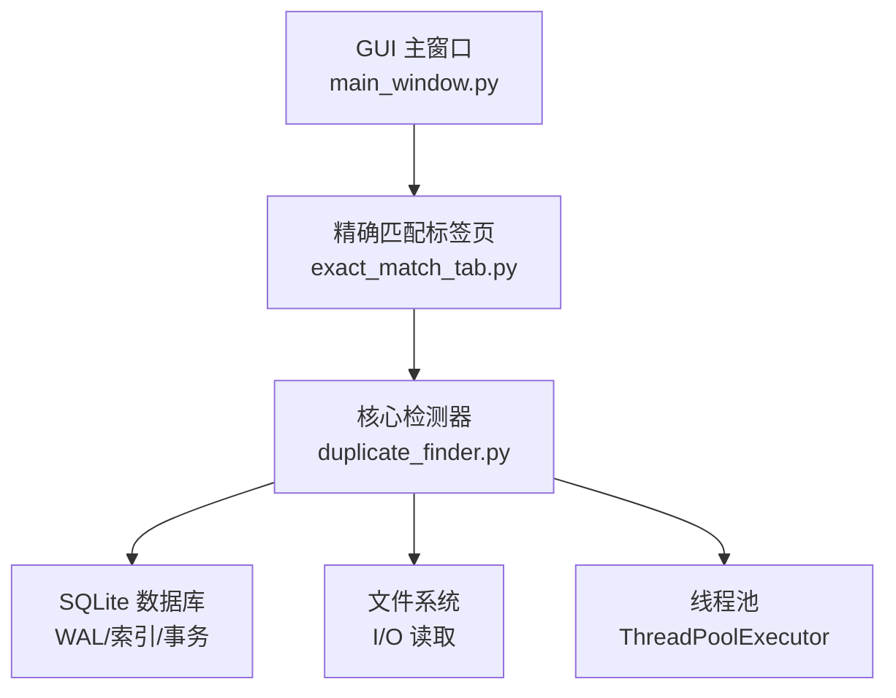
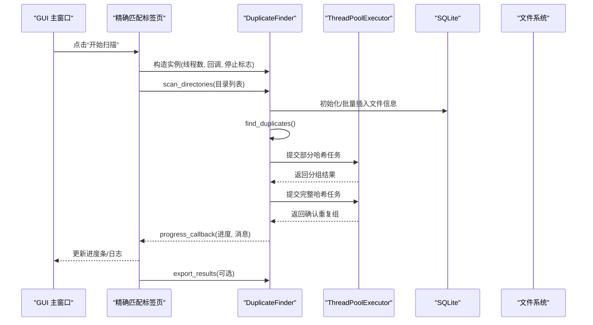
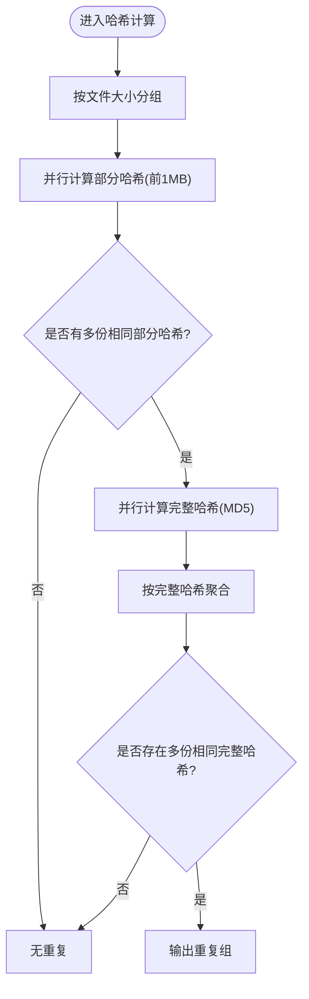
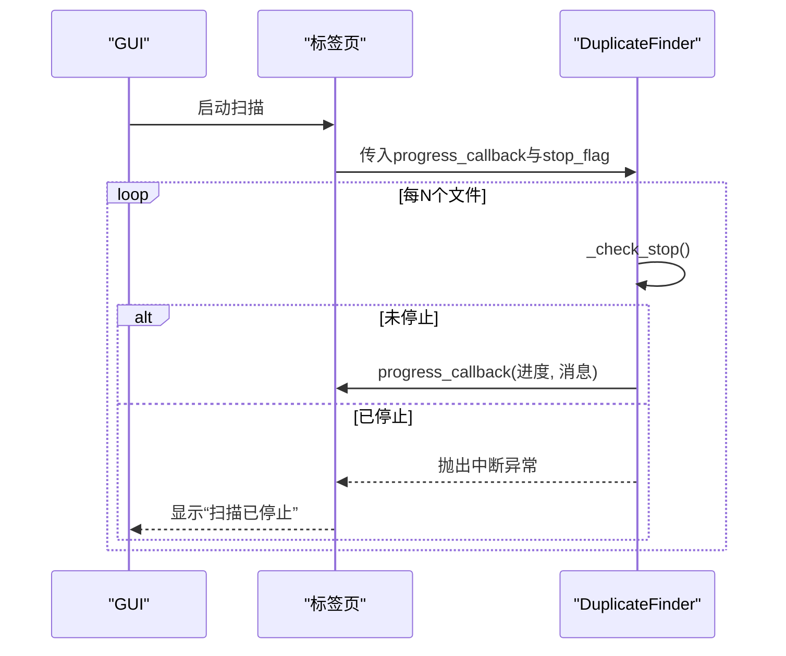
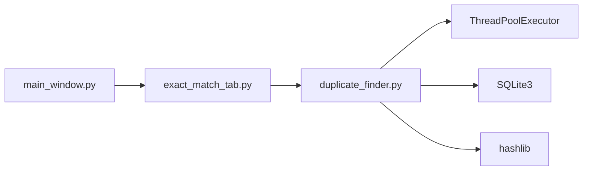

# 并行处理机制

<cite>
**本文引用的文件**
- [core/duplicate_finder.py](file://core/duplicate_finder.py)
- [gui_modules/main_window.py](file://gui_modules/main_window.py)
- [gui_modules/exact_match_tab.py](file://gui_modules/exact_match_tab.py)
- [README.md](file://README.md)
</cite>

## 目录
1. [简介](#简介)
2. [项目结构](#项目结构)
3. [核心组件](#核心组件)
4. [架构总览](#架构总览)
5. [详细组件分析](#详细组件分析)
6. [依赖关系分析](#依赖关系分析)
7. [性能考量与基准](#性能考量与基准)
8. [故障排查指南](#故障排查指南)
9. [结论](#结论)
10. [附录：最佳实践与常见陷阱](#附录最佳实践与常见陷阱)

## 简介
本技术文档聚焦于“文件重复校验工具”中的并行处理机制，围绕多线程并行计算、线程池配置与任务调度策略展开，解释 GIL（全局解释器锁）对 Python 多线程的影响及应对方案；同时说明进度回调机制与停止标志的实现方式，并给出性能基准、线程数优化策略与资源竞争避免方法。目标是帮助读者理解如何在 I/O 密集型场景下高效利用系统资源，并在 GUI 应用中安全地驱动后台任务。

## 项目结构
本项目采用分层组织：GUI 层负责用户交互与状态管理，核心引擎层实现文件扫描、哈希计算与结果导出，数据存储通过 SQLite 进行索引与查询。并行计算主要位于核心引擎的哈希计算阶段，使用线程池并发读取文件并计算哈希值。

图表来源
- [gui_modules/main_window.py:22-85](file://gui_modules/main_window.py#L22-L85)
- [gui_modules/exact_match_tab.py:18-113](file://gui_modules/exact_match_tab.py#L18-L113)
- [core/duplicate_finder.py:25-73](file://core/duplicate_finder.py#L25-L73)

章节来源
- [gui_modules/main_window.py:22-85](file://gui_modules/main_window.py#L22-L85)
- [gui_modules/exact_match_tab.py:18-113](file://gui_modules/exact_match_tab.py#L18-L113)
- [core/duplicate_finder.py:25-73](file://core/duplicate_finder.py#L25-L73)

## 核心组件
- DuplicateFinder：核心检测器，负责目录扫描、多级哈希筛选、并行计算与结果导出。
- ThreadPoolExecutor：用于并行执行部分哈希与完整哈希计算，提升 I/O 吞吐。
- 进度回调与停止标志：通过回调函数更新 UI 进度，通过 threading.Event 实现可中断的扫描流程。
- SQLite 存储：WAL 模式、索引与批量写入，降低锁争用并提高并发性能。

章节来源
- [core/duplicate_finder.py:25-73](file://core/duplicate_finder.py#L25-L73)
- [core/duplicate_finder.py:436-504](file://core/duplicate_finder.py#L436-L504)
- [core/duplicate_finder.py:506-595](file://core/duplicate_finder.py#L506-L595)
- [gui_modules/exact_match_tab.py:293-379](file://gui_modules/exact_match_tab.py#L293-L379)
- [gui_modules/main_window.py:22-85](file://gui_modules/main_window.py#L22-L85)

## 架构总览
下图展示了从 GUI 触发到核心引擎并行计算的调用序列，包括进度回调与停止标志的协作。

图表来源
- [gui_modules/exact_match_tab.py:293-379](file://gui_modules/exact_match_tab.py#L293-L379)
- [core/duplicate_finder.py:208-387](file://core/duplicate_finder.py#L208-L387)
- [core/duplicate_finder.py:436-504](file://core/duplicate_finder.py#L436-L504)
- [core/duplicate_finder.py:506-595](file://core/duplicate_finder.py#L506-L595)

## 详细组件分析

### 线程池与任务调度策略
- 部分哈希阶段：将候选文件按大小分组后，使用线程池并发读取前 1MB 数据计算 MD5，减少磁盘寻道与 I/O 等待时间。
- 完整哈希阶段：对部分哈希筛选后的候选组，再次使用线程池计算完整文件的 MD5，确保最终准确性。
- 任务提交与收集：通过 futures 字典与 as_completed 迭代，保证结果有序聚合与异常传播。
- 线程数自适应：根据 CPU 核心数与磁盘类型（HDD/SSD）自动选择最优工作线程数，避免 HDD 上的寻道风暴。

图表来源
- [core/duplicate_finder.py:436-504](file://core/duplicate_finder.py#L436-L504)
- [core/duplicate_finder.py:506-595](file://core/duplicate_finder.py#L506-L595)

章节来源
- [core/duplicate_finder.py:436-504](file://core/duplicate_finder.py#L436-L504)
- [core/duplicate_finder.py:506-595](file://core/duplicate_finder.py#L506-L595)

### 进度回调机制与停止标志
- 进度回调：在部分哈希与完整哈希阶段，周期性调用 progress_callback，传递百分比与描述性消息，GUI 侧更新进度条与状态文本。
- 停止标志：通过 threading.Event 设置 stop_flag，核心逻辑中定期检查 _check_stop，若检测到停止则抛出中断异常，终止后续任务。
- 线程安全：使用局部锁保护进度计数器，避免多线程竞态条件导致计数丢失或 UI 更新错乱。

图表来源
- [gui_modules/exact_match_tab.py:293-379](file://gui_modules/exact_match_tab.py#L293-L379)
- [core/duplicate_finder.py:203-207](file://core/duplicate_finder.py#L203-L207)
- [core/duplicate_finder.py:464-474](file://core/duplicate_finder.py#L464-L474)
- [core/duplicate_finder.py:541-550](file://core/duplicate_finder.py#L541-L550)

章节来源
- [gui_modules/exact_match_tab.py:293-379](file://gui_modules/exact_match_tab.py#L293-L379)
- [core/duplicate_finder.py:203-207](file://core/duplicate_finder.py#L203-L207)
- [core/duplicate_finder.py:464-474](file://core/duplicate_finder.py#L464-L474)
- [core/duplicate_finder.py:541-550](file://core/duplicate_finder.py#L541-L550)

### 数据库与并发写入优化
- WAL 模式与同步策略：启用 WAL 与 NORMAL 同步，降低写放大与锁冲突。
- 忙等待超时：设置 busy_timeout，避免大规模写入时出现 “database is locked”。
- 批量插入：以批次为单位写入数据库，减少事务次数与上下文切换开销。
- 索引加速：针对 size、partial_hash、full_hash、scan_status 建立索引，提升查询效率。

章节来源
- [core/duplicate_finder.py:133-175](file://core/duplicate_finder.py#L133-L175)
- [core/duplicate_finder.py:177-201](file://core/duplicate_finder.py#L177-L201)
- [core/duplicate_finder.py:312-323](file://core/duplicate_finder.py#L312-L323)

### 线程数优化策略
- 自动检测：基于 CPU 核心数与磁盘类型（HDD/SSD）动态调整 max_workers。
- HDD 限制：限制为 2-4 线程，避免磁头寻道风暴。
- SSD/NVMe 放宽：可使用更多线程（上限 16），充分利用 I/O 并发能力。
- 手动覆盖：支持命令行参数与 GUI 输入覆盖默认策略。

章节来源
- [core/duplicate_finder.py:47-55](file://core/duplicate_finder.py#L47-L55)
- [core/duplicate_finder.py:75-131](file://core/duplicate_finder.py#L75-L131)
- [gui_modules/exact_match_tab.py:63-68](file://gui_modules/exact_match_tab.py#L63-L68)

## 依赖关系分析
- GUI 层依赖核心检测器，通过回调接口解耦 UI 与计算逻辑。
- 核心检测器依赖线程池与 SQLite，形成“计算—存储”分离的架构。
- 外部依赖：hashlib、sqlite3、concurrent.futures、threading、platform、subprocess、glob 等标准库。

图表来源
- [gui_modules/main_window.py:22-85](file://gui_modules/main_window.py#L22-L85)
- [gui_modules/exact_match_tab.py:18-113](file://gui_modules/exact_match_tab.py#L18-L113)
- [core/duplicate_finder.py:25-73](file://core/duplicate_finder.py#L25-L73)

章节来源
- [gui_modules/main_window.py:22-85](file://gui_modules/main_window.py#L22-L85)
- [gui_modules/exact_match_tab.py:18-113](file://gui_modules/exact_match_tab.py#L18-L113)
- [core/duplicate_finder.py:25-73](file://core/duplicate_finder.py#L25-L73)

## 性能考量与基准
- 并行策略：I/O 密集型任务适合多线程，结合 WAL 与批量写入降低锁争用。
- 线程数调优：HDD 建议 4-8 线程，SSD 建议 8-16 线程；可根据实际负载微调。
- 进度更新频率：部分哈希每 500 文件更新一次，完整哈希每 100 文件更新一次，平衡 UI 响应与性能。
- 基准参考：项目 README 提供不同规模下的扫描时间与吞吐量数据，可作为性能评估基线。

章节来源
- [core/duplicate_finder.py:464-474](file://core/duplicate_finder.py#L464-L474)
- [core/duplicate_finder.py:541-550](file://core/duplicate_finder.py#L541-L550)
- [README.md:470-518](file://README.md#L470-L518)

## 故障排查指南
- 数据库锁定：若出现 “database is locked”，检查 busy_timeout 与 WAL 模式是否正确设置，并确保批量写入合理。
- 停止不生效：确认 stop_flag 正确传递至核心检测器，且 _check_stop 被周期性调用。
- 进度不准确：检查进度计数器是否受锁保护，避免多线程竞态导致计数丢失。
- 性能瓶颈：若磁盘为 HDD，降低线程数；若为 SSD，可适当增加线程数并增大批量大小。

章节来源
- [core/duplicate_finder.py:177-201](file://core/duplicate_finder.py#L177-L201)
- [core/duplicate_finder.py:203-207](file://core/duplicate_finder.py#L203-L207)
- [core/duplicate_finder.py:464-474](file://core/duplicate_finder.py#L464-L474)
- [core/duplicate_finder.py:541-550](file://core/duplicate_finder.py#L541-L550)

## 结论
本项目通过 ThreadPoolExecutor 实现 I/O 密集型的并行哈希计算，结合 SQLite 的 WAL 模式与批量写入，有效提升了大规模文件扫描的性能。线程数自适应策略与合理的进度更新频率，兼顾了性能与用户体验。通过停止标志与线程安全设计，实现了可中断且稳定的后台任务执行。整体架构清晰、可扩展性强，适用于 TB 级数据的去重与相似度检测场景。

## 附录：最佳实践与常见陷阱
- 最佳实践
  - 使用线程池而非手动创建线程，统一管理生命周期与资源。
  - 对共享状态（如进度计数器）加锁，避免竞态条件。
  - 合理设置批量大小与进度更新频率，平衡 I/O 与 UI 响应。
  - 根据磁盘类型与 CPU 核心数动态调整线程数。
  - 使用 WAL 与索引优化数据库并发写入与查询。
- 常见陷阱
  - 在 HDD 上开启过多线程导致寻道风暴，性能反而下降。
  - 频繁更新 UI 造成界面卡顿，应降低更新频率。
  - 未正确处理停止标志，导致任务无法及时中断。
  - 数据库未启用 WAL 或未设置忙等待超时，引发锁冲突。
  - 忽略异常处理，导致部分任务失败影响整体流程。

[本节为通用指导，不直接分析具体文件]