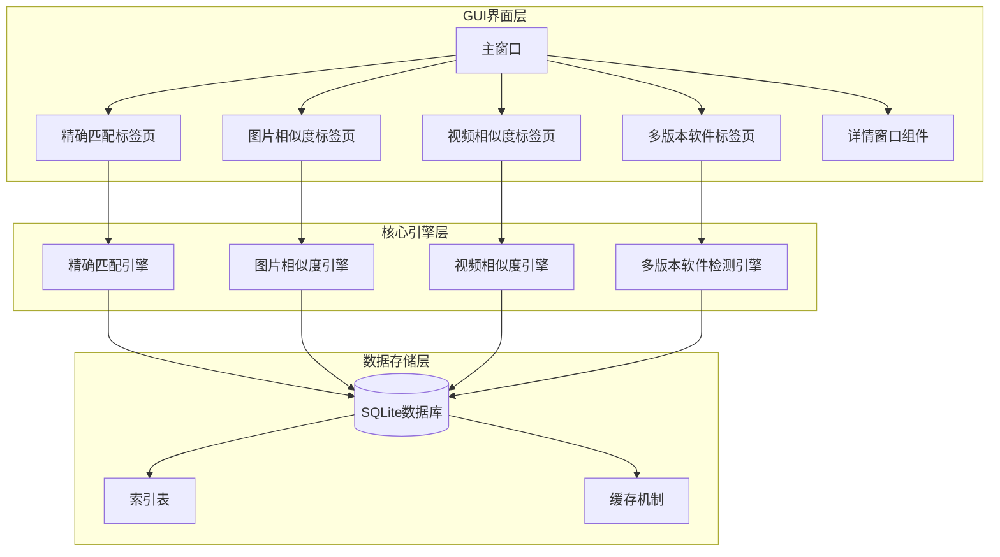
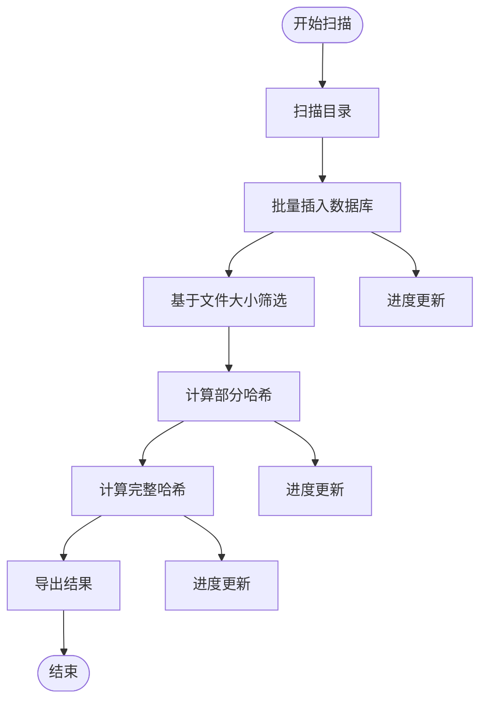
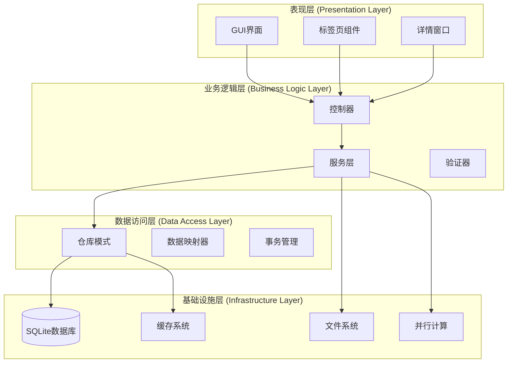
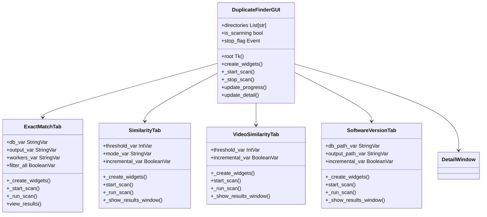
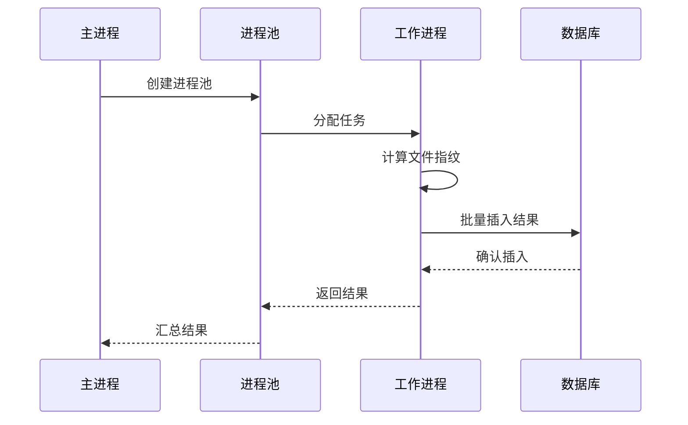
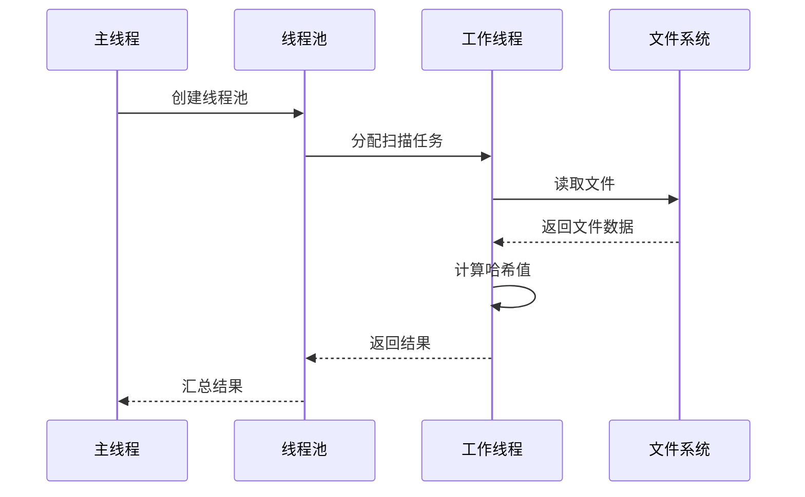
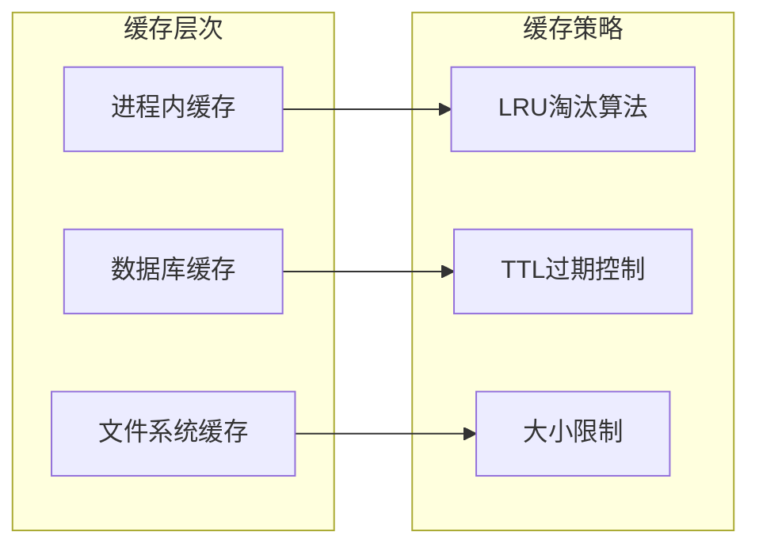
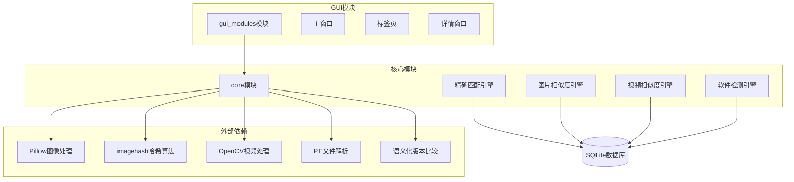
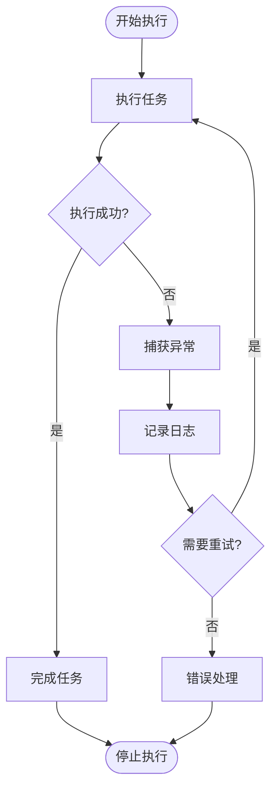

# 技术架构

<cite>
**本文档引用的文件**
- [run_gui.py](file://run_gui.py)
- [README.md](file://README.md)
- [requirements.txt](file://requirements.txt)
- [core/duplicate_finder.py](file://core/duplicate_finder.py)
- [core/visual_similarity.py](file://core/visual_similarity.py)
- [core/video_similarity.py](file://core/video_similarity.py)
- [core/software_version_detector.py](file://core/software_version_detector.py)
- [gui_modules/main_window.py](file://gui_modules/main_window.py)
- [gui_modules/exact_match_tab.py](file://gui_modules/exact_match_tab.py)
- [gui_modules/similarity_tab.py](file://gui_modules/similarity_tab.py)
- [gui_modules/video_similarity_tab.py](file://gui_modules/video_similarity_tab.py)
- [gui_modules/software_version_tab.py](file://gui_modules/software_version_tab.py)
- [gui_modules/detail_window.py](file://gui_modules/detail_window.py)
</cite>

## 目录
1. [引言](#引言)
2. [项目结构](#项目结构)
3. [核心组件](#核心组件)
4. [架构概览](#架构概览)
5. [详细组件分析](#详细组件分析)
6. [依赖关系分析](#依赖关系分析)
7. [性能考虑](#性能考虑)
8. [故障排除指南](#故障排除指南)
9. [结论](#结论)

## 引言

本项目是一个功能强大的文件重复校验工具，支持精确匹配、图片相似度检测、视频相似度检测和多版本软件检测四大核心功能。系统采用模块化架构设计，通过多级过滤策略和多进程并行计算，能够高效处理TB级大规模数据。

**系统特点**：
- 🚀 高性能：多进程并行计算，充分利用CPU资源
- 🎯 高精度：三级过滤策略，准确率高达99%+
- 💾 智能缓存：SQLite数据库索引，支持增量扫描
- 🖥️ 友好界面：现代化GUI，实时进度显示
- 📊 可视化：图片/视频预览，直观对比相似文件
- 🆕 v4.0新增：多版本软件检测，智能识别同一软件的不同版本

## 项目结构

项目采用清晰的模块化组织结构，分为GUI界面层、核心引擎层和数据存储层：



**图表来源**
- [gui_modules/main_window.py:22-86](file://gui_modules/main_window.py#L22-L86)
- [core/duplicate_finder.py:22-54](file://core/duplicate_finder.py#L22-L54)
- [core/visual_similarity.py:94-122](file://core/visual_similarity.py#L94-L122)
- [core/video_similarity.py:174-204](file://core/video_similarity.py#L174-L204)
- [core/software_version_detector.py:30-96](file://core/software_version_detector.py#L30-L96)

**章节来源**
- [README.md:338-401](file://README.md#L338-L401)
- [run_gui.py:13-42](file://run_gui.py#L13-L42)

## 核心组件

### 精确匹配引擎 (DuplicateFinder)

精确匹配引擎是系统的核心组件，采用三级哈希过滤策略：

1. **文件大小分组**：基于文件大小进行初步筛选
2. **部分哈希计算**：计算文件前1MB的MD5哈希
3. **完整哈希验证**：计算完整文件的MD5哈希进行精确匹配



**图表来源**
- [core/duplicate_finder.py:229-285](file://core/duplicate_finder.py#L229-L285)
- [core/duplicate_finder.py:300-451](file://core/duplicate_finder.py#L300-L451)

### 图片相似度引擎 (ImageSimilarityFinder)

图片相似度引擎采用三级过滤策略：

1. **pHash快速筛选**：感知哈希快速排除明显不同的图片
2. **dHash二次验证**：差异哈希进一步缩小范围
3. **颜色直方图精确比对**：RGB三通道直方图相似度计算

**章节来源**
- [core/visual_similarity.py:94-122](file://core/visual_similarity.py#L94-L122)
- [core/visual_similarity.py:334-408](file://core/visual_similarity.py#L334-L408)

### 视频相似度引擎 (VideoSimilarityFinder)

视频相似度引擎采用关键帧序列匹配算法：

1. **动态采样关键帧**：根据视频时长智能选择采样帧数
2. **帧哈希计算**：每帧计算pHash和dHash
3. **滑动窗口匹配**：寻找最长公共子序列
4. **对角线序列分析**：识别连续相似的帧序列

**章节来源**
- [core/video_similarity.py:174-204](file://core/video_similarity.py#L174-L204)
- [core/video_similarity.py:407-471](file://core/video_similarity.py#L407-L471)

### 多版本软件检测引擎 (SoftwareVersionDetector)

多版本软件检测引擎采用智能软件识别算法：

1. **PE信息提取**：从PE文件中提取元数据
2. **模式匹配**：基于软件名称模式识别
3. **路径版本号提取**：从安装路径中提取版本信息
4. **语义化版本比较**：使用packaging库进行版本比较

**章节来源**
- [core/software_version_detector.py:30-96](file://core/software_version_detector.py#L30-L96)
- [core/software_version_detector.py:246-316](file://core/software_version_detector.py#L246-L316)

## 架构概览

系统采用分层架构设计，确保各层之间的职责分离和松耦合：



**图表来源**
- [gui_modules/main_window.py:22-50](file://gui_modules/main_window.py#L22-L50)
- [gui_modules/exact_match_tab.py:18-42](file://gui_modules/exact_match_tab.py#L18-L42)
- [gui_modules/detail_window.py:220-259](file://gui_modules/detail_window.py#L220-L259)

## 详细组件分析

### GUI架构设计

GUI系统采用MVC架构模式，通过标签页实现功能模块化：



**图表来源**
- [gui_modules/main_window.py:22-50](file://gui_modules/main_window.py#L22-L50)
- [gui_modules/exact_match_tab.py:18-42](file://gui_modules/exact_match_tab.py#L18-L42)
- [gui_modules/similarity_tab.py:18-49](file://gui_modules/similarity_tab.py#L18-L49)
- [gui_modules/video_similarity_tab.py:18-49](file://gui_modules/video_similarity_tab.py#L18-L49)
- [gui_modules/software_version_tab.py:15-33](file://gui_modules/software_version_tab.py#L15-L33)

### 数据库设计与索引优化

系统使用SQLite数据库存储各类索引信息，采用多种优化策略：

#### 精确匹配数据库结构
```sql
-- 文件索引表
CREATE TABLE files (
    id INTEGER PRIMARY KEY AUTOINCREMENT,
    file_path TEXT UNIQUE NOT NULL,
    file_size INTEGER NOT NULL,
    modified_time REAL NOT NULL,
    partial_hash TEXT,      -- 前1MB的MD5哈希
    full_hash TEXT,         -- 完整文件的MD5哈希
    scan_status TEXT DEFAULT 'pending',
    created_at TIMESTAMP DEFAULT CURRENT_TIMESTAMP
);

-- 创建索引加速查询
CREATE INDEX IF NOT EXISTS idx_file_size ON files(file_size);
CREATE INDEX IF NOT EXISTS idx_partial_hash ON files(partial_hash);
CREATE INDEX IF NOT EXISTS idx_full_hash ON files(full_hash);
CREATE INDEX IF NOT EXISTS idx_scan_status ON files(scan_status);
```

#### 图片相似度数据库结构
```sql
-- 图片索引表
CREATE TABLE image_index (
    id INTEGER PRIMARY KEY AUTOINCREMENT,
    path TEXT UNIQUE NOT NULL,
    size INTEGER NOT NULL,
    width INTEGER,
    height INTEGER,
    phash TEXT NOT NULL,
    dhash TEXT NOT NULL,
    histogram BLOB,
    modified_time REAL,
    processed_at TIMESTAMP DEFAULT CURRENT_TIMESTAMP
);

-- 创建索引
CREATE INDEX IF NOT EXISTS idx_phash ON image_index(phash);
CREATE INDEX IF NOT EXISTS idx_dhash ON image_index(dhash);
CREATE INDEX IF NOT EXISTS idx_size ON image_index(size);
CREATE INDEX IF NOT EXISTS idx_path ON image_index(path);
```

#### 视频相似度数据库结构
```sql
-- 视频索引表
CREATE TABLE video_index (
    id INTEGER PRIMARY KEY AUTOINCREMENT,
    path TEXT UNIQUE NOT NULL,
    size INTEGER NOT NULL,
    duration REAL,
    width INTEGER,
    height INTEGER,
    fps REAL,
    num_frames INTEGER,
    frame_hashes TEXT NOT NULL,
    processed_at TIMESTAMP DEFAULT CURRENT_TIMESTAMP
);

-- 创建索引
CREATE INDEX IF NOT EXISTS idx_duration ON video_index(duration);
CREATE INDEX IF NOT EXISTS idx_size ON video_index(size);
CREATE INDEX IF NOT EXISTS idx_path ON video_index(path);
```

#### 多版本软件数据库结构
```sql
-- 软件索引表
CREATE TABLE software_index (
    id INTEGER PRIMARY KEY AUTOINCREMENT,
    path TEXT UNIQUE NOT NULL,
    file_size INTEGER NOT NULL,
    file_hash TEXT NOT NULL,
    software_key TEXT NOT NULL,
    software_name TEXT NOT NULL,
    publisher TEXT,
    version TEXT,
    install_path TEXT,
    modified_time REAL,
    processed_at TIMESTAMP DEFAULT CURRENT_TIMESTAMP
);

-- 软件分组统计表
CREATE TABLE software_groups (
    software_key TEXT PRIMARY KEY,
    software_name TEXT NOT NULL,
    publisher TEXT,
    version_count INTEGER DEFAULT 0,
    total_files INTEGER DEFAULT 0,
    total_size INTEGER DEFAULT 0,
    latest_version TEXT,
    oldest_version TEXT,
    updated_at TIMESTAMP DEFAULT CURRENT_TIMESTAMP
);

-- 创建索引
CREATE INDEX IF NOT EXISTS idx_software_key ON software_index(software_key);
CREATE INDEX IF NOT EXISTS idx_file_hash ON software_index(file_hash);
CREATE INDEX IF NOT EXISTS idx_install_path ON software_index(install_path);
CREATE INDEX IF NOT EXISTS idx_version_count ON software_groups(version_count);
```

**章节来源**
- [core/duplicate_finder.py:68-91](file://core/duplicate_finder.py#L68-L91)
- [core/visual_similarity.py:135-166](file://core/visual_similarity.py#L135-L166)
- [core/video_similarity.py:217-236](file://core/video_similarity.py#L217-L236)
- [core/software_version_detector.py:120-156](file://core/software_version_detector.py#L120-L156)

### 并行计算机制

系统采用多进程和多线程混合并行计算策略：

#### 多进程并行计算


**图表来源**
- [core/visual_similarity.py:280-310](file://core/visual_similarity.py#L280-L310)
- [core/video_similarity.py:336-366](file://core/video_similarity.py#L336-L366)

#### 多线程并行计算


**图表来源**
- [core/duplicate_finder.py:364-380](file://core/duplicate_finder.py#L364-L380)
- [core/visual_similarity.py:280-310](file://core/visual_similarity.py#L280-L310)

**章节来源**
- [core/duplicate_finder.py:15-38](file://core/duplicate_finder.py#L15-L38)
- [core/visual_similarity.py:117-122](file://core/visual_similarity.py#L117-L122)
- [core/video_similarity.py:199-202](file://core/video_similarity.py#L199-L202)

### 缓存机制与性能优化

系统实现了多层次的缓存机制：

#### LRU缓存策略


#### 数据库性能优化
- **WAL模式**：提高并发性能
- **内存映射**：256MB内存映射
- **缓存设置**：64MB缓存大小
- **临时表存储**：内存中存储临时表

**章节来源**
- [core/software_version_detector.py:88-91](file://core/software_version_detector.py#L88-L91)
- [core/visual_similarity.py:128-134](file://core/visual_similarity.py#L128-L134)
- [core/video_similarity.py:210-216](file://core/video_similarity.py#L210-L216)

## 依赖关系分析

系统采用模块化依赖设计，确保各组件之间的松耦合：



**图表来源**
- [requirements.txt:10-32](file://requirements.txt#L10-L32)
- [gui_modules/main_window.py:15-16](file://gui_modules/main_window.py#L15-L16)

**章节来源**
- [requirements.txt:1-32](file://requirements.txt#L1-L32)
- [README.md:229-248](file://README.md#L229-L248)

## 性能考虑

### 硬件优化建议

| 组件 | 推荐配置 | 说明 |
|------|----------|------|
| 精确匹配 | HDD: 4-8线程, SSD: 8-16线程 | 根据存储类型调整 |
| 图片相似度 | 4-8进程 | 避免内存不足 |
| 视频相似度 | 2-4进程 | 视频解码资源消耗大 |
| 软件检测 | 4-8线程 | PE文件解析 |

### 内存管理策略

1. **批量处理**：减少数据库事务次数
2. **缓存控制**：LRU缓存策略
3. **内存映射**：SQLite内存映射优化
4. **垃圾回收**：及时释放大对象

### I/O优化策略

1. **并行I/O**：多线程同时读取文件
2. **缓冲区优化**：64KB块大小读取
3. **索引优化**：数据库索引加速查询
4. **增量扫描**：避免重复计算

## 故障排除指南

### 常见问题诊断

#### 1. 依赖库缺失
**症状**：运行时报错缺少模块
**解决方案**：
```bash
pip install -r requirements.txt
```

#### 2. 数据库文件损坏
**症状**：SQLite错误或查询异常
**解决方案**：
```sql
-- 清理数据库
DELETE FROM file_index WHERE processed_at < datetime('now', '-1 year');
VACUUM;
```

#### 3. 内存不足
**症状**：处理大文件时内存溢出
**解决方案**：
- 减少并行进程数
- 增加系统内存
- 使用增量扫描模式

#### 4. 性能问题
**症状**：扫描速度慢
**解决方案**：
- 升级到SSD存储
- 增加并行线程数
- 关闭不必要的程序

**章节来源**
- [README.md:521-636](file://README.md#L521-L636)

### 错误处理机制

系统实现了完善的错误处理机制：



**图表来源**
- [core/duplicate_finder.py:115-119](file://core/duplicate_finder.py#L115-L119)
- [gui_modules/exact_match_tab.py:368-374](file://gui_modules/exact_match_tab.py#L368-L374)

## 结论

本项目采用先进的分层架构设计，通过多级过滤策略和并行计算技术，实现了高性能的文件重复检测系统。系统的主要优势包括：

1. **模块化设计**：清晰的组件分离，便于维护和扩展
2. **高性能计算**：多进程并行处理，充分利用硬件资源
3. **智能缓存**：多层缓存机制，提升系统响应速度
4. **用户友好**：现代化GUI界面，提供良好的用户体验
5. **可扩展性**：插件化架构，支持功能扩展

系统支持TB级数据处理，能够满足企业级应用的需求。通过合理的性能优化和错误处理机制，确保了系统的稳定性和可靠性。

未来可以考虑的功能增强包括：
- 分布式计算支持
- 实时监控功能
- 云端存储集成
- 更智能的机器学习算法