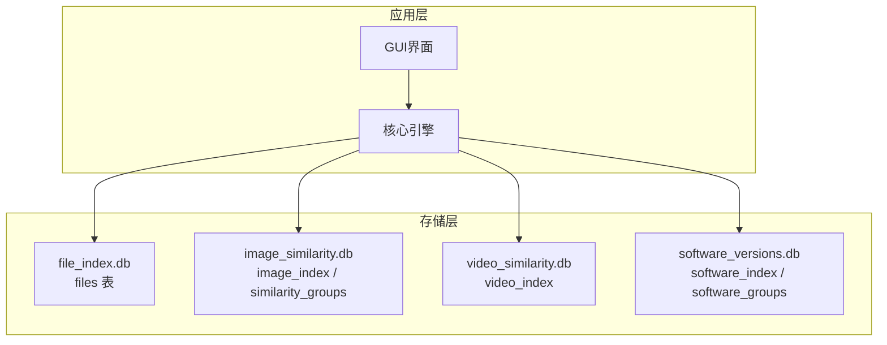
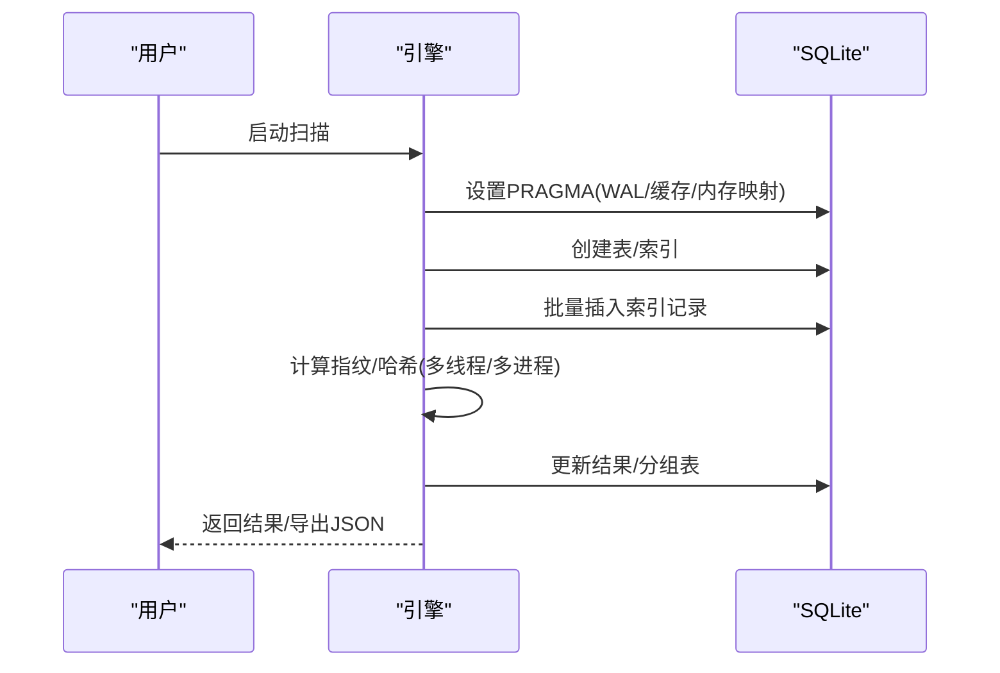
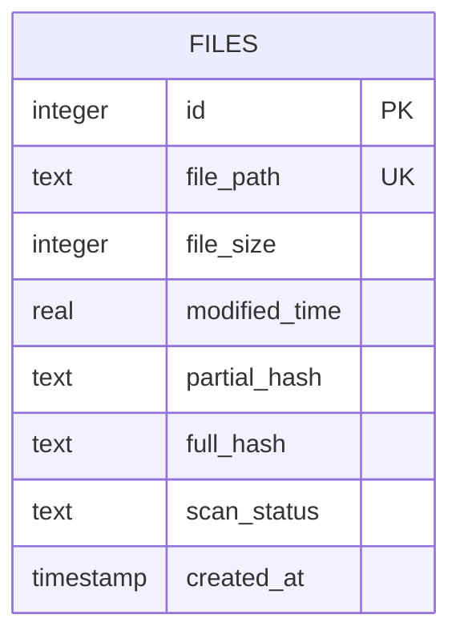
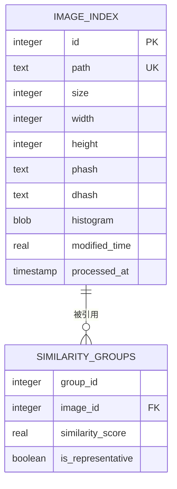
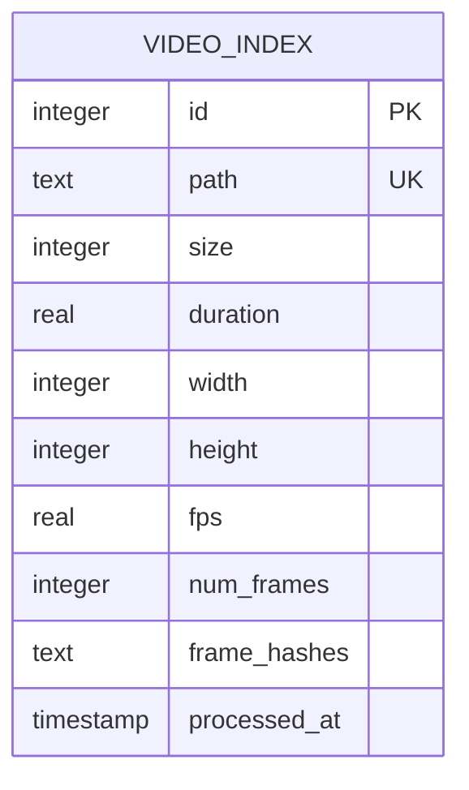
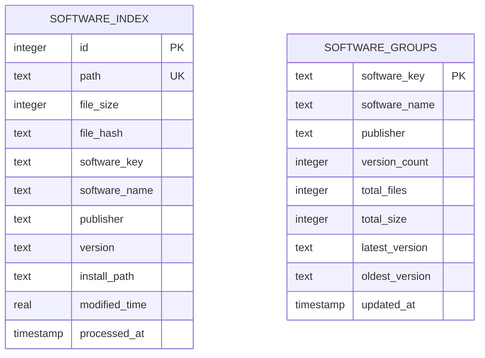
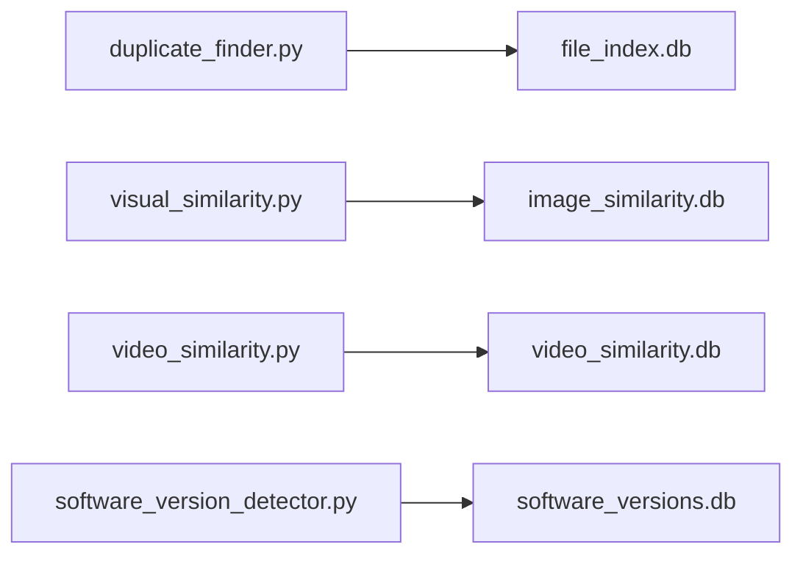
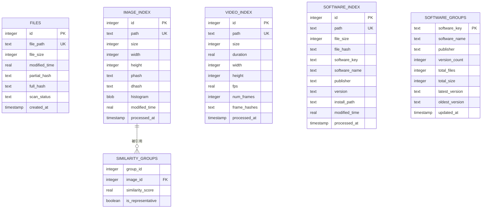

# 数据库设计

<cite>
**本文引用的文件**
- [core/duplicate_finder.py](file://core/duplicate_finder.py)
- [core/visual_similarity.py](file://core/visual_similarity.py)
- [core/video_similarity.py](file://core/video_similarity.py)
- [core/software_version_detector.py](file://core/software_version_detector.py)
- [README.md](file://README.md)
</cite>

## 目录
1. [简介](#简介)
2. [项目结构](#项目结构)
3. [核心组件](#核心组件)
4. [架构总览](#架构总览)
5. [详细组件分析](#详细组件分析)
6. [依赖关系分析](#依赖关系分析)
7. [性能考量](#性能考量)
8. [故障排查指南](#故障排查指南)
9. [结论](#结论)
10. [附录](#附录)

## 简介
本文件面向本项目中基于 SQLite 的数据库设计，覆盖以下方面：
- 表结构设计：files 表、索引表（图片/视频/软件）与结果表的字段定义与约束
- 性能优化策略：WAL 模式、缓存配置、内存映射、索引设计与批量写入
- 事务管理与并发控制：连接超时、忙等待、上下文管理器提交/回滚
- Schema 图表与查询优化技巧
- 数据迁移与备份策略
- 大数据量场景下的调优方案

## 项目结构
本项目在数据存储层采用多库分离的设计：每个功能模块维护独立的 SQLite 数据库文件，分别用于精确匹配、图片相似度、视频相似度和多版本软件检测。各模块在初始化时设置 PRAGMA 参数并创建必要的表与索引。

**图示来源**
- [README.md:376-401](file://README.md#L376-L401)

**章节来源**
- [README.md:338-401](file://README.md#L338-L401)

## 核心组件
- 精确匹配引擎：使用 files 表记录文件元数据与哈希，通过多级过滤（文件大小→部分哈希→完整哈希）定位重复文件
- 图片相似度引擎：使用 image_index 表存储图片指纹（pHash/dHash/直方图），similarity_groups 表记录相似组
- 视频相似度引擎：使用 video_index 表存储关键帧序列指纹，按时间轴进行片段匹配
- 多版本软件检测：使用 software_index 表记录可执行文件元数据与识别信息，software_groups 表统计分组

**章节来源**
- [core/duplicate_finder.py:133-175](file://core/duplicate_finder.py#L133-L175)
- [core/visual_similarity.py:123-169](file://core/visual_similarity.py#L123-L169)
- [core/video_similarity.py:205-239](file://core/video_similarity.py#L205-L239)
- [core/software_version_detector.py:109-159](file://core/software_version_detector.py#L109-L159)

## 架构总览
下图展示了四个子系统与各自数据库的关系，以及典型的数据流：扫描→索引→计算→查询/导出。

**图示来源**
- [core/duplicate_finder.py:133-175](file://core/duplicate_finder.py#L133-L175)
- [core/visual_similarity.py:123-169](file://core/visual_similarity.py#L123-L169)
- [core/video_similarity.py:205-239](file://core/video_similarity.py#L205-L239)
- [core/software_version_detector.py:109-159](file://core/software_version_detector.py#L109-L159)

## 详细组件分析

### 精确匹配：files 表与索引
- 表名：files
- 主要字段与约束
  - id: 自增主键
  - file_path: 唯一非空文本路径
  - file_size: 非空整数大小
  - modified_time: 非空实数修改时间
  - partial_hash: 可选文本，前1MB的MD5哈希（快速筛选）
  - full_hash: 可选文本，完整文件的MD5哈希（精确匹配）
  - scan_status: 默认'pending'，状态标记
  - created_at: 默认当前时间戳
- 索引
  - idx_file_size: 加速按大小分组
  - idx_partial_hash: 加速部分哈希筛选
  - idx_full_hash: 加速完整哈希比对
  - idx_scan_status: 加速状态过滤

**图示来源**
- [core/duplicate_finder.py:146-172](file://core/duplicate_finder.py#L146-L172)

**章节来源**
- [core/duplicate_finder.py:133-175](file://core/duplicate_finder.py#L133-L175)

### 图片相似度：image_index 与 similarity_groups
- 表名：image_index
  - id: 自增主键
  - path: 唯一非空路径
  - size: 非空整数大小
  - width/height: 图片尺寸
  - phash/dhash: 感知/差异哈希（文本）
  - histogram: BLOB 存储颜色直方图
  - modified_time: 修改时间
  - processed_at: 处理时间戳
- 表名：similarity_groups
  - group_id, image_id, similarity_score, is_representative
  - 外键关联 image_index.id

**图示来源**
- [core/visual_similarity.py:136-166](file://core/visual_similarity.py#L136-L166)

**章节来源**
- [core/visual_similarity.py:123-169](file://core/visual_similarity.py#L123-L169)

### 视频相似度：video_index
- 表名：video_index
  - id: 自增主键
  - path: 唯一非空路径
  - size: 非空整数大小
  - duration/fps/num_frames: 时长、帧率、帧数
  - width/height: 分辨率
  - frame_hashes: 文本（JSON），存储关键帧指纹序列
  - processed_at: 处理时间戳
- 索引
  - idx_duration, idx_size, idx_path

**图示来源**
- [core/video_similarity.py:218-231](file://core/video_similarity.py#L218-L231)

**章节来源**
- [core/video_similarity.py:205-239](file://core/video_similarity.py#L205-L239)

### 多版本软件检测：software_index 与 software_groups
- 表名：software_index
  - id: 自增主键
  - path: 唯一非空路径
  - file_size/file_hash: 大小与MD5
  - software_key/software_name/publisher/version/install_path: 软件识别与版本信息
  - modified_time/processed_at: 时间与处理时间戳
- 表名：software_groups
  - software_key: 主键
  - software_name/publisher: 名称与发布者
  - version_count/total_files/total_size: 统计信息
  - latest_version/oldest_version: 最新/最旧版本
  - updated_at: 更新时间戳
- 索引
  - idx_software_key, idx_file_hash, idx_install_path, idx_version_count

**图示来源**
- [core/software_version_detector.py:121-150](file://core/software_version_detector.py#L121-L150)

**章节来源**
- [core/software_version_detector.py:109-159](file://core/software_version_detector.py#L109-L159)

## 依赖关系分析
- 各引擎均通过 sqlite3 连接数据库，并在初始化阶段统一设置 PRAGMA 参数以提升并发与吞吐
- 批量写入减少事务开销；上下文管理器确保异常时回滚
- 不同模块独立数据库文件，避免跨模块耦合

**图示来源**
- [core/duplicate_finder.py:133-175](file://core/duplicate_finder.py#L133-L175)
- [core/visual_similarity.py:123-169](file://core/visual_similarity.py#L123-L169)
- [core/video_similarity.py:205-239](file://core/video_similarity.py#L205-L239)
- [core/software_version_detector.py:109-159](file://core/software_version_detector.py#L109-L159)

**章节来源**
- [core/duplicate_finder.py:177-201](file://core/duplicate_finder.py#L177-L201)
- [core/visual_similarity.py:171-188](file://core/visual_similarity.py#L171-L188)
- [core/video_similarity.py:241-258](file://core/video_similarity.py#L241-L258)
- [core/software_version_detector.py:109-159](file://core/software_version_detector.py#L109-L159)

## 性能考量
- WAL 模式与同步策略
  - journal_mode=WAL：提高并发写入能力，降低锁冲突
  - synchronous=NORMAL：平衡安全与性能
- 缓存与内存映射
  - cache_size=-64000：约64MB缓存
  - temp_store=MEMORY：临时对象驻留内存
  - mmap_size=268435456：约256MB内存映射（图片/视频引擎）
- 连接与并发
  - busy_timeout：忙等待避免“database is locked”
  - timeout：连接超时保护
  - 批处理写入：executemany 减少事务次数
- 索引设计
  - 针对高频查询字段建立索引（如 file_size、partial_hash、full_hash、phash、dhash、duration、size、path、software_key）
- 线程/进程并行
  - 根据磁盘类型自适应线程数（HDD限制线程，SSD/NVMe放宽）
  - 多进程计算指纹（图片/视频），减轻GIL影响

**章节来源**
- [core/duplicate_finder.py:133-175](file://core/duplicate_finder.py#L133-L175)
- [core/duplicate_finder.py:190-201](file://core/duplicate_finder.py#L190-L201)
- [core/visual_similarity.py:123-169](file://core/visual_similarity.py#L123-L169)
- [core/video_similarity.py:205-239](file://core/video_similarity.py#L205-L239)
- [core/software_version_detector.py:109-159](file://core/software_version_detector.py#L109-L159)

## 故障排查指南
- “database is locked”
  - 检查 busy_timeout 与 timeout 设置是否合理
  - 避免过多并发写操作，增大批处理大小
- 写入缓慢
  - 确认 WAL 模式已启用
  - 调整 cache_size 与 mmap_size
  - 检查磁盘类型与线程数配置
- 查询慢
  - 确认相关字段已建索引
  - 使用 EXPLAIN QUERY PLAN 分析执行计划
- 增量扫描未生效
  - 核对去重逻辑（如基于 file_hash 或 modified_time）
  - 检查 INSERT OR REPLACE/IGNORE 的使用是否正确

**章节来源**
- [core/duplicate_finder.py:190-201](file://core/duplicate_finder.py#L190-L201)
- [core/visual_similarity.py:171-188](file://core/visual_similarity.py#L171-L188)
- [core/video_similarity.py:241-258](file://core/video_similarity.py#L241-L258)

## 结论
本项目采用多库分离的 SQLite 设计，围绕不同功能域构建专用表与索引，并通过 WAL、缓存、内存映射与批处理等手段实现高性能与高并发。合理的索引设计与事务管理是保障大规模数据处理的关键。后续可根据实际负载进一步调优 PRAGMA 参数与索引策略。

## 附录

### 数据库 Schema 总览（ER 图）

**图示来源**
- [core/duplicate_finder.py:146-172](file://core/duplicate_finder.py#L146-L172)
- [core/visual_similarity.py:136-166](file://core/visual_similarity.py#L136-L166)
- [core/video_similarity.py:218-231](file://core/video_similarity.py#L218-L231)
- [core/software_version_detector.py:121-150](file://core/software_version_detector.py#L121-L150)

### 查询优化技巧
- 利用索引字段进行等值/范围查询（如 file_size、phash、dhash、duration、software_key）
- 对大表分页查询，避免一次性加载大量数据
- 使用 GROUP BY/HAVING 聚合统计（如按大小分组、按软件 key 分组）
- 定期 VACUUM 压缩数据库，减少碎片

**章节来源**
- [core/duplicate_finder.py:402-434](file://core/duplicate_finder.py#L402-L434)
- [core/visual_similarity.py:423-432](file://core/visual_similarity.py#L423-L432)
- [core/video_similarity.py:560-569](file://core/video_similarity.py#L560-L569)
- [core/software_version_detector.py:483-526](file://core/software_version_detector.py#L483-L526)

### 事务管理与并发控制机制
- 连接上下文管理器：自动 commit/rollback，确保异常安全
- busy_timeout 与 timeout：避免长时间阻塞与死锁
- 批处理写入：减少事务次数，提升吞吐

**章节来源**
- [core/duplicate_finder.py:177-201](file://core/duplicate_finder.py#L177-L201)
- [core/visual_similarity.py:171-188](file://core/visual_similarity.py#L171-L188)
- [core/video_similarity.py:241-258](file://core/video_similarity.py#L241-L258)

### 数据迁移与备份策略
- 备份
  - 直接复制 .db 文件（建议先关闭程序或使用只读挂载）
  - 使用 SQLite 内置命令导出 SQL 脚本（如 .dump）
- 迁移
  - 在新库中重建表结构与索引
  - 分批导入数据（INSERT ... SELECT）
  - 完成后校验计数与一致性
- 清理与压缩
  - 定期删除过期数据
  - 运行 VACUUM 释放空间

[本节为通用实践说明，不直接分析具体代码文件]

### 大数据量场景下的性能调优方案
- 调整 PRAGMA
  - WAL + NORMAL 同步
  - 适当增大 cache_size 与 mmap_size（结合可用内存）
- 索引优化
  - 仅对高频查询字段建索引，避免过度索引导致写入变慢
- 批处理与分片
  - 增大批大小（如 5000 条/批）
  - 分库分表（按时间/类别）
- 并行度
  - HDD 限制线程数，SSD/NVMe 可适当增加
  - 图片/视频指纹计算使用多进程
- 监控与诊断
  - 记录慢查询与锁等待
  - 使用 EXPLAIN QUERY PLAN 优化 SQL

[本节为通用实践说明，不直接分析具体代码文件]