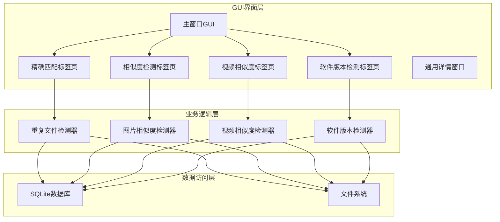
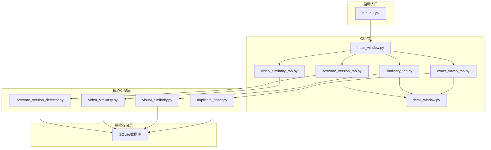
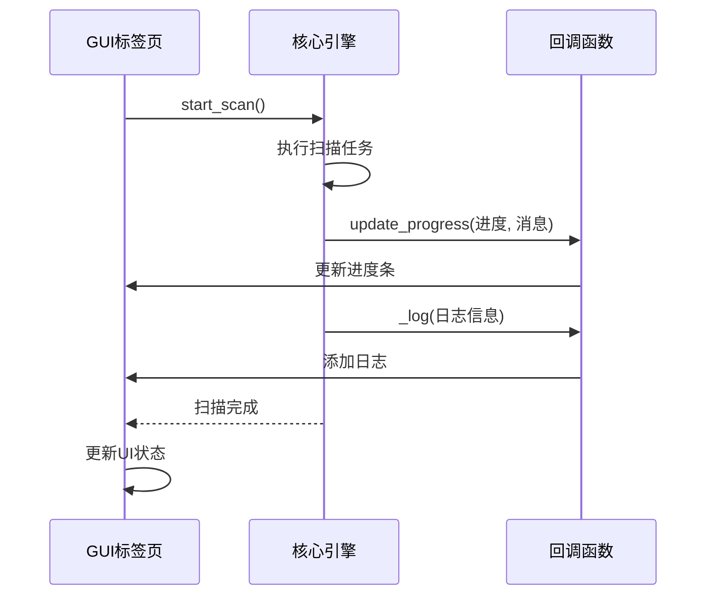
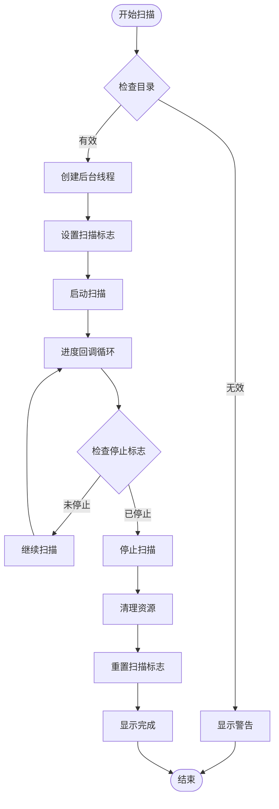
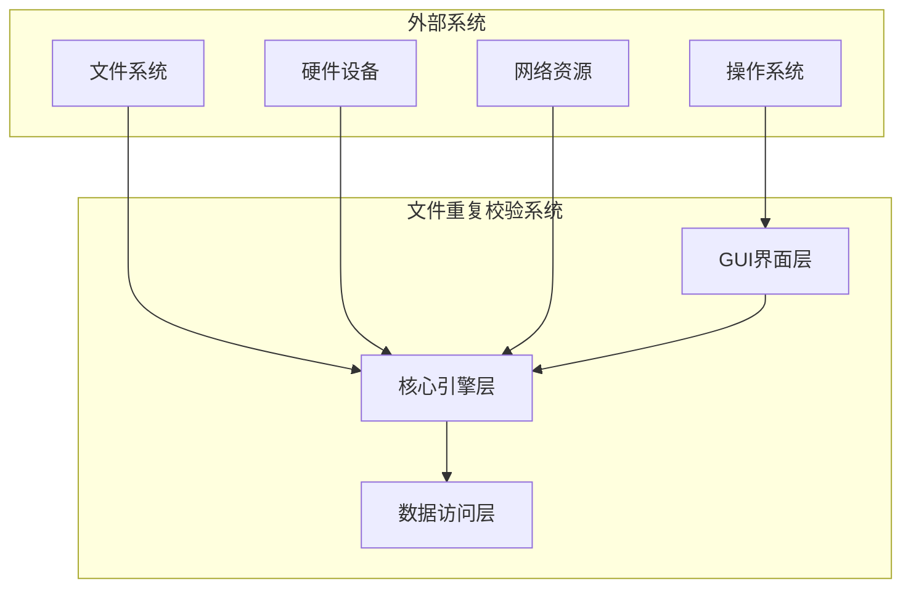
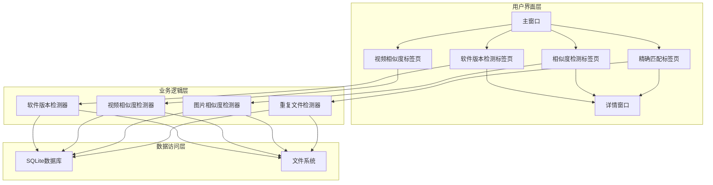
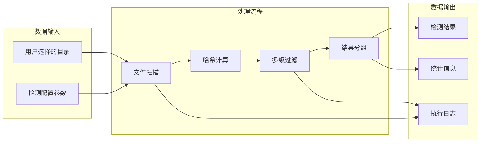
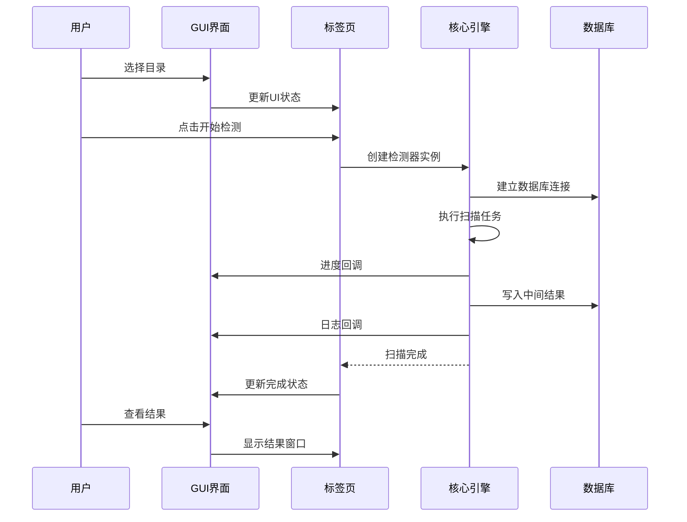

# 整体架构设计

<cite>
**本文档引用的文件**
- [run_gui.py](file://run_gui.py)
- [README.md](file://README.md)
- [QUICK_START.md](file://QUICK_START.md)
- [requirements.txt](file://requirements.txt)
- [main_window.py](file://gui_modules/main_window.py)
- [exact_match_tab.py](file://gui_modules/exact_match_tab.py)
- [similarity_tab.py](file://gui_modules/similarity_tab.py)
- [video_similarity_tab.py](file://gui_modules/video_similarity_tab.py)
- [software_version_tab.py](file://gui_modules/software_version_tab.py)
- [detail_window.py](file://gui_modules/detail_window.py)
- [duplicate_finder.py](file://core/duplicate_finder.py)
- [visual_similarity.py](file://core/visual_similarity.py)
- [video_similarity.py](file://core/video_similarity.py)
- [software_version_detector.py](file://core/software_version_detector.py)
</cite>

## 目录
1. [项目概述](#项目概述)
2. [系统架构概览](#系统架构概览)
3. [分层架构设计](#分层架构设计)
4. [模块化设计原则](#模块化设计原则)
5. [组件依赖关系分析](#组件依赖关系分析)
6. [技术栈选择与权衡](#技术栈选择与权衡)
7. [事件驱动机制与回调系统](#事件驱动机制与回调系统)
8. [系统边界定义](#系统边界定义)
9. [架构图表展示](#架构图表展示)
10. [性能优化策略](#性能优化策略)
11. [总结](#总结)

## 项目概述

文件重复校验工具是一个基于Python开发的智能文件去重解决方案，支持精确匹配、图片相似度检测、视频相似度检测和多版本软件检测四大核心功能。该项目采用模块化架构设计，通过分层架构模式实现了GUI层、业务逻辑层和数据访问层的清晰分离。

### 核心优势

- **高性能**: 多进程并行计算，充分利用CPU资源
- **高精度**: 三级过滤策略，准确率高达99%+
- **智能缓存**: SQLite数据库索引，支持增量扫描
- **友好界面**: 现代化GUI，实时进度显示
- **可视化**: 图片/视频预览，直观对比相似文件
- **v4.0新增**: 多版本软件检测，智能识别同一软件的不同版本

## 系统架构概览

该系统采用经典的三层架构模式，通过清晰的层次分离实现了关注点分离和模块化设计。

**图表来源**
- [main_window.py:22-86](file://gui_modules/main_window.py#L22-L86)
- [exact_match_tab.py:18-42](file://gui_modules/exact_match_tab.py#L18-L42)
- [similarity_tab.py:18-49](file://gui_modules/similarity_tab.py#L18-L49)
- [video_similarity_tab.py:18-49](file://gui_modules/video_similarity_tab.py#L18-L49)
- [software_version_tab.py:15-33](file://gui_modules/software_version_tab.py#L15-L33)

## 分层架构设计

### GUI界面层（表现层）

GUI界面层负责用户交互和界面展示，采用Tkinter框架构建现代化的图形用户界面。

**核心组件职责**：
- **主窗口管理**: 负责创建和管理主窗口，协调各个标签页
- **标签页管理**: 管理精确匹配、相似度检测、视频相似度检测、软件版本检测四个标签页
- **事件处理**: 处理用户交互事件，如按钮点击、文件选择等
- **进度显示**: 实时显示扫描进度和状态信息
- **结果展示**: 通过Treeview控件展示检测结果

**关键实现**：
- 主窗口继承自tk.Tk，提供统一的界面管理
- 各标签页模块化设计，便于功能扩展
- 详细的日志系统，提供完整的操作反馈

### 业务逻辑层（服务层）

业务逻辑层包含核心算法和业务规则，提供各种检测功能的具体实现。

**核心组件职责**：
- **重复文件检测**: 基于MD5哈希的三级过滤策略
- **图片相似度检测**: 基于感知哈希、差异哈希和颜色直方图的多级检测
- **视频相似度检测**: 基于关键帧序列匹配的抗剪辑检测
- **软件版本检测**: 基于PE元数据提取的智能软件识别

**技术特点**：
- 多进程并行计算，充分利用硬件资源
- 智能缓存机制，避免重复计算
- 支持增量扫描，提高效率
- 可扩展的算法架构

### 数据访问层（持久化层）

数据访问层负责数据的持久化存储和访问，采用SQLite数据库作为主要存储介质。

**核心功能**：
- **索引管理**: 为各种检测算法建立高效的索引
- **数据缓存**: 缓存中间结果，避免重复计算
- **增量更新**: 支持增量扫描和数据更新
- **查询优化**: 通过索引和优化查询提升性能

**数据库设计**：
- 每种检测类型使用独立的数据库文件
- 采用WAL模式提升并发性能
- 创建多种索引加速查询操作

**图表来源**
- [duplicate_finder.py:22-94](file://core/duplicate_finder.py#L22-L94)
- [visual_similarity.py:94-170](file://core/visual_similarity.py#L94-L170)
- [video_similarity.py:174-240](file://core/video_similarity.py#L174-L240)
- [software_version_detector.py:30-162](file://core/software_version_detector.py#L30-L162)

## 模块化设计原则

### 1. 单一职责原则

每个模块都有明确的职责分工：

- **GUI模块**: 负责用户界面和交互
- **核心引擎**: 负责具体的检测算法实现
- **工具模块**: 提供通用的辅助功能

### 2. 依赖倒置原则

高层模块不依赖于低层模块，两者都依赖于抽象：
- GUI模块依赖于接口而非具体实现
- 核心引擎提供标准化的API接口

### 3. 开闭原则

系统对扩展开放，对修改关闭：
- 新增检测功能只需实现相应接口
- 不影响现有功能的正常运行

### 4. 里氏替换原则

子类可以替换父类而不影响程序正确性：
- 各标签页模块继承统一的基类接口
- 保证了系统的兼容性和一致性

## 组件依赖关系分析

**图表来源**
- [run_gui.py:13-26](file://run_gui.py#L13-L26)
- [main_window.py:25-86](file://gui_modules/main_window.py#L25-L86)
- [exact_match_tab.py:21-42](file://gui_modules/exact_match_tab.py#L21-L42)
- [similarity_tab.py:21-49](file://gui_modules/similarity_tab.py#L21-L49)
- [video_similarity_tab.py:21-49](file://gui_modules/video_similarity_tab.py#L21-L49)
- [software_version_tab.py:18-33](file://gui_modules/software_version_tab.py#L18-L33)

### 依赖关系特点

1. **单向依赖**: GUI层依赖核心引擎层，核心引擎层不依赖GUI层
2. **松耦合**: 通过接口和回调机制实现松散耦合
3. **可测试性**: 每个模块都可以独立测试和验证
4. **可维护性**: 模块边界清晰，便于维护和升级

## 技术栈选择与权衡

### 核心技术栈

| 技术组件 | 版本要求 | 用途 | 选择理由 |
|---------|----------|------|----------|
| Python | 3.7+ | 主要编程语言 | 跨平台支持，丰富的库生态 |
| Tkinter | 内置 | GUI框架 | 无需额外依赖，跨平台兼容 |
| SQLite3 | 内置 | 数据库引擎 | 轻量级，零配置部署 |
| Pillow | >=9.0.0 | 图像处理 | 强大的图像处理能力 |
| imagehash | >=4.3.0 | 感知哈希 | 高效的图像相似度检测 |
| OpenCV | headless>=4.5.0 | 视频处理 | 专业的计算机视觉库 |
| pefile | >=2021.9.3 | PE文件解析 | Windows可执行文件元数据提取 |
| packaging | >=21.0 | 版本比较 | 语义化版本比较 |

### 技术选择权衡

#### 1. GUI框架选择

**选择Tkinter的原因**：
- **优势**: 无需额外依赖，跨平台兼容，学习成本低
- **劣势**: 界面相对简单，高级功能有限
- **权衡**: 满足基本需求，简化部署复杂度

#### 2. 数据库选择

**选择SQLite的原因**：
- **优势**: 零配置部署，无需服务器，支持事务
- **劣势**: 并发性能有限，大数据量处理能力一般
- **权衡**: 满足中小规模数据处理需求，简化系统架构

#### 3. 图像处理库选择

**选择Pillow + imagehash的原因**：
- **优势**: 功能全面，性能优秀，社区活跃
- **劣势**: 需要额外安装依赖
- **权衡**: 获得最佳的图像处理和相似度检测效果

#### 4. 视频处理库选择

**选择OpenCV headless的原因**：
- **优势**: 专业级视频处理能力，支持多种格式
- **劣势**: 体积较大，需要额外依赖
- **权衡**: 获得最佳的视频相似度检测效果

## 事件驱动机制与回调系统

### 回调系统设计

系统采用回调机制实现GUI与核心引擎的解耦通信：

**图表来源**
- [exact_match_tab.py:340-380](file://gui_modules/exact_match_tab.py#L340-L380)
- [similarity_tab.py:370-420](file://gui_modules/similarity_tab.py#L370-L420)
- [video_similarity_tab.py:360-420](file://gui_modules/video_similarity_tab.py#L360-L420)
- [software_version_tab.py:300-370](file://gui_modules/software_version_tab.py#L300-L370)

### 事件处理机制

#### 1. 进度回调

每个核心引擎都支持进度回调机制：
- **参数**: 进度百分比、状态消息
- **用途**: 实时更新GUI进度条和状态显示
- **频率**: 按算法需要动态调整更新频率

#### 2. 日志回调

统一的日志回调接口：
- **参数**: 日志内容、日志级别
- **用途**: 在GUI中显示详细的执行过程
- **格式**: 时间戳 + 级别 + 内容

#### 3. 停止标志

线程安全的停止机制：
- **实现**: threading.Event事件对象
- **用途**: 允许用户随时停止长时间运行的任务
- **安全性**: 在关键点检查停止标志，确保任务可中断

### 线程管理

系统采用多线程架构确保UI响应性：

**图表来源**
- [exact_match_tab.py:293-380](file://gui_modules/exact_match_tab.py#L293-L380)
- [similarity_tab.py:331-420](file://gui_modules/similarity_tab.py#L331-L420)
- [video_similarity_tab.py:331-420](file://gui_modules/video_similarity_tab.py#L331-L420)
- [software_version_tab.py:272-370](file://gui_modules/software_version_tab.py#L272-L370)

## 系统边界定义

### 外部系统边界

### 接口边界

#### 1. GUI与核心引擎接口

| 接口类型 | 方法签名 | 参数说明 | 返回值 |
|---------|----------|----------|--------|
| 进度回调 | update_progress(progress, message) | progress: 百分比, message: 状态信息 | 无 |
| 日志回调 | _log(message, level) | message: 日志内容, level: 日志级别 | 无 |
| 停止检查 | check_stop() | 无 | 无异常/抛出InterruptedError |
| 结果处理 | view_results() | 无 | 无 |

#### 2. 核心引擎与数据访问接口

| 接口类型 | 方法签名 | 参数说明 | 返回值 |
|---------|----------|----------|--------|
| 数据库连接 | _get_connection() | 无 | sqlite3.Connection |
| 批量插入 | _batch_insert(data) | data: 数据列表 | 无 |
| 索引构建 | build_index(directories, incremental) | directories: 目录列表, incremental: 增量模式 | 无 |
| 结果查询 | find_similar_groups() | 无 | 相似组列表 |

### 数据边界

#### 1. 输入数据边界

- **目录输入**: 支持多个目录的批量扫描
- **文件类型过滤**: 支持自定义文件格式过滤
- **参数配置**: 支持各种检测参数的动态配置

#### 2. 输出数据边界

- **检测结果**: JSON格式的结果文件
- **日志信息**: 详细的执行日志
- **统计数据**: 各种统计指标和摘要信息

## 架构图表展示

### 1. 整体架构图

**图表来源**
- [main_window.py:62-86](file://gui_modules/main_window.py#L62-L86)
- [exact_match_tab.py:18-42](file://gui_modules/exact_match_tab.py#L18-L42)
- [similarity_tab.py:18-49](file://gui_modules/similarity_tab.py#L18-L49)
- [video_similarity_tab.py:18-49](file://gui_modules/video_similarity_tab.py#L18-L49)
- [software_version_tab.py:15-33](file://gui_modules/software_version_tab.py#L15-L33)

### 2. 数据流图

**图表来源**
- [duplicate_finder.py:120-285](file://core/duplicate_finder.py#L120-L285)
- [visual_similarity.py:202-513](file://core/visual_similarity.py#L202-L513)
- [video_similarity.py:272-652](file://core/video_similarity.py#L272-L652)

### 3. 组件交互图

**图表来源**
- [exact_match_tab.py:320-380](file://gui_modules/exact_match_tab.py#L320-L380)
- [similarity_tab.py:360-420](file://gui_modules/similarity_tab.py#L360-L420)
- [video_similarity_tab.py:360-420](file://gui_modules/video_similarity_tab.py#L360-L420)
- [software_version_tab.py:300-370](file://gui_modules/software_version_tab.py#L300-L370)

## 性能优化策略

### 1. 并行计算优化

#### 多进程并行处理

- **图片/视频检测**: 使用ProcessPoolExecutor实现多进程并行
- **线程数优化**: 根据CPU核心数自动调整，最多8个进程
- **内存管理**: 通过批处理机制控制内存使用

#### 线程池管理

- **核心引擎**: 使用ThreadPoolExecutor处理I/O密集型任务
- **动态调整**: 根据存储类型调整线程数量（HDD: 4-8, SSD: 8-16）
- **资源隔离**: 每个检测任务独立的线程池

### 2. 数据库性能优化

#### SQLite优化配置

- **WAL模式**: 提高并发读写性能
- **索引优化**: 为常用查询字段创建索引
- **缓存配置**: 设置合适的缓存大小和内存映射

#### 批处理策略

- **批量插入**: 每批处理1000-5000条记录
- **事务管理**: 合理的事务边界控制
- **连接池**: 复用数据库连接减少开销

### 3. 缓存策略

#### 多级缓存

- **PE文件缓存**: LRU缓存PE元数据，避免重复解析
- **缩略图缓存**: 图片和视频预览的缩略图缓存
- **中间结果缓存**: 避免重复计算相似度

#### 懒加载机制

- **图片预览**: 按需加载和生成缩略图
- **视频帧**: 异步加载关键帧用于预览
- **文件大小**: 延迟计算文件大小

### 4. 算法优化

#### 三级过滤策略

- **第一级**: 快速过滤（文件大小、部分哈希）
- **第二级**: 中等精度过滤（完整哈希）
- **第三级**: 精确验证（避免误判）

#### 智能采样

- **视频检测**: 根据视频时长动态调整采样帧数
- **图片检测**: 大图片先缩小再处理，避免内存溢出
- **文件过滤**: 支持自定义文件类型过滤

## 总结

文件重复校验工具采用成熟的三层架构设计，通过清晰的层次分离和模块化实现，构建了一个功能强大、性能优异的文件去重解决方案。

### 架构优势

1. **清晰的层次分离**: GUI层、业务逻辑层、数据访问层职责明确
2. **模块化设计**: 各功能模块独立，便于维护和扩展
3. **事件驱动机制**: 通过回调系统实现松耦合通信
4. **性能优化**: 多进程并行、智能缓存、数据库优化
5. **用户体验**: 实时进度显示、详细日志、直观结果展示

### 技术创新

1. **多版本软件检测**: 基于PE元数据的智能软件识别
2. **三级过滤策略**: 从粗粒度到精确定位的多级检测
3. **智能缓存机制**: 避免重复计算，提升整体性能
4. **增量扫描支持**: 支持历史数据的增量更新

### 未来发展方向

1. **分布式架构**: 支持多节点并行处理大规模数据
2. **云存储集成**: 支持云端文件的相似度检测
3. **机器学习增强**: 集成深度学习模型提升检测精度
4. **实时监控**: 实时监控文件变化自动触发检测

该架构设计充分体现了现代软件工程的最佳实践，为构建企业级文件管理系统提供了坚实的技术基础。