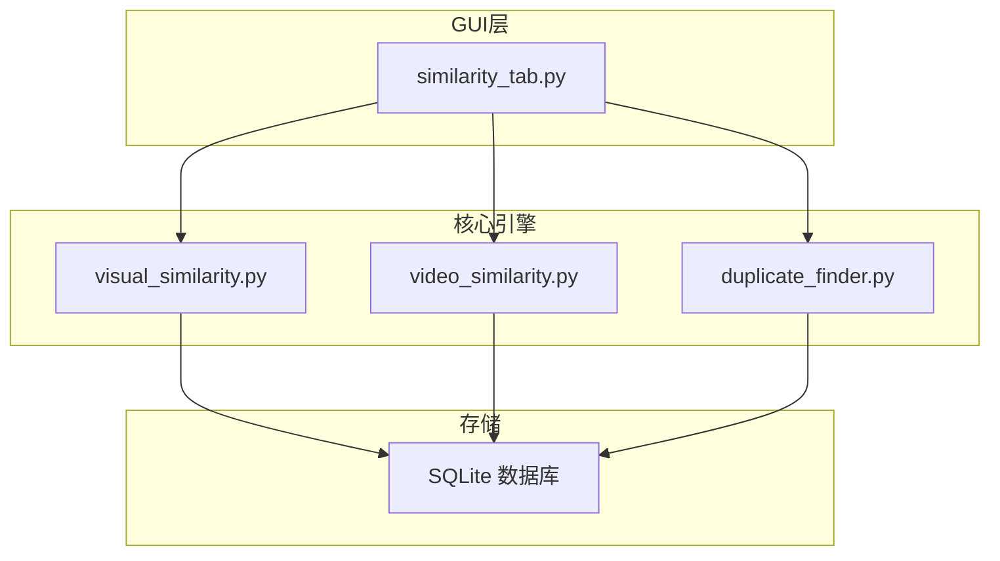
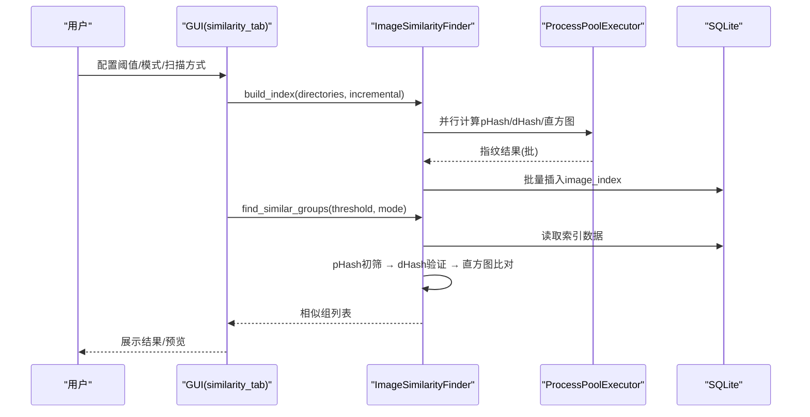
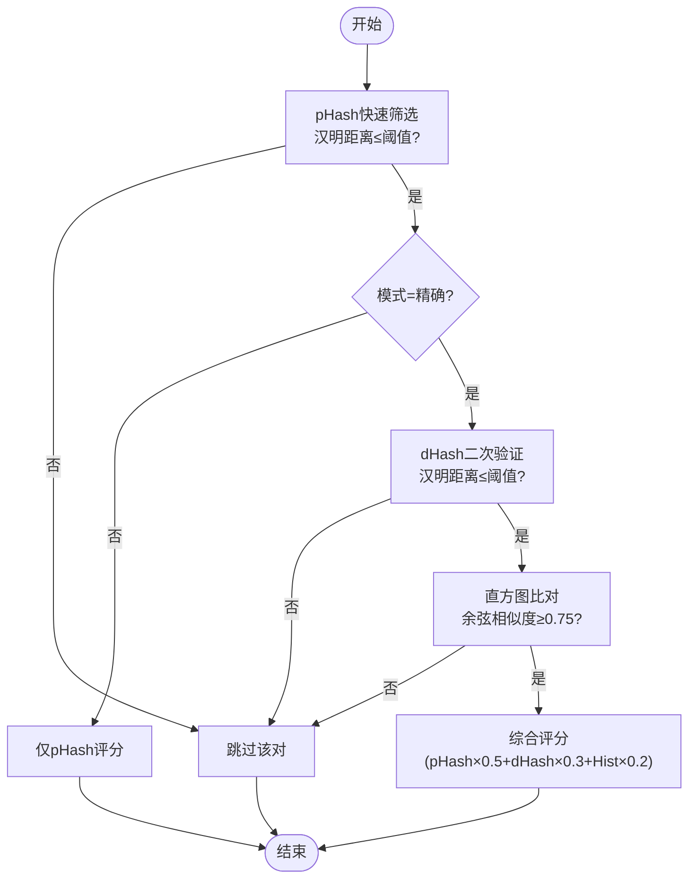
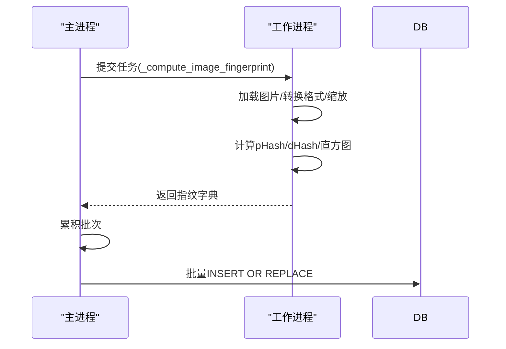
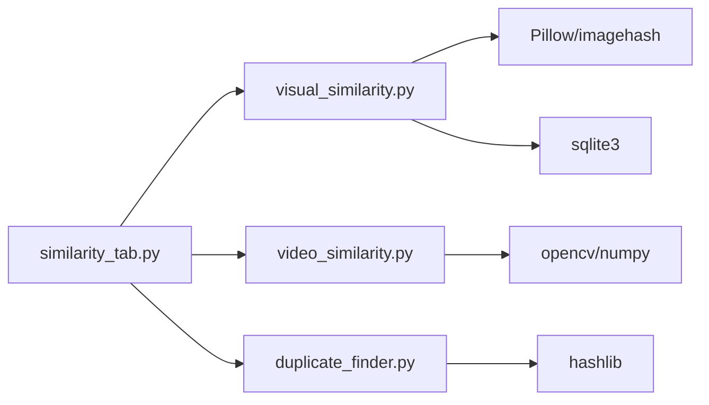

# 图片相似度检测算法

<cite>
**本文引用的文件**
- [core/visual_similarity.py](file://core/visual_similarity.py)
- [core/duplicate_finder.py](file://core/duplicate_finder.py)
- [core/video_similarity.py](file://core/video_similarity.py)
- [gui_modules/similarity_tab.py](file://gui_modules/similarity_tab.py)
- [docs/IMAGE_SIMILARITY_SPEC.md](file://docs/IMAGE_SIMILARITY_SPEC.md)
- [README.md](file://README.md)
</cite>

## 目录
1. [简介](#简介)
2. [项目结构](#项目结构)
3. [核心组件](#核心组件)
4. [架构总览](#架构总览)
5. [详细组件分析](#详细组件分析)
6. [依赖关系分析](#依赖关系分析)
7. [性能考量](#性能考量)
8. [故障排查指南](#故障排查指南)
9. [结论](#结论)
10. [附录：使用指南与参数调优](#附录使用指南与参数调优)

## 简介
本仓库实现了一套面向TB级数据的“图片相似度检测”系统，采用三级过滤策略：感知哈希（pHash）快速初筛、差异哈希（dHash）二次验证、颜色直方图精确比对。系统支持多进程并行计算指纹、SQLite增量索引、阈值可调的相似度判定，并提供GUI配置与结果展示。同时配套视频相似度检测与通用重复文件检测模块，便于在统一平台下扩展。

## 项目结构
- core：核心算法与引擎
  - visual_similarity.py：图片相似度检测引擎（pHash/dHash/直方图）
  - duplicate_finder.py：通用重复文件检测（MD5多级过滤）
  - video_similarity.py：视频相似度检测（关键帧序列匹配）
- gui_modules：图形界面
  - similarity_tab.py：图片相似度检测的GUI页签
- docs：规格与说明文档
  - IMAGE_SIMILARITY_SPEC.md：图片相似度规格文档
- README.md：项目总览、版本演进、使用方法与性能基准

图表来源
- [gui_modules/similarity_tab.py:370-400](file://gui_modules/similarity_tab.py#L370-L400)
- [core/visual_similarity.py:100-170](file://core/visual_similarity.py#L100-L170)
- [core/video_similarity.py:174-200](file://core/video_similarity.py#L174-L200)
- [core/duplicate_finder.py:133-175](file://core/duplicate_finder.py#L133-L175)

章节来源
- [README.md:338-401](file://README.md#L338-L401)

## 核心组件
- 图片相似度检测器（ImageSimilarityFinder）
  - 负责扫描图片、计算pHash/dHash/直方图指纹、构建索引、查找相似组并输出结果
- 视频相似度检测器（VideoSimilarityFinder）
  - 负责动态采样关键帧、计算每帧哈希、序列匹配与相似度评估
- 重复文件检测器（DuplicateFinder）
  - 基于文件大小→部分哈希→完整哈希的三级过滤，用于通用文件去重
- GUI相似度页签（SimilarityTab）
  - 提供阈值调节、模式选择、增量/全量扫描、进度与日志显示、结果窗口

章节来源
- [core/visual_similarity.py:94-170](file://core/visual_similarity.py#L94-L170)
- [core/video_similarity.py:174-200](file://core/video_similarity.py#L174-L200)
- [core/duplicate_finder.py:25-74](file://core/duplicate_finder.py#L25-L74)
- [gui_modules/similarity_tab.py:18-48](file://gui_modules/similarity_tab.py#L18-L48)

## 架构总览
系统采用“GUI → 核心引擎 → SQLite”的分层架构。图片/视频指纹计算通过多进程并行执行，批量写入数据库；相似度比对阶段按阈值与模式进行三级过滤，最终聚类为相似组。

图表来源
- [gui_modules/similarity_tab.py:370-400](file://gui_modules/similarity_tab.py#L370-L400)
- [core/visual_similarity.py:253-311](file://core/visual_similarity.py#L253-L311)
- [core/visual_similarity.py:410-513](file://core/visual_similarity.py#L410-L513)

## 详细组件分析

### 图片相似度检测引擎（三级过滤）
- 指纹计算
  - pHash：感知哈希，提取低频特征，生成64位二进制（16进制字符串）
  - dHash：差异哈希，比较相邻像素梯度
  - 颜色直方图：RGB三通道各256 bins，共768个值，压缩为BLOB存储
- 汉明距离
  - 将十六进制哈希转为整数，异或后统计1的个数，得到0-64的距离
- 相似度评分
  - pHash分数 = max(0, 100 - (phash_dist/64*100))
  - dHash分数 = max(0, 100 - (dhash_dist/64*100))
  - 直方图分数 = 余弦相似度×100
  - 综合分数 = pHash×0.5 + dHash×0.3 + 直方图×0.2
- 三级过滤流程
  - 第1级：pHash快速筛选（汉明距离≤阈值）
  - 第2级：dHash二次验证（仅精确模式）
  - 第3级：直方图精确比对（余弦相似度≥阈值，默认0.75）
  - 快速模式：仅使用pHash，适合大规模快速筛查

图表来源
- [core/visual_similarity.py:334-408](file://core/visual_similarity.py#L334-L408)
- [core/visual_similarity.py:410-513](file://core/visual_similarity.py#L410-L513)

章节来源
- [core/visual_similarity.py:21-91](file://core/visual_similarity.py#L21-L91)
- [core/visual_similarity.py:334-408](file://core/visual_similarity.py#L334-L408)
- [core/visual_similarity.py:410-513](file://core/visual_similarity.py#L410-L513)
- [docs/IMAGE_SIMILARITY_SPEC.md:24-158](file://docs/IMAGE_SIMILARITY_SPEC.md#L24-L158)

### 多进程并行处理机制
- 指纹计算采用ProcessPoolExecutor，自动根据CPU核心数设置最大工作进程（最多8）
- 全局函数_compute_image_fingerprint确保跨进程可导入模块与环境
- 批量插入数据库减少事务开销，提升吞吐

图表来源
- [core/visual_similarity.py:21-91](file://core/visual_similarity.py#L21-L91)
- [core/visual_similarity.py:280-332](file://core/visual_similarity.py#L280-L332)

章节来源
- [core/visual_similarity.py:117-121](file://core/visual_similarity.py#L117-L121)
- [core/visual_similarity.py:280-332](file://core/visual_similarity.py#L280-L332)

### 关键帧提取策略（视频）
- 动态采样：根据视频时长确定采样帧数（<10秒取5帧，10-60秒取10帧，1-5分钟取20帧，>5分钟每分钟1帧最多50帧）
- 均匀分布时间点定位，逐帧缩放至统一尺寸，转换为RGB并计算pHash/dHash
- 帧序列用于后续滑动窗口与对角线匹配（视频模块内实现）

章节来源
- [core/video_similarity.py:74-141](file://core/video_similarity.py#L74-L141)
- [core/video_similarity.py:154-171](file://core/video_similarity.py#L154-L171)

### 内存优化技术
- 超大图片先缩小到最大边4096像素，避免内存溢出
- 直方图以紧凑BLOB存储（768I），减少数据库体积
- SQLite PRAGMA优化：WAL模式、NORMAL同步、64MB缓存、临时表存内存、256MB内存映射
- 批量插入减少事务次数，降低锁竞争
- GUI懒加载缩略图与LRU缓存（参考规格文档）

章节来源
- [core/visual_similarity.py:55-61](file://core/visual_similarity.py#L55-L61)
- [core/visual_similarity.py:128-133](file://core/visual_similarity.py#L128-L133)
- [docs/IMAGE_SIMILARITY_SPEC.md:589-613](file://docs/IMAGE_SIMILARITY_SPEC.md#L589-L613)

### 相似度阈值设置与模式选择
- 阈值范围：5-30（严格/平衡/宽松）
  - 严格：5-8（几乎完全相同）
  - 平衡：9-15（轻微差异，默认12）
  - 宽松：16-30（明显相似）
- 模式：
  - 快速模式：仅pHash，速度快，适合海量初筛
  - 精确模式：pHash+dHash+直方图，精度高，适合精细去重

章节来源
- [docs/IMAGE_SIMILARITY_SPEC.md:133-158](file://docs/IMAGE_SIMILARITY_SPEC.md#L133-L158)
- [gui_modules/similarity_tab.py:60-96](file://gui_modules/similarity_tab.py#L60-L96)

## 依赖关系分析
- GUI依赖核心引擎：similarity_tab调用ImageSimilarityFinder进行索引构建与相似组查找
- 核心引擎依赖外部库：Pillow、imagehash、struct、sqlite3、concurrent.futures
- 视频模块依赖OpenCV、numpy、imagehash
- 重复文件模块依赖标准库hashlib、sqlite3、threading

图表来源
- [gui_modules/similarity_tab.py:370-400](file://gui_modules/similarity_tab.py#L370-L400)
- [core/visual_similarity.py:8-18](file://core/visual_similarity.py#L8-L18)
- [core/video_similarity.py:7-18](file://core/video_similarity.py#L7-L18)
- [core/duplicate_finder.py:7-22](file://core/duplicate_finder.py#L7-L22)

章节来源
- [README.md:403-467](file://README.md#L403-L467)

## 性能考量
- 扫描与索引
  - 多进程并行计算指纹，批量写入数据库，减少IO与锁竞争
  - SQLite WAL模式与内存映射提升并发与查询性能
- 相似度比对
  - 三级过滤显著减少O(n²)比较次数
  - 快速模式适用于海量数据初筛，精确模式保证高精度
- 内存占用
  - 大图缩放、紧凑直方图存储、懒加载缩略图与LRU缓存控制峰值内存
- 实测基准（参考规格文档）
  - 10K图片pHash约3分钟，相似度比对约2分钟；增量扫描无变化约20秒

章节来源
- [docs/IMAGE_SIMILARITY_SPEC.md:652-676](file://docs/IMAGE_SIMILARITY_SPEC.md#L652-L676)
- [core/visual_similarity.py:128-133](file://core/visual_similarity.py#L128-L133)
- [core/visual_similarity.py:280-332](file://core/visual_similarity.py#L280-L332)

## 故障排查指南
- 某些相似图片未检测到
  - 可能原因：汉明距离超过阈值、图片差异过大
  - 解决：提高阈值（如从12调到15）、使用更宽松模式
- 不相似的图片被判定为相似
  - 可能原因：阈值过高、图片本身有相似特征
  - 解决：降低阈值（如从12调到8）、人工审核确认
- 扫描速度慢
  - 可能原因：大量大尺寸图片、机械硬盘I/O瓶颈
  - 解决：使用SSD、增加线程数、排除网络驱动器
- 内存溢出
  - 可能原因：同时加载过多大图片、缓存过大
  - 解决：减小缓存大小、限制图片加载尺寸（先缩小再处理）

章节来源
- [docs/IMAGE_SIMILARITY_SPEC.md:679-725](file://docs/IMAGE_SIMILARITY_SPEC.md#L679-L725)

## 结论
本系统通过pHash/dHash/直方图的三级过滤策略，在保证高准确率的同时实现了高效的大规模图片相似度检测。多进程并行与SQLite优化使系统在TB级数据场景下具备良好吞吐与稳定性。结合GUI的阈值调节与模式选择，用户可根据实际场景灵活权衡速度与精度。

## 附录：使用指南与参数调优
- 启动GUI
  - 运行run_gui.py或start.bat（Windows）
- 操作流程
  - 添加扫描目录 → 选择检测模式（快速/精确）→ 配置阈值（5-30）→ 开始检测 → 查看结果
- 参数建议
  - 首次运行：阈值12（平衡模式）
  - 结果过多：降低阈值到8-10
  - 结果过少：提高阈值到15-18
  - 快速模式：适合海量初筛；精确模式：适合精细去重
- 增量扫描
  - 保留历史数据，仅扫描新增/修改的文件，适合日常维护
- 结果导出
  - 可通过命令行或GUI导出JSON结果（参考重复文件模块导出逻辑）

章节来源
- [README.md:280-336](file://README.md#L280-L336)
- [gui_modules/similarity_tab.py:341-416](file://gui_modules/similarity_tab.py#L341-L416)
- [core/duplicate_finder.py:597-658](file://core/duplicate_finder.py#L597-L658)