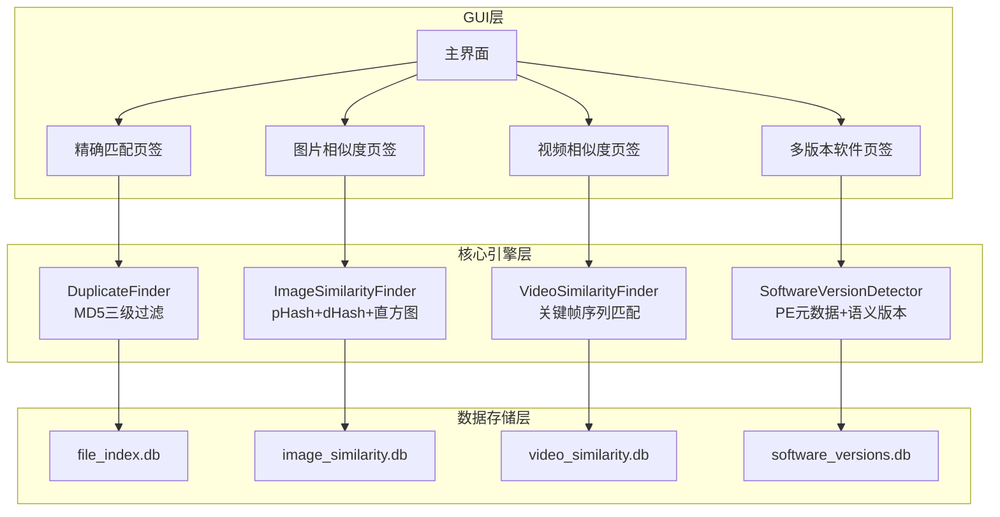
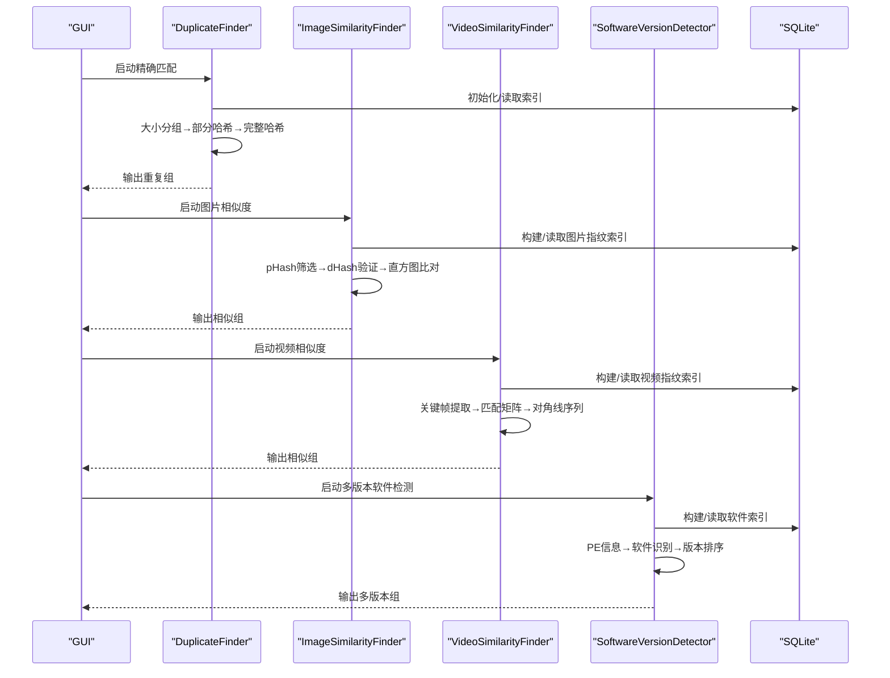
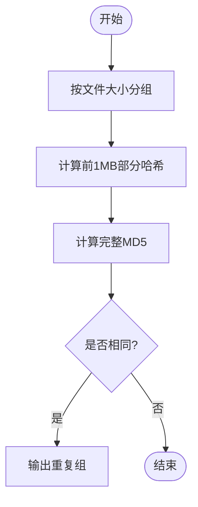
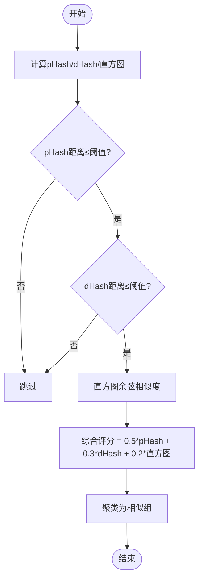
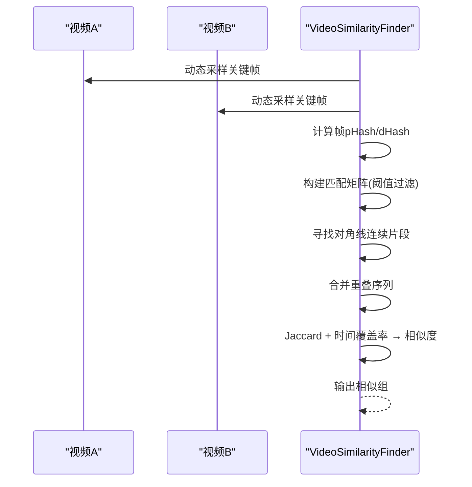
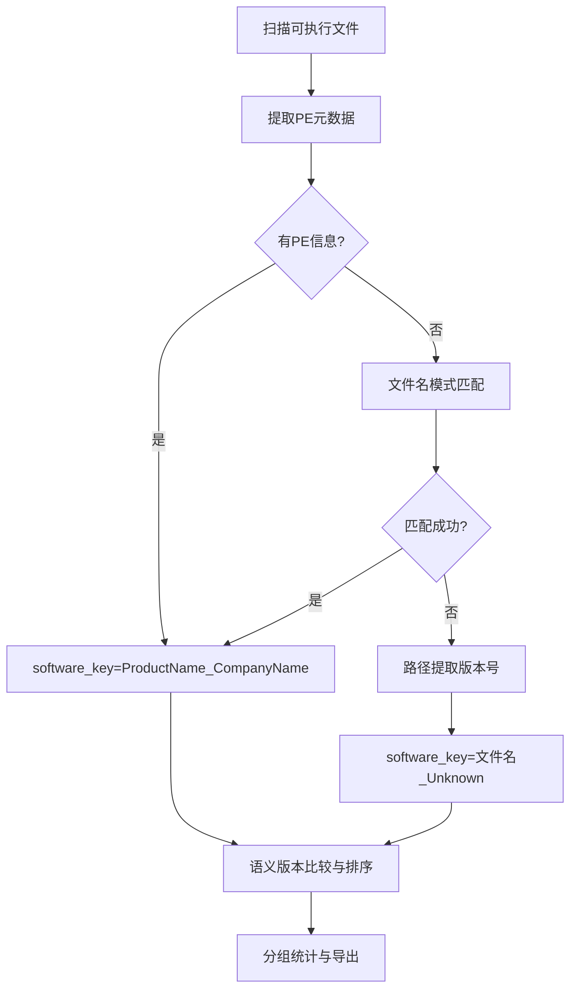

# 核心算法实现

<cite>
**本文引用的文件**
- [core/duplicate_finder.py](file://core/duplicate_finder.py)
- [core/visual_similarity.py](file://core/visual_similarity.py)
- [core/video_similarity.py](file://core/video_similarity.py)
- [core/software_version_detector.py](file://core/software_version_detector.py)
- [README.md](file://README.md)
- [docs/IMAGE_SIMILARITY_SPEC.md](file://docs/IMAGE_SIMILARITY_SPEC.md)
</cite>

## 目录
1. [简介](#简介)
2. [项目结构](#项目结构)
3. [核心组件](#核心组件)
4. [架构总览](#架构总览)
5. [详细组件分析](#详细组件分析)
6. [依赖关系分析](#依赖关系分析)
7. [性能与复杂度](#性能与复杂度)
8. [故障排查指南](#故障排查指南)
9. [结论](#结论)
10. [附录](#附录)

## 简介
本文件围绕仓库中的核心算法实现，系统性阐述以下能力：
- 多级哈希策略（文件大小分组、部分哈希计算、完整哈希验证）的三层筛选机制
- 感知哈希（pHash、dHash）与颜色直方图的图像相似度计算方法
- 视频关键帧提取与滑动窗口匹配算法
- 时间复杂度分析与性能优化策略、参数调优建议
- 结合代码路径的流程图与调用序列图

## 项目结构
本项目采用分层模块化设计：
- GUI层：用户交互与结果展示
- 核心引擎层：精确重复检测、图片相似度、视频相似度、多版本软件识别
- 数据存储层：SQLite数据库索引与统计

图表来源
- [README.md:376-401](file://README.md#L376-L401)

章节来源
- [README.md:338-401](file://README.md#L338-L401)

## 核心组件
- 精确重复检测：基于文件大小分组、前1MB部分哈希、完整MD5的三级过滤，支持多线程并行与WAL模式数据库优化。
- 图片相似度检测：pHash快速筛选、dHash二次验证、颜色直方图余弦相似度精确比对，综合加权评分。
- 视频相似度检测：动态采样关键帧、逐帧pHash/dHash、构建匹配矩阵并寻找对角线连续片段，结合Jaccard与时间覆盖率评分。
- 多版本软件检测：PE元数据提取、智能软件识别、语义化版本比较与分组统计。

章节来源
- [core/duplicate_finder.py:25-73](file://core/duplicate_finder.py#L25-L73)
- [core/visual_similarity.py:94-121](file://core/visual_similarity.py#L94-L121)
- [core/video_similarity.py:174-203](file://core/video_similarity.py#L174-L203)
- [core/software_version_detector.py:30-95](file://core/software_version_detector.py#L30-L95)

## 架构总览
系统通过GUI触发不同检测模式，核心引擎分别执行各自算法流程，并将结果持久化到独立SQLite数据库，支持增量扫描与批量写入。

图表来源
- [core/duplicate_finder.py:324-387](file://core/duplicate_finder.py#L324-L387)
- [core/visual_similarity.py:410-513](file://core/visual_similarity.py#L410-L513)
- [core/video_similarity.py:547-652](file://core/video_similarity.py#L547-L652)
- [core/software_version_detector.py:391-481](file://core/software_version_detector.py#L391-L481)

## 详细组件分析

### 精确重复检测（MD5三级过滤）
- 第一级：按文件大小分组，仅对同大小组进行后续处理，显著降低I/O与哈希计算量。
- 第二级：计算前1MB的部分哈希（MD5），进一步缩小候选集。
- 第三级：对候选文件计算完整MD5，确认完全相同的文件组。
- 并发与存储：使用线程池并行计算；SQLite启用WAL、缓存与内存映射，批量插入减少事务开销。

图表来源
- [core/duplicate_finder.py:324-387](file://core/duplicate_finder.py#L324-L387)
- [core/duplicate_finder.py:402-504](file://core/duplicate_finder.py#L402-L504)
- [core/duplicate_finder.py:506-595](file://core/duplicate_finder.py#L506-L595)

章节来源
- [core/duplicate_finder.py:133-175](file://core/duplicate_finder.py#L133-L175)
- [core/duplicate_finder.py:208-311](file://core/duplicate_finder.py#L208-L311)
- [core/duplicate_finder.py:324-387](file://core/duplicate_finder.py#L324-L387)
- [core/duplicate_finder.py:436-504](file://core/duplicate_finder.py#L436-L504)
- [core/duplicate_finder.py:506-595](file://core/duplicate_finder.py#L506-L595)

### 图片相似度检测（pHash + dHash + 颜色直方图）
- 指纹计算：对每张图片生成pHash（感知哈希）、dHash（差异哈希）以及RGB三通道各256bin的颜色直方图（共768值）。
- 三级过滤：
  - 第1级：pHash汉明距离阈值快速筛选
  - 第2级：dHash汉明距离二次验证（精确模式）
  - 第3级：颜色直方图余弦相似度精确比对
- 综合评分：pHash权重0.5、dHash权重0.3、直方图权重0.2，得到0-100分相似度。

图表来源
- [core/visual_similarity.py:21-91](file://core/visual_similarity.py#L21-L91)
- [core/visual_similarity.py:334-409](file://core/visual_similarity.py#L334-L409)
- [core/visual_similarity.py:410-513](file://core/visual_similarity.py#L410-L513)

章节来源
- [core/visual_similarity.py:94-121](file://core/visual_similarity.py#L94-L121)
- [core/visual_similarity.py:241-332](file://core/visual_similarity.py#L241-L332)
- [core/visual_similarity.py:334-409](file://core/visual_similarity.py#L334-L409)
- [core/visual_similarity.py:410-513](file://core/visual_similarity.py#L410-L513)
- [docs/IMAGE_SIMILARITY_SPEC.md:24-77](file://docs/IMAGE_SIMILARITY_SPEC.md#L24-L77)
- [docs/IMAGE_SIMILARITY_SPEC.md:79-131](file://docs/IMAGE_SIMILARITY_SPEC.md#L79-L131)

### 视频相似度检测（关键帧序列匹配与滑动窗口）
- 关键帧提取：根据视频时长动态确定采样帧数（5-50帧），均匀分布时间点定位并提取帧。
- 帧指纹：对每帧计算pHash与dHash。
- 匹配矩阵：构建两视频帧间的匹配矩阵（基于pHash汉明距离阈值）。
- 对角线序列：寻找长度≥阈值的对角线连续片段，合并重叠序列。
- 相似度评分：结合Jaccard相似度与时间覆盖率加权得出最终分数。

图表来源
- [core/video_similarity.py:21-151](file://core/video_similarity.py#L21-L151)
- [core/video_similarity.py:154-172](file://core/video_similarity.py#L154-L172)
- [core/video_similarity.py:389-495](file://core/video_similarity.py#L389-L495)
- [core/video_similarity.py:498-545](file://core/video_similarity.py#L498-L545)
- [core/video_similarity.py:547-652](file://core/video_similarity.py#L547-L652)

章节来源
- [core/video_similarity.py:174-203](file://core/video_similarity.py#L174-L203)
- [core/video_similarity.py:310-367](file://core/video_similarity.py#L310-L367)
- [core/video_similarity.py:389-495](file://core/video_similarity.py#L389-L495)
- [core/video_similarity.py:498-545](file://core/video_similarity.py#L498-L545)
- [core/video_similarity.py:547-652](file://core/video_similarity.py#L547-L652)

### 多版本软件检测（PE元数据与语义版本）
- PE元数据提取：读取ProductName、CompanyName、FileVersion等字段。
- 智能识别：优先级顺序为PE信息→文件名模式匹配→路径版本号提取。
- 版本比较：使用packaging.version进行语义化版本比较，未知版本排后。
- 分组统计：按software_key聚合，统计版本数量、总大小、最新/最旧版本。

图表来源
- [core/software_version_detector.py:178-244](file://core/software_version_detector.py#L178-L244)
- [core/software_version_detector.py:246-316](file://core/software_version_detector.py#L246-L316)
- [core/software_version_detector.py:318-354](file://core/software_version_detector.py#L318-L354)
- [core/software_version_detector.py:391-481](file://core/software_version_detector.py#L391-L481)
- [core/software_version_detector.py:483-538](file://core/software_version_detector.py#L483-L538)

章节来源
- [core/software_version_detector.py:30-95](file://core/software_version_detector.py#L30-L95)
- [core/software_version_detector.py:178-244](file://core/software_version_detector.py#L178-L244)
- [core/software_version_detector.py:246-316](file://core/software_version_detector.py#L246-L316)
- [core/software_version_detector.py:318-354](file://core/software_version_detector.py#L318-L354)
- [core/software_version_detector.py:391-481](file://core/software_version_detector.py#L391-L481)
- [core/software_version_detector.py:483-538](file://core/software_version_detector.py#L483-L538)

## 依赖关系分析
- 外部库依赖：
  - 图片/视频：Pillow、imagehash、OpenCV、NumPy
  - 软件检测：pefile、packaging
  - 数据库：sqlite3（WAL模式优化）
- 模块耦合：
  - GUI与各核心引擎松耦合，通过回调与数据库交互
  - 各引擎独立维护数据库，避免跨域污染
- 潜在循环依赖：无直接循环导入，模块职责清晰

章节来源
- [README.md:229-248](file://README.md#L229-L248)
- [core/visual_similarity.py:8-18](file://core/visual_similarity.py#L8-L18)
- [core/video_similarity.py:7-18](file://core/video_similarity.py#L7-L18)
- [core/software_version_detector.py:7-27](file://core/software_version_detector.py#L7-L27)

## 性能与复杂度

### 时间复杂度
- 精确重复检测
  - 大小分组：O(N)
  - 部分哈希：O(K)，K为候选文件数，单次读前1MB
  - 完整哈希：O(M)，M为候选文件数，逐块读取全文件
  - 总体近似 O(N + K + M)
- 图片相似度
  - 指纹计算：O(P)，P为图片数
  - 相似度比对：朴素O(P^2)，可通过索引/分桶优化
  - 直方图相似度：固定768维向量点积与范数，常数时间
- 视频相似度
  - 关键帧提取：O(F)，F为采样帧数
  - 匹配矩阵：O(F1×F2)
  - 对角线序列：O(F1×F2)
  - 总体近似 O(F1×F2)
- 多版本软件检测
  - PE解析：O(E)，E为可执行文件数
  - 版本比较：O(V log V)，V为版本数

### 空间复杂度
- 精确重复检测：主要占用数据库与批处理缓冲区
- 图片相似度：指纹与直方图存储，内存峰值受批处理大小影响
- 视频相似度：匹配矩阵与帧指纹列表，长视频可能占用较多内存
- 多版本软件检测：PE缓存与数据库记录

### 性能优化策略
- 数据库优化：WAL模式、同步频率降低、缓存与内存映射、批量写入
- 并行计算：线程池/进程池并行处理，磁盘类型自适应线程数
- 懒加载与缓存：缩略图与PE信息LRU缓存，减少重复计算
- 增量扫描：基于修改时间与哈希判断，避免重复索引

章节来源
- [core/duplicate_finder.py:75-131](file://core/duplicate_finder.py#L75-L131)
- [core/duplicate_finder.py:133-175](file://core/duplicate_finder.py#L133-L175)
- [core/visual_similarity.py:123-169](file://core/visual_similarity.py#L123-L169)
- [core/video_similarity.py:205-239](file://core/video_similarity.py#L205-L239)
- [core/software_version_detector.py:109-159](file://core/software_version_detector.py#L109-L159)
- [README.md:403-467](file://README.md#L403-L467)

### 参数调优建议
- 精确重复检测
  - 工作线程数：HDD限制2-4，SSD可更高；chunk_size影响I/O吞吐
- 图片相似度
  - pHash阈值：默认12（平衡模式），严格5-8，宽松16-30
  - 检测模式：fast仅pHash，precise加入dHash与直方图
- 视频相似度
  - 相似度阈值：0.5-0.95，推荐0.7；最小视频时长过滤短视频
  - 采样帧数：自动根据时长调整（5-50）
- 多版本软件检测
  - 格式过滤：按需选择EXE/DLL/MSI/JAR/PYD或自定义后缀
  - 增量扫描：日常维护使用，首次全量

章节来源
- [README.md:311-335](file://README.md#L311-L335)
- [docs/IMAGE_SIMILARITY_SPEC.md:133-157](file://docs/IMAGE_SIMILARITY_SPEC.md#L133-L157)
- [core/visual_similarity.py:410-479](file://core/visual_similarity.py#L410-L479)
- [core/video_similarity.py:547-612](file://core/video_similarity.py#L547-L612)

## 故障排查指南
- 精确重复检测
  - 问题：数据库锁定
  - 解决：增大busy_timeout、使用WAL模式、减少并发写入
- 图片相似度
  - 问题：某些相似未检出
  - 解决：提高pHash阈值至12-15，使用精确模式
  - 问题：误报
  - 解决：降低阈值至8-10，检查直方图相似度阈值
- 视频相似度
  - 问题：剪辑/转码导致不匹配
  - 解决：降低相似度阈值至0.6-0.65，增加采样帧数
- 多版本软件检测
  - 问题：显示unknown版本
  - 解决：检查PE信息缺失，利用路径/文件名提取版本

章节来源
- [core/duplicate_finder.py:190-201](file://core/duplicate_finder.py#L190-L201)
- [docs/IMAGE_SIMILARITY_SPEC.md:679-725](file://docs/IMAGE_SIMILARITY_SPEC.md#L679-L725)
- [README.md:521-561](file://README.md#L521-L561)

## 结论
本系统通过多级过滤与多种相似度度量，实现了高效且鲁棒的重复与相似检测：
- 精确重复检测以文件大小与哈希为核心，适合字节级去重
- 图片相似度以pHash/dHash/直方图组合，兼顾速度与精度
- 视频相似度通过关键帧序列与滑动窗口匹配，抗剪辑/转码
- 多版本软件检测借助PE元数据与语义版本，有效区分不同版本
整体采用并行计算与数据库优化，满足TB级数据处理需求。

## 附录
- 参考文档与规格
  - 图片相似度检测规格：[docs/IMAGE_SIMILARITY_SPEC.md](file://docs/IMAGE_SIMILARITY_SPEC.md)
  - 项目说明与性能基准：[README.md](file://README.md)