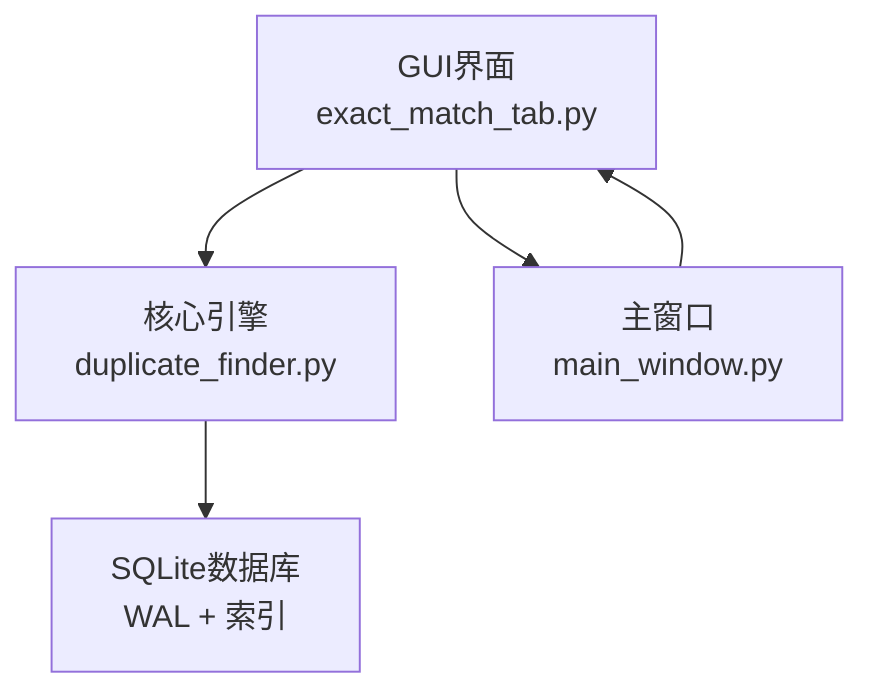
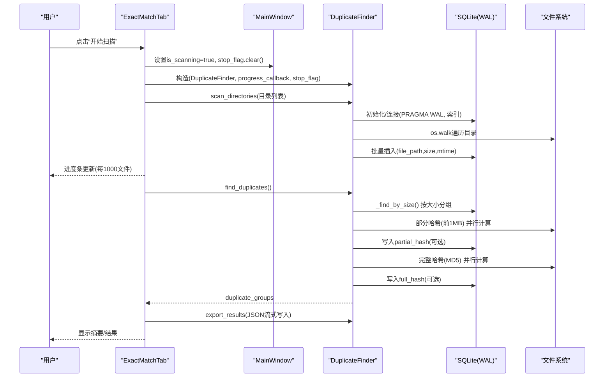
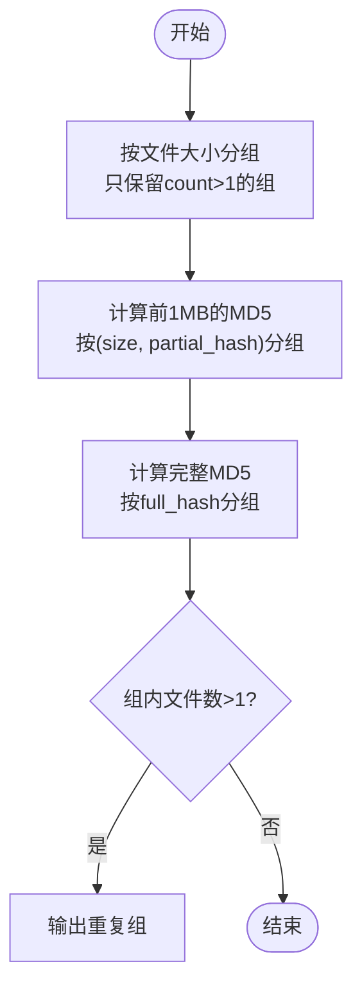
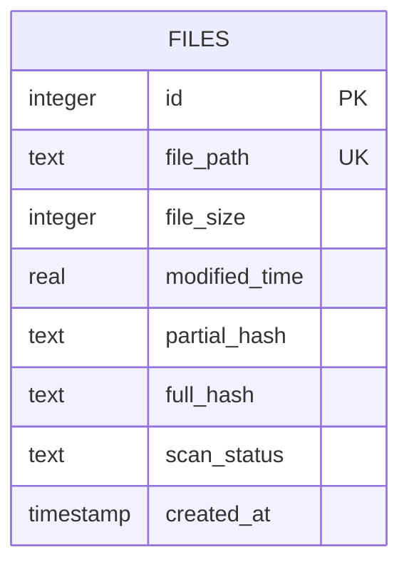
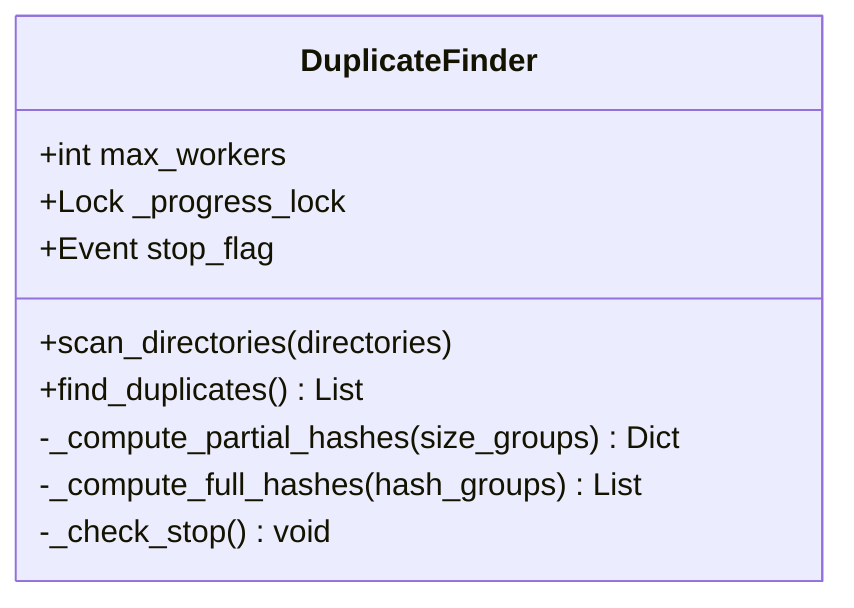
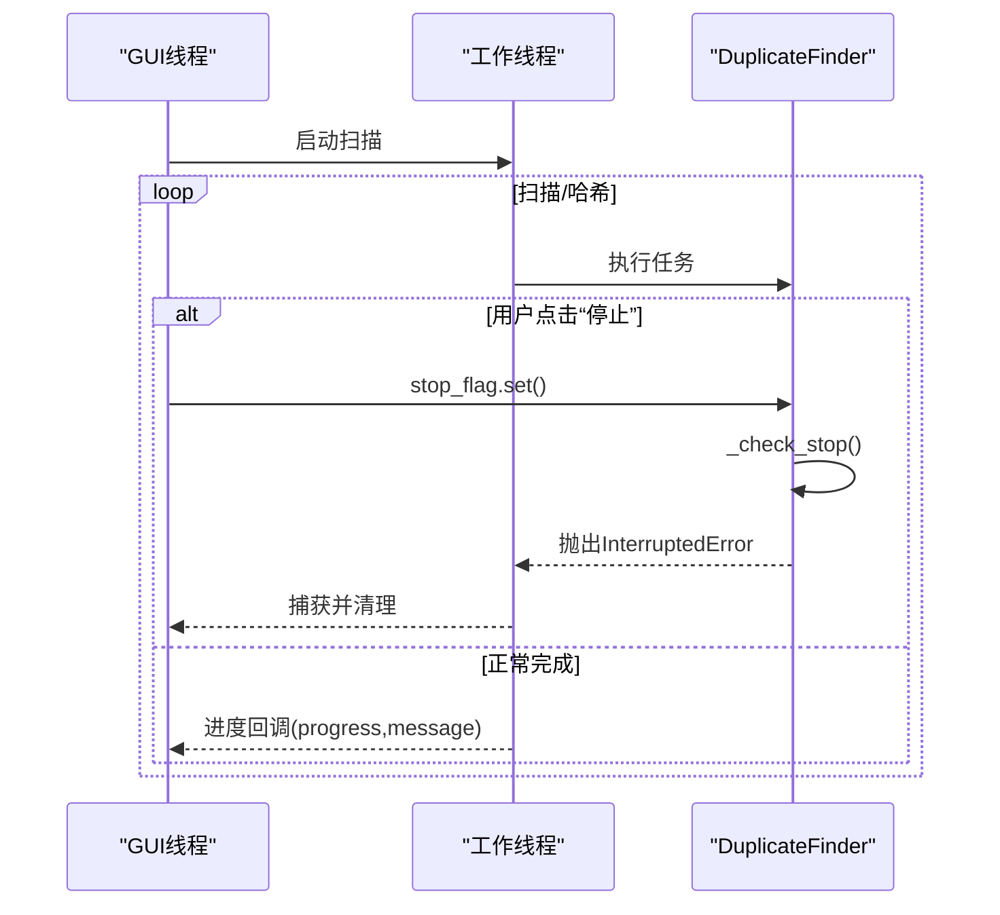
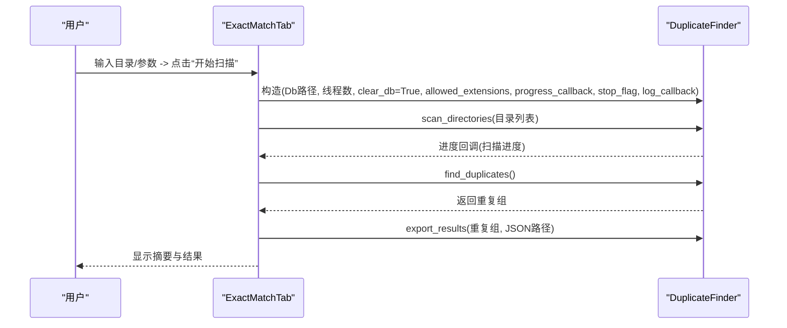
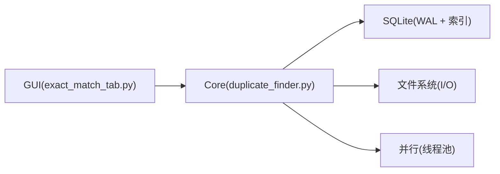

# 精确匹配检测算法

<cite>
**本文引用的文件**
- [core/duplicate_finder.py](file://core/duplicate_finder.py)
- [gui_modules/exact_match_tab.py](file://gui_modules/exact_match_tab.py)
- [gui_modules/main_window.py](file://gui_modules/main_window.py)
- [README.md](file://README.md)
</cite>

## 目录
1. [简介](#简介)
2. [项目结构](#项目结构)
3. [核心组件](#核心组件)
4. [架构总览](#架构总览)
5. [详细组件分析](#详细组件分析)
6. [依赖关系分析](#依赖关系分析)
7. [性能考量](#性能考量)
8. [故障排查指南](#故障排查指南)
9. [结论](#结论)
10. [附录：使用示例与最佳实践](#附录使用示例与最佳实践)

## 简介
本文件面向“精确匹配检测”功能，系统性阐述多级哈希策略的工作原理与实现细节。该策略通过三层筛选机制高效定位完全相同的文件：
- 第一层：基于文件大小分组，快速剔除不可能重复的文件
- 第二层：计算前1MB的部分哈希（MD5），进一步缩小候选集
- 第三层：对候选文件计算完整文件的MD5哈希，确认精确重复

同时，文档覆盖SQLite数据库索引设计、WAL模式优化、批量插入策略、并行处理机制、进度回调、停止标志与错误恢复等工程要点，并提供基于DuplicateFinder类的具体使用方式与流程图示。

## 项目结构
本项目采用分层组织：GUI模块负责交互与状态管理，核心引擎提供高性能的重复检测能力，并通过SQLite持久化索引。

图表来源
- [gui_modules/exact_match_tab.py:293-379](file://gui_modules/exact_match_tab.py#L293-L379)
- [core/duplicate_finder.py:133-175](file://core/duplicate_finder.py#L133-L175)
- [gui_modules/main_window.py:22-46](file://gui_modules/main_window.py#L22-L46)

章节来源
- [gui_modules/exact_match_tab.py:293-379](file://gui_modules/exact_match_tab.py#L293-L379)
- [core/duplicate_finder.py:133-175](file://core/duplicate_finder.py#L133-L175)
- [gui_modules/main_window.py:22-46](file://gui_modules/main_window.py#L22-L46)

## 核心组件
- DuplicateFinder：核心类，封装扫描、三级过滤、并行计算、数据库操作与结果导出。
- ExactMatchTab：GUI标签页，负责参数配置、启动/停止扫描、进度展示与结果查看。
- MainWindow：主窗口，维护共享状态（如stop_flag）并协调各标签页。

章节来源
- [core/duplicate_finder.py:25-73](file://core/duplicate_finder.py#L25-L73)
- [gui_modules/exact_match_tab.py:18-41](file://gui_modules/exact_match_tab.py#L18-L41)
- [gui_modules/main_window.py:22-46](file://gui_modules/main_window.py#L22-L46)

## 架构总览
下图展示了从用户触发到结果导出的端到端流程，包括GUI线程与后台工作线程的协作、进度回调与停止标志传递。

图表来源
- [gui_modules/exact_match_tab.py:293-379](file://gui_modules/exact_match_tab.py#L293-L379)
- [core/duplicate_finder.py:208-387](file://core/duplicate_finder.py#L208-L387)
- [core/duplicate_finder.py:436-595](file://core/duplicate_finder.py#L436-L595)
- [core/duplicate_finder.py:597-658](file://core/duplicate_finder.py#L597-L658)

## 详细组件分析

### 多级哈希策略与三层筛选
- 第一层：基于文件大小分组
  - 通过SQL查询统计相同大小的文件组，仅保留count>1的组，大幅减少后续IO与计算量。
  - 关键方法：_find_by_size
- 第二层：部分哈希（前1MB）
  - 对每个候选文件读取前1MB数据计算MD5，将“size+partial_hash”作为键进行分组，再次过滤。
  - 并行计算：ThreadPoolExecutor，按磁盘类型自适应线程数；进度更新频率降低至每500个文件一次。
  - 关键方法：_compute_partial_hashes
- 第三层：完整哈希验证
  - 对剩余候选文件逐块读取（默认chunk_size=64KB）计算完整MD5，按full_hash分组确认重复。
  - 并行计算：全局线程池复用，避免频繁创建销毁开销；进度更新频率为每100个文件一次。
  - 关键方法：_compute_full_hashes

图表来源
- [core/duplicate_finder.py:402-434](file://core/duplicate_finder.py#L402-L434)
- [core/duplicate_finder.py:436-504](file://core/duplicate_finder.py#L436-L504)
- [core/duplicate_finder.py:506-595](file://core/duplicate_finder.py#L506-L595)

章节来源
- [core/duplicate_finder.py:402-595](file://core/duplicate_finder.py#L402-L595)

### SQLite数据库设计与优化
- 表结构
  - files表包含file_path、file_size、modified_time、partial_hash、full_hash、scan_status等字段，支持增量与去重。
- 索引设计
  - idx_file_size：加速按大小分组查询
  - idx_partial_hash：加速部分哈希分组
  - idx_full_hash：加速完整哈希分组
  - idx_scan_status：便于状态查询
- WAL模式与PRAGMA优化
  - journal_mode=WAL提升并发写性能
  - synchronous=NORMAL降低同步频率
  - cache_size=-64000（64MB缓存）、temp_store=MEMORY、mmap_size=268435456（256MB内存映射）
  - busy_timeout=60000ms避免锁冲突
- 批量插入
  - 使用executemany批量写入，批次大小5000，显著减少事务次数与I/O开销

图表来源
- [core/duplicate_finder.py:133-175](file://core/duplicate_finder.py#L133-L175)

章节来源
- [core/duplicate_finder.py:133-175](file://core/duplicate_finder.py#L133-L175)
- [core/duplicate_finder.py:312-323](file://core/duplicate_finder.py#L312-L323)

### 并行处理与线程安全
- 自动线程数选择
  - 根据CPU核心数与磁盘类型（HDD/SSD/NVMe）自适应调整max_workers，HDD限制2-4线程避免寻道风暴，SSD可更高。
- 线程池复用
  - 在完整哈希阶段使用单个全局线程池，避免反复创建销毁带来的开销。
- 进度计数器保护
  - 使用threading.Lock(_progress_lock)保护多线程下的processed计数，防止竞态条件导致进度丢失。
- 停止标志
  - 通过_stop检查抛出InterruptedError，GUI捕获后优雅退出。

图表来源
- [core/duplicate_finder.py:25-73](file://core/duplicate_finder.py#L25-L73)
- [core/duplicate_finder.py:75-131](file://core/duplicate_finder.py#L75-L131)
- [core/duplicate_finder.py:436-504](file://core/duplicate_finder.py#L436-L504)
- [core/duplicate_finder.py:506-595](file://core/duplicate_finder.py#L506-L595)

章节来源
- [core/duplicate_finder.py:75-131](file://core/duplicate_finder.py#L75-L131)
- [core/duplicate_finder.py:436-504](file://core/duplicate_finder.py#L436-L504)
- [core/duplicate_finder.py:506-595](file://core/duplicate_finder.py#L506-L595)

### 进度回调、停止标志与错误恢复
- 进度回调
  - 目录扫描阶段：每1000文件更新一次UI，减少刷新开销
  - 部分哈希阶段：每500文件更新一次
  - 完整哈希阶段：每100文件更新一次
- 停止标志
  - GUI线程设置stop_flag.set()，核心逻辑中_check_stop检查并抛出InterruptedError，GUI捕获后清理状态
- 错误恢复
  - 文件访问异常被捕获并记录警告，不影响整体流程
  - 数据库连接使用上下文管理器，异常时回滚并关闭连接

图表来源
- [gui_modules/exact_match_tab.py:293-379](file://gui_modules/exact_match_tab.py#L293-L379)
- [core/duplicate_finder.py:203-207](file://core/duplicate_finder.py#L203-L207)
- [core/duplicate_finder.py:436-504](file://core/duplicate_finder.py#L436-L504)
- [core/duplicate_finder.py:506-595](file://core/duplicate_finder.py#L506-L595)

章节来源
- [gui_modules/exact_match_tab.py:293-379](file://gui_modules/exact_match_tab.py#L293-L379)
- [core/duplicate_finder.py:203-207](file://core/duplicate_finder.py#L203-L207)

### 使用示例：基于DuplicateFinder的精确匹配检测
以下示例展示如何在GUI中调用DuplicateFinder进行精确匹配检测，包括参数配置、进度回调、停止标志与结果导出。

图表来源
- [gui_modules/exact_match_tab.py:320-379](file://gui_modules/exact_match_tab.py#L320-L379)
- [core/duplicate_finder.py:208-387](file://core/duplicate_finder.py#L208-L387)
- [core/duplicate_finder.py:597-658](file://core/duplicate_finder.py#L597-L658)

章节来源
- [gui_modules/exact_match_tab.py:320-379](file://gui_modules/exact_match_tab.py#L320-L379)
- [core/duplicate_finder.py:208-387](file://core/duplicate_finder.py#L208-L387)
- [core/duplicate_finder.py:597-658](file://core/duplicate_finder.py#L597-L658)

## 依赖关系分析
- GUI与核心引擎解耦：GUI仅负责参数收集、状态管理与结果展示，核心逻辑集中在DuplicateFinder。
- 数据库层：SQLite通过WAL与索引优化读写性能，批量插入减少事务开销。
- 外部依赖：Python标准库（hashlib、sqlite3、concurrent.futures、threading）满足高性能需求，无额外第三方依赖用于精确匹配。

图表来源
- [gui_modules/exact_match_tab.py:293-379](file://gui_modules/exact_match_tab.py#L293-L379)
- [core/duplicate_finder.py:133-175](file://core/duplicate_finder.py#L133-L175)
- [core/duplicate_finder.py:483-504](file://core/duplicate_finder.py#L483-L504)
- [core/duplicate_finder.py:570-595](file://core/duplicate_finder.py#L570-L595)

章节来源
- [gui_modules/exact_match_tab.py:293-379](file://gui_modules/exact_match_tab.py#L293-L379)
- [core/duplicate_finder.py:133-175](file://core/duplicate_finder.py#L133-L175)
- [core/duplicate_finder.py:483-504](file://core/duplicate_finder.py#L483-L504)
- [core/duplicate_finder.py:570-595](file://core/duplicate_finder.py#L570-L595)

## 性能考量
- I/O优化
  - 批量插入（5000条/批）减少事务次数
  - 合理chunk_size（默认64KB）平衡内存与I/O
- 并行优化
  - HDD环境限制线程数避免磁头寻道风暴
  - 全局线程池复用，避免频繁创建销毁
- 数据库优化
  - WAL模式、synchronous=NORMAL、大缓存与内存映射
  - 针对size/partial_hash/full_hash建立索引
- 进度与UI
  - 降低UI更新频率（每1000/500/100文件）减少渲染开销
- 扩展性
  - 允许extensions过滤减少扫描范围
  - 支持clear_db控制是否清空历史数据

[本节为通用性能讨论，不直接分析具体代码文件]

## 故障排查指南
- 常见问题
  - “database is locked”：已设置busy_timeout=60000ms缓解，必要时降低并发或重试
  - 权限不足：捕获OSError/PermissionError并记录警告，跳过无法访问的文件
  - 停止扫描：确保GUI正确设置stop_flag，核心逻辑中_check_stop会抛出InterruptedError
- 建议步骤
  - 检查数据库路径与权限
  - 调整线程数（HDD用4-8，SSD用8-16）
  - 使用增量扫描（不清空数据库）以减少重复索引
  - 查看日志输出定位具体失败文件

章节来源
- [core/duplicate_finder.py:190-201](file://core/duplicate_finder.py#L190-L201)
- [core/duplicate_finder.py:203-207](file://core/duplicate_finder.py#L203-L207)
- [gui_modules/exact_match_tab.py:368-379](file://gui_modules/exact_match_tab.py#L368-L379)

## 结论
本系统通过“文件大小分组 → 部分哈希 → 完整哈希”的三级筛选机制，在保证100%准确性的前提下极大降低了I/O与计算成本。结合SQLite WAL模式、索引优化与批量插入，以及自适应并行策略与线程安全设计，实现了TB级数据的高效精确匹配。GUI层提供了友好的交互体验与完善的进度/停止/错误处理机制，便于大规模场景下的稳定运行。

[本节为总结性内容，不直接分析具体代码文件]

## 附录：使用示例与最佳实践
- 基本用法
  - 在GUI中选择目录与参数，点击“开始扫描”，等待完成后查看结果并导出JSON
- 参数调优
  - 线程数：HDD 4-8，SSD 8-16
  - 文件类型过滤：按需启用以缩小扫描范围
  - 数据库路径：自定义file_index.db，支持增量扫描
- 最佳实践
  - 首次全量扫描，后续增量扫描
  - 定期清理历史数据或归档结果
  - 监控日志与进度，及时调整线程数与过滤条件

章节来源
- [gui_modules/exact_match_tab.py:293-379](file://gui_modules/exact_match_tab.py#L293-L379)
- [README.md:280-336](file://README.md#L280-L336)