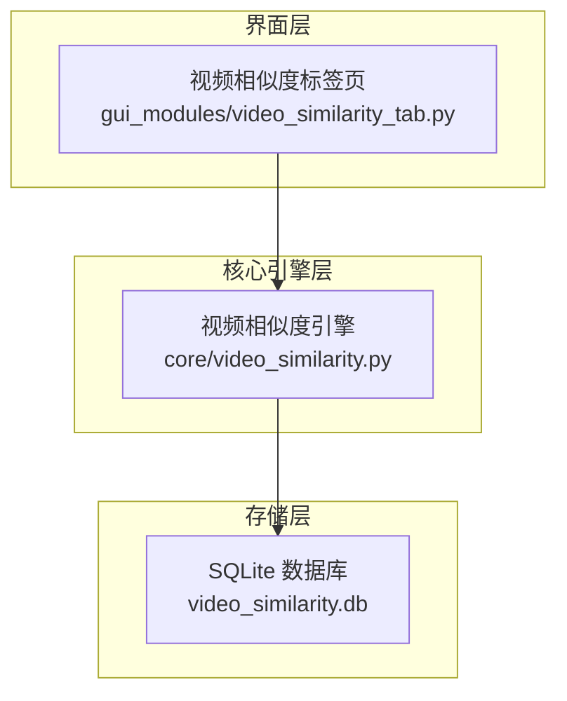
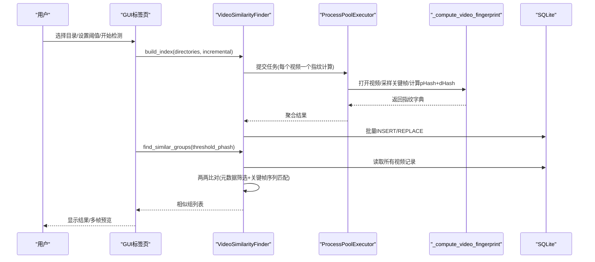
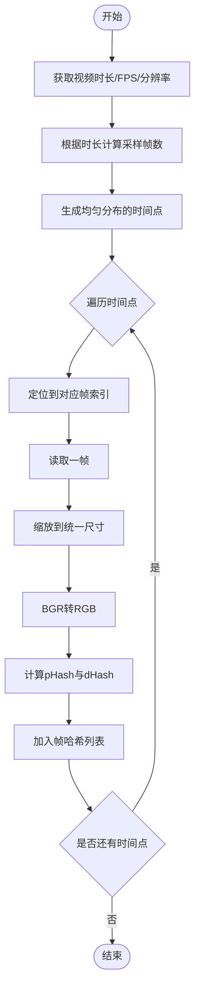
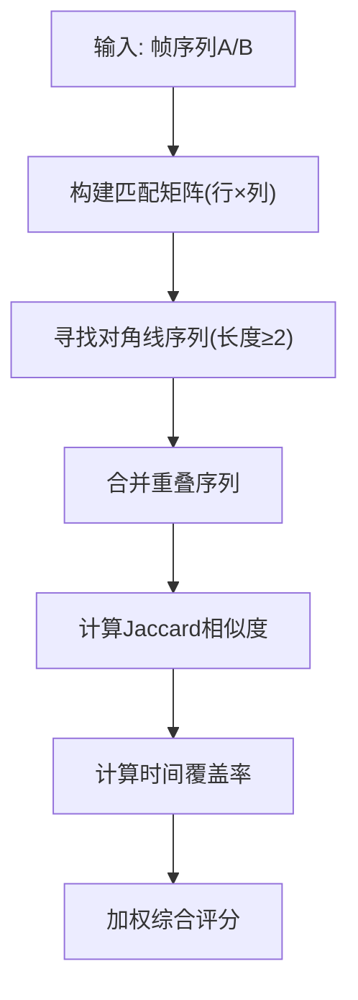
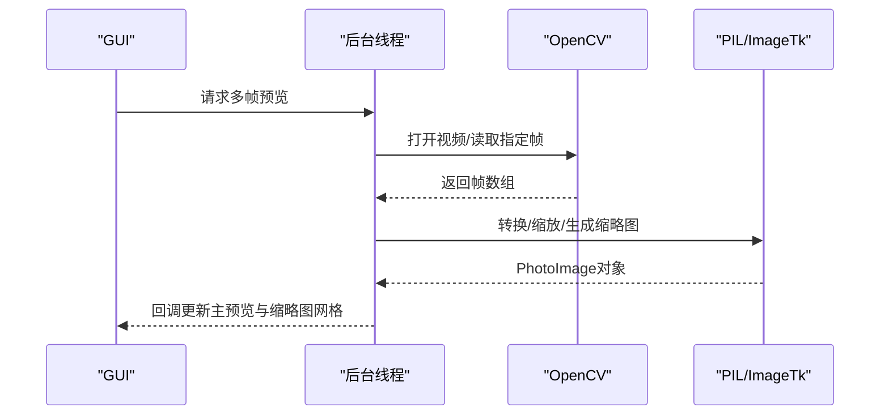
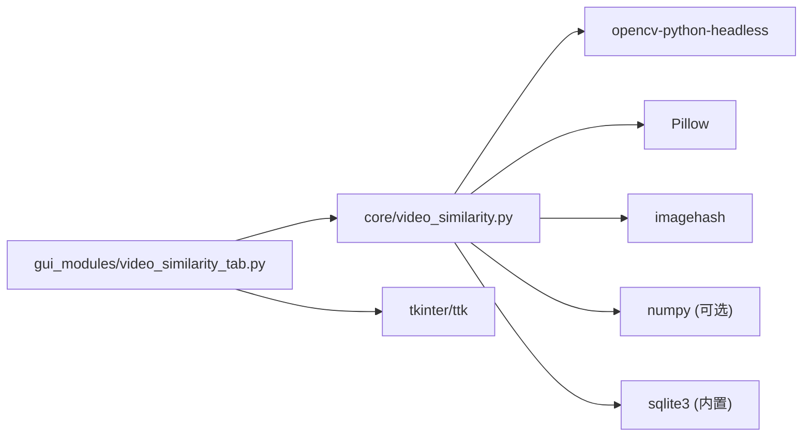

# 视频相似度检测算法

<cite>
**本文引用的文件**
- [core/video_similarity.py](file://core/video_similarity.py)
- [gui_modules/video_similarity_tab.py](file://gui_modules/video_similarity_tab.py)
- [README.md](file://README.md)
- [requirements.txt](file://requirements.txt)
</cite>

## 目录
1. [简介](#简介)
2. [项目结构](#项目结构)
3. [核心组件](#核心组件)
4. [架构总览](#架构总览)
5. [详细组件分析](#详细组件分析)
6. [依赖关系分析](#依赖关系分析)
7. [性能考量](#性能考量)
8. [故障排查指南](#故障排查指南)
9. [结论](#结论)
10. [附录](#附录)

## 简介
本文件围绕“视频相似度检测”能力，系统阐述关键帧提取策略、滑动窗口匹配算法与多帧预览功能的实现原理；说明视频解码过程、帧采样技术、相似度计算方法；解释多线程/多进程并行处理机制、内存管理与大文件处理优化策略；给出支持的视频格式列表、性能基准参考与参数调优建议，并提供代码路径指引以便快速定位实现。

## 项目结构
本项目采用分层组织：GUI层负责交互与展示，核心引擎层负责视频索引构建、相似组查找与结果输出，数据存储使用SQLite持久化索引与统计信息。视频相似度功能由核心模块提供，GUI通过标签页集成并扩展多帧预览等交互能力。

图表来源
- [core/video_similarity.py:174-239](file://core/video_similarity.py#L174-L239)
- [gui_modules/video_similarity_tab.py:18-49](file://gui_modules/video_similarity_tab.py#L18-L49)

章节来源
- [README.md:338-372](file://README.md#L338-L372)

## 核心组件
- 视频指纹计算（关键帧提取+哈希）：在独立函数中完成，便于多进程并行执行。
- 视频相似度检测器：封装索引构建、批量插入、相似组查找、统计与格式化等功能。
- GUI标签页：负责用户配置、进度反馈、日志输出、结果展示与多帧预览。

章节来源
- [core/video_similarity.py:21-151](file://core/video_similarity.py#L21-L151)
- [core/video_similarity.py:174-726](file://core/video_similarity.py#L174-L726)
- [gui_modules/video_similarity_tab.py:18-49](file://gui_modules/video_similarity_tab.py#L18-L49)

## 架构总览
整体流程包括：扫描目录→多进程并行提取关键帧→写入SQLite→基于关键帧序列的相似度比对→分组输出。GUI层提供阈值调节、增量/全量扫描、格式过滤、进度与日志、结果查看与多帧预览。

图表来源
- [core/video_similarity.py:310-367](file://core/video_similarity.py#L310-L367)
- [core/video_similarity.py:547-652](file://core/video_similarity.py#L547-L652)
- [gui_modules/video_similarity_tab.py:331-399](file://gui_modules/video_similarity_tab.py#L331-L399)

## 详细组件分析

### 关键帧提取策略
- 动态采样：根据视频时长决定采样帧数，短视频取中间帧或固定数量，长视频按每分钟约1帧上限控制，避免过长视频导致过多计算。
- 均匀分布时间点：将时长等分，确保覆盖全片，减少局部偏差。
- 预处理：统一缩放至最大边限制，BGR转RGB，再转为PIL图像用于哈希计算。
- 双哈希：每帧同时计算pHash与dHash，兼顾抗缩放/压缩与细节差异。

图表来源
- [core/video_similarity.py:21-151](file://core/video_similarity.py#L21-L151)
- [core/video_similarity.py:154-172](file://core/video_similarity.py#L154-L172)

章节来源
- [core/video_similarity.py:21-151](file://core/video_similarity.py#L21-L151)
- [core/video_similarity.py:154-172](file://core/video_similarity.py#L154-L172)

### 滑动窗口匹配算法（对角线序列）
- 匹配矩阵：以两个视频的关键帧序列为行列，基于pHash汉明距离阈值构建二元匹配矩阵。
- 对角线序列：寻找连续的对角线匹配段，表示时间轴上的连续相似片段。
- 合并重叠：对重叠或相邻的序列进行合并，得到不重复的匹配区间。
- 相似度评分：综合Jaccard相似度与时间覆盖率加权得出最终分数。

图表来源
- [core/video_similarity.py:389-496](file://core/video_similarity.py#L389-L496)
- [core/video_similarity.py:498-545](file://core/video_similarity.py#L498-L545)

章节来源
- [core/video_similarity.py:389-496](file://core/video_similarity.py#L389-L496)
- [core/video_similarity.py:498-545](file://core/video_similarity.py#L498-L545)

### 多帧预览功能
- 触发时机：用户在结果树或详情窗口中选择某视频时触发。
- 异步加载：在新线程中打开视频，依据时长自适应提取若干帧（如1/3/5帧），生成主图与大/小缩略图。
- 缓存策略：LRU式缓存最近访问的视频帧数据，避免重复解码；主线程更新UI保证流畅性。
- 交互方式：点击缩略图可切换主预览图，时间戳辅助定位。

图表来源
- [gui_modules/video_similarity_tab.py:455-552](file://gui_modules/video_similarity_tab.py#L455-L552)
- [gui_modules/video_similarity_tab.py:553-652](file://gui_modules/video_similarity_tab.py#L553-L652)
- [gui_modules/video_similarity_tab.py:1025-1190](file://gui_modules/video_similarity_tab.py#L1025-L1190)

章节来源
- [gui_modules/video_similarity_tab.py:455-652](file://gui_modules/video_similarity_tab.py#L455-L652)
- [gui_modules/video_similarity_tab.py:1025-1190](file://gui_modules/video_similarity_tab.py#L1025-L1190)

### 视频解码与帧采样技术
- 解码库：使用OpenCV VideoCapture进行跨格式解码与帧读取。
- 帧定位：通过CAP_PROP_POS_FRAMES跳转到目标帧索引，提高随机访问效率。
- 采样策略：短/中/长视频分别采用不同帧数与分布策略，平衡精度与性能。
- 颜色空间：统一转换为RGB后再进行图像处理，避免BGR导致的色彩问题。

章节来源
- [core/video_similarity.py:21-151](file://core/video_similarity.py#L21-L151)
- [gui_modules/video_similarity_tab.py:553-652](file://gui_modules/video_similarity_tab.py#L553-L652)

### 相似度计算方法
- 单帧相似度：基于pHash的汉明距离，距离越小越相似。
- 序列相似度：构建匹配矩阵后寻找对角线序列，衡量连续相似片段。
- 综合评分：Jaccard相似度（匹配帧占比）与时间覆盖率加权，得到最终百分比分数。
- 阈值判定：默认汉明距离阈值与相似度阈值共同决定“相似”判定。

章节来源
- [core/video_similarity.py:389-545](file://core/video_similarity.py#L389-L545)
- [core/video_similarity.py:547-652](file://core/video_similarity.py#L547-L652)

### 多线程并行处理机制
- 多进程并行：使用ProcessPoolExecutor对每个视频的关键帧提取与哈希计算进行并行，突破Python GIL限制，提升吞吐。
- 工作进程数：自动检测CPU核心数并限制最大进程数，避免过度并发造成I/O争用。
- 批处理写入：累积一定数量的指纹结果后批量插入数据库，降低IO开销。
- 进度与日志：通过回调函数向GUI报告进度与日志，保持界面响应。

章节来源
- [core/video_similarity.py:310-367](file://core/video_similarity.py#L310-L367)
- [core/video_similarity.py:174-203](file://core/video_similarity.py#L174-L203)
- [gui_modules/video_similarity_tab.py:331-399](file://gui_modules/video_similarity_tab.py#L331-L399)

### 内存管理与大文件处理优化
- 数据库优化：启用WAL模式、合理缓存大小、内存映射与临时存储优化，提升读写性能。
- 批量操作：批量插入减少事务次数，降低锁竞争。
- 图片/帧缩放：统一缩放至最大边限制，避免超大帧占用过多内存。
- 预览缓存：LRU策略限制缓存项数量，及时释放旧资源，防止内存膨胀。
- 流式处理：逐帧读取与按需解码，避免一次性加载整个视频。

章节来源
- [core/video_similarity.py:205-239](file://core/video_similarity.py#L205-L239)
- [core/video_similarity.py:369-387](file://core/video_similarity.py#L369-L387)
- [gui_modules/video_similarity_tab.py:629-638](file://gui_modules/video_similarity_tab.py#L629-L638)

### 视频格式支持列表
- 支持格式：MP4、AVI、MKV、MOV、WMV、FLV、WebM、MPEG、MPG、3GP、M4V、RMVB、RM、TS、MTS、F4V、F4P、ASF、VOB等。
- 限制：加密DRM视频无法解码。

章节来源
- [core/video_similarity.py:177-180](file://core/video_similarity.py#L177-L180)
- [README.md:584-590](file://README.md#L584-L590)

### 性能基准测试（参考）
- 环境：i7-9700K、16GB RAM、NVMe SSD、Windows 10。
- 视频相似度吞吐：约40视频/分钟（1080p H.264）。
- 典型规模：100个5分钟视频约3分钟；1000个约25分钟；10000个约4小时。

章节来源
- [README.md:499-507](file://README.md#L499-L507)

### 参数调优指南
- 相似度阈值（汉明距离）：默认12（平衡模式），严格模式≤8，宽松模式>15。
- 扫描方式：首次全量扫描建立索引，后续增量扫描仅处理新增/修改。
- 最小视频时长：过滤过短视频以减少误报与计算开销。
- 采样帧数：自动根据时长调整，必要时可通过调整时长分段策略影响精度与速度。
- 数据库PRAGMA：WAL、同步级别、缓存大小、内存映射已内置优化。

章节来源
- [gui_modules/video_similarity_tab.py:56-77](file://gui_modules/video_similarity_tab.py#L56-L77)
- [core/video_similarity.py:154-172](file://core/video_similarity.py#L154-L172)
- [core/video_similarity.py:205-239](file://core/video_similarity.py#L205-L239)
- [README.md:328-335](file://README.md#L328-L335)

## 依赖关系分析
- 运行时依赖：
  - OpenCV（无头版）：视频解码与帧提取。
  - Pillow：图像转换与缩放。
  - imagehash：感知哈希（pHash/dHash）。
  - NumPy：数值计算（可选加速）。
- 存储依赖：SQLite3（内置）。
- GUI依赖：tkinter/ttk。

图表来源
- [requirements.txt:10-23](file://requirements.txt#L10-L23)
- [core/video_similarity.py:21-49](file://core/video_similarity.py#L21-L49)

章节来源
- [requirements.txt:10-23](file://requirements.txt#L10-L23)
- [core/video_similarity.py:21-49](file://core/video_similarity.py#L21-L49)

## 性能考量
- I/O密集：视频解码与磁盘读取是瓶颈，建议使用SSD并合理设置线程/进程数。
- 计算密集：哈希计算与矩阵比对可在多核上并行，注意进程数不宜过高以免上下文切换开销过大。
- 内存管理：帧与图像需及时释放，预览缓存限制数量，避免长期运行内存增长。
- 数据库：WAL模式与批量写入显著提升并发写入性能，定期维护（如VACUUM）可减少碎片。

[本节为通用指导，无需特定文件引用]

## 故障排查指南
- 无法打开视频：检查OpenCV编解码器支持、文件格式是否受支持、文件是否被占用或加密。
- 未提取到关键帧：确认视频可读、FPS与帧计数有效，必要时调整采样策略。
- 相似度结果为空：检查阈值设置是否过严、视频时长过短或内容差异过大。
- 界面卡顿：确认预览加载在后台线程执行，避免在主线程进行耗时解码。
- 数据库异常：检查WAL模式与权限，必要时重建索引或清理历史数据。

章节来源
- [core/video_similarity.py:21-151](file://core/video_similarity.py#L21-L151)
- [gui_modules/video_similarity_tab.py:553-652](file://gui_modules/video_similarity_tab.py#L553-L652)
- [README.md:521-561](file://README.md#L521-L561)

## 结论
该视频相似度检测方案通过关键帧序列匹配与滑动窗口（对角线序列）算法，实现对剪辑、转码与调色等变体的鲁棒检测；结合多进程并行、数据库优化与预览缓存，兼顾精度与性能。通过合理的阈值与采样策略，可在大规模视频库中高效识别相似组，并提供直观的多帧预览与交互体验。

[本节为总结，无需特定文件引用]

## 附录

### 代码实现示例（路径指引）
- 关键帧提取与指纹计算：[core/video_similarity.py:21-151](file://core/video_similarity.py#L21-L151)
- 动态采样帧数：[core/video_similarity.py:154-172](file://core/video_similarity.py#L154-L172)
- 相似度计算与序列匹配：[core/video_similarity.py:389-545](file://core/video_similarity.py#L389-L545)
- 索引构建与批量插入：[core/video_similarity.py:310-387](file://core/video_similarity.py#L310-L387)
- 相似组查找：[core/video_similarity.py:547-652](file://core/video_similarity.py#L547-L652)
- GUI多帧预览与缓存：[gui_modules/video_similarity_tab.py:455-652](file://gui_modules/video_similarity_tab.py#L455-L652)
- 详情窗口增强预览：[gui_modules/video_similarity_tab.py:1025-1190](file://gui_modules/video_similarity_tab.py#L1025-L1190)

### 最佳实践建议
- 首次全量扫描建立索引，后续使用增量扫描减少重复计算。
- 根据场景调整阈值：严格模式用于高保真去重，宽松模式用于版权检测。
- 控制预览缓存大小，避免长时间运行内存泄漏。
- 定期维护数据库（VACUUM）以保持查询性能。
- 在大目录下分批扫描，避免单次任务过长导致超时或资源耗尽。

[本节为通用建议，无需特定文件引用]