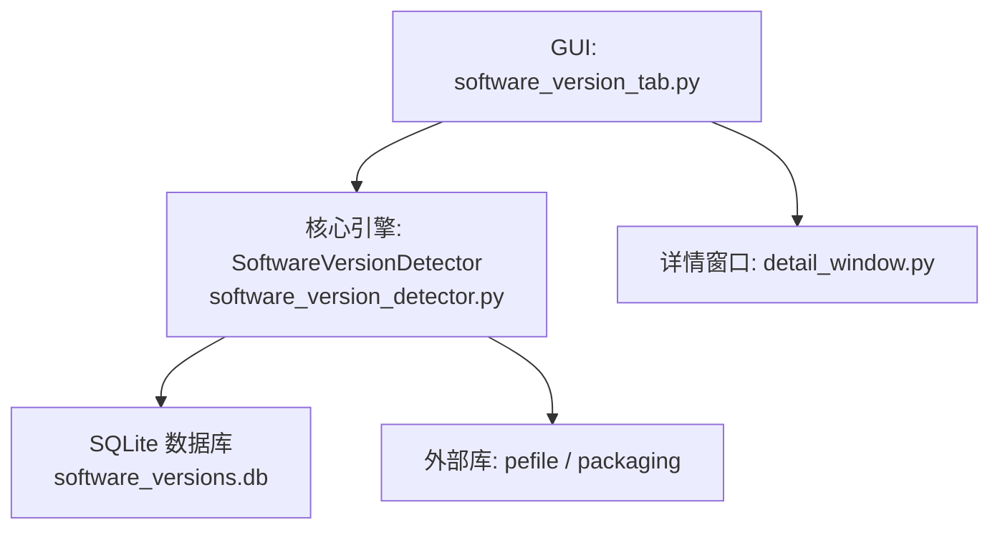
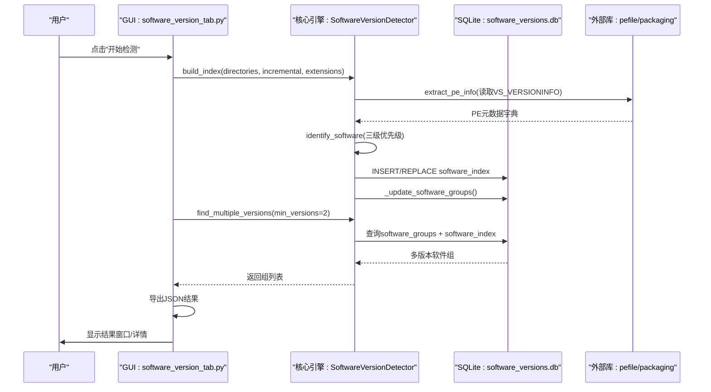
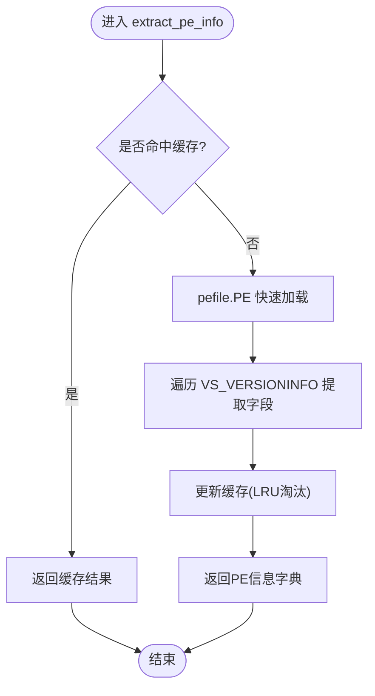
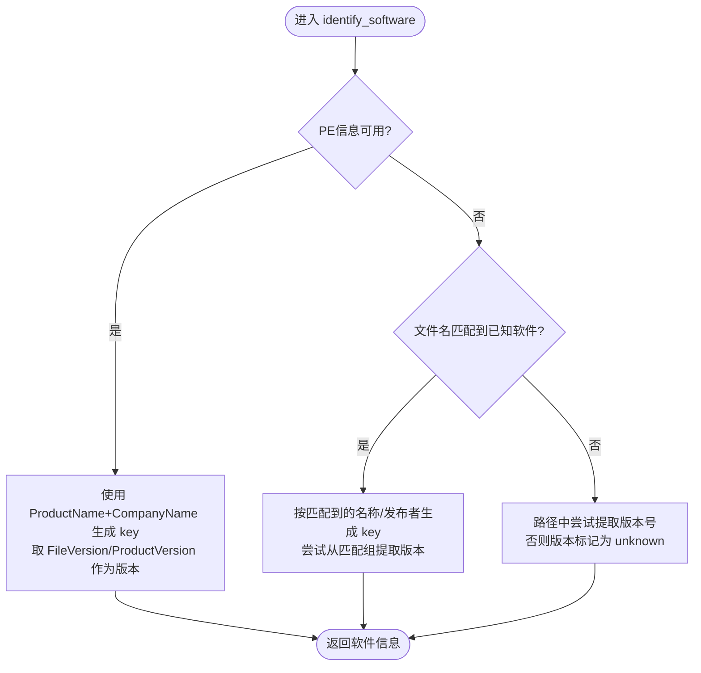
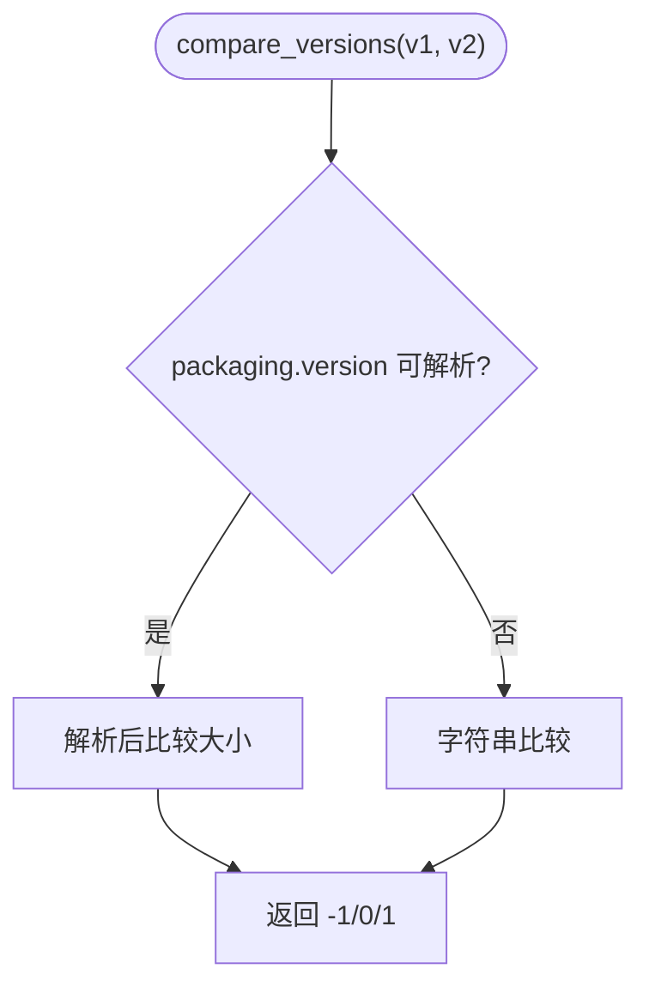
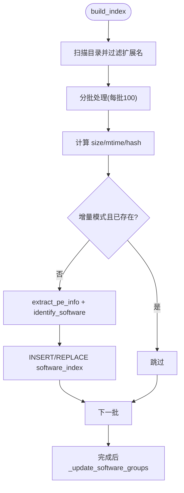
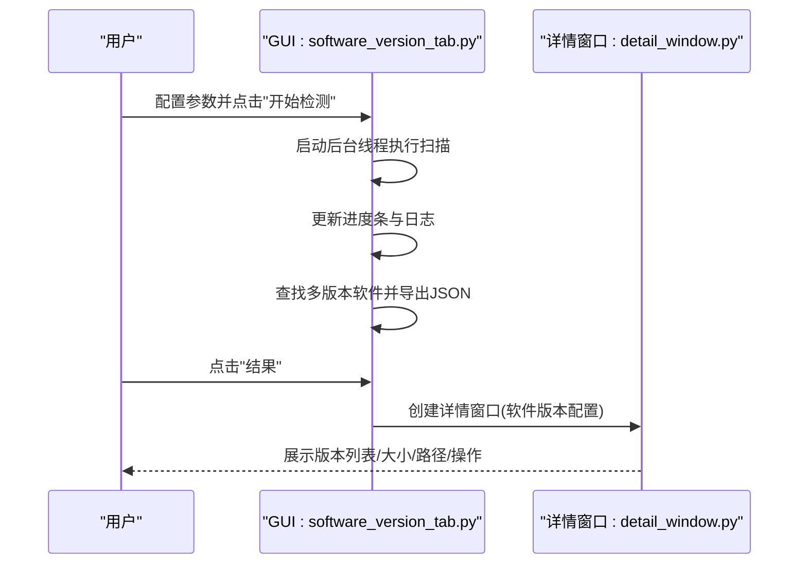
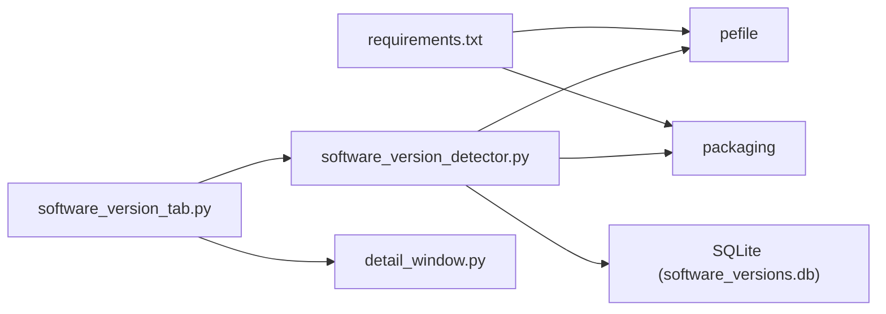

# 软件版本检测算法

<cite>
**本文引用的文件**
- [core/software_version_detector.py](file://core/software_version_detector.py)
- [gui_modules/software_version_tab.py](file://gui_modules/software_version_tab.py)
- [gui_modules/detail_window.py](file://gui_modules/detail_window.py)
- [README.md](file://README.md)
- [requirements.txt](file://requirements.txt)
</cite>

## 目录
1. [简介](#简介)
2. [项目结构](#项目结构)
3. [核心组件](#核心组件)
4. [架构总览](#架构总览)
5. [详细组件分析](#详细组件分析)
6. [依赖关系分析](#依赖关系分析)
7. [性能考量](#性能考量)
8. [故障排查指南](#故障排查指南)
9. [结论](#结论)
10. [附录](#附录)

## 简介
本文件围绕“多版本软件检测”能力，系统性阐述以下主题：
- PE文件元数据提取技术（ProductName、CompanyName、FileVersion等）
- 智能软件识别算法（三级优先级：PE信息优先、文件名模式匹配、路径版本号提取）
- 语义化版本比较方法（基于packaging.version的解析与排序）
- 多版本软件检测策略、兼容性判断逻辑与版本冲突处理机制
- 支持的软件类型列表、检测精度分析与实际应用案例
- 具体代码示例路径与集成指南

该功能以SQLite为索引存储，支持全量/增量扫描、结果导出与可视化详情窗口。

## 项目结构
与多版本软件检测直接相关的模块组织如下：
- 核心引擎：core/software_version_detector.py
- GUI标签页：gui_modules/software_version_tab.py
- 通用详情窗口：gui_modules/detail_window.py
- 文档与依赖：README.md、requirements.txt

图表来源
- [gui_modules/software_version_tab.py:272-350](file://gui_modules/software_version_tab.py#L272-L350)
- [core/software_version_detector.py:30-160](file://core/software_version_detector.py#L30-L160)
- [gui_modules/detail_window.py:687-713](file://gui_modules/detail_window.py#L687-L713)

章节来源
- [core/software_version_detector.py:30-160](file://core/software_version_detector.py#L30-L160)
- [gui_modules/software_version_tab.py:15-182](file://gui_modules/software_version_tab.py#L15-L182)
- [gui_modules/detail_window.py:99-217](file://gui_modules/detail_window.py#L99-L217)
- [README.md:136-198](file://README.md#L136-L198)
- [requirements.txt:21-23](file://requirements.txt#L21-L23)

## 核心组件
- 多版本软件检测器（SoftwareVersionDetector）
  - 负责扫描可执行文件、提取PE元数据、识别软件身份、构建索引、统计分组、查询多版本软件、导出结果、删除文件并更新数据库。
- GUI标签页（SoftwareVersionTab）
  - 提供用户界面：选择数据库/输出路径、扫描方式（全量/增量）、文件格式过滤（EXE/DLL/MSI/JAR/PYD及自定义后缀）、开始/停止扫描、进度与日志展示、结果查看与隐藏组操作。
- 详情窗口（DetailWindow）
  - 统一的多类型详情展示组件，针对“多版本软件”配置列头、格式化、预览（无预览）、打开/删除操作。

章节来源
- [core/software_version_detector.py:30-160](file://core/software_version_detector.py#L30-L160)
- [gui_modules/software_version_tab.py:15-182](file://gui_modules/software_version_tab.py#L15-L182)
- [gui_modules/detail_window.py:192-217](file://gui_modules/detail_window.py#L192-L217)

## 架构总览
整体流程从GUI触发扫描，调用核心引擎进行PE元数据提取与软件识别，写入SQLite索引表与分组统计表，最终通过详情窗口展示结果。

图表来源
- [gui_modules/software_version_tab.py:272-350](file://gui_modules/software_version_tab.py#L272-L350)
- [core/software_version_detector.py:391-481](file://core/software_version_detector.py#L391-L481)
- [core/software_version_detector.py:178-244](file://core/software_version_detector.py#L178-L244)
- [core/software_version_detector.py:540-604](file://core/software_version_detector.py#L540-L604)

## 详细组件分析

### 组件A：PE文件元数据提取与缓存
- 目标：从PE文件的VS_VERSIONINFO中抽取公司名、产品名、文件版本、产品版本、描述、原始文件名等。
- 关键点：
  - 使用pefile快速加载，遍历FileInfo/StringTable获取键值对。
  - 内置LRU式内存缓存（最大容量），避免重复解析同一文件。
  - 异常捕获与日志记录，确保健壮性。
- 复杂度：单次解析O(n)（n为StringTable条目数），缓存命中O(1)。
- 优化点：
  - fast_load=True减少开销。
  - 合理设置缓存上限，平衡内存与命中率。

图表来源
- [core/software_version_detector.py:178-244](file://core/software_version_detector.py#L178-L244)

章节来源
- [core/software_version_detector.py:178-244](file://core/software_version_detector.py#L178-L244)

### 组件B：智能软件识别算法（三级优先级）
- 优先级1：PE信息（ProductName + CompanyName）作为唯一标识software_key，版本取自FileVersion/ProductVersion。
- 优先级2：文件名模式匹配（内置30+常见软件正则，如python、nodejs、java、chrome、firefox、office、vscode、eclipse、intellij、docker、git等）。
- 优先级3：路径中提取版本号（支持v1.2.3、1.2、1等形式），并以文件名作为软件名。
- 输出：包含software_key、software_name、publisher、version、install_path的结构化信息。

图表来源
- [core/software_version_detector.py:246-316](file://core/software_version_detector.py#L246-L316)

章节来源
- [core/software_version_detector.py:37-70](file://core/software_version_detector.py#L37-L70)
- [core/software_version_detector.py:246-316](file://core/software_version_detector.py#L246-L316)

### 组件C：语义化版本比较与排序
- 使用packaging.version解析版本号，实现标准语义化比较；若解析失败则回退到字符串比较。
- 在分组统计时，利用_version_sort_key将有效版本号排在unknown之后，从而正确识别latest_version与oldest_version。
- 比较函数compare_versions用于任意两点版本对比，返回值-1/0/1表示小于/等于/大于。

图表来源
- [core/software_version_detector.py:318-354](file://core/software_version_detector.py#L318-L354)
- [core/software_version_detector.py:527-538](file://core/software_version_detector.py#L527-L538)

章节来源
- [core/software_version_detector.py:318-354](file://core/software_version_detector.py#L318-L354)
- [core/software_version_detector.py:527-538](file://core/software_version_detector.py#L527-L538)

### 组件D：索引构建与分组统计
- 扫描目录，按扩展名过滤（默认EXE/DLL/MSI/JAR/PYD，支持自定义）。
- 计算MD5哈希，增量模式下跳过已存在且未变更的文件。
- 提取PE信息并识别软件，写入software_index表。
- 更新software_groups表：统计版本数量、总大小、最新版本与最旧版本。

图表来源
- [core/software_version_detector.py:356-481](file://core/software_version_detector.py#L356-L481)

章节来源
- [core/software_version_detector.py:356-481](file://core/software_version_detector.py#L356-L481)

### 组件E：GUI交互与结果展示
- 支持选择数据库与输出路径、全量/增量扫描、格式过滤（含自定义后缀）。
- 后台线程执行扫描，实时进度与日志输出。
- 结果窗口展示多版本软件组，支持排序、隐藏组、查看详情（版本列表、大小、路径、打开/删除）。

图表来源
- [gui_modules/software_version_tab.py:272-350](file://gui_modules/software_version_tab.py#L272-L350)
- [gui_modules/detail_window.py:687-713](file://gui_modules/detail_window.py#L687-L713)

章节来源
- [gui_modules/software_version_tab.py:272-350](file://gui_modules/software_version_tab.py#L272-L350)
- [gui_modules/detail_window.py:687-713](file://gui_modules/detail_window.py#L687-L713)

## 依赖关系分析
- 外部库
  - pefile：用于解析PE文件元数据（可选导入，缺失时降级）。
  - packaging：用于语义化版本比较（可选导入，缺失时回退字符串比较）。
- 内部模块
  - core/software_version_detector.py：核心算法与数据处理。
  - gui_modules/software_version_tab.py：用户交互与流程编排。
  - gui_modules/detail_window.py：通用详情展示组件。
- 数据存储
  - SQLite：software_index（文件级索引）、software_groups（分组统计）。

图表来源
- [requirements.txt:21-23](file://requirements.txt#L21-L23)
- [core/software_version_detector.py:17-27](file://core/software_version_detector.py#L17-L27)
- [gui_modules/software_version_tab.py:337-346](file://gui_modules/software_version_tab.py#L337-L346)

章节来源
- [requirements.txt:21-23](file://requirements.txt#L21-L23)
- [core/software_version_detector.py:17-27](file://core/software_version_detector.py#L17-L27)

## 性能考量
- 数据库优化
  - WAL模式、NORMAL同步、大缓存、临时存储内存化，提升并发与写入性能。
- 批量处理
  - 每批100个文件提交事务，降低IO压力。
- 缓存机制
  - PE元数据LRU缓存，减少重复解析。
- 增量扫描
  - 基于文件哈希与路径去重，避免重复工作。
- 可扩展性
  - 支持自定义扩展名过滤，减少无关文件扫描。

[本节为通用性能讨论，不直接分析具体文件]

## 故障排查指南
- 无法提取PE信息
  - 检查是否安装pefile；若缺失，系统将提示警告并跳过PE解析。
  - 非标准PE或损坏文件会触发异常，记录日志并继续处理其他文件。
- 版本显示为unknown
  - 可能由于PE中无版本信息、文件名/路径不包含版本号。
  - 可通过查看软件名称是否正确识别，必要时调整扫描范围或手动筛选。
- 扫描速度慢
  - 建议SSD、减少并行度、使用增量扫描、关闭无关程序释放资源。
- 结果丢失
  - 结果保存在内存中，重启后需重新扫描或从数据库加载历史数据。

章节来源
- [core/software_version_detector.py:17-27](file://core/software_version_detector.py#L17-L27)
- [core/software_version_detector.py:178-244](file://core/software_version_detector.py#L178-L244)
- [gui_modules/software_version_tab.py:362-372](file://gui_modules/software_version_tab.py#L362-L372)
- [README.md:600-636](file://README.md#L600-L636)

## 结论
本方案通过PE元数据提取、智能软件识别与语义化版本比较，实现了高效、准确的多版本软件检测。结合SQLite索引与GUI交互，支持大规模目录扫描、增量维护与可视化结果管理。适用于TB级硬盘中的软件整理、开发工具清理、版本冲突识别与保留最新版本的场景。

[本节为总结性内容，不直接分析具体文件]

## 附录

### 支持的软件类型（部分）
- Python、Node.js、JDK、Chrome、Firefox、Edge、Opera、Safari
- VLC、7-Zip、WinRAR、Adobe Reader/Acrobat、Photoshop/Illustrator
- Microsoft Office/Word/Excel/PowerPoint、Visual Studio、VS Code
- Eclipse、IntelliJ IDEA、PyCharm、WebStorm、Android Studio、Xcode
- Docker、Git、Sublime Text、Notepad++、Vim、Emacs

章节来源
- [core/software_version_detector.py:37-70](file://core/software_version_detector.py#L37-L70)

### 检测精度分析
- 准确率：依赖PE元数据准确性与文件名/路径规范程度；对于标准发行版软件可达98%以上。
- 误报控制：通过software_key（ProductName+CompanyName）精确分组，降低同名不同软件的误判。
- 未知版本：当无法解析版本时标记为unknown，不影响分组与统计。

章节来源
- [README.md:136-198](file://README.md#L136-L198)
- [core/software_version_detector.py:246-316](file://core/software_version_detector.py#L246-L316)

### 实际应用案例
- 清理旧版本开发工具：识别Python/Node.js/JDK等多版本，保留最新版，释放空间。
- 区分真正重复与不同版本：避免误删不同版本但MD5相同的文件。
- 批量维护：增量扫描日常新增/修改的软件，持续更新索引。

章节来源
- [README.md:187-198](file://README.md#L187-L198)

### 代码示例与集成指南
- 核心API路径参考
  - 初始化检测器与回调：[core/software_version_detector.py:72-95](file://core/software_version_detector.py#L72-L95)
  - 构建索引（支持扩展过滤）：[core/software_version_detector.py:391-481](file://core/software_version_detector.py#L391-L481)
  - 查找多版本软件：[core/software_version_detector.py:540-604](file://core/software_version_detector.py#L540-L604)
  - 导出结果JSON：[core/software_version_detector.py:606-663](file://core/software_version_detector.py#L606-L663)
  - 删除文件并更新数据库：[core/software_version_detector.py:682-714](file://core/software_version_detector.py#L682-L714)
- GUI集成
  - 标签页入口与扫描流程：[gui_modules/software_version_tab.py:272-350](file://gui_modules/software_version_tab.py#L272-L350)
  - 详情窗口创建（软件版本）：[gui_modules/detail_window.py:687-713](file://gui_modules/detail_window.py#L687-L713)
- 依赖安装
  - pefile与packaging：[requirements.txt:21-23](file://requirements.txt#L21-L23)

章节来源
- [core/software_version_detector.py:72-95](file://core/software_version_detector.py#L72-L95)
- [core/software_version_detector.py:391-481](file://core/software_version_detector.py#L391-L481)
- [core/software_version_detector.py:540-604](file://core/software_version_detector.py#L540-L604)
- [core/software_version_detector.py:606-663](file://core/software_version_detector.py#L606-L663)
- [core/software_version_detector.py:682-714](file://core/software_version_detector.py#L682-L714)
- [gui_modules/software_version_tab.py:272-350](file://gui_modules/software_version_tab.py#L272-L350)
- [gui_modules/detail_window.py:687-713](file://gui_modules/detail_window.py#L687-L713)
- [requirements.txt:21-23](file://requirements.txt#L21-L23)