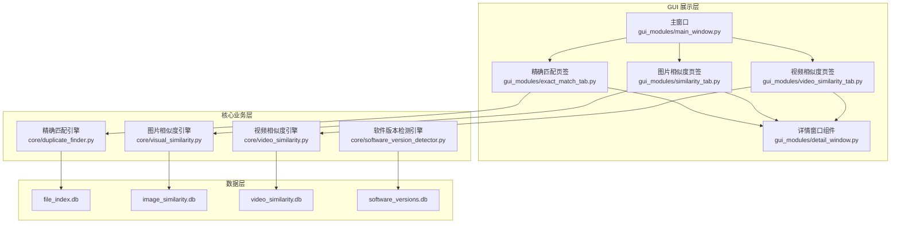
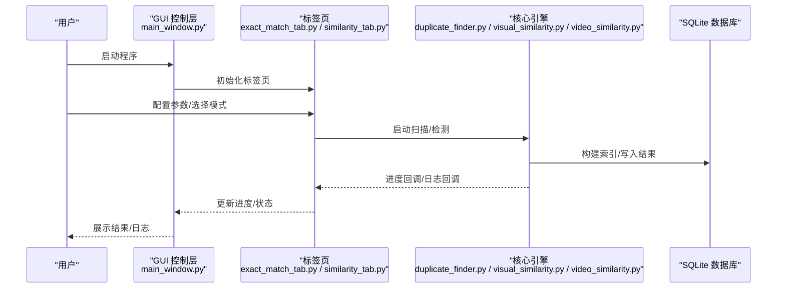
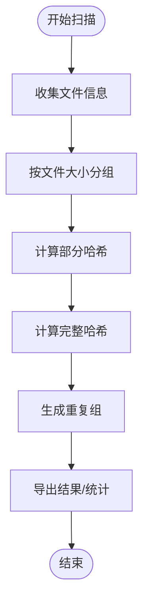
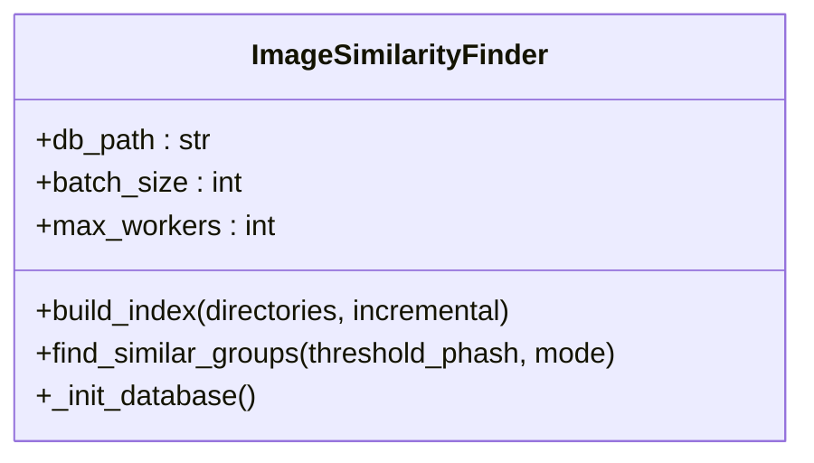
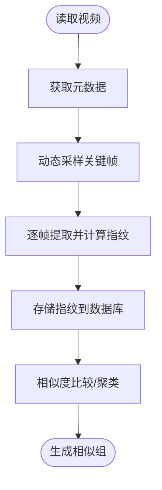
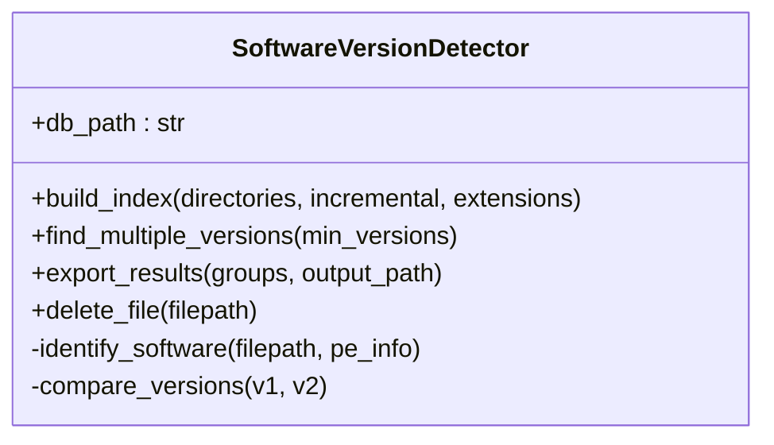
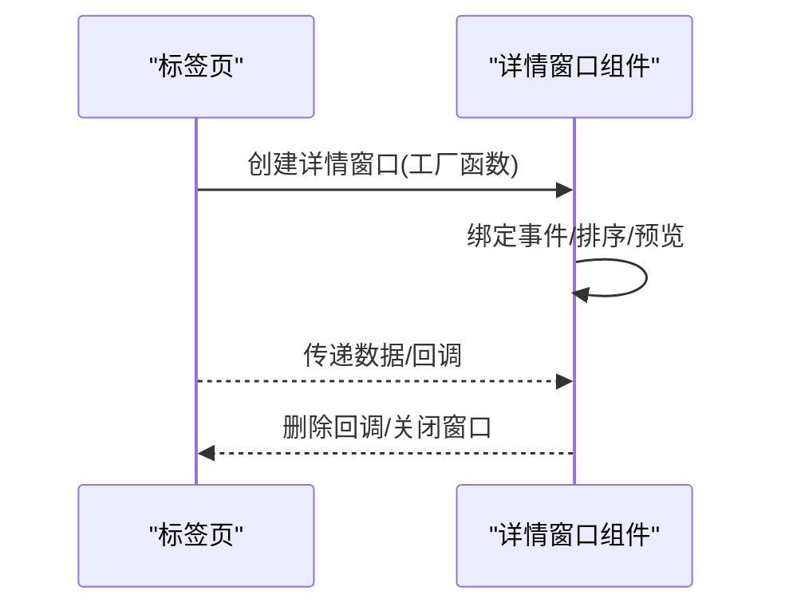
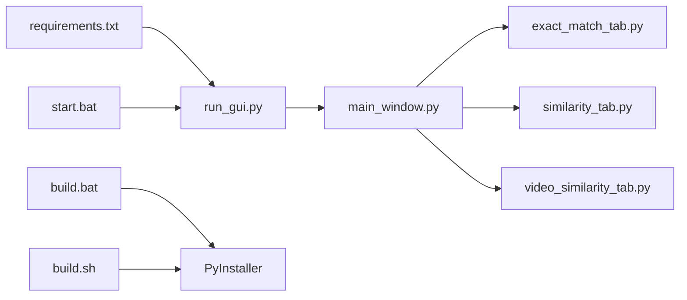

# 故障排除

<cite>
**本文引用的文件**
- [README.md](file://README.md)
- [QUICK_START.md](file://QUICK_START.md)
- [requirements.txt](file://requirements.txt)
- [run_gui.py](file://run_gui.py)
- [start.bat](file://start.bat)
- [build.bat](file://build.bat)
- [build.sh](file://build.sh)
- [core/duplicate_finder.py](file://core/duplicate_finder.py)
- [core/visual_similarity.py](file://core/visual_similarity.py)
- [core/video_similarity.py](file://core/video_similarity.py)
- [core/software_version_detector.py](file://core/software_version_detector.py)
- [gui_modules/main_window.py](file://gui_modules/main_window.py)
- [gui_modules/exact_match_tab.py](file://gui_modules/exact_match_tab.py)
- [gui_modules/similarity_tab.py](file://gui_modules/similarity_tab.py)
- [gui_modules/detail_window.py](file://gui_modules/detail_window.py)
- [docs/COMMON_COMPONENTS_GUIDE.md](file://docs/COMMON_COMPONENTS_GUIDE.md)
- [docs/PROJECT_OVERVIEW.md](file://docs/PROJECT_OVERVIEW.md)
</cite>

## 目录
1. [简介](#简介)
2. [项目结构](#项目结构)
3. [核心组件](#核心组件)
4. [架构总览](#架构总览)
5. [详细组件分析](#详细组件分析)
6. [依赖关系分析](#依赖关系分析)
7. [性能考虑](#性能考虑)
8. [故障排除指南](#故障排除指南)
9. [结论](#结论)
10. [附录](#附录)

## 简介
本指南面向使用“文件重复校验工具”的用户与维护者，提供系统性的故障排除方法，涵盖安装问题、运行时错误、性能问题、日志分析、调试工具使用、错误定位、系统清理、数据库维护与配置修复等。文档结合项目源码与官方文档，给出可操作的诊断步骤与修复方案。

## 项目结构
项目采用分层架构：GUI 展示层（gui_modules）、核心业务层（core）、数据层（SQLite）。GUI 通过标签页承载不同检测模式，核心模块封装具体算法与数据库交互，数据层持久化索引与结果。

图表来源
- [gui_modules/main_window.py:22-86](file://gui_modules/main_window.py#L22-L86)
- [gui_modules/exact_match_tab.py:18-42](file://gui_modules/exact_match_tab.py#L18-L42)
- [gui_modules/similarity_tab.py:18-49](file://gui_modules/similarity_tab.py#L18-L49)
- [core/duplicate_finder.py:22-54](file://core/duplicate_finder.py#L22-L54)
- [core/visual_similarity.py:94-122](file://core/visual_similarity.py#L94-L122)
- [core/video_similarity.py:174-200](file://core/video_similarity.py#L174-L200)
- [core/software_version_detector.py:30-96](file://core/software_version_detector.py#L30-L96)

章节来源
- [docs/PROJECT_OVERVIEW.md:32-89](file://docs/PROJECT_OVERVIEW.md#L32-L89)
- [README.md:338-372](file://README.md#L338-L372)

## 核心组件
- 精确匹配引擎：基于三级过滤（大小→部分哈希→完整哈希）与SQLite索引，支持增量扫描与并行处理。
- 图片相似度引擎：基于感知哈希（pHash）、差异哈希（dHash）与颜色直方图，支持快速/精确模式与阈值调节。
- 视频相似度引擎：基于关键帧提取与帧指纹（pHash/dHash）匹配，支持动态采样帧数与滑动窗口分析。
- 软件版本检测引擎：基于PE元数据与语义化版本比较，识别同一软件的不同版本并统计版本组。
- GUI 组件：主窗口与标签页负责参数配置、进度与日志展示、结果浏览与详情窗口。

章节来源
- [core/duplicate_finder.py:22-54](file://core/duplicate_finder.py#L22-L54)
- [core/visual_similarity.py:94-122](file://core/visual_similarity.py#L94-L122)
- [core/video_similarity.py:174-200](file://core/video_similarity.py#L174-L200)
- [core/software_version_detector.py:30-96](file://core/software_version_detector.py#L30-L96)
- [gui_modules/main_window.py:22-86](file://gui_modules/main_window.py#L22-L86)

## 架构总览
系统采用“GUI 控制层—核心引擎层—数据存储层”的三层结构。GUI 通过回调与停止标志与核心引擎通信，核心引擎通过SQLite数据库进行索引与结果持久化。

图表来源
- [gui_modules/main_window.py:165-180](file://gui_modules/main_window.py#L165-L180)
- [gui_modules/exact_match_tab.py:293-380](file://gui_modules/exact_match_tab.py#L293-L380)
- [gui_modules/similarity_tab.py:341-417](file://gui_modules/similarity_tab.py#L341-L417)
- [core/duplicate_finder.py:120-149](file://core/duplicate_finder.py#L120-L149)
- [core/visual_similarity.py:123-170](file://core/visual_similarity.py#L123-L170)

## 详细组件分析

### 精确匹配引擎（DuplicateFinder）
- 三级过滤策略：大小分组→部分哈希→完整哈希，显著降低计算量。
- 增量扫描：通过文件修改时间与哈希比对，跳过未变更文件。
- 并行处理：线程池计算部分/完整哈希，减少I/O等待。
- 数据库优化：WAL模式、索引、批量插入与PRAGMA参数优化。

图表来源
- [core/duplicate_finder.py:229-285](file://core/duplicate_finder.py#L229-L285)

章节来源
- [core/duplicate_finder.py:22-54](file://core/duplicate_finder.py#L22-L54)
- [core/duplicate_finder.py:120-149](file://core/duplicate_finder.py#L120-L149)
- [core/duplicate_finder.py:229-285](file://core/duplicate_finder.py#L229-L285)

### 图片相似度引擎（ImageSimilarityFinder）
- pHash/dHash/直方图三级指纹，支持快速模式（仅pHash）与精确模式（含dHash与直方图）。
- 多进程并行指纹计算，限制最大进程数避免资源争用。
- 数据库索引：phash/dhash/size/path 索引加速查询。

图表来源
- [core/visual_similarity.py:94-122](file://core/visual_similarity.py#L94-L122)

章节来源
- [core/visual_similarity.py:94-122](file://core/visual_similarity.py#L94-L122)
- [core/visual_similarity.py:123-189](file://core/visual_similarity.py#L123-L189)

### 视频相似度引擎（VideoSimilarityFinder）
- 关键帧动态采样（依据时长），逐帧计算pHash/dHash，组合视频指纹。
- 多进程并行处理，OpenCV解码与PIL预处理。
- 数据库指纹字段存储关键帧哈希序列，便于后续匹配。

图表来源
- [core/video_similarity.py:21-151](file://core/video_similarity.py#L21-L151)

章节来源
- [core/video_similarity.py:174-200](file://core/video_similarity.py#L174-L200)
- [core/video_similarity.py:21-151](file://core/video_similarity.py#L21-L151)

### 软件版本检测引擎（SoftwareVersionDetector）
- 优先级识别：PE元数据→模式匹配→路径版本号提取，结合语义化版本比较。
- 数据库：软件索引表与分组统计表，支持版本数量、总大小、最新/最旧版本统计。
- 支持删除文件并更新数据库与分组统计。

图表来源
- [core/software_version_detector.py:30-96](file://core/software_version_detector.py#L30-L96)

章节来源
- [core/software_version_detector.py:391-482](file://core/software_version_detector.py#L391-L482)
- [core/software_version_detector.py:540-604](file://core/software_version_detector.py#L540-L604)

### GUI 与详情窗口组件
- 主窗口负责目录管理、标签页切换与全局状态（扫描/停止）。
- 详情窗口组件（FileDetailWindow）统一精确匹配、图片相似度、视频相似度的详情展示，支持预览、排序、删除等操作。
- 公共组件通过配置驱动不同页签的差异，减少重复代码。

图表来源
- [gui_modules/exact_match_tab.py:705-729](file://gui_modules/exact_match_tab.py#L705-L729)
- [gui_modules/similarity_tab.py:538-591](file://gui_modules/similarity_tab.py#L538-L591)
- [gui_modules/detail_window.py:599-619](file://gui_modules/detail_window.py#L599-L619)

章节来源
- [gui_modules/main_window.py:22-86](file://gui_modules/main_window.py#L22-L86)
- [gui_modules/detail_window.py:220-260](file://gui_modules/detail_window.py#L220-L260)
- [docs/COMMON_COMPONENTS_GUIDE.md:61-82](file://docs/COMMON_COMPONENTS_GUIDE.md#L61-L82)

## 依赖关系分析
- 运行时依赖：Pillow、imagehash、opencv-python-headless、numpy、pefile、packaging（按功能启用）。
- GUI 启动入口：run_gui.py 导入主窗口模块，start.bat 激活虚拟环境并启动。
- 打包脚本：build.bat/build.sh 安装依赖与 PyInstaller，打包为单文件可执行程序。

图表来源
- [requirements.txt:1-32](file://requirements.txt#L1-L32)
- [run_gui.py:13-38](file://run_gui.py#L13-L38)
- [start.bat:9-33](file://start.bat#L9-L33)
- [build.bat:46-94](file://build.bat#L46-L94)
- [build.sh:52-86](file://build.sh#L52-L86)

章节来源
- [requirements.txt:1-32](file://requirements.txt#L1-L32)
- [run_gui.py:13-38](file://run_gui.py#L13-L38)
- [start.bat:9-33](file://start.bat#L9-L33)
- [build.bat:46-94](file://build.bat#L46-L94)
- [build.sh:52-86](file://build.sh#L52-L86)

## 性能考虑
- I/O 密集型：线程池并行读取与哈希计算；合理设置线程数（HDD 4-8，SSD 8-16）。
- CPU 密集型：多进程指纹计算（图片/视频），限制进程数避免资源争用。
- 数据库优化：WAL 模式、索引、批量插入、PRAGMA 参数（缓存、内存映射）。
- 增量扫描：基于修改时间与哈希，跳过未变更文件，显著缩短扫描时间。

章节来源
- [README.md:535-542](file://README.md#L535-L542)
- [core/duplicate_finder.py:31-38](file://core/duplicate_finder.py#L31-L38)
- [core/visual_similarity.py:117-120](file://core/visual_similarity.py#L117-L120)
- [core/video_similarity.py:199-200](file://core/video_similarity.py#L199-L200)

## 故障排除指南

### 一、安装问题
- 症状：启动 GUI 报错“无法导入必要模块”或缺少依赖。
- 诊断：
  - 检查 Python 环境与 pip 是否可用。
  - 确认 requirements.txt 中所需依赖已安装。
  - Windows 用户可通过 start.bat 激活虚拟环境并启动。
- 修复：
  - 使用 pip 安装依赖：pip install -r requirements.txt。
  - 若缺少图像/视频/PE/版本比较相关库，按需安装 Pillow、imagehash、opencv-python-headless、numpy、pefile、packaging。
  - 使用打包脚本 build.bat/build.sh 生成独立可执行文件，避免环境差异。

章节来源
- [run_gui.py:27-37](file://run_gui.py#L27-L37)
- [requirements.txt:10-31](file://requirements.txt#L10-L31)
- [start.bat:9-33](file://start.bat#L9-L33)
- [build.bat:46-64](file://build.bat#L46-L64)
- [build.sh:52-62](file://build.sh#L52-L62)

### 二、运行时错误
- 症状：扫描/检测过程中出现异常、界面无响应、日志报错。
- 诊断：
  - 查看 GUI 日志区域，定位错误时间点与模块。
  - 精确匹配：检查目录权限、文件访问异常。
  - 图片/视频：确认依赖库安装（Pillow、imagehash、OpenCV）。
  - 软件版本：确认 pefile 与 packaging 安装。
- 修复：
  - 为扫描目录授予读取权限，排除只读/加密卷。
  - 重新安装缺失依赖，确保版本满足 requirements.txt。
  - 使用停止按钮触发停止标志，避免线程阻塞。

章节来源
- [gui_modules/exact_match_tab.py:368-374](file://gui_modules/exact_match_tab.py#L368-L374)
- [gui_modules/similarity_tab.py:408-411](file://gui_modules/similarity_tab.py#L408-L411)
- [core/visual_similarity.py:40-49](file://core/visual_similarity.py#L40-L49)
- [core/video_similarity.py:40-49](file://core/video_similarity.py#L40-L49)
- [core/software_version_detector.py:17-28](file://core/software_version_detector.py#L17-L28)

### 三、性能问题
- 症状：扫描/检测速度慢、CPU/内存占用高。
- 诊断：
  - HDD 与 SSD 的线程数设置不当。
  - 未启用增量扫描导致重复计算。
  - 未安装加速依赖（如 numpy）。
- 修复：
  - 根据存储介质调整线程数（HDD 4-8，SSD 8-16）。
  - 启用增量扫描，避免重复索引。
  - 安装 numpy 等可选优化库。

章节来源
- [README.md:535-542](file://README.md#L535-L542)
- [core/duplicate_finder.py:31-38](file://core/duplicate_finder.py#L31-L38)
- [core/visual_similarity.py:117-120](file://core/visual_similarity.py#L117-L120)
- [requirements.txt:14-16](file://requirements.txt#L14-L16)

### 四、日志分析与调试
- GUI 日志：标签页的日志区域显示进度与错误信息，便于定位阶段与模块。
- 核心引擎日志：引擎内部 _log 方法同时输出到终端与回调，便于集成与持久化。
- 调试建议：
  - 在 run_gui.py 中捕获异常并打印堆栈，辅助定位导入问题。
  - 使用停止标志中断长时间运行的任务。

章节来源
- [gui_modules/exact_match_tab.py:181-187](file://gui_modules/exact_match_tab.py#L181-L187)
- [gui_modules/similarity_tab.py:221-227](file://gui_modules/similarity_tab.py#L221-L227)
- [core/duplicate_finder.py:287-299](file://core/duplicate_finder.py#L287-L299)
- [run_gui.py:33-37](file://run_gui.py#L33-L37)

### 五、错误定位方法
- 按模块定位：根据日志中的模块名（如 visual_similarity、video_similarity、software_version_detector）缩小范围。
- 按阶段定位：扫描阶段（文件遍历/哈希）、索引阶段（数据库写入/索引）、检测阶段（相似度计算/聚类）。
- 关键接口：进度回调（update_progress）、日志回调（_log）、停止标志（stop_flag）。

章节来源
- [gui_modules/exact_match_tab.py:381-384](file://gui_modules/exact_match_tab.py#L381-L384)
- [gui_modules/similarity_tab.py:418-421](file://gui_modules/similarity_tab.py#L418-L421)
- [core/duplicate_finder.py:115-119](file://core/duplicate_finder.py#L115-L119)

### 六、系统清理与数据库维护
- 清理步骤：
  - 删除历史记录：按时间清理旧记录（SQL DELETE）。
  - 压缩数据库：执行 VACUUM 命令回收空间。
  - 清理缓存：删除 GUI 与引擎使用的缓存文件（如缩略图缓存）。
- 数据库维护：
  - 重建索引：在大量数据变更后重建索引以提升查询性能。
  - 备份数据库：定期备份 file_index.db、image_similarity.db、video_similarity.db、software_versions.db。

章节来源
- [README.md:544-562](file://README.md#L544-L562)
- [core/visual_similarity.py:123-170](file://core/visual_similarity.py#L123-L170)
- [core/video_similarity.py:123-189](file://core/video_similarity.py#L123-L189)
- [core/software_version_detector.py:109-161](file://core/software_version_detector.py#L109-L161)

### 七、配置修复
- GUI 参数：
  - 精确匹配：线程数、文件类型过滤、输出路径。
  - 图片/视频：阈值、扫描方式（全量/增量）、格式过滤。
- 核心引擎参数：
  - 增量扫描开关、批处理大小、并行进程数。
- 建议：
  - 首次使用全量扫描，后续使用增量扫描。
  - 根据数据规模调整批处理大小与并行度。

章节来源
- [gui_modules/exact_match_tab.py:26-41](file://gui_modules/exact_match_tab.py#L26-L41)
- [gui_modules/similarity_tab.py:26-48](file://gui_modules/similarity_tab.py#L26-L48)
- [core/duplicate_finder.py:25-54](file://core/duplicate_finder.py#L25-L54)
- [core/visual_similarity.py:100-122](file://core/visual_similarity.py#L100-L122)
- [core/video_similarity.py:182-200](file://core/video_similarity.py#L182-L200)

### 八、常见问题速查
- 问题：相似文件未检测到
  - 检查阈值设置（图片相似度建议 12，视频建议 0.7）。
  - 切换到精确模式或提高阈值。
- 问题：扫描速度慢
  - 使用 SSD、增加线程数、启用增量扫描、关闭无关程序。
- 问题：结果消失
  - 结果保存在 JSON 文件中，重启后可重新加载；GUI 会自动从数据库加载历史数据。
- 问题：支持的文件格式
  - 精确匹配：所有文件；图片：JPG/PNG/GIF/BMP/WebP；视频：MP4/AVI/MKV/…；软件：EXE/DLL/MSI/JAR/PYD。

章节来源
- [README.md:521-625](file://README.md#L521-L625)
- [QUICK_START.md:138-168](file://QUICK_START.md#L138-L168)

## 结论
通过本指南，用户可以系统地诊断与修复安装、运行、性能与配置问题，并掌握日志分析、调试工具使用与数据库维护方法。建议在生产环境中采用增量扫描、合理线程配置与定期数据库维护，以获得最佳性能与稳定性。

## 附录
- 快速开始：参见 QUICK_START.md，了解启动方式与基本操作。
- 项目总体架构：参见 PROJECT_OVERVIEW.md，理解模块职责与数据流。
- 公共组件指南：参见 COMMON_COMPONENTS_GUIDE.md，了解详情窗口组件的设计与扩展。

章节来源
- [QUICK_START.md:1-191](file://QUICK_START.md#L1-L191)
- [docs/PROJECT_OVERVIEW.md:1-581](file://docs/PROJECT_OVERVIEW.md#L1-L581)
- [docs/COMMON_COMPONENTS_GUIDE.md:1-770](file://docs/COMMON_COMPONENTS_GUIDE.md#L1-L770)