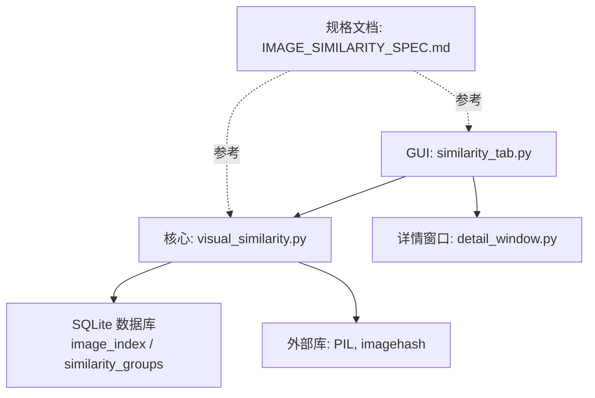
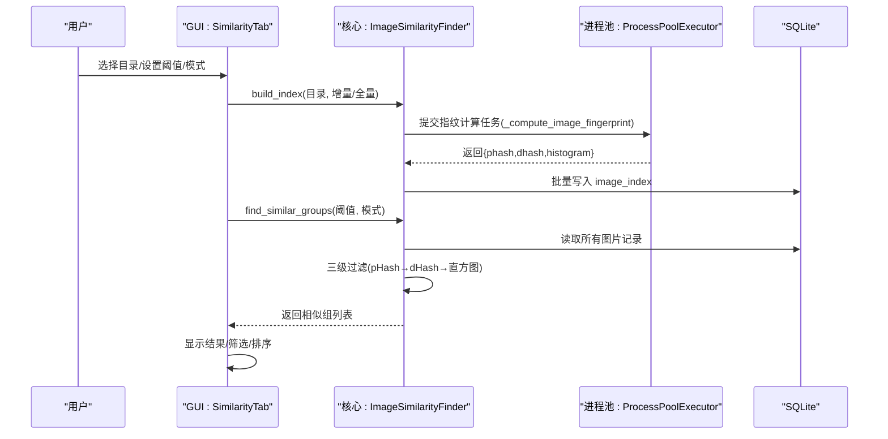
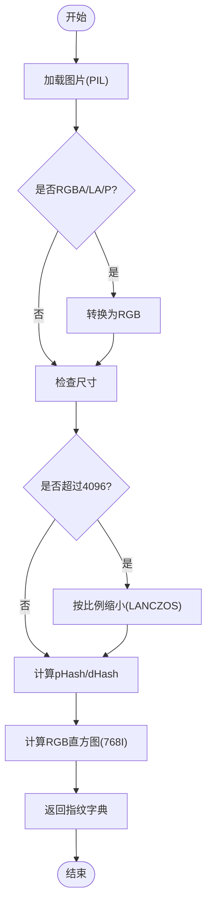
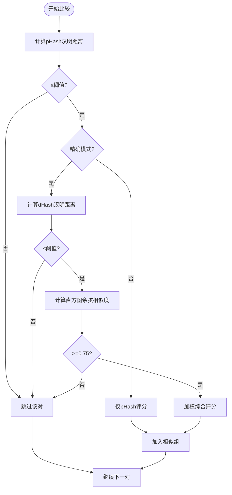
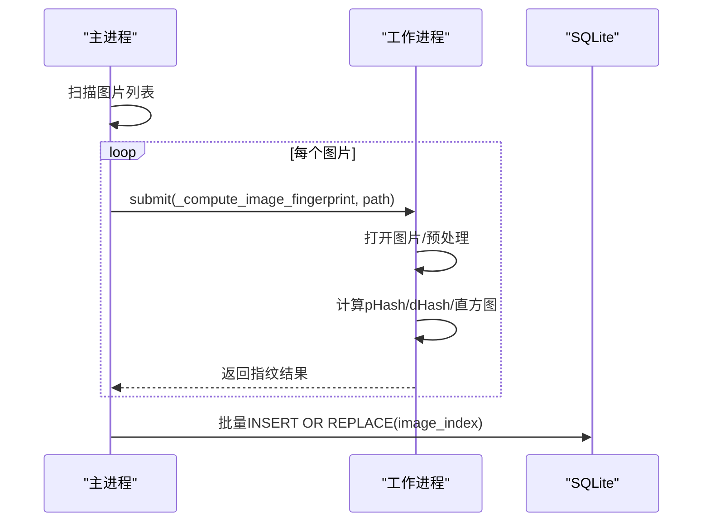
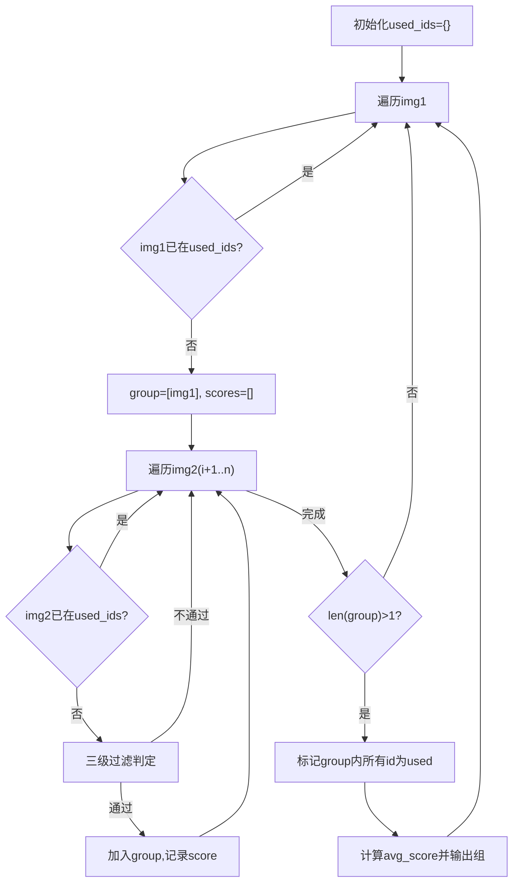
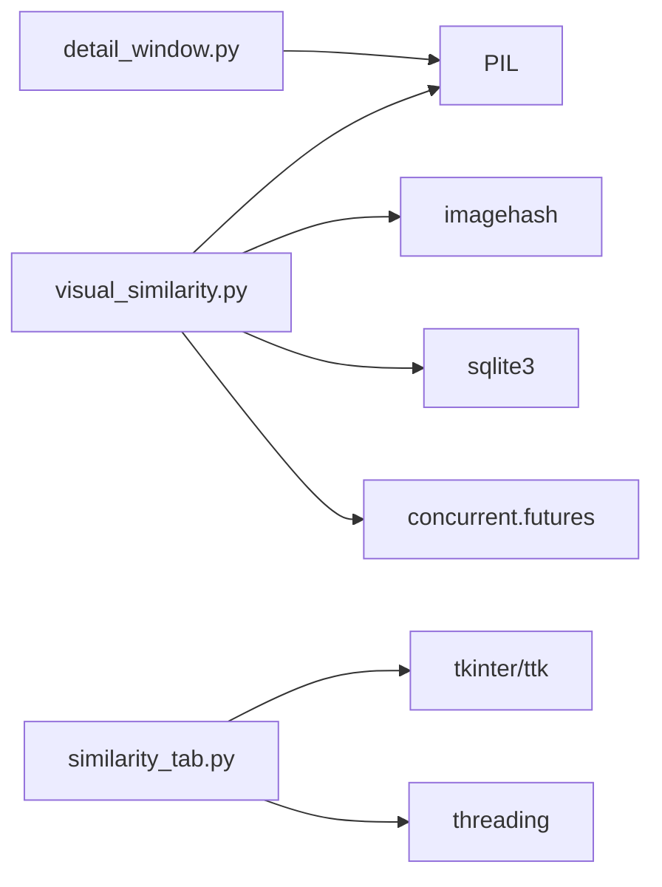

# 图片相似度检测

<cite>
**本文引用的文件**
- [visual_similarity.py](file://core/visual_similarity.py)
- [similarity_tab.py](file://gui_modules/similarity_tab.py)
- [detail_window.py](file://gui_modules/detail_window.py)
- [IMAGE_SIMILARITY_SPEC.md](file://docs/IMAGE_SIMILARITY_SPEC.md)
- [README.md](file://README.md)
</cite>

## 目录
1. [简介](#简介)
2. [项目结构](#项目结构)
3. [核心组件](#核心组件)
4. [架构总览](#架构总览)
5. [详细组件分析](#详细组件分析)
6. [依赖关系分析](#依赖关系分析)
7. [性能考量](#性能考量)
8. [故障排查指南](#故障排查指南)
9. [结论](#结论)
10. [附录：配置与使用示例](#附录：配置与使用示例)

## 简介
本技术文档聚焦于“图片相似度检测”功能，围绕 ImageSimilarityFinder 类的三级过滤算法展开，涵盖感知哈希(pHash)、差异哈希(dHash)与颜色直方图的多维度相似度分析；说明图像预处理流程、多进程并行指纹计算机制、汉明距离阈值配置与结果聚类策略；并提供GUI操作指南与结果展示使用说明。目标是帮助开发者与用户高效理解并正确使用该模块，同时给出可操作的参数调优建议。

## 项目结构
本项目采用分层组织：核心算法在 core 下，GUI界面在 gui_modules 下，规格与说明在 docs 下。图片相似度检测的核心实现位于 core/visual_similarity.py，GUI入口与交互逻辑位于 gui_modules/similarity_tab.py，通用详情窗口在 gui_modules/detail_window.py，规范文档在 docs/IMAGE_SIMILARITY_SPEC.md。

图表来源
- [visual_similarity.py:94-169](file://core/visual_similarity.py#L94-L169)
- [similarity_tab.py:18-220](file://gui_modules/similarity_tab.py#L18-L220)
- [detail_window.py:99-157](file://gui_modules/detail_window.py#L99-L157)
- [IMAGE_SIMILARITY_SPEC.md:1-120](file://docs/IMAGE_SIMILARITY_SPEC.md#L1-L120)

章节来源
- [README.md:338-401](file://README.md#L338-L401)

## 核心组件
- ImageSimilarityFinder：提供索引构建、指纹计算、相似组查找、统计查询等能力。
- 多进程指纹计算：通过全局函数 _compute_image_fingerprint 在独立进程中计算 pHash/dHash/直方图，避免主进程阻塞。
- 相似度判定：三级过滤（pHash快速筛选 → dHash二次验证 → 直方图精确比对），支持快速模式与精确模式。
- GUI 相似度标签页：负责参数配置、启动扫描、进度反馈、结果展示与筛选。
- 通用详情窗口：用于按组展示图片信息、预览与操作。

章节来源
- [visual_similarity.py:21-91](file://core/visual_similarity.py#L21-L91)
- [visual_similarity.py:94-169](file://core/visual_similarity.py#L94-L169)
- [visual_similarity.py:241-311](file://core/visual_similarity.py#L241-L311)
- [visual_similarity.py:334-408](file://core/visual_similarity.py#L334-L408)
- [visual_similarity.py:410-513](file://core/visual_similarity.py#L410-L513)
- [similarity_tab.py:18-220](file://gui_modules/similarity_tab.py#L18-L220)
- [detail_window.py:99-157](file://gui_modules/detail_window.py#L99-L157)

## 架构总览
整体架构由三层构成：GUI层负责用户交互与结果展示；核心引擎层实现图片指纹计算与相似度判定；数据存储层使用 SQLite 持久化索引与相似组信息。

图表来源
- [visual_similarity.py:253-311](file://core/visual_similarity.py#L253-L311)
- [visual_similarity.py:410-513](file://core/visual_similarity.py#L410-L513)
- [similarity_tab.py:341-416](file://gui_modules/similarity_tab.py#L341-L416)

## 详细组件分析

### 图像预处理与指纹计算
- 输入校验与格式转换：确保RGB模式，处理透明通道与调色板模式。
- 尺寸控制：超大图先缩放至最大边4096像素，避免内存溢出。
- 指纹生成：
  - pHash：8x8=64位十六进制字符串。
  - dHash：8位哈希值。
  - 颜色直方图：RGB三通道各256 bins，打包为768字节BLOB。
- 多进程并行：使用 ProcessPoolExecutor，自动根据CPU核数限制并发（最多8）。

图表来源
- [visual_similarity.py:21-91](file://core/visual_similarity.py#L21-L91)

章节来源
- [visual_similarity.py:21-91](file://core/visual_similarity.py#L21-L91)

### 三级过滤算法与相似度评分
- 第1级：pHash快速筛选。计算两图的汉明距离，若超过阈值则直接跳过。
- 第2级：dHash二次验证（仅精确模式）。再次以汉明距离判断。
- 第3级：直方图精确比对。计算余弦相似度，低于阈值则排除。
- 综合评分：加权平均 pHash×0.5 + dHash×0.3 + 直方图×0.2，映射到0-100分。

图表来源
- [visual_similarity.py:334-408](file://core/visual_similarity.py#L334-L408)
- [visual_similarity.py:410-513](file://core/visual_similarity.py#L410-L513)

章节来源
- [visual_similarity.py:334-408](file://core/visual_similarity.py#L334-L408)
- [visual_similarity.py:410-513](file://core/visual_similarity.py#L410-L513)

### 多进程并行指纹计算机制
- 使用全局函数 _compute_image_fingerprint 作为进程间通信的接口，避免传递包含GUI对象的实例。
- 进程内动态调整 sys.path，确保跨进程导入项目模块成功。
- 批处理插入：每达到 batch_size 即批量写入数据库，减少事务开销。

图表来源
- [visual_similarity.py:253-311](file://core/visual_similarity.py#L253-L311)
- [visual_similarity.py:313-332](file://core/visual_similarity.py#L313-L332)

章节来源
- [visual_similarity.py:253-311](file://core/visual_similarity.py#L253-L311)
- [visual_similarity.py:313-332](file://core/visual_similarity.py#L313-L332)

### 汉明距离与阈值配置
- 汉明距离：将十六进制哈希转为整数后异或，统计二进制中1的个数，范围0-64。
- 阈值范围：GUI滑块支持5-30，默认12（平衡模式）。
  - 严格模式：5-8
  - 平衡模式：9-15
  - 宽松模式：16-30
- 模式选择：
  - 快速模式：仅pHash，适合大规模快速筛查。
  - 精确模式：pHash+dHash+直方图，适合高精度去重。

章节来源
- [similarity_tab.py:56-96](file://gui_modules/similarity_tab.py#L56-L96)
- [IMAGE_SIMILARITY_SPEC.md:133-158](file://docs/IMAGE_SIMILARITY_SPEC.md#L133-L158)
- [visual_similarity.py:334-349](file://core/visual_similarity.py#L334-L349)

### 结果聚类与分组
- 遍历图片集合，以当前图片为基准，与其后续图片进行两两比较。
- 满足阈值的图片归入同一组，并将组内所有图片标记为已使用，避免重复归属。
- 输出包含组ID、图片数量、平均相似度与文件列表的结构化结果。

图表来源
- [visual_similarity.py:410-513](file://core/visual_similarity.py#L410-L513)

章节来源
- [visual_similarity.py:410-513](file://core/visual_similarity.py#L410-L513)

### GUI界面操作指南
- 配置区域：
  - 相似度阈值：滑动条5-30，实时显示模式提示（严格/平衡/宽松）。
  - 检测模式：快速模式（仅pHash）或精确模式（pHash+dHash+直方图）。
  - 扫描方式：全量扫描或增量扫描（保留历史数据）。
  - 数据库路径：可选择自定义.db文件。
- 图片格式过滤：支持全选/常用格式勾选/自定义后缀输入。
- 执行流程：点击“开始检测”，后台线程运行，进度条与日志实时更新。
- 结果查看：点击“结果”按钮打开结果窗口，支持后缀筛选、大小范围筛选、列排序与隐藏组管理。

章节来源
- [similarity_tab.py:50-220](file://gui_modules/similarity_tab.py#L50-L220)
- [similarity_tab.py:341-416](file://gui_modules/similarity_tab.py#L341-L416)
- [similarity_tab.py:538-674](file://gui_modules/similarity_tab.py#L538-L674)

### 结果展示与详情窗口
- 结果窗口：显示相似组摘要、筛选条件、Treeview表格（相似度、数量、总大小、后缀、操作）。
- 详情窗口：按组展示图片分辨率、大小、路径，支持双击打开文件夹、单击预览图片。
- 统一配置：DetailWindowConfig 定义不同场景的列、宽度、标题与预览行为。

章节来源
- [similarity_tab.py:598-674](file://gui_modules/similarity_tab.py#L598-L674)
- [detail_window.py:99-157](file://gui_modules/detail_window.py#L99-L157)
- [detail_window.py:220-350](file://gui_modules/detail_window.py#L220-L350)
- [detail_window.py:622-639](file://gui_modules/detail_window.py#L622-L639)

## 依赖关系分析
- 核心依赖：
  - PIL：图像处理与缩放。
  - imagehash：pHash/dHash计算。
  - sqlite3：本地索引与相似组存储。
  - concurrent.futures：多进程并行计算。
- GUI依赖：
  - tkinter/ttk：界面控件与布局。
  - threading：后台线程执行扫描。
- 外部库版本要求见 README。

图表来源
- [visual_similarity.py:8-18](file://core/visual_similarity.py#L8-L18)
- [similarity_tab.py:7-12](file://gui_modules/similarity_tab.py#L7-L12)
- [detail_window.py:5-10](file://gui_modules/detail_window.py#L5-L10)

章节来源
- [README.md:229-248](file://README.md#L229-L248)

## 性能考量
- 多进程并行：利用多核CPU加速指纹计算，避免GIL限制，提升吞吐。
- 数据库优化：启用WAL模式、合理PRAGMA缓存与内存映射，创建索引加速查询。
- 批处理写入：按批次插入降低事务开销。
- 懒加载与缓存：详情窗口图片预览按需加载，减少内存占用。
- 阈值与模式选择：快速模式适合大数据集初筛；精确模式提高准确率但耗时更长。

章节来源
- [visual_similarity.py:123-169](file://core/visual_similarity.py#L123-L169)
- [visual_similarity.py:280-311](file://core/visual_similarity.py#L280-L311)
- [detail_window.py:516-535](file://gui_modules/detail_window.py#L516-L535)

## 故障排查指南
- 某些相似图片未检测到：
  - 可能原因：汉明距离超过阈值或差异过大。
  - 解决：提高阈值（如从12调到15），或切换更宽松模式。
- 不相似的图片被判定为相似：
  - 可能原因：阈值过高或图片本身特征相近。
  - 解决：降低阈值（如从12调到8），人工复核。
- 扫描速度慢：
  - 可能原因：大量大图、机械硬盘I/O瓶颈。
  - 解决：使用SSD、增加线程数、排除网络驱动器、分批处理。
- 内存溢出：
  - 可能原因：同时加载过多大图、缓存过大。
  - 解决：减小缓存、限制图片加载尺寸、关闭无关程序释放资源。

章节来源
- [IMAGE_SIMILARITY_SPEC.md:679-726](file://docs/IMAGE_SIMILARITY_SPEC.md#L679-L726)

## 结论
ImageSimilarityFinder 通过三级过滤策略实现了鲁棒且高效的图片相似度检测。结合多进程并行与SQLite索引优化，能够在TB级数据规模下保持良好性能。GUI提供了直观的参数配置与结果展示，便于用户根据场景灵活调优。推荐首次使用默认阈值12与精确模式，随后依据结果质量微调阈值与模式。

## 附录：配置与使用示例
- 命令行入口（供脚本调用）：
  - 指定目录、数据库路径、阈值、模式、增量扫描、输出JSON。
  - 参考路径：[visual_similarity.py:575-621](file://core/visual_similarity.py#L575-L621)
- GUI操作步骤：
  - 添加扫描目录 → 选择检测模式与阈值 → 点击“开始检测” → 查看结果与详情。
  - 参考路径：[similarity_tab.py:341-416](file://gui_modules/similarity_tab.py#L341-L416)
- 阈值建议：
  - 完全相同副本：5-8
  - 清理缩略图与原图：10-12
  - 编辑过的照片：12-15
  - 同源图片发现：15-20
  - 艺术创作灵感：20-30
  - 参考路径：[IMAGE_SIMILARITY_SPEC.md:133-158](file://docs/IMAGE_SIMILARITY_SPEC.md#L133-L158)

章节来源
- [visual_similarity.py:575-621](file://core/visual_similarity.py#L575-L621)
- [similarity_tab.py:341-416](file://gui_modules/similarity_tab.py#L341-L416)
- [IMAGE_SIMILARITY_SPEC.md:133-158](file://docs/IMAGE_SIMILARITY_SPEC.md#L133-L158)