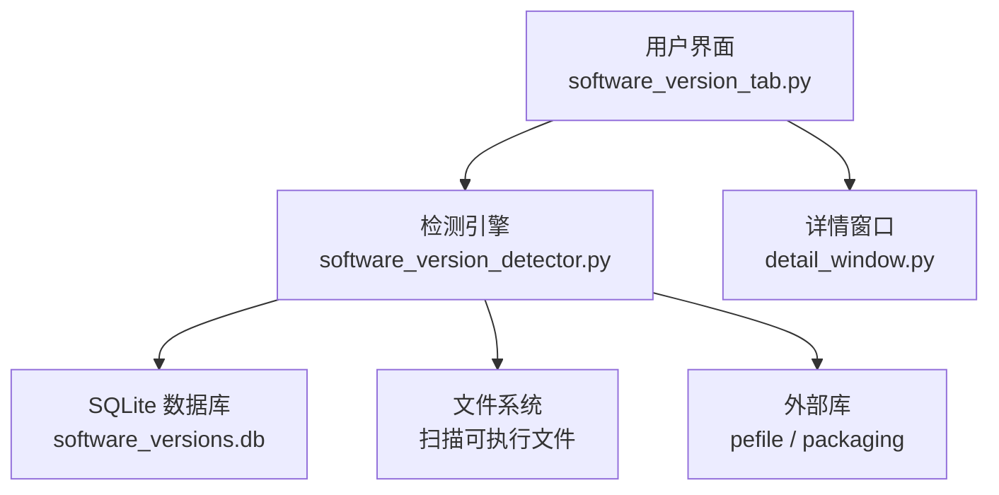
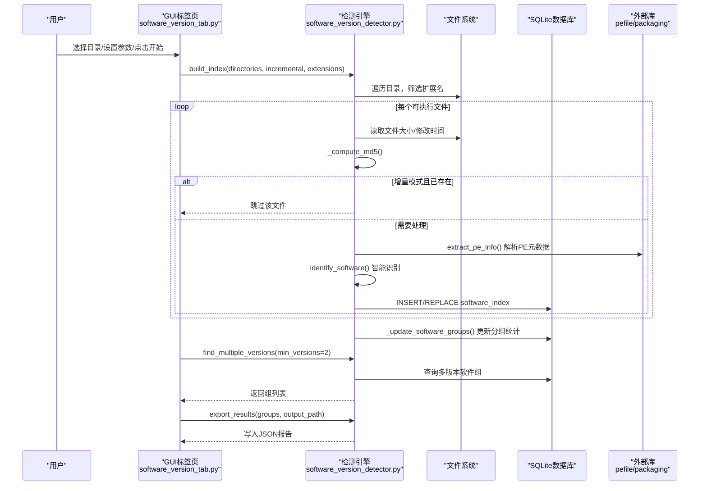
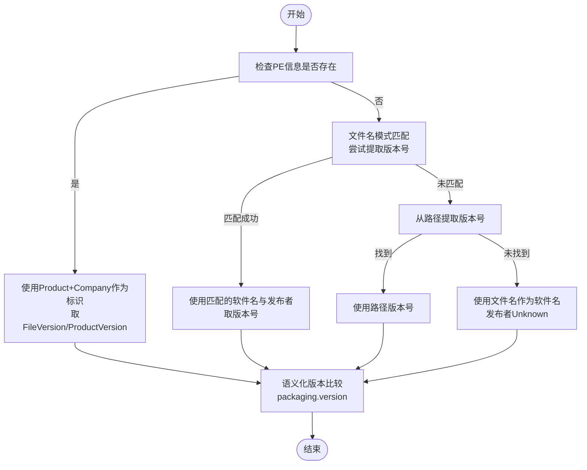
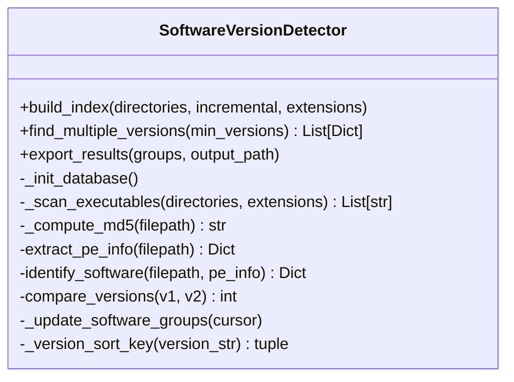
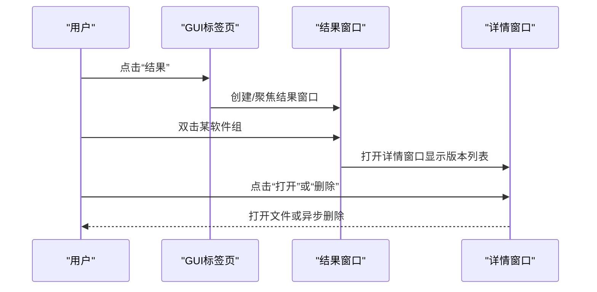
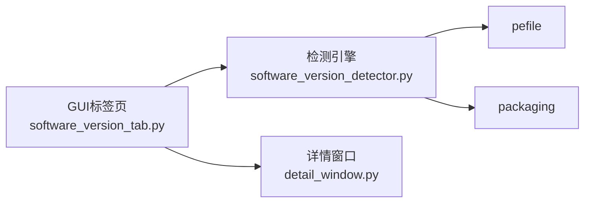

# 多版本软件检测

<cite>
**本文引用的文件**
- [core/software_version_detector.py](file://core/software_version_detector.py)
- [gui_modules/software_version_tab.py](file://gui_modules/software_version_tab.py)
- [gui_modules/detail_window.py](file://gui_modules/detail_window.py)
- [README.md](file://README.md)
- [requirements.txt](file://requirements.txt)
</cite>

## 目录
1. [简介](#简介)
2. [项目结构](#项目结构)
3. [核心组件](#核心组件)
4. [架构总览](#架构总览)
5. [详细组件分析](#详细组件分析)
6. [依赖关系分析](#依赖关系分析)
7. [性能与优化](#性能与优化)
8. [故障排查](#故障排查)
9. [结论](#结论)
10. [附录：GUI操作指南](#附录gui操作指南)

## 简介
本技术文档聚焦“多版本软件检测”功能，围绕 SoftwareVersionDetector 类的 PE 元数据提取、智能软件识别算法、版本号标准化与比较、以及结果分组与展示进行系统化说明。内容涵盖 pefile 库集成、EXE/DLL/MSI/JAR/PYD 等可执行文件格式处理流程、语义化版本比较、兼容性降级策略、数据库索引与增量扫描机制，并配套 GUI 界面操作指南与结果展示说明。

## 项目结构
- 核心引擎位于 core/software_version_detector.py，负责：
  - 扫描指定目录下的可执行文件（支持扩展名过滤）
  - 解析 PE 元数据（公司名称、产品名称、文件版本、产品版本等）
  - 基于规则的智能软件识别（PE信息优先，其次文件名模式匹配，最后路径提取版本号）
  - 构建 SQLite 索引表与分组统计表，支持全量/增量扫描
  - 查找多版本软件组、导出 JSON 报告
- GUI 层位于 gui_modules/software_version_tab.py，提供：
  - 配置项（数据库路径、输出路径、扫描方式、格式过滤）
  - 启动扫描、进度显示、日志输出
  - 结果窗口与隐藏/显示组、打开文件夹等操作
- 详情展示位于 gui_modules/detail_window.py，提供统一的详情窗口框架与多版本软件专用视图

图表来源
- [core/software_version_detector.py:178-244](file://core/software_version_detector.py#L178-L244)
- [gui_modules/software_version_tab.py:301-350](file://gui_modules/software_version_tab.py#L301-L350)
- [gui_modules/detail_window.py:687-713](file://gui_modules/detail_window.py#L687-L713)

章节来源
- [core/software_version_detector.py:1-738](file://core/software_version_detector.py#L1-L738)
- [gui_modules/software_version_tab.py:1-759](file://gui_modules/software_version_tab.py#L1-L759)
- [gui_modules/detail_window.py:1-766](file://gui_modules/detail_window.py#L1-L766)
- [README.md:136-199](file://README.md#L136-L199)
- [requirements.txt:21-23](file://requirements.txt#L21-L23)

## 核心组件
- SoftwareVersionDetector 类
  - 支持的可执行扩展名集合：.exe, .dll, .msi, .jar, .pyd
  - 内置常见软件名称与发布者模式匹配字典（Python、Node.js、JDK、Chrome、Firefox、Office、VS Code、Eclipse、IntelliJ、Docker、Git、Notepad++、Vim、Emacs 等）
  - 数据库初始化与优化（WAL 模式、缓存大小、临时存储内存）
  - MD5 计算用于增量扫描去重
  - PE 元数据提取（公司名称、产品名称、文件版本、产品版本、描述、原始文件名）
  - 智能软件识别（三级优先级：PE信息 → 文件名模式匹配 → 路径版本号提取）
  - 语义化版本比较（packaging.version），失败时回退到字符串比较
  - 批量构建索引（分批提交事务）、更新分组统计（最新版本、最旧版本、总大小）
  - 查询多版本软件组、导出 JSON 报告、删除文件并同步数据库
- GUI 标签页 SoftwareVersionTab
  - 配置区：数据库路径、输出路径、扫描方式（全量/增量）、格式过滤（默认勾选常用扩展，支持自定义后缀）
  - 控制按钮：开始检测、停止、查看结果
  - 进度条与状态提示、运行日志
  - 结果窗口：树形列表展示软件组（名称、版本数量、总大小、最新版本、操作列）
  - 双击组别打开详情窗口；右键菜单支持隐藏/显示组、打开文件夹
- 通用详情窗口 DetailWindow
  - 统一 UI 框架，支持不同业务场景的配置（标题、列定义、宽度、是否预览）
  - 多版本软件详情视图：显示版本号、大小、路径、打开、删除列
  - Tooltip 工具提示、排序、删除回调

章节来源
- [core/software_version_detector.py:30-71](file://core/software_version_detector.py#L30-L71)
- [core/software_version_detector.py:109-161](file://core/software_version_detector.py#L109-L161)
- [core/software_version_detector.py:178-244](file://core/software_version_detector.py#L178-L244)
- [core/software_version_detector.py:246-316](file://core/software_version_detector.py#L246-L316)
- [core/software_version_detector.py:318-354](file://core/software_version_detector.py#L318-L354)
- [core/software_version_detector.py:391-481](file://core/software_version_detector.py#L391-L481)
- [core/software_version_detector.py:483-538](file://core/software_version_detector.py#L483-L538)
- [core/software_version_detector.py:540-604](file://core/software_version_detector.py#L540-L604)
- [gui_modules/software_version_tab.py:34-182](file://gui_modules/software_version_tab.py#L34-L182)
- [gui_modules/software_version_tab.py:272-372](file://gui_modules/software_version_tab.py#L272-L372)
- [gui_modules/detail_window.py:192-217](file://gui_modules/detail_window.py#L192-L217)
- [gui_modules/detail_window.py:687-713](file://gui_modules/detail_window.py#L687-L713)

## 架构总览
系统采用三层架构：
- 界面层：Tkinter GUI 标签页与详情窗口，负责用户交互、参数配置、结果展示
- 引擎层：SoftwareVersionDetector 实现扫描、解析、识别、索引、查询、导出
- 数据层：SQLite 数据库持久化索引与分组统计，支持 WAL 模式提升并发性能

图表来源
- [gui_modules/software_version_tab.py:301-350](file://gui_modules/software_version_tab.py#L301-L350)
- [core/software_version_detector.py:391-481](file://core/software_version_detector.py#L391-L481)
- [core/software_version_detector.py:540-604](file://core/software_version_detector.py#L540-L604)
- [core/software_version_detector.py:606-662](file://core/software_version_detector.py#L606-L662)

## 详细组件分析

### PE 元数据提取与智能软件识别
- PE 元数据提取
  - 使用 pefile.PE 快速加载，遍历 VS_VERSIONINFO 中的 StringFileInfo/StringTable，提取公司名、产品名、文件版本、产品版本、描述、原始文件名
  - 结果以字典形式返回，包含空值保护与异常捕获
  - 引入 LRU 风格缓存（最大条目数限制），避免重复解析大文件
- 智能软件识别（三级优先级）
  - 优先级1：若存在 PE 的产品名与公司名，则组合为 software_key（如 “ProductName_CompanyName”），版本取文件版本或产品版本
  - 优先级2：根据文件名正则匹配常见软件模式（如 python、nodejs、java jdk、chrome、firefox、office、vscode、eclipse、intellij、docker、git、notepad++、vim、emacs 等），从匹配组中提取版本号
  - 优先级3：从安装路径中按 v1.2.3/v1.2/v1 等模式提取版本号；否则以文件名作为软件名，发布者标记为 Unknown
- 版本比较与排序
  - 使用 packaging.version.parse 进行语义化比较，失败时回退到字符串比较
  - 生成排序键：有效版本号返回 (1, Version对象)，无效版本号（如 unknown）返回 (0, 字符串)，确保未知版本排在末尾

图表来源
- [core/software_version_detector.py:178-244](file://core/software_version_detector.py#L178-L244)
- [core/software_version_detector.py:246-316](file://core/software_version_detector.py#L246-L316)
- [core/software_version_detector.py:318-354](file://core/software_version_detector.py#L318-L354)

章节来源
- [core/software_version_detector.py:178-244](file://core/software_version_detector.py#L178-L244)
- [core/software_version_detector.py:246-316](file://core/software_version_detector.py#L246-L316)
- [core/software_version_detector.py:318-354](file://core/software_version_detector.py#L318-L354)

### 数据库索引与分组统计
- 数据库表设计
  - software_index：记录每个可执行文件的唯一路径、大小、MD5哈希、software_key、软件名、发布者、版本、安装路径、修改时间
  - software_groups：按 software_key 聚合的版本数量、总文件数、总大小、最新版本、最旧版本
- 索引优化
  - PRAGMA journal_mode=WAL、synchronous=NORMAL、cache_size=-64000、temp_store=MEMORY
  - 对 software_key、file_hash、install_path、version_count 建立索引
- 构建索引流程
  - 扫描目录，筛选扩展名（默认支持 exe/dll/msi/jar/pyd，可自定义）
  - 计算 MD5 哈希，增量模式下跳过相同哈希的已有记录
  - 提取 PE 信息并识别软件，插入/替换索引记录
  - 批次提交事务，更新分组统计（解析版本列表，利用排序键找出最新/最旧版本）
- 查询与导出
  - 查询 version_count >= min_versions 的软件组，按版本数量与总大小降序排列
  - 导出 JSON 报告，包含扫描摘要与各软件组的详细信息（含格式化大小）

图表来源
- [core/software_version_detector.py:109-161](file://core/software_version_detector.py#L109-L161)
- [core/software_version_detector.py:391-481](file://core/software_version_detector.py#L391-L481)
- [core/software_version_detector.py:483-538](file://core/software_version_detector.py#L483-L538)
- [core/software_version_detector.py:540-604](file://core/software_version_detector.py#L540-L604)
- [core/software_version_detector.py:606-662](file://core/software_version_detector.py#L606-L662)

章节来源
- [core/software_version_detector.py:109-161](file://core/software_version_detector.py#L109-L161)
- [core/software_version_detector.py:391-481](file://core/software_version_detector.py#L391-L481)
- [core/software_version_detector.py:483-538](file://core/software_version_detector.py#L483-L538)
- [core/software_version_detector.py:540-604](file://core/software_version_detector.py#L540-L604)
- [core/software_version_detector.py:606-662](file://core/software_version_detector.py#L606-L662)

### GUI 界面与结果展示
- 配置区域
  - 数据库路径与输出文件路径选择
  - 扫描方式：全量扫描（自动清空旧数据）与增量扫描（仅新增/修改）
  - 文件格式过滤：默认勾选 EXE/DLL/MSI/JAR/PYD，支持自定义后缀（逗号/分号/空格分隔）
- 控制与反馈
  - 开始检测按钮触发后台线程执行扫描，禁用开始按钮并启用停止按钮
  - 进度条与状态文本实时更新，日志区域滚动显示
- 结果窗口
  - 树形列表展示软件组：名称、版本数量、总大小、最新版本、操作列（隐藏/显示）
  - 双击组别打开详情窗口，显示各版本的版本号、大小、路径、打开、删除
  - 右键菜单支持查看详情、打开文件夹、隐藏此组、显示所有隐藏的组
- 详情窗口
  - 复用通用 FileDetailWindow，配置 SOFTWARE_VERSION 布局
  - 计算总大小并显示在标题栏
  - 支持删除单个文件（通过批处理延迟删除，避免占用冲突）

图表来源
- [gui_modules/software_version_tab.py:385-470](file://gui_modules/software_version_tab.py#L385-L470)
- [gui_modules/software_version_tab.py:597-643](file://gui_modules/software_version_tab.py#L597-L643)
- [gui_modules/detail_window.py:687-713](file://gui_modules/detail_window.py#L687-L713)

章节来源
- [gui_modules/software_version_tab.py:34-182](file://gui_modules/software_version_tab.py#L34-L182)
- [gui_modules/software_version_tab.py:272-372](file://gui_modules/software_version_tab.py#L272-L372)
- [gui_modules/software_version_tab.py:385-470](file://gui_modules/software_version_tab.py#L385-L470)
- [gui_modules/software_version_tab.py:597-643](file://gui_modules/software_version_tab.py#L597-L643)
- [gui_modules/detail_window.py:687-713](file://gui_modules/detail_window.py#L687-L713)

## 依赖关系分析
- 外部库
  - pefile：用于解析 Windows PE 文件的元数据（可选导入，缺失时给出警告并降级）
  - packaging：用于语义化版本比较（可选导入，缺失时回退到字符串比较）
- 内部模块耦合
  - GUI 标签页依赖检测引擎接口（build_index/find_multiple_versions/export_results）
  - 详情窗口复用通用框架，注入软件版本专用配置与格式化函数
- 潜在循环依赖
  - 当前结构清晰分层，未发现循环引用
- 兼容性与降级
  - 当 pefile 或 packaging 不可用时，系统仍能运行但功能受限（无法提取PE信息或无法语义化比较）

图表来源
- [core/software_version_detector.py:17-27](file://core/software_version_detector.py#L17-L27)
- [gui_modules/software_version_tab.py:301-350](file://gui_modules/software_version_tab.py#L301-L350)
- [gui_modules/detail_window.py:687-713](file://gui_modules/detail_window.py#L687-L713)

章节来源
- [core/software_version_detector.py:17-27](file://core/software_version_detector.py#L17-L27)
- [requirements.txt:21-23](file://requirements.txt#L21-L23)

## 性能与优化
- 数据库优化
  - WAL 模式与 NORMAL 同步级别减少写锁竞争
  - 增大缓存与内存临时存储，降低磁盘 I/O
  - 针对高频查询字段建立索引
- 扫描与处理
  - 批量处理与事务提交，减少频繁 IO
  - 增量扫描基于 MD5 哈希去重，避免重复解析
  - PE 信息缓存（LRU）减少重复解析开销
- 版本比较
  - 语义化比较提高准确性；失败时回退保证鲁棒性
- 建议
  - 合理设置扩展名过滤范围，缩小扫描面
  - 首次全量扫描后，日常维护使用增量扫描
  - 定期清理历史数据或压缩数据库（VACUUM）

章节来源
- [core/software_version_detector.py:109-161](file://core/software_version_detector.py#L109-L161)
- [core/software_version_detector.py:391-481](file://core/software_version_detector.py#L391-L481)
- [core/software_version_detector.py:178-244](file://core/software_version_detector.py#L178-L244)
- [core/software_version_detector.py:318-354](file://core/software_version_detector.py#L318-L354)

## 故障排查
- pefile 未安装
  - 现象：无法提取 PE 元数据，软件识别降级为文件名/路径匹配
  - 解决：安装 pefile（见 requirements.txt）
- packaging 未安装
  - 现象：版本比较回退为字符串比较，可能导致排序不准确
  - 解决：安装 packaging（见 requirements.txt）
- 扫描速度慢
  - 原因：目录过大、大量非目标文件、磁盘瓶颈
  - 解决：使用扩展名过滤、SSD 升级、增量扫描、分批处理
- 数据库体积增长
  - 原因：长期累积历史数据
  - 解决：定期清理过期记录、VACUUM 压缩
- 删除文件失败
  - 原因：文件被占用或权限不足
  - 解决：关闭占用进程、以管理员权限运行、手动删除

章节来源
- [core/software_version_detector.py:17-27](file://core/software_version_detector.py#L17-L27)
- [core/software_version_detector.py:682-714](file://core/software_version_detector.py#L682-L714)
- [requirements.txt:21-23](file://requirements.txt#L21-L23)

## 结论
多版本软件检测功能通过 PE 元数据提取与智能识别算法，结合语义化版本比较与 SQLite 索引，实现了高效、准确的同一软件多版本发现与管理。GUI 提供直观的操作与结果展示，支持全量/增量扫描、格式过滤与结果导出。建议在大规模环境中配合扩展名过滤与增量扫描以提升性能，并定期维护数据库以保持最佳状态。

## 附录：GUI操作指南
- 启动程序
  - 运行 run_gui.py 或 start.bat（Windows）
- 添加扫描目录
  - 在主窗口添加要扫描的目录
- 进入“多版本软件检测”标签页
  - 配置数据库路径与输出文件路径
  - 选择扫描方式（全量/增量）
  - 勾选需要检测的文件格式（默认 EXE/DLL/MSI/JAR/PYD），可输入自定义后缀
- 开始检测
  - 点击“开始检测”，等待进度完成
  - 查看运行日志与进度条
- 查看结果
  - 点击“结果”打开结果窗口
  - 双击软件组打开详情窗口，查看版本列表
  - 右键菜单支持隐藏/显示组、打开文件夹
- 导出报告
  - 检测完成后自动导出 JSON 报告至指定路径
- 常见问题
  - 若显示“unknown”版本，可能是 PE 无版本信息或文件名/路径不含版本号
  - 若扫描慢，请缩小扫描范围或使用增量扫描

章节来源
- [README.md:280-336](file://README.md#L280-L336)
- [gui_modules/software_version_tab.py:34-182](file://gui_modules/software_version_tab.py#L34-L182)
- [gui_modules/software_version_tab.py:272-372](file://gui_modules/software_version_tab.py#L272-L372)
- [gui_modules/software_version_tab.py:385-470](file://gui_modules/software_version_tab.py#L385-L470)
- [gui_modules/detail_window.py:687-713](file://gui_modules/detail_window.py#L687-L713)