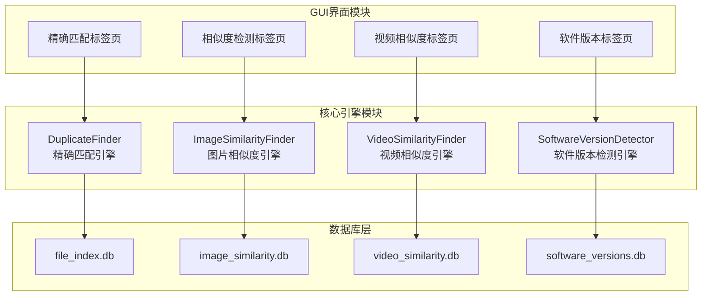
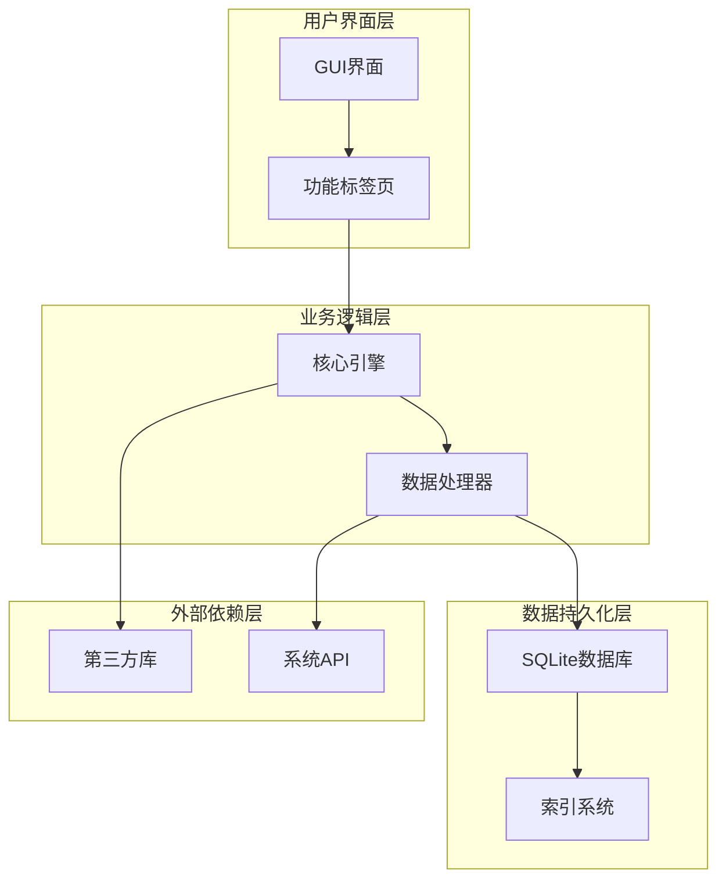
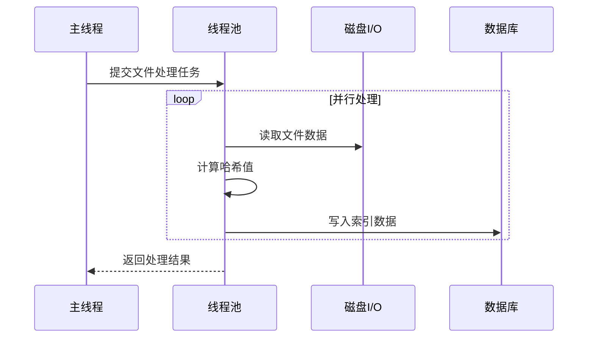
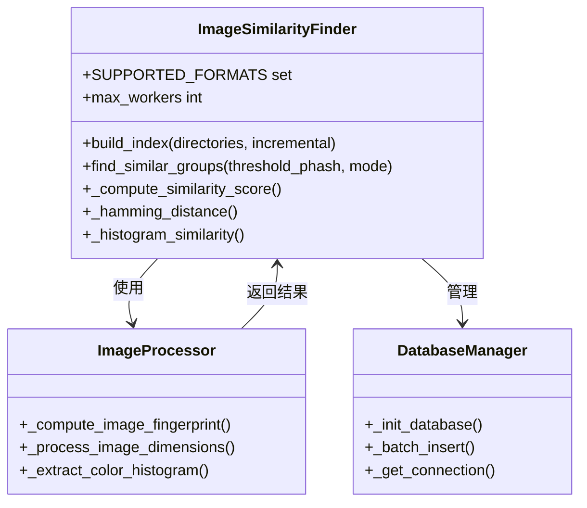
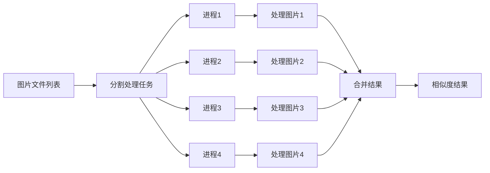
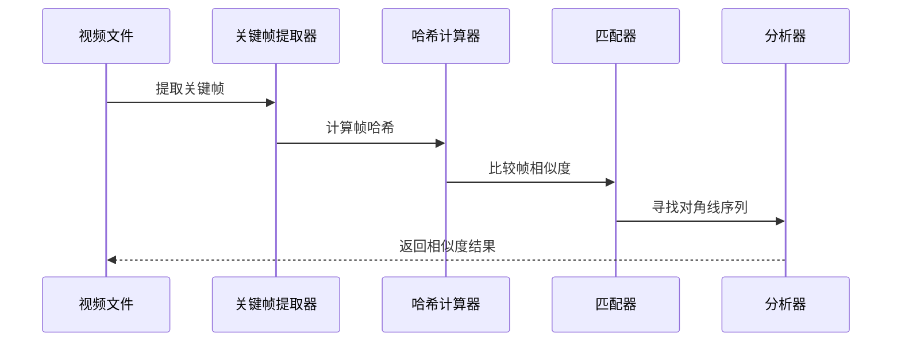
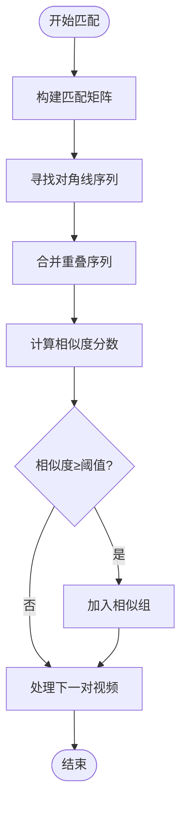
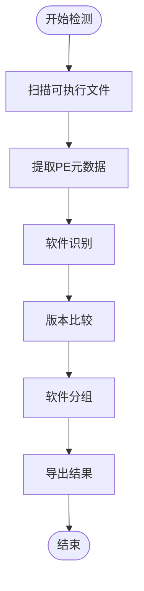
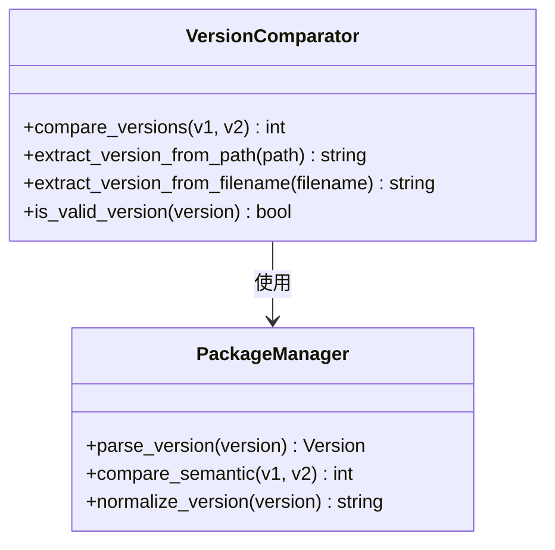
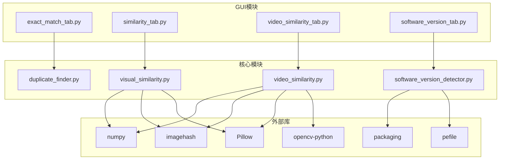

# 核心功能详解

<cite>
**本文档引用的文件**
- [duplicate_finder.py](file://core/duplicate_finder.py)
- [visual_similarity.py](file://core/visual_similarity.py)
- [video_similarity.py](file://core/video_similarity.py)
- [software_version_detector.py](file://core/software_version_detector.py)
- [exact_match_tab.py](file://gui_modules/exact_match_tab.py)
- [similarity_tab.py](file://gui_modules/similarity_tab.py)
- [video_similarity_tab.py](file://gui_modules/video_similarity_tab.py)
- [software_version_tab.py](file://gui_modules/software_version_tab.py)
- [README.md](file://README.md)
</cite>

## 目录
1. [简介](#简介)
2. [项目结构](#项目结构)
3. [核心组件](#核心组件)
4. [架构概览](#架构概览)
5. [详细组件分析](#详细组件分析)
6. [依赖分析](#依赖分析)
7. [性能考虑](#性能考虑)
8. [故障排除指南](#故障排除指南)
9. [结论](#结论)

## 简介

本文档深入解析文件重复校验系统的四大核心功能，包括精确匹配检测的多级哈希策略、图片相似度检测的三级过滤算法、视频相似度检测的关键帧序列匹配和多版本软件检测的PE元数据提取。每个功能都提供了完整的算法原理、实现细节、参数配置和使用场景说明。

## 项目结构

该项目采用模块化设计，核心功能分布在四个独立的引擎模块中：



**图表来源**
- [duplicate_finder.py:22-588](file://core/duplicate_finder.py#L22-L588)
- [visual_similarity.py:94-622](file://core/visual_similarity.py#L94-L622)
- [video_similarity.py:174-772](file://core/video_similarity.py#L174-L772)
- [software_version_detector.py:30-738](file://core/software_version_detector.py#L30-L738)

**章节来源**
- [README.md:338-372](file://README.md#L338-L372)

## 核心组件

### 精确匹配检测引擎

精确匹配检测引擎采用三层哈希过滤策略，通过多级筛选逐步缩小搜索范围，最终实现字节级完全相同的文件检测。

### 图片相似度检测引擎

图片相似度检测引擎实现了基于感知哈希、差异哈希和颜色直方图的三级过滤算法，能够有效检测经过缩放、压缩和轻微调色处理的相似图片。

### 视频相似度检测引擎

视频相似度检测引擎采用关键帧序列匹配算法，通过动态采样策略提取视频关键帧，然后使用滑动窗口和对角线序列分析来识别相似视频片段。

### 多版本软件检测引擎

多版本软件检测引擎专注于识别同一软件的不同版本，通过PE元数据提取和智能软件识别算法，解决MD5相同但实际是不同版本的问题。

**章节来源**
- [duplicate_finder.py:22-588](file://core/duplicate_finder.py#L22-L588)
- [visual_similarity.py:94-622](file://core/visual_similarity.py#L94-L622)
- [video_similarity.py:174-772](file://core/video_similarity.py#L174-L772)
- [software_version_detector.py:30-738](file://core/software_version_detector.py#L30-L738)

## 架构概览

系统采用分层架构设计，确保各功能模块的独立性和可扩展性：



**图表来源**
- [exact_match_tab.py:18-400](file://gui_modules/exact_match_tab.py#L18-L400)
- [similarity_tab.py:18-800](file://gui_modules/similarity_tab.py#L18-L800)
- [video_similarity_tab.py:18-800](file://gui_modules/video_similarity_tab.py#L18-L800)
- [software_version_tab.py:15-759](file://gui_modules/software_version_tab.py#L15-L759)

## 详细组件分析

### 精确匹配检测引擎分析

#### 多级哈希策略实现

精确匹配检测采用了经典的三层哈希过滤策略，通过逐步缩小搜索范围来提高检测效率：

```mermaid
flowchart TD
Start([开始扫描]) --> SizeFilter[基于文件大小筛选]
SizeFilter --> SizeGroups{"文件大小相同的组"}
SizeGroups --> |有重复| PartialHash[计算部分哈希(前1MB)]
SizeGroups --> |无重复| End([结束])
PartialHash --> PartialGroups{"部分哈希相同的组"}
PartialGroups --> |有重复| FullHash[计算完整哈希(MD5)]
PartialGroups --> |无重复| End
FullHash --> FullGroups{"完整哈希相同的组"}
FullGroups --> |有重复| DuplicateResult[生成重复文件组]
FullGroups --> |无重复| End
DuplicateResult --> End
```

**图表来源**
- [duplicate_finder.py:230-285](file://core/duplicate_finder.py#L230-L285)

#### 数据库优化策略

引擎使用SQLite数据库进行数据存储和查询优化：

| 优化策略 | 实现方式 | 效果 |
|---------|----------|------|
| WAL模式 | `PRAGMA journal_mode=WAL` | 提高并发性能 |
| 同步优化 | `PRAGMA synchronous=NORMAL` | 降低I/O开销 |
| 缓存配置 | `PRAGMA cache_size=-64000` | 64MB内存缓存 |
| 内存映射 | `PRAGMA mmap_size=268435456` | 256MB内存映射 |

#### 并行处理架构

系统采用多线程并行处理来充分利用CPU资源：



**图表来源**
- [duplicate_finder.py:364-442](file://core/duplicate_finder.py#L364-L442)

**章节来源**
- [duplicate_finder.py:22-588](file://core/duplicate_finder.py#L22-L588)

### 图片相似度检测引擎分析

#### 三级过滤算法实现

图片相似度检测引擎实现了基于三种不同特征的三级过滤算法：



**图表来源**
- [visual_similarity.py:94-622](file://core/visual_similarity.py#L94-L622)

#### 感知哈希算法原理

系统使用多种哈希算法来提取图片特征：

| 哈希算法 | 特征描述 | 应用场景 |
|---------|----------|----------|
| pHash | 基于DCT变换的感知哈希 | 快速筛选，抗缩放 |
| dHash | 基于相邻像素差别的哈希 | 二次验证，抗压缩 |
| 颜色直方图 | RGB三通道的颜色分布 | 精确比对，抗轻微调色 |

#### 多进程并行处理

图片处理采用多进程并行策略，避免GIL限制：



**图表来源**
- [visual_similarity.py:281-310](file://core/visual_similarity.py#L281-L310)

**章节来源**
- [visual_similarity.py:21-622](file://core/visual_similarity.py#L21-L622)

### 视频相似度检测引擎分析

#### 关键帧序列匹配算法

视频相似度检测引擎采用关键帧序列匹配算法，能够有效检测经过剪辑、转码和调色处理的视频：



**图表来源**
- [video_similarity.py:547-652](file://core/video_similarity.py#L547-L652)

#### 动态采样策略

系统根据视频时长采用不同的采样策略：

| 视频时长 | 采样帧数 | 采样策略 |
|---------|---------|----------|
| <10秒 | 5帧 | 均匀分布采样 |
| 10-60秒 | 10帧 | 均匀分布采样 |
| 1-5分钟 | 20帧 | 均匀分布采样 |
| >5分钟 | 每分钟1帧 | 最多50帧 |

#### 滑动窗口匹配算法

系统使用滑动窗口和对角线序列分析来识别连续相似片段：



**图表来源**
- [video_similarity.py:407-545](file://core/video_similarity.py#L407-L545)

**章节来源**
- [video_similarity.py:21-772](file://core/video_similarity.py#L21-L772)

### 多版本软件检测引擎分析

#### PE元数据提取算法

多版本软件检测引擎专注于PE文件的元数据提取和智能识别：



**图表来源**
- [software_version_detector.py:391-604](file://core/software_version_detector.py#L391-L604)

#### 三级软件识别算法

系统采用三级优先级的软件识别算法：

| 识别优先级 | 识别方法 | 识别范围 |
|-----------|----------|----------|
| 一级 | PE元数据 | ProductName + CompanyName |
| 二级 | 模式匹配 | 30+种常见软件模式 |
| 三级 | 路径提取 | 安装路径中的版本信息 |

#### 版本比较算法

系统使用语义化版本比较算法：



**图表来源**
- [software_version_detector.py:318-354](file://core/software_version_detector.py#L318-L354)

**章节来源**
- [software_version_detector.py:30-738](file://core/software_version_detector.py#L30-L738)

## 依赖分析

### 核心依赖关系

系统依赖关系如下所示：



**图表来源**
- [exact_match_tab.py:323-349](file://gui_modules/exact_match_tab.py#L323-L349)
- [similarity_tab.py:373-392](file://gui_modules/similarity_tab.py#L373-L392)
- [video_similarity_tab.py:363-385](file://gui_modules/video_similarity_tab.py#L363-L385)
- [software_version_tab.py:304-342](file://gui_modules/software_version_tab.py#L304-L342)

### 数据库依赖关系

每个功能模块都有独立的数据库文件：

| 功能模块 | 数据库文件 | 主要用途 |
|---------|-----------|----------|
| 精确匹配 | file_index.db | 存储文件元数据和哈希值 |
| 图片相似度 | image_similarity.db | 存储图片指纹和相似度信息 |
| 视频相似度 | video_similarity.db | 存储视频关键帧和匹配结果 |
| 软件版本 | software_versions.db | 存储软件元数据和版本信息 |

**章节来源**
- [README.md:364-367](file://README.md#L364-L367)

## 性能考虑

### 并行处理优化

系统在各个模块中都实现了并行处理优化：

- **精确匹配**: 使用ThreadPoolExecutor进行文件哈希计算
- **图片相似度**: 使用ProcessPoolExecutor进行多进程图片处理
- **视频相似度**: 使用ProcessPoolExecutor进行关键帧提取
- **软件版本**: 使用ThreadPoolExecutor进行PE元数据提取

### 内存管理策略

系统采用了多种内存管理策略来优化性能：

- **数据库缓存**: SQLite PRAGMA参数优化
- **进程缓存**: PE信息的LRU缓存机制
- **图像缓存**: 图片指纹的内存缓存
- **结果缓存**: 处理结果的临时存储

### I/O优化策略

- **批量处理**: 所有数据库操作都采用批量插入
- **异步读取**: 图片和视频文件的异步读取
- **内存映射**: 大文件的内存映射访问
- **进度回调**: 实时进度更新，避免阻塞UI

## 故障排除指南

### 常见问题及解决方案

#### 精确匹配检测问题

| 问题描述 | 可能原因 | 解决方案 |
|---------|----------|----------|
| 检测速度慢 | 磁盘I/O瓶颈 | 升级到SSD，调整线程数 |
| 内存占用高 | 大文件处理 | 增加chunk_size参数 |
| 结果不准确 | 文件权限问题 | 检查文件访问权限 |

#### 图片相似度检测问题

| 问题描述 | 可能原因 | 解决方案 |
|---------|----------|----------|
| 相似度阈值不合适 | 阈值设置过高 | 调整阈值参数 |
| 处理速度慢 | 图片过大 | 降低图片分辨率 |
| 内存不足 | 多进程内存占用 | 减少进程数 |

#### 视频相似度检测问题

| 问题描述 | 可能原因 | 解决方案 |
|---------|----------|----------|
| OpenCV依赖缺失 | 未安装opencv库 | 安装opencv-python-headless |
| 处理时间过长 | 视频过长 | 调整采样策略 |
| 相似度不准确 | 关键帧提取问题 | 检查视频解码器 |

#### 软件版本检测问题

| 问题描述 | 可能原因 | 解决方案 |
|---------|----------|----------|
| PE库缺失 | 未安装pefile | 安装pefile库 |
| 版本识别错误 | 软件模式匹配失败 | 检查软件名称模式 |
| 版本比较异常 | packaging库问题 | 更新packaging库 |

**章节来源**
- [README.md:521-636](file://README.md#L521-L636)

## 结论

文件重复校验系统通过四大核心功能的精心设计和实现，为用户提供了一套完整的文件去重解决方案。每个功能模块都采用了先进的算法和技术，确保了高精度和高效率。

系统的主要优势包括：

1. **多级过滤策略**: 每个功能都实现了多级过滤，有效提高了检测精度
2. **并行处理架构**: 充分利用多核CPU资源，显著提升了处理速度
3. **模块化设计**: 各功能模块独立部署，便于维护和扩展
4. **用户友好界面**: 提供直观的GUI界面，降低了使用门槛
5. **数据库优化**: 采用SQLite数据库和索引优化，确保了数据处理的高效性

通过合理配置参数和选择合适的检测模式，用户可以根据自己的需求获得最佳的检测效果和性能表现。