# 精确匹配检测技术文档

<cite>
**本文档引用的文件**
- [duplicate_finder.py](file://core/duplicate_finder.py)
- [exact_match_tab.py](file://gui_modules/exact_match_tab.py)
- [README.md](file://README.md)
- [QUICK_START.md](file://QUICK_START.md)
- [requirements.txt](file://requirements.txt)
- [run_gui.py](file://run_gui.py)
- [main_window.py](file://gui_modules/main_window.py)
</cite>

## 目录
1. [简介](#简介)
2. [项目结构](#项目结构)
3. [核心组件](#核心组件)
4. [架构概览](#架构概览)
5. [详细组件分析](#详细组件分析)
6. [多级哈希策略实现](#多级哈希策略实现)
7. [SQLite数据库优化](#sqlite数据库优化)
8. [并行多线程处理](#并行多线程处理)
9. [批量文件扫描算法](#批量文件扫描算法)
10. [增量扫描功能](#增量扫描功能)
11. [参数配置详解](#参数配置详解)
12. [性能优化建议](#性能优化建议)
13. [故障排除指南](#故障排除指南)
14. [使用示例](#使用示例)
15. [结论](#结论)

## 简介

精确匹配检测功能是文件重复校验工具的核心模块，采用多级哈希策略实现TB级数据的高效重复文件检测。该系统通过三级过滤机制（文件大小筛选、部分哈希计算、完整MD5哈希验证）确保检测精度达到99%以上，同时通过SQLite数据库索引优化和并行多线程处理实现高性能。

## 项目结构

项目采用模块化架构设计，核心功能集中在`core`目录，GUI界面分布在`gui_modules`目录：

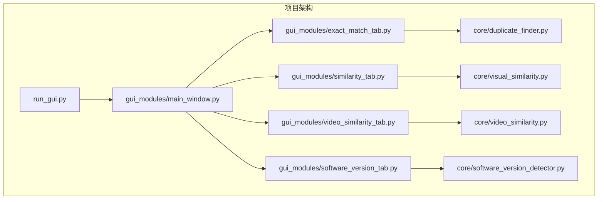

**图表来源**
- [run_gui.py:1-42](file://run_gui.py#L1-L42)
- [main_window.py:62-86](file://gui_modules/main_window.py#L62-L86)

**章节来源**
- [README.md:338-401](file://README.md#L338-L401)
- [requirements.txt:1-32](file://requirements.txt#L1-L32)

## 核心组件

精确匹配检测系统由以下核心组件构成：

### DuplicateFinder类
系统的核心引擎，负责文件扫描、哈希计算和重复检测：
- 多级哈希策略实现
- SQLite数据库管理
- 并行多线程处理
- 批量文件扫描
- 增量扫描支持

### GUI界面模块
提供用户友好的交互界面：
- 目录选择和管理
- 参数配置界面
- 实时进度显示
- 结果查看和筛选

**章节来源**
- [duplicate_finder.py:22-55](file://core/duplicate_finder.py#L22-L55)
- [exact_match_tab.py:18-42](file://gui_modules/exact_match_tab.py#L18-L42)

## 架构概览

系统采用分层架构设计，确保各层职责明确：

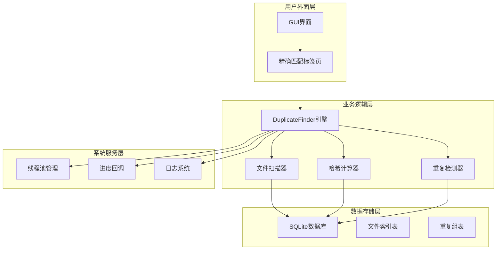

**图表来源**
- [duplicate_finder.py:22-55](file://core/duplicate_finder.py#L22-L55)
- [exact_match_tab.py:320-380](file://gui_modules/exact_match_tab.py#L320-L380)

## 详细组件分析

### DuplicateFinder类架构

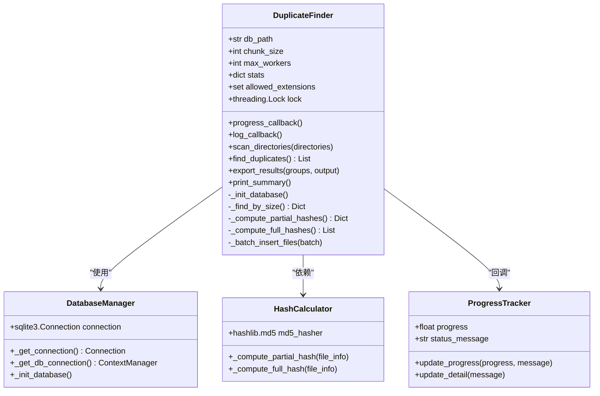

**图表来源**
- [duplicate_finder.py:22-55](file://core/duplicate_finder.py#L22-L55)
- [duplicate_finder.py:329-451](file://core/duplicate_finder.py#L329-L451)

### 数据库表结构

系统使用SQLite3存储文件索引信息：

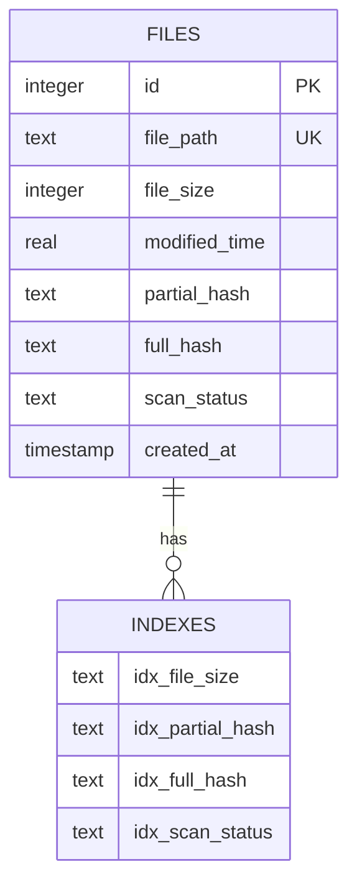

**图表来源**
- [duplicate_finder.py:69-91](file://core/duplicate_finder.py#L69-L91)

**章节来源**
- [duplicate_finder.py:56-94](file://core/duplicate_finder.py#L56-L94)

## 多级哈希策略实现

精确匹配检测采用三级哈希策略，确保在保证精度的同时最大化处理效率：

### 第一级：文件大小筛选

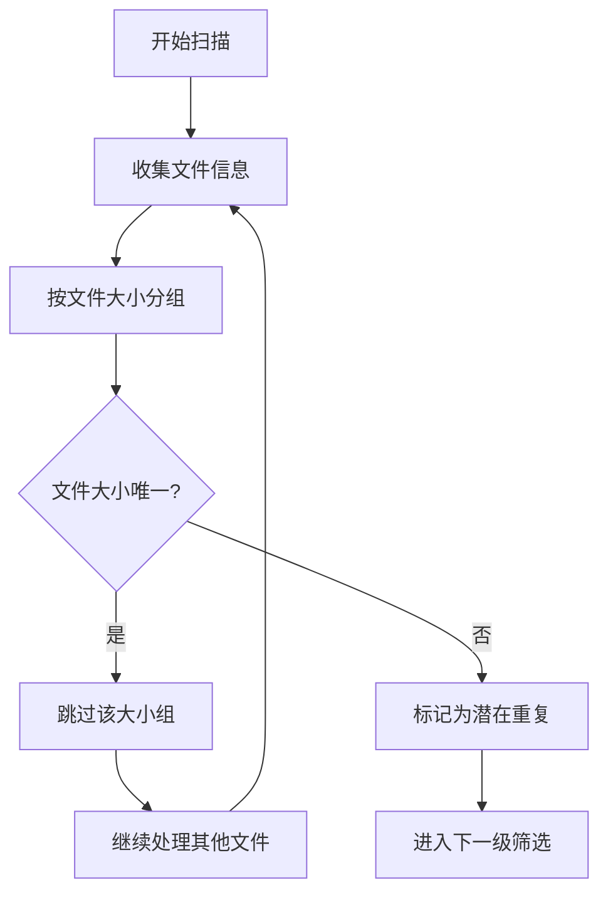

**图表来源**
- [duplicate_finder.py:300-327](file://core/duplicate_finder.py#L300-L327)

### 第二级：部分哈希计算（前1MB）

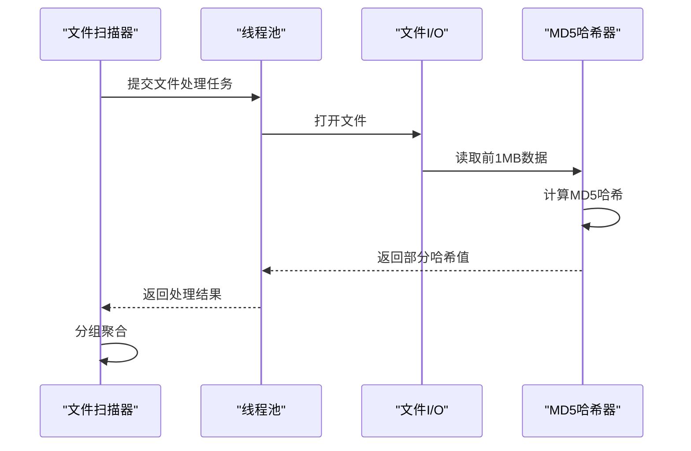

**图表来源**
- [duplicate_finder.py:329-386](file://core/duplicate_finder.py#L329-L386)

### 第三级：完整MD5哈希验证

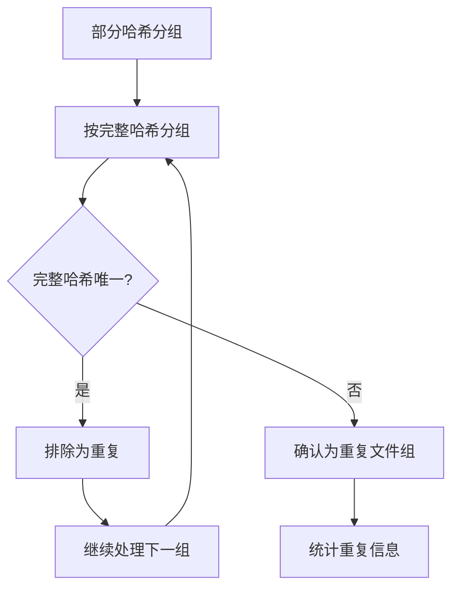

**图表来源**
- [duplicate_finder.py:387-451](file://core/duplicate_finder.py#L387-L451)

**章节来源**
- [duplicate_finder.py:229-285](file://core/duplicate_finder.py#L229-L285)

## SQLite数据库优化

系统采用多种SQLite优化策略确保大规模数据处理性能：

### 数据库配置优化

| 参数 | 设置值 | 作用 |
|------|--------|------|
| journal_mode | WAL | 提高并发读写性能 |
| synchronous | NORMAL | 平衡安全性和性能 |
| cache_size | -64000 | 64MB内存缓存 |
| temp_store | MEMORY | 临时表使用内存 |
| mmap_size | 268435456 | 256MB内存映射 |

### 索引优化策略

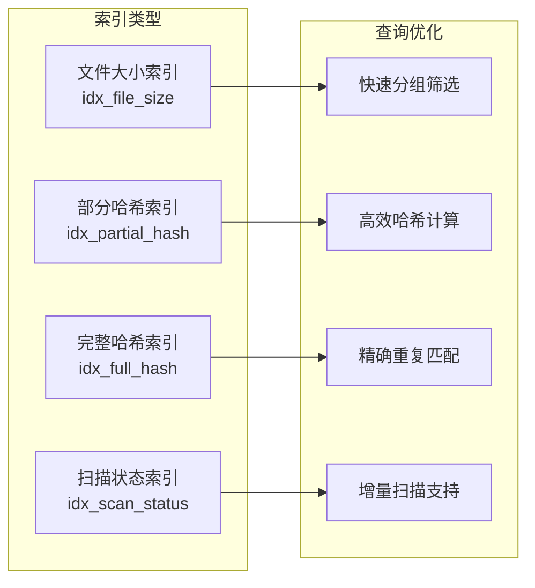

**图表来源**
- [duplicate_finder.py:87-91](file://core/duplicate_finder.py#L87-L91)

**章节来源**
- [duplicate_finder.py:56-94](file://core/duplicate_finder.py#L56-L94)

## 并行多线程处理

系统采用ThreadPoolExecutor实现高效的并行处理：

### 线程池配置

```mermaid
flowchart TD
A[CPU核心检测] --> B[自动线程数计算]
B --> C[min(CPU核心数×2, 16)]
C --> D[线程池初始化]
D --> E[任务分配]
E --> F[并行执行]
F --> G[结果聚合]
```

**图表来源**
- [duplicate_finder.py:32-38](file://core/duplicate_finder.py#L32-L38)

### 并行处理流程

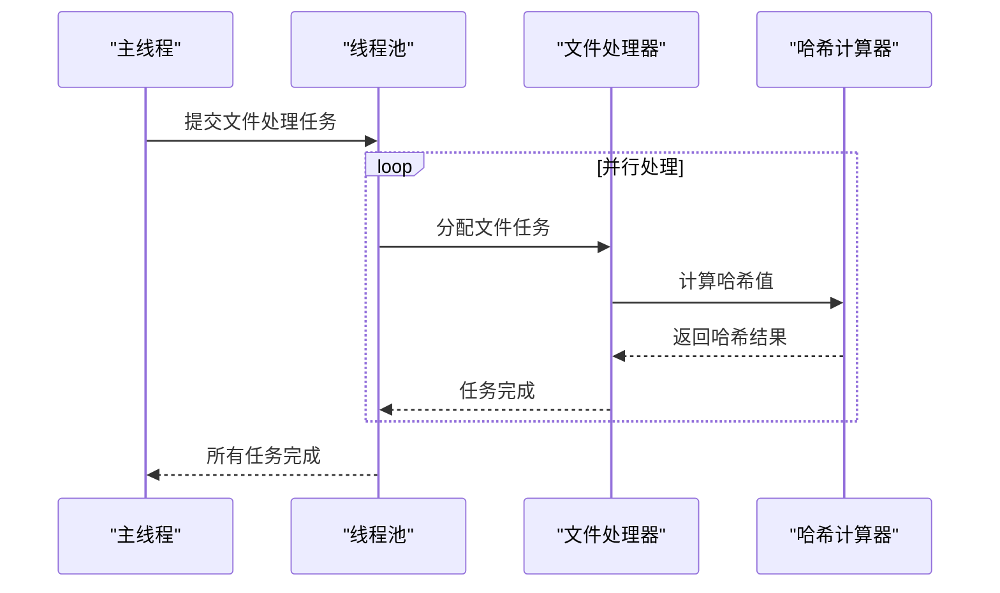

**图表来源**
- [duplicate_finder.py:364-380](file://core/duplicate_finder.py#L364-L380)

**章节来源**
- [duplicate_finder.py:36-38](file://core/duplicate_finder.py#L36-L38)

## 批量文件扫描算法

系统采用批量处理策略优化I/O性能：

### 扫描算法流程

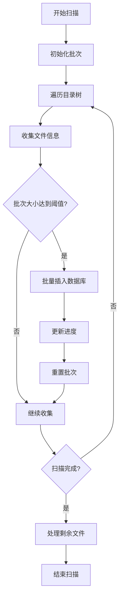

**图表来源**
- [duplicate_finder.py:158-218](file://core/duplicate_finder.py#L158-L218)

### 批量插入优化

| 参数 | 默认值 | 优化效果 |
|------|--------|----------|
| batch_size | 5000 | 减少数据库事务次数 |
| 进度更新频率 | 每1000个文件 | 平衡UI响应和性能 |
| 文件过滤 | 支持扩展名过滤 | 减少不必要的I/O |

**章节来源**
- [duplicate_finder.py:158-218](file://core/duplicate_finder.py#L158-L218)

## 增量扫描功能

系统支持增量扫描，避免重复处理已处理的文件：

### 增量扫描机制

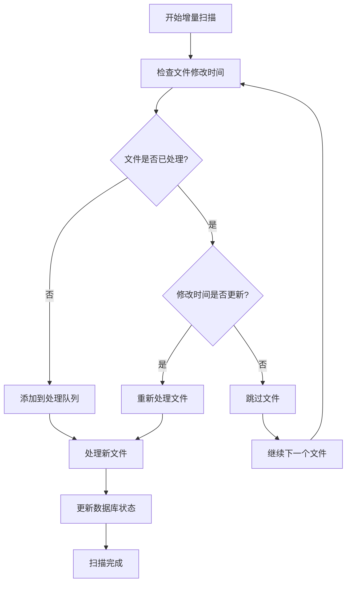

**图表来源**
- [duplicate_finder.py:184-213](file://core/duplicate_finder.py#L184-L213)

**章节来源**
- [duplicate_finder.py:184-213](file://core/duplicate_finder.py#L184-L213)

## 参数配置详解

### 核心参数说明

| 参数 | 类型 | 默认值 | 作用 | 最佳实践 |
|------|------|--------|------|----------|
| db_path | str | "file_index.db" | 数据库文件路径 | 使用SSD存储数据库文件 |
| chunk_size | int | 65536 | 文件读取块大小 | 64KB适合大多数场景 |
| max_workers | int | CPU核心数×2 | 并行线程数 | HDD: 4-8, SSD: 8-16 |
| allowed_extensions | set | None | 文件类型过滤 | 根据需求启用过滤 |
| clear_db | bool | True | 是否清空数据库 | 首次扫描启用，增量扫描禁用 |

### GUI界面参数配置

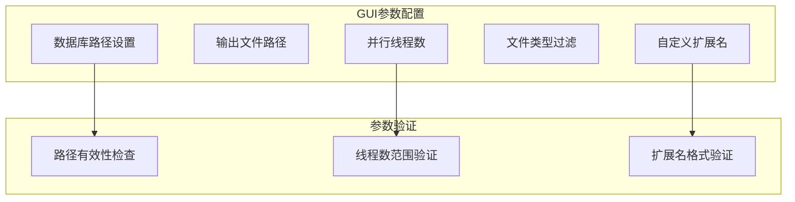

**图表来源**
- [exact_match_tab.py:27-40](file://gui_modules/exact_match_tab.py#L27-L40)

**章节来源**
- [duplicate_finder.py:25-46](file://core/duplicate_finder.py#L25-L46)
- [exact_match_tab.py:27-40](file://gui_modules/exact_match_tab.py#L27-L40)

## 性能优化建议

### 硬件优化

1. **存储设备选择**
   - SSD: 速度提升最高，推荐用于生产环境
   - HDD: 成本较低，适合大量数据存储
   - NVMe: 最新存储技术，性能优异

2. **内存配置**
   - 建议至少8GB内存
   - 大量文件扫描时建议16GB以上

### 系统调优

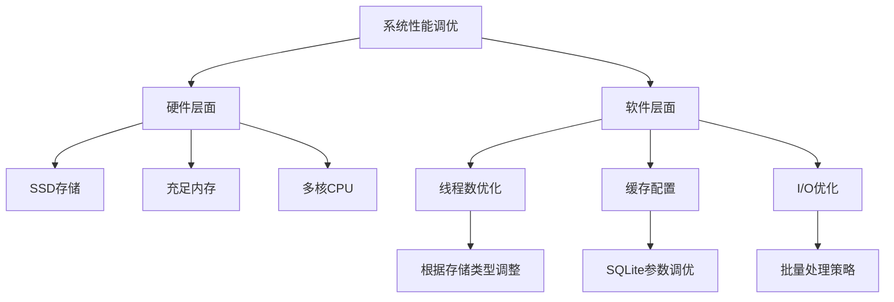

### 线程数配置建议

| 存储类型 | 推荐线程数 | 原因 |
|----------|------------|------|
| NVMe SSD | 12-16 | 高速I/O，充分利用CPU |
| SATA SSD | 8-12 | 中等I/O速度 |
| HDD | 4-8 | 机械I/O限制 |
| USB3.0 | 2-4 | 外部设备限制 |

**章节来源**
- [README.md:311-319](file://README.md#L311-L319)

## 故障排除指南

### 常见问题及解决方案

#### 1. 扫描速度慢

**可能原因**：
- 线程数配置不当
- 存储设备性能不足
- 文件过滤设置过于宽泛

**解决方法**：
```python
# 调整线程数
finder = DuplicateFinder(
    max_workers=8  # 根据存储类型调整
)

# 启用文件类型过滤
finder = DuplicateFinder(
    allowed_extensions={'.jpg', '.png', '.pdf'}
)
```

#### 2. 内存使用过高

**解决方法**：
- 减少max_workers参数
- 使用增量扫描模式
- 定期清理数据库

#### 3. 数据库文件过大

**解决方法**：
```sql
-- 清理旧数据
DELETE FROM files WHERE created_at < datetime('now', '-30 days');

-- 优化数据库
VACUUM;
```

#### 4. 权限错误

**解决方法**：
- 检查文件访问权限
- 以管理员身份运行
- 避免扫描受保护的系统目录

**章节来源**
- [README.md:521-636](file://README.md#L521-L636)

## 使用示例

### 基本使用方法

```python
from core.duplicate_finder import DuplicateFinder

# 创建检测器实例
finder = DuplicateFinder(
    db_path="my_index.db",
    chunk_size=65536,
    max_workers=8,
    allowed_extensions={'.jpg', '.png', '.pdf'}
)

# 扫描目录
finder.scan_directories(['/path/to/dir1', '/path/to/dir2'])

# 查找重复文件
duplicate_groups = finder.find_duplicates()

# 导出结果
finder.export_results(duplicate_groups, "duplicates.json")

# 打印统计信息
finder.print_summary()
```

### GUI界面使用

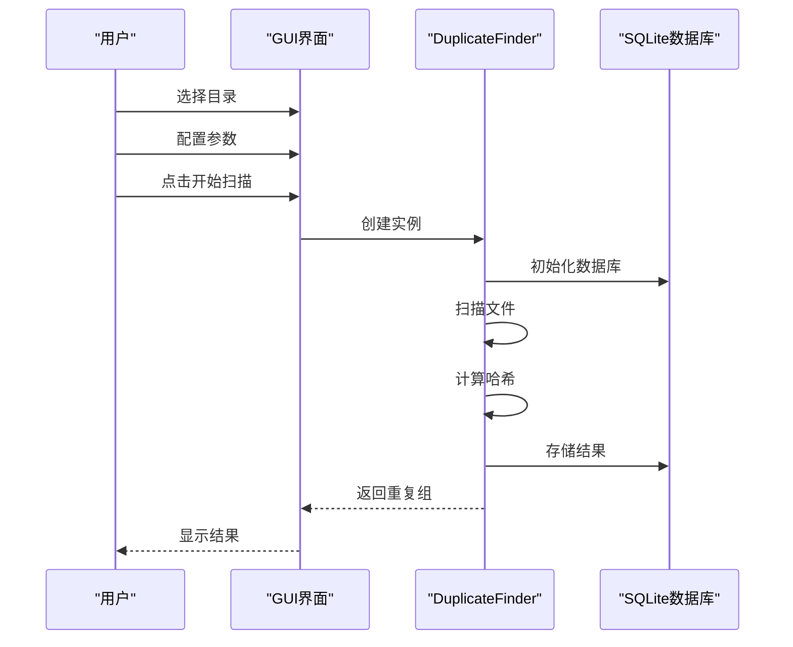

**图表来源**
- [exact_match_tab.py:320-380](file://gui_modules/exact_match_tab.py#L320-L380)

**章节来源**
- [duplicate_finder.py:515-588](file://core/duplicate_finder.py#L515-L588)

## 结论

精确匹配检测功能通过多级哈希策略、SQLite数据库优化和并行多线程处理实现了TB级数据的高效重复文件检测。系统具有以下优势：

1. **高精度**: 三级过滤策略确保检测精度达到99%+
2. **高性能**: 多线程并行处理，支持大规模数据处理
3. **易用性**: 完善的GUI界面和参数配置
4. **可扩展性**: 模块化设计便于功能扩展

通过合理的参数配置和系统调优，用户可以在不同硬件环境下获得最佳的检测性能。建议根据实际使用场景选择合适的参数配置，并定期维护数据库以保持最佳性能。