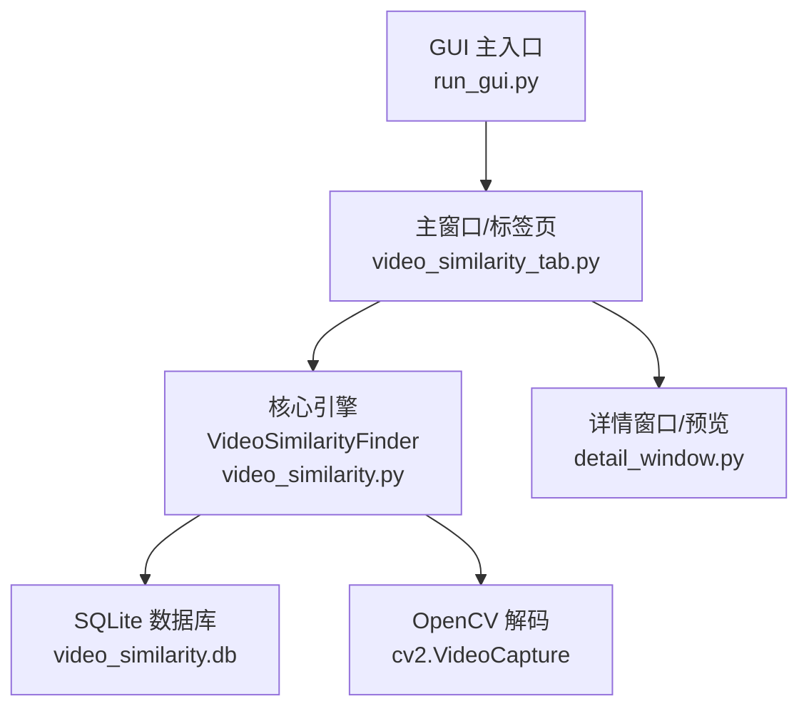
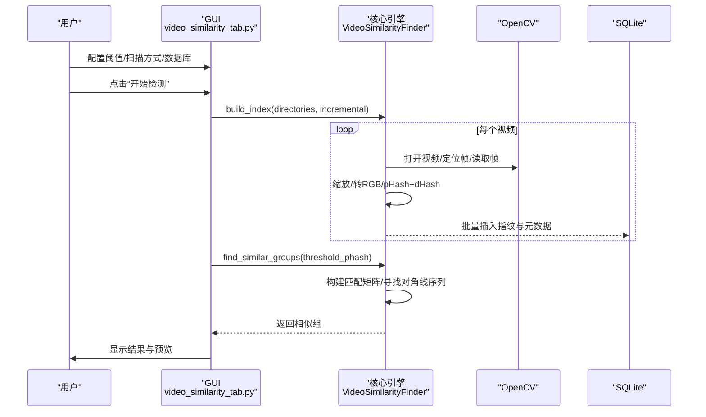
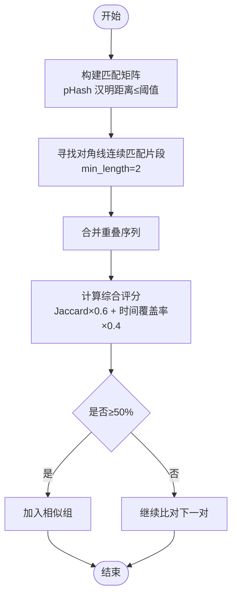
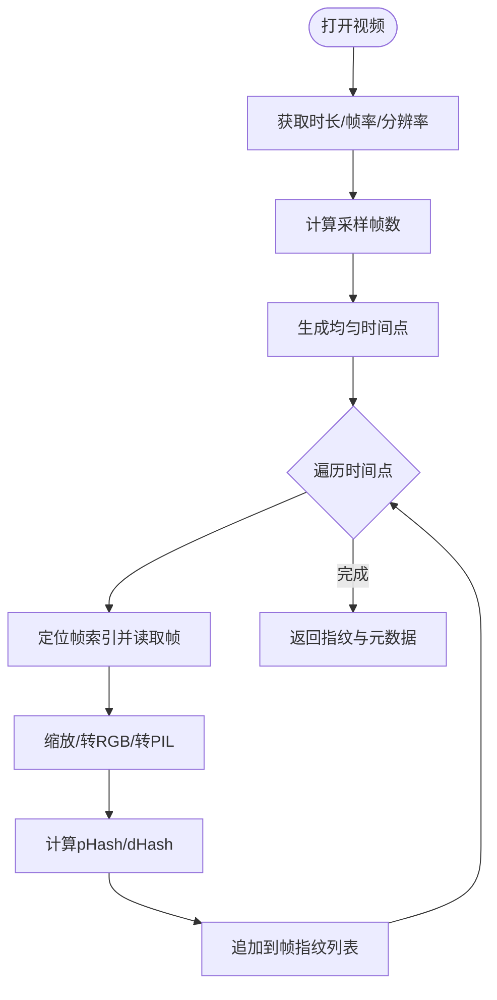
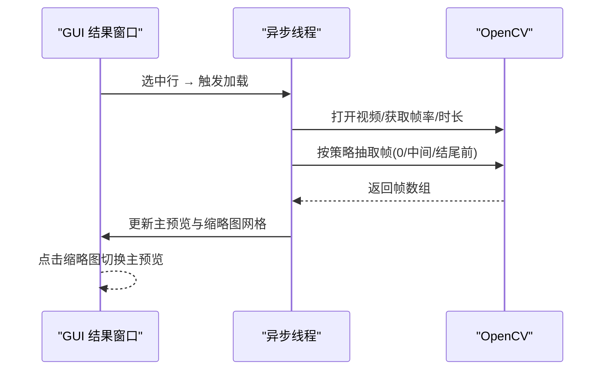
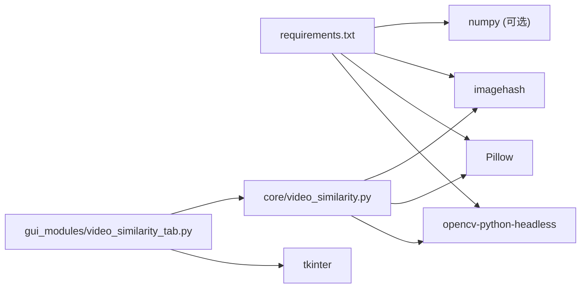

# 视频相似度检测

<cite>
**本文引用的文件**
- [core/video_similarity.py](file://core/video_similarity.py)
- [gui_modules/video_similarity_tab.py](file://gui_modules/video_similarity_tab.py)
- [gui_modules/detail_window.py](file://gui_modules/detail_window.py)
- [README.md](file://README.md)
- [requirements.txt](file://requirements.txt)
- [run_gui.py](file://run_gui.py)
</cite>

## 目录
1. [简介](#简介)
2. [项目结构](#项目结构)
3. [核心组件](#核心组件)
4. [架构总览](#架构总览)
5. [详细组件分析](#详细组件分析)
6. [依赖关系分析](#依赖关系分析)
7. [性能考虑](#性能考虑)
8. [故障排查指南](#故障排查指南)
9. [结论](#结论)
10. [附录：参数调优与使用示例](#附录：参数调优与使用示例)

## 简介
本技术文档聚焦于“视频相似度检测”功能，围绕 VideoSimilarityFinder 类的关键帧序列匹配算法展开，系统阐述视频解码流程、关键帧提取策略、滑动窗口相似度计算、多帧预览功能，以及与 OpenCV 的集成方式、支持的视频格式范围、相似度阈值设置和性能优化策略。文档同时提供 GUI 操作指南与视频预览使用说明，帮助读者快速上手并深入理解实现细节。

## 项目结构
本项目采用模块化分层设计：
- 核心引擎层：负责视频指纹提取、索引构建、相似度计算与分组（core/video_similarity.py）
- GUI 界面层：负责用户交互、参数配置、结果展示与预览（gui_modules/video_similarity_tab.py、detail_window.py）
- 启动入口：统一启动 GUI（run_gui.py）
- 依赖与说明：requirements.txt、README.md

图表来源
- [run_gui.py:13-25](file://run_gui.py#L13-L25)
- [gui_modules/video_similarity_tab.py:18-48](file://gui_modules/video_similarity_tab.py#L18-L48)
- [core/video_similarity.py:174-203](file://core/video_similarity.py#L174-L203)
- [gui_modules/detail_window.py:159-190](file://gui_modules/detail_window.py#L159-L190)

章节来源
- [README.md:338-372](file://README.md#L338-L372)
- [run_gui.py:13-25](file://run_gui.py#L13-L25)

## 核心组件
- VideoSimilarityFinder：视频相似度检测的核心类，负责扫描目录、构建索引、查找相似组、统计信息输出等。
- 关键帧指纹提取：基于 OpenCV 读取视频帧，缩放至统一尺寸，转换为 RGB，使用 imagehash 计算 pHash/dHash。
- 相似度计算：通过汉明距离构建匹配矩阵，寻找对角线连续匹配片段，结合 Jaccard 相似度与时间覆盖率综合评分。
- GUI 集成：提供阈值滑块、增量/全量扫描选择、数据库路径配置、进度条、日志输出、多帧预览与结果窗口。

章节来源
- [core/video_similarity.py:174-203](file://core/video_similarity.py#L174-L203)
- [core/video_similarity.py:21-151](file://core/video_similarity.py#L21-L151)
- [core/video_similarity.py:498-545](file://core/video_similarity.py#L498-L545)
- [gui_modules/video_similarity_tab.py:18-48](file://gui_modules/video_similarity_tab.py#L18-L48)

## 架构总览
视频相似度检测的整体流程如下：
- 用户在 GUI 中配置阈值、扫描方式、数据库路径与格式过滤
- 点击“开始检测”，GUI 调用 VideoSimilarityFinder.build_index 进行索引构建
- 多进程并行提取关键帧并计算指纹，批量写入 SQLite
- 调用 find_similar_groups 执行两级筛选与关键帧序列匹配，输出相似组
- 结果窗口展示列表，支持双击查看详细信息与多帧预览

图表来源
- [gui_modules/video_similarity_tab.py:331-396](file://gui_modules/video_similarity_tab.py#L331-L396)
- [core/video_similarity.py:310-367](file://core/video_similarity.py#L310-L367)
- [core/video_similarity.py:547-652](file://core/video_similarity.py#L547-L652)
- [core/video_similarity.py:21-151](file://core/video_similarity.py#L21-L151)

## 详细组件分析

### VideoSimilarityFinder 类与关键帧序列匹配
- 初始化与数据库优化：启用 WAL 模式、缓存与内存映射，创建 video_index 表及索引，提升并发与查询性能。
- 扫描与索引构建：遍历目录，过滤支持格式；多进程并行提取关键帧指纹，按批写入数据库。
- 相似度计算：
  - 汉明距离：将十六进制哈希转为整数后异或并统计 1 的个数。
  - 匹配矩阵：对两视频的关键帧序列逐对比较，阈值内标记为匹配。
  - 对角线序列：寻找长度≥2的对角线连续匹配片段，合并重叠序列。
  - 综合评分：Jaccard 相似度（匹配帧占比）与时间覆盖率加权平均。
- 相似组查找：先进行元数据快速筛选（时长差异、文件大小比例），再进行关键帧序列匹配，相似度≥50%归入同一组。

图表来源
- [core/video_similarity.py:389-404](file://core/video_similarity.py#L389-L404)
- [core/video_similarity.py:406-471](file://core/video_similarity.py#L406-L471)
- [core/video_similarity.py:498-545](file://core/video_similarity.py#L498-L545)
- [core/video_similarity.py:547-652](file://core/video_similarity.py#L547-L652)

章节来源
- [core/video_similarity.py:205-239](file://core/video_similarity.py#L205-L239)
- [core/video_similarity.py:310-367](file://core/video_similarity.py#L310-L367)
- [core/video_similarity.py:389-545](file://core/video_similarity.py#L389-L545)
- [core/video_similarity.py:547-652](file://core/video_similarity.py#L547-L652)

### 视频解码与关键帧提取策略
- 动态采样帧数：根据视频时长决定采样数量（短视频 5 帧、中短 10 帧、中长 20 帧、长视频每分钟 1 帧最多 50 帧）。
- 均匀时间点采样：按 duration/(num_frames-1) 计算时间点，定位到对应帧索引读取。
- 帧预处理：缩放到最大边 640px，BGR→RGB 转换，PIL Image 后计算 pHash/dHash（hash_size=8）。
- 失败处理：无法打开文件或未提取到任何关键帧时记录警告并跳过。

图表来源
- [core/video_similarity.py:21-151](file://core/video_similarity.py#L21-L151)
- [core/video_similarity.py:154-172](file://core/video_similarity.py#L154-L172)

章节来源
- [core/video_similarity.py:21-151](file://core/video_similarity.py#L21-L151)
- [core/video_similarity.py:154-172](file://core/video_similarity.py#L154-L172)

### 滑动窗口相似度计算与阈值设置
- 阈值含义：threshold_phash 表示 pHash 汉明距离上限，值越小要求越严格。
- 匹配判定：在匹配矩阵中，若两帧汉明距离≤阈值则标记为匹配。
- 连续片段：仅当对角线连续匹配长度≥2时才视为有效片段，避免误报。
- 综合评分：Jaccard 相似度（匹配帧占比）与时间覆盖率加权，最终≥50%才归入相似组。

章节来源
- [core/video_similarity.py:498-545](file://core/video_similarity.py#L498-L545)
- [core/video_similarity.py:547-652](file://core/video_similarity.py#L547-L652)

### 多帧预览功能
- 触发时机：在结果窗口中选中某一行时，异步加载该视频的多帧缩略图与主预览。
- 帧抽取策略：根据视频时长决定抽取帧数（短视频 1 帧、中等 3 帧、长视频 5 帧），首帧作为主预览，其余作为缩略图。
- 显示逻辑：主预览固定宽度 310px，高度自适应且限制最大高度；缩略图网格显示时间与可点击切换主预览。
- 缓存机制：LRU 策略缓存最近 N 个视频的帧数据与缩略图，减少重复 IO。

图表来源
- [gui_modules/video_similarity_tab.py:455-551](file://gui_modules/video_similarity_tab.py#L455-L551)
- [gui_modules/video_similarity_tab.py:553-651](file://gui_modules/video_similarity_tab.py#L553-L651)

章节来源
- [gui_modules/video_similarity_tab.py:455-651](file://gui_modules/video_similarity_tab.py#L455-L651)

### GUI 操作指南
- 配置区域：
  - 相似度阈值：滑块范围 5-30，实时显示当前模式（严格/平衡/宽松）。
  - 扫描方式：全量扫描（清空旧数据）或增量扫描（仅新增/修改）。
  - 数据库路径：可选择 .db 文件位置。
  - 视频格式：支持全选或勾选常用格式，支持自定义后缀输入。
- 控制按钮：开始检测、停止、结果查看。
- 进度与日志：进度条实时更新，日志区显示运行状态与错误信息。
- 结果窗口：显示相似组摘要，支持排序与操作列（打开位置、删除等）。

章节来源
- [gui_modules/video_similarity_tab.py:50-205](file://gui_modules/video_similarity_tab.py#L50-L205)
- [gui_modules/video_similarity_tab.py:331-414](file://gui_modules/video_similarity_tab.py#L331-L414)
- [gui_modules/video_similarity_tab.py:686-788](file://gui_modules/video_similarity_tab.py#L686-L788)

## 依赖关系分析
- OpenCV（opencv-python-headless）：用于视频解码与帧提取，无 GUI 版本体积更小。
- Pillow：图像预处理与缩略图生成。
- imagehash：感知哈希（pHash/dHash）计算。
- numpy：数值计算加速（可选）。
- sqlite3：数据存储与索引优化。
- tkinter：GUI 框架。

图表来源
- [requirements.txt:10-23](file://requirements.txt#L10-L23)
- [core/video_similarity.py:40-49](file://core/video_similarity.py#L40-L49)
- [gui_modules/video_similarity_tab.py:7-12](file://gui_modules/video_similarity_tab.py#L7-L12)

章节来源
- [requirements.txt:10-23](file://requirements.txt#L10-L23)
- [core/video_similarity.py:40-49](file://core/video_similarity.py#L40-L49)

## 性能考虑
- 多进程并行：使用 ProcessPoolExecutor 并行提取关键帧，max_workers 限制为 CPU 核心数与 4 的最小值，避免过度竞争。
- 数据库优化：WAL 模式、同步策略、缓存大小、内存映射，提升写入与查询性能。
- 批处理写入：按 batch_size 批量插入，减少 I/O 次数。
- 懒加载与缓存：GUI 侧对多帧缩略图采用 LRU 缓存，避免重复解码与渲染。
- 格式过滤：在 GUI 层支持自定义后缀过滤，缩小扫描范围。

章节来源
- [core/video_similarity.py:199-203](file://core/video_similarity.py#L199-L203)
- [core/video_similarity.py:210-215](file://core/video_similarity.py#L210-L215)
- [core/video_similarity.py:336-367](file://core/video_similarity.py#L336-L367)
- [gui_modules/video_similarity_tab.py:629-638](file://gui_modules/video_similarity_tab.py#L629-L638)

## 故障排查指南
- 缺少依赖库：导入 cv2/Pillow/imagehash 失败时会提示安装命令，确保已安装 opencv-python-headless、Pillow、imagehash、numpy。
- 无法打开视频文件：检查路径与权限，确认视频未被加密或损坏。
- 未提取到关键帧：可能是视频为空或编码不兼容，尝试更换格式或降低阈值。
- 数据库异常：检查 db_path 是否可写，必要时清理或重建数据库。
- GUI 报错：查看日志区错误信息，必要时重启程序或清理临时缓存。

章节来源
- [core/video_similarity.py:40-49](file://core/video_similarity.py#L40-L49)
- [core/video_similarity.py:51-60](file://core/video_similarity.py#L51-L60)
- [core/video_similarity.py:127-131](file://core/video_similarity.py#L127-L131)
- [gui_modules/video_similarity_tab.py:404-408](file://gui_modules/video_similarity_tab.py#L404-L408)

## 结论
VideoSimilarityFinder 通过关键帧序列匹配与滑动窗口算法，实现了抗剪辑、抗转码、抗调色的视频相似度检测。结合多进程并行、数据库优化与 GUI 懒加载缓存，系统在大规模视频库场景下具备良好性能与可用性。通过合理设置阈值与采样策略，可在准确率与效率之间取得平衡。

## 附录：参数调优与使用示例

### 关键帧采样间隔与窗口大小
- 采样帧数：根据视频时长动态调整（5-50 帧），保证覆盖全片的同时控制计算量。
- 窗口大小：对角线序列最小长度为 2，可根据需求调整以平衡灵敏度与鲁棒性。

章节来源
- [core/video_similarity.py:154-172](file://core/video_similarity.py#L154-L172)
- [core/video_similarity.py:406-437](file://core/video_similarity.py#L406-L437)

### 相似度计算参数调优
- threshold_phash：汉明距离阈值，默认 12（平衡模式），严格模式建议 5-8，宽松模式 15-20。
- 综合评分阈值：≥50% 归入相似组，可根据实际场景调整。

章节来源
- [core/video_similarity.py:498-545](file://core/video_similarity.py#L498-L545)
- [core/video_similarity.py:547-652](file://core/video_similarity.py#L547-L652)

### GUI 操作流程示例
- 添加扫描目录 → 选择“全量/增量”扫描 → 设置阈值 → 选择数据库路径 → 点击“开始检测” → 查看结果与预览。

章节来源
- [gui_modules/video_similarity_tab.py:331-396](file://gui_modules/video_similarity_tab.py#L331-L396)
- [gui_modules/video_similarity_tab.py:686-788](file://gui_modules/video_similarity_tab.py#L686-L788)

### 视频格式支持与 OpenCV 集成
- 支持格式：mp4、avi、mkv、mov、wmv、flv、webm、mpeg、mpg、3gp、m4v、rmvb、rm、ts、mts、f4v、f4p、asf、vob。
- OpenCV 集成：使用 cv2.VideoCapture 打开视频，读取帧并进行预处理与哈希计算。

章节来源
- [core/video_similarity.py:177-180](file://core/video_similarity.py#L177-L180)
- [core/video_similarity.py:56-69](file://core/video_similarity.py#L56-L69)
- [README.md:584-590](file://README.md#L584-L590)