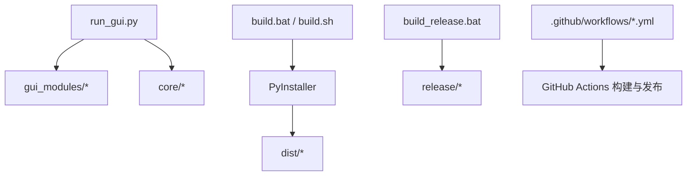
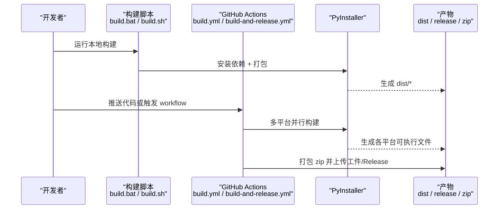
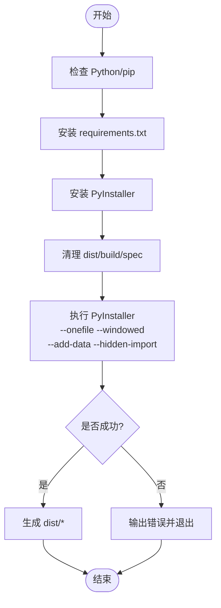
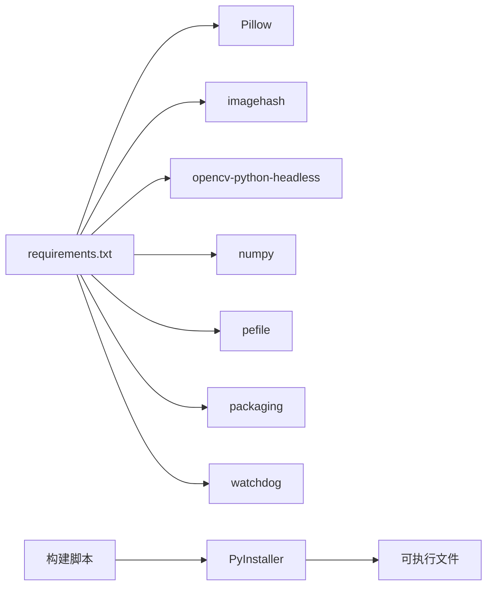

# 打包构建

<cite>
**本文引用的文件**
- [build.bat](file://build.bat)
- [build.sh](file://build.sh)
- [build_release.bat](file://build_release.bat)
- [requirements.txt](file://requirements.txt)
- [run_gui.py](file://run_gui.py)
- [build.yml](file://github/workflows/build.yml)
- [build-and-release.yml](file://github/workflows/build-and-release.yml)
- [README.md](file://README.md)
- [QUICK_START.md](file://QUICK_START.md)
</cite>

## 目录
1. [简介](#简介)
2. [项目结构](#项目结构)
3. [核心组件](#核心组件)
4. [架构总览](#架构总览)
5. [详细组件分析](#详细组件分析)
6. [依赖分析](#依赖分析)
7. [性能考虑](#性能考虑)
8. [故障排查指南](#故障排查指南)
9. [结论](#结论)
10. [附录](#附录)

## 简介
本指南面向开发与发布两类场景，系统说明本项目如何使用 build.bat、build.sh、build_release.bat 以及 GitHub Actions 工作流进行跨平台打包与发布。内容涵盖：可执行文件的生成过程、文件组织结构、运行时依赖、开发/发布脚本差异、自定义构建参数（名称、图标、版本信息）、常见问题与排错方法，以及最佳实践建议。

## 项目结构
- 入口程序为 run_gui.py，GUI 主窗口位于 gui_modules/main_window.py，核心算法位于 core/*。
- 打包产物统一输出到 dist 目录；发布包在 Windows 下通过 build_release.bat 整理到 release 目录。
- 依赖声明集中在 requirements.txt；CI/CD 使用 .github/workflows/*.yml。

图表来源
- [run_gui.py:1-42](file://run_gui.py#L1-L42)
- [build.bat:75-94](file://build.bat#L75-L94)
- [build.sh:70-86](file://build.sh#L70-L86)
- [build_release.bat:64-83](file://build_release.bat#L64-L83)
- [build.yml:29-40](file://github/workflows/build.yml#L29-L40)
- [build.yml:88-99](file://github/workflows/build.yml#L88-L99)
- [build.yml:147-158](file://github/workflows/build.yml#L147-L158)

章节来源
- [README.md:338-372](file://README.md#L338-L372)
- [QUICK_START.md:36-69](file://QUICK_START.md#L36-L69)

## 核心组件
- 本地构建脚本
  - build.bat：Windows 开发环境一键打包，安装依赖、清理旧产物、调用 PyInstaller 生成单文件可执行程序。
  - build.sh：Linux/macOS 开发环境一键打包，功能与 build.bat 对应。
  - build_release.bat：Windows 发布版打包，额外创建 release 目录并复制文档，便于分发。
- CI/CD 工作流
  - build.yml：在 Windows/Linux/macOS 三平台并行构建，产出 zip 包并可在打 tag 时创建 Release。
  - build-and-release.yml：带缓存与校验的构建流程，生成工件并可选创建 Release。

章节来源
- [build.bat:10-94](file://build.bat#L10-L94)
- [build.sh:30-86](file://build.sh#L30-L86)
- [build_release.bat:13-104](file://build_release.bat#L13-L104)
- [build.yml:10-67](file://github/workflows/build.yml#L10-L67)
- [build.yml:69-126](file://github/workflows/build.yml#L69-L126)
- [build.yml:128-185](file://github/workflows/build.yml#L128-L185)
- [build-and-release.yml:15-82](file://github/workflows/build-and-release.yml#L15-L82)

## 架构总览
下图展示从源码到可执行文件的完整构建链路，包括本地脚本与 CI 两条路径。

图表来源
- [build.bat:45-94](file://build.bat#L45-L94)
- [build.sh:52-86](file://build.sh#L52-L86)
- [build.yml:23-40](file://github/workflows/build.yml#L23-L40)
- [build.yml:82-99](file://github/workflows/build.yml#L82-L99)
- [build.yml:141-158](file://github/workflows/build.yml#L141-L158)
- [build-and-release.yml:36-64](file://github/workflows/build-and-release.yml#L36-L64)

## 详细组件分析

### 构建脚本对比与用法
- build.bat（Windows 开发）
  - 自动检测 Python/pip，升级 pip，安装 requirements.txt，安装 PyInstaller，清理 dist/build/spec，执行 PyInstaller 打包。
  - 关键参数：--name、--windowed、--onefile、--add-data、--hidden-import。
  - 产物位置：dist\文件重复校验工具.exe。
- build.sh（Linux/macOS 开发）
  - 行为与 build.bat 一致，适配 shell 语法与 --add-data 的分隔符（冒号）。
  - 产物位置：dist/文件重复校验工具。
- build_release.bat（Windows 发布）
  - 在 dist 基础上创建 release 目录，复制 README、QUICK_START、docs 等文档，便于直接分发。
  - 产物位置：release\文件重复校验工具-v4.0.0.exe（示例名含版本号）。

使用建议
- 开发调试：优先使用 build.bat / build.sh，快速迭代。
- 对外发布：使用 build_release.bat 或 CI 流水线，确保包含必要文档与校验。

章节来源
- [build.bat:45-111](file://build.bat#L45-L111)
- [build.sh:52-101](file://build.sh#L52-L101)
- [build_release.bat:55-121](file://build_release.bat#L55-L121)

### 可执行文件生成过程
- 入口：run_gui.py 启动 GUI，导入 gui_modules.main_window 并运行 Tk 主循环。
- 打包：PyInstaller 将 Python 解释器、依赖库、资源文件打包进单一可执行文件（--onefile），并通过 --add-data 将 core 与 gui_modules 作为数据目录嵌入，--hidden-import 显式引入动态加载模块。
- 产物：
  - Windows：dist\文件重复校验工具.exe
  - Linux/macOS：dist/文件重复校验工具

图表来源
- [build.bat:45-94](file://build.bat#L45-L94)
- [build.sh:52-86](file://build.sh#L52-L86)
- [run_gui.py:13-25](file://run_gui.py#L13-L25)

章节来源
- [run_gui.py:1-42](file://run_gui.py#L1-L42)
- [build.bat:75-111](file://build.bat#L75-L111)
- [build.sh:70-101](file://build.sh#L70-L101)

### 文件组织与运行时依赖
- 运行时必需
  - 可执行文件本身（已内嵌 Python 解释器与依赖）
  - 由 --add-data 嵌入的数据目录：core、gui_modules
  - 由 --hidden-import 引入的动态库：PIL、imagehash、cv2、numpy、pefile、packaging
- 数据库与缓存
  - 程序运行期会生成 SQLite 数据库文件（如 file_index.db、image_similarity.db、video_similarity.db、software_versions.db），用于增量扫描与结果持久化。
- 文档与说明
  - 发布包建议包含 README.md、QUICK_START.md、docs/*，便于用户了解使用方法。

章节来源
- [requirements.txt:7-23](file://requirements.txt#L7-L23)
- [build.bat:81-94](file://build.bat#L81-L94)
- [build.sh:76-86](file://build.sh#L76-L86)
- [README.md:364-372](file://README.md#L364-L372)

### 自定义构建参数
- 修改产品名称
  - 调整 --name 参数以改变输出文件名（例如加入版本号）。
- 添加图标
  - 将 --icon=NONE 替换为具体 .ico/.png 路径（Windows 推荐 .ico）。
- 版本信息与元数据
  - 当前脚本未设置 --version-file 等元数据字段；如需在 Windows 上显示“属性-详细信息”，可追加相应 spec 文件或命令行参数（需自行扩展脚本）。
- 控制压缩与体积
  - 可通过 --noupx 关闭 UPX 压缩（发布脚本已使用），权衡体积与启动速度。
- 隐藏/显式导入
  - 新增第三方库时，需在 --hidden-import 中补充，避免打包遗漏。

章节来源
- [build.bat:81-94](file://build.bat#L81-L94)
- [build_release.bat:69-83](file://build_release.bat#L69-L83)
- [build.yml:29-40](file://github/workflows/build.yml#L29-L40)
- [build.yml:88-99](file://github/workflows/build.yml#L88-L99)
- [build.yml:147-158](file://github/workflows/build.yml#L147-L158)

### 开发环境与发布环境差异
- 开发环境
  - 使用 build.bat / build.sh，快速验证功能与界面，产物仅 dist。
- 发布环境
  - 使用 build_release.bat 或 CI 流水线，产物包含 release 目录与文档，便于分发；CI 支持多平台构建与自动生成 Release。

章节来源
- [build_release.bat:98-121](file://build_release.bat#L98-L121)
- [build.yml:42-67](file://github/workflows/build.yml#L42-L67)
- [build.yml:101-126](file://github/workflows/build.yml#L101-L126)
- [build.yml:160-185](file://github/workflows/build.yml#L160-L185)
- [build-and-release.yml:76-115](file://github/workflows/build-and-release.yml#L76-L115)

### 跨平台打包注意事项与最佳实践
- 分隔符差异
  - Windows 使用分号（core;core），Linux/macOS 使用冒号（core:core）。
- 依赖差异
  - OpenCV 使用 headless 版本以减少体积；确保所有平台均可正确安装。
- 权限与可执行位
  - Linux/macOS 需确保脚本可执行（chmod +x build.sh）。
- 缓存加速
  - CI 中使用 pip cache 减少构建时间（见 build-and-release.yml）。
- 产物校验
  - 建议在 CI 中增加可执行文件存在性检查与大小校验，确保构建稳定。
- 文档完整性
  - 发布包务必包含 README、快速开始与 docs，降低用户上手成本。

章节来源
- [build.bat:81-94](file://build.bat#L81-L94)
- [build.sh:76-86](file://build.sh#L76-L86)
- [build-and-release.yml:28-48](file://github/workflows/build-and-release.yml#L28-L48)
- [QUICK_START.md:47-58](file://QUICK_START.md#L47-L58)

## 依赖分析
- 核心依赖
  - Pillow、imagehash：图片相似度检测
  - opencv-python-headless：视频处理
  - numpy：数值计算加速
  - pefile、packaging：v4 软件版本检测
  - watchdog：可选的文件监控
- 构建依赖
  - PyInstaller：打包工具
- 运行时注意
  - 若启用图片/视频/软件版本检测，请确保对应依赖被正确打包（已在脚本中以 --hidden-import 声明）。

图表来源
- [requirements.txt:7-23](file://requirements.txt#L7-L23)
- [build.bat:45-94](file://build.bat#L45-L94)
- [build.sh:52-86](file://build.sh#L52-L86)

章节来源
- [requirements.txt:1-32](file://requirements.txt#L1-L32)

## 性能考虑
- 首次打包较慢属正常现象，后续构建可利用 pip 缓存与 PyInstaller 缓存提升速度。
- 大依赖（如 OpenCV、NumPy）会增加构建时间与产物体积，按需启用相关功能。
- 使用 --onefile 会牺牲部分启动速度，但便于分发；如需更快冷启动，可评估 --onedir 模式（需调整资源访问逻辑）。
- 合理设置并行线程数与阈值参数，可减少扫描耗时（与业务逻辑相关，非构建阶段）。

[本节为通用指导，不直接引用具体文件]

## 故障排查指南
常见失败原因与解决思路
- Python/pip 未安装或不可用
  - 现象：脚本提示未检测到 Python 或 pip 不可用。
  - 处理：安装 Python 3.6+ 并确保加入 PATH，重新运行脚本。
- 依赖安装失败
  - 现象：pip install -r requirements.txt 报错。
  - 处理：检查网络与镜像源；必要时升级 pip；确认系统编译器/头文件满足依赖要求（如 OpenCV）。
- PyInstaller 安装失败
  - 现象：安装 pyinstaller 时报错。
  - 处理：升级 pip 后重试；检查 Python 版本兼容性。
- 打包失败（缺少模块/动态库）
  - 现象：打包过程中报 ImportError 或缺少 DLL。
  - 处理：在 --hidden-import 中补充缺失模块；确认依赖已正确安装；必要时手动添加数据文件。
- 图标无效或路径错误
  - 现象：--icon 指定路径不存在或格式不支持。
  - 处理：使用 .ico 或支持的格式，确保路径正确。
- 产物缺失或为空
  - 现象：dist 目录下无可执行文件。
  - 处理：查看构建日志；检查 PyInstaller 命令与参数；确认入口文件路径正确。

章节来源
- [build.bat:10-38](file://build.bat#L10-L38)
- [build.bat:45-65](file://build.bat#L45-L65)
- [build.bat:96-101](file://build.bat#L96-L101)
- [build.sh:30-45](file://build.sh#L30-L45)
- [build.sh:52-62](file://build.sh#L52-L62)
- [build.sh:88-91](file://build.sh#L88-L91)
- [build_release.bat:13-53](file://build_release.bat#L13-L53)
- [build_release.bat:85-90](file://build_release.bat#L85-L90)

## 结论
- 本地开发推荐使用 build.bat / build.sh 快速构建与验证；发布推荐使用 build_release.bat 或 CI 流水线，确保产物完整且可追溯。
- 通过 --name、--icon、--hidden-import、--add-data 等参数可灵活定制构建行为；如需更丰富的元数据（如版本信息），可在现有脚本基础上扩展。
- 借助 GitHub Actions 可实现多平台自动化构建与发布，配合缓存与校验提升效率与稳定性。

[本节为总结性内容，不直接引用具体文件]

## 附录
- 快速开始
  - 本地运行：python run_gui.py
  - 打包：Windows 双击 build.bat；Linux/macOS 执行 chmod +x build.sh && ./build.sh
- 发布包内容
  - 可执行文件、README、QUICK_START、docs 等文档
- CI 触发方式
  - 推送标签 v* 或手动触发 workflow_dispatch

章节来源
- [QUICK_START.md:36-69](file://QUICK_START.md#L36-L69)
- [README.md:258-276](file://README.md#L258-L276)
- [build.yml:3-8](file://github/workflows/build.yml#L3-L8)
- [build-and-release.yml:3-12](file://github/workflows/build-and-release.yml#L3-L12)