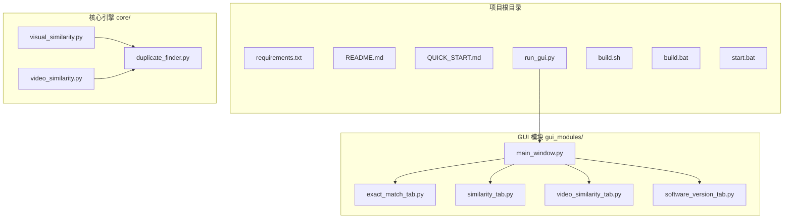
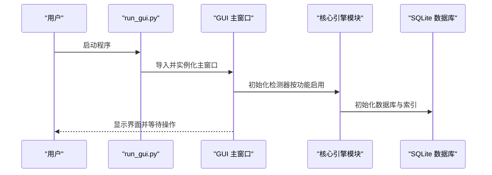
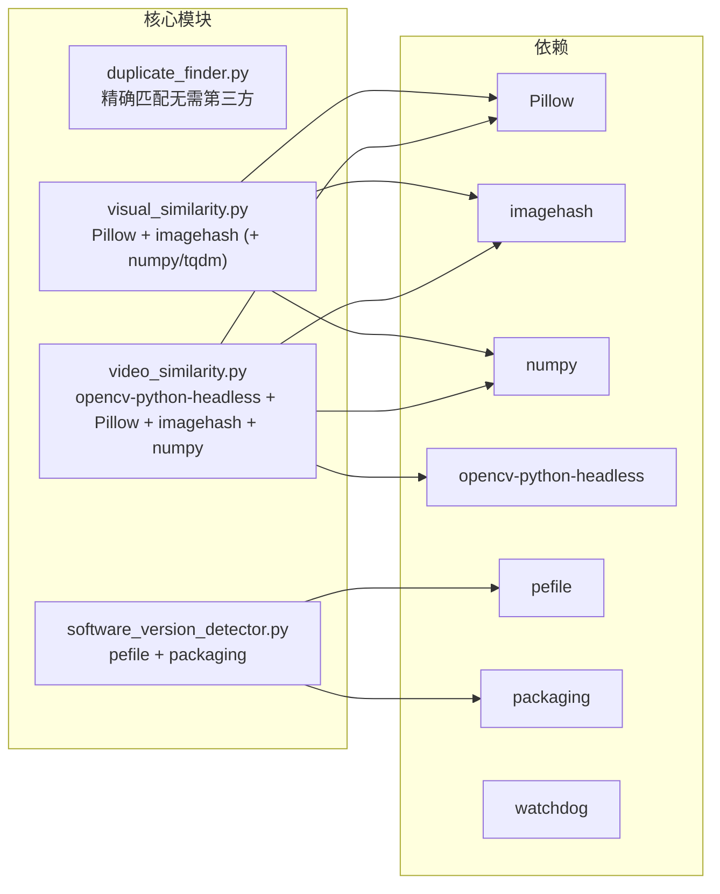

# 环境配置

<cite>
**本文引用的文件**
- [requirements.txt](file://requirements.txt)
- [README.md](file://README.md)
- [QUICK_START.md](file://QUICK_START.md)
- [run_gui.py](file://run_gui.py)
- [build.sh](file://build.sh)
- [build.bat](file://build.bat)
- [start.bat](file://start.bat)
- [core/duplicate_finder.py](file://core/duplicate_finder.py)
- [core/visual_similarity.py](file://core/visual_similarity.py)
- [core/video_similarity.py](file://core/video_similarity.py)
</cite>

## 目录
1. [简介](#简介)
2. [项目结构](#项目结构)
3. [核心组件](#核心组件)
4. [架构概览](#架构概览)
5. [详细组件分析](#详细组件分析)
6. [依赖分析](#依赖分析)
7. [性能考虑](#性能考虑)
8. [故障排除指南](#故障排除指南)
9. [结论](#结论)
10. [附录](#附录)

## 简介
本指南面向首次使用或迁移至本项目的用户，提供从零开始的环境配置与验证流程。重点涵盖：
- Python 3.7+ 的安装要求与版本兼容性
- requirements.txt 中各依赖包的作用与安装方法
- 基础依赖（Python 标准库）与可选依赖的区分
- Windows、Linux、macOS 的具体安装命令与注意事项
- 环境验证方法与常见问题的解决方案

## 项目结构
该项目采用“核心引擎 + GUI 模块”的分层组织方式，便于按需启用不同功能：
- 核心引擎位于 core/，包含重复文件检测、图片相似度、视频相似度、多版本软件检测等模块
- GUI 模块位于 gui_modules/，负责用户交互界面
- requirements.txt 统一声明依赖，README.md 提供安装与使用说明
- build.sh/build.bat/start.bat 提供跨平台的打包与启动辅助脚本

图表来源
- [run_gui.py:1-42](file://run_gui.py#L1-L42)
- [core/duplicate_finder.py:1-200](file://core/duplicate_finder.py#L1-L200)
- [core/visual_similarity.py:1-200](file://core/visual_similarity.py#L1-L200)
- [core/video_similarity.py:1-200](file://core/video_similarity.py#L1-L200)

章节来源
- [README.md:338-372](file://README.md#L338-L372)
- [requirements.txt:1-32](file://requirements.txt#L1-L32)

## 核心组件
本项目的核心能力由以下模块构成：
- duplicate_finder.py：基于内容的精确匹配（MD5 三级过滤），无需第三方依赖
- visual_similarity.py：图片相似度检测（pHash/dHash/直方图），依赖 Pillow、imagehash、可选 numpy、tqdm
- video_similarity.py：视频相似度检测（关键帧序列匹配），依赖 opencv-python-headless、Pillow、imagehash、numpy
- software_version_detector.py（在 requirements.txt 中标注 v4.0 新增）：多版本软件检测，依赖 pefile、packaging

章节来源
- [requirements.txt:25-31](file://requirements.txt#L25-L31)
- [README.md:136-198](file://README.md#L136-L198)

## 架构概览
下图展示了从启动入口到核心引擎与 GUI 的交互关系，以及依赖注入的关键节点。

图表来源
- [run_gui.py:13-37](file://run_gui.py#L13-L37)
- [core/duplicate_finder.py:56-94](file://core/duplicate_finder.py#L56-L94)
- [core/visual_similarity.py:123-169](file://core/visual_similarity.py#L123-L169)
- [core/video_similarity.py:184-200](file://core/video_similarity.py#L184-L200)

## 详细组件分析

### Python 3.7+ 安装要求与版本兼容性
- 项目明确标注“语言：Python 3.7+”，建议使用 Python 3.8+ 以获得更好的性能与稳定性
- Windows 用户可通过官方安装包勾选“Add Python to PATH”；Linux/macOS 用户可通过包管理器安装
- 虚拟环境推荐使用 venv 创建隔离环境，避免系统级冲突

章节来源
- [README.md:5-5](file://README.md#L5-L5)
- [README.md:211-221](file://README.md#L211-L221)

### requirements.txt 依赖清单与作用说明
- 基础依赖（Python 标准库，无需安装）：os、sys、hashlib、sqlite3、json、time、argparse、pathlib、concurrent.futures、collections、typing、threading、contextlib
- 可选依赖（按功能启用）：
  - watchdog>=2.1.0：文件实时监控功能
  - Pillow>=9.0.0：图像处理（图片/视频相似度检测）
  - imagehash>=4.3.0：感知哈希算法（pHash/dHash）
  - numpy>=1.21.0：数值计算加速（图片/视频相似度检测）
  - tqdm>=4.62.0：进度条美化（可选）
  - opencv-python-headless>=4.5.0：视频解码与帧提取（无 GUI 版本）
  - pefile>=2021.9.3：PE 文件元数据提取（v4.0 多版本软件检测）
  - packaging>=21.0：语义化版本比较（v4.0 多版本软件检测）

章节来源
- [requirements.txt:3-31](file://requirements.txt#L3-L31)
- [README.md:229-248](file://README.md#L229-L248)

### 不同操作系统安装步骤与注意事项

#### Windows
- 安装 Python 3.7+ 并勾选“Add Python to PATH”
- 推荐使用虚拟环境：
  - python -m venv .venv
  - .venv\Scripts\activate
- 安装依赖：pip install -r requirements.txt
- 启动 GUI：python run_gui.py
- 打包可执行文件：双击 build.bat 或使用 PyInstaller（脚本内已集成）

章节来源
- [build.bat:10-23](file://build.bat#L10-L23)
- [build.bat:29-35](file://build.bat#L29-L35)
- [build.bat:45-54](file://build.bat#L45-L54)
- [README.md:211-221](file://README.md#L211-L221)
- [README.md:223-227](file://README.md#L223-L227)

#### Linux/macOS
- 安装 Python 3.6+ 与 pip（Ubuntu/Debian：sudo apt install python3 python3-pip；CentOS/RHEL：sudo yum install python3 python3-pip；macOS：brew install python3）
- 推荐使用虚拟环境：
  - python3 -m venv .venv
  - source .venv/bin/activate
- 安装依赖：pip install -r requirements.txt
- 启动 GUI：python run_gui.py
- 打包可执行文件：chmod +x build.sh && ./build.sh

章节来源
- [build.sh:30-42](file://build.sh#L30-L42)
- [build.sh:52-55](file://build.sh#L52-L55)
- [README.md:218-221](file://README.md#L218-L221)
- [README.md:223-227](file://README.md#L223-L227)

### 环境验证方法
- 成功启动 GUI：python run_gui.py
- 依赖缺失时的提示：run_gui.py 在 ImportError 时会打印缺少的模块并给出安装建议
- 打包验证：build.sh/build.bat 成功后会在 dist 目录生成可执行文件

章节来源
- [README.md:250-256](file://README.md#L250-L256)
- [run_gui.py:27-31](file://run_gui.py#L27-L31)
- [build.sh:94-102](file://build.sh#L94-L102)
- [build.bat:104-111](file://build.bat#L104-L111)

### 常见环境问题与解决方案
- 依赖安装失败：确认 pip 可用且网络正常；必要时升级 pip；在 Linux/macOS 上使用 python3 -m pip
- OpenCV/图像库相关错误：确保安装 opencv-python-headless、Pillow、imagehash、numpy
- 权限问题（Linux/macOS）：为 build.sh 赋予执行权限后再运行
- 虚拟环境未激活：使用 .venv/bin/activate（Linux/macOS）或 .venv\Scripts\activate.bat（Windows）

章节来源
- [build.sh:39-42](file://build.sh#L39-L42)
- [build.bat:29-35](file://build.bat#L29-L35)
- [core/video_similarity.py:46-49](file://core/video_similarity.py#L46-L49)
- [core/visual_similarity.py:40-41](file://core/visual_similarity.py#L40-L41)

## 依赖分析
下图展示核心模块与依赖的关系，帮助理解按功能启用依赖的策略。

图表来源
- [requirements.txt:7-24](file://requirements.txt#L7-L24)
- [core/visual_similarity.py:40-41](file://core/visual_similarity.py#L40-L41)
- [core/video_similarity.py:42-45](file://core/video_similarity.py#L42-L45)
- [core/software_version_detector.py:1-50](file://core/software_version_detector.py#L1-L50)

章节来源
- [requirements.txt:25-31](file://requirements.txt#L25-L31)

## 性能考虑
- 并行策略：核心模块广泛使用多进程/多线程（如 ProcessPoolExecutor、ThreadPoolExecutor）以提升 I/O 密集型任务的吞吐量
- 数据库优化：SQLite 使用 WAL 模式、索引与 PRAGMA 参数优化，支持增量扫描与缓存
- 资源限制：根据 CPU 核心数自动设置最大工作线程数，避免过度竞争

章节来源
- [core/duplicate_finder.py:32-38](file://core/duplicate_finder.py#L32-L38)
- [core/visual_similarity.py:118-119](file://core/visual_similarity.py#L118-L119)
- [core/video_similarity.py:199-200](file://core/video_similarity.py#L199-L200)
- [README.md:405-426](file://README.md#L405-L426)
- [README.md:427-443](file://README.md#L427-L443)

## 故障排除指南
- 启动失败（ImportError）：run_gui.py 会在导入失败时提示缺少模块并给出安装建议
- 依赖缺失导致的功能异常：如视频相似度检测提示缺少 opencv-python-headless、Pillow、imagehash、numpy
- 打包失败：build.sh/build.bat 会输出详细错误信息，优先检查 Python 与 pip 环境、网络连通性
- 虚拟环境问题：确认 .venv 已正确创建并激活

章节来源
- [run_gui.py:27-31](file://run_gui.py#L27-L31)
- [core/video_similarity.py:46-49](file://core/video_similarity.py#L46-L49)
- [build.sh:88-91](file://build.sh#L88-L91)
- [build.bat:95-101](file://build.bat#L95-L101)

## 结论
通过本指南，您可以在 Windows、Linux、macOS 上完成 Python 环境与依赖的安装，并按需启用图片/视频相似度检测与多版本软件检测功能。建议始终使用虚拟环境隔离依赖，遵循 requirements.txt 的版本约束，并在遇到问题时参考故障排除章节与脚本输出的错误信息。

## 附录
- 快速开始：参见 QUICK_START.md 的“两种使用方式”与“使用教程”
- 打包与启动：build.sh/build.bat 提供一键打包与可执行文件生成；start.bat 用于 Windows 虚拟环境启动

章节来源
- [QUICK_START.md:7-100](file://QUICK_START.md#L7-L100)
- [build.sh:76-86](file://build.sh#L76-L86)
- [build.bat:81-94](file://build.bat#L81-L94)
- [start.bat:9-32](file://start.bat#L9-L32)