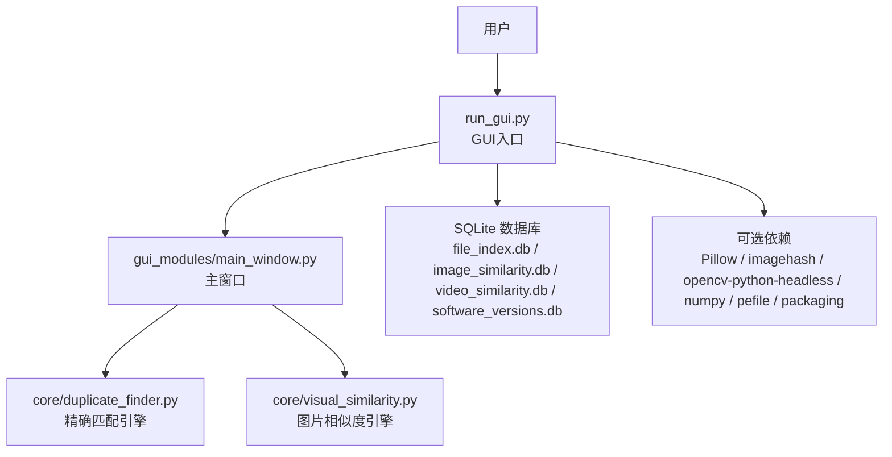
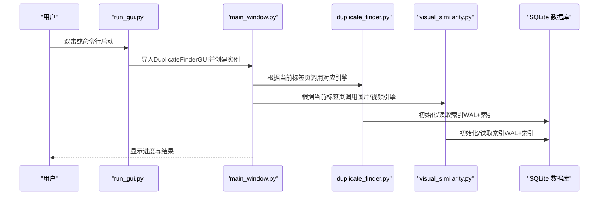
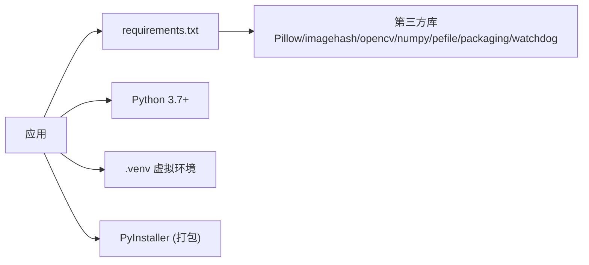

# 部署指南

<cite>
**本文引用的文件**
- [run_gui.py](file://run_gui.py)
- [start.bat](file://start.bat)
- [build.bat](file://build.bat)
- [build.sh](file://build.sh)
- [build_release.bat](file://build_release.bat)
- [requirements.txt](file://requirements.txt)
- [README.md](file://README.md)
- [QUICK_START.md](file://QUICK_START.md)
- [.gitignore](file://.gitignore)
- [gui_modules/main_window.py](file://gui_modules/main_window.py)
- [core/duplicate_finder.py](file://core/duplicate_finder.py)
- [core/visual_similarity.py](file://core/visual_similarity.py)
</cite>

## 目录
1. [简介](#简介)
2. [项目结构](#项目结构)
3. [核心组件](#核心组件)
4. [架构总览](#架构总览)
5. [详细组件分析](#详细组件分析)
6. [依赖关系分析](#依赖关系分析)
7. [性能考虑](#性能考虑)
8. [故障排查指南](#故障排查指南)
9. [结论](#结论)
10. [附录](#附录)

## 简介
本指南面向在目标系统上部署“文件重复校验工具”的运维与实施人员，覆盖环境准备、文件复制、权限设置、启动方式（含GUI入口 run_gui.py 与 Windows 快速启动 start.bat）、生产环境安全与性能优化、监控与日志管理、自动启动与服务注册，以及单机、网络共享、服务器三类部署场景的具体实施方案。

## 项目结构
- 应用入口：run_gui.py（GUI启动入口）
- Windows快速启动：start.bat（激活虚拟环境并启动GUI）
- 打包脚本：build.bat / build.sh / build_release.bat（生成独立可执行文件）
- 依赖清单：requirements.txt
- GUI主窗口：gui_modules/main_window.py
- 核心引擎：core/duplicate_finder.py、core/visual_similarity.py
- 文档与说明：README.md、QUICK_START.md
- 忽略规则：.gitignore（数据库、日志等输出物）

图表来源
- [run_gui.py:1-42](file://run_gui.py#L1-L42)
- [gui_modules/main_window.py:1-200](file://gui_modules/main_window.py#L1-L200)
- [core/duplicate_finder.py:45-135](file://core/duplicate_finder.py#L45-L135)
- [core/visual_similarity.py:114-151](file://core/visual_similarity.py#L114-L151)

章节来源
- [README.md:202-277](file://README.md#L202-L277)
- [QUICK_START.md:1-191](file://QUICK_START.md#L1-L191)

## 核心组件
- GUI入口 run_gui.py：初始化Python路径、导入主窗口类、创建Tk根窗口并进入主循环；捕获导入异常与通用异常并打印堆栈。
- Windows启动 start.bat：定位到脚本所在目录，激活 .venv，检查Python版本，然后直接运行 gui_modules/main_window.py。
- 打包脚本：
  - build.bat/build.sh：安装依赖、安装PyInstaller、清理旧构建产物、打包为单文件可执行程序。
  - build_release.bat：发布版打包，额外包含版本号命名、打包后整理release目录。
- 依赖 requirements.txt：列出可选依赖（Pillow、imagehash、opencv-python-headless、numpy、pefile、packaging等）。
- GUI主窗口 main_window.py：组织标签页（精确匹配、图片相似度、视频相似度、多版本软件检测），维护扫描目录列表、线程控制、结果查看等。
- 核心引擎 duplicate_finder.py：自动检测CPU与磁盘类型以设定最优工作线程数；初始化SQLite数据库并配置WAL等PRAGMA优化。
- 视觉相似 visual_similarity.py：初始化数据库并设置WAL、同步策略、缓存大小、内存映射等参数以提升并发与查询性能。

章节来源
- [run_gui.py:1-42](file://run_gui.py#L1-L42)
- [start.bat:1-38](file://start.bat#L1-L38)
- [build.bat:1-121](file://build.bat#L1-L121)
- [build.sh:1-113](file://build.sh#L1-L113)
- [build_release.bat:1-131](file://build_release.bat#L1-L131)
- [requirements.txt:1-32](file://requirements.txt#L1-L32)
- [gui_modules/main_window.py:1-200](file://gui_modules/main_window.py#L1-L200)
- [core/duplicate_finder.py:45-135](file://core/duplicate_finder.py#L45-L135)
- [core/visual_similarity.py:114-151](file://core/visual_similarity.py#L114-L151)

## 架构总览
应用采用分层架构：
- 界面层：基于tkinter的GUI，提供多标签页操作与可视化预览。
- 引擎层：精确匹配、图片相似度、视频相似度、多版本软件检测四大引擎。
- 数据层：SQLite数据库索引（WAL模式、索引优化、增量扫描支持）。
- 运行时：通过PyInstaller打包后可脱离Python环境运行；或通过虚拟环境直接运行。

图表来源
- [run_gui.py:13-37](file://run_gui.py#L13-L37)
- [gui_modules/main_window.py:62-85](file://gui_modules/main_window.py#L62-L85)
- [core/duplicate_finder.py:133-135](file://core/duplicate_finder.py#L133-L135)
- [core/visual_similarity.py:123-151](file://core/visual_similarity.py#L123-L151)

## 详细组件分析

### GUI启动入口 run_gui.py
- 作用：将当前目录加入sys.path，导入主窗口类，创建Tk根窗口并进入事件循环。
- 错误处理：捕获ImportError提示缺失依赖；捕获其他异常并打印完整堆栈后退出。
- 使用方式：
  - 开发环境：python run_gui.py
  - 已打包：直接运行生成的exe（无需Python环境）

章节来源
- [run_gui.py:1-42](file://run_gui.py#L1-L42)

### Windows快速启动 start.bat
- 功能：切换到脚本所在目录，激活 .venv，检查Python版本，最后运行 gui_modules/main_window.py。
- 注意：该脚本直接运行GUI模块而非run_gui.py；若需统一入口，可将最后一行改为 python run_gui.py。

章节来源
- [start.bat:1-38](file://start.bat#L1-L38)

### 打包与发布
- build.bat/build.sh：
  - 检测Python与pip
  - 安装requirements.txt依赖
  - 安装PyInstaller
  - 清理dist/build/spec
  - 打包为单文件可执行程序（包含core与gui_modules资源）
- build_release.bat：
  - 发布版命名（带版本号）
  - 打包后复制到release目录，附带README与docs

章节来源
- [build.bat:1-121](file://build.bat#L1-L121)
- [build.sh:1-113](file://build.sh#L1-L113)
- [build_release.bat:1-131](file://build_release.bat#L1-L131)

### GUI主窗口 main_window.py
- 职责：组织四个标签页（精确匹配、图片相似度、视频相似度、多版本软件检测），管理目录选择、扫描控制、结果查看与日志输出。
- 关键变量：数据库路径、输出路径、并行线程数、相似度阈值、增量扫描开关等。

章节来源
- [gui_modules/main_window.py:1-200](file://gui_modules/main_window.py#L1-L200)

### 核心引擎 duplicate_finder.py
- 自适应线程：根据CPU核心数与磁盘类型（HDD/SSD）动态计算最优工作线程数，避免HDD寻道风暴。
- 数据库优化：初始化时启用WAL、合理同步策略，提升并发写入与查询性能。

章节来源
- [core/duplicate_finder.py:45-135](file://core/duplicate_finder.py#L45-L135)

### 视觉相似引擎 visual_similarity.py
- 数据库优化：启用WAL、NORMAL同步、增大缓存、开启内存临时存储与内存映射，加速大规模图片指纹计算与查询。

章节来源
- [core/visual_similarity.py:114-151](file://core/visual_similarity.py#L114-L151)

## 依赖关系分析
- 基础依赖：Python标准库（hashlib、sqlite3、concurrent.futures等）
- 可选依赖：
  - 图片相似度：Pillow、imagehash、numpy
  - 视频相似度：opencv-python-headless、Pillow、imagehash、numpy
  - 多版本软件检测：pefile、packaging
  - 实时监控（可选）：watchdog
- 打包隐藏导入：PIL、imagehash、cv2、numpy、pefile、packaging

图表来源
- [requirements.txt:1-32](file://requirements.txt#L1-L32)
- [build.bat:45-94](file://build.bat#L45-L94)
- [build.sh:52-86](file://build.sh#L52-L86)

章节来源
- [requirements.txt:1-32](file://requirements.txt#L1-L32)

## 性能考虑
- 多线程/多进程：
  - 引擎根据CPU与磁盘类型自适应线程数，HDD限制线程避免寻道风暴，SSD/NVMe允许更高并发。
- 数据库优化：
  - WAL模式、NORMAL同步、缓存大小与内存映射，显著提升并发读写与查询速度。
- 懒加载与缓存：
  - 图片/视频缩略图按需加载并缓存，减少内存占用与UI卡顿。
- 建议：
  - 大目录分批扫描，优先使用增量扫描。
  - 根据硬件调整并行度（HDD 4-8线程，SSD 8-16线程）。
  - 定期压缩数据库（VACUUM）并归档历史数据。

章节来源
- [core/duplicate_finder.py:75-135](file://core/duplicate_finder.py#L75-L135)
- [core/visual_similarity.py:123-151](file://core/visual_similarity.py#L123-L151)
- [README.md:403-467](file://README.md#L403-L467)

## 故障排查指南
- 启动失败（ImportError）：
  - 确认已安装requirements.txt中依赖；重新执行 pip install -r requirements.txt。
  - 参考错误提示中的依赖安装命令。
- 无法激活虚拟环境：
  - 检查 .venv 是否存在且正确创建；确保Windows下Scripts目录存在activate.bat。
- 打包失败：
  - 检查Python与pip可用；确认依赖安装成功；清理dist/build/spec后重试。
- 数据库过大：
  - 定期执行VACUUM；删除过期记录；归档历史数据。
- 扫描速度慢：
  - 降低并行线程数（HDD）；使用增量扫描；关闭无关程序释放资源。

章节来源
- [run_gui.py:27-37](file://run_gui.py#L27-L37)
- [start.bat:9-32](file://start.bat#L9-L32)
- [build.bat:45-101](file://build.bat#L45-L101)
- [build.sh:52-91](file://build.sh#L52-L91)
- [README.md:544-561](file://README.md#L544-L561)

## 结论
本指南提供了从环境准备、文件复制、权限设置到启动与打包的完整部署流程，并结合代码实现给出了生产环境的性能优化与监控建议。针对不同部署场景（单机、网络共享、服务器），可按附录方案快速落地。

## 附录

### 一、环境准备与文件复制
- 目标系统要求：
  - Python 3.7+（若使用源码运行）
  - 或使用打包后的exe（无需Python环境）
- 文件复制：
  - 源码部署：复制整个仓库到目标目录，创建并激活虚拟环境，安装依赖。
  - 打包部署：复制 dist 或 release 下的可执行文件及配套文档到目标目录。
- 权限设置：
  - 对扫描目录具备读权限；如需删除/移动文件，需写权限。
  - 数据库文件位于应用目录，需保证可写。
  - Linux/macOS：确保脚本可执行（chmod +x build.sh）。

章节来源
- [README.md:202-277](file://README.md#L202-L277)
- [QUICK_START.md:1-191](file://QUICK_START.md#L1-L191)
- [build.sh:1-113](file://build.sh#L1-L113)

### 二、GUI启动入口 run_gui.py 使用方法
- 开发环境：
  - 激活虚拟环境后执行：python run_gui.py
- 已打包环境：
  - 直接双击生成的exe即可启动GUI。
- 注意事项：
  - 首次运行可能较慢（依赖预编译与缓存建立）。
  - 如遇导入错误，按提示安装依赖。

章节来源
- [run_gui.py:13-37](file://run_gui.py#L13-L37)
- [README.md:280-290](file://README.md#L280-L290)

### 三、Windows快速启动 start.bat
- 步骤：
  - 双击 start.bat，自动激活 .venv，检查Python版本，启动GUI。
- 注意：
  - 脚本直接运行 gui_modules/main_window.py；如需统一入口，可修改为运行 run_gui.py。
  - 确保 .venv 已正确创建并包含所有依赖。

章节来源
- [start.bat:1-38](file://start.bat#L1-L38)

### 四、生产环境部署的安全配置
- 最小权限原则：
  - 仅授予扫描目录的读权限；仅在需要删除/移动时授予写权限。
  - 数据库文件仅对运行账户可写。
- 输入验证与路径白名单：
  - 限制可扫描目录至受信任路径，防止任意路径访问。
- 依赖安全：
  - 固定依赖版本，定期更新漏洞修复包。
- 网络安全：
  - 如通过网络共享扫描，使用只读共享与强认证。
- 审计与合规：
  - 记录操作日志（目录变更、删除动作），满足审计需求。

[本节为通用安全实践指导，不直接引用具体代码]

### 五、性能优化参数
- 线程/进程：
  - HDD：4-8线程；SSD/NVMe：8-16线程（引擎已自动检测）。
- 数据库：
  - 启用WAL、NORMAL同步、增大缓存与内存映射（已在引擎中配置）。
- 扫描策略：
  - 首次全量扫描，后续增量扫描；大目录分批处理。
- 资源隔离：
  - 在高负载服务器上限制进程/线程上限，避免影响其他服务。

章节来源
- [core/duplicate_finder.py:75-135](file://core/duplicate_finder.py#L75-L135)
- [core/visual_similarity.py:123-151](file://core/visual_similarity.py#L123-L151)
- [README.md:403-467](file://README.md#L403-L467)

### 六、监控设置
- 指标采集：
  - 扫描进度、耗时、文件数量、重复组数、浪费空间。
- 日志记录：
  - 界面下方日志区显示实时状态；生产环境建议将日志输出到文件。
- 告警：
  - 当扫描失败、数据库异常或磁盘空间不足时触发告警。
- 健康检查：
  - 定期检查数据库完整性（VACUUM）与依赖可用性。

章节来源
- [gui_modules/main_window.py:197-200](file://gui_modules/main_window.py#L197-L200)
- [README.md:544-561](file://README.md#L544-L561)

### 七、自动启动与服务注册
- Windows：
  - 使用任务计划程序创建定时任务，启动 start.bat 或 run_gui.py。
  - 或注册为Windows服务（建议使用nssm封装bat脚本）。
- Linux/macOS：
  - 使用systemd创建service单元，指定工作目录与User，启动脚本指向 run_gui.py 或打包后的可执行文件。
- 环境变量：
  - 可通过环境变量注入扫描目录、输出路径、日志级别等（需在入口处读取并生效）。

[本节为通用服务化实践，不直接引用具体代码]

### 八、日志管理
- 日志位置：
  - 默认在应用目录下；可通过环境变量或配置文件指定。
- 日志轮转：
  - 使用系统日志轮转工具（如logrotate）按大小/时间切割。
- 内容规范：
  - 记录操作时间、用户、动作、结果与异常堆栈。
- 忽略规则：
  - .gitignore 已排除 *.log、*.db 等输出物，避免提交到仓库。

章节来源
- [.gitignore:35-46](file://.gitignore#L35-L46)

### 九、不同部署场景实施方案

#### 场景A：单机部署（个人电脑）
- 推荐方式：
  - 源码运行：创建 .venv，安装依赖，运行 run_gui.py。
  - 或打包后直接分发exe，双击运行。
- 权限：
  - 对目标文件夹赋予读权限；如需清理则赋予写权限。
- 启动：
  - 使用 start.bat（Windows）或直接运行 run_gui.py。

章节来源
- [README.md:202-277](file://README.md#L202-L277)
- [QUICK_START.md:1-191](file://QUICK_START.md#L1-L191)
- [start.bat:1-38](file://start.bat#L1-L38)

#### 场景B：网络共享部署（NAS/共享盘）
- 文件布局：
  - 将应用部署到共享目录，确保所有用户有读权限；数据库与日志目录需对运行账户可写。
- 访问控制：
  - 使用只读共享暴露扫描目录；应用账户对共享具有读权限。
- 并发与锁：
  - SQLite WAL模式支持并发读；避免多进程同时写同一数据库文件。
- 启动方式：
  - 各客户端通过本地快捷方式启动 run_gui.py 或 exe。

[本节为通用网络共享实践，不直接引用具体代码]

#### 场景C：服务器部署（Linux/Windows Server）
- 运行方式：
  - 使用systemd（Linux）或任务计划/服务（Windows）后台运行。
  - 推荐使用打包后的exe或可执行文件，减少依赖管理复杂度。
- 资源限制：
  - 限制CPU与内存使用，避免影响其他服务。
- 监控与告警：
  - 集成系统监控（CPU、内存、磁盘I/O）与应用指标（扫描进度、错误率）。
- 备份与恢复：
  - 定期备份数据库与日志；制定回滚策略。

[本节为通用服务器实践，不直接引用具体代码]