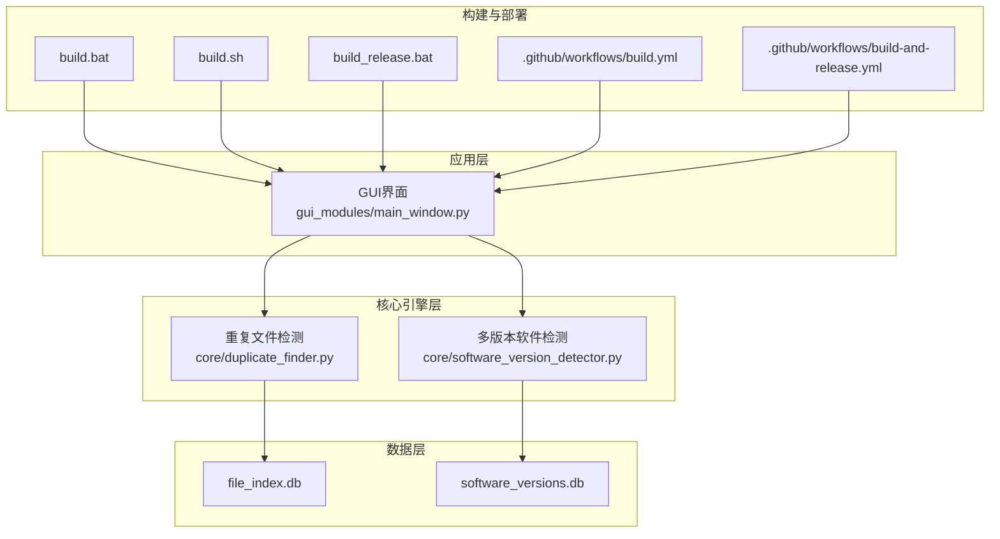
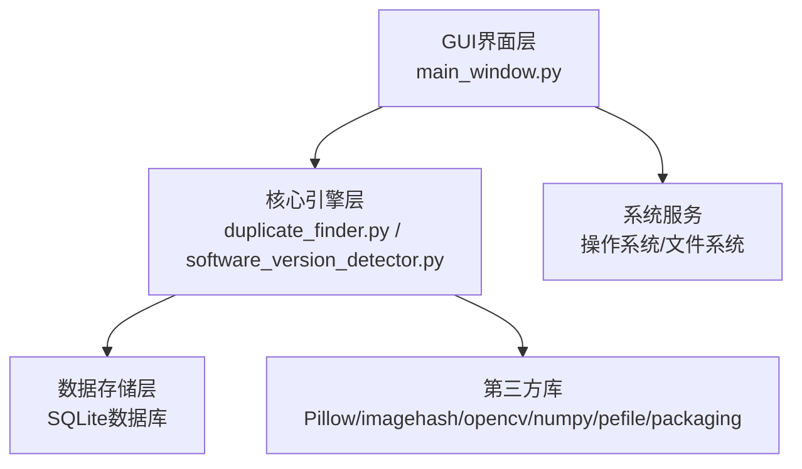
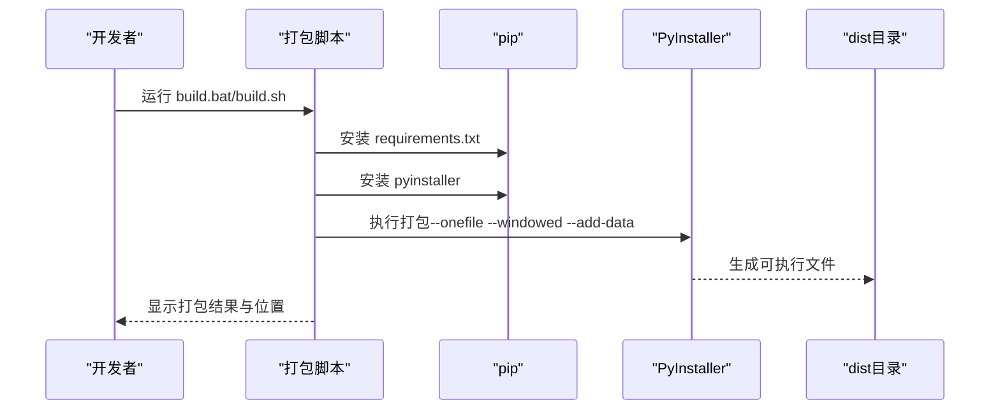
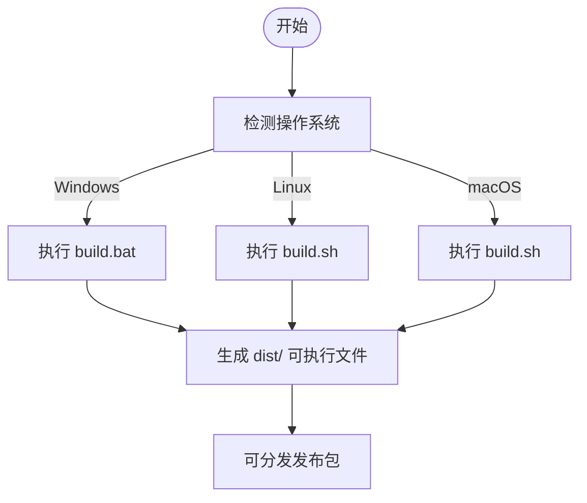
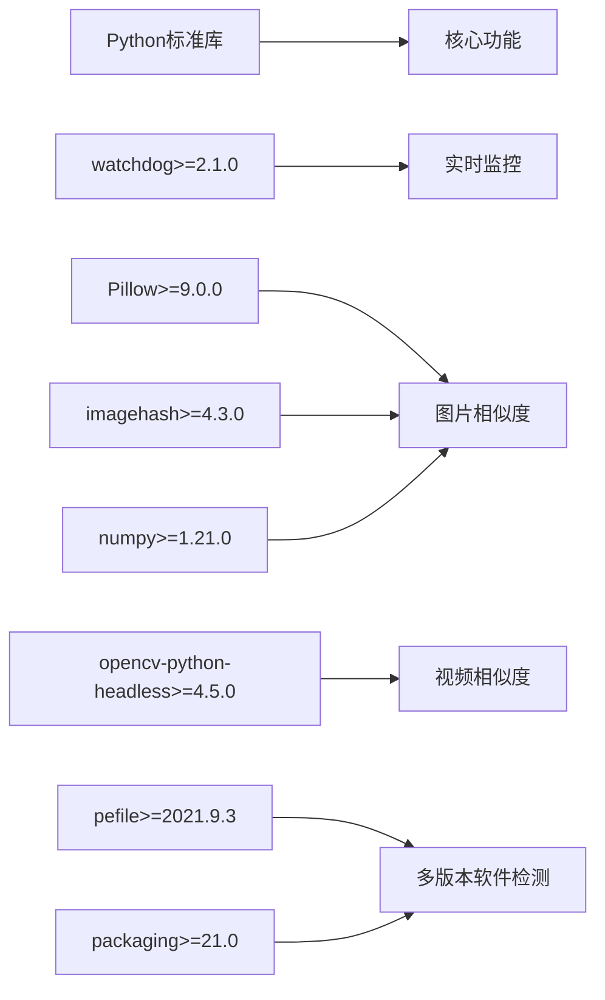

# 配置与部署

<cite>
**本文引用的文件**
- [README.md](file://README.md)
- [QUICK_START.md](file://QUICK_START.md)
- [requirements.txt](file://requirements.txt)
- [run_gui.py](file://run_gui.py)
- [build.bat](file://build.bat)
- [build.sh](file://build.sh)
- [build_release.bat](file://build_release.bat)
- [start.bat](file://start.bat)
- [.github/workflows/build.yml](file://.github/workflows/build.yml)
- [.github/workflows/build-and-release.yml](file://.github/workflows/build-and-release.yml)
- [core/duplicate_finder.py](file://core/duplicate_finder.py)
- [core/software_version_detector.py](file://core/software_version_detector.py)
- [gui_modules/main_window.py](file://gui_modules/main_window.py)
</cite>

## 目录
1. [简介](#简介)
2. [项目结构](#项目结构)
3. [核心组件](#核心组件)
4. [架构概览](#架构概览)
5. [详细组件分析](#详细组件分析)
6. [依赖分析](#依赖分析)
7. [性能考虑](#性能考虑)
8. [故障排除指南](#故障排除指南)
9. [结论](#结论)
10. [附录](#附录)

## 简介
本指南面向运维与开发人员，提供完整的配置与部署方案，涵盖环境配置、依赖管理、性能调优参数、可执行文件打包、跨平台部署策略、自动化部署脚本使用、生产环境最佳实践、安全配置与监控建议，以及故障排除与维护操作指导。

## 项目结构
项目采用模块化分层组织：
- 核心引擎层：位于 core/，包含重复文件检测、图片/视频相似度检测、多版本软件检测等引擎模块
- GUI界面层：位于 gui_modules/，包含主窗口与各功能标签页
- 文档与配置：根目录包含安装与使用说明、依赖清单、打包脚本与CI/CD工作流
- 自动化构建：提供Windows/Linux/macOS一键打包脚本与GitHub Actions工作流

**图表来源**
- [gui_modules/main_window.py:1-245](file://gui_modules/main_window.py#L1-L245)
- [core/duplicate_finder.py:1-588](file://core/duplicate_finder.py#L1-L588)
- [core/software_version_detector.py:1-738](file://core/software_version_detector.py#L1-L738)
- [build.bat:1-121](file://build.bat#L1-L121)
- [build.sh:1-113](file://build.sh#L1-L113)
- [build_release.bat:1-131](file://build_release.bat#L1-L131)
- [.github/workflows/build.yml:1-186](file://.github/workflows/build.yml#L1-L186)
- [.github/workflows/build-and-release.yml:1-115](file://.github/workflows/build-and-release.yml#L1-L115)

**章节来源**
- [README.md:338-401](file://README.md#L338-L401)
- [QUICK_START.md:1-191](file://QUICK_START.md#L1-L191)

## 核心组件
- GUI启动入口：run_gui.py 负责导入GUI模块并启动主窗口
- 重复文件检测引擎：DuplicateFinder 类提供多级哈希与并行处理
- 多版本软件检测引擎：SoftwareVersionDetector 类提供PE元数据提取与版本比较
- 打包脚本：Windows/Linux/macOS一键打包，支持PyInstaller与隐藏导入
- CI/CD工作流：GitHub Actions自动构建Windows/Linux/macOS可执行文件并发布

**章节来源**
- [run_gui.py:1-42](file://run_gui.py#L1-L42)
- [core/duplicate_finder.py:22-55](file://core/duplicate_finder.py#L22-L55)
- [core/software_version_detector.py:30-96](file://core/software_version_detector.py#L30-L96)
- [build.bat:81-94](file://build.bat#L81-L94)
- [build.sh:76-86](file://build.sh#L76-L86)
- [.github/workflows/build.yml:29-40](file://.github/workflows/build.yml#L29-L40)

## 架构概览
系统采用“GUI界面层-核心引擎层-数据存储层”的三层架构，结合SQLite数据库与多进程/线程并行处理，实现高性能与可扩展性。

**图表来源**
- [gui_modules/main_window.py:1-245](file://gui_modules/main_window.py#L1-L245)
- [core/duplicate_finder.py:1-588](file://core/duplicate_finder.py#L1-L588)
- [core/software_version_detector.py:1-738](file://core/software_version_detector.py#L1-L738)
- [requirements.txt:1-32](file://requirements.txt#L1-L32)

## 详细组件分析

### 环境配置与依赖管理
- Python环境要求：Python 3.6+（推荐3.10）
- 虚拟环境：建议使用 venv 创建隔离环境
- 依赖安装：pip install -r requirements.txt
- 可选依赖：watchdog（实时监控）、numpy/tqdm（可选优化）

**章节来源**
- [README.md:202-256](file://README.md#L202-L256)
- [requirements.txt:1-32](file://requirements.txt#L1-L32)

### 性能调优参数
- 重复文件检测（v1）：线程数根据存储介质选择（HDD: 4-8，SSD: 8-16），块大小默认64KB
- 图片相似度检测（v2）：阈值12（平衡模式），建议使用精确模式；增量扫描提升效率
- 视频相似度检测（v3）：阈值0.7，最小视频时长10秒，自动采样策略
- 多版本软件检测（v4）：PE元数据+智能识别+语义化版本比较，支持格式过滤

**章节来源**
- [README.md:311-336](file://README.md#L311-L336)
- [core/duplicate_finder.py:25-54](file://core/duplicate_finder.py#L25-L54)

### 可执行文件打包流程
- Windows：build.bat 自动检测Python、安装依赖与PyInstaller、清理旧构建、执行打包、隐藏导入PIL/imagehash/cv2/numpy/pefile/packaging
- Linux/macOS：build.sh 类似流程，使用 --add-data "core:core" 等参数
- 发布版：build_release.bat 增加 --noupx 与固定版本命名，生成 release/ 包含exe、文档与说明

**图表来源**
- [build.bat:46-101](file://build.bat#L46-L101)
- [build.sh:53-91](file://build.sh#L53-L91)
- [build_release.bat:69-90](file://build_release.bat#L69-L90)

**章节来源**
- [README.md:258-276](file://README.md#L258-L276)
- [build.bat:1-121](file://build.bat#L1-L121)
- [build.sh:1-113](file://build.sh#L1-L113)
- [build_release.bat:1-131](file://build_release.bat#L1-L131)

### 跨平台部署策略
- Windows：双击 build.bat 或使用 start.bat 启动GUI（需先激活虚拟环境）
- Linux/macOS：chmod +x build.sh 后 ./build.sh 打包；首次运行可能稍慢
- CI/CD：GitHub Actions自动构建Windows/Linux/macOS版本，支持发布到Release

**图表来源**
- [build.bat:1-121](file://build.bat#L1-L121)
- [build.sh:1-113](file://build.sh#L1-L113)
- [.github/workflows/build.yml:10-67](file://.github/workflows/build.yml#L10-L67)

**章节来源**
- [start.bat:1-38](file://start.bat#L1-L38)
- [.github/workflows/build.yml:1-186](file://.github/workflows/build.yml#L1-L186)

### 自动化部署脚本使用
- build.bat：Windows一键打包，自动安装依赖与PyInstaller，隐藏导入必要模块
- build.sh：Linux/macOS一键打包，支持彩色输出与自动打开dist目录
- build_release.bat：生成最终发布包，包含exe、README与docs
- start.bat：激活虚拟环境并启动GUI（Windows）

**章节来源**
- [build.bat:1-121](file://build.bat#L1-L121)
- [build.sh:1-113](file://build.sh#L1-L113)
- [build_release.bat:1-131](file://build_release.bat#L1-L131)
- [start.bat:1-38](file://start.bat#L1-L38)

### 生产环境部署最佳实践
- 环境隔离：始终使用虚拟环境，避免全局污染
- 依赖锁定：使用 requirements.txt 固定版本，CI中启用pip缓存
- 数据库优化：SQLite使用WAL模式、内存映射与索引，定期VACUUM
- 扫描策略：优先使用增量扫描，合理设置阈值与线程数
- 安全配置：限制扫描目录权限，避免敏感路径；打包时禁用UPX以减少兼容性问题
- 监控建议：记录扫描日志与进度回调，监控磁盘与CPU使用情况

**章节来源**
- [requirements.txt:1-32](file://requirements.txt#L1-L32)
- [core/duplicate_finder.py:56-94](file://core/duplicate_finder.py#L56-L94)
- [README.md:544-561](file://README.md#L544-L561)
- [.github/workflows/build-and-release.yml:28-48](file://.github/workflows/build-and-release.yml#L28-L48)

## 依赖分析
项目依赖分为基础与可选两类：
- 基础依赖：Python标准库（无需安装）
- 可选依赖：watchdog（实时监控）、Pillow/imagehash（图片相似度）、opencv-python-headless（视频相似度）、numpy（可选优化）、pefile/packaging（多版本软件检测）

**图表来源**
- [requirements.txt:1-32](file://requirements.txt#L1-L32)

**章节来源**
- [requirements.txt:1-32](file://requirements.txt#L1-L32)

## 性能考虑
- I/O密集型优化：线程数=CPU核心数×2，最大16线程；批量插入数据库减少事务开销
- 数据库优化：WAL模式、内存映射、索引、缓存大小与同步策略
- 并行处理：ThreadPoolExecutor并行计算部分/完整哈希，减少进度更新频率提升性能
- 存储介质：SSD显著提升扫描速度；HDD建议适当降低线程数
- 增量扫描：避免重复索引，提升日常维护效率

**章节来源**
- [core/duplicate_finder.py:32-38](file://core/duplicate_finder.py#L32-L38)
- [core/duplicate_finder.py:56-94](file://core/duplicate_finder.py#L56-L94)
- [README.md:535-542](file://README.md#L535-L542)

## 故障排除指南
- 无法导入模块：检查依赖安装与Python路径；run_gui.py提供导入异常提示
- 打包失败：确认Python与pip可用，PyInstaller安装成功；检查隐藏导入与add-data参数
- 首次运行缓慢：打包后首次运行或冷启动可能较慢，属正常现象
- 数据库过大：执行VACUUM清理；定期清理历史数据
- 权限问题：确保对扫描目录有读取权限；忽略符号链接与隐藏目录
- CI构建失败：检查GitHub Actions工作流中的Python版本与依赖安装步骤

**章节来源**
- [run_gui.py:27-37](file://run_gui.py#L27-L37)
- [build.bat:46-64](file://build.bat#L46-L64)
- [README.md:544-561](file://README.md#L544-L561)
- [.github/workflows/build.yml:14-67](file://.github/workflows/build.yml#L14-L67)

## 结论
通过标准化的环境配置、明确的依赖管理、可调的性能参数、完善的打包与跨平台部署策略，以及CI/CD自动化流水线，本项目可在多种环境中稳定运行并持续交付高质量的可执行文件。建议在生产环境中遵循最佳实践，强化安全与监控，并结合增量扫描与数据库优化策略，确保长期可维护性与高性能。

## 附录
- 快速开始：参见 QUICK_START.md 的使用教程与实用技巧
- 详细功能：参见 README.md 的功能对比与参数调优建议
- 打包与发布：参见 build*.bat/sh 与 GitHub Actions 工作流

**章节来源**
- [QUICK_START.md:1-191](file://QUICK_START.md#L1-L191)
- [README.md:280-336](file://README.md#L280-L336)
- [.github/workflows/build.yml:1-186](file://.github/workflows/build.yml#L1-L186)
- [.github/workflows/build-and-release.yml:1-115](file://.github/workflows/build-and-release.yml#L1-L115)