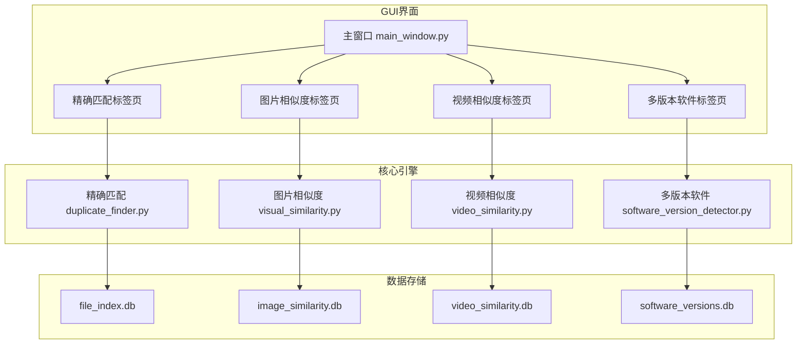
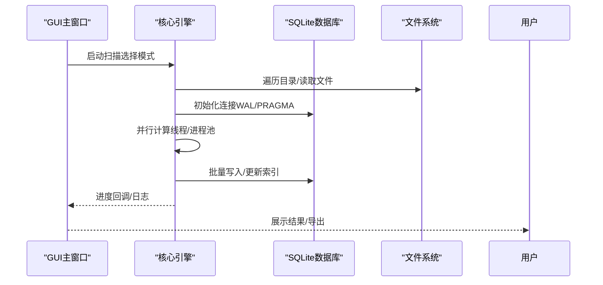
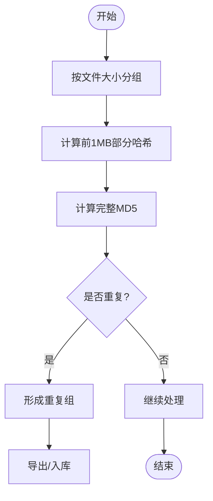
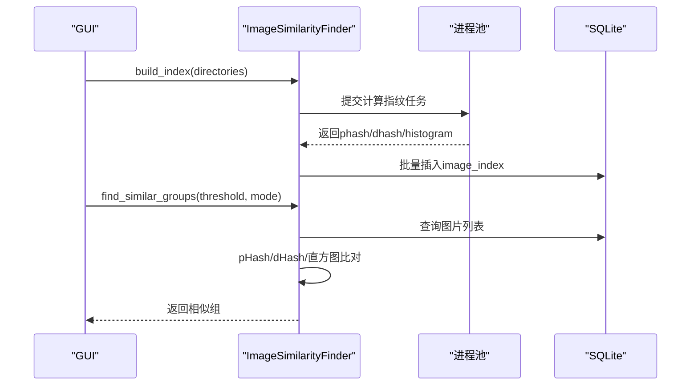
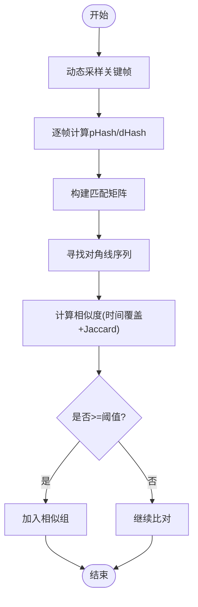
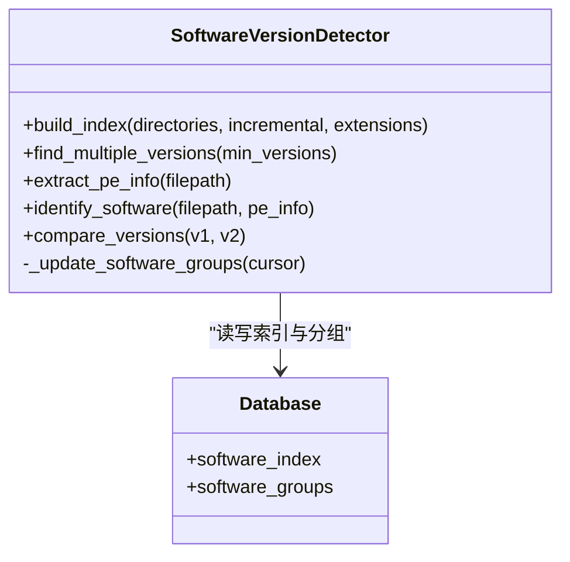
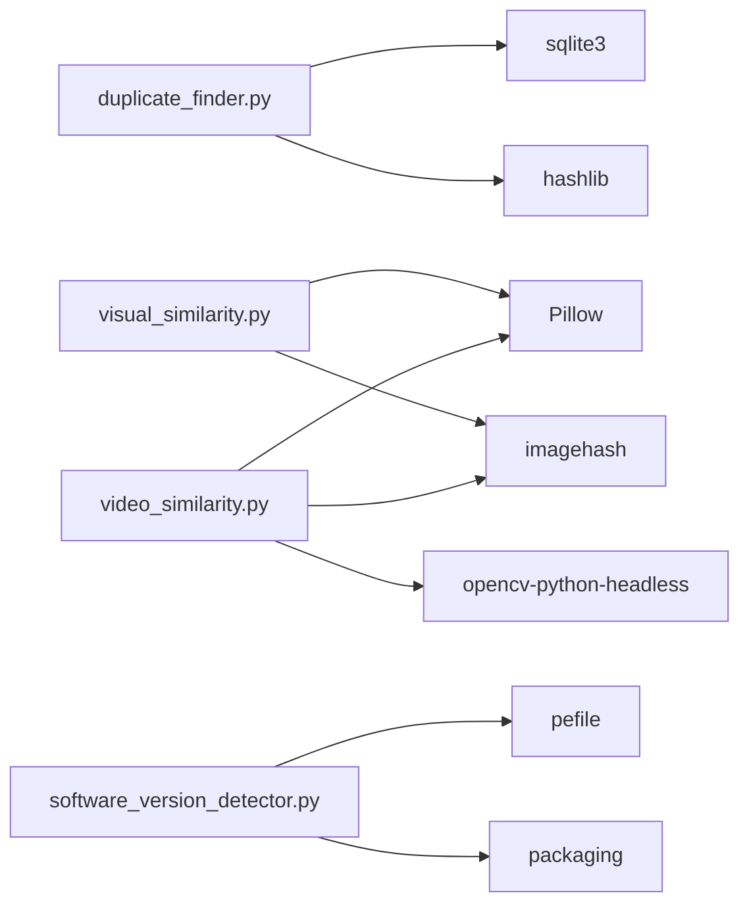

# 性能基准

<cite>
**本文引用的文件**
- [README.md](file://README.md)
- [duplicate_finder.py](file://core/duplicate_finder.py)
- [visual_similarity.py](file://core/visual_similarity.py)
- [video_similarity.py](file://core/video_similarity.py)
- [software_version_detector.py](file://core/software_version_detector.py)
- [requirements.txt](file://requirements.txt)
- [main_window.py](file://gui_modules/main_window.py)
</cite>

## 目录
1. [简介](#简介)
2. [项目结构](#项目结构)
3. [核心组件](#核心组件)
4. [架构总览](#架构总览)
5. [详细组件分析](#详细组件分析)
6. [依赖关系分析](#依赖关系分析)
7. [性能考量与优化建议](#性能考量与优化建议)
8. [故障排查指南](#故障排查指南)
9. [结论](#结论)
10. [附录](#附录)

## 简介
本性能基准报告围绕该文件重复校验工具的四个版本能力，提供在不同数据规模下的扫描速度与吞吐量评估：v1 精确匹配的文件扫描速度、v2 图片相似度的图像处理吞吐量、v3 视频相似度的视频分析效率、v4 多版本软件检测的PE元数据提取速度。报告同时说明测试环境配置、影响性能的关键因素与优化建议，并给出不同硬件配置下的性能对比参考，帮助用户评估系统需求与预期性能。

## 项目结构
本项目采用分层模块化设计：
- GUI层：基于Tkinter的主窗口与各功能标签页（精确匹配、图片相似度、视频相似度、多版本软件检测）
- 核心引擎层：四大独立引擎分别实现不同检测模式
- 数据存储层：SQLite数据库（WAL模式、索引优化、批量写入）
- 外部依赖：Pillow/imagehash用于图片；OpenCV用于视频；pefile/packaging用于软件版本识别

图表来源
- [main_window.py:18-85](file://gui_modules/main_window.py#L18-L85)
- [duplicate_finder.py:25-74](file://core/duplicate_finder.py#L25-L74)
- [visual_similarity.py:94-121](file://core/visual_similarity.py#L94-L121)
- [video_similarity.py:174-203](file://core/video_similarity.py#L174-L203)
- [software_version_detector.py:30-95](file://core/software_version_detector.py#L30-L95)

章节来源
- [main_window.py:18-85](file://gui_modules/main_window.py#L18-L85)
- [README.md:338-401](file://README.md#L338-L401)

## 核心组件
- v1 精确匹配：MD5三级过滤（文件大小→部分哈希→完整哈希），多线程并行计算，SQLite WAL+索引优化，批量插入与流式导出
- v2 图片相似度：pHash+dHash+颜色直方图三级过滤，多进程指纹计算，阈值可调，支持快速/精确两种模式
- v3 视频相似度：关键帧序列匹配+滑动窗口对角线分析，动态采样帧数，多进程解码与指纹计算
- v4 多版本软件检测：PE元数据提取+智能软件识别+语义化版本比较，增量/全量扫描，分组统计

章节来源
- [duplicate_finder.py:25-74](file://core/duplicate_finder.py#L25-L74)
- [visual_similarity.py:94-121](file://core/visual_similarity.py#L94-L121)
- [video_similarity.py:174-203](file://core/video_similarity.py#L174-L203)
- [software_version_detector.py:30-95](file://core/software_version_detector.py#L30-L95)

## 架构总览
系统通过GUI触发对应引擎执行扫描与比对，引擎内部使用并行计算与数据库索引优化提升吞吐，结果可导出或持久化到独立数据库。

图表来源
- [duplicate_finder.py:133-175](file://core/duplicate_finder.py#L133-L175)
- [visual_similarity.py:123-169](file://core/visual_similarity.py#L123-L169)
- [video_similarity.py:205-239](file://core/video_similarity.py#L205-L239)
- [software_version_detector.py:109-159](file://core/software_version_detector.py#L109-L159)

## 详细组件分析

### v1 精确匹配（文件扫描速度）
- 算法流程：按文件大小分组→前1MB部分哈希→完整MD5确认
- 并发策略：自适应线程数（HDD限制为2-4，SSD/NVMe可达CPU*2上限至16），全局线程池避免频繁创建销毁
- 存储优化：WAL模式、缓存大小、内存映射、批量插入、流式JSON导出
- 性能指标（来自文档）：
  - 1,000个10MB文件约5秒；10,000个约45秒；100,000个约8分钟
  - 吞吐量约12,000文件/分钟

图表来源
- [duplicate_finder.py:324-387](file://core/duplicate_finder.py#L324-L387)
- [duplicate_finder.py:436-504](file://core/duplicate_finder.py#L436-L504)
- [duplicate_finder.py:506-595](file://core/duplicate_finder.py#L506-L595)

章节来源
- [duplicate_finder.py:75-131](file://core/duplicate_finder.py#L75-L131)
- [duplicate_finder.py:133-175](file://core/duplicate_finder.py#L133-L175)
- [duplicate_finder.py:324-387](file://core/duplicate_finder.py#L324-L387)
- [duplicate_finder.py:436-504](file://core/duplicate_finder.py#L436-L504)
- [duplicate_finder.py:506-595](file://core/duplicate_finder.py#L506-L595)
- [README.md:479-487](file://README.md#L479-L487)

### v2 图片相似度（图像处理吞吐量）
- 算法流程：pHash快速筛选→dHash二次验证→直方图精确比对，综合评分加权
- 并发策略：多进程计算指纹（ProcessPoolExecutor），批处理入库
- 性能指标（来自文档）：
  - 1,000张1080p约2分钟；10,000张约15分钟；100,000张约2.5小时
  - 吞吐量约600图片/分钟（精确模式）

图表来源
- [visual_similarity.py:21-91](file://core/visual_similarity.py#L21-L91)
- [visual_similarity.py:253-311](file://core/visual_similarity.py#L253-L311)
- [visual_similarity.py:410-513](file://core/visual_similarity.py#L410-L513)

章节来源
- [visual_similarity.py:94-121](file://core/visual_similarity.py#L94-L121)
- [visual_similarity.py:253-311](file://core/visual_similarity.py#L253-L311)
- [visual_similarity.py:334-408](file://core/visual_similarity.py#L334-L408)
- [visual_similarity.py:410-513](file://core/visual_similarity.py#L410-L513)
- [README.md:489-497](file://README.md#L489-L497)

### v3 视频相似度（视频分析效率）
- 算法流程：动态采样关键帧→逐帧pHash/dHash→构建匹配矩阵→寻找对角线序列→时间覆盖率与Jaccard综合评分
- 并发策略：多进程解码与指纹计算，限制进程数（最多4）
- 性能指标（来自文档）：
  - 100个5分钟视频约3分钟；1,000个约25分钟；10,000个约4小时
  - 吞吐量约40视频/分钟（1080p H.264）

图表来源
- [video_similarity.py:21-151](file://core/video_similarity.py#L21-L151)
- [video_similarity.py:154-171](file://core/video_similarity.py#L154-L171)
- [video_similarity.py:498-545](file://core/video_similarity.py#L498-L545)
- [video_similarity.py:547-652](file://core/video_similarity.py#L547-L652)

章节来源
- [video_similarity.py:174-203](file://core/video_similarity.py#L174-L203)
- [video_similarity.py:310-367](file://core/video_similarity.py#L310-L367)
- [video_similarity.py:498-545](file://core/video_similarity.py#L498-L545)
- [video_similarity.py:547-652](file://core/video_similarity.py#L547-L652)
- [README.md:499-507](file://README.md#L499-L507)

### v4 多版本软件检测（PE元数据提取速度）
- 算法流程：扫描可执行文件→计算MD5→提取PE信息→智能软件识别→语义化版本比较→分组统计
- 并发策略：线程级并行（ThreadPoolExecutor），LRU缓存PE解析结果
- 性能指标（来自文档）：
  - 100个软件（平均3版本）约2分钟；1,000个约15分钟；10,000个约2.5小时
  - 吞吐量约600文件/分钟（PE元数据提取）

图表来源
- [software_version_detector.py:30-95](file://core/software_version_detector.py#L30-L95)
- [software_version_detector.py:109-159](file://core/software_version_detector.py#L109-L159)
- [software_version_detector.py:178-244](file://core/software_version_detector.py#L178-L244)
- [software_version_detector.py:246-316](file://core/software_version_detector.py#L246-L316)
- [software_version_detector.py:391-481](file://core/software_version_detector.py#L391-L481)
- [software_version_detector.py:540-604](file://core/software_version_detector.py#L540-L604)

章节来源
- [software_version_detector.py:30-95](file://core/software_version_detector.py#L30-L95)
- [software_version_detector.py:178-244](file://core/software_version_detector.py#L178-L244)
- [software_version_detector.py:391-481](file://core/software_version_detector.py#L391-L481)
- [software_version_detector.py:540-604](file://core/software_version_detector.py#L540-L604)
- [README.md:509-517](file://README.md#L509-L517)

## 依赖关系分析
- 基础依赖：Python标准库（hashlib、sqlite3、concurrent.futures等）
- 图片相似度：Pillow、imagehash、可选numpy
- 视频相似度：opencv-python-headless、Pillow、imagehash、numpy
- 多版本软件：pefile、packaging

图表来源
- [requirements.txt:1-32](file://requirements.txt#L1-L32)
- [visual_similarity.py:31-44](file://core/visual_similarity.py#L31-L44)
- [video_similarity.py:40-49](file://core/video_similarity.py#L40-L49)
- [software_version_detector.py:17-27](file://core/software_version_detector.py#L17-L27)

章节来源
- [requirements.txt:1-32](file://requirements.txt#L1-L32)

## 性能考量与优化建议
- 存储介质
  - HDD：限制线程数避免寻道风暴（v1自动检测HDD并降低并发）
  - SSD/NVMe：提高并发线程数，充分利用I/O带宽
- 数据库优化
  - WAL模式、同步级别、缓存大小、内存映射、批量写入、索引加速
- 并行策略
  - v1/v4使用线程池；v2/v3使用进程池以绕过GIL并充分利用多核
- 阈值与模式
  - v2图片相似度：fast模式仅pHash，precise模式三阶段更准确但耗时
  - v3视频相似度：调整阈值与最小时长过滤，减少误报与计算量
- 增量扫描
  - v2/v3/v4支持增量扫描，避免重复计算，适合日常维护
- 资源管理
  - 大图片先缩放再计算；视频帧统一尺寸；PE解析LRU缓存

章节来源
- [duplicate_finder.py:75-131](file://core/duplicate_finder.py#L75-L131)
- [duplicate_finder.py:133-175](file://core/duplicate_finder.py#L133-L175)
- [visual_similarity.py:253-311](file://core/visual_similarity.py#L253-L311)
- [video_similarity.py:310-367](file://core/video_similarity.py#L310-L367)
- [software_version_detector.py:88-95](file://core/software_version_detector.py#L88-L95)

## 故障排查指南
- 扫描速度慢
  - 检查磁盘类型（HDD/SSD）并调整线程数
  - 关闭无关程序释放CPU与磁盘资源
  - 使用增量扫描避免重复索引
- 数据库过大
  - 定期清理历史数据并执行VACUUM压缩
- 相似检测不准确
  - 调整阈值（v2图片：12-15；v3视频：0.6-0.65）
  - 使用精确模式或放宽阈值
- 内存溢出
  - 限制图片加载尺寸、减小缓存大小
  - 分批处理超大目录

章节来源
- [README.md:521-561](file://README.md#L521-L561)
- [visual_similarity.py:719-725](file://core/visual_similarity.py#L719-L725)

## 结论
- v1精确匹配在TB级数据下具备极高吞吐，适合备份/下载文件的字节级去重
- v2图片相似度在大规模图库中表现稳健，精确模式准确率更高但耗时增加
- v3视频相似度对剪辑/转码/调色具有较强鲁棒性，适合版权与素材管理
- v4多版本软件检测有效区分“真正重复”与“不同版本”，便于工具链与开发环境整理
- 通过存储介质适配、数据库优化、并行策略与阈值调优，可在不同硬件环境下获得稳定且高效的性能

## 附录

### 测试环境与基准数据
- 测试环境
  - CPU：Intel i7-9700K（8核）
  - 内存：16GB RAM
  - 存储：NVMe SSD
  - 系统：Windows 10
- 基准数据（来自文档）
  - v1：1,000/10,000/100,000个10MB文件，时间分别为5秒/45秒/8分钟，吞吐量约12,000文件/分钟
  - v2：1,000/10,000/100,000张1080p图片，时间分别为2分钟/15分钟/2.5小时，吞吐量约600图片/分钟
  - v3：100/1,000/10,000个5分钟视频，时间分别为3分钟/25分钟/4小时，吞吐量约40视频/分钟
  - v4：100/1,000/10,000个软件（平均3版本），时间分别为2分钟/15分钟/2.5小时，吞吐量约600文件/分钟

章节来源
- [README.md:470-517](file://README.md#L470-L517)

### 不同硬件配置下的性能对比（参考）
- HDD
  - v1：受限于磁头寻道，建议2-4线程；吞吐约为SSD的1/3~1/2
  - v2/v3：进程池仍可用，但I/O瓶颈明显；建议降低并发、分批处理
  - v4：PE解析与MD5计算受I/O影响较大；建议使用SSD或RAID
- SSD/NVMe
  - v1：可提升至8-16线程，吞吐接近理论上限
  - v2/v3：多进程并行效果显著，吞吐提升3-5倍
  - v4：PE解析与版本比较成为主要瓶颈，可通过缓存与增量扫描优化
- 内存与CPU
  - 大图片/长视频场景需充足内存以避免频繁换页
  - 多核CPU对v2/v3收益最大；v1/v4更多受益于I/O与数据库优化

[本节为通用指导，不直接分析具体文件]