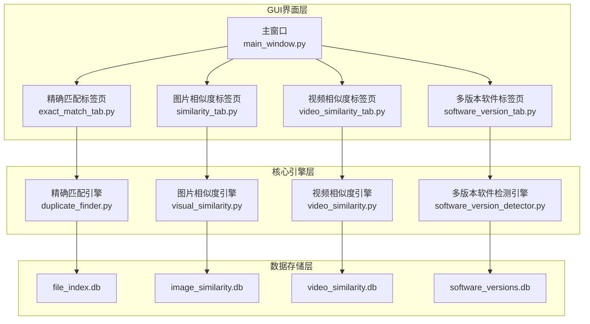
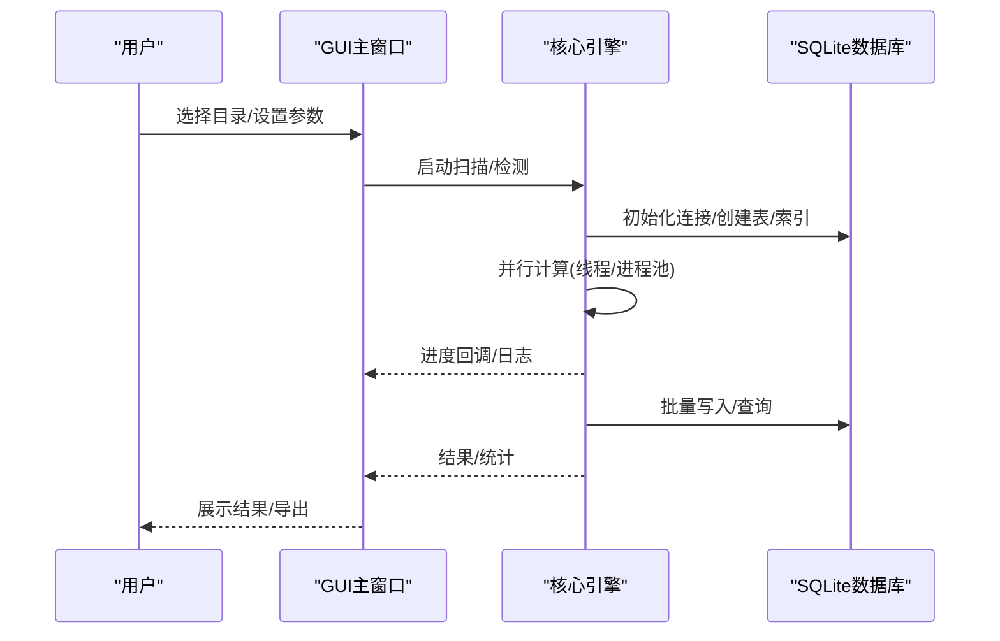
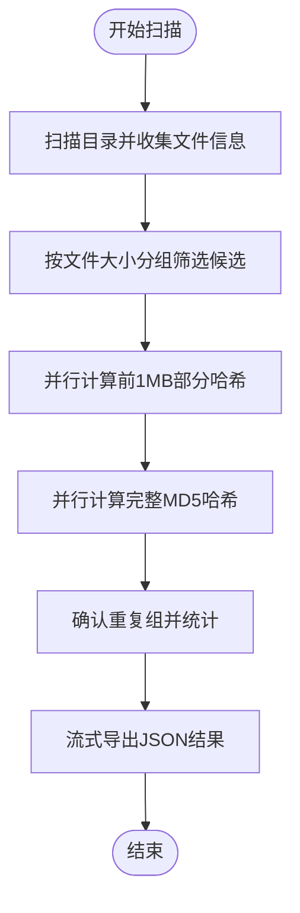
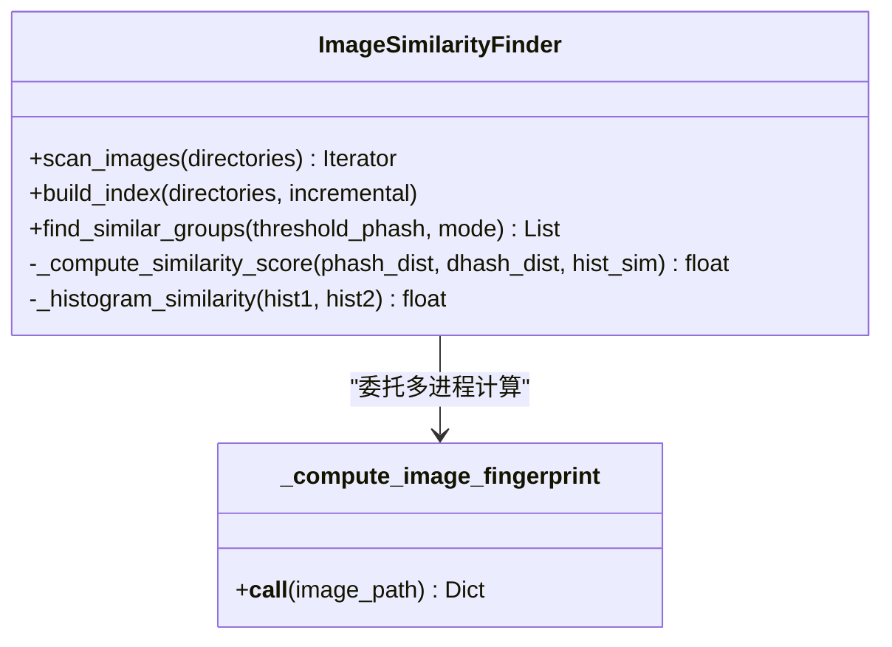
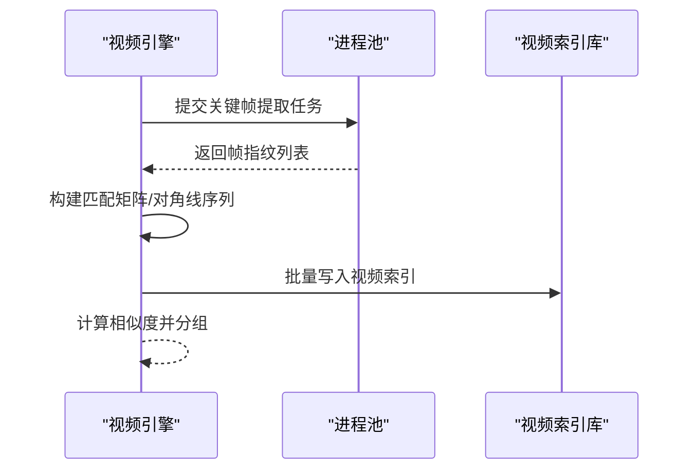
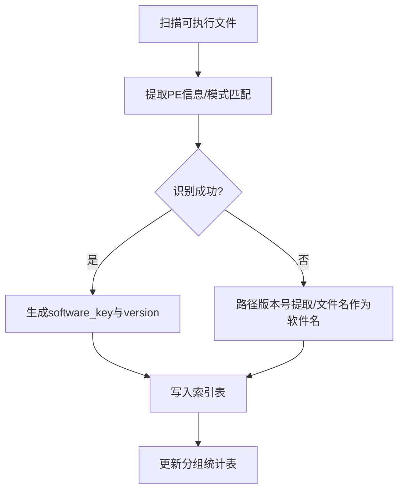
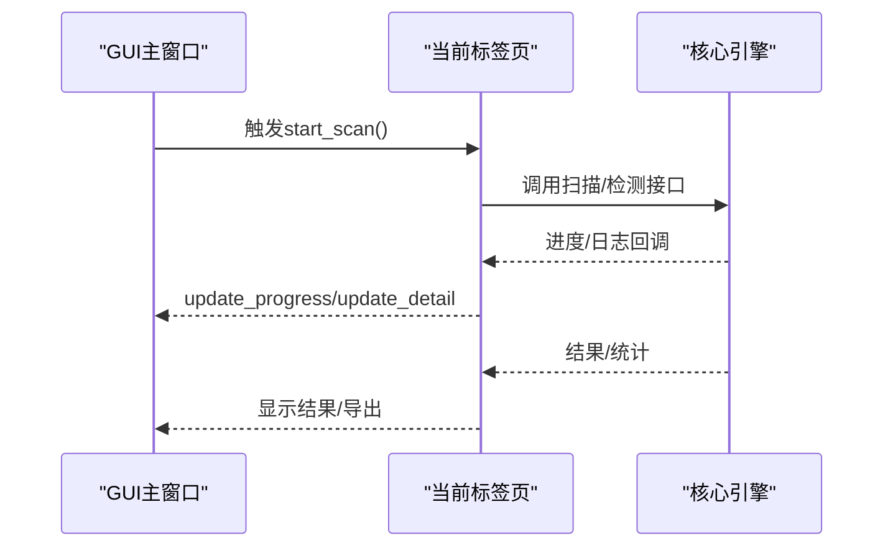
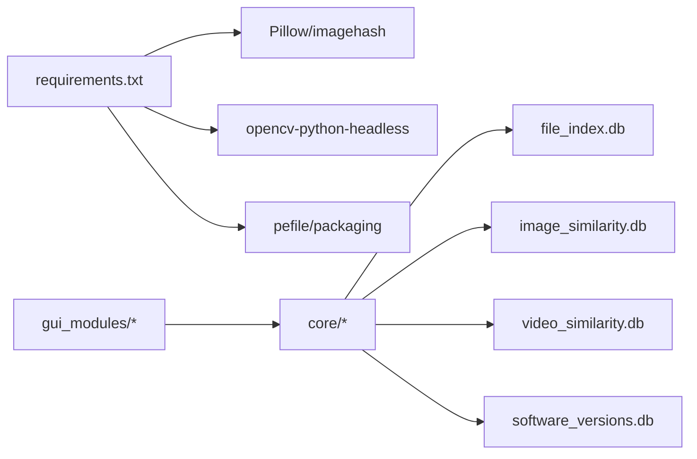

# 技术架构

<cite>
**本文引用的文件**
- [README.md](file://README.md)
- [run_gui.py](file://run_gui.py)
- [core/__init__.py](file://core/__init__.py)
- [gui_modules/__init__.py](file://gui_modules/__init__.py)
- [requirements.txt](file://requirements.txt)
- [core/duplicate_finder.py](file://core/duplicate_finder.py)
- [core/visual_similarity.py](file://core/visual_similarity.py)
- [core/video_similarity.py](file://core/video_similarity.py)
- [core/software_version_detector.py](file://core/software_version_detector.py)
- [gui_modules/main_window.py](file://gui_modules/main_window.py)
- [gui_modules/exact_match_tab.py](file://gui_modules/exact_match_tab.py)
- [gui_modules/similarity_tab.py](file://gui_modules/similarity_tab.py)
- [gui_modules/software_version_tab.py](file://gui_modules/software_version_tab.py)
</cite>

## 目录
1. [简介](#简介)
2. [项目结构](#项目结构)
3. [核心组件](#核心组件)
4. [架构总览](#架构总览)
5. [详细组件分析](#详细组件分析)
6. [依赖关系分析](#依赖关系分析)
7. [性能考量](#性能考量)
8. [故障排查指南](#故障排查指南)
9. [结论](#结论)
10. [附录](#附录)

## 简介
本技术文档面向“文件重复校验工具”的分层架构与关键技术实现，重点说明：
- GUI界面层、核心引擎层、数据存储层的职责分工与交互关系
- 多进程并行计算机制、数据库索引优化策略、懒加载与缓存机制
- 架构优势与权衡（性能、内存、并发）
- 系统架构图与组件关系图，帮助开发者快速理解整体设计

## 项目结构
项目采用清晰的分层组织：
- GUI界面层：基于Tkinter的标签页式界面，负责用户交互、参数配置、进度与日志展示
- 核心引擎层：提供精确匹配、图片相似度、视频相似度、多版本软件检测四大能力
- 数据存储层：SQLite数据库，按功能域分库存储索引与结果，支持WAL模式与索引优化

图表来源
- [gui_modules/main_window.py:62-85](file://gui_modules/main_window.py#L62-L85)
- [core/duplicate_finder.py:133-175](file://core/duplicate_finder.py#L133-L175)
- [core/visual_similarity.py:123-169](file://core/visual_similarity.py#L123-L169)
- [core/video_similarity.py:205-239](file://core/video_similarity.py#L205-L239)
- [core/software_version_detector.py:109-159](file://core/software_version_detector.py#L109-L159)

章节来源
- [README.md:338-401](file://README.md#L338-L401)
- [gui_modules/main_window.py:62-85](file://gui_modules/main_window.py#L62-L85)

## 核心组件
- DuplicateFinder：精确匹配引擎，三级过滤（文件大小→部分哈希→完整哈希），多线程I/O优化，批量写入数据库
- ImageSimilarityFinder：图片相似度引擎，pHash+dHash+直方图三级过滤，多进程指纹计算，增量扫描
- VideoSimilarityFinder：视频相似度引擎，关键帧序列匹配，滑动窗口与对角线序列分析，多进程提取关键帧
- SoftwareVersionDetector：多版本软件检测，PE元数据提取、模式匹配、语义化版本比较，分组统计

章节来源
- [core/duplicate_finder.py:25-74](file://core/duplicate_finder.py#L25-L74)
- [core/visual_similarity.py:94-121](file://core/visual_similarity.py#L94-L121)
- [core/video_similarity.py:174-203](file://core/video_similarity.py#L174-L203)
- [core/software_version_detector.py:30-95](file://core/software_version_detector.py#L30-L95)

## 架构总览
分层职责与交互：
- GUI层：接收用户输入（目录、阈值、模式等），调用对应引擎；通过回调更新进度与日志
- 引擎层：执行扫描、指纹计算、相似度比对、分组统计；使用线程池/进程池提升吞吐
- 数据层：SQLite数据库，WAL模式、PRAGMA优化、索引加速查询；按功能域分库隔离

图表来源
- [run_gui.py:13-37](file://run_gui.py#L13-L37)
- [gui_modules/main_window.py:165-195](file://gui_modules/main_window.py#L165-L195)
- [core/duplicate_finder.py:208-387](file://core/duplicate_finder.py#L208-L387)
- [core/visual_similarity.py:253-311](file://core/visual_similarity.py#L253-L311)
- [core/video_similarity.py:310-367](file://core/video_similarity.py#L310-L367)
- [core/software_version_detector.py:391-481](file://core/software_version_detector.py#L391-L481)

## 详细组件分析

### 精确匹配引擎（DuplicateFinder）
- 多级过滤：先按文件大小分组，再计算前1MB的部分哈希，最后计算完整MD5确认重复
- 并发模型：ThreadPoolExecutor，自动根据磁盘类型调整线程数（HDD限制线程避免寻道风暴）
- 数据库优化：WAL模式、同步频率降低、缓存大小、内存映射、批量插入、索引加速
- 流式导出：JSON结果流式写入，避免大结果集内存峰值

图表来源
- [core/duplicate_finder.py:208-387](file://core/duplicate_finder.py#L208-L387)
- [core/duplicate_finder.py:597-658](file://core/duplicate_finder.py#L597-L658)

章节来源
- [core/duplicate_finder.py:75-131](file://core/duplicate_finder.py#L75-L131)
- [core/duplicate_finder.py:133-175](file://core/duplicate_finder.py#L133-L175)
- [core/duplicate_finder.py:436-504](file://core/duplicate_finder.py#L436-L504)
- [core/duplicate_finder.py:506-595](file://core/duplicate_finder.py#L506-L595)

### 图片相似度引擎（ImageSimilarityFinder）
- 指纹计算：pHash、dHash、颜色直方图；超大图缩放避免内存溢出
- 并行模型：ProcessPoolExecutor多进程计算指纹，避免GIL限制
- 相似度判定：汉明距离阈值筛选，余弦相似度计算直方图，综合评分加权
- 数据库：独立索引表与相似组表，WAL优化，索引加速查询

图表来源
- [core/visual_similarity.py:21-91](file://core/visual_similarity.py#L21-L91)
- [core/visual_similarity.py:94-121](file://core/visual_similarity.py#L94-L121)
- [core/visual_similarity.py:253-311](file://core/visual_similarity.py#L253-L311)
- [core/visual_similarity.py:379-408](file://core/visual_similarity.py#L379-L408)

章节来源
- [core/visual_similarity.py:123-169](file://core/visual_similarity.py#L123-L169)
- [core/visual_similarity.py:410-513](file://core/visual_similarity.py#L410-L513)

### 视频相似度引擎（VideoSimilarityFinder）
- 关键帧采样：根据时长动态确定采样帧数，均匀分布时间点
- 指纹生成：每帧计算pHash/dHash，序列化存储
- 相似度计算：构建匹配矩阵，寻找对角线连续匹配片段，Jaccard与时间覆盖率加权
- 并行模型：ProcessPoolExecutor多进程提取关键帧

图表来源
- [core/video_similarity.py:21-151](file://core/video_similarity.py#L21-L151)
- [core/video_similarity.py:310-367](file://core/video_similarity.py#L310-L367)
- [core/video_similarity.py:498-545](file://core/video_similarity.py#L498-L545)

章节来源
- [core/video_similarity.py:154-171](file://core/video_similarity.py#L154-L171)
- [core/video_similarity.py:547-652](file://core/video_similarity.py#L547-L652)

### 多版本软件检测引擎（SoftwareVersionDetector）
- 识别策略：PE元数据优先，其次文件名模式匹配，最后路径版本号提取
- 版本比较：packaging语义化版本比较，未知版本排序置后
- 数据库：软件索引表与分组统计表，索引加速查询
- 增量扫描：基于文件哈希判断是否重新处理

图表来源
- [core/software_version_detector.py:178-244](file://core/software_version_detector.py#L178-L244)
- [core/software_version_detector.py:246-316](file://core/software_version_detector.py#L246-L316)
- [core/software_version_detector.py:391-481](file://core/software_version_detector.py#L391-L481)

章节来源
- [core/software_version_detector.py:318-354](file://core/software_version_detector.py#L318-L354)
- [core/software_version_detector.py:483-538](file://core/software_version_detector.py#L483-L538)

### GUI界面层
- 主窗口：创建标签页容器，分发操作到各标签页，统一日志与进度更新
- 标签页：精确匹配、图片相似度、视频相似度、多版本软件检测各自封装配置与结果展示
- 交互流程：用户点击“开始扫描”，当前标签页调用对应引擎，回调更新UI

图表来源
- [gui_modules/main_window.py:165-195](file://gui_modules/main_window.py#L165-L195)
- [gui_modules/exact_match_tab.py:115-145](file://gui_modules/exact_match_tab.py#L115-L145)
- [gui_modules/similarity_tab.py:163-187](file://gui_modules/similarity_tab.py#L163-L187)
- [gui_modules/software_version_tab.py:125-149](file://gui_modules/software_version_tab.py#L125-L149)

章节来源
- [gui_modules/main_window.py:22-49](file://gui_modules/main_window.py#L22-L49)
- [gui_modules/exact_match_tab.py:18-41](file://gui_modules/exact_match_tab.py#L18-L41)
- [gui_modules/similarity_tab.py:18-47](file://gui_modules/similarity_tab.py#L18-L47)
- [gui_modules/software_version_tab.py:15-32](file://gui_modules/software_version_tab.py#L15-L32)

## 依赖关系分析
- 运行时依赖：Pillow、imagehash、opencv-python-headless、pefile、packaging等，按需安装
- 模块导入：GUI层导入核心引擎；各引擎内部按需导入第三方库，失败时友好提示
- 数据库隔离：每个引擎维护独立数据库文件，避免耦合

图表来源
- [requirements.txt:10-23](file://requirements.txt#L10-L23)
- [gui_modules/main_window.py:15-19](file://gui_modules/main_window.py#L15-L19)
- [core/visual_similarity.py:31-41](file://core/visual_similarity.py#L31-L41)
- [core/video_similarity.py:40-49](file://core/video_similarity.py#L40-L49)
- [core/software_version_detector.py:17-27](file://core/software_version_detector.py#L17-L27)

章节来源
- [requirements.txt:1-32](file://requirements.txt#L1-L32)
- [core/__init__.py:6-9](file://core/__init__.py#L6-L9)
- [gui_modules/__init__.py:6-10](file://gui_modules/__init__.py#L6-L10)

## 性能考量
- 多进程/多线程并行：
  - 图片/视频指纹计算使用进程池，突破GIL限制，充分利用多核CPU
  - 精确匹配使用线程池进行I/O密集型任务，自动适配磁盘类型调整线程数
- 数据库索引优化：
  - WAL模式、同步频率降低、缓存大小、内存映射提升并发写入与读取性能
  - 针对常用查询字段建立索引（如phash、dhash、size、path等）
- 懒加载与缓存：
  - 图片/视频预览采用懒加载与缩略图缓存，减少内存占用与界面卡顿
  - PE信息LRU缓存，避免重复解析大文件元数据
- 批处理与流式输出：
  - 批量插入数据库减少事务开销
  - JSON结果流式写入，避免大结果集内存峰值

章节来源
- [core/duplicate_finder.py:75-131](file://core/duplicate_finder.py#L75-L131)
- [core/duplicate_finder.py:133-175](file://core/duplicate_finder.py#L133-L175)
- [core/duplicate_finder.py:597-658](file://core/duplicate_finder.py#L597-L658)
- [core/visual_similarity.py:280-311](file://core/visual_similarity.py#L280-L311)
- [core/video_similarity.py:336-367](file://core/video_similarity.py#L336-L367)
- [core/software_version_detector.py:88-95](file://core/software_version_detector.py#L88-L95)

## 故障排查指南
- 依赖缺失：
  - 缺少Pillow/imagehash/opencv/pefile/packaging时，引擎会打印错误并提示安装命令
- 数据库锁冲突：
  - 设置busy_timeout与WAL模式，避免大规模写入时的“database is locked”
- 进度竞态条件：
  - 使用线程锁保护进度计数器，避免多线程下计数丢失
- 文件访问异常：
  - 捕获OSError/PermissionError并记录警告，跳过无法访问的文件
- 视频解码失败：
  - OpenCV打开失败或无关键帧时，记录错误并跳过该视频

章节来源
- [core/visual_similarity.py:31-41](file://core/visual_similarity.py#L31-L41)
- [core/video_similarity.py:40-49](file://core/video_similarity.py#L40-L49)
- [core/duplicate_finder.py:190-201](file://core/duplicate_finder.py#L190-L201)
- [core/duplicate_finder.py:464-474](file://core/duplicate_finder.py#L464-L474)
- [core/duplicate_finder.py:300-302](file://core/duplicate_finder.py#L300-L302)

## 结论
本工具采用清晰的分层架构，将GUI、核心引擎与数据存储解耦，便于扩展与维护。通过多进程/多线程并行、数据库索引优化、懒加载与缓存机制，在TB级数据场景下实现了高性能与高可用性。不同引擎针对不同数据类型设计了专用算法与存储结构，兼顾准确性与效率。建议在大规模部署时结合硬件特性（SSD/HDD）调优线程数，并定期维护数据库以控制体积与性能。

## 附录
- 启动入口：run_gui.py
- 模块包：core与gui_modules分别暴露必要接口
- 依赖管理：requirements.txt集中声明可选依赖

章节来源
- [run_gui.py:13-37](file://run_gui.py#L13-L37)
- [core/__init__.py:6-9](file://core/__init__.py#L6-L9)
- [gui_modules/__init__.py:6-10](file://gui_modules/__init__.py#L6-L10)
- [requirements.txt:10-23](file://requirements.txt#L10-L23)