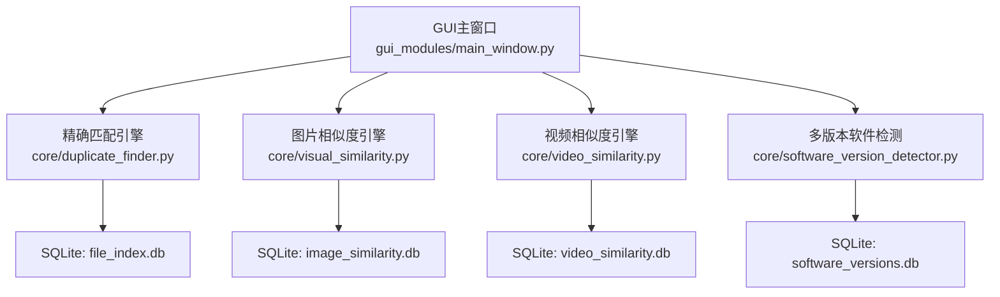
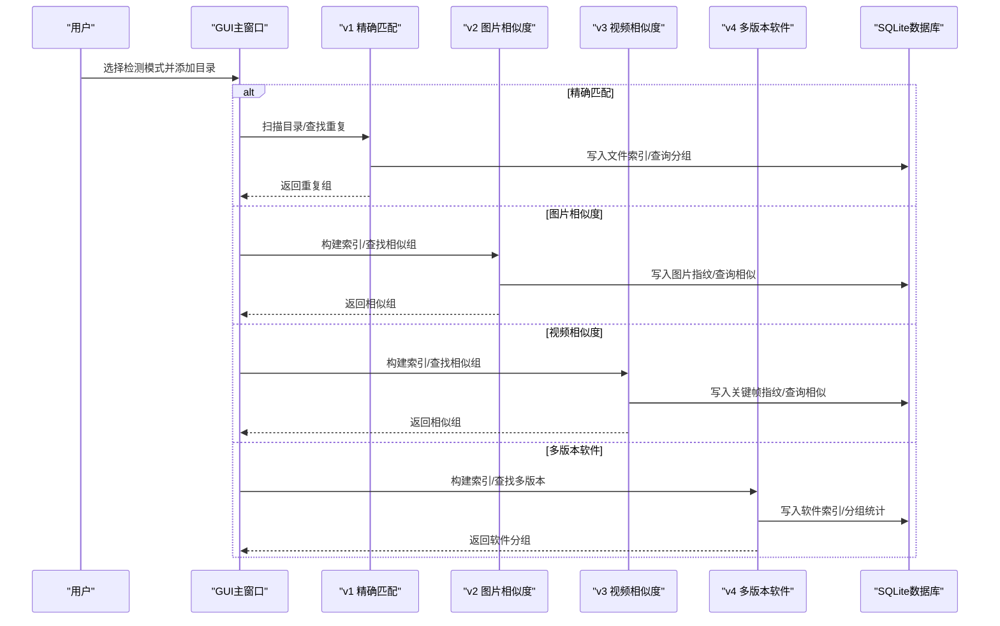
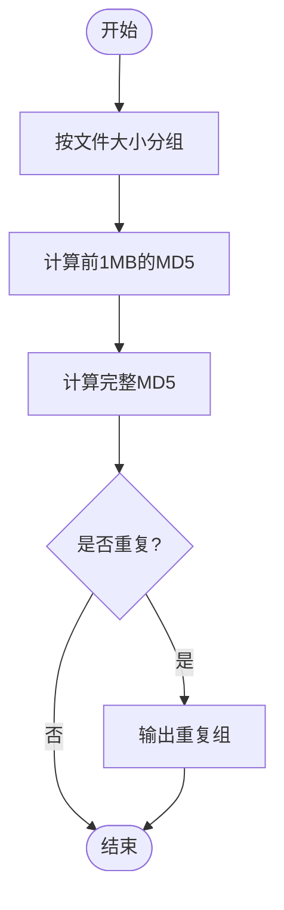
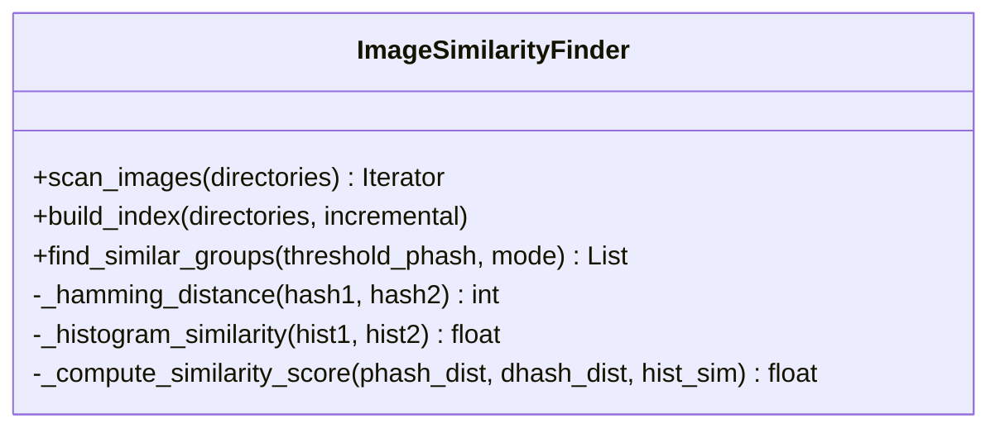
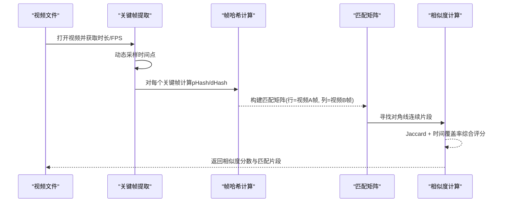
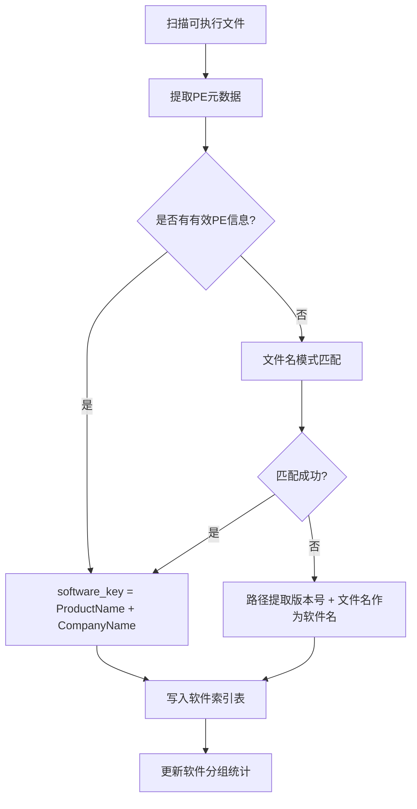
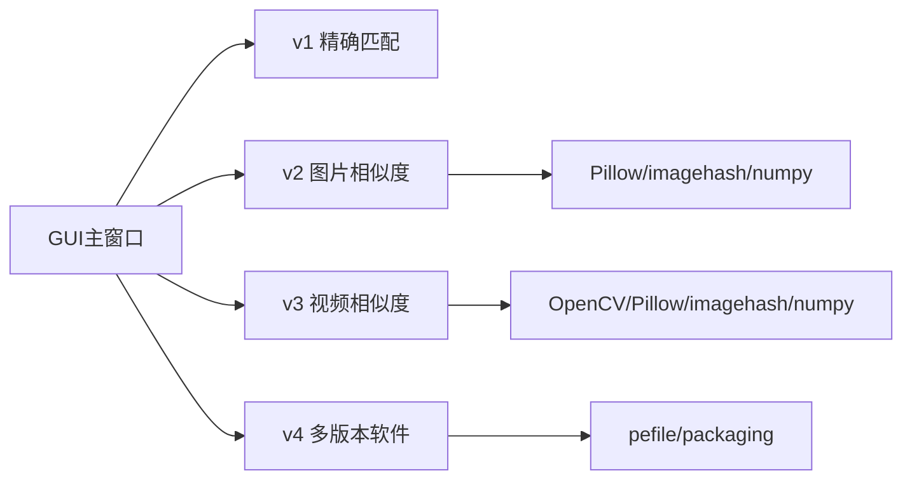

# 核心功能概览

<cite>
**本文引用的文件**
- [README.md](file://README.md)
- [duplicate_finder.py](file://core/duplicate_finder.py)
- [visual_similarity.py](file://core/visual_similarity.py)
- [video_similarity.py](file://core/video_similarity.py)
- [software_version_detector.py](file://core/software_version_detector.py)
- [main_window.py](file://gui_modules/main_window.py)
</cite>

## 目录
1. [简介](#简介)
2. [项目结构](#项目结构)
3. [核心组件](#核心组件)
4. [架构总览](#架构总览)
5. [详细组件分析](#详细组件分析)
6. [依赖关系分析](#依赖关系分析)
7. [性能与适用性对比](#性能与适用性对比)
8. [故障排查指南](#故障排查指南)
9. [结论](#结论)

## 简介
本工具提供四大核心检测能力：v1 精确匹配、v2 图片相似度、v3 视频相似度、v4 多版本软件检测。通过多级过滤与并行计算，面向TB级数据实现高效、高准确率的重复与相似识别，并支持增量索引与结果导出。

## 项目结构
- core：核心引擎模块（四类检测算法）
- gui_modules：图形界面与标签页编排
- 文档与脚本：README、打包与启动脚本

图表来源
- [main_window.py:62-85](file://gui_modules/main_window.py#L62-L85)
- [duplicate_finder.py:133-175](file://core/duplicate_finder.py#L133-L175)
- [visual_similarity.py:123-169](file://core/visual_similarity.py#L123-L169)
- [video_similarity.py:205-239](file://core/video_similarity.py#L205-L239)
- [software_version_detector.py:109-159](file://core/software_version_detector.py#L109-L159)

章节来源
- [main_window.py:62-85](file://gui_modules/main_window.py#L62-L85)
- [README.md:338-401](file://README.md#L338-L401)

## 核心组件
- v1 精确匹配：基于文件大小→部分哈希（前1MB MD5）→完整MD5的三级过滤，多线程并行，WAL模式数据库优化，支持批量写入与流式导出。
- v2 图片相似度：pHash快速筛选→dHash二次验证→颜色直方图余弦相似度，支持快速/精确两种模式，多进程指纹计算与批处理入库。
- v3 视频相似度：关键帧序列匹配（动态采样+每帧pHash/dHash），构建匹配矩阵并寻找对角线连续片段，结合Jaccard与时间覆盖率综合评分。
- v4 多版本软件检测：PE元数据提取（ProductName/CompanyName/FileVersion等），结合文件名/路径模式匹配与语义化版本比较，生成软件分组统计。

章节来源
- [duplicate_finder.py:25-73](file://core/duplicate_finder.py#L25-L73)
- [visual_similarity.py:94-121](file://core/visual_similarity.py#L94-L121)
- [video_similarity.py:174-203](file://core/video_similarity.py#L174-L203)
- [software_version_detector.py:30-95](file://core/software_version_detector.py#L30-L95)

## 架构总览
系统采用“GUI层 → 核心引擎层 → SQLite存储层”的分层架构。各引擎独立维护数据库索引，支持增量扫描与结果导出；GUI负责用户交互与任务调度。

图表来源
- [main_window.py:165-195](file://gui_modules/main_window.py#L165-L195)
- [duplicate_finder.py:208-387](file://core/duplicate_finder.py#L208-L387)
- [visual_similarity.py:253-513](file://core/visual_similarity.py#L253-L513)
- [video_similarity.py:310-652](file://core/video_similarity.py#L310-L652)
- [software_version_detector.py:391-604](file://core/software_version_detector.py#L391-L604)

## 详细组件分析

### v1 精确匹配（MD5三级过滤）
- 设计思路
  - 第一级：按文件大小分组，快速排除不可能重复的文件。
  - 第二级：对候选文件计算前1MB的MD5作为部分哈希，进一步缩小范围。
  - 第三级：对剩余候选计算完整MD5，确认完全相同的文件。
- 技术实现要点
  - 使用SQLite WAL模式与批量插入减少I/O开销。
  - 自适应线程数：根据磁盘类型（HDD/SSD）调整并发度，避免HDD寻道风暴。
  - 进度回调与停止标志支持中断与UI更新。
- 抗修改能力
  - 仅能识别字节级完全一致的文件，不支持任何内容或格式变化。
- 扫描速度与准确率
  - 速度极快（纯哈希计算为主），准确率100%（针对完全相同文件）。
- 适用场景
  - 备份去重、下载文件查重、网盘清理等需要绝对一致的场景。

图表来源
- [duplicate_finder.py:324-387](file://core/duplicate_finder.py#L324-L387)
- [duplicate_finder.py:402-504](file://core/duplicate_finder.py#L402-L504)
- [duplicate_finder.py:506-595](file://core/duplicate_finder.py#L506-L595)

章节来源
- [duplicate_finder.py:25-73](file://core/duplicate_finder.py#L25-L73)
- [duplicate_finder.py:133-175](file://core/duplicate_finder.py#L133-L175)
- [duplicate_finder.py:208-387](file://core/duplicate_finder.py#L208-L387)
- [duplicate_finder.py:402-595](file://core/duplicate_finder.py#L402-L595)

### v2 图片相似度（pHash + dHash + 直方图三级过滤）
- 设计思路
  - 第一级：pHash快速筛选，容忍缩放与轻微失真。
  - 第二级：dHash二次验证，提升区分度。
  - 第三级：RGB颜色直方图余弦相似度，进行精细比对。
  - 综合评分加权：pHash权重更高，兼顾速度与精度。
- 技术实现要点
  - 多进程并行计算指纹，批处理写入数据库。
  - 支持快速模式（仅pHash）与精确模式（pHash+dHash+直方图）。
  - 汉明距离与余弦相似度计算封装为静态方法，便于复用。
- 抗修改能力
  - 抗缩放、压缩质量差异、轻微调色变化。
- 扫描速度与准确率
  - 速度中等（图像解码与特征计算开销较大），准确率约95-99%。
- 适用场景
  - 手机照片去重、设计素材整理、网络图片查重等。

图表来源
- [visual_similarity.py:94-121](file://core/visual_similarity.py#L94-L121)
- [visual_similarity.py:241-332](file://core/visual_similarity.py#L241-L332)
- [visual_similarity.py:334-408](file://core/visual_similarity.py#L334-L408)
- [visual_similarity.py:410-513](file://core/visual_similarity.py#L410-L513)

章节来源
- [visual_similarity.py:94-121](file://core/visual_similarity.py#L94-L121)
- [visual_similarity.py:253-513](file://core/visual_similarity.py#L253-L513)

### v3 视频相似度（关键帧序列匹配）
- 设计思路
  - 动态采样关键帧：根据视频时长决定采样数量，覆盖全片。
  - 逐帧计算pHash/dHash，构建匹配矩阵。
  - 寻找对角线连续匹配片段，结合Jaccard相似度与时间覆盖率综合评分。
- 技术实现要点
  - OpenCV读取视频帧，PIL与imagehash计算感知哈希。
  - 滑动窗口与对角线序列合并，提高鲁棒性。
  - 多进程并行提取关键帧，批处理入库。
- 抗修改能力
  - 抗剪辑、转码、调色变化，适合不同编码与片段裁剪的视频。
- 扫描速度与准确率
  - 速度较慢（视频解码与帧处理开销大），准确率约85-95%。
- 适用场景
  - 视频库去重、版权检测、内容审核、素材管理。

图表来源
- [video_similarity.py:21-151](file://core/video_similarity.py#L21-L151)
- [video_similarity.py:154-172](file://core/video_similarity.py#L154-L172)
- [video_similarity.py:389-545](file://core/video_similarity.py#L389-L545)
- [video_similarity.py:547-652](file://core/video_similarity.py#L547-L652)

章节来源
- [video_similarity.py:174-203](file://core/video_similarity.py#L174-L203)
- [video_similarity.py:310-652](file://core/video_similarity.py#L310-L652)

### v4 多版本软件检测（PE元数据提取）
- 设计思路
  - 优先级1：从PE信息提取ProductName/CompanyName/FileVersion，形成唯一标识software_key。
  - 优先级2：文件名模式匹配（如python、nodejs、java等）。
  - 优先级3：路径中提取版本号，并以文件名作为软件名兜底。
  - 使用packaging进行语义化版本比较，自动排序最新版本与最旧版本。
- 技术实现要点
  - pefile解析PE元数据，LRU缓存减少重复解析。
  - 增量扫描避免重复处理未变更文件。
  - 生成软件分组统计表，便于后续分析与导出。
- 抗修改能力
  - 抗文件名变化与路径变化，依赖PE元数据与模式匹配。
- 扫描速度与准确率
  - 速度中等（PE解析与MD5计算），准确率98%+（对常见软件）。
- 适用场景
  - TB级硬盘中的软件整理、清理旧版本开发工具、保留最新版本。

图表来源
- [software_version_detector.py:178-316](file://core/software_version_detector.py#L178-L316)
- [software_version_detector.py:391-504](file://core/software_version_detector.py#L391-L504)
- [software_version_detector.py:540-604](file://core/software_version_detector.py#L540-L604)

章节来源
- [software_version_detector.py:30-95](file://core/software_version_detector.py#L30-L95)
- [software_version_detector.py:178-316](file://core/software_version_detector.py#L178-L316)
- [software_version_detector.py:391-604](file://core/software_version_detector.py#L391-L604)

## 依赖关系分析
- GUI层依赖四个核心引擎，并通过标签页组织功能入口。
- 各引擎独立维护SQLite数据库，互不耦合，便于扩展与维护。
- 外部依赖：
  - v2：Pillow、imagehash、numpy（可选加速）
  - v3：opencv-python-headless、Pillow、imagehash、numpy
  - v4：pefile、packaging

图表来源
- [main_window.py:18-20](file://gui_modules/main_window.py#L18-L20)
- [requirements.txt:10-23](file://requirements.txt#L10-L23)

章节来源
- [main_window.py:18-20](file://gui_modules/main_window.py#L18-L20)
- [requirements.txt:10-23](file://requirements.txt#L10-L23)

## 性能与适用性对比
- v1 精确匹配
  - 抗修改能力：不支持内容或格式变化
  - 扫描速度：极快
  - 准确率：100%（完全相同文件）
  - 适用场景：备份去重、下载文件查重、网盘清理
- v2 图片相似度
  - 抗修改能力：抗缩放、压缩失真、轻微调色
  - 扫描速度：中等
  - 准确率：95-99%
  - 适用场景：手机照片去重、设计素材整理、网络图片查重
- v3 视频相似度
  - 抗修改能力：抗剪辑、转码、调色
  - 扫描速度：较慢
  - 准确率：85-95%
  - 适用场景：视频库去重、版权检测、内容审核、素材管理
- v4 多版本软件检测
  - 抗修改能力：抗文件名/路径变化
  - 扫描速度：中等
  - 准确率：98%+
  - 适用场景：TB级硬盘软件整理、清理旧版本开发工具、保留最新版本

章节来源
- [README.md:298-337](file://README.md#L298-L337)
- [README.md:470-518](file://README.md#L470-L518)

## 故障排查指南
- 依赖缺失
  - v2/v3/v4涉及第三方库，若缺少将导致导入失败或功能不可用。请根据需求安装对应依赖。
- 数据库锁与并发
  - SQLite默认可能报“database is locked”，已配置WAL与busy_timeout缓解；如遇仍锁，可降低并发或分批处理。
- 视频解码失败
  - 某些视频格式或损坏文件可能导致无法打开，需检查格式支持与文件完整性。
- PE解析失败
  - 非标准编译的可执行文件可能无PE信息，系统将回退到文件名/路径模式匹配。

章节来源
- [duplicate_finder.py:190-201](file://core/duplicate_finder.py#L190-L201)
- [video_similarity.py:40-60](file://core/video_similarity.py#L40-L60)
- [software_version_detector.py:17-27](file://core/software_version_detector.py#L17-L27)

## 结论
- 若追求绝对一致且速度优先，选择v1精确匹配。
- 若处理大量图片且容忍一定变形，选择v2图片相似度。
- 若处理视频且存在剪辑/转码/调色，选择v3视频相似度。
- 若目标是软件版本管理与清理，选择v4多版本软件检测。
- 可根据实际数据规模与硬件条件调整线程数与阈值参数，平衡速度与准确率。