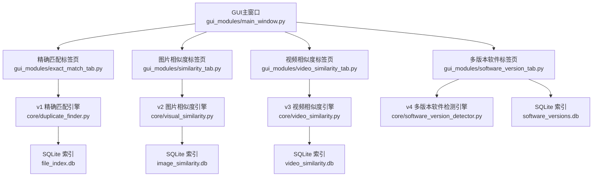
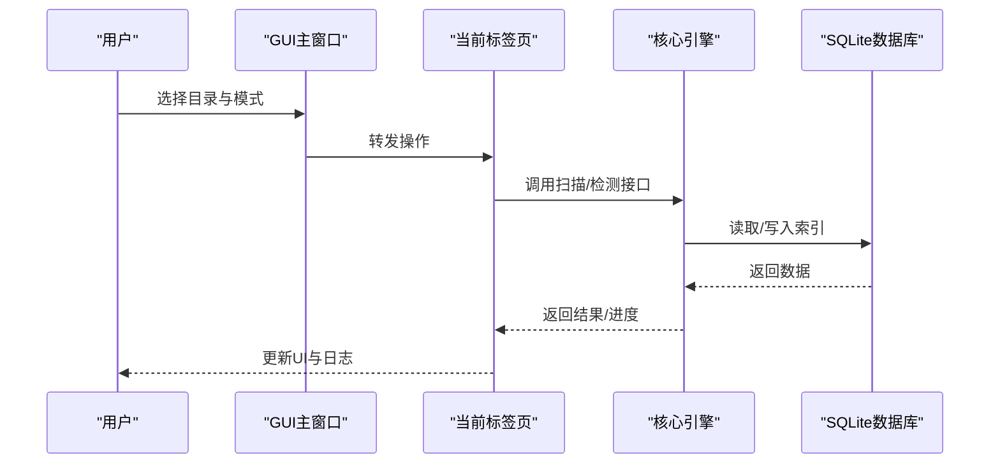
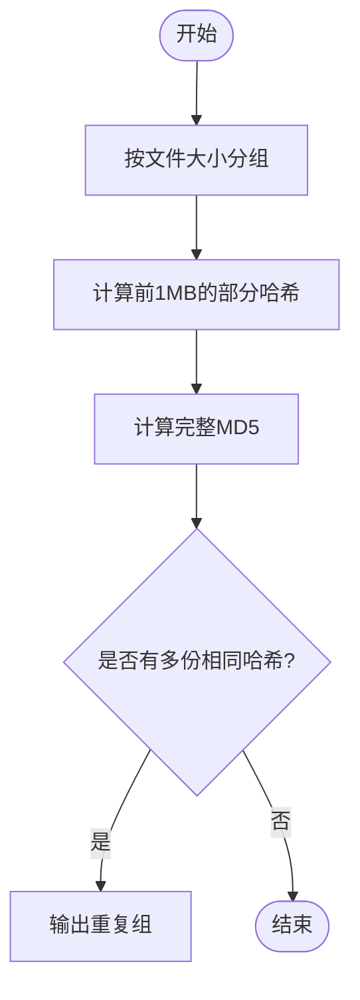
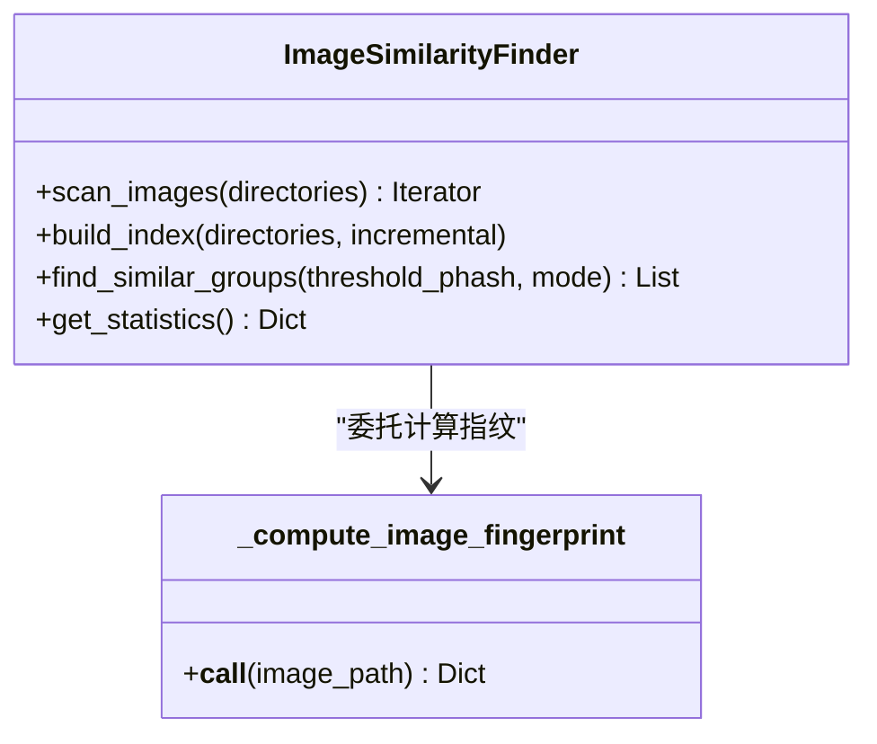
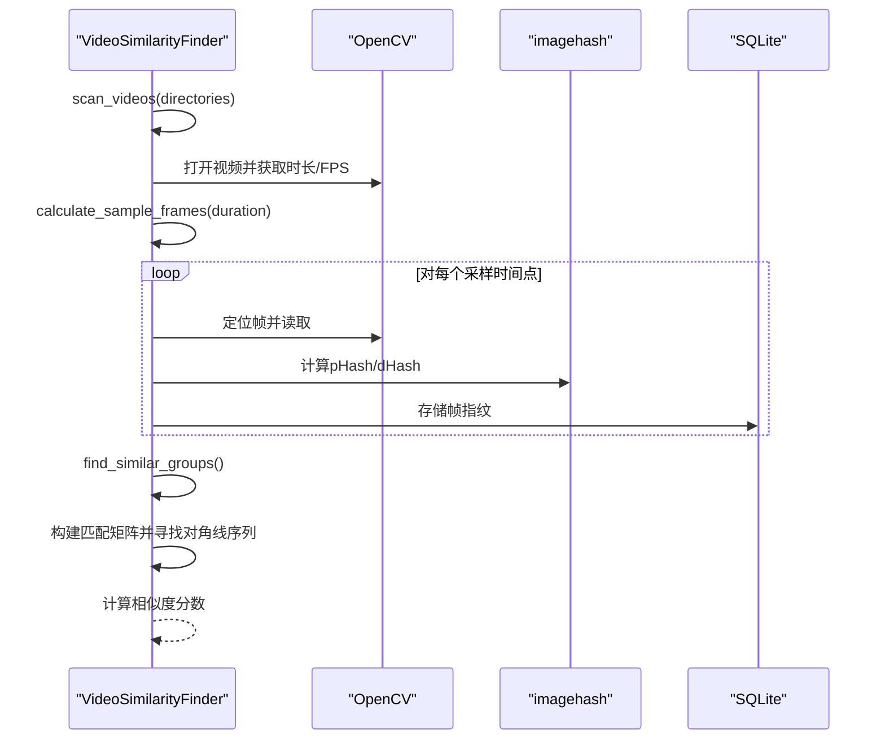
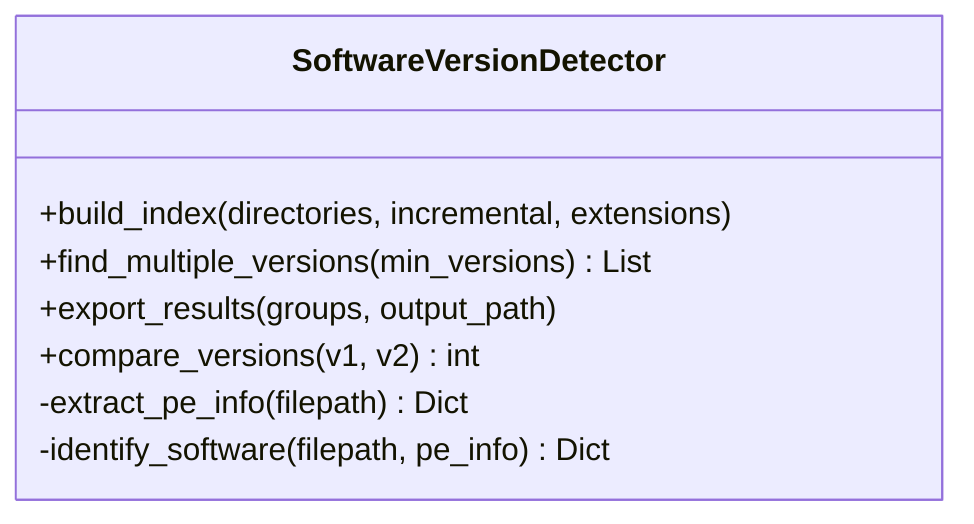
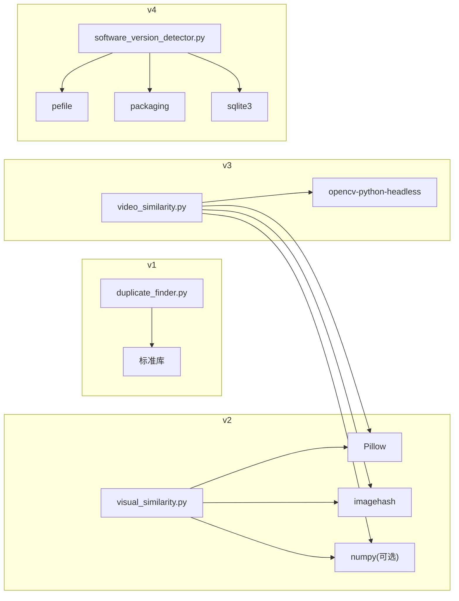

# 版本演进

<cite>
**本文引用的文件**
- [README.md](file://README.md)
- [QUICK_START.md](file://QUICK_START.md)
- [core/duplicate_finder.py](file://core/duplicate_finder.py)
- [core/visual_similarity.py](file://core/visual_similarity.py)
- [core/video_similarity.py](file://core/video_similarity.py)
- [core/software_version_detector.py](file://core/software_version_detector.py)
- [gui_modules/main_window.py](file://gui_modules/main_window.py)
- [gui_modules/software_version_tab.py](file://gui_modules/software_version_tab.py)
- [docs/IMAGE_SIMILARITY_SPEC.md](file://docs/IMAGE_SIMILARITY_SPEC.md)
- [requirements.txt](file://requirements.txt)
</cite>

## 目录
1. [引言](#引言)
2. [项目结构](#项目结构)
3. [核心组件](#核心组件)
4. [架构总览](#架构总览)
5. [详细组件分析](#详细组件分析)
6. [依赖分析](#依赖分析)
7. [性能考量](#性能考量)
8. [故障排查指南](#故障排查指南)
9. [结论](#结论)
10. [附录：版本迁移与兼容性说明](#附录版本迁移与兼容性说明)

## 引言
本文件围绕“文件重复校验工具”的版本演进，按时间顺序梳理从 v1.0 到 v4.0 的核心改进与新增功能。重点说明：
- v2.0 引入的图片相似度检测（感知哈希、差异哈希、颜色直方图三级过滤）
- v3.0 加入的视频相似度检测（关键帧序列匹配、滑动窗口与对角线序列分析）
- v4.0 新增的多版本软件检测（PE元数据提取、智能软件识别、语义化版本比较）

同时提供各版本的技术突破、解决的问题与价值，以及版本间的兼容性与迁移指南，帮助用户理解项目发展轨迹与技术积累。

## 项目结构
项目采用“核心引擎 + GUI界面”的分层组织方式：
- core：各版本的核心算法与数据处理模块
- gui_modules：基于 Tkinter 的图形界面，封装不同功能的标签页
- docs：功能规格与使用文档
- 根目录：启动脚本、构建脚本、依赖清单等

图表来源
- [gui_modules/main_window.py:62-85](file://gui_modules/main_window.py#L62-L85)
- [core/duplicate_finder.py:133-175](file://core/duplicate_finder.py#L133-L175)
- [core/visual_similarity.py:123-169](file://core/visual_similarity.py#L123-L169)
- [core/video_similarity.py:205-239](file://core/video_similarity.py#L205-L239)
- [core/software_version_detector.py:109-159](file://core/software_version_detector.py#L109-L159)

章节来源
- [README.md:338-372](file://README.md#L338-L372)
- [gui_modules/main_window.py:62-85](file://gui_modules/main_window.py#L62-L85)

## 核心组件
- v1 精确匹配：基于文件大小分组、部分哈希（前1MB）、完整MD5的三级过滤策略，多线程并行计算，SQLite WAL模式优化，支持增量扫描与结果导出。
- v2 图片相似度：pHash快速筛选、dHash二次验证、颜色直方图精确比对；多进程指纹计算；懒加载预览与缓存；阈值可调。
- v3 视频相似度：动态采样关键帧、每帧pHash+dHash、构建匹配矩阵并寻找对角线连续片段；Jaccard相似度与时间覆盖率综合评分。
- v4 多版本软件检测：PE元数据提取（ProductName/CompanyName/FileVersion），三层软件识别（PE信息优先、文件名模式匹配、路径版本号提取），packaging语义化版本比较，支持全量/增量扫描与格式过滤。

章节来源
- [core/duplicate_finder.py:25-73](file://core/duplicate_finder.py#L25-L73)
- [core/visual_similarity.py:94-121](file://core/visual_similarity.py#L94-L121)
- [core/video_similarity.py:174-203](file://core/video_similarity.py#L174-L203)
- [core/software_version_detector.py:30-96](file://core/software_version_detector.py#L30-L96)

## 架构总览
系统采用“GUI → 标签页 → 核心引擎 → 数据库”的分层架构。每个版本对应独立的数据库与引擎模块，通过GUI标签页进行统一调度与展示。

图表来源
- [gui_modules/main_window.py:165-195](file://gui_modules/main_window.py#L165-L195)
- [core/duplicate_finder.py:208-387](file://core/duplicate_finder.py#L208-L387)
- [core/visual_similarity.py:253-311](file://core/visual_similarity.py#L253-L311)
- [core/video_similarity.py:310-367](file://core/video_similarity.py#L310-L367)
- [core/software_version_detector.py:391-481](file://core/software_version_detector.py#L391-L481)

## 详细组件分析

### v1.0 精确匹配（基础版）
- 技术突破：
  - 多级过滤：文件大小 → 部分哈希（前1MB）→ 完整MD5，显著降低I/O与计算开销
  - 自适应线程数：根据磁盘类型（HDD/SSD）自动调整并发度，避免寻道风暴
  - SQLite优化：WAL模式、缓存与内存映射，提升并发写入与查询性能
- 解决问题：
  - 海量文件去重速度慢、误报高、内存占用大
- 价值：
  - 适用于备份、下载、网盘等场景的完全相同文件检测
- 关键流程（流程图）：

图表来源
- [core/duplicate_finder.py:324-387](file://core/duplicate_finder.py#L324-L387)
- [core/duplicate_finder.py:436-504](file://core/duplicate_finder.py#L436-L504)
- [core/duplicate_finder.py:506-595](file://core/duplicate_finder.py#L506-L595)

章节来源
- [core/duplicate_finder.py:75-131](file://core/duplicate_finder.py#L75-L131)
- [core/duplicate_finder.py:133-175](file://core/duplicate_finder.py#L133-L175)
- [core/duplicate_finder.py:208-387](file://core/duplicate_finder.py#L208-L387)

### v2.0 图片相似度检测（进阶版）
- 技术突破：
  - 三级过滤：pHash快速筛选 → dHash二次验证 → 颜色直方图精确比对
  - 多进程指纹计算，支持超大图片缩放处理
  - 可配置阈值（汉明距离），支持快速/精确两种模式
- 解决问题：
  - 不同尺寸、压缩质量、轻微调色导致的“非字节级重复”无法被v1捕获
- 价值：
  - 适用于照片、设计素材、网络图片的去重与整理
- 类关系图（代码级）：

图表来源
- [core/visual_similarity.py:21-91](file://core/visual_similarity.py#L21-L91)
- [core/visual_similarity.py:94-121](file://core/visual_similarity.py#L94-L121)
- [core/visual_similarity.py:241-311](file://core/visual_similarity.py#L241-L311)
- [core/visual_similarity.py:410-513](file://core/visual_similarity.py#L410-L513)

章节来源
- [core/visual_similarity.py:123-169](file://core/visual_similarity.py#L123-L169)
- [core/visual_similarity.py:253-311](file://core/visual_similarity.py#L253-L311)
- [core/visual_similarity.py:334-408](file://core/visual_similarity.py#L334-L408)
- [docs/IMAGE_SIMILARITY_SPEC.md:24-78](file://docs/IMAGE_SIMILARITY_SPEC.md#L24-L78)

### v3.0 视频相似度检测（专业版）
- 技术突破：
  - 动态采样关键帧（根据时长决定帧数）
  - 关键帧序列匹配：构建匹配矩阵，寻找对角线连续片段
  - 综合评分：Jaccard相似度 + 时间覆盖率
- 解决问题：
  - 转码、剪辑、调色后的视频难以用传统哈希或简单特征匹配
- 价值：
  - 适用于视频库去重、版权检测、内容审核与素材管理
- 序列图（关键帧提取与比对）：

图表来源
- [core/video_similarity.py:21-151](file://core/video_similarity.py#L21-L151)
- [core/video_similarity.py:154-172](file://core/video_similarity.py#L154-L172)
- [core/video_similarity.py:310-367](file://core/video_similarity.py#L310-L367)
- [core/video_similarity.py:498-545](file://core/video_similarity.py#L498-L545)
- [core/video_similarity.py:547-652](file://core/video_similarity.py#L547-L652)

章节来源
- [core/video_similarity.py:174-203](file://core/video_similarity.py#L174-L203)
- [core/video_similarity.py:205-239](file://core/video_similarity.py#L205-L239)
- [core/video_similarity.py:310-367](file://core/video_similarity.py#L310-L367)
- [core/video_similarity.py:406-496](file://core/video_similarity.py#L406-L496)

### v4.0 多版本软件检测（旗舰版）
- 技术突破：
  - PE元数据提取（ProductName/CompanyName/FileVersion）
  - 三层软件识别：PE信息优先 → 文件名模式匹配 → 路径版本号提取
  - 语义化版本比较（packaging），未知版本自动排后
  - 支持全量/增量扫描与自定义格式过滤
- 解决问题：
  - MD5相同但实际为不同版本的软件文件被错误归类为重复
- 价值：
  - 便于在TB级硬盘中清理旧版本开发工具、区分真正重复与不同版本
- 类图（代码级）：

图表来源
- [core/software_version_detector.py:30-96](file://core/software_version_detector.py#L30-L96)
- [core/software_version_detector.py:178-244](file://core/software_version_detector.py#L178-L244)
- [core/software_version_detector.py:246-316](file://core/software_version_detector.py#L246-L316)
- [core/software_version_detector.py:318-354](file://core/software_version_detector.py#L318-L354)
- [core/software_version_detector.py:391-481](file://core/software_version_detector.py#L391-L481)
- [core/software_version_detector.py:540-604](file://core/software_version_detector.py#L540-L604)

章节来源
- [core/software_version_detector.py:109-159](file://core/software_version_detector.py#L109-L159)
- [gui_modules/software_version_tab.py:272-367](file://gui_modules/software_version_tab.py#L272-L367)

## 依赖分析
- v1：仅Python标准库，无额外依赖
- v2：Pillow、imagehash、可选numpy
- v3：opencv-python-headless、Pillow、imagehash、numpy
- v4：pefile、packaging、sqlite3（内置）

图表来源
- [requirements.txt:1-32](file://requirements.txt#L1-L32)

章节来源
- [requirements.txt:1-32](file://requirements.txt#L1-L32)

## 性能考量
- 多线程/多进程：
  - v1：ThreadPoolExecutor并行计算部分/完整哈希，自适应线程数
  - v2/v3：ProcessPoolExecutor并行计算指纹，避免GIL限制
- 数据库优化：
  - WAL模式、缓存与内存映射，批量插入减少事务次数
- 懒加载与缓存：
  - 图片/视频缩略图按需加载，LRU缓存控制内存峰值
- 扫描策略：
  - v1：大小分组+部分哈希+完整哈希
  - v2：pHash快速筛选，dHash与直方图精细比对
  - v3：动态采样关键帧，对角线序列匹配
  - v4：增量扫描避免重复处理，格式过滤缩小范围

[本节为通用性能讨论，不直接分析具体文件]

## 故障排查指南
- v1：
  - 数据库锁冲突：已设置busy_timeout与WAL模式，避免“database is locked”
  - 进度计数竞态：使用线程锁保护计数器
- v2：
  - 依赖缺失：确保安装Pillow、imagehash
  - 大图片内存溢出：已做最大尺寸限制与缩放处理
- v3：
  - 依赖缺失：安装opencv-python-headless、Pillow、imagehash、numpy
  - 解码失败：检查视频编码与权限
- v4：
  - pefile/packaging未安装：提示并降级为字符串比较
  - 增量模式下未更新：确认文件哈希变化或关闭增量模式

章节来源
- [core/duplicate_finder.py:190-201](file://core/duplicate_finder.py#L190-L201)
- [core/duplicate_finder.py:436-504](file://core/duplicate_finder.py#L436-L504)
- [core/visual_similarity.py:21-91](file://core/visual_similarity.py#L21-L91)
- [core/video_similarity.py:21-151](file://core/video_similarity.py#L21-L151)
- [core/software_version_detector.py:17-27](file://core/software_version_detector.py#L17-L27)

## 结论
从v1到v4，项目逐步从“字节级精确匹配”演进到“视觉相似性检测”和“软件版本智能识别”，形成覆盖文本、图像、视频与可执行文件的完整去重与整理能力。各版本均注重性能优化与用户体验，提供GUI、增量扫描、结果导出与可视化预览等功能，适合个人与企业级大规模数据管理。

[本节为总结性内容，不直接分析具体文件]

## 附录：版本迁移与兼容性说明
- 数据库隔离：
  - v1：file_index.db
  - v2：image_similarity.db
  - v3：video_similarity.db
  - v4：software_versions.db
  - 各版本独立数据库，互不影响
- 依赖管理：
  - 若仅需v1，无需安装第三方库
  - 启用v2需安装Pillow、imagehash
  - 启用v3需额外安装opencv-python-headless
  - 启用v4需安装pefile、packaging
- 扫描模式：
  - v1/v2/v3/v4均支持全量/增量扫描；v4在全量模式下自动清空旧数据
- GUI集成：
  - 主窗口通过标签页切换不同功能，所有版本共享同一入口
- 迁移建议：
  - 首次使用建议全量扫描建立索引
  - 后续日常维护使用增量扫描，减少重复计算
  - 定期清理历史数据与压缩数据库（如VACUUM）

章节来源
- [gui_modules/main_window.py:62-85](file://gui_modules/main_window.py#L62-L85)
- [gui_modules/software_version_tab.py:322-336](file://gui_modules/software_version_tab.py#L322-L336)
- [core/duplicate_finder.py:133-175](file://core/duplicate_finder.py#L133-L175)
- [core/visual_similarity.py:123-169](file://core/visual_similarity.py#L123-L169)
- [core/video_similarity.py:205-239](file://core/video_similarity.py#L205-L239)
- [core/software_version_detector.py:109-159](file://core/software_version_detector.py#L109-L159)